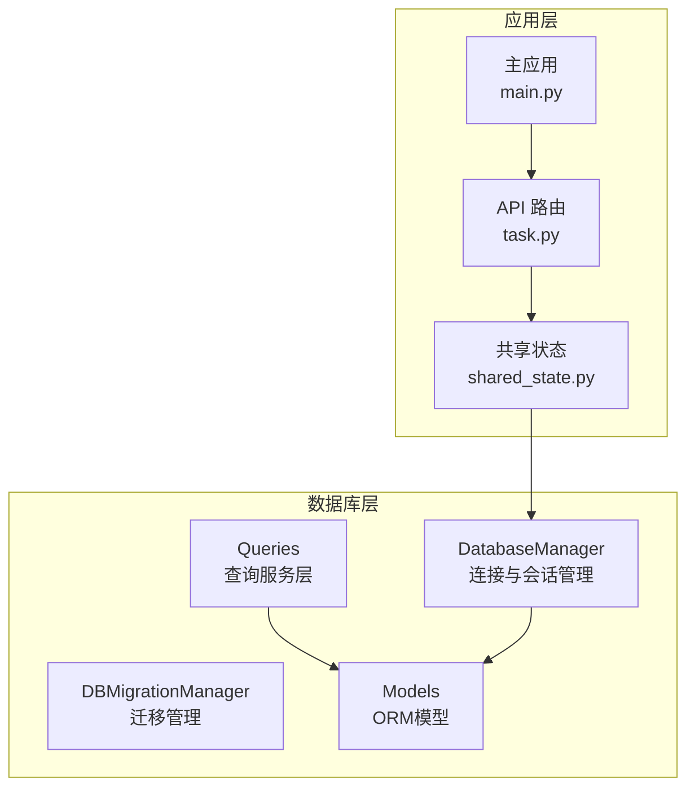
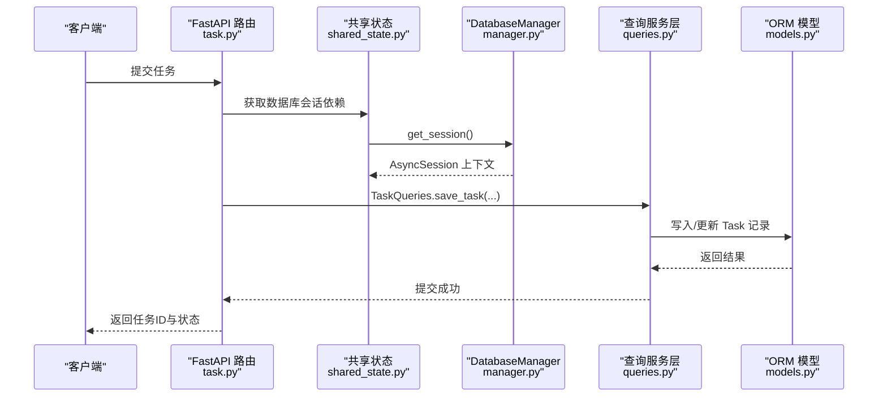
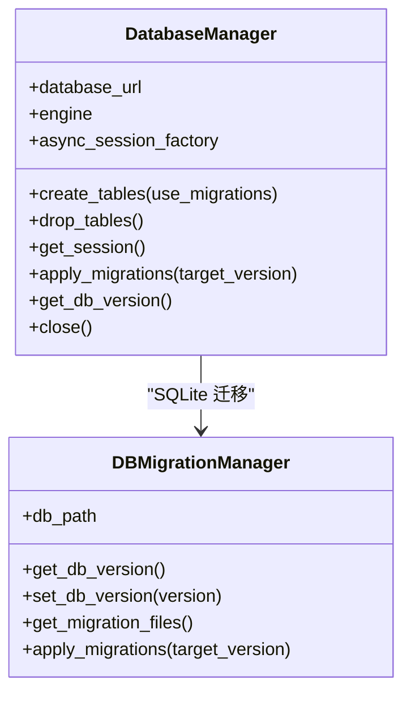
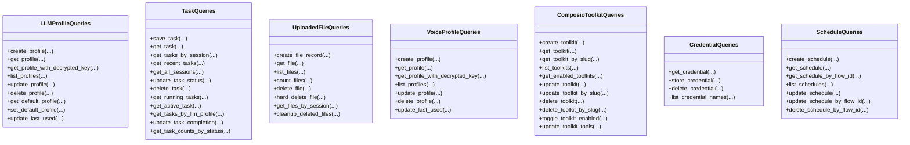
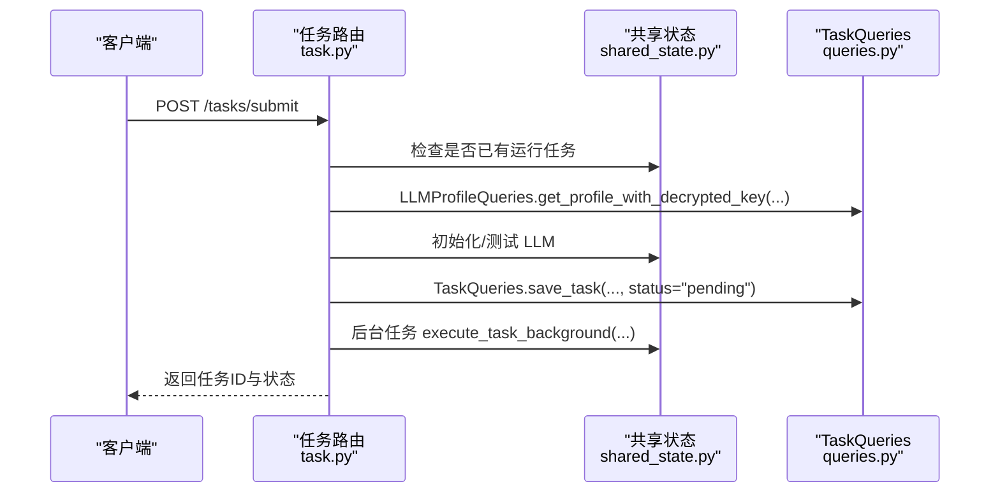
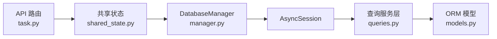

# 查询管理

<cite>
**本文引用的文件**
- [manager.py](file://vibe_surf/backend/database/manager.py)
- [queries.py](file://vibe_surf/backend/database/queries.py)
- [models.py](file://vibe_surf/backend/database/models.py)
- [schemas.py](file://vibe_surf/backend/database/schemas.py)
- [task.py](file://vibe_surf/backend/api/task.py)
- [shared_state.py](file://vibe_surf/backend/shared_state.py)
- [main.py](file://vibe_surf/backend/main.py)
</cite>

## 目录
1. [简介](#简介)
2. [项目结构](#项目结构)
3. [核心组件](#核心组件)
4. [架构总览](#架构总览)
5. [详细组件分析](#详细组件分析)
6. [依赖关系分析](#依赖关系分析)
7. [性能考虑](#性能考虑)
8. [故障排查指南](#故障排查指南)
9. [结论](#结论)
10. [附录](#附录)

## 简介
本文件系统化梳理 VibeSurf 的查询管理与数据库访问层，重点覆盖以下方面：
- 数据库查询的构建与执行模式：包含会话管理、事务处理、连接池配置与迁移机制
- 查询服务层设计：如何封装常用 CRUD 操作与复杂查询（如聚合统计）
- 性能优化策略：连接池参数、索引、查询缓存与批处理思路
- 实际查询示例：任务状态更新、代理模式查询、会话管理操作
- 错误处理与查询日志记录：统一异常捕获、回滚与日志输出

## 项目结构
后端数据库相关代码集中在 backend/database 目录，配合 API 路由与共享状态模块协同工作：
- 数据库连接与会话管理：DatabaseManager、DBMigrationManager
- ORM 模型定义：Task、LLMProfile、McpProfile、VoiceProfile、ComposioToolkit、Credential、Schedule 等
- 查询服务层：LLMProfileQueries、McpProfileQueries、TaskQueries、UploadedFileQueries、VoiceProfileQueries、ComposioToolkitQueries、CredentialQueries、ScheduleQueries
- API 层：任务提交、控制与状态查询等路由
- 共享状态：全局组件初始化、任务执行流程、数据库会话注入

图表来源
- [manager.py](file://vibe_surf/backend/database/manager.py#L148-L319)
- [queries.py](file://vibe_surf/backend/database/queries.py#L1-L200)
- [models.py](file://vibe_surf/backend/database/models.py#L1-L289)
- [task.py](file://vibe_surf/backend/api/task.py#L1-L120)
- [shared_state.py](file://vibe_surf/backend/shared_state.py#L453-L598)
- [main.py](file://vibe_surf/backend/main.py#L543-L600)

章节来源
- [manager.py](file://vibe_surf/backend/database/manager.py#L148-L319)
- [queries.py](file://vibe_surf/backend/database/queries.py#L1-L200)
- [models.py](file://vibe_surf/backend/database/models.py#L1-L289)
- [task.py](file://vibe_surf/backend/api/task.py#L1-L120)
- [shared_state.py](file://vibe_surf/backend/shared_state.py#L453-L598)
- [main.py](file://vibe_surf/backend/main.py#L543-L600)

## 核心组件
- DatabaseManager：负责异步引擎创建、表初始化、迁移、会话生命周期管理与关闭
- DBMigrationManager：SQLite 迁移管理器，支持版本读取、设置与按序应用
- 查询服务层：以静态方法封装对各模型的 CRUD 与聚合查询，统一异常处理与日志记录
- ORM 模型：定义 Task、LLMProfile、McpProfile、VoiceProfile、ComposioToolkit、Credential、Schedule 等实体及索引
- API 路由：任务提交、暂停/恢复/停止、状态查询等接口
- 共享状态：组件初始化、任务执行流程、数据库会话注入

章节来源
- [manager.py](file://vibe_surf/backend/database/manager.py#L148-L319)
- [queries.py](file://vibe_surf/backend/database/queries.py#L1-L200)
- [models.py](file://vibe_surf/backend/database/models.py#L1-L289)
- [task.py](file://vibe_surf/backend/api/task.py#L1-L120)
- [shared_state.py](file://vibe_surf/backend/shared_state.py#L453-L598)

## 架构总览
数据库访问采用异步 SQLAlchemy 引擎，通过 sessionmaker 创建 AsyncSession 工厂，结合 FastAPI 依赖注入提供请求级会话。迁移仅在 SQLite 场景启用，生产环境使用外部数据库时通过连接池参数优化并发与稳定性。

图表来源
- [task.py](file://vibe_surf/backend/api/task.py#L43-L146)
- [shared_state.py](file://vibe_surf/backend/shared_state.py#L533-L598)
- [manager.py](file://vibe_surf/backend/database/manager.py#L229-L239)
- [queries.py](file://vibe_surf/backend/database/queries.py#L441-L520)
- [models.py](file://vibe_surf/backend/database/models.py#L94-L137)

## 详细组件分析

### 数据库连接与会话管理
- 引擎配置
  - SQLite：开发场景使用 StaticPool，禁线程校验，超时设置
  - 生产数据库：使用可配置的连接池参数（pool_size、max_overflow、pool_pre_ping、pool_recycle），开启 pre_ping 与回收策略
- 表初始化与迁移
  - create_tables 支持两种路径：迁移系统或直接创建表
  - apply_migrations 仅在 SQLite 下可用，按版本号顺序应用 SQL 迁移脚本
  - get_db_version 读取 PRAGMA user_version
- 会话生命周期
  - get_session 使用上下文管理器，自动 commit/rollback/flush/close
  - FastAPI 依赖 get_db_session 注入到路由中
- 关闭与清理
  - close dispose 引擎，释放连接资源

图表来源
- [manager.py](file://vibe_surf/backend/database/manager.py#L148-L319)

章节来源
- [manager.py](file://vibe_surf/backend/database/manager.py#L148-L319)

### 查询服务层设计
- 统一异常与日志
  - 所有查询方法均在 try/except 中捕获异常，并记录错误日志后重新抛出
- 常用 CRUD 封装
  - LLMProfileQueries/McpProfileQueries/VoiceProfileQueries：创建、查询、列表、更新、删除、默认配置、最近使用时间更新
  - TaskQueries：保存任务、按 ID/会话/LLM 配置查询、运行中任务、最近任务、会话聚合统计、状态更新、计数统计
  - UploadedFileQueries：软删、硬删、分页列表、计数、按会话查询、清理过期已删记录
  - ComposioToolkitQueries/CredentialQueries/ScheduleQueries：工具包启用切换、凭据加解密存储、计划任务创建/更新/查询
- 复杂查询示例
  - 会话聚合统计：按 session_id 分组，聚合任务数量、创建时间、最后活动时间、最新状态
  - 任务计数统计：按状态分组计数
- 会话管理操作
  - 任务状态更新：根据状态自动设置 started_at/completed_at
  - 会话查询：按会话分页列出任务与元数据

图表来源
- [queries.py](file://vibe_surf/backend/database/queries.py#L1-L800)
- [queries.py](file://vibe_surf/backend/database/queries.py#L800-L1683)

章节来源
- [queries.py](file://vibe_surf/backend/database/queries.py#L1-L800)
- [queries.py](file://vibe_surf/backend/database/queries.py#L800-L1683)

### ORM 模型与索引
- 主要实体
  - Task：任务记录，包含会话ID、描述、状态、LLM 配置名、上传文件路径、工作空间目录、MCP 配置、代理模式、结果、错误信息、报告路径、时间戳与元数据
  - LLMProfile：LLM 配置档案，含提供商、模型、基础URL、加密API Key、参数与默认标记
  - McpProfile：MCP 服务器配置档案
  - VoiceProfile：语音模型配置档案
  - ComposioToolkit：集成工具包配置
  - Credential：加密凭据
  - Schedule：工作流调度
- 索引
  - 对 LLMProfile、Task、McpProfile、VoiceProfile、ComposioToolkit、Credential、Schedule 建立常用查询字段索引，提升分页、过滤与排序性能

章节来源
- [models.py](file://vibe_surf/backend/database/models.py#L1-L289)

### API 路由与会话管理
- 任务提交
  - 校验是否已有运行中的任务
  - 从数据库加载 LLM 配置并测试连通性
  - 生成任务ID，写入初始任务记录，后台任务启动执行
- 任务控制
  - 暂停/恢复/停止：调用共享状态中的代理对象进行控制，并同步更新任务状态
- 状态查询
  - 快速检查与详细状态返回，包含代理状态与进度信息

图表来源
- [task.py](file://vibe_surf/backend/api/task.py#L43-L146)
- [shared_state.py](file://vibe_surf/backend/shared_state.py#L118-L233)
- [queries.py](file://vibe_surf/backend/database/queries.py#L441-L520)

章节来源
- [task.py](file://vibe_surf/backend/api/task.py#L1-L379)
- [shared_state.py](file://vibe_surf/backend/shared_state.py#L118-L233)

## 依赖关系分析
- 会话注入
  - FastAPI 依赖 get_db_session 从共享状态的 DatabaseManager 获取 AsyncSession
- 组件初始化
  - initialize_vibesurf_components 中创建 DatabaseManager 并初始化表
- 查询链路
  - API 路由 -> 共享状态 -> DatabaseManager.get_session -> 查询服务层 -> ORM 模型

图表来源
- [task.py](file://vibe_surf/backend/api/task.py#L1-L120)
- [shared_state.py](file://vibe_surf/backend/shared_state.py#L533-L598)
- [manager.py](file://vibe_surf/backend/database/manager.py#L229-L239)
- [queries.py](file://vibe_surf/backend/database/queries.py#L1-L200)
- [models.py](file://vibe_surf/backend/database/models.py#L1-L289)

章节来源
- [task.py](file://vibe_surf/backend/api/task.py#L1-L120)
- [shared_state.py](file://vibe_surf/backend/shared_state.py#L533-L598)
- [manager.py](file://vibe_surf/backend/database/manager.py#L229-L239)
- [queries.py](file://vibe_surf/backend/database/queries.py#L1-L200)
- [models.py](file://vibe_surf/backend/database/models.py#L1-L289)

## 性能考虑
- 连接池配置
  - 生产数据库：pool_size、max_overflow、pool_pre_ping、pool_recycle，建议结合业务并发与数据库承载能力调整
  - SQLite：开发场景使用 StaticPool，注意单线程限制
- 索引优化
  - 在高频过滤/排序字段建立索引，如 Task.status、Task.session_id、LLMProfile.is_active/is_default/provider 等
- 查询优化
  - 使用分页与偏移（limit/offset）避免一次性拉取大量数据
  - 聚合查询使用 group_by 与 count，减少应用侧计算
  - 对于复杂关联查询，优先在数据库层面完成（如会话聚合统计）
- 批量与缓存
  - 批量操作：在服务层使用批量删除/更新语句，减少往返次数
  - 查询缓存：当前未见显式 ORM 查询缓存实现，可在应用层引入轻量缓存（如内存缓存）以降低热点查询压力
- 日志与可观测性
  - 统一日志格式与级别，便于定位慢查询与异常
  - 可结合 OpenTelemetry 对关键路径进行埋点

[本节为通用指导，不直接分析具体文件]

## 故障排查指南
- 迁移失败
  - 现象：SQLite 初始化失败或迁移中断
  - 排查：查看迁移日志与目标版本；必要时降级到直接建表路径
- 会话异常
  - 现象：提交任务时报错或会话未正确关闭
  - 排查：确认 get_session 上下文是否正常 commit/rollback；检查异常处理器是否捕获并记录
- 查询超时
  - 现象：大分页或复杂聚合查询耗时较长
  - 排查：增加索引、优化分页策略、拆分查询或引入缓存
- 凭据与加密
  - 现象：凭据无法解密或 API Key 存储异常
  - 排查：确认加密算法与密钥一致性；检查 Credential 表字段与解密流程

章节来源
- [manager.py](file://vibe_surf/backend/database/manager.py#L87-L146)
- [queries.py](file://vibe_surf/backend/database/queries.py#L1345-L1430)

## 结论
VibeSurf 的查询管理以异步 SQLAlchemy 为核心，通过 DatabaseManager 提供稳定的连接与会话管理，查询服务层以静态方法封装 CRUD 与复杂查询，配合索引与分页策略满足单任务执行模型下的性能需求。建议在生产环境中进一步完善查询缓存、慢查询监控与连接池参数调优，确保高并发与长尾查询的稳定性。

[本节为总结性内容，不直接分析具体文件]

## 附录

### 实际查询示例（路径引用）
- 任务状态更新
  - [update_task_status](file://vibe_surf/backend/database/queries.py#L614-L648)
  - [update_task_completion](file://vibe_surf/backend/database/queries.py#L705-L734)
- 代理模式查询
  - [get_tasks_by_llm_profile](file://vibe_surf/backend/database/queries.py#L684-L703)
- 会话管理操作
  - [get_all_sessions](file://vibe_surf/backend/database/queries.py#L571-L612)
  - [get_tasks_by_session](file://vibe_surf/backend/database/queries.py#L535-L554)
- 文件管理
  - [list_files](file://vibe_surf/backend/database/queries.py#L806-L838)
  - [get_files_by_session](file://vibe_surf/backend/database/queries.py#L888-L914)
  - [cleanup_deleted_files](file://vibe_surf/backend/database/queries.py#L916-L932)
- 任务计数统计
  - [get_task_counts_by_status](file://vibe_surf/backend/database/queries.py#L736-L753)

### 错误处理与日志记录
- 统一异常捕获与日志输出
  - [LLMProfileQueries](file://vibe_surf/backend/database/queries.py#L21-L110)
  - [TaskQueries](file://vibe_surf/backend/database/queries.py#L441-L520)
  - [UploadedFileQueries](file://vibe_surf/backend/database/queries.py#L755-L838)
  - [VoiceProfileQueries](file://vibe_surf/backend/database/queries.py#L934-L1030)
  - [ComposioToolkitQueries](file://vibe_surf/backend/database/queries.py#L1122-L1343)
  - [CredentialQueries](file://vibe_surf/backend/database/queries.py#L1345-L1430)
  - [ScheduleQueries](file://vibe_surf/backend/database/queries.py#L1432-L1599)
- 会话生命周期与异常回滚
  - [get_session](file://vibe_surf/backend/database/manager.py#L229-L239)