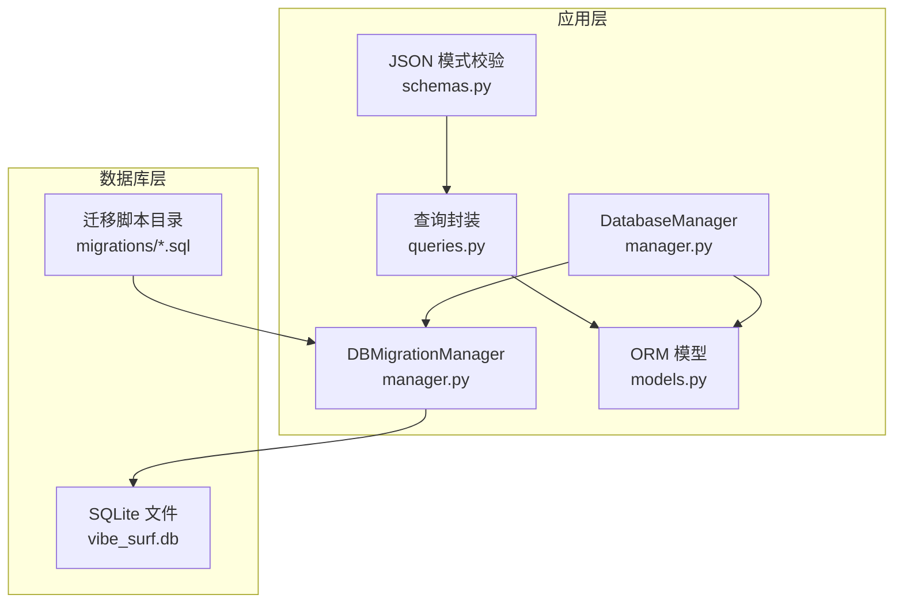
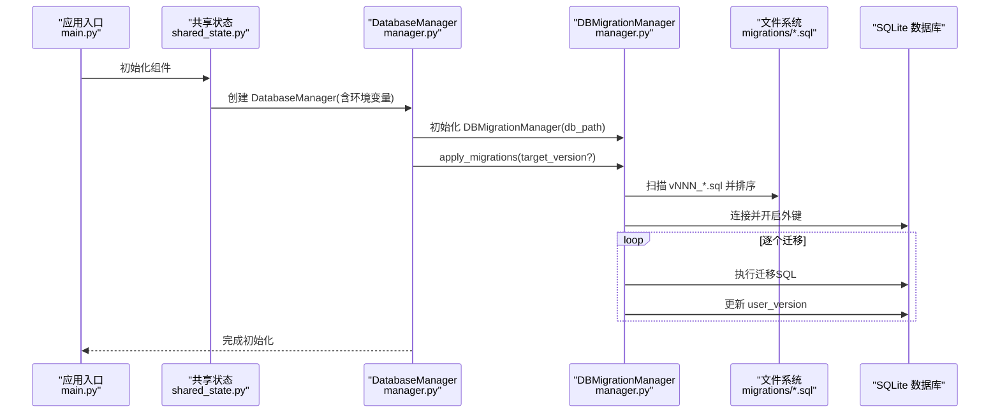
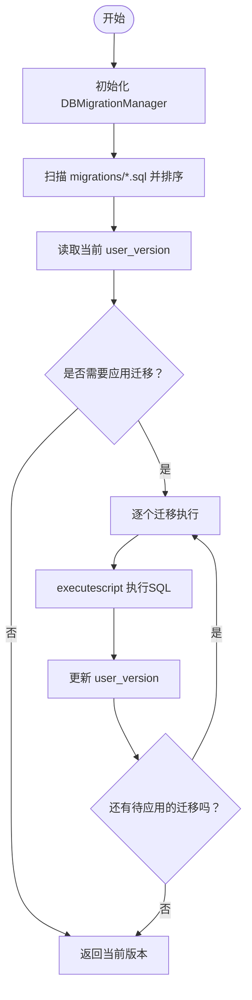

# 迁移管理

<cite>
**本文引用的文件**
- [v001_initial_schema.sql](file://vibe_surf/backend/database/migrations/v001_initial_schema.sql)
- [v002_add_agent_mode.sql](file://vibe_surf/backend/database/migrations/v002_add_agent_mode.sql)
- [v003_fix_task_status_case.sql](file://vibe_surf/backend/database/migrations/v003_fix_task_status_case.sql)
- [v004_add_voice_profiles.sql](file://vibe_surf/backend/database/migrations/v004_add_voice_profiles.sql)
- [v005_add_composio_integration.sql](file://vibe_surf/backend/database/migrations/v005_add_composio_integration.sql)
- [v006_add_credentials_table.sql](file://vibe_surf/backend/database/migrations/v006_add_credentials_table.sql)
- [v007_add_schedule_table.sql](file://vibe_surf/backend/database/migrations/v007_add_schedule_table.sql)
- [manager.py](file://vibe_surf/backend/database/manager.py)
- [models.py](file://vibe_surf/backend/database/models.py)
- [queries.py](file://vibe_surf/backend/database/queries.py)
- [schemas.py](file://vibe_surf/backend/database/schemas.py)
- [shared_state.py](file://vibe_surf/backend/shared_state.py)
- [main.py](file://vibe_surf/backend/main.py)
</cite>

## 目录
1. [简介](#简介)
2. [项目结构](#项目结构)
3. [核心组件](#核心组件)
4. [架构总览](#架构总览)
5. [详细组件分析](#详细组件分析)
6. [依赖关系分析](#依赖关系分析)
7. [性能考量](#性能考量)
8. [故障排查指南](#故障排查指南)
9. [结论](#结论)
10. [附录：命令与最佳实践](#附录命令与最佳实践)

## 简介
本文件系统化梳理 VibeSurf 的数据库迁移管理，围绕基于 SQLite 的自定义迁移方案（非 SQLAlchemy Migrate）进行说明。文档覆盖迁移脚本的创建、应用与回滚机制，逐个版本的变更目标与影响范围，以及在实际业务中的应用方式（如任务状态修复、语音配置文件、Composio 集成、凭证表与计划表）。同时给出迁移最佳实践、常见问题与排障建议，并提供可直接参考的命令示例路径与实现位置。

## 项目结构
VibeSurf 的数据库迁移采用“版本化 SQL 脚本 + 自定义迁移管理器”的轻量方案：
- 迁移脚本位于 backend/database/migrations，命名规范为 vNNN_description.sql
- 迁移执行由 DatabaseManager 内部的 DBMigrationManager 负责
- 数据库模型以 SQLAlchemy ORM 模型存在，但迁移阶段使用原生 SQL 脚本；运行期通过 ORM 模型进行读写

图表来源
- [manager.py](file://vibe_surf/backend/database/manager.py#L1-L319)
- [models.py](file://vibe_surf/backend/database/models.py#L1-L289)
- [queries.py](file://vibe_surf/backend/database/queries.py#L1-L800)
- [schemas.py](file://vibe_surf/backend/database/schemas.py#L1-L100)

章节来源
- [manager.py](file://vibe_surf/backend/database/manager.py#L1-L319)
- [models.py](file://vibe_surf/backend/database/models.py#L1-L289)

## 核心组件
- DBMigrationManager：负责扫描迁移脚本、按序应用、维护 user_version 版本号
- DatabaseManager：统一数据库连接、会话管理；在 SQLite 场景下启用 DBMigrationManager 并支持迁移应用
- 迁移脚本：按版本顺序执行，每个脚本独立完成自身变更
- ORM 模型与查询封装：用于运行期的数据访问与业务逻辑

章节来源
- [manager.py](file://vibe_surf/backend/database/manager.py#L27-L146)
- [manager.py](file://vibe_surf/backend/database/manager.py#L148-L319)
- [models.py](file://vibe_surf/backend/database/models.py#L1-L289)
- [queries.py](file://vibe_surf/backend/database/queries.py#L1-L800)

## 架构总览
迁移流程从应用启动或显式调用开始，DatabaseManager 在 SQLite 场景下初始化 DBMigrationManager，并根据当前 user_version 与脚本版本决定需要应用的迁移集合，逐个执行并更新版本号。

图表来源
- [main.py](file://vibe_surf/backend/main.py#L1-L200)
- [shared_state.py](file://vibe_surf/backend/shared_state.py#L453-L611)
- [manager.py](file://vibe_surf/backend/database/manager.py#L99-L146)

## 详细组件分析

### 迁移脚本与版本演进
- v001_initial_schema.sql：创建初始模式，包含 LLM 配置、任务、上传文件、MCP 配置等表及索引、触发器
- v002_add_agent_mode.sql：为 tasks 表增加 agent_mode 列，默认值为 thinking
- v003_fix_task_status_case.sql：将任务状态枚举值统一为小写，修复大小写不一致问题
- v004_add_voice_profiles.sql：新增 voice_profiles 表，支持语音模型配置与索引、触发器
- v005_add_composio_integration.sql：新增 composio_toolkits 表，支持 Composio 工具包管理
- v006_add_credentials_table.sql：新增 credentials 表，统一存储加密凭据
- v007_add_schedule_table.sql：新增 schedules 表，支持工作流定时调度

章节来源
- [v001_initial_schema.sql](file://vibe_surf/backend/database/migrations/v001_initial_schema.sql#L1-L118)
- [v002_add_agent_mode.sql](file://vibe_surf/backend/database/migrations/v002_add_agent_mode.sql#L1-L6)
- [v003_fix_task_status_case.sql](file://vibe_surf/backend/database/migrations/v003_fix_task_status_case.sql#L1-L11)
- [v004_add_voice_profiles.sql](file://vibe_surf/backend/database/migrations/v004_add_voice_profiles.sql#L1-L35)
- [v005_add_composio_integration.sql](file://vibe_surf/backend/database/migrations/v005_add_composio_integration.sql#L1-L33)
- [v006_add_credentials_table.sql](file://vibe_surf/backend/database/migrations/v006_add_credentials_table.sql#L1-L26)
- [v007_add_schedule_table.sql](file://vibe_surf/backend/database/migrations/v007_add_schedule_table.sql#L1-L29)

### 迁移管理器与应用流程
- DBMigrationManager
  - 解析数据库路径（仅支持 SQLite）
  - 通过 PRAGMA user_version 读取/设置当前版本
  - 扫描 migrations 目录，按版本号排序
  - 使用 executescript 执行单个迁移脚本，失败时抛出异常
- DatabaseManager
  - 在 SQLite 场景自动注入 DBMigrationManager
  - create_tables 可选择走迁移或直接建表
  - 提供 apply_migrations 与 get_db_version 接口

图表来源
- [manager.py](file://vibe_surf/backend/database/manager.py#L55-L146)

章节来源
- [manager.py](file://vibe_surf/backend/database/manager.py#L27-L146)
- [manager.py](file://vibe_surf/backend/database/manager.py#L148-L319)

### 数据模型与迁移一致性
- ORM 模型与迁移脚本保持一致：迁移脚本负责创建/修改表结构，ORM 模型用于运行期读写
- 重要字段与约束（如任务状态枚举、索引、触发器）在迁移脚本中明确声明，确保数据库层面的一致性
- 运行期通过 queries.py 封装对模型的操作，避免直接拼接 SQL

章节来源
- [models.py](file://vibe_surf/backend/database/models.py#L1-L289)
- [queries.py](file://vibe_surf/backend/database/queries.py#L1-L800)

### 迁移变更目的与影响
- 初始模式创建（v001）：奠定任务执行、LLM 配置、文件上传、MCP 配置的基础表结构与索引
- 代理模式添加（v002）：引入 agent_mode 字段，支持不同执行模式
- 任务状态修复（v003）：统一状态大小写，保证与枚举一致
- 语音配置文件添加（v004）：新增 voice_profiles 表，支撑语音识别/合成能力
- Composio 集成（v005）：新增 composio_toolkits 表，便于工具包管理
- 凭证表添加（v006）：新增 credentials 表，集中管理加密凭据
- 计划表添加（v007）：新增 schedules 表，支持工作流定时调度

章节来源
- [v001_initial_schema.sql](file://vibe_surf/backend/database/migrations/v001_initial_schema.sql#L1-L118)
- [v002_add_agent_mode.sql](file://vibe_surf/backend/database/migrations/v002_add_agent_mode.sql#L1-L6)
- [v003_fix_task_status_case.sql](file://vibe_surf/backend/database/migrations/v003_fix_task_status_case.sql#L1-L11)
- [v004_add_voice_profiles.sql](file://vibe_surf/backend/database/migrations/v004_add_voice_profiles.sql#L1-L35)
- [v005_add_composio_integration.sql](file://vibe_surf/backend/database/migrations/v005_add_composio_integration.sql#L1-L33)
- [v006_add_credentials_table.sql](file://vibe_surf/backend/database/migrations/v006_add_credentials_table.sql#L1-L26)
- [v007_add_schedule_table.sql](file://vibe_surf/backend/database/migrations/v007_add_schedule_table.sql#L1-L29)

## 依赖关系分析
- 迁移脚本之间无显式依赖，按版本顺序执行即可
- 运行期 ORM 模型与迁移脚本需保持一致，否则可能出现字段缺失或类型不匹配
- 查询封装依赖 ORM 模型，确保业务层与数据层解耦

图表来源
- [models.py](file://vibe_surf/backend/database/models.py#L1-L289)
- [queries.py](file://vibe_surf/backend/database/queries.py#L1-L800)
- [manager.py](file://vibe_surf/backend/database/manager.py#L1-L319)

章节来源
- [models.py](file://vibe_surf/backend/database/models.py#L1-L289)
- [queries.py](file://vibe_surf/backend/database/queries.py#L1-L800)
- [manager.py](file://vibe_surf/backend/database/manager.py#L1-L319)

## 性能考量
- 迁移阶段使用 executescript 一次性执行整个脚本，减少多次往返开销
- 迁移脚本内显式创建索引与触发器，提升查询与审计效率
- 运行期通过 ORM 模型与查询封装进行数据访问，避免手写复杂 SQL 带来的性能波动
- SQLite 场景下，user_version 作为轻量级版本标记，避免额外元数据表

[本节为通用指导，无需列出具体文件来源]

## 故障排查指南
- 迁移失败
  - 现象：应用启动时报错，提示某版本迁移失败
  - 处理：检查对应迁移脚本是否存在语法错误；确认数据库路径正确；查看日志定位具体错误
  - 参考实现位置：[manager.py](file://vibe_surf/backend/database/manager.py#L120-L146)
- 版本不一致
  - 现象：user_version 与脚本版本不匹配
  - 处理：确认迁移脚本命名与版本号一致；必要时手动修正 user_version 或重新执行迁移
  - 参考实现位置：[manager.py](file://vibe_surf/backend/database/manager.py#L55-L70)
- 非 SQLite 环境
  - 现象：迁移管理器不可用
  - 处理：仅 SQLite 支持迁移；生产环境请使用其他迁移方案或直接建表
  - 参考实现位置：[manager.py](file://vibe_surf/backend/database/manager.py#L192-L201)
- 启动未初始化数据库
  - 现象：调用数据库接口时报未初始化
  - 处理：先调用初始化流程，确保 DatabaseManager 已创建并应用迁移
  - 参考实现位置：[shared_state.py](file://vibe_surf/backend/shared_state.py#L453-L611)，[main.py](file://vibe_surf/backend/main.py#L1-L200)

章节来源
- [manager.py](file://vibe_surf/backend/database/manager.py#L55-L146)
- [manager.py](file://vibe_surf/backend/database/manager.py#L192-L201)
- [shared_state.py](file://vibe_surf/backend/shared_state.py#L453-L611)
- [main.py](file://vibe_surf/backend/main.py#L1-L200)

## 结论
VibeSurf 的数据库迁移采用“版本化 SQL + 自定义迁移管理器”的轻量方案，适合 SQLite 开发/单机场景。通过严格的版本命名、逐脚本执行与 user_version 维护，确保了迁移过程的可控与可观测。配合 ORM 模型与查询封装，既满足了快速迭代的需求，也保证了运行期的稳定与一致性。

[本节为总结性内容，无需列出具体文件来源]

## 附录：命令与最佳实践

### 命令示例（参考实现位置）
- 应用全部迁移
  - 路径参考：[manager.py](file://vibe_surf/backend/database/manager.py#L241-L257)
  - 说明：在 SQLite 场景下调用 apply_migrations，内部会自动扫描并按序执行
- 获取当前数据库版本
  - 路径参考：[manager.py](file://vibe_surf/backend/database/manager.py#L258-L269)
  - 说明：通过 PRAGMA user_version 返回当前版本
- 初始化数据库（含迁移）
  - 路径参考：[shared_state.py](file://vibe_surf/backend/shared_state.py#L453-L611)，[main.py](file://vibe_surf/backend/main.py#L1-L200)
  - 说明：初始化组件时会创建 DatabaseManager 并调用 create_tables(use_migrations=True)

### 最佳实践
- 版本命名与脚本命名保持一致，严格遵循 vNNN_description.sql 规范
- 每个迁移脚本应自包含，避免跨版本依赖；如需数据迁移，尽量在同脚本内完成
- 对关键表添加必要的索引与触发器，确保查询与审计性能
- 在生产环境优先考虑成熟的迁移框架；若仍使用 SQLite，请确保 user_version 与脚本版本一致
- 对于敏感字段（如 API Key），迁移脚本中仅做结构设计，实际值通过加密存储与安全流程管理

[本节为通用指导，无需列出具体文件来源]