# 核心架构

<cite>
**本文档引用的文件**  
- [shared_state.py](file://vibe_surf/backend/shared_state.py)
- [llm_factory.py](file://vibe_surf/backend/utils/llm_factory.py)
- [main.py](file://vibe_surf/backend/main.py)
- [browser_manager.py](file://vibe_surf/browser/browser_manager.py)
- [background.js](file://vibe_surf/chrome_extension/background.js)
- [vibe_surf_agent.py](file://vibe_surf/agents/vibe_surf_agent.py)
- [task.py](file://vibe_surf/backend/api/task.py)
- [vibesurf_tools.py](file://vibe_surf/tools/vibesurf_tools.py)
- [App.tsx](file://vibe_surf/frontend/src/App.tsx)
- [event_manager.py](file://vibe_surf/langflow/events/event_manager.py)
- [service.py](file://vibe_surf/langflow/services/state/service.py)
</cite>

## 目录
1. [项目结构](#项目结构)
2. [系统架构概述](#系统架构概述)
3. [数据流路径分析](#数据流路径分析)
4. [关键设计模式](#关键设计模式)
5. [高可用性与可扩展性](#高可用性与可扩展性)
6. [组件间松耦合设计](#组件间松耦合设计)

## 项目结构

VibeSurf项目采用模块化设计，主要分为前端、后端、浏览器管理、Chrome扩展和工具组件等核心模块。项目结构清晰，各模块职责分明，便于维护和扩展。

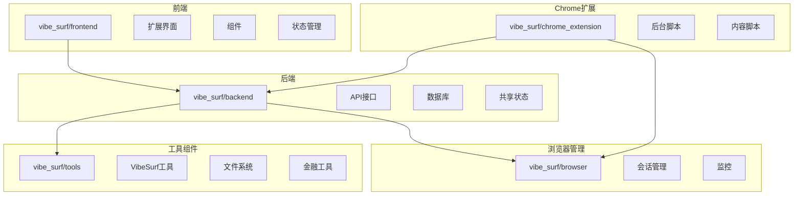

**Diagram sources**
- [main.py](file://vibe_surf/backend/main.py#L33-590)
- [App.tsx](file://vibe_surf/frontend/src/App.tsx#L1-23)
- [background.js](file://vibe_surf/chrome_extension/background.js#L1-908)

**Section sources**
- [main.py](file://vibe_surf/backend/main.py#L1-794)
- [App.tsx](file://vibe_surf/frontend/src/App.tsx#L1-23)

## 系统架构概述

VibeSurf系统采用分层架构设计，包含前端用户界面、后端API服务、代理系统和浏览器管理组件。系统通过Chrome扩展与用户交互，后端API处理业务逻辑，代理系统执行具体任务，浏览器管理组件控制浏览器行为。

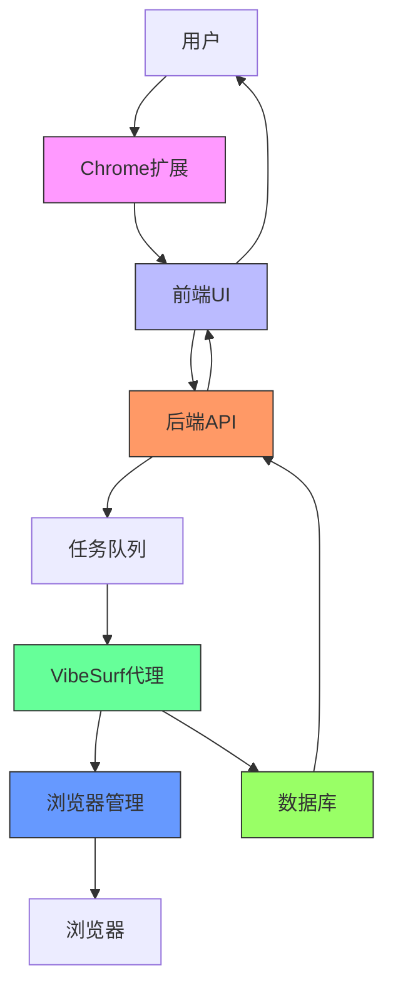

**Diagram sources**
- [main.py](file://vibe_surf/backend/main.py#L33-590)
- [vibe_surf_agent.py](file://vibe_surf/agents/vibe_surf_agent.py#L1-1840)
- [browser_manager.py](file://vibe_surf/browser/browser_manager.py#L1-269)

**Section sources**
- [main.py](file://vibe_surf/backend/main.py#L1-794)
- [vibe_surf_agent.py](file://vibe_surf/agents/vibe_surf_agent.py#L1-1840)

## 数据流路径分析

VibeSurf系统的数据流路径从用户输入开始，经过Chrome扩展传递到前端UI，再通过后端API进入任务队列，由VibeSurf代理执行，最终将结果存储到数据库并返回前端显示。

### 用户输入到前端UI

用户通过Chrome扩展输入指令，扩展将数据传递给前端UI进行展示和处理。

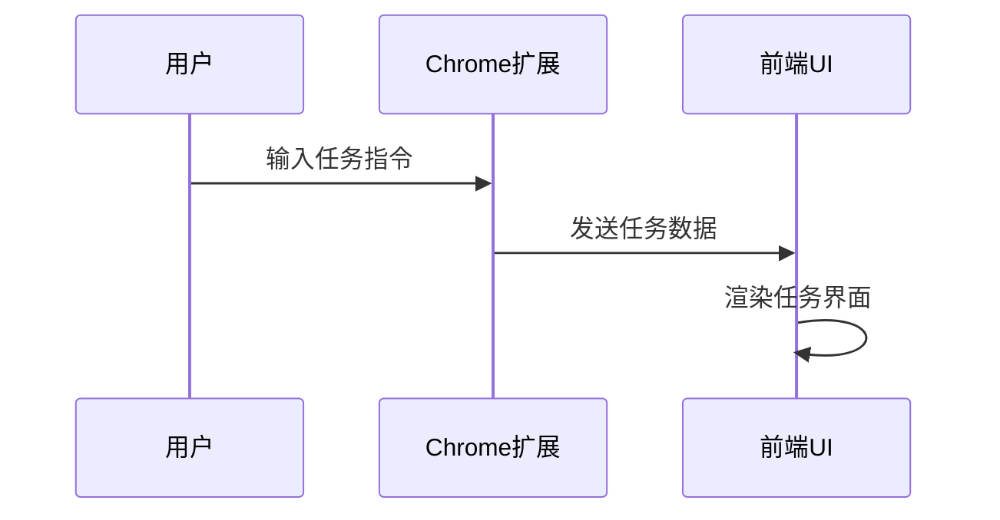

**Diagram sources**
- [background.js](file://vibe_surf/chrome_extension/background.js#L1-908)
- [App.tsx](file://vibe_surf/frontend/src/App.tsx#L1-23)

### 前端UI到后端API

前端UI将用户任务提交到后端API，API接收并验证任务数据。

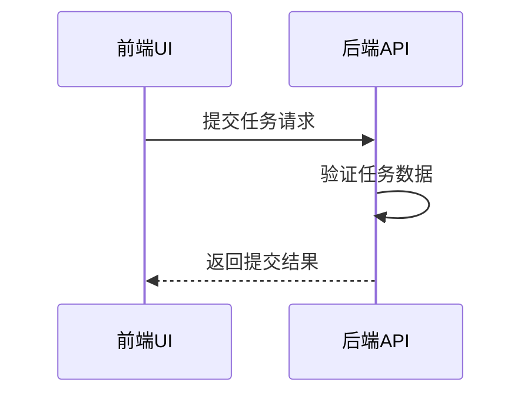

**Diagram sources**
- [task.py](file://vibe_surf/backend/api/task.py#L1-379)
- [App.tsx](file://vibe_surf/frontend/src/App.tsx#L1-23)

### 后端API到任务队列

后端API将验证通过的任务放入任务队列，等待代理系统处理。

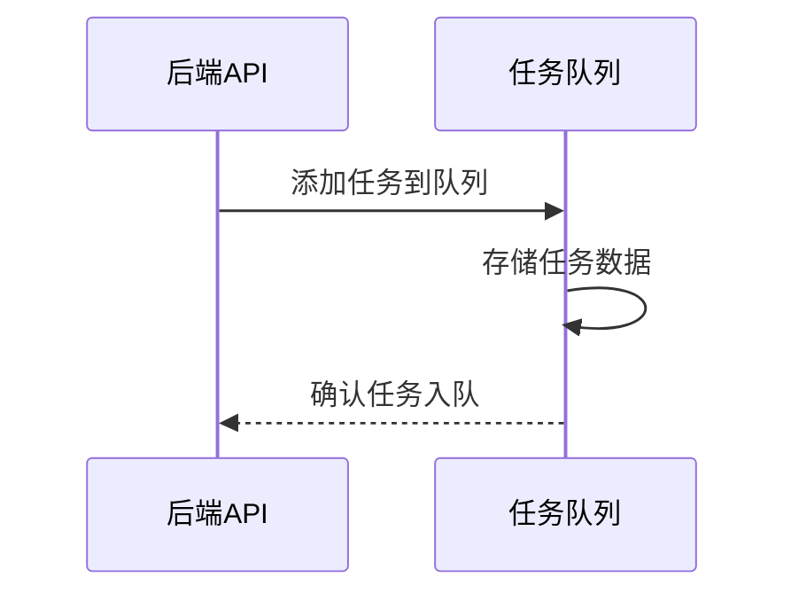

**Diagram sources**
- [task.py](file://vibe_surf/backend/api/task.py#L1-379)
- [shared_state.py](file://vibe_surf/backend/shared_state.py#L1-1111)

### 任务队列到VibeSurf代理

VibeSurf代理从任务队列中获取任务并执行，包括调用各种工具和浏览器操作。

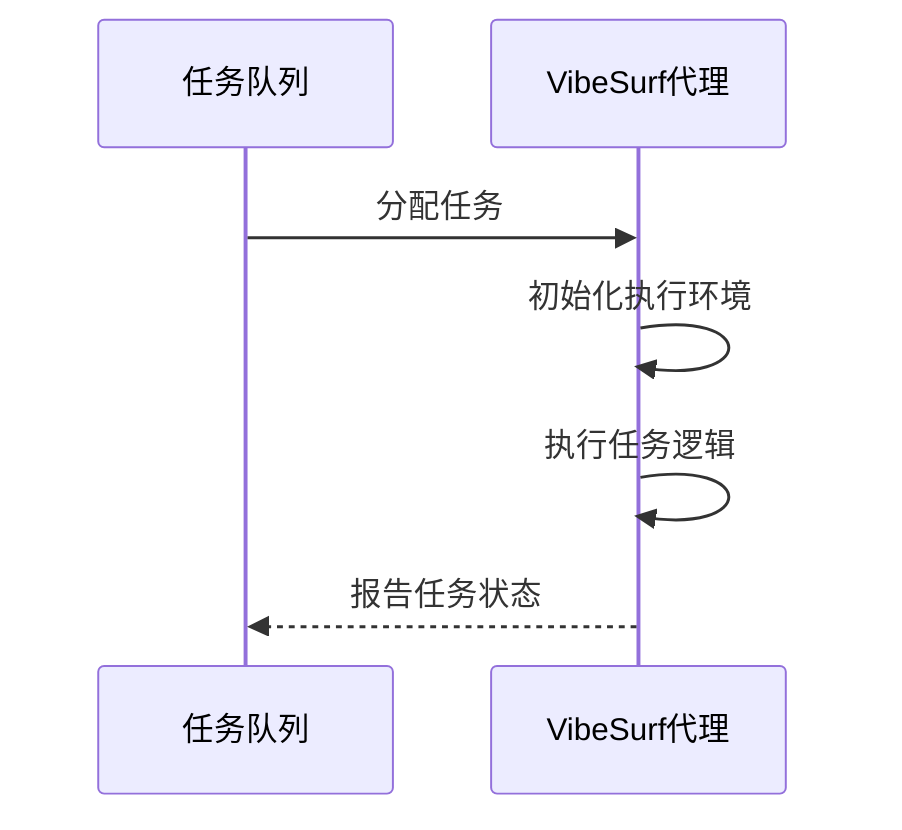

**Diagram sources**
- [vibe_surf_agent.py](file://vibe_surf/agents/vibe_surf_agent.py#L1-1840)
- [shared_state.py](file://vibe_surf/backend/shared_state.py#L1-1111)

### VibeSurf代理到浏览器管理

VibeSurf代理调用浏览器管理组件执行具体的浏览器操作。

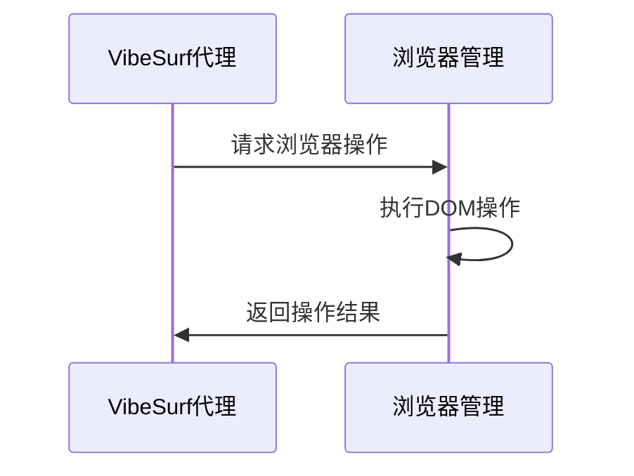

**Diagram sources**
- [vibe_surf_agent.py](file://vibe_surf/agents/vibe_surf_agent.py#L1-1840)
- [browser_manager.py](file://vibe_surf/browser/browser_manager.py#L1-269)

### 结果存储与返回

代理执行完成后，将结果存储到数据库，并通过API返回给前端显示。

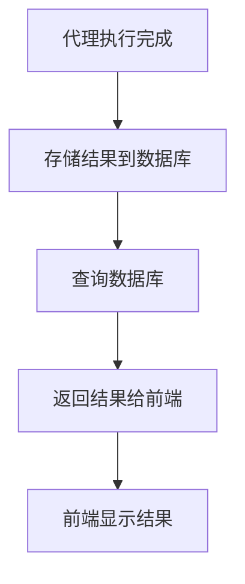

**Diagram sources**
- [vibe_surf_agent.py](file://vibe_surf/agents/vibe_surf_agent.py#L1-1840)
- [shared_state.py](file://vibe_surf/backend/shared_state.py#L1-1111)

## 关键设计模式

VibeSurf系统应用了多种设计模式，包括单例模式、工厂模式和观察者模式，以提高代码的可维护性和可扩展性。

### 单例模式

通过`shared_state.py`管理全局状态，确保系统中只有一个状态实例。

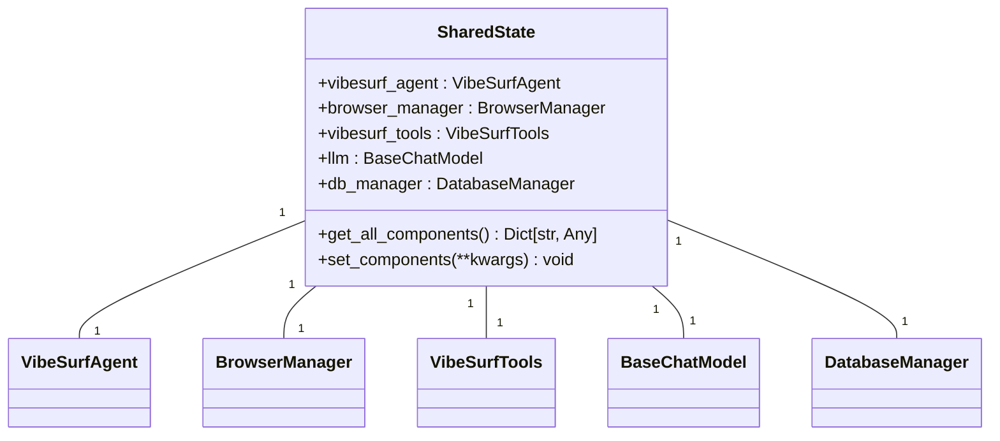

**Diagram sources**
- [shared_state.py](file://vibe_surf/backend/shared_state.py#L1-1111)

**Section sources**
- [shared_state.py](file://vibe_surf/backend/shared_state.py#L1-1111)

### 工厂模式

在`llm_factory.py`中创建不同类型的LLM实例，实现对象创建的封装。

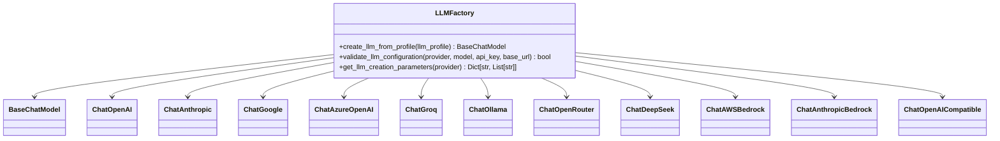

**Diagram sources**
- [llm_factory.py](file://vibe_surf/backend/utils/llm_factory.py#L1-275)

**Section sources**
- [llm_factory.py](file://vibe_surf/backend/utils/llm_factory.py#L1-275)

### 观察者模式

通过事件管理器处理系统事件，实现组件间的松耦合通信。

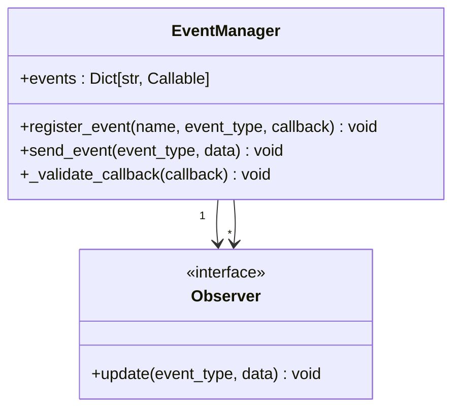

**Diagram sources**
- [event_manager.py](file://vibe_surf/langflow/events/event_manager.py#L35-66)
- [service.py](file://vibe_surf/langflow/services/state/service.py#L70-82)

**Section sources**
- [event_manager.py](file://vibe_surf/langflow/events/event_manager.py#L1-100)
- [service.py](file://vibe_surf/langflow/services/state/service.py#L1-100)

## 高可用性与可扩展性

VibeSurf系统通过多种机制实现高可用性和可扩展性，确保系统稳定运行并能应对不断增长的需求。

### 高可用性设计

系统采用健康检查、错误恢复和状态监控等机制确保高可用性。

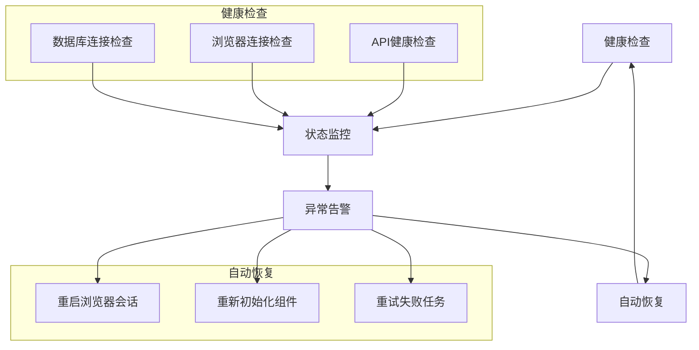

**Diagram sources**
- [main.py](file://vibe_surf/backend/main.py#L1-794)
- [shared_state.py](file://vibe_surf/backend/shared_state.py#L1-1111)

**Section sources**
- [main.py](file://vibe_surf/backend/main.py#L1-794)

### 可扩展性设计

系统通过模块化设计和插件机制实现良好的可扩展性。

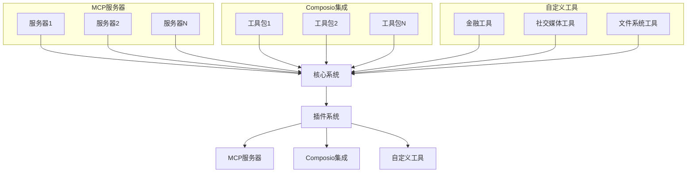

**Diagram sources**
- [vibesurf_tools.py](file://vibe_surf/tools/vibesurf_tools.py#L1-2278)
- [main.py](file://vibe_surf/backend/main.py#L1-794)

**Section sources**
- [vibesurf_tools.py](file://vibe_surf/tools/vibesurf_tools.py#L1-2278)

## 组件间松耦合设计

VibeSurf系统通过接口抽象、依赖注入和事件驱动等机制实现组件间的松耦合设计。

### 接口抽象

通过定义清晰的接口规范，降低组件间的直接依赖。

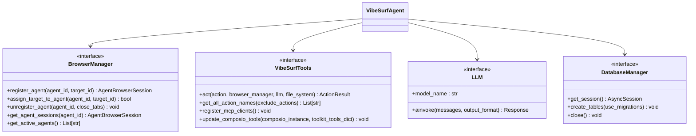

**Diagram sources**
- [browser_manager.py](file://vibe_surf/browser/browser_manager.py#L1-269)
- [vibesurf_tools.py](file://vibe_surf/tools/vibesurf_tools.py#L1-2278)
- [vibe_surf_agent.py](file://vibe_surf/agents/vibe_surf_agent.py#L1-1840)

**Section sources**
- [browser_manager.py](file://vibe_surf/browser/browser_manager.py#L1-269)
- [vibesurf_tools.py](file://vibe_surf/tools/vibesurf_tools.py#L1-2278)

### 依赖注入

通过共享状态和依赖注入容器管理组件依赖关系。

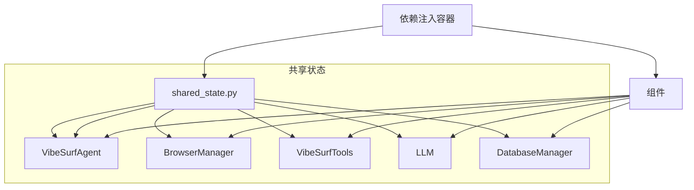

**Diagram sources**
- [shared_state.py](file://vibe_surf/backend/shared_state.py#L1-1111)
- [main.py](file://vibe_surf/backend/main.py#L1-794)

**Section sources**
- [shared_state.py](file://vibe_surf/backend/shared_state.py#L1-1111)

### 事件驱动

通过事件总线实现组件间的异步通信。

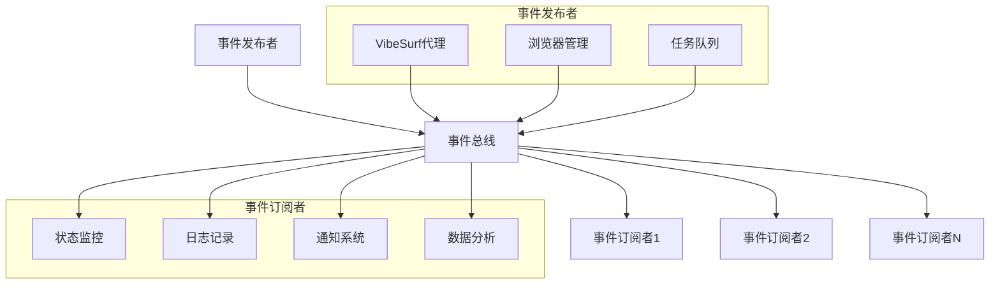

**Diagram sources**
- [event_manager.py](file://vibe_surf/langflow/events/event_manager.py#L35-66)
- [service.py](file://vibe_surf/langflow/services/state/service.py#L70-82)

**Section sources**
- [event_manager.py](file://vibe_surf/langflow/events/event_manager.py#L1-100)
- [service.py](file://vibe_surf/langflow/services/state/service.py#L1-100)