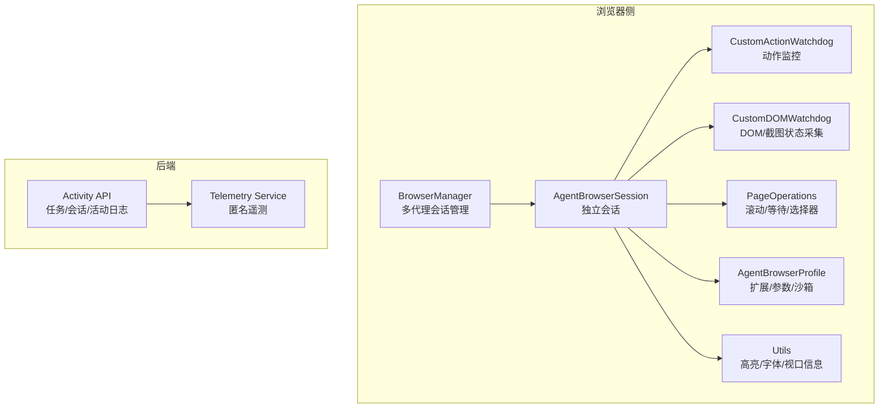
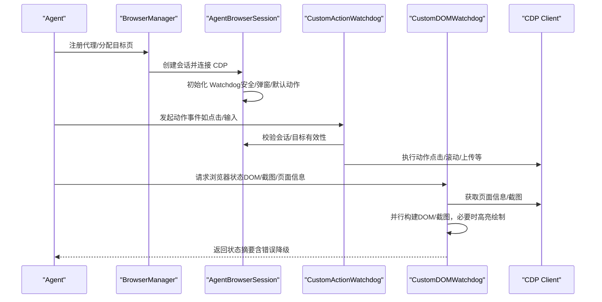
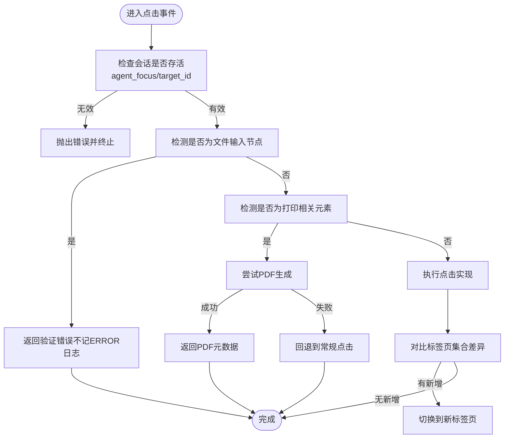
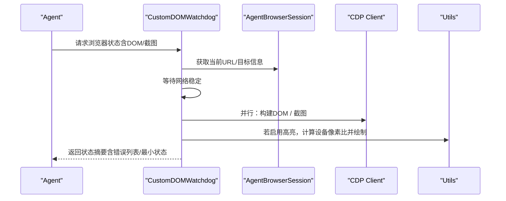
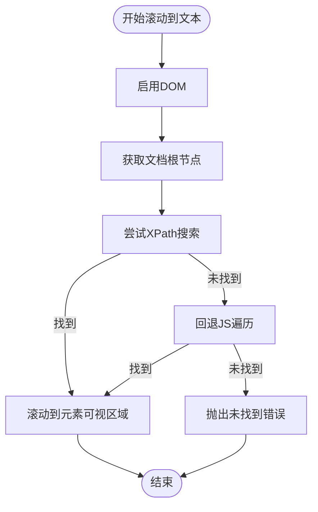
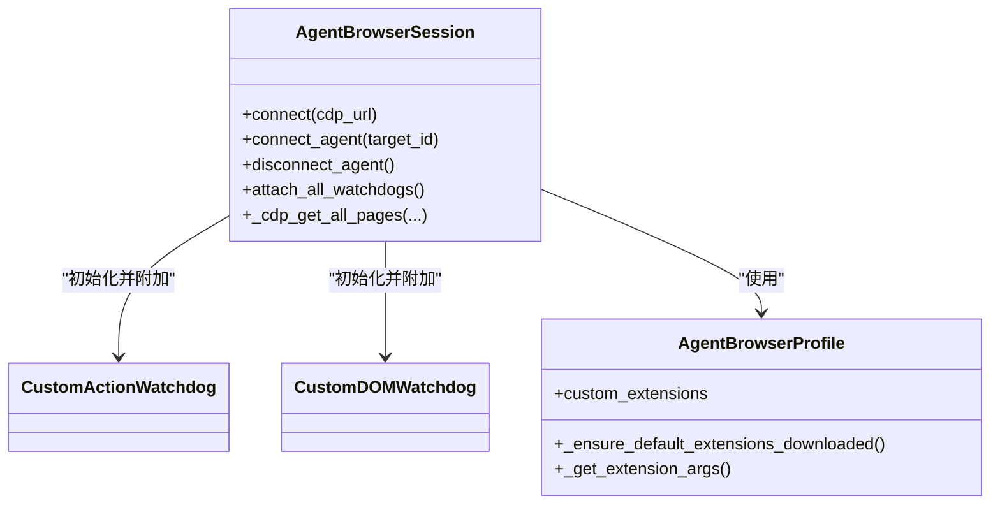
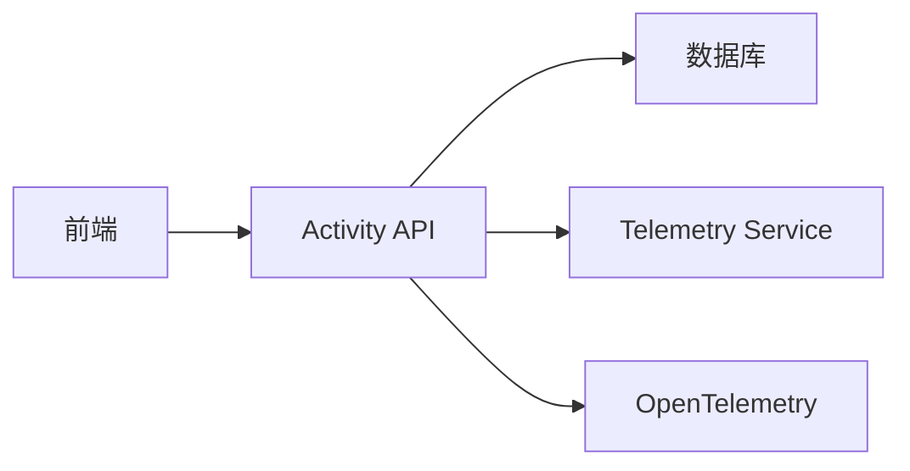
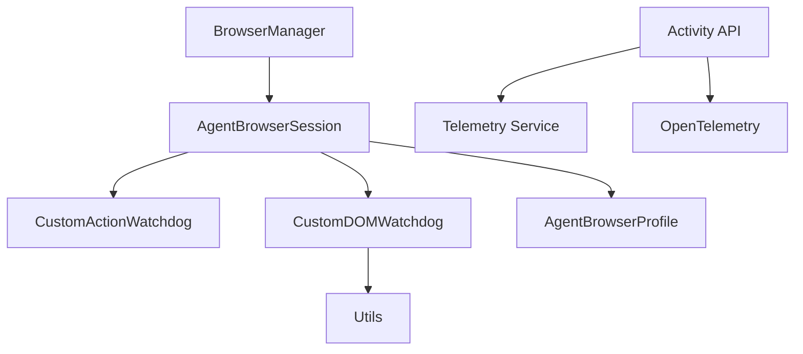
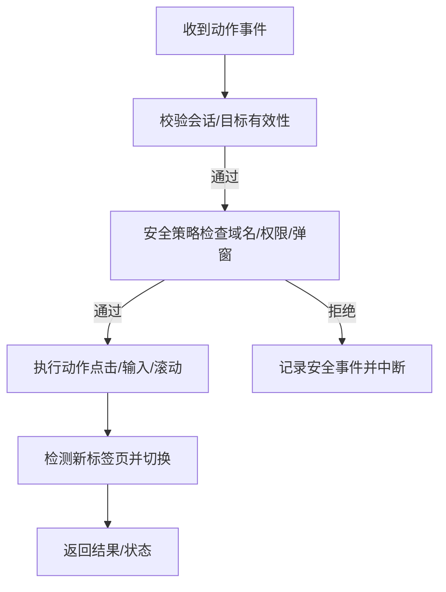
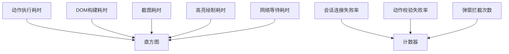

# 安全与性能

<cite>
**本文引用的文件**
- [action_watchdog.py](file://vibe_surf/browser/watchdogs/action_watchdog.py)
- [dom_watchdog.py](file://vibe_surf/browser/watchdogs/dom_watchdog.py)
- [agent_browser_session.py](file://vibe_surf/browser/agent_browser_session.py)
- [browser_manager.py](file://vibe_surf/browser/browser_manager.py)
- [page_operations.py](file://vibe_surf/browser/page_operations.py)
- [agen_browser_profile.py](file://vibe_surf/browser/agen_browser_profile.py)
- [utils.py](file://vibe_surf/browser/utils.py)
- [browser_use_agent.py](file://vibe_surf/agents/browser_use_agent.py)
- [activity.py](file://vibe_surf/backend/api/activity.py)
- [service.py](file://vibe_surf/telemetry/service.py)
- [opentelemetry.py](file://vibe_surf/langflow/services/telemetry/opentelemetry.py)
</cite>

## 目录
1. [简介](#简介)
2. [项目结构](#项目结构)
3. [核心组件](#核心组件)
4. [架构总览](#架构总览)
5. [详细组件分析](#详细组件分析)
6. [依赖关系分析](#依赖关系分析)
7. [性能考虑](#性能考虑)
8. [故障排查指南](#故障排查指南)
9. [结论](#结论)
10. [附录](#附录)

## 简介
本文件聚焦于浏览器集成场景下的“安全与性能”主题，围绕以下目标展开：
- 通过 action_watchdog 与 dom_watchdog 实现操作监控与异常检测，防止无限循环与页面卡死
- 资源限制策略：内存使用控制、网络请求限制、CPU 占用管理
- 安全沙箱机制：确保浏览器操作不越界影响主机系统
- 性能调优指南：会话配置优化、操作批处理、缓存策略
- 安全事件处理流程与性能监控指标建议

## 项目结构
本项目在浏览器侧采用“会话隔离 + 观察者（Watchdog）”模式，结合扩展注入与截图高亮等能力，形成可观察、可控制、可恢复的自动化浏览体系。后端提供活动日志与任务历史接口，前端提供可视化与交互入口；遥测服务用于收集匿名化指标。

图表来源
- [browser_manager.py](file://vibe_surf/browser/browser_manager.py#L1-L120)
- [agent_browser_session.py](file://vibe_surf/browser/agent_browser_session.py#L1-L120)
- [action_watchdog.py](file://vibe_surf/browser/watchdogs/action_watchdog.py#L1-L40)
- [dom_watchdog.py](file://vibe_surf/browser/watchdogs/dom_watchdog.py#L1-L40)
- [page_operations.py](file://vibe_surf/browser/page_operations.py#L1-L40)
- [agen_browser_profile.py](file://vibe_surf/browser/agen_browser_profile.py#L1-L40)
- [utils.py](file://vibe_surf/browser/utils.py#L660-L786)
- [activity.py](file://vibe_surf/backend/api/activity.py#L1-L60)
- [service.py](file://vibe_surf/telemetry/service.py#L1-L60)

章节来源
- [browser_manager.py](file://vibe_surf/browser/browser_manager.py#L1-L120)
- [agent_browser_session.py](file://vibe_surf/browser/agent_browser_session.py#L1-L120)
- [activity.py](file://vibe_surf/backend/api/activity.py#L1-L60)

## 核心组件
- 浏览器会话与沙箱
  - AgentBrowserSession：封装 CDP 连接、目标页分配、欢迎提示注入、代理认证、事件总线绑定、安全/弹窗/默认动作 Watchdog 初始化等
  - AgentBrowserProfile：扩展加载、启动参数、沙箱开关、域名白名单、窗口/视口等
- Watchdog 监控
  - CustomActionWatchdog：点击、输入、滚动、上传、PDF 生成等动作的前置校验与异常路径处理
  - CustomDOMWatchdog：DOM 构建、截图捕获、高亮绘制、页面信息采集、错误降级与最小状态返回
- 页面操作工具
  - PageOperations：文本滚动定位、直接选择器尝试、元素等待与回退策略
- 工具与高亮
  - Utils：高亮截图生成、字体缓存、视口信息获取
- 后端与遥测
  - Activity API：任务/会话/活动日志查询
  - Telemetry Service：匿名遥测采集与发送
  - OpenTelemetry：指标注册与导出（Prometheus）

章节来源
- [agent_browser_session.py](file://vibe_surf/browser/agent_browser_session.py#L1-L120)
- [agen_browser_profile.py](file://vibe_surf/browser/agen_browser_profile.py#L1-L80)
- [action_watchdog.py](file://vibe_surf/browser/watchdogs/action_watchdog.py#L1-L40)
- [dom_watchdog.py](file://vibe_surf/browser/watchdogs/dom_watchdog.py#L1-L60)
- [page_operations.py](file://vibe_surf/browser/page_operations.py#L1-L60)
- [utils.py](file://vibe_surf/browser/utils.py#L660-L786)
- [activity.py](file://vibe_surf/backend/api/activity.py#L1-L60)
- [service.py](file://vibe_surf/telemetry/service.py#L1-L60)
- [opentelemetry.py](file://vibe_surf/langflow/services/telemetry/opentelemetry.py#L1-L60)

## 架构总览
浏览器侧以 BrowserManager 为入口，为每个代理创建独立 AgentBrowserSession，并在会话内挂载多种 Watchdog，统一通过事件总线进行解耦协作。DOMWatchdog 并行构建 DOM 与截图，随后根据配置进行高亮绘制；ActionWatchdog 在执行动作前做安全与合法性检查，避免危险操作与异常循环。

图表来源
- [browser_manager.py](file://vibe_surf/browser/browser_manager.py#L47-L120)
- [agent_browser_session.py](file://vibe_surf/browser/agent_browser_session.py#L831-L849)
- [action_watchdog.py](file://vibe_surf/browser/watchdogs/action_watchdog.py#L24-L109)
- [dom_watchdog.py](file://vibe_surf/browser/watchdogs/dom_watchdog.py#L26-L120)

## 详细组件分析

### 组件A：动作监控与异常检测（CustomActionWatchdog）
- 功能要点
  - 会话健康检查：在执行任何动作前验证 agent_focus/target_id 是否有效，避免对已崩溃会话的操作
  - 文件上传规避：识别文件输入节点，引导使用专用上传函数，避免误点击触发系统对话框
  - 打印按钮特殊处理：检测打印相关元素，优先尝试 PDF 直接生成，失败再回退到常规点击
  - 新标签页检测：记录动作前后标签页集合差异，自动切换到新打开的标签页
  - 验证错误返回：对非致命性校验错误以字典形式返回，避免产生 ERROR 日志
- 异常与恢复
  - 对异常进行上抛，交由上层捕获与记录；同时在关键路径记录调试/警告日志，便于追踪
- 与会话耦合
  - 依赖 AgentBrowserSession 的 CDP 会话池与目标页管理，确保动作作用域正确

图表来源
- [action_watchdog.py](file://vibe_surf/browser/watchdogs/action_watchdog.py#L24-L109)

章节来源
- [action_watchdog.py](file://vibe_surf/browser/watchdogs/action_watchdog.py#L24-L109)

### 组件B：DOM/截图状态采集与高亮（CustomDOMWatchdog）
- 功能要点
  - 页面稳定性等待：在网络空闲后再构建 DOM，降低不稳定 DOM 导致的状态不一致
  - 并行采集：DOM 构建与截图捕获并行执行，提升吞吐
  - 高亮绘制：基于 selector_map 与设备像素比，将交互元素边界框绘制到截图上
  - 错误降级：任一环节失败均返回最小可用状态，保证系统可用性
  - 页面信息：从 CDP 获取视口、滚动位置等信息，作为状态的一部分
- 性能与可靠性
  - 通过超时与降级策略避免长时间阻塞
  - 对标题获取、页面信息获取设置异常保护，失败时使用默认值

图表来源
- [dom_watchdog.py](file://vibe_surf/browser/watchdogs/dom_watchdog.py#L26-L220)
- [utils.py](file://vibe_surf/browser/utils.py#L731-L786)

章节来源
- [dom_watchdog.py](file://vibe_surf/browser/watchdogs/dom_watchdog.py#L26-L220)
- [utils.py](file://vibe_surf/browser/utils.py#L660-L786)

### 组件C：页面操作工具（PageOperations）
- 文本滚动定位：先 XPath 搜索，失败则回退到 JS 遍历，找不到时报错
- 直接选择器尝试：对目标文本进行清洗与变体尝试（ID/name/data-testid 等），并进行可见性与严格性校验
- 元素等待：支持超时轮询与层级回退选择器，避免误判

图表来源
- [page_operations.py](file://vibe_surf/browser/page_operations.py#L1-L98)

章节来源
- [page_operations.py](file://vibe_surf/browser/page_operations.py#L1-L98)

### 组件D：会话与沙箱（AgentBrowserSession / AgentBrowserProfile）
- 会话连接与目标页管理：支持本地/远程 CDP 连接、自动获取 WebSocket 地址、创建/激活目标页、注入欢迎提示
- 安全 Watchdog：初始化安全与弹窗 Watchdog，拦截危险行为与对话框
- 默认动作 Watchdog：初始化自定义动作 Watchdog，覆盖点击/输入/滚动等默认动作
- 扩展加载：按需下载并加载默认扩展（如 Cookie 处理），支持自定义扩展路径
- 参数与沙箱：通过 BrowserProfile 控制启动参数、沙箱、视口、窗口大小、网络与权限等

图表来源
- [agent_browser_session.py](file://vibe_surf/browser/agent_browser_session.py#L1-L120)
- [agen_browser_profile.py](file://vibe_surf/browser/agen_browser_profile.py#L1-L80)
- [action_watchdog.py](file://vibe_surf/browser/watchdogs/action_watchdog.py#L1-L40)
- [dom_watchdog.py](file://vibe_surf/browser/watchdogs/dom_watchdog.py#L1-L40)

章节来源
- [agent_browser_session.py](file://vibe_surf/browser/agent_browser_session.py#L1-L120)
- [agen_browser_profile.py](file://vibe_surf/browser/agen_browser_profile.py#L1-L137)

### 组件E：后端活动日志与遥测
- Activity API：提供任务/会话/活动日志查询接口，支持分页与索引定位
- Telemetry Service：匿名遥测采集与发送，支持禁用与调试模式
- OpenTelemetry：指标注册与导出（计数器/直方图/可观测量表），便于性能观测

图表来源
- [activity.py](file://vibe_surf/backend/api/activity.py#L1-L120)
- [service.py](file://vibe_surf/telemetry/service.py#L1-L114)
- [opentelemetry.py](file://vibe_surf/langflow/services/telemetry/opentelemetry.py#L1-L120)

章节来源
- [activity.py](file://vibe_surf/backend/api/activity.py#L1-L120)
- [service.py](file://vibe_surf/telemetry/service.py#L1-L114)
- [opentelemetry.py](file://vibe_surf/langflow/services/telemetry/opentelemetry.py#L1-L120)

## 依赖关系分析
- 组件耦合
  - AgentBrowserSession 与 Watchdog：通过事件总线解耦，动作与状态采集分别由 Action/DOM Watchdog 负责
  - DOMWatchdog 与 Utils：高亮绘制依赖 Utils 的字体与坐标转换能力
  - BrowserManager 与 AgentBrowserSession：集中管理多个代理的会话生命周期与目标页分配
- 外部依赖
  - CDP 客户端：所有浏览器交互的基础
  - 扩展系统：通过 AgentBrowserProfile 加载扩展，增强自动化能力
  - 遥测系统：PostHog/OpenTelemetry 提供匿名化与指标观测

图表来源
- [browser_manager.py](file://vibe_surf/browser/browser_manager.py#L1-L120)
- [agent_browser_session.py](file://vibe_surf/browser/agent_browser_session.py#L1-L120)
- [dom_watchdog.py](file://vibe_surf/browser/watchdogs/dom_watchdog.py#L1-L60)
- [utils.py](file://vibe_surf/browser/utils.py#L660-L786)
- [agen_browser_profile.py](file://vibe_surf/browser/agen_browser_profile.py#L1-L80)
- [activity.py](file://vibe_surf/backend/api/activity.py#L1-L60)
- [service.py](file://vibe_surf/telemetry/service.py#L1-L60)
- [opentelemetry.py](file://vibe_surf/langflow/services/telemetry/opentelemetry.py#L1-L60)

章节来源
- [browser_manager.py](file://vibe_surf/browser/browser_manager.py#L1-L120)
- [agent_browser_session.py](file://vibe_surf/browser/agent_browser_session.py#L1-L120)

## 性能考虑
- 并行化与异步
  - DOMWatchdog 并行构建 DOM 与截图，减少整体等待时间
  - Utils 的高亮绘制在异步上下文中执行，必要时可放入线程池以避免阻塞
- 资源限制策略
  - 内存使用控制
    - 通过最小状态返回与降级逻辑，避免一次性加载过大的 DOM 或截图
    - 对高亮绘制进行尺寸与数量控制，避免过度绘制导致内存峰值
  - 网络请求限制
    - 使用“等待网络空闲”策略，减少不稳定 DOM 带来的重复渲染
    - 结合 allowed_domains 白名单，限制访问范围，降低恶意站点带来的资源消耗
  - CPU 占用管理
    - 高亮绘制与字体加载采用缓存策略，避免重复 IO 与计算
    - 对超时与重试进行节流，避免高频轮询造成 CPU 占用
- 会话配置优化
  - 视口/窗口大小、设备像素比、视口偏移等参数直接影响截图与高亮精度与性能
  - 合理设置 minimum_wait_page_load_time、wait_for_network_idle_page_load_time、wait_between_actions 等参数，平衡稳定性与吞吐
- 操作批处理与缓存
  - 将多次小操作合并为批量执行，减少 CDP 调用次数
  - 对常用选择器与字体进行缓存，减少重复解析与加载

章节来源
- [dom_watchdog.py](file://vibe_surf/browser/watchdogs/dom_watchdog.py#L70-L120)
- [utils.py](file://vibe_surf/browser/utils.py#L1-L120)
- [agent_browser_session.py](file://vibe_surf/browser/agent_browser_session.py#L120-L220)
- [browser_use_agent.py](file://vibe_surf/agents/browser_use_agent.py#L316-L356)

## 故障排查指南
- 会话连接失败
  - 检查 CDP URL 与 WebSocket 地址解析是否成功
  - 确认目标页存在且可激活，必要时创建新页
- 动作执行异常
  - 关注 CustomActionWatchdog 的验证错误返回，避免误点击文件输入或打印按钮
  - 若出现新标签页切换问题，检查标签页集合差异逻辑
- DOM/截图异常
  - 若 DOM 构建失败，确认网络等待是否成功；若截图失败，检查设备像素比与视口信息
  - 高亮绘制失败时，检查字体缓存与图像合成过程
- 安全事件
  - 当 allowed_domains 未配置时，系统会发出安全警告；请尽快配置白名单
  - 出现弹窗/对话框时，确认 PopupsWatchdog 是否正确处理

章节来源
- [agent_browser_session.py](file://vibe_surf/browser/agent_browser_session.py#L171-L260)
- [action_watchdog.py](file://vibe_surf/browser/watchdogs/action_watchdog.py#L24-L109)
- [dom_watchdog.py](file://vibe_surf/browser/watchdogs/dom_watchdog.py#L120-L220)
- [browser_use_agent.py](file://vibe_surf/agents/browser_use_agent.py#L316-L356)

## 结论
本系统通过“会话隔离 + Watchdog 监控 + 并行采集 + 高亮绘制”的组合，在保障浏览器自动化稳定性的同时，提供了可观察、可恢复、可扩展的能力。安全方面，通过域名白名单、弹窗拦截与动作前置校验，有效降低风险；性能方面，通过并行化、缓存与参数调优，兼顾吞吐与资源占用。建议在生产环境中持续关注遥测指标与活动日志，结合业务场景进一步优化会话配置与批处理策略。

## 附录
- 安全事件处理流程（概念示意）

- 性能监控指标建议（概念示意）
