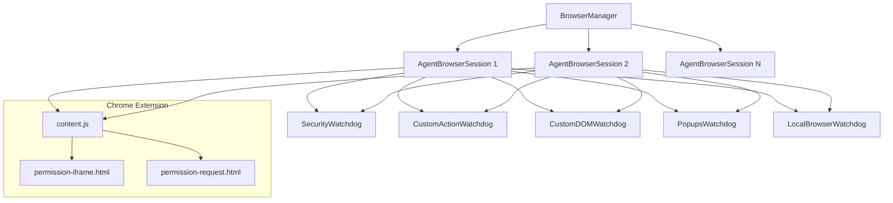
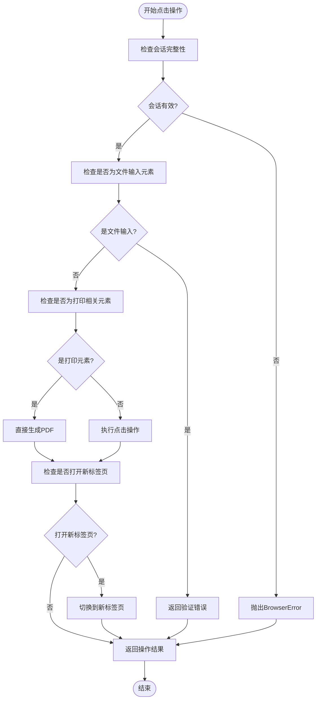
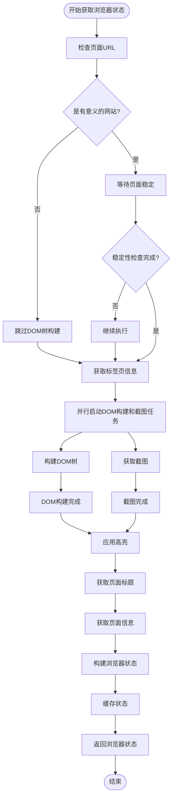
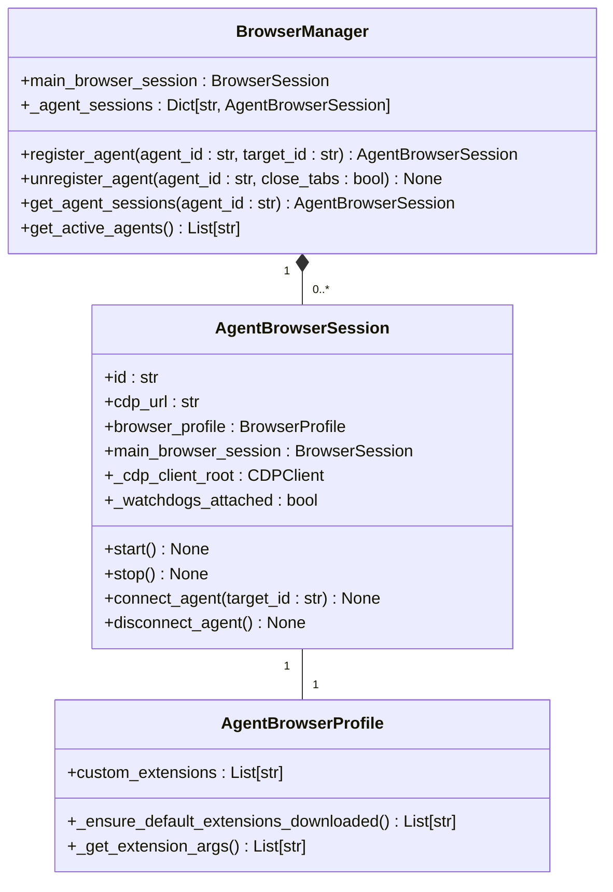
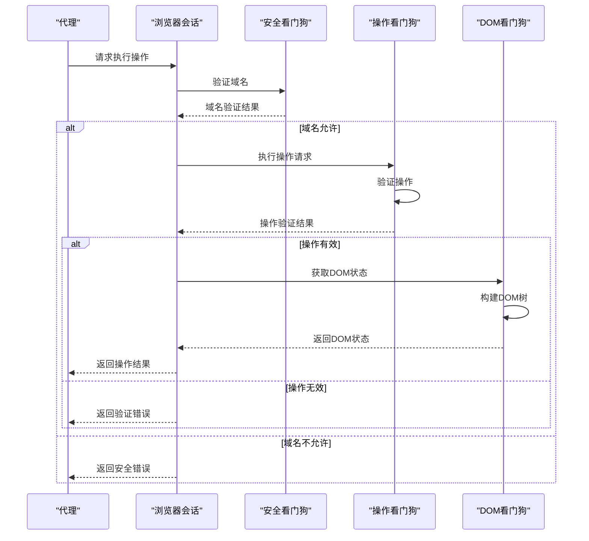
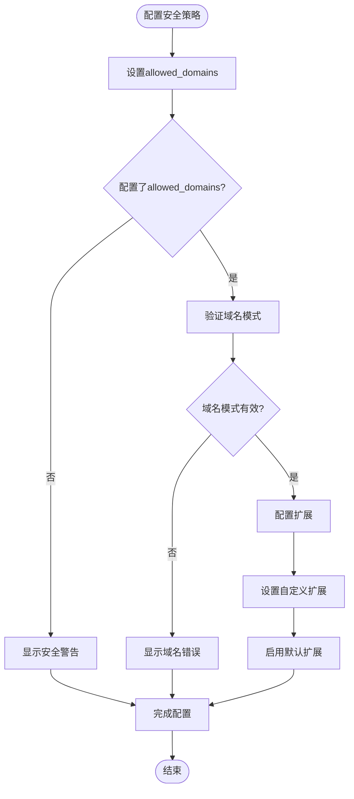

# 安全机制

<cite>
**本文档引用的文件**
- [action_watchdog.py](file://vibe_surf/browser/watchdogs/action_watchdog.py)
- [dom_watchdog.py](file://vibe_surf/browser/watchdogs/dom_watchdog.py)
- [agent_browser_session.py](file://vibe_surf/browser/agent_browser_session.py)
- [agen_browser_profile.py](file://vibe_surf/browser/agen_browser_profile.py)
- [permission-iframe-request.js](file://vibe_surf/chrome_extension/scripts/permission-iframe-request.js)
- [content.js](file://vibe_surf/chrome_extension/content.js)
- [permission-request.js](file://vibe_surf/chrome_extension/scripts/permission-request.js)
- [browser_manager.py](file://vibe_surf/browser/browser_manager.py)
- [browser_use_agent.py](file://vibe_surf/agents/browser_use_agent.py)
</cite>

## 目录
1. [简介](#简介)
2. [安全架构概览](#安全架构概览)
3. [操作频率监控机制](#操作频率监控机制)
4. [页面状态异常检测](#页面状态异常检测)
5. [安全沙箱实现原理](#安全沙箱实现原理)
6. [安全事件处理流程](#安全事件处理流程)
7. [安全策略配置](#安全策略配置)
8. [结论](#结论)

## 简介
本文档详细说明了VibeSurf浏览器集成的安全机制，重点介绍如何通过action_watchdog和dom_watchdog监控和限制浏览器操作，防止恶意或意外的无限循环操作。文档还描述了安全沙箱的实现原理，包括权限隔离、DOM访问控制和脚本执行限制，以及安全事件的检测、记录和响应流程。

## 安全架构概览
VibeSurf的安全架构采用多层防护机制，通过一系列看门狗（Watchdog）组件协同工作，确保浏览器操作的安全性和稳定性。系统通过BrowserManager管理多个代理的隔离浏览器会话，每个会话都配备了多个安全监控组件。

**图源**
- [browser_manager.py](file://vibe_surf/browser/browser_manager.py#L24-L186)
- [agent_browser_session.py](file://vibe_surf/browser/agent_browser_session.py#L797-L849)
- [content.js](file://vibe_surf/chrome_extension/content.js#L295-L326)

**本节来源**
- [browser_manager.py](file://vibe_surf/browser/browser_manager.py#L24-L186)
- [agent_browser_session.py](file://vibe_surf/browser/agent_browser_session.py#L797-L849)

## 操作频率监控机制
action_watchdog组件负责监控和限制浏览器操作的频率，防止恶意或意外的无限循环操作。该机制通过CustomActionWatchdog类实现，对各种浏览器事件进行精细化控制。

### 操作监控实现
CustomActionWatchdog通过重写on_ClickElementEvent方法来监控点击操作，确保每个操作都经过安全验证。系统首先检查浏览器会话的完整性，然后对特定类型的元素进行特殊处理。

**图源**
- [action_watchdog.py](file://vibe_surf/browser/watchdogs/action_watchdog.py#L24-L109)

**本节来源**
- [action_watchdog.py](file://vibe_surf/browser/watchdogs/action_watchdog.py#L24-L109)

### 防无限循环策略
系统通过多种策略防止无限循环操作：
1. **会话完整性检查**：在执行任何操作前，验证浏览器会话是否完整，防止在崩溃的会话中执行操作
2. **特殊元素处理**：对文件输入和打印按钮等特殊元素进行特殊处理，避免触发不必要的对话框
3. **新标签页检测**：自动检测并处理新标签页的打开，确保操作的连续性
4. **异常处理**：完善的异常处理机制，确保任何错误都不会导致系统崩溃

## 页面状态异常检测
dom_watchdog组件负责检测页面状态异常，及时终止可能导致页面卡死的操作序列。该机制通过CustomDOMWatchdog类实现，对DOM树的构建和页面状态的获取进行监控。

### 页面稳定性检测
CustomDOMWatchdog在获取浏览器状态时，首先等待页面达到稳定状态，确保网络活动已经完成。这可以防止在页面加载过程中进行操作，避免因元素未完全加载而导致的错误。

**图源**
- [dom_watchdog.py](file://vibe_surf/browser/watchdogs/dom_watchdog.py#L26-L250)

**本节来源**
- [dom_watchdog.py](file://vibe_surf/browser/watchdogs/dom_watchdog.py#L26-L250)

### 异常处理机制
当DOM构建或截图失败时，系统会返回最小化的恢复状态，确保即使在异常情况下也能继续运行。这种容错机制保证了系统的稳定性和可靠性。

## 安全沙箱实现原理
安全沙箱通过多个层面的隔离和控制机制，确保浏览器操作的安全性。系统实现了权限隔离、DOM访问控制和脚本执行限制，为每个代理提供独立的安全环境。

### 权限隔离
系统通过BrowserManager管理多个代理的隔离浏览器会话，每个会话都有独立的CDP（Chrome DevTools Protocol）会话。这种设计确保了不同代理之间的操作完全隔离，防止相互干扰。

**图源**
- [browser_manager.py](file://vibe_surf/browser/browser_manager.py#L24-L186)
- [agent_browser_session.py](file://vibe_surf/browser/agent_browser_session.py#L749-L849)
- [agen_browser_profile.py](file://vibe_surf/browser/agen_browser_profile.py#L24-L137)

### DOM访问控制
系统通过CustomDOMWatchdog对DOM访问进行控制，确保只有经过验证的操作才能修改DOM树。在构建DOM树时，系统会并行执行DOM构建和截图任务，提高效率的同时确保数据一致性。

### 脚本执行限制
安全沙箱限制了脚本的执行权限，防止恶意脚本的注入和执行。系统通过CDP协议与浏览器通信，只允许预定义的安全操作，阻止任何潜在的危险行为。

**本节来源**
- [browser_manager.py](file://vibe_surf/browser/browser_manager.py#L24-L186)
- [agent_browser_session.py](file://vibe_surf/browser/agent_browser_session.py#L749-L849)
- [agen_browser_profile.py](file://vibe_surf/browser/agen_browser_profile.py#L24-L137)

## 安全事件处理流程
安全事件的检测、记录和响应流程是系统安全机制的重要组成部分。系统通过事件总线（EventBus）协调各个看门狗组件，实现对安全事件的全面监控和处理。

### 事件检测与响应
系统通过SecurityWatchdog监控导航事件，确保只允许访问配置的域名。当检测到安全事件时，系统会记录详细的日志信息，并根据配置的策略进行响应。

**图源**
- [agent_browser_session.py](file://vibe_surf/browser/agent_browser_session.py#L831-L834)
- [action_watchdog.py](file://vibe_surf/browser/watchdogs/action_watchdog.py#L24-L109)
- [dom_watchdog.py](file://vibe_surf/browser/watchdogs/dom_watchdog.py#L26-L250)

### 日志记录
系统使用统一的日志记录机制，对所有安全相关事件进行详细记录。日志信息包括操作类型、执行时间、结果状态等，便于后续的审计和故障排查。

**本节来源**
- [agent_browser_session.py](file://vibe_surf/browser/agent_browser_session.py#L831-L834)
- [action_watchdog.py](file://vibe_surf/browser/watchdogs/action_watchdog.py#L24-L109)
- [dom_watchdog.py](file://vibe_surf/browser/watchdogs/dom_watchdog.py#L26-L250)

## 安全策略配置
安全策略的配置是确保系统安全性的关键。系统提供了灵活的配置选项，允许用户根据具体需求调整安全级别。

### 域名限制配置
通过allowed_domains参数，用户可以限制代理只能访问指定的域名。这是一种重要的安全措施，可以防止代理访问恶意网站。

**图源**
- [browser_use_agent.py](file://vibe_surf/agents/browser_use_agent.py#L316-L356)
- [agen_browser_profile.py](file://vibe_surf/browser/agen_browser_profile.py#L24-L137)

### 扩展配置
系统支持配置浏览器扩展，包括默认扩展和自定义扩展。默认扩展包括"I still don't care about cookies"等，用于自动化和内容提取的优化。

**本节来源**
- [browser_use_agent.py](file://vibe_surf/agents/browser_use_agent.py#L316-L356)
- [agen_browser_profile.py](file://vibe_surf/browser/agen_browser_profile.py#L24-L137)

## 结论
VibeSurf的浏览器集成安全机制通过多层防护体系，有效保障了浏览器操作的安全性和稳定性。action_watchdog和dom_watchdog组件协同工作，防止恶意或意外的无限循环操作，并及时检测页面状态异常。安全沙箱通过权限隔离、DOM访问控制和脚本执行限制，为每个代理提供了独立的安全环境。系统的安全事件处理流程完善，能够及时检测、记录和响应各种安全事件。通过灵活的安全策略配置，用户可以根据具体需求调整安全级别，确保系统在各种场景下的安全运行。