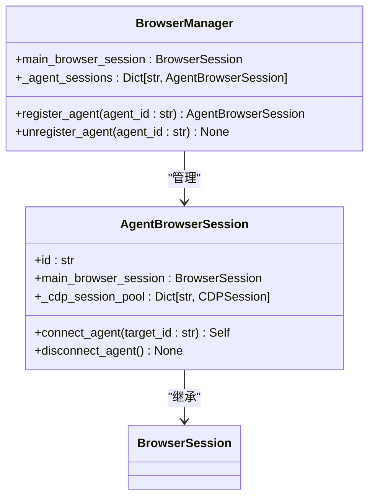
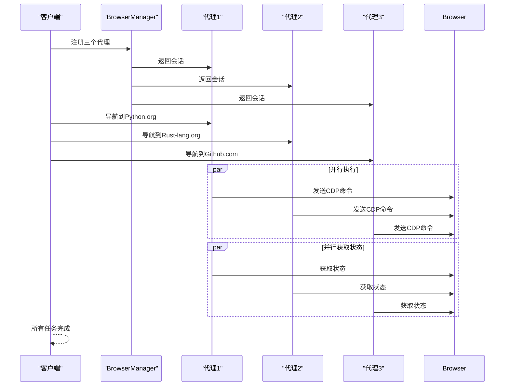
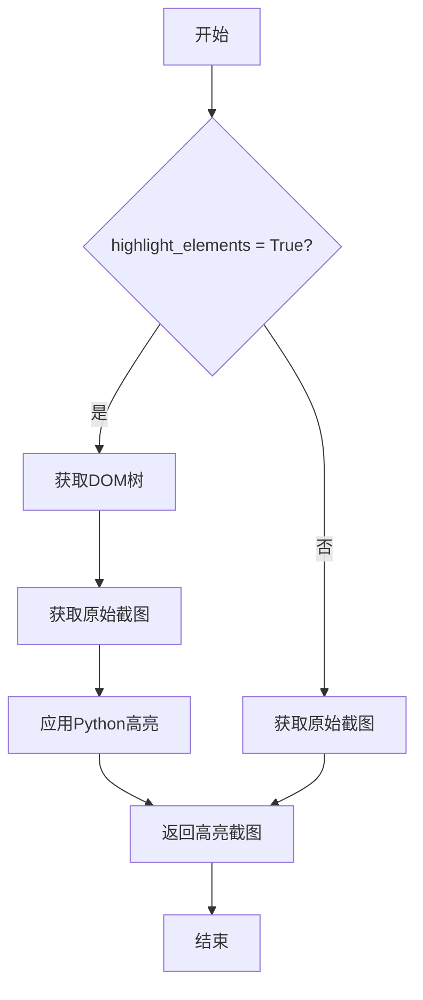

# 性能优化

<cite>
**本文档引用的文件**   
- [browser_manager.py](file://vibe_surf/browser/browser_manager.py)
- [agent_browser_session.py](file://vibe_surf/browser/agent_browser_session.py)
- [page_operations.py](file://vibe_surf/browser/page_operations.py)
- [utils.py](file://vibe_surf/browser/utils.py)
- [main.py](file://vibe_surf/backend/main.py)
- [dom_watchdog.py](file://vibe_surf/browser/watchdogs/dom_watchdog.py)
- [action_watchdog.py](file://vibe_surf/browser/watchdogs/action_watchdog.py)
- [agen_browser_profile.py](file://vibe_surf/browser/agen_browser_profile.py)
- [shared_state.py](file://vibe_surf/backend/shared_state.py)
</cite>

## 目录
1. [引言](#引言)
2. [资源管理策略](#资源管理策略)
3. [操作批处理机制](#操作批处理机制)
4. [会话配置优化](#会话配置优化)
5. [缓存策略](#缓存策略)
6. [性能监控与诊断](#性能监控与诊断)
7. [结论](#结论)

## 引言
本文档详细说明了VibeSurf系统如何通过一系列优化策略提升浏览器集成操作的性能。系统通过精细化的资源管理、操作批处理、会话配置和缓存策略，有效减少了浏览器通信开销，提升了执行效率。文档将深入分析这些机制的实现原理，并提供性能监控和瓶颈诊断的方法。

## 资源管理策略

VibeSurf系统通过一套综合的资源管理策略来优化浏览器操作性能，主要体现在内存使用、网络请求和CPU占用的控制上。

### 内存使用监控
系统通过`BrowserManager`类对多个代理（Agent）的浏览器会话进行集中管理。每个代理拥有独立的`AgentBrowserSession`实例，实现了会话的完全隔离。这种设计确保了内存资源的合理分配和回收，避免了不同代理之间的内存干扰。

**Diagram sources**
- [browser_manager.py](file://vibe_surf/browser/browser_manager.py#L24-L185)
- [agent_browser_session.py](file://vibe_surf/browser/agent_browser_session.py#L51-L719)

当一个代理任务完成时，系统会调用`unregister_agent`方法，该方法不仅会关闭代理分配的所有标签页，还会清理其CDP会话，确保内存资源被及时释放。

### 网络请求节流
系统通过`CustomDOMWatchdog`类在获取浏览器状态时，对网络活动进行监控和等待。在`get_browser_state_no_event_bus`方法中，系统会调用`_wait_for_stable_network`来确保网络活动稳定后再进行后续操作。这有效地避免了在页面加载过程中频繁发起网络请求，从而实现了网络请求的节流。

### CPU占用控制
系统通过异步编程模型和事件驱动架构来控制CPU占用。所有浏览器操作，如导航、点击、截图等，都通过事件总线（EventBus）进行调度。这种非阻塞的异步处理方式，使得CPU可以在等待I/O操作完成时处理其他任务，从而提高了CPU的利用率并避免了长时间的占用。

**Section sources**
- [browser_manager.py](file://vibe_surf/browser/browser_manager.py#L24-L185)
- [agent_browser_session.py](file://vibe_surf/browser/agent_browser_session.py#L51-L719)
- [dom_watchdog.py](file://vibe_surf/browser/watchdogs/dom_watchdog.py#L26-L250)

## 操作批处理机制

操作批处理机制是VibeSurf系统提升执行效率的核心。该机制通过减少与浏览器的通信次数，显著降低了通信开销。

### 并行任务执行
系统在多个层面实现了并行处理。在`test_browser_state_capture`测试用例中，展示了三个代理如何并发地进行导航、截图和状态获取。系统使用`asyncio.gather`来并行执行这些任务，而不是串行执行。

**Diagram sources**
- [test_browser.py](file://tests/test_browser.py#L84-L200)

### DOM树构建与截图的并行化
在`CustomDOMWatchdog.get_browser_state_no_event_bus`方法中，系统将DOM树的构建和截图的捕获作为两个独立的异步任务并行执行。通过`asyncio.create_task`创建任务，并使用`await asyncio.gather`等待它们完成，这大大缩短了获取完整浏览器状态所需的时间。

### 减少通信开销
传统的浏览器自动化工具往往在每次操作后都进行一次完整的状态同步，这会产生巨大的通信开销。VibeSurf通过批处理机制，将多个操作（如导航、点击）组合在一起，只在最后进行一次状态获取，从而将多次通信减少为一次，极大地提升了执行效率。

**Section sources**
- [test_browser.py](file://tests/test_browser.py#L84-L200)
- [dom_watchdog.py](file://vibe_surf/browser/watchdogs/dom_watchdog.py#L74-L117)

## 会话配置优化

会话配置对系统性能有显著影响。通过优化`AgentBrowserProfile`的配置，可以实现更高效的浏览器操作。

### 启用默认扩展
`AgentBrowserProfile`类通过`_ensure_default_extensions_downloaded`方法预下载并启用一系列优化扩展，如“I still don't care about cookies”等。这些扩展可以自动处理常见的弹窗和Cookie同意，避免了代理因等待用户交互而产生的延迟。

### 确定性渲染
系统支持通过配置启用确定性渲染模式。这可以确保页面在不同时间加载时具有相同的布局，从而提高了元素定位的准确性和效率，减少了因页面抖动而导致的重试操作。

### 高亮元素优化
会话配置中的`highlight_elements`选项控制是否在截图上高亮可交互元素。虽然高亮有助于调试，但会增加额外的处理时间。在生产环境中，可以将其关闭以提升性能。

**Diagram sources**
- [agen_browser_profile.py](file://vibe_surf/browser/agen_browser_profile.py#L24-L136)
- [dom_watchdog.py](file://vibe_surf/browser/watchdogs/dom_watchdog.py#L118-L149)

**Section sources**
- [agen_browser_profile.py](file://vibe_surf/browser/agen_browser_profile.py#L24-L136)

## 缓存策略

缓存策略在提高重复操作效率方面发挥着关键作用。

### 字体缓存
系统在`utils.py`文件中实现了两级缓存机制。`_font_path_cache`缓存了字体文件的路径，而`_loaded_font_cache`则缓存了已加载的字体对象。这避免了每次需要字体时都进行文件系统搜索和字体加载的昂贵操作。

### 组件类型缓存
在系统启动时，`initialize_langflow_in_background`函数会启动一个后台任务`component_cache_task`，用于缓存所有组件的类型信息。这个预热过程确保了在后续操作中，组件的查找和实例化可以快速完成。

### 浏览器状态缓存
`AgentBrowserSession`类维护了一个`_cached_browser_state_summary`字段，用于缓存最近一次获取的浏览器状态。当短时间内需要多次访问状态信息时，系统可以直接从缓存中读取，而无需重新与浏览器通信。

**Section sources**
- [utils.py](file://vibe_surf/browser/utils.py#L108-L205)
- [main.py](file://vibe_surf/backend/main.py#L281-L315)

## 性能监控与诊断

### 关键性能指标
- **任务执行时间**：从任务开始到结束的总耗时。
- **CDP通信延迟**：发送CDP命令到收到响应的平均时间。
- **内存占用**：`BrowserManager`管理的所有会话的总内存消耗。
- **并发代理数**：系统同时处理的代理数量。

### 性能瓶颈诊断
1. **检查浏览器连接**：使用`BrowserManager.check_browser_connected`方法确认浏览器是否正常连接。
2. **分析日志**：查看日志中是否有频繁的“CDP client not initialized”或“Browser session is corrupted”等错误，这可能表明会话管理存在问题。
3. **监控事件循环**：如果发现任务执行时间异常长，但CPU占用不高，可能是事件循环被阻塞，需要检查是否存在同步阻塞调用。
4. **审查扩展加载**：如果启动时间过长，检查`_ensure_default_extensions_downloaded`方法的执行时间，确认扩展下载和解压是否成为瓶颈。

**Section sources**
- [browser_manager.py](file://vibe_surf/browser/browser_manager.py#L187-L201)
- [main.py](file://vibe_surf/backend/main.py#L103-L148)

## 结论
VibeSurf系统通过综合运用资源管理、操作批处理、会话配置和缓存策略，构建了一个高性能的浏览器集成框架。其核心优势在于利用异步和并行化技术，最大限度地减少了通信开销和等待时间。通过合理配置会话参数和利用缓存，系统能够高效地处理复杂的自动化任务。持续的性能监控和诊断是确保系统稳定高效运行的关键。