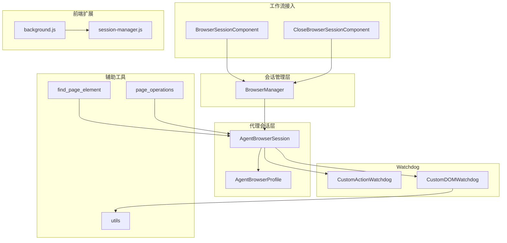
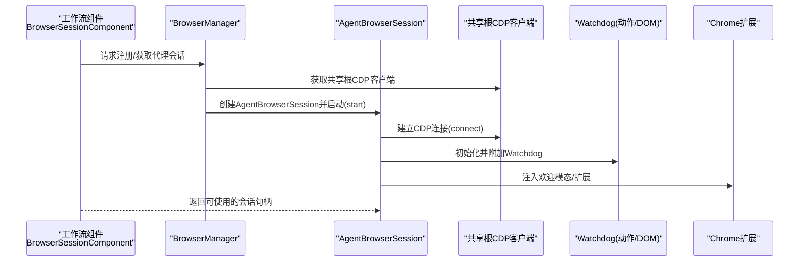
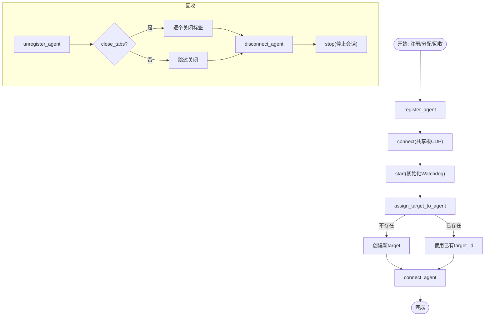
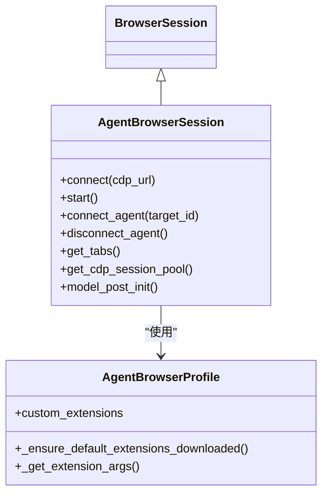
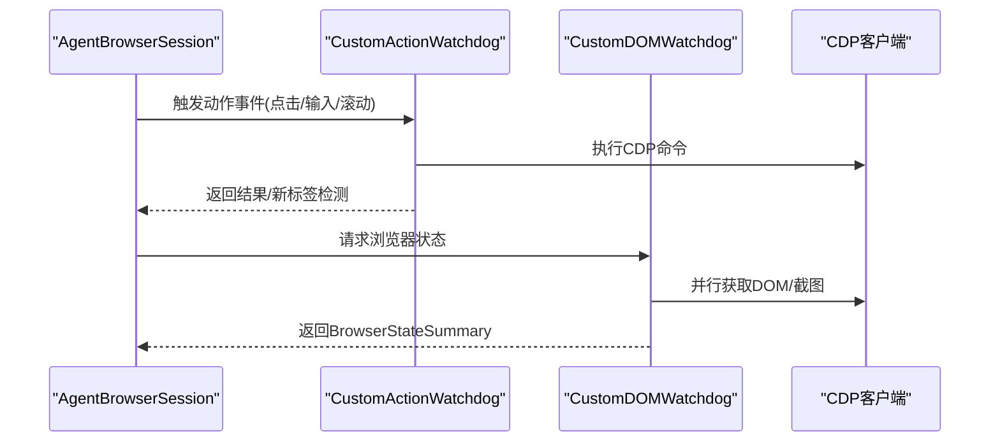
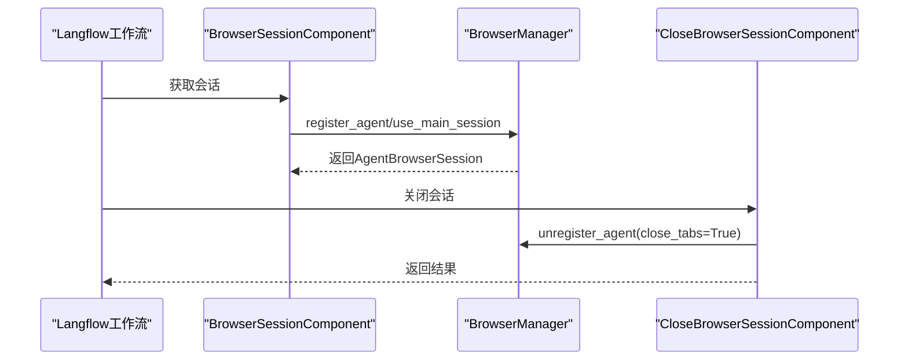
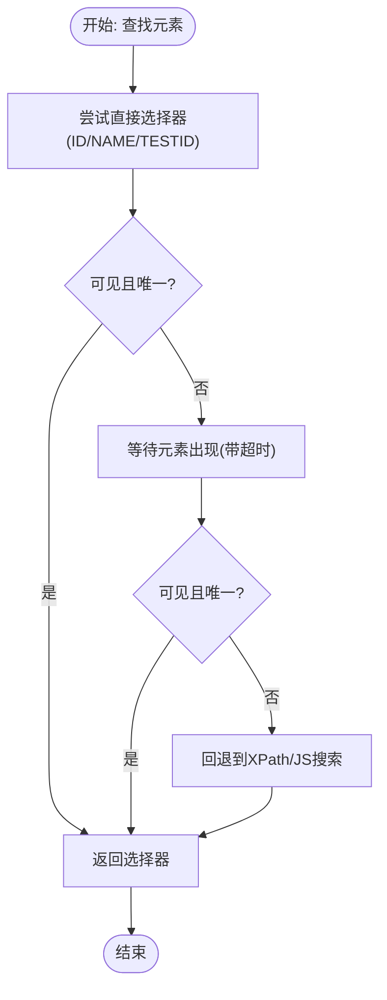
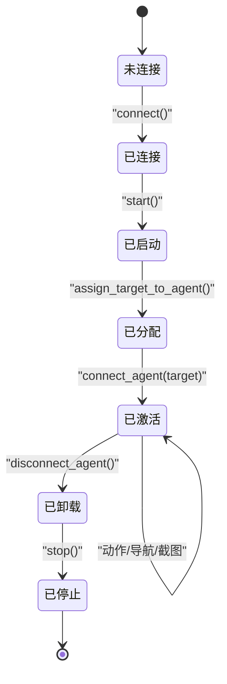
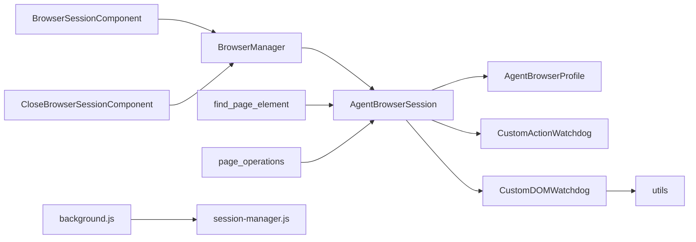

# 浏览器会话管理

<cite>
**本文引用的文件**
- [browser_manager.py](file://vibe_surf/browser/browser_manager.py)
- [agent_browser_session.py](file://vibe_surf/browser/agent_browser_session.py)
- [agen_browser_profile.py](file://vibe_surf/browser/agen_browser_profile.py)
- [browser_session.py](file://vibe_surf/workflows/Browser/browser_session.py)
- [close_browser_session.py](file://vibe_surf/workflows/Browser/close_browser_session.py)
- [action_watchdog.py](file://vibe_surf/browser/watchdogs/action_watchdog.py)
- [dom_watchdog.py](file://vibe_surf/browser/watchdogs/dom_watchdog.py)
- [page_operations.py](file://vibe_surf/browser/page_operations.py)
- [find_page_element.py](file://vibe_surf/browser/find_page_element.py)
- [utils.py](file://vibe_surf/browser/utils.py)
- [test_browser.py](file://tests/test_browser.py)
- [background.js](file://vibe_surf/chrome_extension/background.js)
- [session-manager.js](file://vibe_surf/chrome_extension/scripts/session-manager.js)
- [main.py](file://vibe_surf/backend/main.py)
</cite>

## 目录
1. [简介](#简介)
2. [项目结构](#项目结构)
3. [核心组件](#核心组件)
4. [架构总览](#架构总览)
5. [详细组件分析](#详细组件分析)
6. [依赖关系分析](#依赖关系分析)
7. [性能考量](#性能考量)
8. [故障排查指南](#故障排查指南)
9. [结论](#结论)
10. [附录](#附录)

## 简介
本文件系统性阐述浏览器会话管理的设计与实现，重点覆盖：
- BrowserManager 如何为多代理创建、维护与销毁隔离的浏览器会话，并协调多个代理的并行浏览器会话。
- AgentBrowserSession 如何管理单个浏览器会话的状态（生命周期、资源管理、错误恢复）。
- 会话池化策略与会话隔离机制，确保多代理环境下的稳定性。
- 实际调用流程示例与高并发场景下的性能表现建议。
- 会话状态转换图与资源使用监控建议。

## 项目结构
围绕浏览器会话管理的关键模块如下：
- 浏览器会话管理层：BrowserManager 负责注册/分配/回收代理会话，统一连接根 CDP 客户端。
- 代理浏览器会话层：AgentBrowserSession 继承自 BrowserSession，负责 CDP 连接、目标页管理、事件处理与 Watchdog 初始化。
- 配置层：AgentBrowserProfile 扩展了浏览器配置，支持扩展加载、安全参数等。
- 工作流接入层：BrowserSessionComponent/CloseBrowserSessionComponent 提供 Langflow 组件接口，便于在工作流中获取/关闭会话。
- Watchdog 层：ActionWatchdog/DOMWatchdog 等负责动作执行与 DOM/截图状态采集。
- 辅助工具：页面操作、元素提取、截图高亮等工具函数。
- 前端扩展：Chrome 扩展用于会话数据持久化与历史管理。

图表来源
- [browser_manager.py](file://vibe_surf/browser/browser_manager.py#L1-L201)
- [agent_browser_session.py](file://vibe_surf/browser/agent_browser_session.py#L1-L200)
- [agen_browser_profile.py](file://vibe_surf/browser/agen_browser_profile.py#L1-L137)
- [browser_session.py](file://vibe_surf/workflows/Browser/browser_session.py#L1-L55)
- [close_browser_session.py](file://vibe_surf/workflows/Browser/close_browser_session.py#L1-L51)
- [action_watchdog.py](file://vibe_surf/browser/watchdogs/action_watchdog.py#L1-L109)
- [dom_watchdog.py](file://vibe_surf/browser/watchdogs/dom_watchdog.py#L1-L250)
- [page_operations.py](file://vibe_surf/browser/page_operations.py#L1-L223)
- [find_page_element.py](file://vibe_surf/browser/find_page_element.py#L1-L200)
- [utils.py](file://vibe_surf/browser/utils.py#L666-L786)
- [background.js](file://vibe_surf/chrome_extension/background.js#L488-L519)
- [session-manager.js](file://vibe_surf/chrome_extension/scripts/session-manager.js#L1-L200)

章节来源
- [browser_manager.py](file://vibe_surf/browser/browser_manager.py#L1-L201)
- [agent_browser_session.py](file://vibe_surf/browser/agent_browser_session.py#L1-L200)
- [agen_browser_profile.py](file://vibe_surf/browser/agen_browser_profile.py#L1-L137)
- [browser_session.py](file://vibe_surf/workflows/Browser/browser_session.py#L1-L55)
- [close_browser_session.py](file://vibe_surf/workflows/Browser/close_browser_session.py#L1-L51)

## 核心组件
- BrowserManager
  - 维护每个代理的 AgentBrowserSession 映射，提供注册/分配/回收接口。
  - 共享根 CDP 客户端，确保多会话复用连接。
  - 提供目标页所有权查询、活跃标签检测、批量关闭等能力。
- AgentBrowserSession
  - 继承 BrowserSession，重写 connect/start 等方法，注入欢迎模态、代理认证、事件处理器与 Watchdog。
  - 维护 CDP 会话池（按 target_id），支持多标签页并行。
  - 提供 get_tabs/connect_agent/disconnect_agent 等核心接口。
- AgentBrowserProfile
  - 扩展浏览器配置，支持默认扩展下载与加载、代理设置、窗口尺寸等。
- 工作流组件
  - BrowserSessionComponent：根据是否使用主会话或指定 target_id 获取会话。
  - CloseBrowserSessionComponent：关闭指定会话（禁止关闭主会话）。
- Watchdog
  - ActionWatchdog：点击、输入、滚动、上传等动作执行与新标签检测。
  - DOMWatchdog：并行构建 DOM 与截图，生成 BrowserStateSummary。
- 辅助工具
  - page_operations：文本滚动、元素等待与选择器尝试。
  - find_page_element：语义化元素提取与映射。
  - utils：截图高亮、字体缓存、视口信息获取。

章节来源
- [browser_manager.py](file://vibe_surf/browser/browser_manager.py#L1-L201)
- [agent_browser_session.py](file://vibe_surf/browser/agent_browser_session.py#L1-L200)
- [agen_browser_profile.py](file://vibe_surf/browser/agen_browser_profile.py#L1-L137)
- [browser_session.py](file://vibe_surf/workflows/Browser/browser_session.py#L1-L55)
- [close_browser_session.py](file://vibe_surf/workflows/Browser/close_browser_session.py#L1-L51)
- [action_watchdog.py](file://vibe_surf/browser/watchdogs/action_watchdog.py#L1-L109)
- [dom_watchdog.py](file://vibe_surf/browser/watchdogs/dom_watchdog.py#L1-L250)
- [page_operations.py](file://vibe_surf/browser/page_operations.py#L1-L223)
- [find_page_element.py](file://vibe_surf/browser/find_page_element.py#L1-L200)
- [utils.py](file://vibe_surf/browser/utils.py#L666-L786)

## 架构总览
下图展示了从工作流到浏览器会话管理的整体交互路径。

图表来源
- [browser_session.py](file://vibe_surf/workflows/Browser/browser_session.py#L1-L55)
- [browser_manager.py](file://vibe_surf/browser/browser_manager.py#L1-L201)
- [agent_browser_session.py](file://vibe_surf/browser/agent_browser_session.py#L1-L200)
- [action_watchdog.py](file://vibe_surf/browser/watchdogs/action_watchdog.py#L1-L109)
- [dom_watchdog.py](file://vibe_surf/browser/watchdogs/dom_watchdog.py#L1-L250)
- [background.js](file://vibe_surf/chrome_extension/background.js#L488-L519)

## 详细组件分析

### BrowserManager 分析
- 角色与职责
  - 注册代理：首次注册时创建 AgentBrowserSession，注入共享根 CDP 客户端并启动。
  - 分配目标页：支持按 target_id 分配或自动创建新页；校验目标归属，避免跨代理抢占。
  - 回收与清理：支持按代理注销、关闭其所有标签页；断开 CDP 会话池并释放资源。
  - 查询与诊断：提供活跃代理列表、目标拥有者查询、活跃标签检测、连接健康检查。
- 关键流程
  - 注册流程：register_agent -> connect -> start -> assign_target_to_agent
  - 分配流程：assign_target_to_agent -> 校验/创建目标 -> connect_agent
  - 回收流程：unregister_agent -> 可选关闭标签 -> 断开会话 -> 停止会话
- 并发与隔离
  - 每个代理独立持有自己的 AgentBrowserSession，彼此通过 target_id 隔离。
  - 共享根 CDP 客户端减少连接成本，同时通过目标页维度实现逻辑隔离。

图表来源
- [browser_manager.py](file://vibe_surf/browser/browser_manager.py#L1-L201)

章节来源
- [browser_manager.py](file://vibe_surf/browser/browser_manager.py#L1-L201)

### AgentBrowserSession 分析
- 生命周期
  - connect：解析/获取 WebSocket 地址，建立根 CDP 客户端，自动挂载，获取可用页面并创建 agent_focus。
  - start：注入欢迎模态、代理认证、事件总线绑定、初始化 Watchdog（安全、弹窗、动作、截图、DOM）。
  - get_tabs/_cdp_get_all_pages：过滤有效页面，返回当前会话拥有的目标集合。
  - connect_agent/disconnect_agent：按 target_id 建立/断开会话池。
  - stop：清理缓存状态与会话。
- 资源管理
  - CDP 会话池：按 target_id 存储，支持多标签并行。
  - 事件总线：注册多种事件处理器，保证动作与状态同步。
  - Watchdog：并行化动作与 DOM/截图，提升吞吐。
- 错误恢复
  - CDP 连接失败时抛出致命错误并清理部分状态，避免半成品会话。
  - 动作执行前校验 agent_focus/target_id，异常时返回验证错误而非记录错误日志，便于上层处理。
  - DOM/截图任务失败时降级为最小状态，保证系统可用性。

图表来源
- [agent_browser_session.py](file://vibe_surf/browser/agent_browser_session.py#L1-L200)
- [agen_browser_profile.py](file://vibe_surf/browser/agen_browser_profile.py#L1-L137)

章节来源
- [agent_browser_session.py](file://vibe_surf/browser/agent_browser_session.py#L1-L200)
- [agen_browser_profile.py](file://vibe_surf/browser/agen_browser_profile.py#L1-L137)

### Watchdog 分析
- CustomActionWatchdog
  - 在点击等动作前进行预检（如文件输入、打印按钮），必要时直接生成 PDF 或切换到新标签。
  - 对异常返回验证错误，避免产生错误日志风暴。
- CustomDOMWatchdog
  - 并行构建 DOM 与截图，结合视口信息与高亮策略，输出完整的 BrowserStateSummary。
  - 失败时降级为最小状态，保证系统鲁棒性。

图表来源
- [action_watchdog.py](file://vibe_surf/browser/watchdogs/action_watchdog.py#L1-L109)
- [dom_watchdog.py](file://vibe_surf/browser/watchdogs/dom_watchdog.py#L1-L250)

章节来源
- [action_watchdog.py](file://vibe_surf/browser/watchdogs/action_watchdog.py#L1-L109)
- [dom_watchdog.py](file://vibe_surf/browser/watchdogs/dom_watchdog.py#L1-L250)

### 工作流接入与关闭
- BrowserSessionComponent
  - 支持使用主会话或为当前工作流创建独立会话；可指定 target_id。
- CloseBrowserSessionComponent
  - 仅允许关闭非主会话的代理会话；否则提示不可关闭。

图表来源
- [browser_session.py](file://vibe_surf/workflows/Browser/browser_session.py#L1-L55)
- [close_browser_session.py](file://vibe_surf/workflows/Browser/close_browser_session.py#L1-L51)
- [browser_manager.py](file://vibe_surf/browser/browser_manager.py#L1-L201)

章节来源
- [browser_session.py](file://vibe_surf/workflows/Browser/browser_session.py#L1-L55)
- [close_browser_session.py](file://vibe_surf/workflows/Browser/close_browser_session.py#L1-L51)

### 页面操作与元素提取
- page_operations
  - 文本滚动：优先 XPath 搜索，回退 JavaScript 方案。
  - 元素等待：支持层级回退与严格模式提示。
  - 直接选择器尝试：基于 ID/name/data-* 等属性生成候选选择器并验证可见性。
- find_page_element
  - 语义化提取：从 ARIA/标签/占位符/标题等提取元素文本，生成确定性选择器与上下文描述。
  - 重复文本处理：通过容器/兄弟节点/位置等上下文去重。

图表来源
- [page_operations.py](file://vibe_surf/browser/page_operations.py#L1-L223)
- [find_page_element.py](file://vibe_surf/browser/find_page_element.py#L1-L200)

章节来源
- [page_operations.py](file://vibe_surf/browser/page_operations.py#L1-L223)
- [find_page_element.py](file://vibe_surf/browser/find_page_element.py#L1-L200)

### 会话状态转换图
以下状态图描述了单个代理会话从创建到销毁的关键状态与事件。

图表来源
- [browser_manager.py](file://vibe_surf/browser/browser_manager.py#L1-L201)
- [agent_browser_session.py](file://vibe_surf/browser/agent_browser_session.py#L1-L200)

## 依赖关系分析
- 组件耦合
  - BrowserManager 与 AgentBrowserSession 强耦合：前者持有后者实例，后者依赖前者提供的共享根 CDP 客户端。
  - AgentBrowserSession 与 Watchdog 弱耦合：通过事件总线与 start/model_post_init 初始化。
  - 工作流组件与 BrowserManager 解耦：通过 shared_state 访问，便于测试与替换。
- 外部依赖
  - CDP 客户端：browser_use.cdp_use 与 browser_use.browser.session。
  - Chrome 扩展：用于会话数据持久化与历史管理。
  - Langflow 组件：作为会话接入点。

图表来源
- [browser_manager.py](file://vibe_surf/browser/browser_manager.py#L1-L201)
- [agent_browser_session.py](file://vibe_surf/browser/agent_browser_session.py#L1-L200)
- [agen_browser_profile.py](file://vibe_surf/browser/agen_browser_profile.py#L1-L137)
- [browser_session.py](file://vibe_surf/workflows/Browser/browser_session.py#L1-L55)
- [close_browser_session.py](file://vibe_surf/workflows/Browser/close_browser_session.py#L1-L51)
- [action_watchdog.py](file://vibe_surf/browser/watchdogs/action_watchdog.py#L1-L109)
- [dom_watchdog.py](file://vibe_surf/browser/watchdogs/dom_watchdog.py#L1-L250)
- [utils.py](file://vibe_surf/browser/utils.py#L666-L786)
- [find_page_element.py](file://vibe_surf/browser/find_page_element.py#L1-L200)
- [page_operations.py](file://vibe_surf/browser/page_operations.py#L1-L223)
- [background.js](file://vibe_surf/chrome_extension/background.js#L488-L519)
- [session-manager.js](file://vibe_surf/chrome_extension/scripts/session-manager.js#L1-L200)

章节来源
- [browser_manager.py](file://vibe_surf/browser/browser_manager.py#L1-L201)
- [agent_browser_session.py](file://vibe_surf/browser/agent_browser_session.py#L1-L200)
- [browser_session.py](file://vibe_surf/workflows/Browser/browser_session.py#L1-L55)
- [close_browser_session.py](file://vibe_surf/workflows/Browser/close_browser_session.py#L1-L51)

## 性能考量
- 并行化
  - DOMWatchdog 并行构建 DOM 与截图，显著降低状态获取延迟。
  - ActionWatchdog 在动作前后并行检测新标签，避免阻塞。
- 连接复用
  - BrowserManager 共享根 CDP 客户端，减少连接数与握手开销。
- 会话池化
  - AgentBrowserSession 的 CDP 会话池按 target_id 维度管理，支持多标签并行，避免频繁重建。
- 资源限制
  - 通过 allowed_domains 等配置限制访问域，减少无效网络请求。
  - DOM/截图失败时降级为最小状态，保障整体吞吐。
- 高并发建议
  - 合理设置等待与超时参数，避免长时间阻塞。
  - 使用异步 I/O 与事件驱动，避免阻塞主线程。
  - 对热点页面启用缓存（如 DOM/截图），减少重复计算。

[本节为通用指导，不直接分析具体文件]

## 故障排查指南
- 连接失败
  - 症状：connect 抛出致命错误。
  - 排查：确认 CDP URL 是否正确、WebSocket 地址是否可达、扩展是否加载成功。
  - 参考：[agent_browser_session.py](file://vibe_surf/browser/agent_browser_session.py#L1-L200)
- 会话不可用
  - 症状：动作执行时报“会话损坏”。
  - 排查：检查 agent_focus/target_id 是否为空；确认会话未被意外断开。
  - 参考：[action_watchdog.py](file://vibe_surf/browser/watchdogs/action_watchdog.py#L1-L109)
- 目标页冲突
  - 症状：分配目标失败或被其他代理占用。
  - 排查：使用 get_target_owner 查询归属；确保 target_id 仅由其拥有者分配。
  - 参考：[browser_manager.py](file://vibe_surf/browser/browser_manager.py#L1-L201)
- 主会话误关
  - 症状：关闭会话提示不可关闭。
  - 排查：确认传入的是代理会话而非主会话。
  - 参考：[close_browser_session.py](file://vibe_surf/workflows/Browser/close_browser_session.py#L1-L51)
- 浏览器不可用
  - 症状：check_browser_connected 返回 False。
  - 排查：检查浏览器进程状态与 Target.getTargets 是否可用。
  - 参考：[browser_manager.py](file://vibe_surf/browser/browser_manager.py#L1-L201)
- 后端健康检查
  - 症状：后端检测到无可用浏览器时触发优雅退出。
  - 排查：确认浏览器连接状态与后台健康检查逻辑。
  - 参考：[main.py](file://vibe_surf/backend/main.py#L109-L137)

章节来源
- [agent_browser_session.py](file://vibe_surf/browser/agent_browser_session.py#L1-L200)
- [action_watchdog.py](file://vibe_surf/browser/watchdogs/action_watchdog.py#L1-L109)
- [browser_manager.py](file://vibe_surf/browser/browser_manager.py#L1-L201)
- [close_browser_session.py](file://vibe_surf/workflows/Browser/close_browser_session.py#L1-L51)
- [main.py](file://vibe_surf/backend/main.py#L109-L137)

## 结论
本系统通过 BrowserManager 与 AgentBrowserSession 的分层设计，实现了多代理并行会话的高效管理与强隔离。共享根 CDP 客户端与会话池化策略降低了资源消耗，Watchdog 的并行化与降级机制提升了稳定性。配合工作流组件与前端扩展，形成从接入到持久化的完整闭环。建议在高并发场景下进一步优化超时与缓存策略，并持续完善安全配置与错误恢复路径。

[本节为总结性内容，不直接分析具体文件]

## 附录
- 会话创建与管理流程示例（代码路径）
  - 注册代理并获取会话：[browser_session.py](file://vibe_surf/workflows/Browser/browser_session.py#L1-L55)
  - 分配目标页：[browser_manager.py](file://vibe_surf/browser/browser_manager.py#L1-L201)
  - 关闭会话：[close_browser_session.py](file://vibe_surf/workflows/Browser/close_browser_session.py#L1-L51)
- 多代理隔离与清理测试
  - 多代理隔离与清理测试：[test_browser.py](file://tests/test_browser.py#L1-L74)
- 前端扩展会话持久化
  - 存储会话数据与历史：[background.js](file://vibe_surf/chrome_extension/background.js#L488-L519)，[session-manager.js](file://vibe_surf/chrome_extension/scripts/session-manager.js#L1-L200)

章节来源
- [browser_session.py](file://vibe_surf/workflows/Browser/browser_session.py#L1-L55)
- [browser_manager.py](file://vibe_surf/browser/browser_manager.py#L1-L201)
- [close_browser_session.py](file://vibe_surf/workflows/Browser/close_browser_session.py#L1-L51)
- [test_browser.py](file://tests/test_browser.py#L1-L74)
- [background.js](file://vibe_surf/chrome_extension/background.js#L488-L519)
- [session-manager.js](file://vibe_surf/chrome_extension/scripts/session-manager.js#L1-L200)