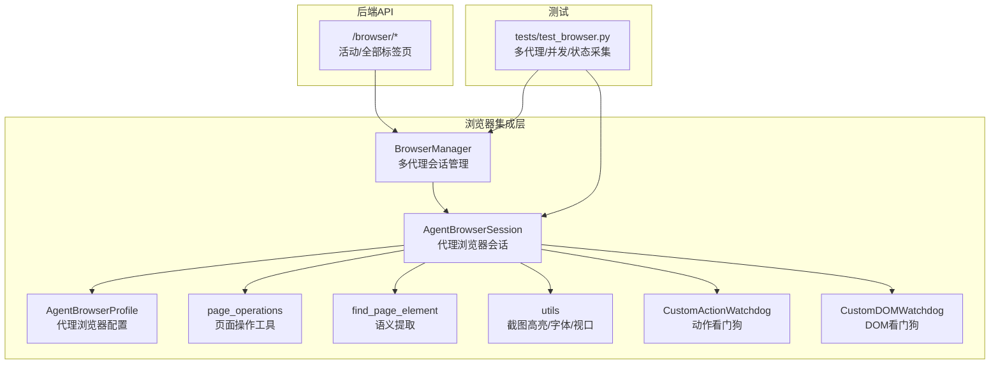
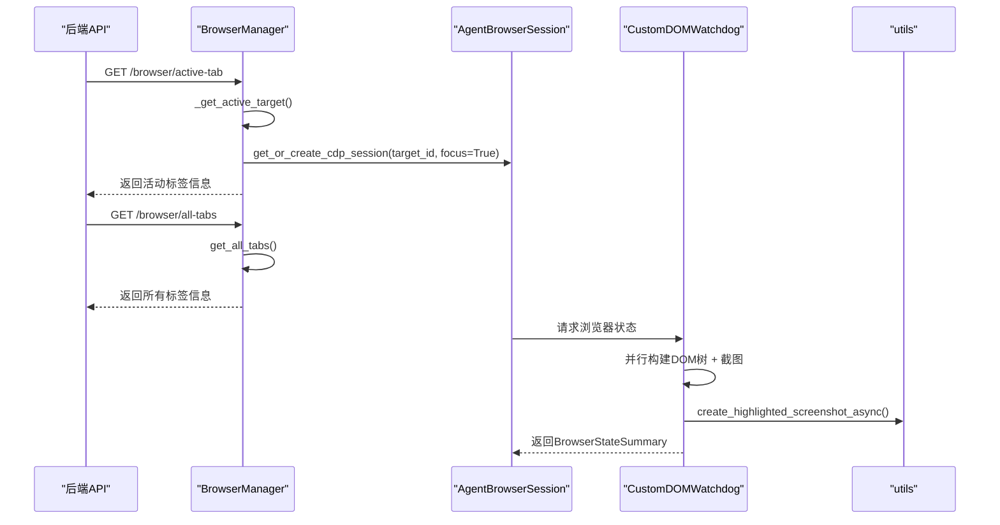
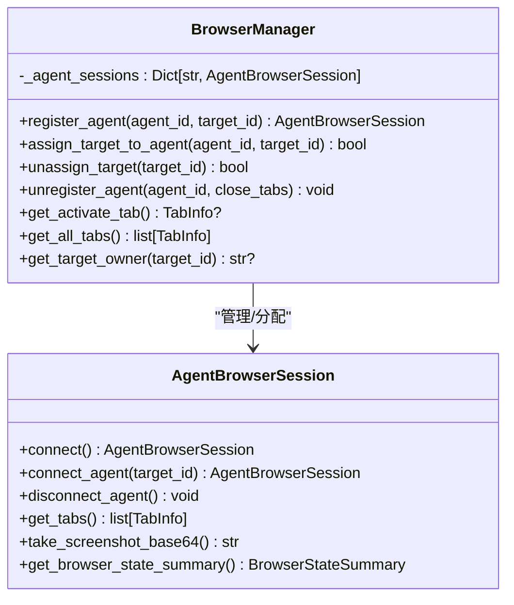
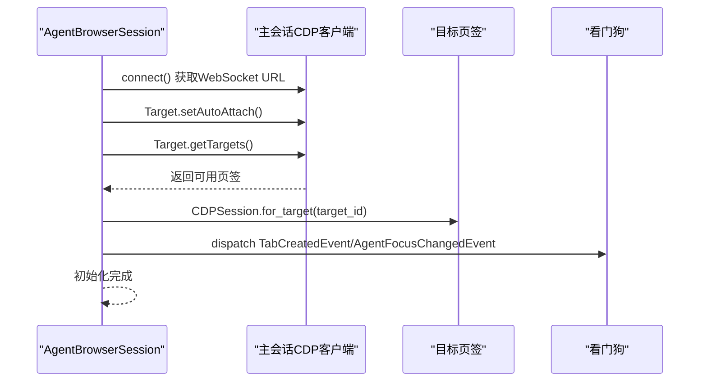
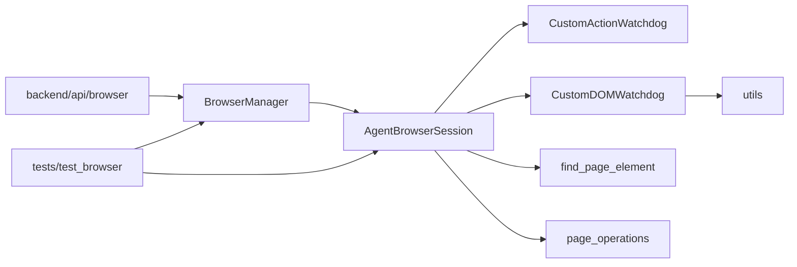

# 浏览器集成

<cite>
**本文引用的文件**
- [browser_manager.py](file://vibe_surf/browser/browser_manager.py)
- [agent_browser_session.py](file://vibe_surf/browser/agent_browser_session.py)
- [page_operations.py](file://vibe_surf/browser/page_operations.py)
- [find_page_element.py](file://vibe_surf/browser/find_page_element.py)
- [utils.py](file://vibe_surf/browser/utils.py)
- [agen_browser_profile.py](file://vibe_surf/browser/agen_browser_profile.py)
- [action_watchdog.py](file://vibe_surf/browser/watchdogs/action_watchdog.py)
- [dom_watchdog.py](file://vibe_surf/browser/watchdogs/dom_watchdog.py)
- [browser.py](file://vibe_surf/backend/api/browser.py)
- [test_browser.py](file://tests/test_browser.py)
- [__init__.py](file://vibe_surf/browser/__init__.py)
</cite>

## 目录
1. [简介](#简介)
2. [项目结构](#项目结构)
3. [核心组件](#核心组件)
4. [架构总览](#架构总览)
5. [详细组件分析](#详细组件分析)
6. [依赖关系分析](#依赖关系分析)
7. [性能考量](#性能考量)
8. [故障排查指南](#故障排查指南)
9. [结论](#结论)
10. [附录](#附录)

## 简介
本文件面向VibeSurf浏览器集成子系统，系统性阐述浏览器管理组件的整体设计，包括：
- 浏览器实例管理：多代理隔离、目标页签分配与回收
- 标签页控制：活动页签检测、新标签页创建与切换
- DOM与页面元素操作：语义化元素提取、选择器生成与等待策略、滚动定位
- 安全与性能：代理侧扩展加载、网络稳定等待、异步并行处理、截图高亮
- 与代理系统、后端API、前端UI的交互机制

## 项目结构
浏览器集成位于vibe_surf/browser目录，围绕以下模块协同工作：
- 浏览器管理器：BrowserManager负责多代理会话注册、目标页签分配与回收
- 代理浏览器会话：AgentBrowserSession继承自BrowserSession，提供代理专用配置与事件处理
- 页面操作工具：page_operations提供滚动到文本、直接选择器尝试、元素等待等
- DOM元素提取：find_page_element通过JS注入提取语义映射，支持层级选择器与上下文增强
- 工具函数：utils提供字体缓存、颜色生成、截图高亮、视口信息获取等
- 自定义配置：agen_browser_profile定义代理浏览器配置（含扩展加载）
- 观察者/看门狗：action_watchdog与dom_watchdog分别处理动作执行与DOM状态采集
- 后端API：backend/api/browser提供活动/全部标签页查询接口
- 测试用例：tests/test_browser验证多代理隔离、清理、并发状态采集等

图表来源
- [browser_manager.py](file://vibe_surf/browser/browser_manager.py#L1-L269)
- [agent_browser_session.py](file://vibe_surf/browser/agent_browser_session.py#L1-L800)
- [agen_browser_profile.py](file://vibe_surf/browser/agen_browser_profile.py#L1-L137)
- [page_operations.py](file://vibe_surf/browser/page_operations.py#L1-L223)
- [find_page_element.py](file://vibe_surf/browser/find_page_element.py#L1-L800)
- [utils.py](file://vibe_surf/browser/utils.py#L1-L786)
- [action_watchdog.py](file://vibe_surf/browser/watchdogs/action_watchdog.py#L1-L109)
- [dom_watchdog.py](file://vibe_surf/browser/watchdogs/dom_watchdog.py#L1-L250)
- [browser.py](file://vibe_surf/backend/api/browser.py#L1-L71)
- [test_browser.py](file://tests/test_browser.py#L1-L416)

章节来源
- [browser_manager.py](file://vibe_surf/browser/browser_manager.py#L1-L269)
- [agent_browser_session.py](file://vibe_surf/browser/agent_browser_session.py#L1-L800)
- [agen_browser_profile.py](file://vibe_surf/browser/agen_browser_profile.py#L1-L137)
- [page_operations.py](file://vibe_surf/browser/page_operations.py#L1-L223)
- [find_page_element.py](file://vibe_surf/browser/find_page_element.py#L1-L800)
- [utils.py](file://vibe_surf/browser/utils.py#L1-L786)
- [action_watchdog.py](file://vibe_surf/browser/watchdogs/action_watchdog.py#L1-L109)
- [dom_watchdog.py](file://vibe_surf/browser/watchdogs/dom_watchdog.py#L1-L250)
- [browser.py](file://vibe_surf/backend/api/browser.py#L1-L71)
- [test_browser.py](file://tests/test_browser.py#L1-L416)

## 核心组件
- BrowserManager：集中式多代理会话管理，负责注册/分配/回收目标页签，提供活动页签检测与标签页列表查询
- AgentBrowserSession：代理专用浏览器会话，封装CDP连接、目标页签绑定、事件处理器注册、欢迎模态注入、代理认证等
- AgentBrowserProfile：代理浏览器配置，包含扩展加载、沙箱/安全参数、渲染稳定性等
- page_operations：页面级操作工具，如滚动到文本、直接选择器尝试、元素等待
- find_page_element：语义化元素提取，生成可复用的选择器映射，支持层级与上下文增强
- utils：截图高亮、字体缓存、颜色生成、视口信息获取
- CustomActionWatchdog/CustomDOMWatchdog：动作与DOM状态采集的看门狗，统一事件入口与错误处理
- backend/api/browser：对外暴露活动/全部标签页查询接口
- tests/test_browser：验证多代理隔离、清理、并发状态采集与截图高亮

章节来源
- [browser_manager.py](file://vibe_surf/browser/browser_manager.py#L1-L269)
- [agent_browser_session.py](file://vibe_surf/browser/agent_browser_session.py#L1-L800)
- [agen_browser_profile.py](file://vibe_surf/browser/agen_browser_profile.py#L1-L137)
- [page_operations.py](file://vibe_surf/browser/page_operations.py#L1-L223)
- [find_page_element.py](file://vibe_surf/browser/find_page_element.py#L1-L800)
- [utils.py](file://vibe_surf/browser/utils.py#L1-L786)
- [action_watchdog.py](file://vibe_surf/browser/watchdogs/action_watchdog.py#L1-L109)
- [dom_watchdog.py](file://vibe_surf/browser/watchdogs/dom_watchdog.py#L1-L250)
- [browser.py](file://vibe_surf/backend/api/browser.py#L1-L71)
- [test_browser.py](file://tests/test_browser.py#L1-L416)

## 架构总览
浏览器集成采用“主会话共享 + 多代理隔离”的架构：
- 主会话（main_browser_session）持有根CDP客户端，用于全局目标页签管理与连接检查
- 每个代理拥有独立的AgentBrowserSession，内部维护CDP会话池（按target_id分发），并通过事件总线与看门狗协作
- 代理浏览器配置（AgentBrowserProfile）统一扩展加载、安全参数与渲染稳定性设置
- DOM状态采集与截图高亮在看门狗中并行执行，减少整体等待时间
- 后端API提供活动/全部标签页查询，便于前端UI与外部系统集成

图表来源
- [browser.py](file://vibe_surf/backend/api/browser.py#L1-L71)
- [browser_manager.py](file://vibe_surf/browser/browser_manager.py#L1-L269)
- [dom_watchdog.py](file://vibe_surf/browser/watchdogs/dom_watchdog.py#L1-L250)
- [utils.py](file://vibe_surf/browser/utils.py#L666-L786)

## 详细组件分析

### 组件A：BrowserManager（多代理会话与目标页签管理）
职责与流程
- 注册代理：为每个agent创建AgentBrowserSession，复用主会话的根CDP客户端，初始化看门狗
- 目标页签分配：将指定target_id分配给代理；若未提供则创建新页签；校验归属权避免跨代理操作
- 目标页签回收：支持按需关闭代理持有的所有页签或仅断开连接
- 活动页签检测：遍历所有页签，基于可见性/焦点判断当前活动页签，必要时创建新页签
- 标签页查询：提供活动页签与全部页签信息，供后端API与前端UI使用

关键点
- 安全性：分配前校验target归属；禁止重复注册同一agent
- 可靠性：连接失败时重试；关闭页签异常不中断清理流程
- 可观测性：记录关键事件与警告，便于问题定位

图表来源
- [browser_manager.py](file://vibe_surf/browser/browser_manager.py#L1-L269)
- [agent_browser_session.py](file://vibe_surf/browser/agent_browser_session.py#L1-L800)

章节来源
- [browser_manager.py](file://vibe_surf/browser/browser_manager.py#L1-L269)

### 组件B：AgentBrowserSession（代理浏览器会话）
职责与流程
- 连接与会话：建立CDP连接，自动获取WebSocket地址；创建/复用CDP会话，绑定目标页签
- 事件处理：注册看门狗事件处理器，确保动作与DOM状态采集的统一入口
- 欢迎模态：首次连接时注入扩展安装指引与路径提示，提升用户体验
- 代理认证：支持代理服务器认证流程
- 页签管理：提供获取当前页签、切换焦点、关闭页签等能力

关键点
- 配置优先：优先使用本地浏览器，否则远程CDP；自动解析/websocket调试URL
- 安全与隔离：每个代理独立CDP会话池，避免跨代理干扰
- 错误恢复：连接失败抛出致命错误，确保系统健康重启

图表来源
- [agent_browser_session.py](file://vibe_surf/browser/agent_browser_session.py#L1-L800)

章节来源
- [agent_browser_session.py](file://vibe_surf/browser/agent_browser_session.py#L1-L800)

### 组件C：AgentBrowserProfile（代理浏览器配置）
职责与流程
- 扩展加载：下载并缓存默认扩展（如Cookie处理），支持自定义扩展路径
- 参数合并：将传入参数与默认配置合并，确保is_local逻辑正确
- 启动参数：生成启用扩展、禁用扩展文件访问检查等启动参数

关键点
- 缓存策略：扩展CRX下载与解压结果缓存，减少重复开销
- 兼容性：支持不同平台字体与默认扩展加载

章节来源
- [agen_browser_profile.py](file://vibe_surf/browser/agen_browser_profile.py#L1-L137)

### 组件D：page_operations（页面元素查找与操作）
职责与流程
- 滚动到文本：先尝试XPath搜索，再回退到JS树遍历；成功后滚动元素至可视区域
- 直接选择器尝试：对输入文本进行清洗与变体尝试（ID/name/data-testid等），并验证可见性
- 元素等待：支持超时轮询与层级选择器（如:nth-of-type），返回实际使用的selector

关键点
- 容错策略：多种查询路径与回退方案，提高鲁棒性
- 性能：优先使用CDP DOM接口，必要时才回退到Runtime.evaluate

章节来源
- [page_operations.py](file://vibe_surf/browser/page_operations.py#L1-L223)

### 组件E：find_page_element（语义化元素提取）
职责与流程
- 语义提取：通过JS注入扫描交互元素（按钮、输入框、下拉等），生成包含标签、类型、角色、属性、容器上下文、兄弟上下文、DOM路径等的丰富信息
- 去重与上下文：当文本重复时，通过父容器、兄弟位置、DOM路径等上下文增强生成唯一标识
- 选择器生成：输出可用于点击/填充的CSS选择器与层级选择器

关键点
- 上下文增强：针对日历、下拉、预订等复杂控件提供特定上下文
- 错误处理：对不可见元素跳过，异常情况记录调试日志

章节来源
- [find_page_element.py](file://vibe_surf/browser/find_page_element.py#L1-L800)

### 组件F：utils（截图高亮与视口信息）
职责与流程
- 字体缓存：跨进程缓存字体路径与已加载字体对象，避免重复I/O
- 颜色生成：生成视觉上区分度高的颜色序列，并打乱以提升相邻对比
- 截图高亮：将交互元素边界框绘制到截图上，支持动态文字大小与非重叠标签放置
- 视口信息：从CDP布局指标计算设备像素比与滚动偏移，保证坐标一致性

关键点
- 性能：高亮绘制在主线程外进行，必要时使用线程池；坐标转换与缩放在CDP会话辅助下完成
- 可靠性：失败回退到原始截图，避免阻塞流程

章节来源
- [utils.py](file://vibe_surf/browser/utils.py#L1-L786)

### 组件G：CustomActionWatchdog（动作看门狗）
职责与流程
- 动作入口：统一处理点击、输入、滚动、上传、等待等动作事件
- 安全与合规：检测文件输入与打印相关元素，避免误操作；打印场景直接生成PDF
- 新标签检测：动作后检测新增页签并自动切换焦点
- 错误处理：捕获会话失效等异常，返回验证错误而不中断

关键点
- 会话健壮性：在执行前检查agent_focus与target_id
- 可观测性：记录动作元数据与新标签切换信息

章节来源
- [action_watchdog.py](file://vibe_surf/browser/watchdogs/action_watchdog.py#L1-L109)

### 组件H：CustomDOMWatchdog（DOM看门狗）
职责与流程
- 并行采集：同时构建DOM树与抓取干净截图，降低总等待时间
- 高亮叠加：在DOM可用且启用高亮时，调用utils进行Python侧高亮叠加
- 状态封装：组装BrowserStateSummary，包含DOM、截图、标签、页面信息、PDF识别标记等
- 容错回退：DOM或截图任一失败时，返回最小可用状态

关键点
- 网络稳定：在有意义页面上等待网络空闲，提升DOM准确性
- 视口兼容：无法获取CDP视口信息时使用配置默认值

章节来源
- [dom_watchdog.py](file://vibe_surf/browser/watchdogs/dom_watchdog.py#L1-L250)

### 组件I：后端API（标签页查询）
职责与流程
- /browser/active-tab：返回当前活动标签的URL与标题
- /browser/all-tabs：返回所有页签的简要信息

关键点
- 初始化检查：未初始化时返回服务不可用
- 异常处理：捕获异常并返回友好错误信息

章节来源
- [browser.py](file://vibe_surf/backend/api/browser.py#L1-L71)

### 组件J：测试用例（多代理隔离与并发）
职责与流程
- 多代理隔离：两个代理并发导航至不同页面，验证彼此不受影响
- 清理回收：注销代理时关闭其所有页签
- 并发状态采集：三个代理并发截图与状态采集，保存高亮截图
- 活动页签验证：通过manager验证活动页签切换

关键点
- 并发诊断：记录各阶段耗时，便于性能分析
- 截图高亮：验证utils高亮叠加逻辑

章节来源
- [test_browser.py](file://tests/test_browser.py#L1-L416)

## 依赖关系分析
- 组件耦合
  - BrowserManager与AgentBrowserSession：强耦合（管理/分配/回收）
  - AgentBrowserSession与看门狗：事件驱动弱耦合
  - utils与AgentBrowserSession：工具函数被看门狗调用
- 外部依赖
  - CDP客户端：browser_use.cdp、cdp_use.cdp
  - 事件总线：bubus.EventBus
  - 扩展加载：CONFIG.BROWSER_USE_EXTENSIONS_DIR
- 循环依赖
  - 无明显循环依赖；看门狗通过事件与会话交互，避免直接循环导入

图表来源
- [browser_manager.py](file://vibe_surf/browser/browser_manager.py#L1-L269)
- [agent_browser_session.py](file://vibe_surf/browser/agent_browser_session.py#L1-L800)
- [dom_watchdog.py](file://vibe_surf/browser/watchdogs/dom_watchdog.py#L1-L250)
- [utils.py](file://vibe_surf/browser/utils.py#L1-L786)
- [find_page_element.py](file://vibe_surf/browser/find_page_element.py#L1-L800)
- [page_operations.py](file://vibe_surf/browser/page_operations.py#L1-L223)
- [browser.py](file://vibe_surf/backend/api/browser.py#L1-L71)
- [test_browser.py](file://tests/test_browser.py#L1-L416)

## 性能考量
- 并行化
  - DOM构建与截图并行，显著降低状态采集延迟
  - 多代理并发导航与状态采集，充分利用CPU与网络资源
- 资源复用
  - 字体缓存与扩展缓存减少I/O与下载成本
  - 代理会话池按target_id复用，避免频繁重建
- 稳定性等待
  - 在有意义页面上等待网络空闲，减少DOM抖动
  - 元素等待采用超时轮询，避免长时间阻塞
- 截图高亮
  - Python侧高亮叠加在CDP会话辅助下进行，坐标转换与缩放避免误差

[本节为通用指导，无需具体文件引用]

## 故障排查指南
常见问题与定位建议
- 代理连接失败
  - 检查CDP URL是否可访问，确认WebSocket调试URL解析成功
  - 查看连接日志与异常栈，确认是否抛出致命错误
- 目标页签归属冲突
  - 分配时校验target归属，避免跨代理操作
  - 若分配失败，检查目标ID有效性与owner映射
- 动作执行异常
  - 看门狗会在会话失效时返回验证错误，检查agent_focus与target_id
  - 对于打印按钮，确认PDF生成流程是否成功
- DOM状态采集失败
  - 看门狗在DOM或截图失败时返回最小可用状态，检查网络与页面稳定性
  - 若启用高亮，确认utils高亮叠加是否成功
- 后端API不可用
  - 确认browser_manager已初始化
  - 捕获异常并查看错误详情

章节来源
- [agent_browser_session.py](file://vibe_surf/browser/agent_browser_session.py#L1-L800)
- [action_watchdog.py](file://vibe_surf/browser/watchdogs/action_watchdog.py#L1-L109)
- [dom_watchdog.py](file://vibe_surf/browser/watchdogs/dom_watchdog.py#L1-L250)
- [browser.py](file://vibe_surf/backend/api/browser.py#L1-L71)

## 结论
VibeSurf浏览器集成为多代理隔离、高可靠性的自动化浏览提供了坚实基础：
- 通过BrowserManager与AgentBrowserSession实现代理间完全隔离与高效协作
- 通过CustomActionWatchdog与CustomDOMWatchdog统一动作与状态采集入口，保障一致性与可观测性
- 通过utils与find_page_element提升DOM可视化与元素定位的鲁棒性
- 通过后端API与测试用例验证了多代理并发与清理流程的正确性

[本节为总结性内容，无需具体文件引用]

## 附录
- 导出清单：vibe_surf/browser/__init__.py导出AgentBrowserSession、AgentBrowserProfile、BrowserManager，便于上层模块统一导入

章节来源
- [__init__.py](file://vibe_surf/browser/__init__.py#L1-L8)