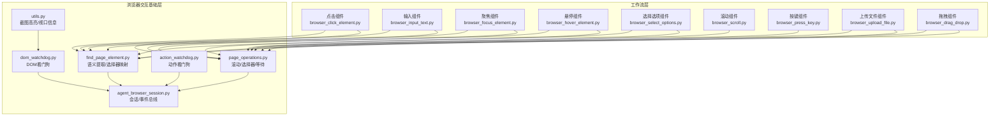
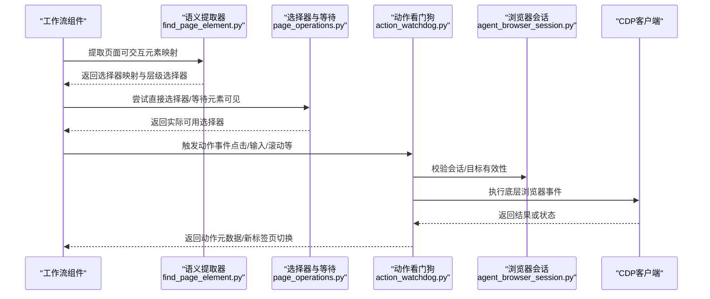
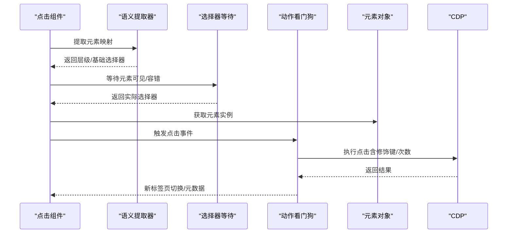
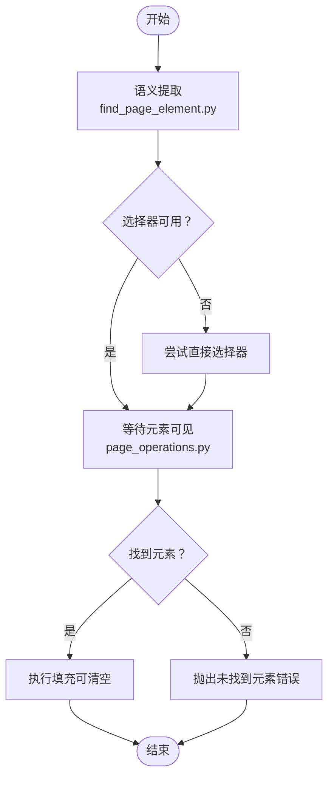
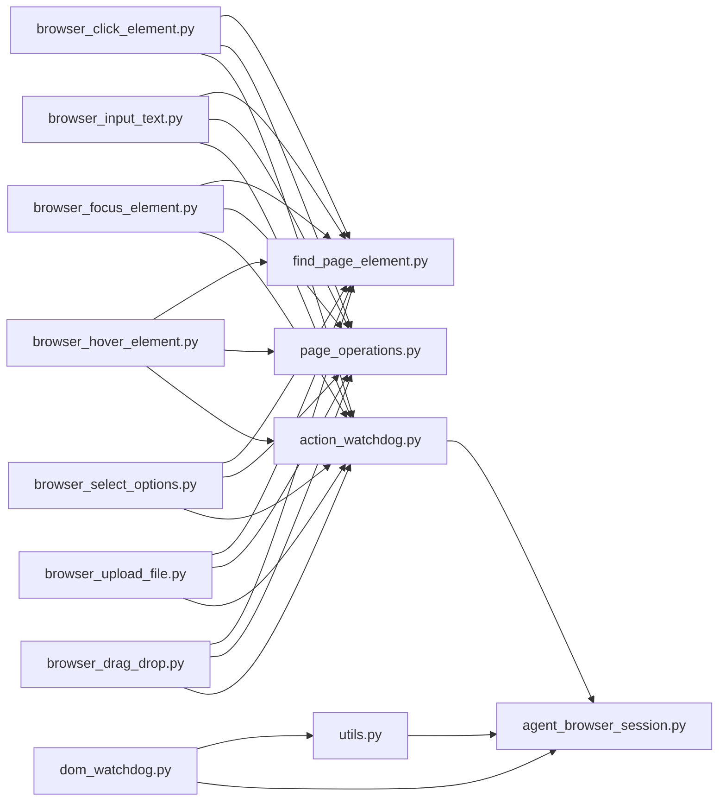

# 交互操作

<cite>
**本文引用的文件**
- [page_operations.py](file://vibe_surf/browser/page_operations.py)
- [find_page_element.py](file://vibe_surf/browser/find_page_element.py)
- [utils.py](file://vibe_surf/browser/utils.py)
- [agent_browser_session.py](file://vibe_surf/browser/agent_browser_session.py)
- [action_watchdog.py](file://vibe_surf/browser/watchdogs/action_watchdog.py)
- [dom_watchdog.py](file://vibe_surf/browser/watchdogs/dom_watchdog.py)
- [browser_click_element.py](file://vibe_surf/workflows/Browser/browser_click_element.py)
- [browser_input_text.py](file://vibe_surf/workflows/Browser/browser_input_text.py)
- [browser_focus_element.py](file://vibe_surf/workflows/Browser/browser_focus_element.py)
- [browser_hover_element.py](file://vibe_surf/workflows/Browser/browser_hover_element.py)
- [browser_select_options.py](file://vibe_surf/workflows/Browser/browser_select_options.py)
- [browser_scroll.py](file://vibe_surf/workflows/Browser/browser_scroll.py)
- [browser_press_key.py](file://vibe_surf/workflows/Browser/browser_press_key.py)
- [browser_upload_file.py](file://vibe_surf/workflows/Browser/browser_upload_file.py)
- [browser_drag_drop.py](file://vibe_surf/workflows/Browser/browser_drag_drop.py)
</cite>

## 目录
1. [简介](#简介)
2. [项目结构](#项目结构)
3. [核心组件](#核心组件)
4. [架构总览](#架构总览)
5. [详细组件分析](#详细组件分析)
6. [依赖关系分析](#依赖关系分析)
7. [性能与可靠性](#性能与可靠性)
8. [故障排查指南](#故障排查指南)
9. [结论](#结论)
10. [附录](#附录)

## 简介
本文件系统性梳理浏览器交互操作模块，围绕 page_operations 模块提供的用户交互能力展开，覆盖点击、输入、拖拽、滚动、悬停、选择选项、按键、文件上传等高频操作，并深入说明：
- 高级指令到底层浏览器事件的执行流程
- 复杂交互场景（如表单批量填写、文件上传、拖拽排序）的实现思路
- 可靠性保障机制（网络稳定等待、元素定位容错、新标签页处理）
- 执行速度优化技巧（并行化、缓存、降级策略）
- 处理反自动化检测的策略（模拟人类行为、避免异常触发）

## 项目结构
与交互相关的核心目录与文件：
- 浏览器交互基础层
  - page_operations.py：滚动到文本、直接选择器尝试、元素等待与容错
  - find_page_element.py：语义提取器，从页面中抽取可交互元素并生成稳定的选择器映射
  - utils.py：截图高亮、设备像素比、视口信息获取等工具函数
  - agent_browser_session.py：浏览器会话封装，连接、目标管理、事件总线
  - watchdogs：动作与DOM看门狗，负责安全校验、新标签页切换、状态快照
- 工作流层（面向业务的交互组件）
  - browser_click_element.py、browser_input_text.py、browser_focus_element.py、browser_hover_element.py、browser_select_options.py、browser_scroll.py、browser_press_key.py、browser_upload_file.py、browser_drag_drop.py

图表来源
- [page_operations.py](file://vibe_surf/browser/page_operations.py#L1-L223)
- [find_page_element.py](file://vibe_surf/browser/find_page_element.py#L1-L200)
- [utils.py](file://vibe_surf/browser/utils.py#L666-L786)
- [agent_browser_session.py](file://vibe_surf/browser/agent_browser_session.py#L1-L200)
- [action_watchdog.py](file://vibe_surf/browser/watchdogs/action_watchdog.py#L1-L109)
- [dom_watchdog.py](file://vibe_surf/browser/watchdogs/dom_watchdog.py#L1-L250)
- [browser_click_element.py](file://vibe_surf/workflows/Browser/browser_click_element.py#L1-L196)
- [browser_input_text.py](file://vibe_surf/workflows/Browser/browser_input_text.py#L1-L170)
- [browser_focus_element.py](file://vibe_surf/workflows/Browser/browser_focus_element.py#L1-L154)
- [browser_hover_element.py](file://vibe_surf/workflows/Browser/browser_hover_element.py#L1-L155)
- [browser_select_options.py](file://vibe_surf/workflows/Browser/browser_select_options.py#L1-L95)
- [browser_scroll.py](file://vibe_surf/workflows/Browser/browser_scroll.py#L1-L74)
- [browser_press_key.py](file://vibe_surf/workflows/Browser/browser_press_key.py#L1-L52)
- [browser_upload_file.py](file://vibe_surf/workflows/Browser/browser_upload_file.py#L1-L183)
- [browser_drag_drop.py](file://vibe_surf/workflows/Browser/browser_drag_drop.py#L1-L82)

章节来源
- [page_operations.py](file://vibe_surf/browser/page_operations.py#L1-L223)
- [find_page_element.py](file://vibe_surf/browser/find_page_element.py#L1-L200)
- [utils.py](file://vibe_surf/browser/utils.py#L666-L786)
- [agent_browser_session.py](file://vibe_surf/browser/agent_browser_session.py#L1-L200)
- [action_watchdog.py](file://vibe_surf/browser/watchdogs/action_watchdog.py#L1-L109)
- [dom_watchdog.py](file://vibe_surf/browser/watchdogs/dom_watchdog.py#L1-L250)

## 核心组件
- page_operations：提供滚动到文本、直接选择器尝试、元素等待与容错等基础能力
- find_page_element：语义提取器，基于DOM与上下文生成稳定的CSS/Hierarchical/XPath选择器映射
- utils：截图高亮、设备像素比与视口信息获取，用于可视化调试与坐标换算
- agent_browser_session：浏览器会话生命周期管理、CDP连接、事件总线、代理认证、欢迎模态注入
- watchdogs：动作看门狗（校验点击/上传/滚动等合法性）、DOM看门狗（并行构建DOM与截图、高亮）

章节来源
- [page_operations.py](file://vibe_surf/browser/page_operations.py#L1-L223)
- [find_page_element.py](file://vibe_surf/browser/find_page_element.py#L1-L200)
- [utils.py](file://vibe_surf/browser/utils.py#L666-L786)
- [agent_browser_session.py](file://vibe_surf/browser/agent_browser_session.py#L1-L200)
- [action_watchdog.py](file://vibe_surf/browser/watchdogs/action_watchdog.py#L1-L109)
- [dom_watchdog.py](file://vibe_surf/browser/watchdogs/dom_watchdog.py#L1-L250)

## 架构总览
交互操作从“工作流组件”进入，通过“语义提取”和“选择器容错”定位元素，再由“动作看门狗”进行安全校验与环境准备，最终调用底层浏览器事件（如点击、输入、滚动、拖拽、上传、按键）。同时“DOM看门狗”负责并行化获取DOM与截图，并在需要时应用Python侧高亮。

图表来源
- [browser_click_element.py](file://vibe_surf/workflows/Browser/browser_click_element.py#L90-L196)
- [browser_input_text.py](file://vibe_surf/workflows/Browser/browser_input_text.py#L85-L170)
- [find_page_element.py](file://vibe_surf/browser/find_page_element.py#L211-L300)
- [page_operations.py](file://vibe_surf/browser/page_operations.py#L100-L173)
- [action_watchdog.py](file://vibe_surf/browser/watchdogs/action_watchdog.py#L24-L109)
- [agent_browser_session.py](file://vibe_surf/browser/agent_browser_session.py#L171-L245)

## 详细组件分析

### 点击交互（browser_click_element）
- 输入参数：元素文本/提示、CSS选择器、后端节点ID、点击按钮类型、点击次数
- 定位策略：优先使用语义提取返回的层级选择器；若失败回退到直接选择器；最后支持按提示或后端节点定位
- 动作执行：通过动作看门狗进行合法性检查（如文件输入禁止点击），并处理新标签页打开
- 关键路径
  - 语义提取与选择器选择：见 [find_page_element.py](file://vibe_surf/browser/find_page_element.py#L211-L300)
  - 元素等待与选择器容错：见 [page_operations.py](file://vibe_surf/browser/page_operations.py#L100-L173)
  - 动作执行与新标签页处理：见 [action_watchdog.py](file://vibe_surf/browser/watchdogs/action_watchdog.py#L24-L109)、[browser_click_element.py](file://vibe_surf/workflows/Browser/browser_click_element.py#L90-L196)

图表来源
- [browser_click_element.py](file://vibe_surf/workflows/Browser/browser_click_element.py#L90-L196)
- [find_page_element.py](file://vibe_surf/browser/find_page_element.py#L211-L300)
- [page_operations.py](file://vibe_surf/browser/page_operations.py#L100-L173)
- [action_watchdog.py](file://vibe_surf/browser/watchdogs/action_watchdog.py#L24-L109)

章节来源
- [browser_click_element.py](file://vibe_surf/workflows/Browser/browser_click_element.py#L1-L196)
- [action_watchdog.py](file://vibe_surf/browser/watchdogs/action_watchdog.py#L1-L109)

### 输入文本（browser_input_text）
- 输入参数：输入文本、是否清空、元素文本/提示/CSS/后端节点ID
- 定位策略：优先语义提取+层级选择器；其次直接选择器；最后CSS或后端节点；支持LLM辅助定位
- 执行策略：等待元素出现并可见，再执行填充（可选清空）
- 关键路径
  - 语义提取与选择器选择：见 [find_page_element.py](file://vibe_surf/browser/find_page_element.py#L211-L300)
  - 元素等待与容错：见 [page_operations.py](file://vibe_surf/browser/page_operations.py#L175-L223)
  - 填充执行：见 [browser_input_text.py](file://vibe_surf/workflows/Browser/browser_input_text.py#L85-L170)

图表来源
- [browser_input_text.py](file://vibe_surf/workflows/Browser/browser_input_text.py#L85-L170)
- [find_page_element.py](file://vibe_surf/browser/find_page_element.py#L211-L300)
- [page_operations.py](file://vibe_surf/browser/page_operations.py#L175-L223)

章节来源
- [browser_input_text.py](file://vibe_surf/workflows/Browser/browser_input_text.py#L1-L170)
- [page_operations.py](file://vibe_surf/browser/page_operations.py#L175-L223)

### 聚焦/悬停（browser_focus_element、browser_hover_element）
- 聚焦：确保元素处于焦点状态，便于后续键盘输入或快捷键生效
- 悬停：触发元素的hover事件，常用于显示下拉菜单或提示
- 定位策略与输入参数同点击/输入组件一致

章节来源
- [browser_focus_element.py](file://vibe_surf/workflows/Browser/browser_focus_element.py#L1-L154)
- [browser_hover_element.py](file://vibe_surf/workflows/Browser/browser_hover_element.py#L1-L155)

### 选择选项（browser_select_options）
- 适用于select/option类控件，支持传入一个或多个选项值
- 支持CSS/后端节点/LLM提示定位

章节来源
- [browser_select_options.py](file://vibe_surf/workflows/Browser/browser_select_options.py#L1-L95)

### 滚动（browser_scroll）
- 支持两种模式：滚动到指定文本（优先）或按坐标增量滚动
- 文本滚动：通过DOM搜索与滚动到可视区域
- 坐标滚动：直接调用CDP滚动事件

章节来源
- [browser_scroll.py](file://vibe_surf/workflows/Browser/browser_scroll.py#L1-L74)
- [page_operations.py](file://vibe_surf/browser/page_operations.py#L1-L98)

### 按键（browser_press_key）
- 发送按键序列（Enter、Escape、Control+A等）
- 直接调用页面按键接口

章节来源
- [browser_press_key.py](file://vibe_surf/workflows/Browser/browser_press_key.py#L1-L52)

### 文件上传（browser_upload_file）
- 定位文件输入元素（input[type=file]）
- 使用CDP的DOM.setFileInputFiles设置文件路径
- 安全校验：非文件输入元素会拒绝执行

章节来源
- [browser_upload_file.py](file://vibe_surf/workflows/Browser/browser_upload_file.py#L1-L183)
- [action_watchdog.py](file://vibe_surf/browser/watchdogs/action_watchdog.py#L46-L52)

### 拖拽（browser_drag_drop）
- 通过源元素拖拽到目标元素，常用于拖拽排序
- 仅需提供源/目的CSS选择器

章节来源
- [browser_drag_drop.py](file://vibe_surf/workflows/Browser/browser_drag_drop.py#L1-L82)

## 依赖关系分析

图表来源
- [browser_click_element.py](file://vibe_surf/workflows/Browser/browser_click_element.py#L1-L196)
- [browser_input_text.py](file://vibe_surf/workflows/Browser/browser_input_text.py#L1-L170)
- [browser_focus_element.py](file://vibe_surf/workflows/Browser/browser_focus_element.py#L1-L154)
- [browser_hover_element.py](file://vibe_surf/workflows/Browser/browser_hover_element.py#L1-L155)
- [browser_select_options.py](file://vibe_surf/workflows/Browser/browser_select_options.py#L1-L95)
- [browser_upload_file.py](file://vibe_surf/workflows/Browser/browser_upload_file.py#L1-L183)
- [browser_drag_drop.py](file://vibe_surf/workflows/Browser/browser_drag_drop.py#L1-L82)
- [find_page_element.py](file://vibe_surf/browser/find_page_element.py#L1-L200)
- [page_operations.py](file://vibe_surf/browser/page_operations.py#L1-L223)
- [action_watchdog.py](file://vibe_surf/browser/watchdogs/action_watchdog.py#L1-L109)
- [dom_watchdog.py](file://vibe_surf/browser/watchdogs/dom_watchdog.py#L1-L250)
- [utils.py](file://vibe_surf/browser/utils.py#L666-L786)
- [agent_browser_session.py](file://vibe_surf/browser/agent_browser_session.py#L1-L200)

## 性能与可靠性

### 性能特性
- 并行化：DOM看门狗在获取DOM树与截图时采用并行任务，减少整体等待时间
- 缓存与降级：DOM构建失败时返回最小状态；截图失败时继续返回DOM；高亮失败时记录警告并继续
- 选择器容错：多策略回退（直接选择器、层级选择器、回退选择器、XPath），提升成功率
- 视口与坐标：通过CDP获取设备像素比与滚动位置，保证高亮与坐标换算准确

章节来源
- [dom_watchdog.py](file://vibe_surf/browser/watchdogs/dom_watchdog.py#L73-L120)
- [utils.py](file://vibe_surf/browser/utils.py#L731-L786)

### 可靠性保障
- 网络稳定等待：工作流组件在执行前等待网络稳定，降低页面未加载完成导致的失败
- 会话与目标校验：动作看门狗在执行前检查会话有效性与目标ID
- 文件输入保护：检测到文件输入元素时拒绝点击，防止误操作
- 新标签页处理：动作完成后自动检测并切换到新打开的标签页
- DOM状态缓存：DOM看门狗缓存最近一次状态，避免重复昂贵的DOM构建

章节来源
- [browser_click_element.py](file://vibe_surf/workflows/Browser/browser_click_element.py#L90-L196)
- [action_watchdog.py](file://vibe_surf/browser/watchdogs/action_watchdog.py#L24-L109)
- [dom_watchdog.py](file://vibe_surf/browser/watchdogs/dom_watchdog.py#L190-L250)

### 处理反自动化检测的策略
- 人类行为模拟：动作看门狗对打印按钮等特殊元素进行PDF生成而非弹窗，减少异常触发
- 选择器稳定性：优先使用带ID或nth-of-type的层级选择器，降低被动态UI干扰的概率
- 逐步容错：多级回退策略（直接选择器→层级选择器→回退选择器→XPath），提升鲁棒性
- 可视化调试：通过截图高亮与坐标换算，便于定位问题并优化选择器

章节来源
- [action_watchdog.py](file://vibe_surf/browser/watchdogs/action_watchdog.py#L53-L70)
- [find_page_element.py](file://vibe_surf/browser/find_page_element.py#L211-L300)
- [utils.py](file://vibe_surf/browser/utils.py#L666-L786)

## 故障排查指南
- “未找到元素”
  - 检查是否提供了正确的元素文本/提示/CSS/后端节点ID
  - 查看选择器回退链：直接选择器→层级选择器→回退选择器→XPath
  - 确认页面已稳定（网络等待）后再执行
- “点击无效/无响应”
  - 确认目标元素不是文件输入（会被动作看门狗拦截）
  - 检查是否触发了新标签页，必要时切换到新标签页
- “滚动未生效”
  - 优先使用“滚动到文本”，否则检查坐标增量是否合理
- “上传失败”
  - 确认定位到的是input[type=file]元素
  - 检查文件路径是否正确且可访问
- “截图高亮异常”
  - 检查设备像素比与视口信息获取是否成功
  - 若高亮失败，系统会记录警告并继续运行

章节来源
- [page_operations.py](file://vibe_surf/browser/page_operations.py#L1-L223)
- [action_watchdog.py](file://vibe_surf/browser/watchdogs/action_watchdog.py#L46-L52)
- [dom_watchdog.py](file://vibe_surf/browser/watchdogs/dom_watchdog.py#L118-L149)
- [utils.py](file://vibe_surf/browser/utils.py#L731-L786)

## 结论
本模块以“语义提取+选择器容错+动作看门狗+并行化DOM/截图”的组合，实现了稳定可靠的浏览器交互能力。通过多级回退与安全校验，有效降低了自动化脚本在复杂页面中的失败率；通过并行化与缓存，显著提升了执行效率。配合可视化高亮与坐标换算，便于调试与优化。

## 附录

### 复杂交互场景示例（思路）
- 表单批量填写
  - 使用语义提取器一次性抽取所有字段映射，按层级选择器排序后依次输入
  - 对必填字段先输入，再处理可选字段
  - 使用网络稳定等待确保每个字段写入后页面状态稳定
- 文件上传
  - 定位input[type=file]，调用CDP setFileInputFiles设置文件路径
  - 如需触发上传动作，可在上传后执行点击或按键事件
- 拖拽排序
  - 定位源项与目标项，执行drag_to
  - 在拖拽前后分别进行DOM状态快照，验证排序是否生效

章节来源
- [find_page_element.py](file://vibe_surf/browser/find_page_element.py#L211-L300)
- [page_operations.py](file://vibe_surf/browser/page_operations.py#L1-L223)
- [browser_upload_file.py](file://vibe_surf/workflows/Browser/browser_upload_file.py#L1-L183)
- [browser_drag_drop.py](file://vibe_surf/workflows/Browser/browser_drag_drop.py#L1-L82)