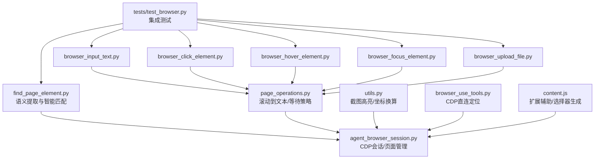
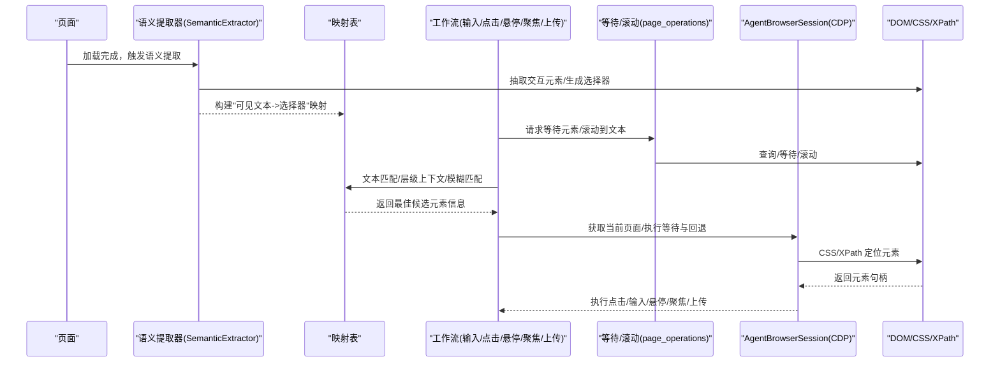
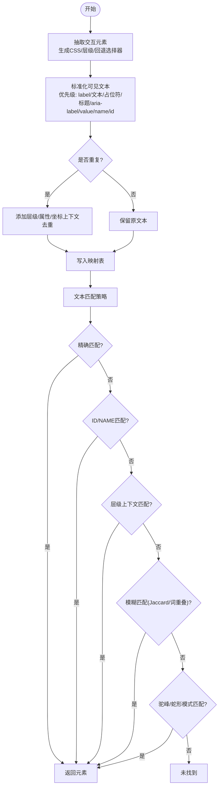
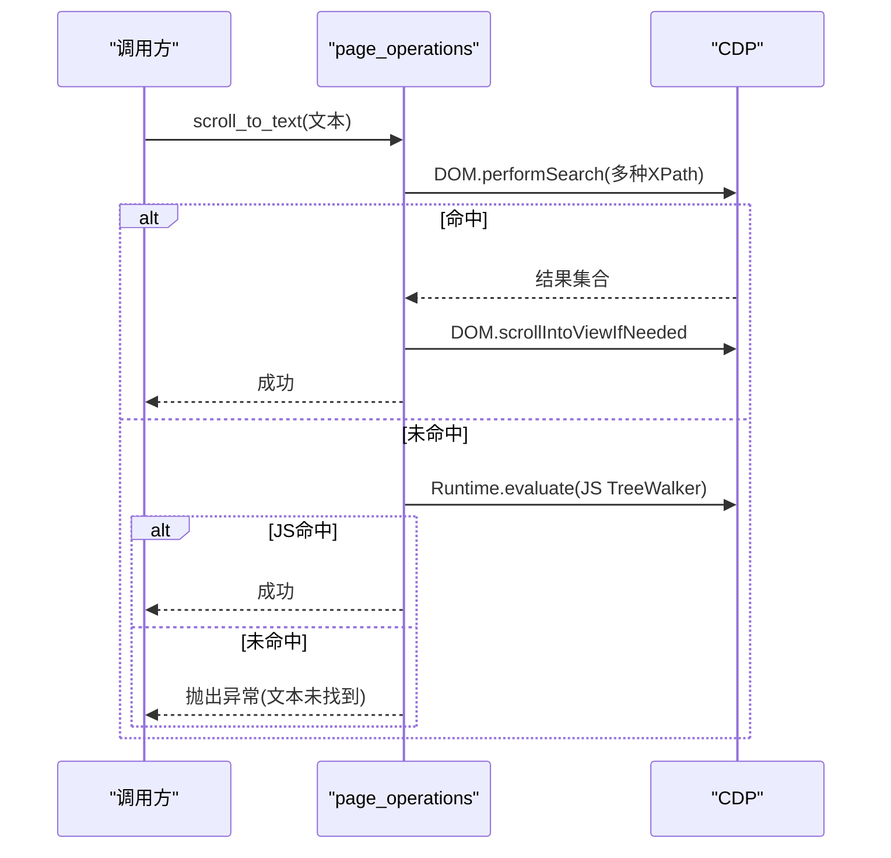
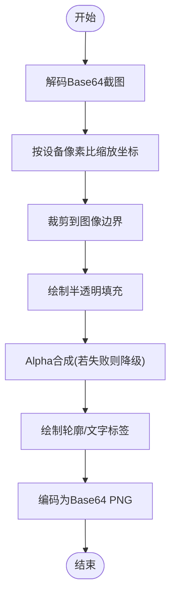
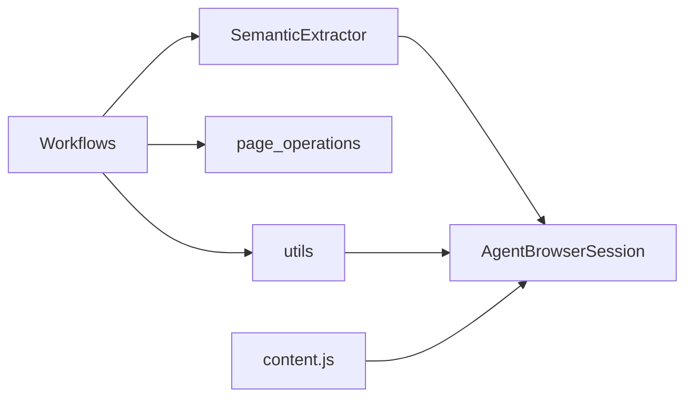

# 元素定位

<cite>
**本文引用的文件**
- [find_page_element.py](file://vibe_surf/browser/find_page_element.py)
- [page_operations.py](file://vibe_surf/browser/page_operations.py)
- [utils.py](file://vibe_surf/browser/utils.py)
- [agent_browser_session.py](file://vibe_surf/browser/agent_browser_session.py)
- [browser_input_text.py](file://vibe_surf/workflows/Browser/browser_input_text.py)
- [browser_click_element.py](file://vibe_surf/workflows/Browser/browser_click_element.py)
- [browser_hover_element.py](file://vibe_surf/workflows/Browser/browser_hover_element.py)
- [browser_focus_element.py](file://vibe_surf/workflows/Browser/browser_focus_element.py)
- [browser_upload_file.py](file://vibe_surf/workflows/Browser/browser_upload_file.py)
- [browser_use_tools.py](file://vibe_surf/tools/browser_use_tools.py)
- [content.js](file://vibe_surf/chrome_extension/content.js)
- [test_browser.py](file://tests/test_browser.py)
</cite>

## 目录
1. [简介](#简介)
2. [项目结构](#项目结构)
3. [核心组件](#核心组件)
4. [架构总览](#架构总览)
5. [详细组件分析](#详细组件分析)
6. [依赖关系分析](#依赖关系分析)
7. [性能考量](#性能考量)
8. [故障排查指南](#故障排查指南)
9. [结论](#结论)
10. [附录](#附录)

## 简介
本文件系统性阐述“元素定位”能力的设计与实现，重点围绕 find_page_element 模块的智能定位策略，覆盖基于 CSS 选择器、XPath、文本内容与视觉特征的多策略定位方法；同时总结容错机制（模糊匹配、DOM 树遍历、等待策略）与最佳实践，并给出在动态加载页面、iframe 嵌套、Shadow DOM 等复杂场景下的解决方案与性能优化建议。

## 项目结构
与元素定位直接相关的模块主要分布在浏览器侧：
- 定位与映射：find_page_element.py
- 页面操作与滚动：page_operations.py
- 截图高亮与坐标转换：utils.py
- 浏览器会话与 CDP 连接：agent_browser_session.py
- 工作流调用定位结果：workflows/Browser/*（输入、点击、悬停、聚焦、上传）
- 扩展侧辅助：chrome_extension/content.js
- 测试验证：tests/test_browser.py

图表来源
- [find_page_element.py](file://vibe_surf/browser/find_page_element.py#L1-L120)
- [page_operations.py](file://vibe_surf/browser/page_operations.py#L1-L120)
- [utils.py](file://vibe_surf/browser/utils.py#L666-L786)
- [agent_browser_session.py](file://vibe_surf/browser/agent_browser_session.py#L171-L240)
- [browser_input_text.py](file://vibe_surf/workflows/Browser/browser_input_text.py#L114-L156)
- [browser_use_tools.py](file://vibe_surf/tools/browser_use_tools.py#L180-L202)
- [content.js](file://vibe_surf/chrome_extension/content.js#L565-L745)
- [test_browser.py](file://tests/test_browser.py#L334-L364)

章节来源
- [find_page_element.py](file://vibe_surf/browser/find_page_element.py#L1-L120)
- [page_operations.py](file://vibe_surf/browser/page_operations.py#L1-L120)
- [utils.py](file://vibe_surf/browser/utils.py#L666-L786)
- [agent_browser_session.py](file://vibe_surf/browser/agent_browser_session.py#L171-L240)
- [browser_input_text.py](file://vibe_surf/workflows/Browser/browser_input_text.py#L114-L156)
- [browser_use_tools.py](file://vibe_surf/tools/browser_use_tools.py#L180-L202)
- [content.js](file://vibe_surf/chrome_extension/content.js#L565-L745)
- [test_browser.py](file://tests/test_browser.py#L334-L364)

## 核心组件
- 语义提取器（SemanticExtractor）
  - 负责从页面提取交互元素，构建“可见文本 -> 选择器”的映射表，支持层级上下文、重复处理、回退文本等。
  - 提供基于文本的精确/模糊匹配、层级上下文匹配与模式匹配（驼峰/蛇形）等策略。
- 页面操作工具
  - 提供滚动到文本、直接选择器尝试、等待元素出现等通用能力。
- 截图高亮与坐标换算
  - 将 DOM 位置映射到设备像素坐标，生成高亮截图，辅助可视化定位结果。
- 工作流集成
  - 各浏览器工作流在执行前通过等待策略与回退选择器确保稳定定位。
- CDP 会话与连接
  - 统一的 AgentBrowserSession 提供 CDP 客户端、目标管理与事件派发，保障跨标签页/iframe 的一致性。

章节来源
- [find_page_element.py](file://vibe_surf/browser/find_page_element.py#L18-L120)
- [find_page_element.py](file://vibe_surf/browser/find_page_element.py#L817-L868)
- [find_page_element.py](file://vibe_surf/browser/find_page_element.py#L869-L1101)
- [page_operations.py](file://vibe_surf/browser/page_operations.py#L9-L98)
- [page_operations.py](file://vibe_surf/browser/page_operations.py#L100-L173)
- [page_operations.py](file://vibe_surf/browser/page_operations.py#L175-L223)
- [utils.py](file://vibe_surf/browser/utils.py#L666-L786)
- [agent_browser_session.py](file://vibe_surf/browser/agent_browser_session.py#L171-L240)

## 架构总览
下图展示了从页面到定位结果的端到端流程：页面加载后，语义提取器抽取交互元素并建立映射；工作流在执行动作前，先进行等待与回退选择器，最终以 CSS 选择器或 XPath 定位元素并执行操作。

图表来源
- [find_page_element.py](file://vibe_surf/browser/find_page_element.py#L817-L868)
- [find_page_element.py](file://vibe_surf/browser/find_page_element.py#L869-L1101)
- [page_operations.py](file://vibe_surf/browser/page_operations.py#L9-L98)
- [page_operations.py](file://vibe_surf/browser/page_operations.py#L175-L223)
- [browser_input_text.py](file://vibe_surf/workflows/Browser/browser_input_text.py#L114-L156)
- [browser_click_element.py](file://vibe_surf/workflows/Browser/browser_click_element.py#L127-L171)
- [browser_hover_element.py](file://vibe_surf/workflows/Browser/browser_hover_element.py#L102-L154)
- [browser_focus_element.py](file://vibe_surf/workflows/Browser/browser_focus_element.py#L102-L153)
- [browser_upload_file.py](file://vibe_surf/workflows/Browser/browser_upload_file.py#L114-L156)

## 详细组件分析

### 语义提取器（SemanticExtractor）
- 功能要点
  - 从页面抽取交互元素，生成 CSS 选择器、层级选择器、回退选择器、文本 XPath、容器上下文、兄弟上下文、位置信息等。
  - 对重复文本进行“层级上下文 + 属性上下文 + 坐标上下文 + 序号回退”的去重策略。
  - 提供多种匹配策略：精确匹配、ID/NAME 匹配、层级上下文匹配、增强模糊匹配（子串/Jaccard/词重叠）、驼峰/蛇形模式匹配。
- 关键流程
  - 语义映射构建：抽取元素 -> 生成确定性 ID -> 提取可见文本（优先级：label/文本/占位符/标题/aria-label/value/name/id）-> 去重 -> 写入映射。
  - 文本匹配：先精确/ID/NAME，再层级上下文，再模糊匹配（Jaccard/词重叠），最后模式匹配（驼峰/蛇形）。
  - 层级匹配：对目标文本中的“基底文本(容器/DOM路径/全名)”进行加权评分，综合基础匹配与上下文匹配得分。

图表来源
- [find_page_element.py](file://vibe_surf/browser/find_page_element.py#L817-L868)
- [find_page_element.py](file://vibe_surf/browser/find_page_element.py#L869-L1101)

章节来源
- [find_page_element.py](file://vibe_surf/browser/find_page_element.py#L18-L120)
- [find_page_element.py](file://vibe_surf/browser/find_page_element.py#L817-L868)
- [find_page_element.py](file://vibe_surf/browser/find_page_element.py#L869-L1101)

### 页面滚动与等待策略
- 滚动到文本
  - 先用 DOM.performSearch 尝试三种 XPath 查询，命中则 DOM.scrollIntoViewIfNeeded。
  - 若失败，回退到 JS TreeWalker 遍历文本节点，滚动到匹配元素。
- 等待元素出现
  - 支持传入主选择器与回退选择器列表，轮询检查 CSS 选择器是否存在，超时内持续重试。
  - 对于层级选择器（含 nth-of-type）给予更宽松的判定，避免严格模式误判。
- 直接选择器尝试
  - 将目标文本作为 ID/NAME/placeholder 等候选，尝试多种变体（驼峰/小写），并做可见性等待与去重处理。

图表来源
- [page_operations.py](file://vibe_surf/browser/page_operations.py#L9-L98)

章节来源
- [page_operations.py](file://vibe_surf/browser/page_operations.py#L9-L98)
- [page_operations.py](file://vibe_surf/browser/page_operations.py#L100-L173)
- [page_operations.py](file://vibe_surf/browser/page_operations.py#L175-L223)

### 截图高亮与坐标换算
- 设备像素比与视口偏移
  - 通过 Page.getLayoutMetrics 获取设备像素比与滚动偏移，将 CSS 坐标转换为设备像素坐标。
- 高亮绘制
  - 将 DOM 绝对位置映射到截图坐标，绘制半透明填充与轮廓，自动分配不同颜色并避免标签重叠。
- 异步封装
  - 提供异步版本，可直接传入 CDP 会话以获取视口信息。

图表来源
- [utils.py](file://vibe_surf/browser/utils.py#L666-L786)

章节来源
- [utils.py](file://vibe_surf/browser/utils.py#L731-L759)
- [utils.py](file://vibe_surf/browser/utils.py#L666-L786)

### 工作流中的定位集成
- 输入文本/点击/悬停/聚焦/上传
  - 在执行动作前，根据元素信息拼装回退选择器序列（层级选择器 -> 回退选择器 -> XPath），统一走等待策略。
  - 若等待失败，抛出明确错误，便于上层捕获与重试。

章节来源
- [browser_input_text.py](file://vibe_surf/workflows/Browser/browser_input_text.py#L114-L156)
- [browser_click_element.py](file://vibe_surf/workflows/Browser/browser_click_element.py#L127-L171)
- [browser_hover_element.py](file://vibe_surf/workflows/Browser/browser_hover_element.py#L102-L154)
- [browser_focus_element.py](file://vibe_surf/workflows/Browser/browser_focus_element.py#L102-L153)
- [browser_upload_file.py](file://vibe_surf/workflows/Browser/browser_upload_file.py#L114-L156)

### CDP 会话与连接
- 连接与目标管理
  - 通过 CDP URL 建立连接，自动获取 Target 列表并选择有效页面，支持新标签页创建与焦点切换。
  - 注入欢迎提示（扩展相关），并处理代理认证等细节。
- 与定位的协作
  - 语义提取通过 CDP Runtime.evaluate 执行 JS，提取元素上下文与位置信息。
  - 工作流通过 CDP 查询 DOM、等待元素、滚动到可视区域。

章节来源
- [agent_browser_session.py](file://vibe_surf/browser/agent_browser_session.py#L171-L240)
- [find_page_element.py](file://vibe_surf/browser/find_page_element.py#L781-L816)

### 扩展辅助与选择器生成
- 内容脚本
  - 提供 CSS 选择器生成算法（ID 优先、类名辅助、nth-child 解歧），用于扩展侧辅助。
- 微型权限 iframe 注入
  - 通过隐藏 iframe 触发麦克风权限请求，便于调试与权限处理。

章节来源
- [content.js](file://vibe_surf/chrome_extension/content.js#L565-L745)

## 依赖关系分析
- 组件耦合
  - SemanticExtractor 依赖 AgentBrowserSession 获取 CDP 会话并执行 JS 提取。
  - 工作流依赖 page_operations 的等待/滚动能力与 utils 的截图高亮能力。
  - utils 依赖 CDP 获取布局信息，实现坐标换算。
- 外部依赖
  - CDP（browser_use）：DOM/Runtime/Page 等 API。
  - 扩展（chrome_extension）：内容脚本与消息通道。
- 可能的循环依赖
  - 当前模块间通过接口调用，未见直接循环导入。

图表来源
- [find_page_element.py](file://vibe_surf/browser/find_page_element.py#L781-L816)
- [page_operations.py](file://vibe_surf/browser/page_operations.py#L175-L223)
- [utils.py](file://vibe_surf/browser/utils.py#L666-L786)
- [agent_browser_session.py](file://vibe_surf/browser/agent_browser_session.py#L171-L240)
- [content.js](file://vibe_surf/chrome_extension/content.js#L565-L745)

章节来源
- [find_page_element.py](file://vibe_surf/browser/find_page_element.py#L781-L816)
- [page_operations.py](file://vibe_surf/browser/page_operations.py#L175-L223)
- [utils.py](file://vibe_surf/browser/utils.py#L666-L786)
- [agent_browser_session.py](file://vibe_surf/browser/agent_browser_session.py#L171-L240)
- [content.js](file://vibe_surf/chrome_extension/content.js#L565-L745)

## 性能考量
- 语义提取
  - JS 提取在大型页面可能较慢，建议仅在需要时触发，或限制提取范围（如仅提取交互元素）。
  - 去重与上下文生成开销可控，但应避免在高频调用中重复构建映射。
- 等待策略
  - 轮询间隔与超时时间需平衡稳定性与延迟；对层级选择器放宽判定可减少误报。
- 截图高亮
  - 大尺寸截图绘制成本较高，建议仅在调试或关键步骤启用。
- CDP 调用
  - Runtime.evaluate 与 DOM 查询频繁调用会增加网络往返，建议合并查询或缓存中间结果。

[本节为通用指导，不直接分析具体文件]

## 故障排查指南
- 定位不到元素
  - 检查是否使用了正确的主选择器与回退序列（层级选择器 -> 回退选择器 -> XPath）。
  - 确认页面是否已稳定（网络空闲、动画停止），必要时调用等待策略。
  - 若为动态加载页面，确认等待策略已生效，或手动触发滚动到文本。
- 文本匹配不准
  - 使用层级上下文（如“提交(在联系表单)”）提升准确性。
  - 对于驼峰/蛇形命名，确保目标文本与元素文本的分词一致。
- XPath 不生效
  - CDP 等待策略默认跳过 xpath= 前缀，工作流中请使用“xpath=...”字符串作为回退选择器。
- iframe 嵌套
  - 语义提取默认过滤 iframe，若需跨 iframe 定位，请在扩展侧或外部工具中注入脚本，或在目标 iframe 中执行定位。
- Shadow DOM
  - 可参考工具函数中的 Shadow DOM 访问示例，通过遍历 host 并访问 shadowRoot 定位内部元素。
- 截图高亮异常
  - 检查设备像素比与视口偏移计算，确保坐标换算正确；必要时关闭高亮以排除干扰。

章节来源
- [page_operations.py](file://vibe_surf/browser/page_operations.py#L175-L223)
- [browser_input_text.py](file://vibe_surf/workflows/Browser/browser_input_text.py#L114-L156)
- [browser_click_element.py](file://vibe_surf/workflows/Browser/browser_click_element.py#L127-L171)
- [browser_hover_element.py](file://vibe_surf/workflows/Browser/browser_hover_element.py#L102-L154)
- [browser_focus_element.py](file://vibe_surf/workflows/Browser/browser_focus_element.py#L102-L153)
- [browser_upload_file.py](file://vibe_surf/workflows/Browser/browser_upload_file.py#L114-L156)
- [browser_use_tools.py](file://vibe_surf/tools/browser_use_tools.py#L180-L202)
- [utils.py](file://vibe_surf/browser/utils.py#L731-L759)

## 结论
本方案通过“语义提取 + 多策略匹配 + 等待与回退 + 截图高亮”的组合，实现了在复杂页面中的稳健元素定位。其优势在于：
- 多策略互补：CSS/XPath/文本/视觉上下文共同提升成功率。
- 容错性强：模糊匹配、层级上下文、回退选择器与等待策略协同。
- 可观测性：高亮截图与调试日志便于问题定位。
针对动态加载、iframe 与 Shadow DOM 等复杂场景，建议结合扩展脚本与外部工具进行补充定位，并在性能敏感场景中合理控制调用频率与范围。

[本节为总结，不直接分析具体文件]

## 附录

### 最佳实践清单
- 动态页面
  - 先等待网络稳定，再进行语义提取与定位。
  - 使用“滚动到文本”辅助定位首屏内容。
- 多策略回退
  - 主选择器失败时，依次尝试层级选择器、回退选择器、XPath。
- 文本描述
  - 使用“基底文本(容器/DOM路径)”的层级上下文描述，提升匹配精度。
- 复杂容器
  - 对表格/列表/卡片等容器，优先使用容器上下文与兄弟序号。
- 视觉高亮
  - 调试阶段开启高亮，定位成功后关闭以降低开销。

### 示例参考（代码片段路径）
- 语义映射构建与文本匹配
  - [extract_semantic_mapping](file://vibe_surf/browser/find_page_element.py#L817-L868)
  - [find_element_by_text](file://vibe_surf/browser/find_page_element.py#L869-L1019)
  - [find_element_by_hierarchy](file://vibe_surf/browser/find_page_element.py#L1022-L1101)
- 等待与回退
  - [_wait_for_element](file://vibe_surf/browser/page_operations.py#L175-L223)
  - [_try_direct_selector](file://vibe_surf/browser/page_operations.py#L100-L173)
- 截图高亮
  - [create_highlighted_screenshot_async](file://vibe_surf/browser/utils.py#L761-L786)
  - [get_viewport_info_from_cdp](file://vibe_surf/browser/utils.py#L731-L759)
- 工作流集成
  - [browser_input_text](file://vibe_surf/workflows/Browser/browser_input_text.py#L114-L156)
  - [browser_click_element](file://vibe_surf/workflows/Browser/browser_click_element.py#L127-L171)
  - [browser_hover_element](file://vibe_surf/workflows/Browser/browser_hover_element.py#L102-L154)
  - [browser_focus_element](file://vibe_surf/workflows/Browser/browser_focus_element.py#L102-L153)
  - [browser_upload_file](file://vibe_surf/workflows/Browser/browser_upload_file.py#L114-L156)
- CDP 直连定位
  - [browser_use_tools](file://vibe_surf/tools/browser_use_tools.py#L180-L202)
- 扩展选择器生成
  - [content.js 选择器生成](file://vibe_surf/chrome_extension/content.js#L565-L745)
- 测试验证
  - [test_page_element](file://tests/test_browser.py#L334-L364)