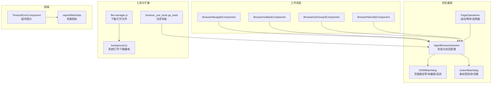
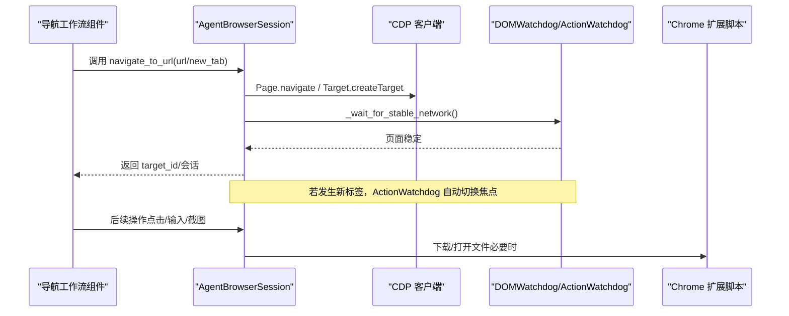
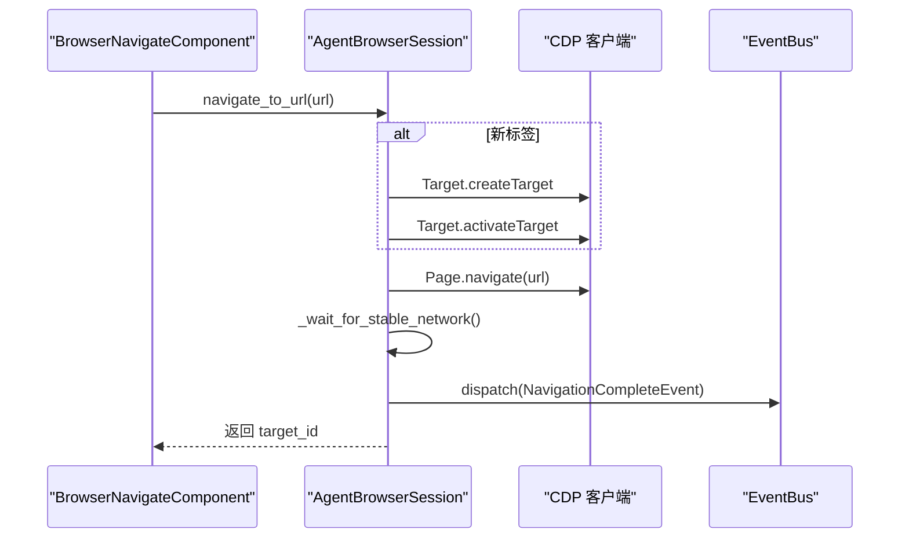
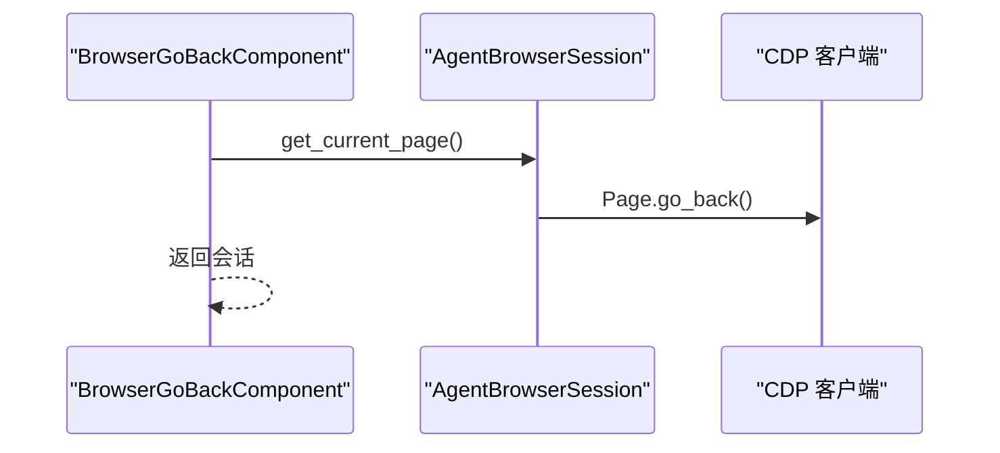
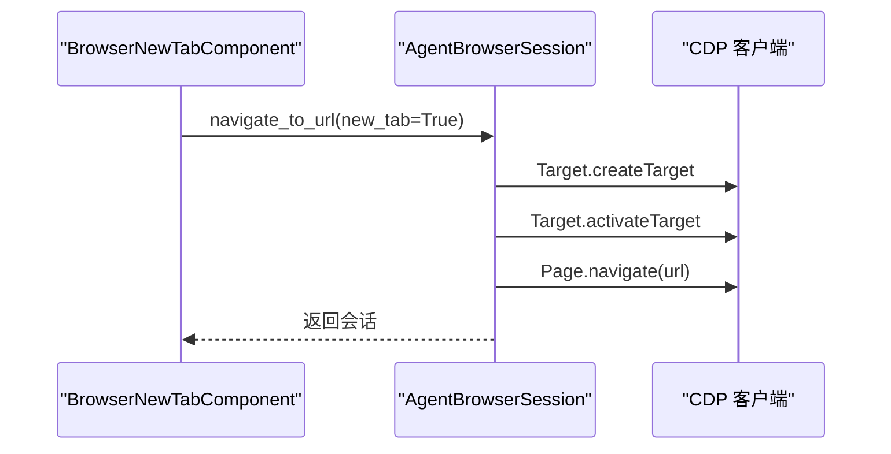
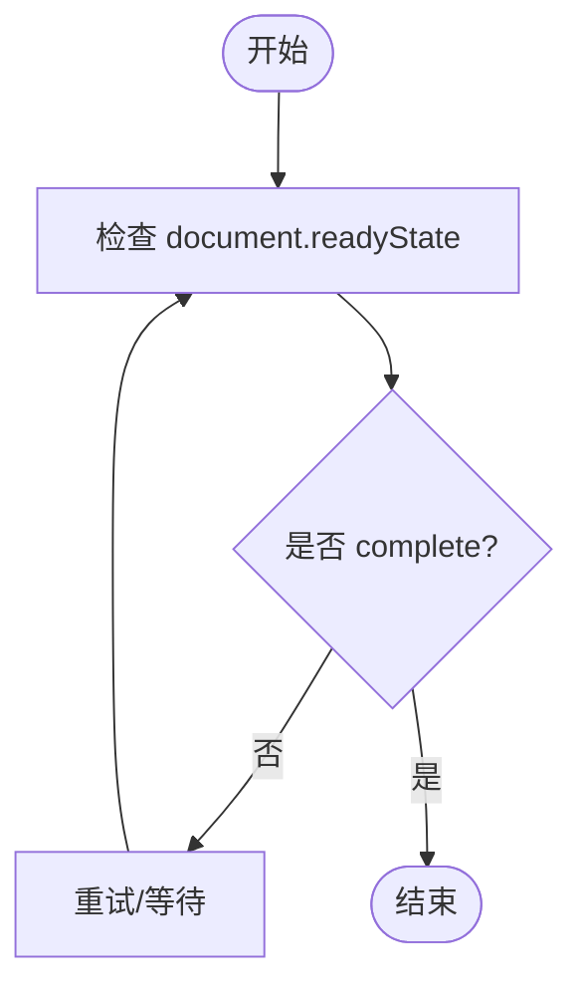
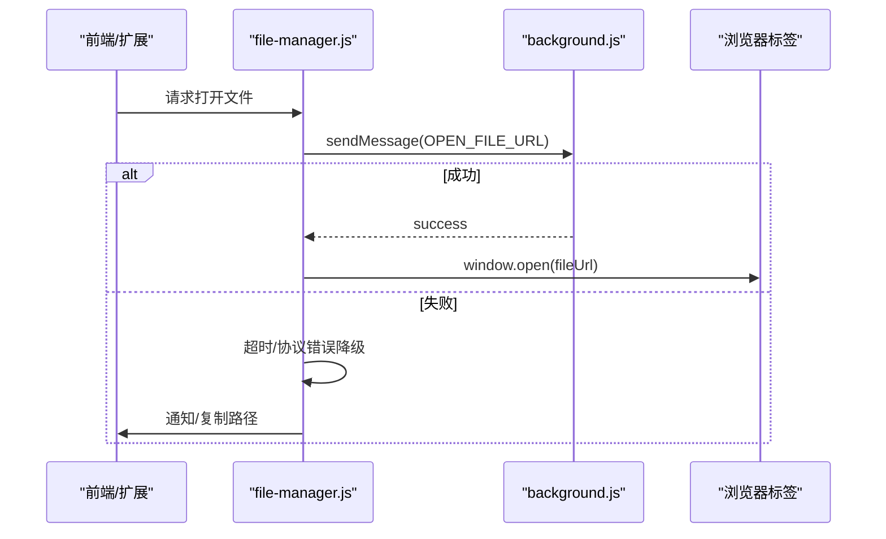
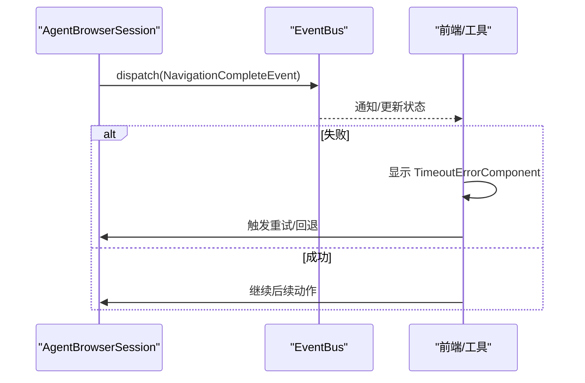
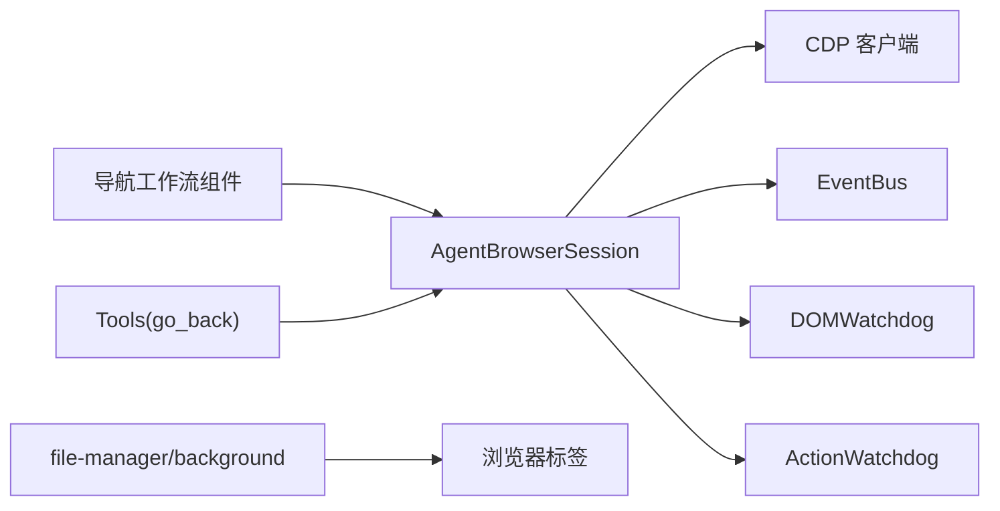

# 页面导航

<cite>
**本文引用的文件**
- [page_operations.py](file://vibe_surf/browser/page_operations.py)
- [agent_browser_session.py](file://vibe_surf/browser/agent_browser_session.py)
- [dom_watchdog.py](file://vibe_surf/browser/watchdogs/dom_watchdog.py)
- [action_watchdog.py](file://vibe_surf/browser/watchdogs/action_watchdog.py)
- [browser_navigate.py](file://vibe_surf/workflows/Browser/browser_navigate.py)
- [browser_go_back.py](file://vibe_surf/workflows/Browser/browser_go_back.py)
- [browser_go_forward.py](file://vibe_surf/workflows/Browser/browser_go_forward.py)
- [browser_new_tab.py](file://vibe_surf/workflows/Browser/browser_new_tab.py)
- [browser_use_tools.py](file://vibe_surf/tools/browser_use_tools.py)
- [file-manager.js](file://vibe_surf/chrome_extension/scripts/file-manager.js)
- [background.js](file://vibe_surf/chrome_extension/background.js)
- [timeoutErrorComponent/index.tsx](file://vibe_surf/frontend/src/components/common/timeoutErrorComponent/index.tsx)
- [reportWebVitals.ts](file://vibe_surf/frontend/src/reportWebVitals.ts)
</cite>

## 目录
1. [简介](#简介)
2. [项目结构](#项目结构)
3. [核心组件](#核心组件)
4. [架构总览](#架构总览)
5. [详细组件分析](#详细组件分析)
6. [依赖关系分析](#依赖关系分析)
7. [性能考量](#性能考量)
8. [故障排查指南](#故障排查指南)
9. [结论](#结论)
10. [附录](#附录)

## 简介
本文件聚焦于浏览器页面导航能力，系统性梳理 page_operations 模块与相关工作流、会话管理、监控与异常处理机制，覆盖页面跳转、前进后退、标签页管理、页面加载稳定性等待、重定向与弹窗处理、下载与文件打开、导航超时与性能监控、异常恢复策略等关键主题。目标是帮助开发者在复杂自动化场景中可靠地执行导航操作，并在出现异常时快速定位与修复。

## 项目结构
导航相关代码主要分布在以下位置：
- 浏览器会话与导航：vibe_surf/browser/agent_browser_session.py
- 页面元素与等待工具：vibe_surf/browser/page_operations.py
- 导航工作流（Langflow 组件）：vibe_surf/workflows/Browser/*
- 导航事件与监控：vibe_surf/browser/watchdogs/*
- 工具函数与重定向处理：vibe_surf/tools/browser_use_tools.py
- 下载与文件打开（扩展侧）：vibe_surf/chrome_extension/scripts/file-manager.js、background.js
- 前端超时提示组件：frontend/src/components/common/timeoutErrorComponent/index.tsx
- 前端性能指标采集：frontend/src/reportWebVitals.ts

图表来源
- [agent_browser_session.py](file://vibe_surf/browser/agent_browser_session.py#L875-L955)
- [page_operations.py](file://vibe_surf/browser/page_operations.py#L175-L223)
- [dom_watchdog.py](file://vibe_surf/browser/watchdogs/dom_watchdog.py#L43-L65)
- [action_watchdog.py](file://vibe_surf/browser/watchdogs/action_watchdog.py#L89-L109)
- [browser_navigate.py](file://vibe_surf/workflows/Browser/browser_navigate.py#L41-L51)
- [browser_go_back.py](file://vibe_surf/workflows/Browser/browser_go_back.py#L36-L45)
- [browser_go_forward.py](file://vibe_surf/workflows/Browser/browser_go_forward.py#L35-L44)
- [browser_new_tab.py](file://vibe_surf/workflows/Browser/browser_new_tab.py#L40-L50)
- [browser_use_tools.py](file://vibe_surf/tools/browser_use_tools.py#L348-L369)
- [file-manager.js](file://vibe_surf/chrome_extension/scripts/file-manager.js#L311-L374)
- [background.js](file://vibe_surf/chrome_extension/background.js#L639-L678)
- [timeoutErrorComponent/index.tsx](file://vibe_surf/frontend/src/components/common/timeoutErrorComponent/index.tsx#L1-L36)
- [reportWebVitals.ts](file://vibe_surf/frontend/src/reportWebVitals.ts#L1-L15)

章节来源
- [agent_browser_session.py](file://vibe_surf/browser/agent_browser_session.py#L875-L955)
- [page_operations.py](file://vibe_surf/browser/page_operations.py#L175-L223)
- [dom_watchdog.py](file://vibe_surf/browser/watchdogs/dom_watchdog.py#L43-L65)
- [action_watchdog.py](file://vibe_surf/browser/watchdogs/action_watchdog.py#L89-L109)
- [browser_navigate.py](file://vibe_surf/workflows/Browser/browser_navigate.py#L41-L51)
- [browser_go_back.py](file://vibe_surf/workflows/Browser/browser_go_back.py#L36-L45)
- [browser_go_forward.py](file://vibe_surf/workflows/Browser/browser_go_forward.py#L35-L44)
- [browser_new_tab.py](file://vibe_surf/workflows/Browser/browser_new_tab.py#L40-L50)
- [browser_use_tools.py](file://vibe_surf/tools/browser_use_tools.py#L348-L369)
- [file-manager.js](file://vibe_surf/chrome_extension/scripts/file-manager.js#L311-L374)
- [background.js](file://vibe_surf/chrome_extension/background.js#L639-L678)
- [timeoutErrorComponent/index.tsx](file://vibe_surf/frontend/src/components/common/timeoutErrorComponent/index.tsx#L1-L36)
- [reportWebVitals.ts](file://vibe_surf/frontend/src/reportWebVitals.ts#L1-L15)

## 核心组件
- AgentBrowserSession：负责连接、导航（含新标签）、等待页面稳定、截图、标签信息获取等。其 navigate_to_url 提供直接 CDP 路径以提升并发与稳定性；_wait_for_stable_network 通过 evaluate(document.readyState) 判断页面加载完成。
- PageOperations：提供滚动到文本、尝试直接选择器、等待元素存在等通用页面操作工具，为导航后的交互提供基础能力。
- DOMWatchdog：在获取浏览器状态前统一等待页面稳定、并行构建 DOM 与截图，保障后续操作基于完整页面状态。
- ActionWatchdog：监听新标签创建，自动切换焦点到新标签，避免导航后遗漏新窗口。
- Langflow 导航工作流组件：BrowserNavigateComponent、BrowserGoBackComponent、BrowserGoForwardComponent、BrowserNewTabComponent，封装了对 AgentBrowserSession 的调用。
- Tools：browser_use_tools.go_back 使用 Page.getNavigationHistory 和 Page.navigateToHistoryEntry 实现基于历史记录的精确回退。
- 扩展侧下载与打开：file-manager.js 与 background.js 协助在浏览器内或系统层面打开本地文件，处理下载与打开失败的降级路径。
- 前端超时与性能：timeoutErrorComponent 提供超时重试 UI；reportWebVitals 采集关键性能指标。

章节来源
- [agent_browser_session.py](file://vibe_surf/browser/agent_browser_session.py#L875-L955)
- [page_operations.py](file://vibe_surf/browser/page_operations.py#L175-L223)
- [dom_watchdog.py](file://vibe_surf/browser/watchdogs/dom_watchdog.py#L43-L65)
- [action_watchdog.py](file://vibe_surf/browser/watchdogs/action_watchdog.py#L89-L109)
- [browser_navigate.py](file://vibe_surf/workflows/Browser/browser_navigate.py#L41-L51)
- [browser_go_back.py](file://vibe_surf/workflows/Browser/browser_go_back.py#L36-L45)
- [browser_go_forward.py](file://vibe_surf/workflows/Browser/browser_go_forward.py#L35-L44)
- [browser_new_tab.py](file://vibe_surf/workflows/Browser/browser_new_tab.py#L40-L50)
- [browser_use_tools.py](file://vibe_surf/tools/browser_use_tools.py#L348-L369)
- [file-manager.js](file://vibe_surf/chrome_extension/scripts/file-manager.js#L311-L374)
- [background.js](file://vibe_surf/chrome_extension/background.js#L639-L678)
- [timeoutErrorComponent/index.tsx](file://vibe_surf/frontend/src/components/common/timeoutErrorComponent/index.tsx#L1-L36)
- [reportWebVitals.ts](file://vibe_surf/frontend/src/reportWebVitals.ts#L1-L15)

## 架构总览
导航流程从 Langflow 组件触发，经由 AgentBrowserSession 执行 CDP 命令，结合 DOMWatchdog 的页面稳定等待与 ActionWatchdog 的新标签检测，最终返回稳定的页面状态供后续动作使用。Tools 层可补充基于历史记录的回退逻辑，扩展侧脚本负责下载与打开文件的跨平台兼容。

图表来源
- [browser_navigate.py](file://vibe_surf/workflows/Browser/browser_navigate.py#L41-L51)
- [agent_browser_session.py](file://vibe_surf/browser/agent_browser_session.py#L875-L955)
- [dom_watchdog.py](file://vibe_surf/browser/watchdogs/dom_watchdog.py#L43-L65)
- [action_watchdog.py](file://vibe_surf/browser/watchdogs/action_watchdog.py#L89-L109)
- [file-manager.js](file://vibe_surf/chrome_extension/scripts/file-manager.js#L311-L374)

## 详细组件分析

### 页面跳转（navigate）
- 入口：BrowserNavigateComponent.browser_navigation 调用 AgentBrowserSession.navigate_to_url(url)。
- 行为：直接通过 CDP Page.navigate 发起导航；若 new_tab=True，则先 Target.createTarget 创建新标签并激活，再进行导航。
- 等待：导航后通过 _wait_for_stable_network 等待 document.readyState 为 complete，确保页面加载完成。
- 事件：在成功或失败时派发 NavigationCompleteEvent，便于上层感知。

图表来源
- [browser_navigate.py](file://vibe_surf/workflows/Browser/browser_navigate.py#L41-L51)
- [agent_browser_session.py](file://vibe_surf/browser/agent_browser_session.py#L875-L955)

章节来源
- [browser_navigate.py](file://vibe_surf/workflows/Browser/browser_navigate.py#L41-L51)
- [agent_browser_session.py](file://vibe_surf/browser/agent_browser_session.py#L875-L955)

### 前进/后退（go_back/go_forward）
- 组件：BrowserGoBackComponent、BrowserGoForwardComponent 分别调用 page.go_back()/page.go_forward()。
- 工具：browser_use_tools.go_back 使用 Page.getNavigationHistory 与 Page.navigateToHistoryEntry 实现基于历史条目的精确回退，避免无效回退导致的错误。

图表来源
- [browser_go_back.py](file://vibe_surf/workflows/Browser/browser_go_back.py#L36-L45)
- [browser_use_tools.py](file://vibe_surf/tools/browser_use_tools.py#L348-L369)

章节来源
- [browser_go_back.py](file://vibe_surf/workflows/Browser/browser_go_back.py#L36-L45)
- [browser_go_forward.py](file://vibe_surf/workflows/Browser/browser_go_forward.py#L35-L44)
- [browser_use_tools.py](file://vibe_surf/tools/browser_use_tools.py#L348-L369)

### 标签页管理（new_tab）
- 组件：BrowserNewTabComponent 支持在新标签中打开指定 URL 或默认新标签页。
- 行为：通过 Target.createTarget 创建新标签，设置 agent_focus 并激活，随后按需导航至目标 URL。

图表来源
- [browser_new_tab.py](file://vibe_surf/workflows/Browser/browser_new_tab.py#L40-L50)
- [agent_browser_session.py](file://vibe_surf/browser/agent_browser_session.py#L875-L955)

章节来源
- [browser_new_tab.py](file://vibe_surf/workflows/Browser/browser_new_tab.py#L40-L50)
- [agent_browser_session.py](file://vibe_surf/browser/agent_browser_session.py#L875-L955)

### 页面加载稳定性与等待
- DOMWatchdog 在获取浏览器状态前统一等待页面稳定，减少因 DOM 还未就绪导致的操作失败。
- AgentBrowserSession._wait_for_stable_network 通过 Runtime.evaluate('document.readyState') 判断页面是否 complete，并在失败时重试。
- page_operations._wait_for_element 提供基于 CSS 选择器的轮询等待，支持回退选择器与严格模式提示。

图表来源
- [dom_watchdog.py](file://vibe_surf/browser/watchdogs/dom_watchdog.py#L43-L65)
- [agent_browser_session.py](file://vibe_surf/browser/agent_browser_session.py#L943-L955)
- [page_operations.py](file://vibe_surf/browser/page_operations.py#L175-L223)

章节来源
- [dom_watchdog.py](file://vibe_surf/browser/watchdogs/dom_watchdog.py#L43-L65)
- [agent_browser_session.py](file://vibe_surf/browser/agent_browser_session.py#L943-L955)
- [page_operations.py](file://vibe_surf/browser/page_operations.py#L175-L223)

### 重定向、弹窗与下载等特殊场景

- 重定向：Tools 层的 go_back 使用历史记录 API，可在重定向后安全回退到上一有效入口。
- 弹窗：AgentBrowserSession 初始化时注册 PopupsWatchdog，自动处理 JS 对话框、确认、onbeforeunload 等，避免导航后被弹窗阻塞。
- 下载与打开文件：file-manager.js 与 background.js 协作，优先尝试在浏览器中打开文件链接，失败则回退到系统打开或复制路径，同时提供超时保护与用户通知。

图表来源
- [file-manager.js](file://vibe_surf/chrome_extension/scripts/file-manager.js#L311-L374)
- [background.js](file://vibe_surf/chrome_extension/background.js#L639-L678)

章节来源
- [browser_use_tools.py](file://vibe_surf/tools/browser_use_tools.py#L348-L369)
- [agent_browser_session.py](file://vibe_surf/browser/agent_browser_session.py#L836-L849)
- [file-manager.js](file://vibe_surf/chrome_extension/scripts/file-manager.js#L311-L374)
- [background.js](file://vibe_surf/chrome_extension/background.js#L639-L678)

### 导航超时处理与异常恢复
- 前端超时提示：timeoutErrorComponent 提供统一的超时错误展示与重试按钮，便于用户干预。
- 导航事件：AgentBrowserSession 在导航完成后派发 NavigationCompleteEvent，携带 target_id、url、error_message 等，便于上层做异常恢复与重试。
- 新标签检测：ActionWatchdog 在点击等动作后检测新标签创建，自动切换焦点，避免导航后“失焦”导致后续操作失败。

图表来源
- [agent_browser_session.py](file://vibe_surf/browser/agent_browser_session.py#L920-L939)
- [timeoutErrorComponent/index.tsx](file://vibe_surf/frontend/src/components/common/timeoutErrorComponent/index.tsx#L1-L36)
- [action_watchdog.py](file://vibe_surf/browser/watchdogs/action_watchdog.py#L89-L109)

章节来源
- [agent_browser_session.py](file://vibe_surf/browser/agent_browser_session.py#L920-L939)
- [timeoutErrorComponent/index.tsx](file://vibe_surf/frontend/src/components/common/timeoutErrorComponent/index.tsx#L1-L36)
- [action_watchdog.py](file://vibe_surf/browser/watchdogs/action_watchdog.py#L89-L109)

## 依赖关系分析
- 组件耦合：
  - 导航工作流组件依赖 AgentBrowserSession 的 navigate_to_url/new_tab/go_back/go_forward。
  - AgentBrowserSession 依赖 CDP 客户端与 EventBus，用于导航与事件分发。
  - DOMWatchdog 与 ActionWatchdog 作为监控与辅助组件，分别负责页面稳定等待与新标签切换。
  - Tools 层补充历史记录回退能力，与 AgentBrowserSession 解耦。
  - 扩展脚本独立处理下载与打开文件，通过消息传递与后台脚本协作。
- 外部依赖：
  - CDP（Chrome DevTools Protocol）：页面导航、目标管理、运行时评估。
  - 浏览器权限与弹窗：PopupsWatchdog 管理。
  - 前端性能：reportWebVitals 采集关键指标，辅助性能优化。

图表来源
- [browser_navigate.py](file://vibe_surf/workflows/Browser/browser_navigate.py#L41-L51)
- [agent_browser_session.py](file://vibe_surf/browser/agent_browser_session.py#L875-L955)
- [dom_watchdog.py](file://vibe_surf/browser/watchdogs/dom_watchdog.py#L43-L65)
- [action_watchdog.py](file://vibe_surf/browser/watchdogs/action_watchdog.py#L89-L109)
- [browser_use_tools.py](file://vibe_surf/tools/browser_use_tools.py#L348-L369)
- [file-manager.js](file://vibe_surf/chrome_extension/scripts/file-manager.js#L311-L374)
- [background.js](file://vibe_surf/chrome_extension/background.js#L639-L678)

章节来源
- [browser_navigate.py](file://vibe_surf/workflows/Browser/browser_navigate.py#L41-L51)
- [agent_browser_session.py](file://vibe_surf/browser/agent_browser_session.py#L875-L955)
- [dom_watchdog.py](file://vibe_surf/browser/watchdogs/dom_watchdog.py#L43-L65)
- [action_watchdog.py](file://vibe_surf/browser/watchdogs/action_watchdog.py#L89-L109)
- [browser_use_tools.py](file://vibe_surf/tools/browser_use_tools.py#L348-L369)
- [file-manager.js](file://vibe_surf/chrome_extension/scripts/file-manager.js#L311-L374)
- [background.js](file://vibe_surf/chrome_extension/background.js#L639-L678)

## 性能考量
- 导航并发：AgentBrowserSession.navigate_to_url 采用最小事件开销的 CDP 路径，减少串行瓶颈，提高吞吐。
- 页面稳定等待：DOMWatchdog 与 _wait_for_stable_network 通过 evaluate(document.readyState) 判断页面加载完成，避免过早操作导致的不稳定。
- 截图与 DOM 并行：DOMWatchdog 在获取浏览器状态时并行构建 DOM 与截图，缩短整体等待时间。
- 前端性能指标：reportWebVitals 采集 TTFB/LCP/FCP 等指标，辅助定位页面加载性能问题。

章节来源
- [agent_browser_session.py](file://vibe_surf/browser/agent_browser_session.py#L875-L955)
- [dom_watchdog.py](file://vibe_surf/browser/watchdogs/dom_watchdog.py#L73-L120)
- [reportWebVitals.ts](file://vibe_surf/frontend/src/reportWebVitals.ts#L1-L15)

## 故障排查指南
- 导航无响应或空白页
  - 检查是否已连接浏览器（AgentBrowserSession.connect），以及 agent_focus 是否存在。
  - 确认 navigate_to_url 是否正确传入 URL，new_tab 参数是否符合预期。
  - 查看 NavigationCompleteEvent 是否携带 error_message，结合日志定位具体异常。
- 页面未完全加载即执行下一步
  - 确认 DOMWatchdog 的等待逻辑是否生效，或在调用前显式等待 _wait_for_stable_network。
  - 检查是否存在弹窗阻塞（PopupsWatchdog 应自动处理，如未生效需检查注册）。
- 新标签未切换
  - ActionWatchdog 会在新标签创建后自动切换焦点，若未切换，检查事件是否被拦截或会话焦点丢失。
- 下载/打开文件失败
  - file-manager.js 中对 OPEN_FILE_URL 超时有 5 秒保护，失败后回退到系统打开或复制路径；检查扩展权限与后台脚本返回值。
- 超时与重试
  - 前端使用 timeoutErrorComponent 提示用户重试；后端可结合 NavigationCompleteEvent 的 error_message 进行自动重试策略。

章节来源
- [agent_browser_session.py](file://vibe_surf/browser/agent_browser_session.py#L875-L955)
- [dom_watchdog.py](file://vibe_surf/browser/watchdogs/dom_watchdog.py#L43-L65)
- [action_watchdog.py](file://vibe_surf/browser/watchdogs/action_watchdog.py#L89-L109)
- [file-manager.js](file://vibe_surf/chrome_extension/scripts/file-manager.js#L311-L374)
- [timeoutErrorComponent/index.tsx](file://vibe_surf/frontend/src/components/common/timeoutErrorComponent/index.tsx#L1-L36)

## 结论
本项目在导航能力上实现了从组件到会话、从等待到监控的全链路设计：通过 CDP 直通导航、统一页面稳定等待、自动新标签切换、历史记录回退、弹窗处理与下载/打开文件的扩展辅助，形成了高并发、低耦合且具备异常恢复能力的导航体系。建议在实际使用中：
- 优先使用 AgentBrowserSession 的 navigate_to_url/new_tab/go_back/go_forward；
- 在关键步骤前调用 _wait_for_stable_network 或依赖 DOMWatchdog；
- 遇到弹窗与重定向场景，配合 PopupsWatchdog 与 Tools 层历史记录 API；
- 通过 NavigationCompleteEvent 与 timeoutErrorComponent 建立完善的可观测与恢复策略。

## 附录
- 关键实现参考路径
  - 导航与会话：[agent_browser_session.py](file://vibe_surf/browser/agent_browser_session.py#L875-L955)
  - 页面等待与选择器：[page_operations.py](file://vibe_surf/browser/page_operations.py#L175-L223)
  - 页面稳定等待：[dom_watchdog.py](file://vibe_surf/browser/watchdogs/dom_watchdog.py#L43-L65)
  - 新标签检测：[action_watchdog.py](file://vibe_surf/browser/watchdogs/action_watchdog.py#L89-L109)
  - 导航工作流组件：[browser_navigate.py](file://vibe_surf/workflows/Browser/browser_navigate.py#L41-L51)、[browser_go_back.py](file://vibe_surf/workflows/Browser/browser_go_back.py#L36-L45)、[browser_go_forward.py](file://vibe_surf/workflows/Browser/browser_go_forward.py#L35-L44)、[browser_new_tab.py](file://vibe_surf/workflows/Browser/browser_new_tab.py#L40-L50)
  - 历史记录回退：[browser_use_tools.py](file://vibe_surf/tools/browser_use_tools.py#L348-L369)
  - 下载/打开文件：[file-manager.js](file://vibe_surf/chrome_extension/scripts/file-manager.js#L311-L374)、[background.js](file://vibe_surf/chrome_extension/background.js#L639-L678)
  - 前端超时提示：[timeoutErrorComponent/index.tsx](file://vibe_surf/frontend/src/components/common/timeoutErrorComponent/index.tsx#L1-L36)
  - 前端性能指标：[reportWebVitals.ts](file://vibe_surf/frontend/src/reportWebVitals.ts#L1-L15)