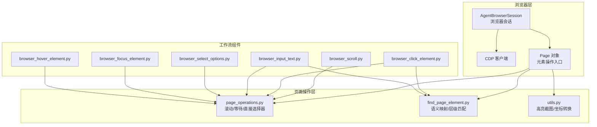
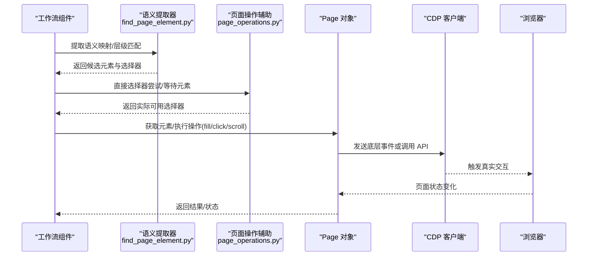
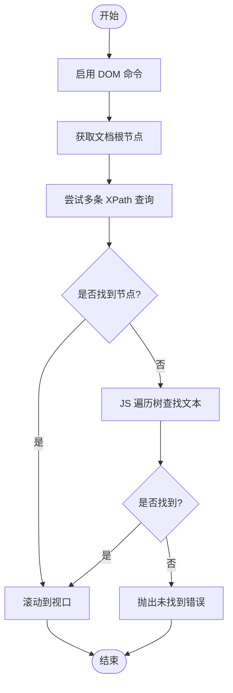
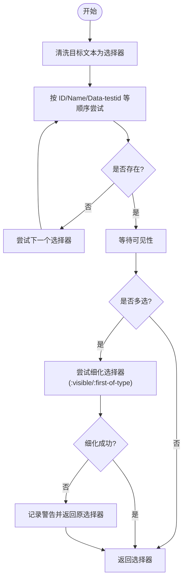
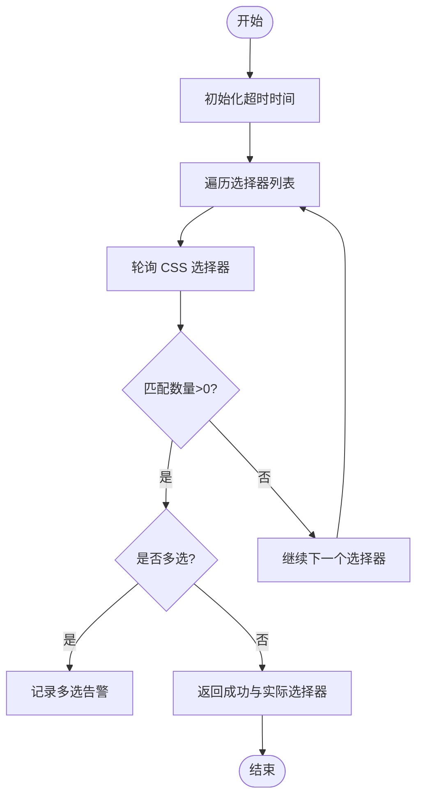
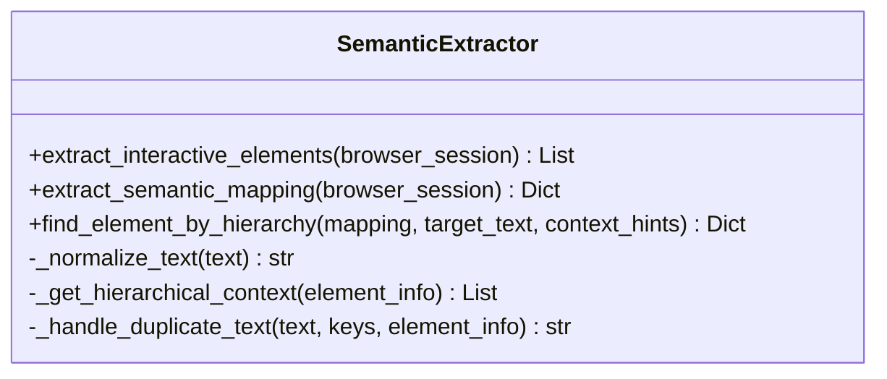
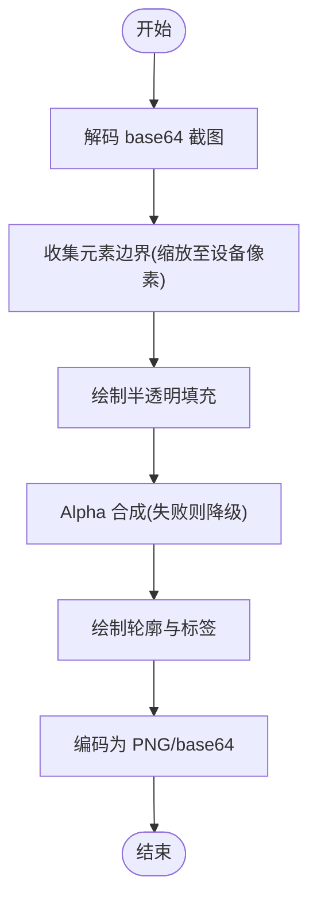
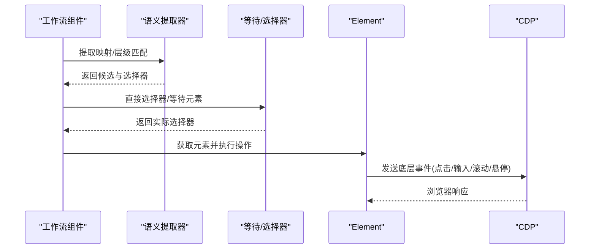
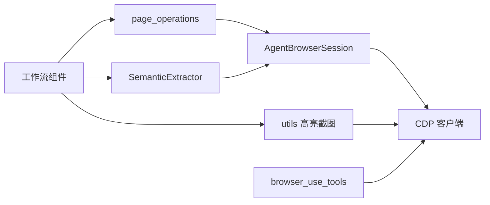

# 页面操作

<cite>
**本文引用的文件列表**
- [page_operations.py](file://vibe_surf/browser/page_operations.py)
- [find_page_element.py](file://vibe_surf/browser/find_page_element.py)
- [utils.py](file://vibe_surf/browser/utils.py)
- [agent_browser_session.py](file://vibe_surf/browser/agent_browser_session.py)
- [browser_scroll.py](file://vibe_surf/workflows/Browser/browser_scroll.py)
- [browser_click_element.py](file://vibe_surf/workflows/Browser/browser_click_element.py)
- [browser_input_text.py](file://vibe_surf/workflows/Browser/browser_input_text.py)
- [browser_select_options.py](file://vibe_surf/workflows/Browser/browser_select_options.py)
- [browser_focus_element.py](file://vibe_surf/workflows/Browser/browser_focus_element.py)
- [browser_hover_element.py](file://vibe_surf/workflows/Browser/browser_hover_element.py)
- [browser_use_tools.py](file://vibe_surf/tools/browser_use_tools.py)
</cite>

## 目录
1. [简介](#简介)
2. [项目结构](#项目结构)
3. [核心组件](#核心组件)
4. [架构总览](#架构总览)
5. [详细组件分析](#详细组件分析)
6. [依赖关系分析](#依赖关系分析)
7. [性能与基准](#性能与基准)
8. [故障排查指南](#故障排查指南)
9. [结论](#结论)
10. [附录](#附录)

## 简介
本文件系统性梳理并说明 page_operations 模块提供的页面操作能力，重点覆盖：
- 元素查找与定位：基于语义映射、直接选择器、层级选择器与回退策略的组合式定位
- 点击、输入、滚动等基础交互
- 智能元素定位的实现机制：多策略选择器、容错与回退、可见性等待
- 执行链路：从指令解析到浏览器执行的完整流程
- 复杂页面交互示例：表单填写、动态内容加载处理
- 性能基准与最佳实践
- 反爬虫应对策略

## 项目结构
page_operations 位于浏览器子系统中，配合语义提取与工具函数共同完成页面元素的发现、定位与交互。关键文件与职责如下：
- page_operations.py：提供滚动到文本、直接选择器尝试、等待元素等核心页面操作辅助方法
- find_page_element.py：构建语义映射（可见文本到选择器），支持层级上下文、重复文本去重、模糊匹配
- utils.py：高亮截图、坐标转换、字体与颜色管理等可视化与辅助能力
- agent_browser_session.py：浏览器会话封装，提供 CDP 连接、页面状态、DOM 提取等
- 工作流组件：browser_scroll.py、browser_click_element.py、browser_input_text.py、browser_select_options.py、browser_focus_element.py、browser_hover_element.py 将上述能力集成到可编排的工作流中
- tools/browser_use_tools.py：提供通过 CDP 定位元素中心点的通用工具

图表来源
- [agent_browser_session.py](file://vibe_surf/browser/agent_browser_session.py#L1-L200)
- [page_operations.py](file://vibe_surf/browser/page_operations.py#L1-L223)
- [find_page_element.py](file://vibe_surf/browser/find_page_element.py#L1-L220)
- [utils.py](file://vibe_surf/browser/utils.py#L666-L786)
- [browser_scroll.py](file://vibe_surf/workflows/Browser/browser_scroll.py#L1-L99)
- [browser_click_element.py](file://vibe_surf/workflows/Browser/browser_click_element.py#L90-L196)
- [browser_input_text.py](file://vibe_surf/workflows/Browser/browser_input_text.py#L1-L170)
- [browser_select_options.py](file://vibe_surf/workflows/Browser/browser_select_options.py#L68-L94)
- [browser_focus_element.py](file://vibe_surf/workflows/Browser/browser_focus_element.py#L64-L120)
- [browser_hover_element.py](file://vibe_surf/workflows/Browser/browser_hover_element.py#L64-L120)

章节来源
- [agent_browser_session.py](file://vibe_surf/browser/agent_browser_session.py#L1-L200)
- [page_operations.py](file://vibe_surf/browser/page_operations.py#L1-L223)
- [find_page_element.py](file://vibe_surf/browser/find_page_element.py#L1-L220)
- [utils.py](file://vibe_surf/browser/utils.py#L666-L786)

## 核心组件
- 滚动到文本：通过 DOM 搜索与 JavaScript 回退，确保目标文本进入视口
- 直接选择器尝试：优先使用目标文本作为 ID/name 等直接选择器，并进行可见性与严格模式校验
- 等待元素：轮询 CSS 选择器，支持多级回退策略（层级选择器、回退选择器、XPath）
- 语义映射与层级匹配：从页面提取交互元素，生成可见文本到选择器的映射，支持上下文去重与模糊匹配
- 高亮截图：将交互元素在截图上高亮标注，便于可视化调试

章节来源
- [page_operations.py](file://vibe_surf/browser/page_operations.py#L9-L223)
- [find_page_element.py](file://vibe_surf/browser/find_page_element.py#L1-L220)
- [utils.py](file://vibe_surf/browser/utils.py#L666-L786)

## 架构总览
页面操作的执行链路自下而上为：工作流组件接收用户意图 → 通过语义映射与直接选择器定位元素 → 使用等待与回退策略保证稳定性 → 调用 Page 对象执行点击/输入/滚动等动作 → 通过 CDP 发送底层事件或使用浏览器 API。

图表来源
- [browser_click_element.py](file://vibe_surf/workflows/Browser/browser_click_element.py#L90-L196)
- [browser_input_text.py](file://vibe_surf/workflows/Browser/browser_input_text.py#L85-L170)
- [browser_scroll.py](file://vibe_surf/workflows/Browser/browser_scroll.py#L67-L99)
- [find_page_element.py](file://vibe_surf/browser/find_page_element.py#L817-L946)
- [page_operations.py](file://vibe_surf/browser/page_operations.py#L100-L223)

## 详细组件分析

### 组件一：滚动到文本（scroll_to_text）
- 功能要点
  - 启用 DOM 命令，获取文档根节点
  - 多条 XPath 查询尝试，命中首个节点后调用 DOM.scrollIntoViewIfNeeded
  - 若 DOM 方案失败，回退到 JavaScript 遍历树并滚动到匹配文本的父元素
  - 未找到时抛出错误并记录日志
- 容错机制
  - 多查询策略与清理搜索结果
  - JS 回退路径，提升鲁棒性
- 性能与稳定性
  - DOM.performSearch 与 getSearchResults 仅取前若干节点，避免全量扫描
  - JS 回退采用 TreeWalker，按需遍历

图表来源
- [page_operations.py](file://vibe_surf/browser/page_operations.py#L9-L98)

章节来源
- [page_operations.py](file://vibe_surf/browser/page_operations.py#L9-L98)

### 组件二：直接选择器尝试（_try_direct_selector）
- 功能要点
  - 将目标文本清洗为合法选择器，优先尝试 ID、name、data-testid 等
  - 支持驼峰、小写等变体，提升匹配概率
  - 使用 page.wait_for_selector 确保可见性；对多选进行提示并尝试更具体的选择器
- 容错与严格模式
  - 多元素匹配时记录警告并尝试 :not([type='hidden'])、:visible、:first-of-type 等细化
  - 最终若仍不唯一，返回原始选择器但给出风险提示
- 性能考量
  - 仅在必要时进行可见性等待与二次筛选，避免无谓开销

图表来源
- [page_operations.py](file://vibe_surf/browser/page_operations.py#L100-L172)

章节来源
- [page_operations.py](file://vibe_surf/browser/page_operations.py#L100-L172)

### 组件三：等待元素与回退策略（_wait_for_element）
- 功能要点
  - 接收主选择器与回退选择器列表，按序轮询
  - 超时时间内持续检查 CSS 选择器匹配数量，支持层级选择器的特殊处理
  - 忽略 XPath 选择器（CDP 不支持）并记录日志
- 容错与健壮性
  - 多级回退：层级选择器、回退选择器、XPath
  - 对多匹配进行告警，避免误操作
- 性能与稳定性
  - 以固定间隔轮询，避免忙等
  - 在超时前尽早返回，减少无效等待

图表来源
- [page_operations.py](file://vibe_surf/browser/page_operations.py#L175-L223)

章节来源
- [page_operations.py](file://vibe_surf/browser/page_operations.py#L175-L223)

### 组件四：语义映射与层级匹配（SemanticExtractor）
- 功能要点
  - 提取交互元素并生成“可见文本”到“选择器”的映射
  - 生成层次化选择器（含 nth-of-type、ID 等）与回退选择器、XPath
  - 重复文本处理：通过容器上下文、DOM 路径、位置信息、属性等增强区分度
  - 层级匹配：支持“文本(容器/DOM路径)”的上下文匹配与模糊评分
- 性能与准确性
  - JavaScript 提取器覆盖按钮、输入框、下拉、日历等复杂控件
  - 上下文与 DOM 路径用于去重与精确定位
- 可视化辅助
  - 高亮截图工具可将交互元素在截图中标注，便于调试

图表来源
- [find_page_element.py](file://vibe_surf/browser/find_page_element.py#L1-L220)
- [find_page_element.py](file://vibe_surf/browser/find_page_element.py#L817-L946)

章节来源
- [find_page_element.py](file://vibe_surf/browser/find_page_element.py#L1-L220)
- [find_page_element.py](file://vibe_surf/browser/find_page_element.py#L817-L946)

### 组件五：高亮截图与坐标转换（utils.py）
- 功能要点
  - 将交互元素在截图上绘制半透明填充与轮廓，并标注索引
  - 自动选择字体与颜色，避免标签重叠
  - 从 CSS 坐标到设备像素坐标的转换，适配高分屏
- 性能与兼容性
  - 字体缓存与默认回退，避免频繁 IO
  - 异步包装 create_highlighted_screenshot_async，便于工作流集成

图表来源
- [utils.py](file://vibe_surf/browser/utils.py#L666-L786)

章节来源
- [utils.py](file://vibe_surf/browser/utils.py#L666-L786)

### 组件六：工作流组件集成（点击/输入/滚动/选项选择/聚焦/悬停）
- 点击元素（browser_click_element.py）
  - 优先使用语义映射与直接选择器，再回退到 CSS/XPath/Prompt
  - 成功后执行点击并检测新标签页切换
- 输入文本（browser_input_text.py）
  - 与点击类似，最终调用 element.fill 并支持清空
- 滚动（browser_scroll.py）
  - 支持按文本滚动或按坐标与增量滚动
- 选择选项（browser_select_options.py）
  - 针对 select 元素，按 CSS 或 Prompt 定位后选择指定值
- 聚焦/悬停（browser_focus_element.py、browser_hover_element.py）
  - 通过 CDP Input.dispatchMouseEvent 实现鼠标移动与聚焦

图表来源
- [browser_click_element.py](file://vibe_surf/workflows/Browser/browser_click_element.py#L90-L196)
- [browser_input_text.py](file://vibe_surf/workflows/Browser/browser_input_text.py#L85-L170)
- [browser_scroll.py](file://vibe_surf/workflows/Browser/browser_scroll.py#L67-L99)
- [browser_select_options.py](file://vibe_surf/workflows/Browser/browser_select_options.py#L68-L94)
- [browser_focus_element.py](file://vibe_surf/workflows/Browser/browser_focus_element.py#L82-L120)
- [browser_hover_element.py](file://vibe_surf/workflows/Browser/browser_hover_element.py#L82-L120)

章节来源
- [browser_click_element.py](file://vibe_surf/workflows/Browser/browser_click_element.py#L90-L196)
- [browser_input_text.py](file://vibe_surf/workflows/Browser/browser_input_text.py#L85-L170)
- [browser_scroll.py](file://vibe_surf/workflows/Browser/browser_scroll.py#L67-L99)
- [browser_select_options.py](file://vibe_surf/workflows/Browser/browser_select_options.py#L68-L94)
- [browser_focus_element.py](file://vibe_surf/workflows/Browser/browser_focus_element.py#L82-L120)
- [browser_hover_element.py](file://vibe_surf/workflows/Browser/browser_hover_element.py#L82-L120)

## 依赖关系分析
- page_operations 依赖 AgentBrowserSession 的当前 Page 获取能力与 CDP 客户端
- 工作流组件依赖 SemanticExtractor 与 page_operations 的辅助方法
- utils 与 CDP 结合，提供高亮截图与坐标转换
- tools/browser_use_tools.py 提供通过 Runtime.evaluate 定位元素中心点的能力，作为通用定位手段

图表来源
- [page_operations.py](file://vibe_surf/browser/page_operations.py#L1-L223)
- [find_page_element.py](file://vibe_surf/browser/find_page_element.py#L1-L220)
- [utils.py](file://vibe_surf/browser/utils.py#L666-L786)
- [browser_use_tools.py](file://vibe_surf/tools/browser_use_tools.py#L180-L233)

章节来源
- [page_operations.py](file://vibe_surf/browser/page_operations.py#L1-L223)
- [find_page_element.py](file://vibe_surf/browser/find_page_element.py#L1-L220)
- [utils.py](file://vibe_surf/browser/utils.py#L666-L786)
- [browser_use_tools.py](file://vibe_surf/tools/browser_use_tools.py#L180-L233)

## 性能与基准
- 滚动到文本
  - DOM 搜索：O(N) 匹配，仅取前若干节点，适合短文本快速定位
  - JS 回退：TreeWalker 遍历，按需停止，适合复杂页面或隐藏文本
- 直接选择器尝试
  - 一次性 CSS 查询，配合可见性等待，避免多次轮询
  - 多变体尝试成本低，建议优先使用
- 等待元素
  - 固定间隔轮询，超时控制，避免忙等
  - 层级选择器优先，减少多选带来的严格模式问题
- 语义映射
  - JavaScript 提取器一次性扫描，后续匹配为 O(k) 查找
  - 上下文与 DOM 路径增强区分度，降低误判
- 高亮截图
  - 图像处理为 CPU 密集型，建议批量处理或异步执行
  - 字体缓存与默认回退减少 IO 开销

最佳实践
- 优先使用语义映射与直接选择器，再回退到层级选择器
- 对动态内容，先等待网络稳定，再执行元素定位
- 对多选场景，尽量使用带 ID 或 nth-of-type 的层级选择器
- 高分屏与多显示器：使用 utils 的坐标转换函数
- 大量截图标注：使用异步包装函数 create_highlighted_screenshot_async

[本节为通用指导，无需列出具体文件来源]

## 故障排查指南
- 文本未找到
  - 检查是否已启用 DOM 命令与正确 session_id
  - 使用 JS 回退路径确认文本存在
  - 章节来源
    - [page_operations.py](file://vibe_surf/browser/page_operations.py#L9-L98)
- 选择器多匹配
  - 查看日志中的多选告警，尝试细化选择器
  - 使用层级选择器或添加 :visible/:first-of-type
  - 章节来源
    - [page_operations.py](file://vibe_surf/browser/page_operations.py#L175-L223)
- 元素不可见
  - 使用 wait_for_selector(state='visible') 或滚动到视口
  - 章节来源
    - [page_operations.py](file://vibe_surf/browser/page_operations.py#L100-L172)
- 新标签页未切换
  - 检查点击后标签集合变化，必要时激活目标 target
  - 章节来源
    - [browser_click_element.py](file://vibe_surf/workflows/Browser/browser_click_element.py#L177-L190)
- 高分屏坐标偏差
  - 使用 utils.get_viewport_info_from_cdp 获取 device_pixel_ratio 并转换坐标
  - 章节来源
    - [utils.py](file://vibe_surf/browser/utils.py#L731-L759)

章节来源
- [page_operations.py](file://vibe_surf/browser/page_operations.py#L9-L223)
- [browser_click_element.py](file://vibe_surf/workflows/Browser/browser_click_element.py#L177-L190)
- [utils.py](file://vibe_surf/browser/utils.py#L731-L759)

## 结论
page_operations 模块通过“语义映射 + 直接选择器 + 等待与回退”的组合策略，实现了稳健且高效的页面元素定位与交互。结合工作流组件与工具函数，能够覆盖从简单点击、输入到复杂表单与动态内容的广泛场景。建议在实际应用中遵循“优先语义、次选层级、最后回退”的原则，并结合高亮截图与坐标转换工具进行可视化调试与性能优化。

[本节为总结，无需列出具体文件来源]

## 附录

### 常见操作示例（代码片段路径）
- 表单填写
  - 语义映射与直接选择器尝试：[browser_input_text.py](file://vibe_surf/workflows/Browser/browser_input_text.py#L85-L170)
  - 等待元素与回退策略：[page_operations.py](file://vibe_surf/browser/page_operations.py#L175-L223)
- 滚动到文本
  - DOM 搜索与 JS 回退：[page_operations.py](file://vibe_surf/browser/page_operations.py#L9-L98)
- 动态内容加载处理
  - 等待网络稳定后再定位元素：[browser_click_element.py](file://vibe_surf/workflows/Browser/browser_click_element.py#L90-L100)
- 高亮截图辅助调试
  - 创建高亮截图：[utils.py](file://vibe_surf/browser/utils.py#L666-L786)

章节来源
- [browser_input_text.py](file://vibe_surf/workflows/Browser/browser_input_text.py#L85-L170)
- [page_operations.py](file://vibe_surf/browser/page_operations.py#L9-L223)
- [browser_click_element.py](file://vibe_surf/workflows/Browser/browser_click_element.py#L90-L100)
- [utils.py](file://vibe_surf/browser/utils.py#L666-L786)