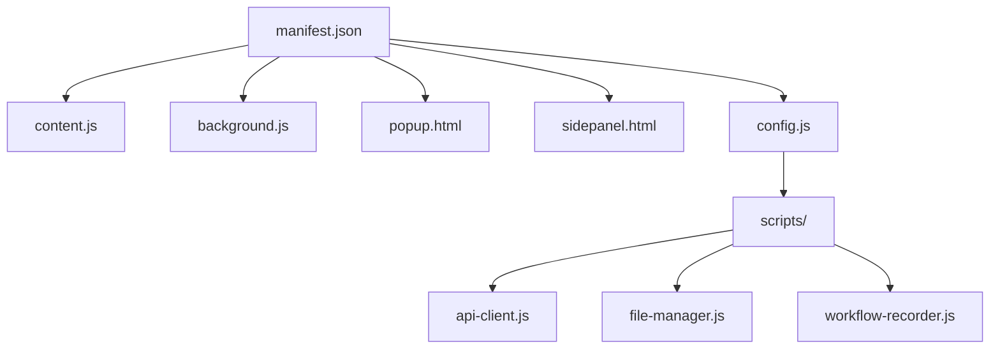
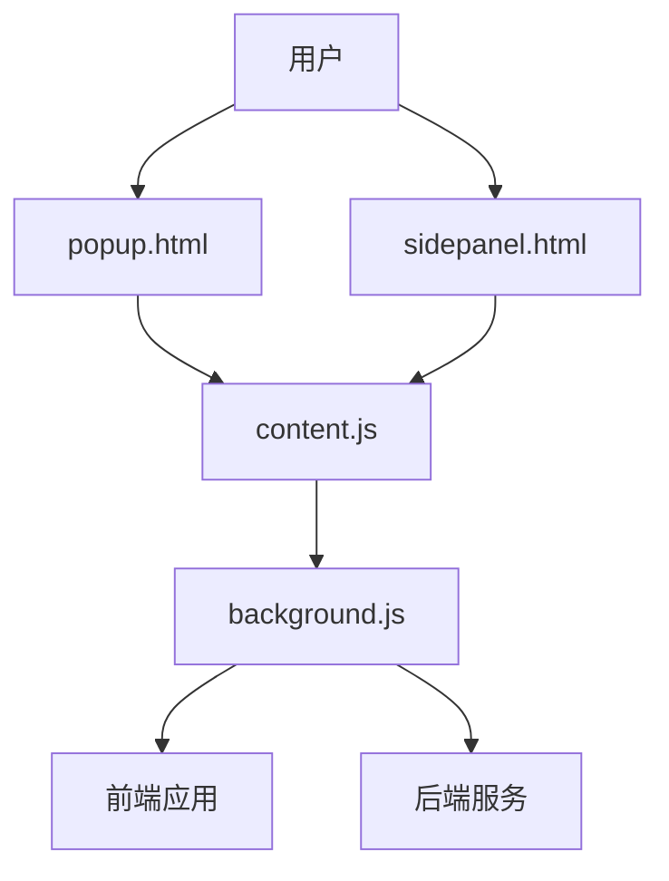
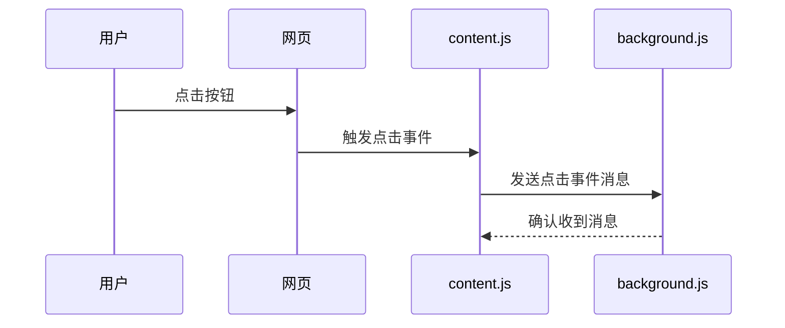
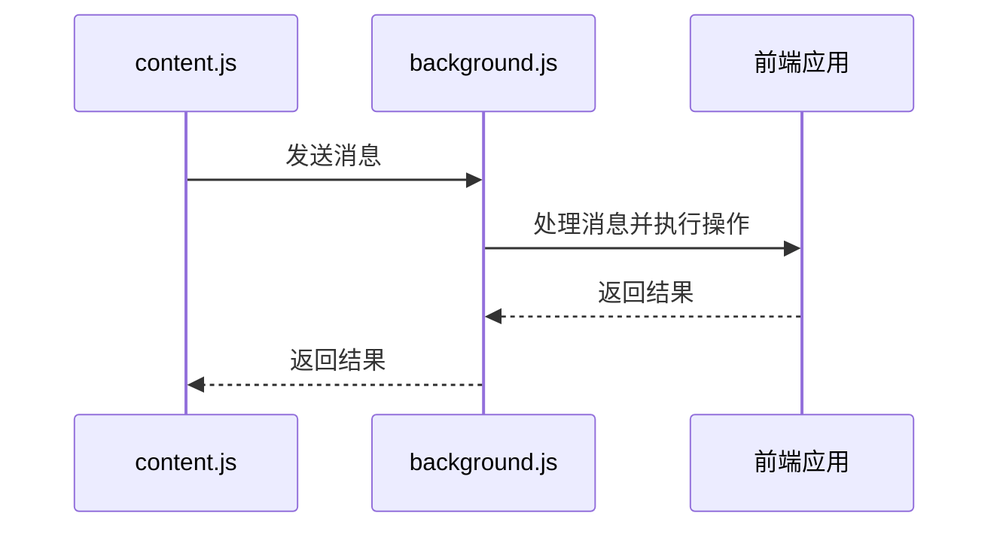
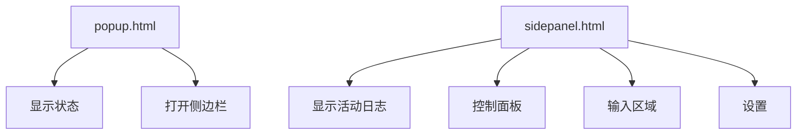
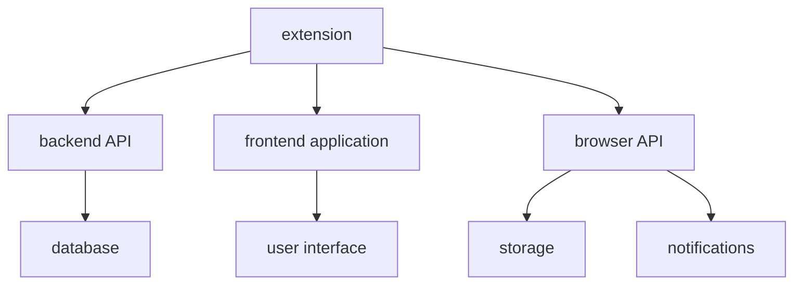

# Chrome扩展

<cite>
**本文档引用的文件**   
- [manifest.json](file://vibe_surf/chrome_extension/manifest.json)
- [content.js](file://vibe_surf/chrome_extension/content.js)
- [background.js](file://vibe_surf/chrome_extension/background.js)
- [popup.html](file://vibe_surf/chrome_extension/popup.html)
- [sidepanel.html](file://vibe_surf/chrome_extension/sidepanel.html)
- [config.js](file://vibe_surf/chrome_extension/config.js)
- [scripts/workflow-recorder.js](file://vibe_surf/chrome_extension/scripts/workflow-recorder.js)
- [scripts/main.js](file://vibe_surf/chrome_extension/scripts/main.js)
</cite>

## 目录
1. [介绍](#介绍)
2. [项目结构](#项目结构)
3. [核心组件](#核心组件)
4. [架构概述](#架构概述)
5. [详细组件分析](#详细组件分析)
6. [依赖分析](#依赖分析)
7. [性能考虑](#性能考虑)
8. [故障排除指南](#故障排除指南)
9. [结论](#结论)

## 介绍
VibeSurf Chrome扩展是一个功能强大的浏览器助手，旨在通过AI自动化提升用户的浏览体验。该扩展通过在浏览器中注入内容脚本、管理后台服务和提供用户界面来实现其功能。本文档详细描述了扩展的架构和实现，包括权限配置、功能声明、内容脚本注入、后台服务管理、用户界面设计以及与前端应用的通信机制。

## 项目结构
VibeSurf Chrome扩展的项目结构清晰，主要文件和目录包括：
- `manifest.json`：扩展的配置文件，定义了权限、功能声明和入口点。
- `content.js`：内容脚本，注入到网页中以捕获用户交互。
- `background.js`：后台脚本，管理扩展的后台服务和消息传递。
- `popup.html`：弹出窗口的HTML文件，提供用户界面。
- `sidepanel.html`：侧边栏的HTML文件，提供更丰富的用户界面。
- `config.js`：配置文件，包含后端URL和其他设置。
- `scripts/`：包含各种功能的JavaScript文件，如API客户端、文件管理器等。

**Diagram sources**
- [manifest.json](file://vibe_surf/chrome_extension/manifest.json#L1-L70)
- [content.js](file://vibe_surf/chrome_extension/content.js#L1-L745)
- [background.js](file://vibe_surf/chrome_extension/background.js#L1-L800)
- [popup.html](file://vibe_surf/chrome_extension/popup.html#L1-L134)
- [sidepanel.html](file://vibe_surf/chrome_extension/sidepanel.html#L1-L800)
- [config.js](file://vibe_surf/chrome_extension/config.js#L1-L56)
- [scripts/workflow-recorder.js](file://vibe_surf/chrome_extension/scripts/workflow-recorder.js#L100-L651)

**Section sources**
- [manifest.json](file://vibe_surf/chrome_extension/manifest.json#L1-L70)
- [content.js](file://vibe_surf/chrome_extension/content.js#L1-L745)
- [background.js](file://vibe_surf/chrome_extension/background.js#L1-L800)
- [popup.html](file://vibe_surf/chrome_extension/popup.html#L1-L134)
- [sidepanel.html](file://vibe_surf/chrome_extension/sidepanel.html#L1-L800)
- [config.js](file://vibe_surf/chrome_extension/config.js#L1-L56)
- [scripts/workflow-recorder.js](file://vibe_surf/chrome_extension/scripts/workflow-recorder.js#L100-L651)

## 核心组件
VibeSurf Chrome扩展的核心组件包括`manifest.json`、`content.js`、`background.js`、`popup.html`和`sidepanel.html`。这些文件共同定义了扩展的功能和行为。

**Section sources**
- [manifest.json](file://vibe_surf/chrome_extension/manifest.json#L1-L70)
- [content.js](file://vibe_surf/chrome_extension/content.js#L1-L745)
- [background.js](file://vibe_surf/chrome_extension/background.js#L1-L800)
- [popup.html](file://vibe_surf/chrome_extension/popup.html#L1-L134)
- [sidepanel.html](file://vibe_surf/chrome_extension/sidepanel.html#L1-L800)

## 架构概述
VibeSurf Chrome扩展的架构分为三个主要部分：内容脚本、后台脚本和用户界面。内容脚本注入到网页中，捕获用户交互并发送消息给后台脚本。后台脚本管理扩展的后台服务，处理消息传递，并与前端应用通信。用户界面通过弹出窗口和侧边栏提供，允许用户与扩展进行交互。

**Diagram sources**
- [popup.html](file://vibe_surf/chrome_extension/popup.html#L1-L134)
- [sidepanel.html](file://vibe_surf/chrome_extension/sidepanel.html#L1-L800)
- [content.js](file://vibe_surf/chrome_extension/content.js#L1-L745)
- [background.js](file://vibe_surf/chrome_extension/background.js#L1-L800)

## 详细组件分析

### manifest.json中的权限配置和扩展功能声明
`manifest.json`文件定义了扩展的权限和功能声明。它指定了扩展所需的权限，如`activeTab`、`storage`、`notifications`等，并声明了扩展的入口点，如`background.js`、`content.js`、`popup.html`和`sidepanel.html`。

**Section sources**
- [manifest.json](file://vibe_surf/chrome_extension/manifest.json#L1-L70)

### content.js如何注入到页面并捕获用户交互
`content.js`文件是内容脚本，它在网页加载时被注入到页面中。该脚本通过监听用户交互事件（如点击、输入和键盘事件）来捕获用户行为，并将这些事件通过消息传递机制发送给后台脚本。

**Diagram sources**
- [content.js](file://vibe_surf/chrome_extension/content.js#L1-L745)
- [background.js](file://vibe_surf/chrome_extension/background.js#L1-L800)

### background.js如何管理扩展的后台服务和消息传递
`background.js`文件是后台脚本，它管理扩展的后台服务和消息传递。该脚本通过监听消息事件来处理来自内容脚本和用户界面的消息，并执行相应的操作，如更新标签、显示通知和复制到剪贴板。

**Diagram sources**
- [content.js](file://vibe_surf/chrome_extension/content.js#L1-L745)
- [background.js](file://vibe_surf/chrome_extension/background.js#L1-L800)

### popup.html和sidepanel.html的UI设计与功能
`popup.html`和`sidepanel.html`文件提供了扩展的用户界面。`popup.html`是一个简单的弹出窗口，显示扩展的状态和基本操作。`sidepanel.html`是一个更丰富的侧边栏，提供更多的功能和设置选项。

**Diagram sources**
- [popup.html](file://vibe_surf/chrome_extension/popup.html#L1-L134)
- [sidepanel.html](file://vibe_surf/chrome_extension/sidepanel.html#L1-L800)

## 依赖分析
VibeSurf Chrome扩展依赖于多个外部库和服务，如后端API、前端应用和浏览器API。这些依赖关系通过`config.js`文件中的配置进行管理，并在`background.js`和`content.js`中通过消息传递机制进行通信。

**Diagram sources**
- [config.js](file://vibe_surf/chrome_extension/config.js#L1-L56)
- [background.js](file://vibe_surf/chrome_extension/background.js#L1-L800)
- [content.js](file://vibe_surf/chrome_extension/content.js#L1-L745)

## 性能考虑
为了优化扩展的性能，建议采取以下措施：
- 减少资源消耗：避免在内容脚本中执行耗时的操作，尽量将复杂计算移到后台脚本中。
- 提高响应速度：使用异步消息传递机制，避免阻塞主线程。
- 优化消息传递：减少不必要的消息传递，只在必要时发送消息。

**Section sources**
- [content.js](file://vibe_surf/chrome_extension/content.js#L1-L745)
- [background.js](file://vibe_surf/chrome_extension/background.js#L1-L800)

## 故障排除指南
### 扩展安装和调试指南
1. **加载开发版本**：在Chrome浏览器中打开`chrome://extensions/`，启用开发者模式，点击“加载已解压的扩展程序”，选择扩展的根目录。
2. **查看控制台日志**：在开发者工具中查看`background.js`和`content.js`的控制台日志，以调试扩展的行为。

**Section sources**
- [background.js](file://vibe_surf/chrome_extension/background.js#L1-L800)
- [content.js](file://vibe_surf/chrome_extension/content.js#L1-L745)

## 结论
VibeSurf Chrome扩展通过精心设计的架构和实现，提供了一个功能强大且易于使用的浏览器助手。通过详细文档化其架构和实现，用户可以更好地理解和使用该扩展，从而提升浏览体验。