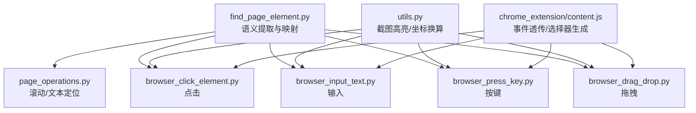
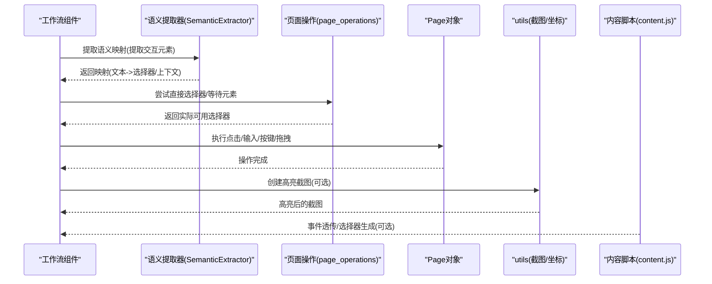
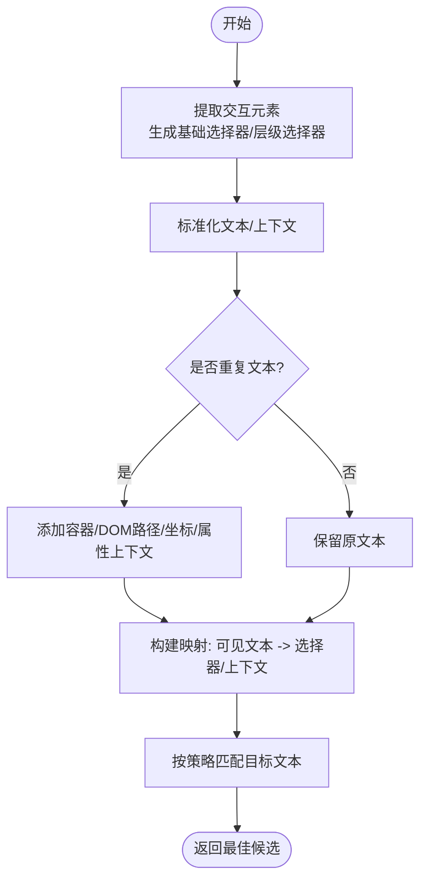
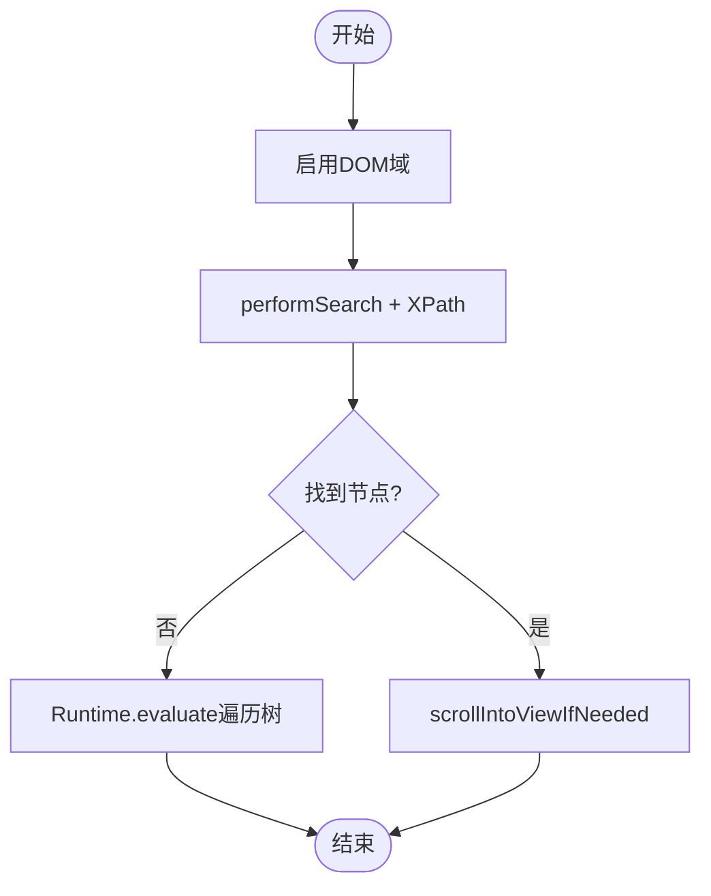
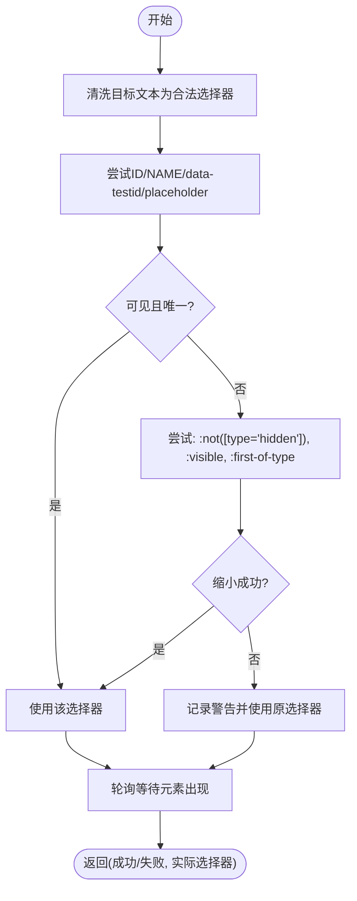
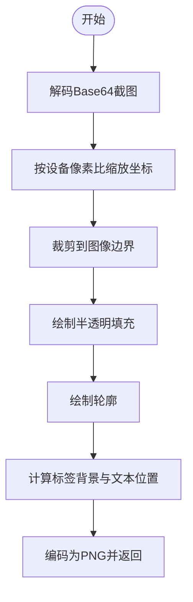
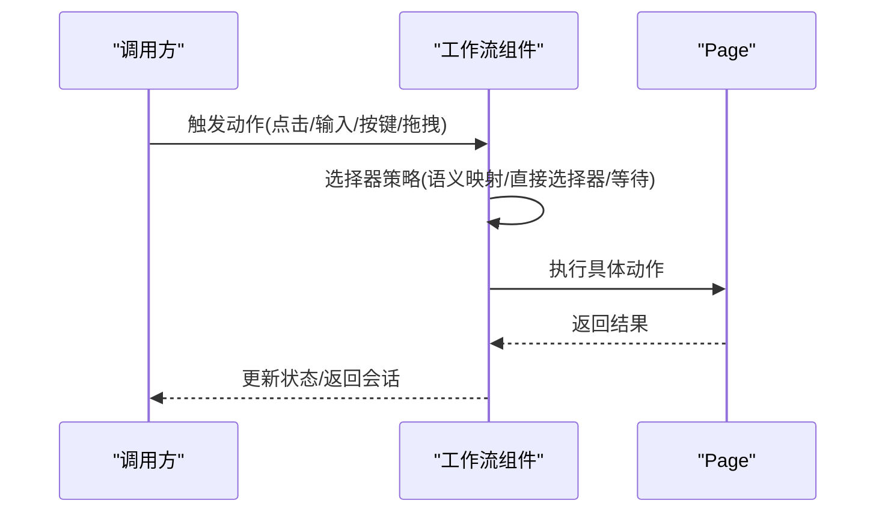
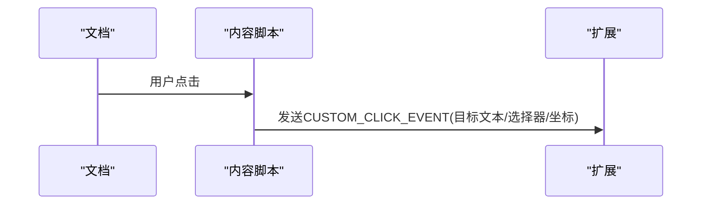
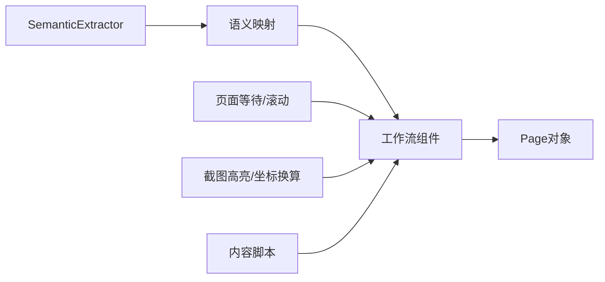

# DOM操作

<cite>
**本文引用的文件**
- [find_page_element.py](file://vibe_surf/browser/find_page_element.py)
- [page_operations.py](file://vibe_surf/browser/page_operations.py)
- [utils.py](file://vibe_surf/browser/utils.py)
- [browser_click_element.py](file://vibe_surf/workflows/Browser/browser_click_element.py)
- [browser_input_text.py](file://vibe_surf/workflows/Browser/browser_input_text.py)
- [browser_press_key.py](file://vibe_surf/workflows/Browser/browser_press_key.py)
- [browser_drag_drop.py](file://vibe_surf/workflows/Browser/browser_drag_drop.py)
- [content.js](file://vibe_surf/chrome_extension/content.js)
</cite>

## 目录
1. [简介](#简介)
2. [项目结构](#项目结构)
3. [核心组件](#核心组件)
4. [架构总览](#架构总览)
5. [详细组件分析](#详细组件分析)
6. [依赖关系分析](#依赖关系分析)
7. [性能考量](#性能考量)
8. [故障排查指南](#故障排查指南)
9. [结论](#结论)

## 简介
本章节系统性文档化VibeSurf在浏览器端的DOM操作能力，重点覆盖以下方面：
- 元素定位算法：基于CSS选择器、XPath与文本内容的多策略查找
- 页面元素交互：点击、输入、拖拽、按键等操作的实现路径
- 动态内容处理：等待元素加载、处理异步更新的策略
- 坐标与位置校准：设备像素比、视口偏移、截图标注与坐标映射
- 选择器优化建议：提升稳定性与鲁棒性的最佳实践
- 常见问题与对策：iframe嵌套、Shadow DOM、动态ID等场景

## 项目结构
围绕DOM操作的关键模块分布如下：
- 浏览器侧DOM提取与语义映射：find_page_element.py
- 页面滚动与文本定位：page_operations.py
- 截图高亮与坐标换算：utils.py
- 工作流层的交互动作封装：browser_click_element.py、browser_input_text.py、browser_press_key.py、browser_drag_drop.py
- 内容脚本辅助（事件透传与选择器生成）：chrome_extension/content.js

图表来源
- [find_page_element.py](file://vibe_surf/browser/find_page_element.py#L1-L120)
- [page_operations.py](file://vibe_surf/browser/page_operations.py#L1-L120)
- [utils.py](file://vibe_surf/browser/utils.py#L666-L786)
- [browser_click_element.py](file://vibe_surf/workflows/Browser/browser_click_element.py#L90-L196)
- [browser_input_text.py](file://vibe_surf/workflows/Browser/browser_input_text.py#L85-L170)
- [browser_press_key.py](file://vibe_surf/workflows/Browser/browser_press_key.py#L41-L52)
- [browser_drag_drop.py](file://vibe_surf/workflows/Browser/browser_drag_drop.py#L47-L82)
- [content.js](file://vibe_surf/chrome_extension/content.js#L429-L464)

章节来源
- [find_page_element.py](file://vibe_surf/browser/find_page_element.py#L1-L120)
- [page_operations.py](file://vibe_surf/browser/page_operations.py#L1-L120)
- [utils.py](file://vibe_surf/browser/utils.py#L666-L786)
- [browser_click_element.py](file://vibe_surf/workflows/Browser/browser_click_element.py#L90-L196)
- [browser_input_text.py](file://vibe_surf/workflows/Browser/browser_input_text.py#L85-L170)
- [browser_press_key.py](file://vibe_surf/workflows/Browser/browser_press_key.py#L41-L52)
- [browser_drag_drop.py](file://vibe_surf/workflows/Browser/browser_drag_drop.py#L47-L82)
- [content.js](file://vibe_surf/chrome_extension/content.js#L429-L464)

## 核心组件
- 语义提取器SemanticExtractor：从页面提取可交互元素，生成语义映射表，支持基于文本、容器上下文、DOM路径的智能匹配
- 页面操作工具：滚动到文本、直接选择器尝试、等待元素可用
- 截图高亮与坐标换算：根据设备像素比与视口偏移，将CSS坐标转换为设备像素坐标，绘制高亮框与标签
- 工作流交互组件：点击、输入、按键、拖拽的高层封装，统一调用等待与选择器策略

章节来源
- [find_page_element.py](file://vibe_surf/browser/find_page_element.py#L18-L120)
- [page_operations.py](file://vibe_surf/browser/page_operations.py#L1-L120)
- [utils.py](file://vibe_surf/browser/utils.py#L666-L786)

## 架构总览
下图展示从“语义映射”到“工作流动作”的调用链路，以及截图高亮与坐标换算在交互过程中的参与点。

图表来源
- [find_page_element.py](file://vibe_surf/browser/find_page_element.py#L817-L867)
- [page_operations.py](file://vibe_surf/browser/page_operations.py#L100-L173)
- [browser_click_element.py](file://vibe_surf/workflows/Browser/browser_click_element.py#L90-L196)
- [browser_input_text.py](file://vibe_surf/workflows/Browser/browser_input_text.py#L85-L170)
- [browser_press_key.py](file://vibe_surf/workflows/Browser/browser_press_key.py#L41-L52)
- [browser_drag_drop.py](file://vibe_surf/workflows/Browser/browser_drag_drop.py#L47-L82)
- [utils.py](file://vibe_surf/browser/utils.py#L666-L786)
- [content.js](file://vibe_surf/chrome_extension/content.js#L429-L464)

## 详细组件分析

### 1) 语义提取与元素定位（SemanticExtractor）
- 职责
  - 抽取页面可交互元素，生成“可见文本->选择器/上下文”的映射
  - 支持基于文本的精确匹配、ID/NAME属性匹配、容器上下文与DOM路径的层次化匹配
  - 提供模糊匹配与模式匹配（驼峰/蛇形），并结合上下文权重打分
- 关键流程
  - 使用CDP执行JS提取所有可交互元素，生成基础CSS选择器与层级选择器
  - 对每个元素抽取标签文本、父文本、容器上下文、兄弟上下文、DOM路径等
  - 合并重复文本，通过容器/DOM路径/坐标/属性等生成唯一化后缀
  - 导出映射表，供后续工作流按文本或上下文进行定位
- 匹配策略
  - 文本精确匹配（忽略大小写）
  - ID/NAME属性直配
  - 层次化上下文匹配（容器文本/ID、DOM路径片段、兄弟序号）
  - 模糊匹配（子串、Jaccard相似度、词重叠率）
  - 模式匹配（驼峰/蛇形单词拆分与重叠）

图表来源
- [find_page_element.py](file://vibe_surf/browser/find_page_element.py#L211-L260)
- [find_page_element.py](file://vibe_surf/browser/find_page_element.py#L817-L867)
- [find_page_element.py](file://vibe_surf/browser/find_page_element.py#L869-L1101)

章节来源
- [find_page_element.py](file://vibe_surf/browser/find_page_element.py#L18-L120)
- [find_page_element.py](file://vibe_surf/browser/find_page_element.py#L211-L260)
- [find_page_element.py](file://vibe_surf/browser/find_page_element.py#L817-L1101)

### 2) 页面滚动与文本定位（scroll_to_text）
- 职责
  - 在当前页面内滚动到指定文本所在位置
  - 优先使用DOM.performSearch与XPath；失败时回退至Runtime.evaluate遍历树
- 关键点
  - 多种XPath查询变体组合，提高命中率
  - 成功后调用DOM.scrollIntoViewIfNeeded确保元素可见
  - 记录调试日志与错误信息

图表来源
- [page_operations.py](file://vibe_surf/browser/page_operations.py#L9-L60)
- [page_operations.py](file://vibe_surf/browser/page_operations.py#L61-L98)

章节来源
- [page_operations.py](file://vibe_surf/browser/page_operations.py#L1-L120)

### 3) 直接选择器尝试与等待（_try_direct_selector/_wait_for_element）
- 职责
  - 将目标文本作为ID/NAME等直接尝试，若匹配多个则进一步缩小
  - 统一等待逻辑：轮询CSS选择器，支持层级选择器与回退列表
- 关键点
  - 对于层级选择器（含nth-of-type或ID），优先采用以保证唯一性
  - 支持回退到Hierarchical/Fallback/XPath选择器
  - 超时控制与严格模式提示

图表来源
- [page_operations.py](file://vibe_surf/browser/page_operations.py#L100-L173)
- [page_operations.py](file://vibe_surf/browser/page_operations.py#L175-L223)

章节来源
- [page_operations.py](file://vibe_surf/browser/page_operations.py#L100-L223)

### 4) 截图高亮与坐标换算（create_highlighted_screenshot）
- 职责
  - 将交互元素的绝对位置（CSS像素）转换为设备像素坐标
  - 在截图上绘制半透明填充、轮廓与索引标签，避免标签重叠
- 关键点
  - 通过CDP获取布局度量，计算设备像素比与视口偏移
  - 将元素边界框缩放并裁剪到图像范围内
  - 生成不重复且对比度良好的颜色序列，按四角放置标签并避免重叠

图表来源
- [utils.py](file://vibe_surf/browser/utils.py#L666-L786)
- [utils.py](file://vibe_surf/browser/utils.py#L1-L120)

章节来源
- [utils.py](file://vibe_surf/browser/utils.py#L1-L120)
- [utils.py](file://vibe_surf/browser/utils.py#L666-L786)

### 5) 工作流交互动作封装
- 点击（BrowserClickElementComponent）
  - 优先使用语义映射与层级选择器；失败回退到直接选择器与等待
  - 支持右键、双击与修饰键（如Control）
- 输入（BrowserInputTextComponent）
  - 与点击类似，支持清空与输入文本
- 按键（BrowserPressKeyComponent）
  - 直接调用Page.press发送按键序列
- 拖拽（BrowserDragDropComponent）
  - 分别解析源与目标选择器，执行drag_to

图表来源
- [browser_click_element.py](file://vibe_surf/workflows/Browser/browser_click_element.py#L90-L196)
- [browser_input_text.py](file://vibe_surf/workflows/Browser/browser_input_text.py#L85-L170)
- [browser_press_key.py](file://vibe_surf/workflows/Browser/browser_press_key.py#L41-L52)
- [browser_drag_drop.py](file://vibe_surf/workflows/Browser/browser_drag_drop.py#L47-L82)

章节来源
- [browser_click_element.py](file://vibe_surf/workflows/Browser/browser_click_element.py#L90-L196)
- [browser_input_text.py](file://vibe_surf/workflows/Browser/browser_input_text.py#L85-L170)
- [browser_press_key.py](file://vibe_surf/workflows/Browser/browser_press_key.py#L41-L52)
- [browser_drag_drop.py](file://vibe_surf/workflows/Browser/browser_drag_drop.py#L47-L82)

### 6) 内容脚本辅助（事件透传与选择器生成）
- 事件透传
  - 监听点击事件，向扩展发送自定义消息，附带目标文本、选择器与坐标
- 选择器生成
  - 基于Chromium算法生成CSS路径，优先ID，否则逐级向上拼接父节点路径

图表来源
- [content.js](file://vibe_surf/chrome_extension/content.js#L429-L464)
- [content.js](file://vibe_surf/chrome_extension/content.js#L565-L609)

章节来源
- [content.js](file://vibe_surf/chrome_extension/content.js#L429-L464)
- [content.js](file://vibe_surf/chrome_extension/content.js#L565-L609)

## 依赖关系分析
- SemanticExtractor依赖CDP执行JS提取元素，导出映射供工作流使用
- 工作流组件依赖语义映射与等待策略，最终调用Page对象执行动作
- 截图高亮依赖CDP布局度量，将CSS坐标换算为设备像素坐标
- 内容脚本为事件透传与选择器生成提供辅助

图表来源
- [find_page_element.py](file://vibe_surf/browser/find_page_element.py#L817-L867)
- [page_operations.py](file://vibe_surf/browser/page_operations.py#L100-L173)
- [utils.py](file://vibe_surf/browser/utils.py#L666-L786)
- [browser_click_element.py](file://vibe_surf/workflows/Browser/browser_click_element.py#L90-L196)
- [content.js](file://vibe_surf/chrome_extension/content.js#L429-L464)

章节来源
- [find_page_element.py](file://vibe_surf/browser/find_page_element.py#L817-L867)
- [page_operations.py](file://vibe_surf/browser/page_operations.py#L100-L173)
- [utils.py](file://vibe_surf/browser/utils.py#L666-L786)
- [browser_click_element.py](file://vibe_surf/workflows/Browser/browser_click_element.py#L90-L196)
- [content.js](file://vibe_surf/chrome_extension/content.js#L429-L464)

## 性能考量
- 语义提取阶段尽量减少DOM遍历次数，优先使用CDP的Runtime.evaluate一次性提取
- 等待策略采用轮询+超时控制，避免长时间阻塞；对层级选择器优先采用，减少多次等待
- 截图高亮在CPU密集路径上，建议批量处理并缓存字体与颜色，避免重复计算
- 事件透传仅在录制模式开启，减少不必要的监听开销

## 故障排查指南
- 元素未找到
  - 检查是否使用了层级选择器（含ID或nth-of-type）；若仍失败，回退到Hierarchical/Fallback/XPath
  - 使用_scroll_to_text确认文本确实存在于页面
- 动态内容/异步更新
  - 在操作前调用等待策略，确保元素可见且唯一
  - 若存在iframe嵌套，需先切换到对应frame再定位
- 坐标不准确
  - 确认设备像素比与视口偏移已正确获取并用于坐标换算
  - 截图尺寸与元素边界框需裁剪到图像范围
- Shadow DOM
  - 当前实现主要面向常规DOM；若页面使用Shadow DOM，需在注入脚本中处理shadowRoot查询
- 动态ID
  - 优先使用层级选择器或容器上下文；避免依赖易变ID
- 多标签页
  - 点击可能打开新标签页，工作流中检测新增标签并激活

章节来源
- [page_operations.py](file://vibe_surf/browser/page_operations.py#L1-L120)
- [browser_click_element.py](file://vibe_surf/workflows/Browser/browser_click_element.py#L170-L196)
- [utils.py](file://vibe_surf/browser/utils.py#L731-L759)

## 结论
VibeSurf的DOM操作体系以“语义提取+多策略定位+稳健等待+坐标换算”为核心，既保证了跨页面的稳定性，又提供了丰富的交互动作封装。通过层级选择器、容器上下文与DOM路径的综合评分，能够有效应对复杂UI与动态内容场景；配合截图高亮与事件透传，进一步提升了可观测性与可维护性。建议在实践中优先采用层级选择器与容器上下文，避免对易变ID的强依赖，并在动态场景中合理设置等待与回退策略。