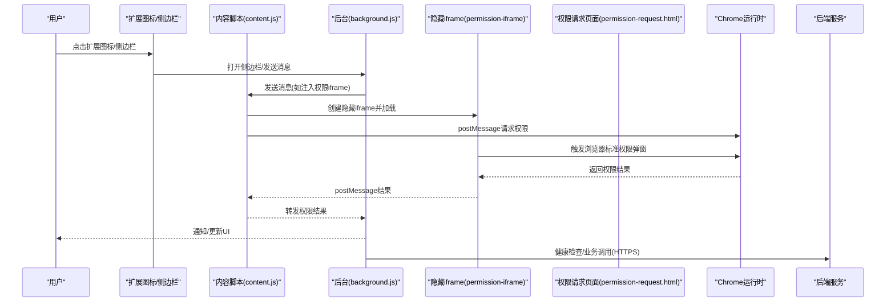
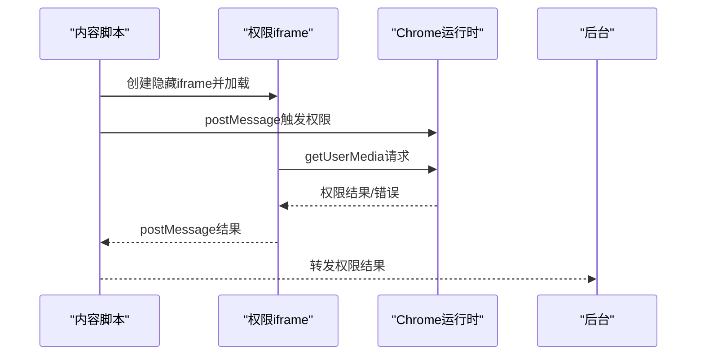
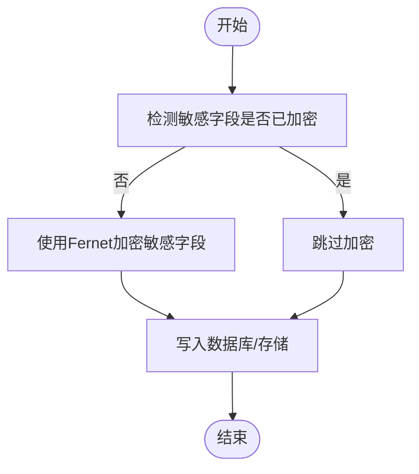
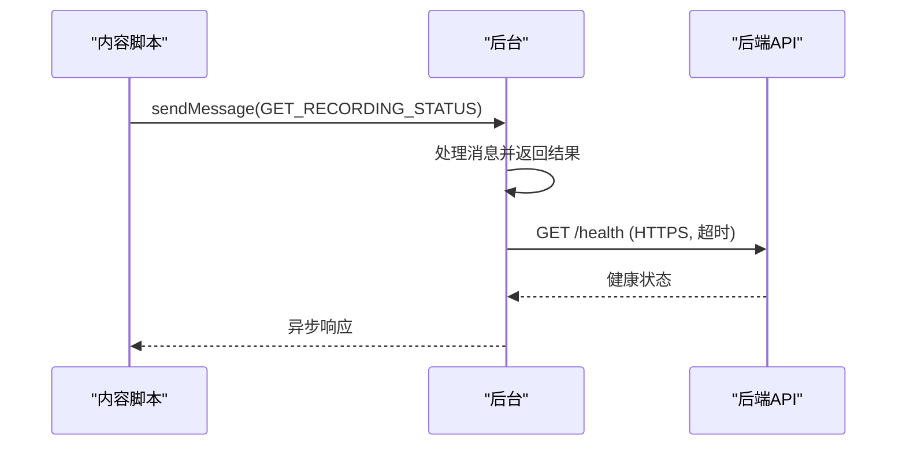
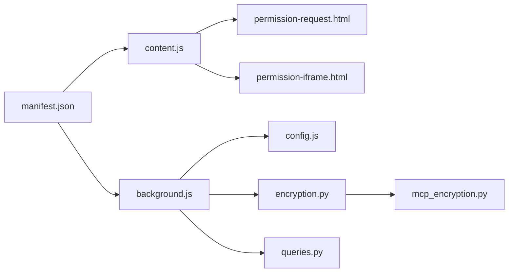

# 安全机制

<cite>
**本文引用的文件**
- [manifest.json](file://vibe_surf/chrome_extension/manifest.json)
- [background.js](file://vibe_surf/chrome_extension/background.js)
- [content.js](file://vibe_surf/chrome_extension/content.js)
- [permission-request.js](file://vibe_surf/chrome_extension/scripts/permission-request.js)
- [permission-iframe-request.js](file://vibe_surf/chrome_extension/scripts/permission-iframe-request.js)
- [permission-request.html](file://vibe_surf/chrome_extension/permission-request.html)
- [permission-iframe.html](file://vibe_surf/chrome_extension/permission-iframe.html)
- [config.js](file://vibe_surf/chrome_extension/config.js)
- [encryption.py](file://vibe_surf/backend/utils/encryption.py)
- [mcp_encryption.py](file://vibe_surf/langflow/services/auth/mcp_encryption.py)
- [queries.py](file://vibe_surf/backend/database/queries.py)
- [utils.py（认证工具）](file://vibe_surf/langflow/services/auth/utils.py)
- [vibe_surf_prompt.py](file://vibe_surf/agents/prompts/vibe_surf_prompt.py)
- [vibesurf_tools.py](file://vibe_surf/tools/vibesurf_tools.py)
</cite>

## 目录
1. [简介](#简介)
2. [项目结构](#项目结构)
3. [核心组件](#核心组件)
4. [架构总览](#架构总览)
5. [详细组件分析](#详细组件分析)
6. [依赖关系分析](#依赖关系分析)
7. [性能考量](#性能考量)
8. [故障排查指南](#故障排查指南)
9. [结论](#结论)
10. [附录](#附录)

## 简介
本文件系统性梳理 VibeSurf 浏览器扩展在安全方面的设计与实现，覆盖 manifest 权限声明与影响、运行时权限请求处理、沙箱隔离机制、数据隐私与加密、前后端通信安全、以及安全最佳实践与漏洞报告流程。目标是帮助开发者与用户理解并正确使用该扩展，降低安全风险。

## 项目结构
VibeSurf 的浏览器扩展位于 vibe_surf/chrome_extension 目录，核心文件包括：
- manifest.json：声明权限、主机权限、背景脚本、内容脚本与可被网页访问的资源
- background.js：后台服务工作线程，负责消息路由、侧边栏打开、剪贴板、通知、会话数据管理等
- content.js：内容脚本，在页面上下文中运行，负责事件捕获、注入隐藏 iframe 请求麦克风权限、与后台通信
- scripts/permission-*.js：权限请求页面与 iframe 内部脚本，用于触发浏览器标准权限弹窗并回传结果
- permission-request.html 与 permission-iframe.html：权限请求页面与隐藏 iframe 页面
- config.js：扩展配置（含后端地址、超时、重试等），供后台与内容脚本共享

```mermaid
graph TB
subgraph "浏览器扩展"
M["manifest.json"]
BG["background.js"]
CS["content.js"]
PR["permission-request.html<br/>scripts/permission-request.js"]
PI["permission-iframe.html<br/>scripts/permission-iframe-request.js"]
CFG["config.js"]
end
subgraph "浏览器"
TAB["当前标签页"]
EXT["扩展图标/侧边栏"]
end
M --> BG
M --> CS
CS <- --> BG
CS --> PR
CS --> PI
BG --> CFG
EXT --> BG
TAB --> CS
```

图表来源
- [manifest.json](file://vibe_surf/chrome_extension/manifest.json#L1-L70)
- [background.js](file://vibe_surf/chrome_extension/background.js#L1-L120)
- [content.js](file://vibe_surf/chrome_extension/content.js#L1-L120)
- [permission-request.html](file://vibe_surf/chrome_extension/permission-request.html#L1-L104)
- [permission-iframe.html](file://vibe_surf/chrome_extension/permission-iframe.html#L1-L38)
- [config.js](file://vibe_surf/chrome_extension/config.js#L1-L56)

章节来源
- [manifest.json](file://vibe_surf/chrome_extension/manifest.json#L1-L70)
- [background.js](file://vibe_surf/chrome_extension/background.js#L1-L120)
- [content.js](file://vibe_surf/chrome_extension/content.js#L1-L120)
- [config.js](file://vibe_surf/chrome_extension/config.js#L1-L56)

## 核心组件
- 权限声明与主机权限：通过 manifest.json 声明扩展所需权限与可访问的主机范围
- 运行时权限请求：通过 content.js 注入隐藏 iframe 或 permission-request.html 触发浏览器标准权限弹窗，并将结果回传至后台
- 后台消息处理：background.js 统一处理来自内容脚本、侧边栏与扩展 UI 的消息，执行剪贴板、通知、会话数据等操作
- 数据隐私与加密：后端对敏感凭据进行加密存储；扩展侧通过最小权限原则与严格输入校验降低风险
- 通信安全：通过 Chrome 扩展消息通道与 HTTPS 后端交互，结合超时与重试策略

章节来源
- [manifest.json](file://vibe_surf/chrome_extension/manifest.json#L1-L70)
- [permission-request.js](file://vibe_surf/chrome_extension/scripts/permission-request.js#L1-L118)
- [permission-iframe-request.js](file://vibe_surf/chrome_extension/scripts/permission-iframe-request.js#L1-L176)
- [background.js](file://vibe_surf/chrome_extension/background.js#L160-L298)
- [encryption.py](file://vibe_surf/backend/utils/encryption.py#L65-L128)
- [mcp_encryption.py](file://vibe_surf/langflow/services/auth/mcp_encryption.py#L1-L120)

## 架构总览
下图展示浏览器扩展与页面、后台服务之间的交互路径，以及权限请求的关键流程。



图表来源
- [content.js](file://vibe_surf/chrome_extension/content.js#L295-L414)
- [permission-iframe-request.js](file://vibe_surf/chrome_extension/scripts/permission-iframe-request.js#L1-L176)
- [permission-request.html](file://vibe_surf/chrome_extension/permission-request.html#L1-L104)
- [background.js](file://vibe_surf/chrome_extension/background.js#L160-L298)

## 详细组件分析

### 组件A：manifest.json 权限与主机权限
- 权限列表
  - activeTab：仅在用户交互时访问当前标签页信息
  - storage：本地持久化配置与会话数据
  - notifications：显示通知
  - sidePanel：打开侧边栏
  - contextMenus：备用打开方式
  - tabs：切换标签、创建新标签
  - clipboardWrite：写入剪贴板（需注入脚本）
  - scripting：向页面注入脚本
  - downloads：下载文件
- 主机权限
  - 包括 localhost/127.0.0.1 的 http/https 与 file 协议，以及 <all_urls> 允许跨站访问
- 影响与建议
  - <all_urls> 会扩大页面上下文的可访问范围，应配合最小权限原则与严格输入校验
  - 对 clipboardWrite 的使用需谨慎，避免在不受信任页面上执行

章节来源
- [manifest.json](file://vibe_surf/chrome_extension/manifest.json#L11-L29)
- [manifest.json](file://vibe_surf/chrome_extension/manifest.json#L34-L44)
- [manifest.json](file://vibe_surf/chrome_extension/manifest.json#L53-L69)

### 组件B：运行时权限请求处理（permission-request.js 与 permission-iframe-request.js）
- permission-request.js
  - 在独立页面中触发浏览器标准麦克风权限弹窗
  - 捕获错误类型并生成用户友好提示
  - 通过 chrome.runtime.sendMessage 将结果回传给扩展
- permission-iframe-request.js
  - 在隐藏 iframe 中请求麦克风权限
  - 使用 postMessage 将结果回传给父页面与扩展
  - 支持错误回传与调试日志
- content.js
  - 注入隐藏 iframe 并监听权限结果
  - 通过 postMessage 与 iframe 通信，再转发给后台



图表来源
- [content.js](file://vibe_surf/chrome_extension/content.js#L295-L414)
- [permission-iframe-request.js](file://vibe_surf/chrome_extension/scripts/permission-iframe-request.js#L1-L176)
- [permission-request.js](file://vibe_surf/chrome_extension/scripts/permission-request.js#L1-L118)

章节来源
- [permission-request.js](file://vibe_surf/chrome_extension/scripts/permission-request.js#L1-L118)
- [permission-iframe-request.js](file://vibe_surf/chrome_extension/scripts/permission-iframe-request.js#L1-L176)
- [content.js](file://vibe_surf/chrome_extension/content.js#L295-L414)

### 组件C：沙箱机制与隔离
- 内容脚本与页面上下文
  - content.js 在页面上下文中运行，具备 DOM 访问能力，但受同源策略限制
  - 通过隐藏 iframe 加载权限页面，iframe 与父页面同源，但权限弹窗由浏览器内核触发，形成“浏览器信任边界”
- 后台脚本与扩展 UI
  - background.js 运行于扩展作用域，拥有扩展权限，但不直接访问页面 DOM
  - 通过消息通道与内容脚本通信，避免直接注入页面脚本
- 最小权限原则
  - manifest 仅声明必要权限；对 clipboardWrite、downloads 等高危权限，通过注入脚本或显式用户交互触发

章节来源
- [content.js](file://vibe_surf/chrome_extension/content.js#L1-L120)
- [manifest.json](file://vibe_surf/chrome_extension/manifest.json#L11-L29)

### 组件D：数据隐私与加密存储
- 后端凭据加密
  - 后端对敏感字段（如 API Key、OAuth Client Secret）进行对称加密存储
  - 使用机器/用户标识派生密钥，支持回退解密
- 扩展配置与本地存储
  - config.js 提供默认后端地址与超时参数
  - background.js 使用 chrome.storage.local 存储会话与设置，遵循最小持久化原则



图表来源
- [mcp_encryption.py](file://vibe_surf/langflow/services/auth/mcp_encryption.py#L1-L120)
- [encryption.py](file://vibe_surf/backend/utils/encryption.py#L65-L128)
- [queries.py](file://vibe_surf/backend/database/queries.py#L1367-L1405)

章节来源
- [encryption.py](file://vibe_surf/backend/utils/encryption.py#L65-L128)
- [mcp_encryption.py](file://vibe_surf/langflow/services/auth/mcp_encryption.py#L1-L120)
- [queries.py](file://vibe_surf/backend/database/queries.py#L1367-L1405)
- [config.js](file://vibe_surf/chrome_extension/config.js#L1-L56)

### 组件E：安全通信协议与消息完整性
- 扩展消息通道
  - content.js 与 background.js 通过 chrome.runtime.sendMessage/onMessage 通信
  - background.js 对消息类型进行分支处理，异步返回响应
- 后端连接
  - background.js 使用 HTTPS 访问后端健康检查接口，设置超时与重试
  - config.js 提供统一后端地址与超时配置



图表来源
- [content.js](file://vibe_surf/chrome_extension/content.js#L28-L42)
- [background.js](file://vibe_surf/chrome_extension/background.js#L160-L298)
- [config.js](file://vibe_surf/chrome_extension/config.js#L1-L56)

章节来源
- [content.js](file://vibe_surf/chrome_extension/content.js#L28-L42)
- [background.js](file://vibe_surf/chrome_extension/background.js#L160-L298)
- [config.js](file://vibe_surf/chrome_extension/config.js#L1-L56)

### 组件F：输入验证与最小权限原则
- 输入验证
  - 工具模块对用户代码执行进行关键字过滤，避免危险操作
  - 认证工具对密码字段进行专用处理与校验
- 最小权限原则
  - manifest 权限按需申请；clipboardWrite 仅在注入脚本后使用
  - 对 file:// URL 的打开尝试采用降级方案，避免直接系统命令

章节来源
- [vibesurf_tools.py](file://vibe_surf/tools/vibesurf_tools.py#L1052-L1077)
- [utils.py（认证工具）](file://vibe_surf/langflow/services/auth/utils.py#L288-L311)
- [background.js](file://vibe_surf/chrome_extension/background.js#L634-L695)

## 依赖关系分析
- manifest.json 为入口，决定扩展的权限与资源暴露范围
- background.js 作为消息中枢，依赖 content.js 与扩展 UI
- content.js 依赖隐藏 iframe 与权限请求页面，实现浏览器标准权限弹窗
- config.js 为全局配置源，被 background.js 与扩展 UI 共享
- 后端加密模块与数据库查询模块共同保障凭据安全



图表来源
- [manifest.json](file://vibe_surf/chrome_extension/manifest.json#L1-L70)
- [background.js](file://vibe_surf/chrome_extension/background.js#L1-L120)
- [content.js](file://vibe_surf/chrome_extension/content.js#L1-L120)
- [permission-request.html](file://vibe_surf/chrome_extension/permission-request.html#L1-L104)
- [permission-iframe.html](file://vibe_surf/chrome_extension/permission-iframe.html#L1-L38)
- [config.js](file://vibe_surf/chrome_extension/config.js#L1-L56)
- [encryption.py](file://vibe_surf/backend/utils/encryption.py#L65-L128)
- [mcp_encryption.py](file://vibe_surf/langflow/services/auth/mcp_encryption.py#L1-L120)
- [queries.py](file://vibe_surf/backend/database/queries.py#L1367-L1405)

章节来源
- [manifest.json](file://vibe_surf/chrome_extension/manifest.json#L1-L70)
- [background.js](file://vibe_surf/chrome_extension/background.js#L1-L120)
- [content.js](file://vibe_surf/chrome_extension/content.js#L1-L120)
- [config.js](file://vibe_surf/chrome_extension/config.js#L1-L56)

## 性能考量
- 权限请求超时控制：隐藏 iframe 注入与权限弹窗均设置超时，避免长时间阻塞
- 消息处理异步化：background.js 对长耗时任务（如剪贴板、文件系统）采用异步响应，保持 UI 流畅
- 会话数据上限：后台对会话列表进行截断清理，避免存储膨胀

章节来源
- [content.js](file://vibe_surf/chrome_extension/content.js#L327-L366)
- [background.js](file://vibe_surf/chrome_extension/background.js#L488-L562)

## 故障排查指南
- 权限未授予
  - 检查 content.js 是否成功注入隐藏 iframe
  - 查看 permission-iframe-request.js 的 postMessage 与错误回传
  - 确认浏览器地址栏麦克风图标状态与用户选择
- 通知失败
  - background.js 对通知图标回退处理，若失败则改为空图标重试
- 后端连接异常
  - 使用健康检查接口确认后端可达性与超时设置
  - 检查 config.js 中的后端地址与超时配置

章节来源
- [content.js](file://vibe_surf/chrome_extension/content.js#L327-L414)
- [permission-iframe-request.js](file://vibe_surf/chrome_extension/scripts/permission-iframe-request.js#L115-L166)
- [background.js](file://vibe_surf/chrome_extension/background.js#L392-L435)
- [background.js](file://vibe_surf/chrome_extension/background.js#L451-L486)
- [config.js](file://vibe_surf/chrome_extension/config.js#L1-L56)

## 结论
VibeSurf 在浏览器扩展层面遵循最小权限原则，通过隐藏 iframe 与标准权限弹窗实现安全的运行时权限获取；后台通过 HTTPS 与超时策略保障与后端通信安全；后端对敏感凭据进行对称加密存储，提升数据隐私保护水平。建议在生产环境中持续审查权限清单、强化输入校验与错误处理，并建立规范的漏洞报告流程。

## 附录

### 安全最佳实践
- 权限最小化：仅在必要时请求权限，避免一次性申请过多权限
- 输入校验：对用户输入与外部数据进行严格校验与过滤
- 通信加密：始终使用 HTTPS 与安全上下文
- 会话与存储：限制本地持久化数据量，定期清理过期数据
- 错误处理：对权限与网络异常提供清晰的用户提示与回退路径

### 安全审计与漏洞报告流程
- 社区与问题反馈
  - 项目提供了 GitHub Issues 链接用于报告问题与缺陷
- 安全问题上报建议
  - 通过 Issues 提交安全相关问题，描述复现步骤与影响范围
  - 如涉及敏感信息，请在提交前脱敏或私下沟通

章节来源
- [config.js](file://vibe_surf/chrome_extension/config.js#L31-L42)
- [vibe_surf_prompt.py](file://vibe_surf/agents/prompts/vibe_surf_prompt.py#L139-L143)