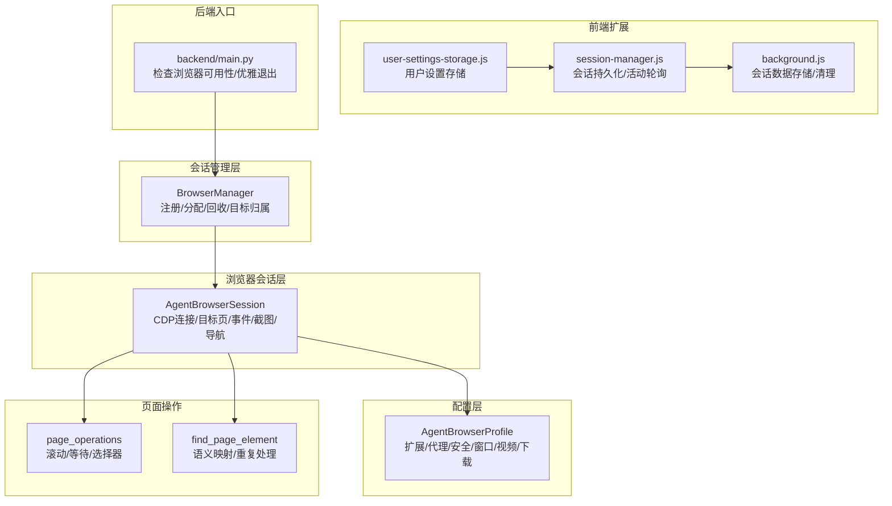
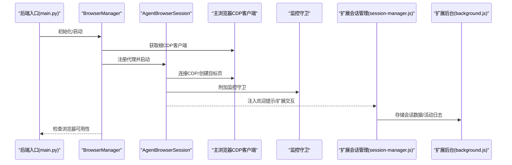
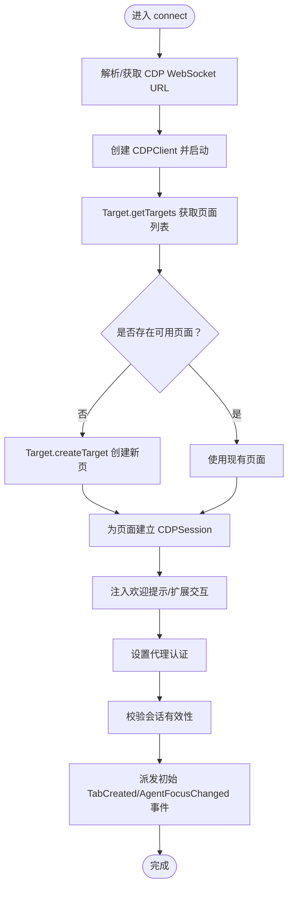
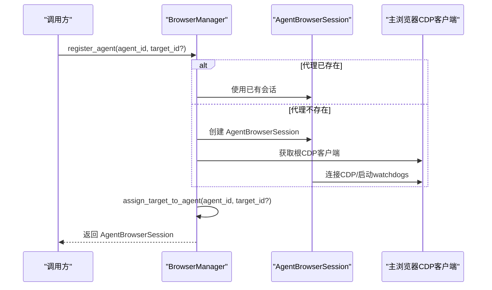
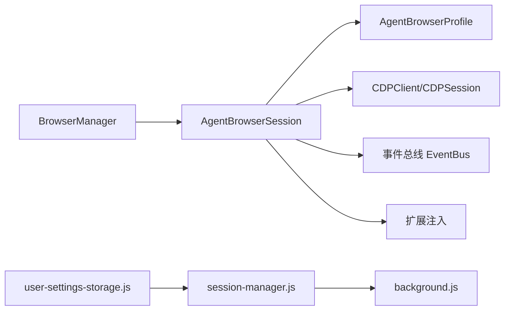

# 会话管理

<cite>
**本文引用的文件**
- [agent_browser_session.py](file://vibe_surf/browser/agent_browser_session.py)
- [browser_manager.py](file://vibe_surf/browser/browser_manager.py)
- [agen_browser_profile.py](file://vibe_surf/browser/agen_browser_profile.py)
- [page_operations.py](file://vibe_surf/browser/page_operations.py)
- [find_page_element.py](file://vibe_surf/browser/find_page_element.py)
- [main.py](file://vibe_surf/backend/main.py)
- [session-manager.js](file://vibe_surf/chrome_extension/scripts/session-manager.js)
- [background.js](file://vibe_surf/chrome_extension/background.js)
- [user-settings-storage.js](file://vibe_surf/chrome_extension/scripts/user-settings-storage.js)
</cite>

## 目录
1. [简介](#简介)
2. [项目结构](#项目结构)
3. [核心组件](#核心组件)
4. [架构总览](#架构总览)
5. [组件详解](#组件详解)
6. [依赖关系分析](#依赖关系分析)
7. [性能与优化](#性能与优化)
8. [故障排查指南](#故障排查指南)
9. [结论](#结论)

## 简介
本文件系统性文档化 VibeSurf 的浏览器会话管理系统，重点覆盖以下方面：
- 会话生命周期：创建、维护、销毁
- 会话状态管理与事件驱动机制
- 多会话协调与会话池管理
- 会话隔离与安全边界
- 超时与清理策略（含空闲回收）
- 错误恢复（网络中断后的重建）
- 配置项：用户代理、Cookie、缓存、扩展等
- 性能优化建议：连接池、会话预热

## 项目结构
围绕浏览器会话管理的关键模块如下：
- 浏览器会话层：AgentBrowserSession（继承自 BrowserSession，负责 CDP 连接、目标页管理、事件处理、截图导航等）
- 会话管理层：BrowserManager（集中注册/分配/回收 AgentBrowserSession，维护目标页归属）
- 浏览器配置层：AgentBrowserProfile（扩展默认浏览器参数，启用扩展、代理、安全策略等）
- 页面操作工具：page_operations、find_page_element（元素定位、滚动、等待、语义提取）
- 前端扩展：Chrome 扩展脚本（会话持久化、活动轮询、存储清理）

图表来源
- [agent_browser_session.py](file://vibe_surf/browser/agent_browser_session.py#L1-L120)
- [browser_manager.py](file://vibe_surf/browser/browser_manager.py#L1-L120)
- [agen_browser_profile.py](file://vibe_surf/browser/agen_browser_profile.py#L1-L137)
- [page_operations.py](file://vibe_surf/browser/page_operations.py#L1-L120)
- [find_page_element.py](file://vibe_surf/browser/find_page_element.py#L1-L120)
- [session-manager.js](file://vibe_surf/chrome_extension/scripts/session-manager.js#L1-L120)
- [background.js](file://vibe_surf/chrome_extension/background.js#L488-L519)
- [user-settings-storage.js](file://vibe_surf/chrome_extension/scripts/user-settings-storage.js#L129-L194)
- [main.py](file://vibe_surf/backend/main.py#L109-L137)

章节来源
- [agent_browser_session.py](file://vibe_surf/browser/agent_browser_session.py#L1-L120)
- [browser_manager.py](file://vibe_surf/browser/browser_manager.py#L1-L120)
- [agen_browser_profile.py](file://vibe_surf/browser/agen_browser_profile.py#L1-L137)

## 核心组件
- AgentBrowserSession
  - 负责与 Chromium DevTools Protocol (CDP) 建立连接，管理目标页（tab）与会话池，派发/订阅事件，执行导航、截图、DOM 提取等操作。
  - 关键能力：connect/connect_agent/disconnect_agent、get_or_create_cdp_session、navigate_to_url、take_screenshot、get_tabs、attach_all_watchdogs 等。
- BrowserManager
  - 统一持有主浏览器会话的根 CDP 客户端，为每个代理注册独立 AgentBrowserSession，分配/回收目标页，查询目标归属，关闭时可选择关闭对应标签页。
- AgentBrowserProfile
  - 在 BrowserProfile 基础上扩展自定义扩展加载、代理、窗口尺寸/位置、视频/下载、安全策略等，支持扩展参数拼装与缓存。

章节来源
- [agent_browser_session.py](file://vibe_surf/browser/agent_browser_session.py#L51-L123)
- [browser_manager.py](file://vibe_surf/browser/browser_manager.py#L24-L122)
- [agen_browser_profile.py](file://vibe_surf/browser/agen_browser_profile.py#L24-L137)

## 架构总览
下图展示从后端到前端扩展的会话管理链路，以及会话在多代理场景下的隔离与复用。

图表来源
- [main.py](file://vibe_surf/backend/main.py#L109-L137)
- [browser_manager.py](file://vibe_surf/browser/browser_manager.py#L24-L122)
- [agent_browser_session.py](file://vibe_surf/browser/agent_browser_session.py#L171-L210)
- [session-manager.js](file://vibe_surf/chrome_extension/scripts/session-manager.js#L1-L120)
- [background.js](file://vibe_surf/chrome_extension/background.js#L488-L519)

## 组件详解

### AgentBrowserSession 生命周期与状态管理
- 创建与连接
  - connect：解析/获取 CDP WebSocket 地址，建立 CDPClient，自动挂载 Target.setAutoAttach，查找可用页面或创建新页，建立 CDPSession 并注入欢迎提示，设置代理认证，校验会话有效性。
  - connect_agent/unassign_target：按目标 ID 将代理绑定到指定目标页，或断开该目标页的会话。
  - disconnect_agent：断开所有代理相关 CDP 会话并清空会话池。
- 会话池与目标页
  - get_or_create_cdp_session：按目标 ID 获取或创建会话；支持切换 agent_focus；记录 _cdp_session_pool。
  - _cdp_get_all_pages：过滤有效页面（排除 iframe/worker/扩展等），支持仅返回已分配目标。
  - get_tabs：使用 Target.getTargetInfo 快速获取标题，兼容 PDF/新标签页标题回退。
- 事件与监控
  - model_post_init：注册事件处理器（开始/停止/导航/切换/标签创建/关闭/焦点变化/关闭标签等），防止重复注册。
  - attach_all_watchdogs：附加本地浏览器、安全、弹窗、动作、截图、DOM 等监控守卫；显式排除 AboutBlankWatchdog。
- 导航与截图
  - navigate_to_url：最小化事件开销的并发导航，直接调用 Page.navigate，必要时激活目标并派发完成事件。
  - take_screenshot/take_screenshot_base64：直接调用 Page.captureScreenshot，等待页面稳定后再截图，支持裁剪与质量控制。
- DOM 与页面操作
  - get_html_content：通过 DOM.getDocument/getOuterHTML 提取当前页 HTML。
  - page_operations/find_page_element：滚动到文本、等待元素、生成语义选择器、处理重复文本与上下文，用于高可靠自动化。

图表来源
- [agent_browser_session.py](file://vibe_surf/browser/agent_browser_session.py#L171-L210)
- [agent_browser_session.py](file://vibe_surf/browser/agent_browser_session.py#L696-L711)
- [agent_browser_session.py](file://vibe_surf/browser/agent_browser_session.py#L713-L719)
- [agent_browser_session.py](file://vibe_surf/browser/agent_browser_session.py#L720-L769)
- [agent_browser_session.py](file://vibe_surf/browser/agent_browser_session.py#L771-L865)

章节来源
- [agent_browser_session.py](file://vibe_surf/browser/agent_browser_session.py#L171-L210)
- [agent_browser_session.py](file://vibe_surf/browser/agent_browser_session.py#L696-L719)
- [agent_browser_session.py](file://vibe_surf/browser/agent_browser_session.py#L720-L865)
- [page_operations.py](file://vibe_surf/browser/page_operations.py#L1-L120)
- [find_page_element.py](file://vibe_surf/browser/find_page_element.py#L211-L260)

### BrowserManager 协调与会话池管理
- 注册与分配
  - register_agent：若代理未注册则创建 AgentBrowserSession，共享主会话的根 CDP 客户端，启动 watchdogs；随后分配目标页（若未指定则创建）。
  - assign_target_to_agent：验证目标归属，避免跨代理抢占；若未提供目标则创建新目标并绑定。
  - unassign_target：断开目标页对应的 CDP 会话。
- 回收与清理
  - unregister_agent：可选关闭该代理的所有目标页，断开其 CDP 会话并停止会话。
  - close：批量注销所有代理并可选择关闭其标签页。
- 查询与归属
  - get_agent_target_ids/get_target_owner：查询代理的目标页集合与目标页归属。
  - get_all_tabs/get_activate_tab/_get_active_target：聚合所有标签信息，检测可见且聚焦的页面，必要时创建新页。
- 可用性检查
  - check_browser_connected：通过 Target.getTargets 判断主浏览器是否可用。

图表来源
- [browser_manager.py](file://vibe_surf/browser/browser_manager.py#L47-L107)

章节来源
- [browser_manager.py](file://vibe_surf/browser/browser_manager.py#L47-L107)
- [browser_manager.py](file://vibe_surf/browser/browser_manager.py#L108-L178)
- [browser_manager.py](file://vibe_surf/browser/browser_manager.py#L160-L269)

### 会话隔离机制
- 目标页隔离
  - 每个代理拥有独立的 AgentBrowserSession，内部维护 _cdp_session_pool，仅对分配给该代理的目标页生效。
  - assign_target_to_agent 明确检查目标页归属，防止跨代理占用。
- 事件隔离
  - model_post_init 中注册事件处理器，避免重复注册导致的跨代理事件污染。
- 安全边界
  - attach_all_watchdogs 中的安全守卫限制 allowed_domains，结合代理敏感数据策略，降低跨域风险。
  - AgentBrowserProfile 支持禁用安全、确定性渲染、代理设置、窗口/视频/下载等，便于在受控环境中运行。

章节来源
- [agent_browser_session.py](file://vibe_surf/browser/agent_browser_session.py#L771-L865)
- [browser_manager.py](file://vibe_surf/browser/browser_manager.py#L74-L107)
- [agen_browser_profile.py](file://vibe_surf/browser/agen_browser_profile.py#L24-L137)

### 会话超时与清理策略
- 主动清理
  - unregister_agent/close：注销代理时可选择关闭其所有目标页，断开 CDP 会话并停止会话，避免资源泄漏。
  - unassign_target：断开单个目标页的会话。
- 可用性检查
  - check_browser_connected：通过 Target.getTargets 判断主浏览器是否可用，不可用时触发后端优雅退出流程。
- 前端扩展清理
  - background.js 中 storeSessionData 仅保留最近 50 个会话数据，超出阈值自动清理旧会话键，避免本地存储膨胀。

章节来源
- [browser_manager.py](file://vibe_surf/browser/browser_manager.py#L123-L178)
- [main.py](file://vibe_surf/backend/main.py#L109-L137)
- [background.js](file://vibe_surf/chrome_extension/background.js#L488-L519)

### 错误恢复与网络中断重建
- CDP 连接失败
  - connect 中若无法建立 CDP 连接，记录致命错误并清理部分状态后抛出异常，确保会话不可用。
- 会话重建
  - register_agent 会在需要时重新获取主会话的根 CDP 客户端并启动 AgentBrowserSession，从而实现会话重建。
- 前端活动轮询与同步
  - session-manager.js 支持轮询活动日志、同步缺失日志、错误事件上报，有助于在网络中断后恢复状态。

章节来源
- [agent_browser_session.py](file://vibe_surf/browser/agent_browser_session.py#L171-L210)
- [browser_manager.py](file://vibe_surf/browser/browser_manager.py#L38-L46)
- [session-manager.js](file://vibe_surf/chrome_extension/scripts/session-manager.js#L453-L591)

### 会话配置选项
- 用户代理与环境
  - user_agent、headers、env、executable_path、channel、devtools、headless、args、ignore_default_args 等来自 BrowserProfile/launch/context/new_context/persistent_context。
- 安全与隔离
  - disable_security、allowed_domains、keep_alive、window_size/window_position、deterministic_rendering 等。
- 扩展与代理
  - enable_default_extensions、custom_extensions、proxy/proxy.auth、use_cloud/cloud_browser。
- 下载与录制
  - accept_downloads、downloads_path、record_har_content/mode/path、record_video_dir/fps/size。
- DOM/元素提取
  - cross_origin_iframes、highlight_elements/dom_highlight_elements、paint_order_filtering、max_iframes/max_iframe_depth。
- Cookie 白名单
  - cookie_whitelist_domains（用于白名单域名的 Cookie 管理）。

章节来源
- [agent_browser_session.py](file://vibe_surf/browser/agent_browser_session.py#L54-L123)
- [agen_browser_profile.py](file://vibe_surf/browser/agen_browser_profile.py#L24-L137)

### 会话复用策略
- 目标页复用
  - get_or_create_cdp_session：若目标页已在会话池中，直接复用；否则按需创建并加入池；支持切换 agent_focus。
- 会话池容量
  - 代码未显式限制池大小，但通过目标页唯一性避免重复创建；实际并发可通过合理分配目标页与复用策略控制。
- 会话预热
  - register_agent 时即启动 watchdogs 并连接 CDP，属于“会话预热”行为；后续 assign_target_to_agent 可快速复用。

章节来源
- [agent_browser_session.py](file://vibe_surf/browser/agent_browser_session.py#L1065-L1127)
- [browser_manager.py](file://vibe_surf/browser/browser_manager.py#L47-L107)

## 依赖关系分析
- 组件耦合
  - BrowserManager 强依赖主浏览器会话的根 CDP 客户端，AgentBrowserSession 依赖 BrowserProfile 的参数与扩展配置。
  - AgentBrowserSession 内部通过事件总线与监控守卫解耦，降低耦合度。
- 外部依赖
  - CDP 协议（browser_use）、事件总线（bubus）、扩展注入（chrome_extension）。
- 循环依赖
  - 未发现循环导入；模块间通过接口与事件进行通信。

图表来源
- [browser_manager.py](file://vibe_surf/browser/browser_manager.py#L1-L122)
- [agent_browser_session.py](file://vibe_surf/browser/agent_browser_session.py#L1-L120)
- [agen_browser_profile.py](file://vibe_surf/browser/agen_browser_profile.py#L1-L137)
- [session-manager.js](file://vibe_surf/chrome_extension/scripts/session-manager.js#L1-L120)
- [background.js](file://vibe_surf/chrome_extension/background.js#L488-L519)
- [user-settings-storage.js](file://vibe_surf/chrome_extension/scripts/user-settings-storage.js#L129-L194)

章节来源
- [browser_manager.py](file://vibe_surf/browser/browser_manager.py#L1-L122)
- [agent_browser_session.py](file://vibe_surf/browser/agent_browser_session.py#L1-L120)
- [agen_browser_profile.py](file://vibe_surf/browser/agen_browser_profile.py#L1-L137)

## 性能与优化
- 连接池与并发
  - 当前未显式配置浏览器连接池；通过复用 AgentBrowserSession 与 _cdp_session_pool 实现目标页级并发。
  - 建议：根据并发目标页数量与 CPU/内存资源，评估是否需要增加主浏览器进程数或拆分代理组以降低竞争。
- 导航与截图
  - navigate_to_url/take_screenshot 采用最小事件开销路径，减少串行瓶颈；建议在高频场景下批量调度并设置合理超时。
- DOM 提取与元素定位
  - find_page_element 的语义映射与 page_operations 的等待/滚动策略可提升稳定性；建议结合 allowed_domains 与 DOM 过滤参数减少无关节点扫描。
- 前端存储与轮询
  - session-manager.js 的轮询频率与后台存储清理策略可按业务需求调整；注意避免频繁写入导致扩展存储压力。

章节来源
- [agent_browser_session.py](file://vibe_surf/browser/agent_browser_session.py#L875-L942)
- [agent_browser_session.py](file://vibe_surf/browser/agent_browser_session.py#L958-L1064)
- [find_page_element.py](file://vibe_surf/browser/find_page_element.py#L211-L260)
- [page_operations.py](file://vibe_surf/browser/page_operations.py#L1-L120)
- [session-manager.js](file://vibe_surf/chrome_extension/scripts/session-manager.js#L453-L591)

## 故障排查指南
- CDP 连接失败
  - 症状：connect 抛出致命错误，会话不可用。
  - 排查：确认 CDP URL 是否正确、HTTP/WS 端点可达、代理认证配置、浏览器版本兼容性。
- 会话不可见/无焦点
  - 症状：导航/截图无效。
  - 排查：使用 get_or_create_cdp_session 的 focus 参数切换焦点；通过 get_tabs 获取可见页面。
- 目标页被其他代理占用
  - 症状：assign_target_to_agent 返回失败。
  - 排查：使用 get_target_owner 查询归属；释放目标页或更换目标。
- 浏览器不可用
  - 症状：check_browser_connected 返回 False，后端触发优雅退出。
  - 排查：重启主浏览器进程，确保扩展已加载，重试注册代理。
- 前端扩展存储溢出
  - 症状：本地存储增长过快。
  - 排查：background.js 已限制最近 50 个会话，必要时手动清理历史会话键。

章节来源
- [agent_browser_session.py](file://vibe_surf/browser/agent_browser_session.py#L171-L210)
- [browser_manager.py](file://vibe_surf/browser/browser_manager.py#L168-L202)
- [background.js](file://vibe_surf/chrome_extension/background.js#L488-L519)
- [main.py](file://vibe_surf/backend/main.py#L109-L137)

## 结论
VibeSurf 的会话管理体系通过 AgentBrowserSession 与 BrowserManager 的协作，实现了：
- 明确的会话生命周期与事件驱动状态机
- 多代理隔离与目标页归属控制
- 最小化事件开销的导航/截图路径
- 前端扩展的会话持久化与活动轮询
- 可用性检查与清理策略

建议在生产环境中结合 allowed_domains、扩展与代理配置强化安全边界，并根据并发与资源情况优化目标页分配与轮询策略。