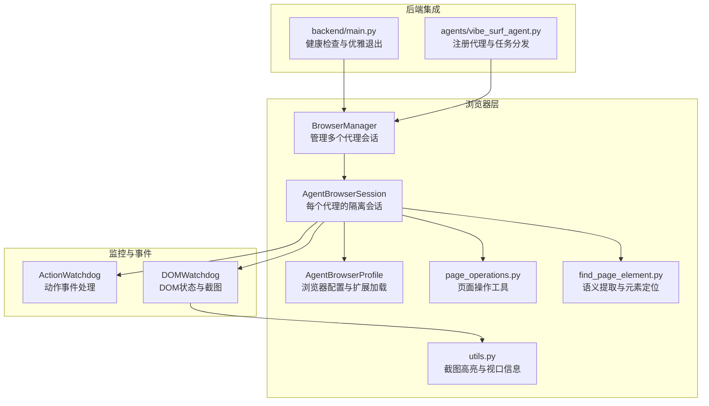
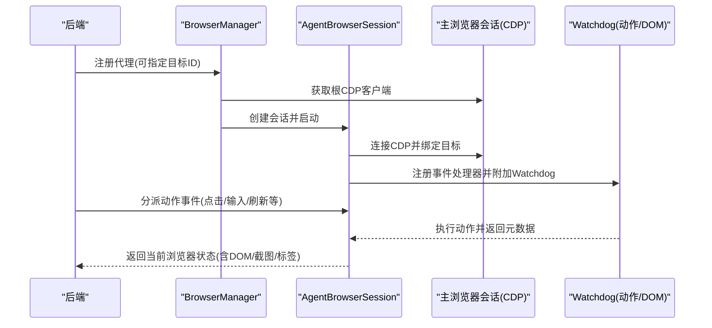
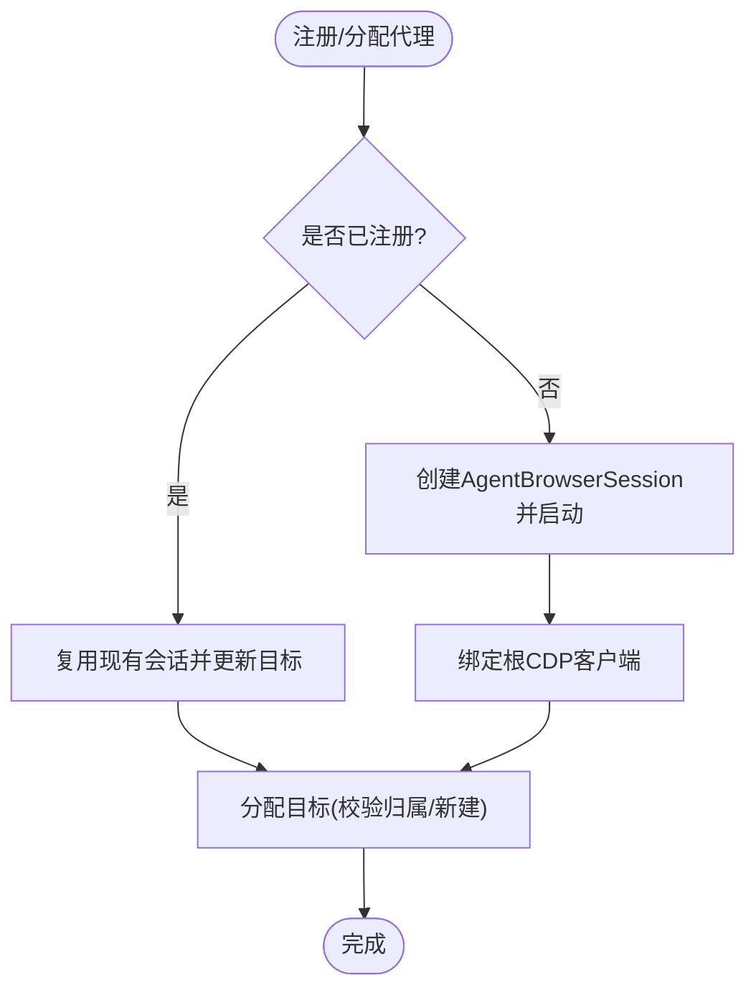
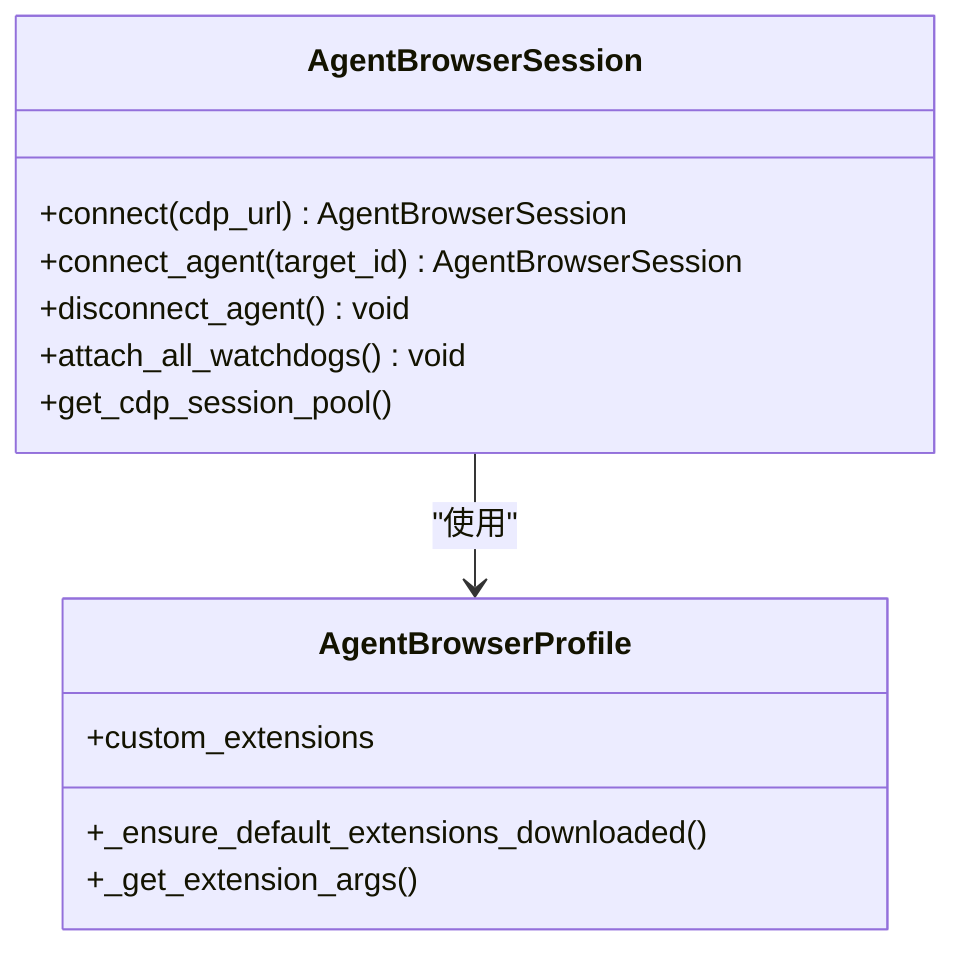
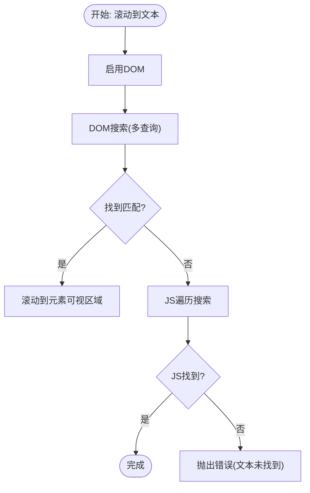
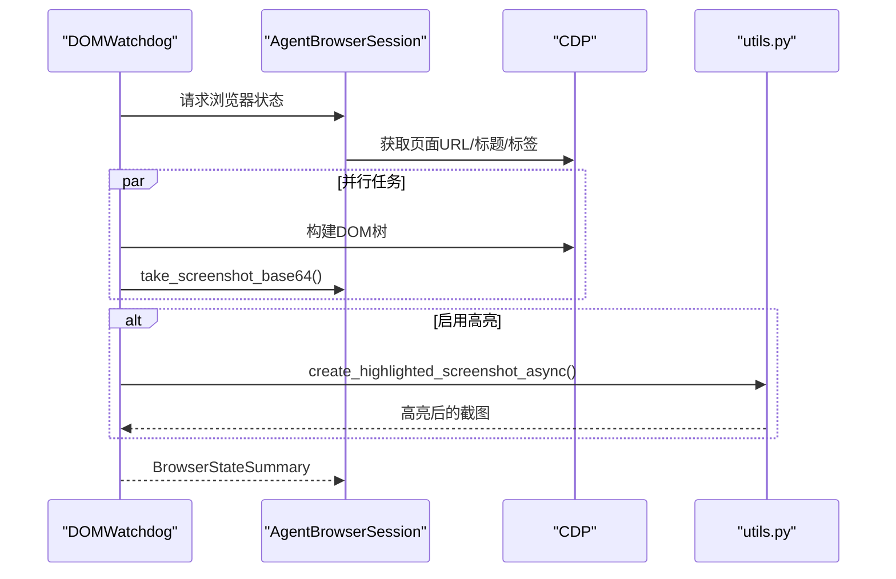
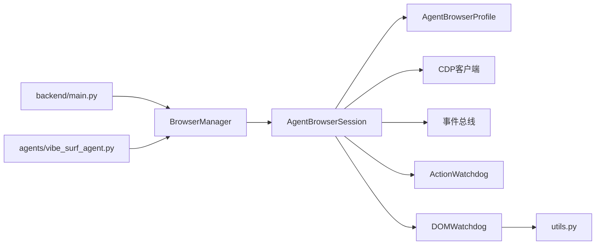

# 浏览器管理

<cite>
**本文引用的文件**
- [browser_manager.py](file://vibe_surf/browser/browser_manager.py)
- [agent_browser_session.py](file://vibe_surf/browser/agent_browser_session.py)
- [page_operations.py](file://vibe_surf/browser/page_operations.py)
- [agen_browser_profile.py](file://vibe_surf/browser/agen_browser_profile.py)
- [utils.py](file://vibe_surf/browser/utils.py)
- [find_page_element.py](file://vibe_surf/browser/find_page_element.py)
- [action_watchdog.py](file://vibe_surf/browser/watchdogs/action_watchdog.py)
- [dom_watchdog.py](file://vibe_surf/browser/watchdogs/dom_watchdog.py)
- [main.py](file://vibe_surf/backend/main.py)
- [vibe_surf_agent.py](file://vibe_surf/agents/vibe_surf_agent.py)
</cite>

## 目录
1. [简介](#简介)
2. [项目结构](#项目结构)
3. [核心组件](#核心组件)
4. [架构总览](#架构总览)
5. [详细组件分析](#详细组件分析)
6. [依赖关系分析](#依赖关系分析)
7. [性能考虑](#性能考虑)
8. [故障排查指南](#故障排查指南)
9. [结论](#结论)

## 简介
本文件系统性文档化 VibeSurf 的浏览器管理系统，重点覆盖以下方面：
- 浏览器管理器如何协调多个代理（Agent）的浏览器实例与会话
- 会话生命周期管理（创建、维护、销毁）
- 页面操作能力（导航、刷新、滚动到文本、截图高亮等）
- 浏览器资源监控（内存与 CPU 使用跟踪思路）
- 多标签管理策略（并发与资源竞争处理）
- 错误处理与恢复机制（页面崩溃后的自动重启思路）
- 性能调优建议（连接池与会话复用）

## 项目结构
浏览器管理相关代码主要位于 vibe_surf/browser 目录，围绕“共享主浏览器会话 + 每个代理独立的 AgentBrowserSession”的模式组织，配合 Watchdog 完成事件驱动的自动化与状态采集。

图表来源
- [browser_manager.py](file://vibe_surf/browser/browser_manager.py#L1-L180)
- [agent_browser_session.py](file://vibe_surf/browser/agent_browser_session.py#L1-L120)
- [agen_browser_profile.py](file://vibe_surf/browser/agen_browser_profile.py#L1-L60)
- [utils.py](file://vibe_surf/browser/utils.py#L666-L786)
- [page_operations.py](file://vibe_surf/browser/page_operations.py#L1-L120)
- [find_page_element.py](file://vibe_surf/browser/find_page_element.py#L1-L120)
- [action_watchdog.py](file://vibe_surf/browser/watchdogs/action_watchdog.py#L1-L60)
- [dom_watchdog.py](file://vibe_surf/browser/watchdogs/dom_watchdog.py#L1-L120)
- [main.py](file://vibe_surf/backend/main.py#L109-L137)
- [vibe_surf_agent.py](file://vibe_surf/agents/vibe_surf_agent.py#L611-L650)

章节来源
- [browser_manager.py](file://vibe_surf/browser/browser_manager.py#L1-L180)
- [agent_browser_session.py](file://vibe_surf/browser/agent_browser_session.py#L1-L120)

## 核心组件
- 浏览器管理器（BrowserManager）
  - 负责注册/分配/回收代理的浏览器目标（Tab），并持有共享主浏览器会话的根 CDP 客户端
  - 提供活跃代理列表、目标归属查询、活动标签检测、全量标签获取等能力
- 代理浏览器会话（AgentBrowserSession）
  - 基于 BrowserSession 的子类，为每个代理提供隔离上下文
  - 负责 CDP 连接、目标绑定、会话池管理、事件处理器注册、Watchdog 初始化
- 代理浏览器配置（AgentBrowserProfile）
  - 扩展默认浏览器参数，支持启用扩展、代理、窗口尺寸等
- 页面操作工具（page_operations.py）
  - 提供滚动到文本、基于 CSS/XPath 的元素等待与选择、文本查找等
- DOM/截图工具（utils.py）
  - 截图高亮（元素框选、标签绘制）、视口信息获取
- 元素语义提取（find_page_element.py）
  - 基于 JS 的交互元素提取，生成语义映射与层级选择器
- Watchdog
  - 动作 Watchdog（ActionWatchdog）：点击、输入、滚动、刷新等动作事件处理
  - DOM Watchdog（CustomDOMWatchdog）：并行构建 DOM 与截图，生成浏览器状态快照

章节来源
- [browser_manager.py](file://vibe_surf/browser/browser_manager.py#L1-L180)
- [agent_browser_session.py](file://vibe_surf/browser/agent_browser_session.py#L1-L200)
- [agen_browser_profile.py](file://vibe_surf/browser/agen_browser_profile.py#L1-L137)
- [page_operations.py](file://vibe_surf/browser/page_operations.py#L1-L120)
- [utils.py](file://vibe_surf/browser/utils.py#L666-L786)
- [find_page_element.py](file://vibe_surf/browser/find_page_element.py#L1-L120)
- [action_watchdog.py](file://vibe_surf/browser/watchdogs/action_watchdog.py#L1-L109)
- [dom_watchdog.py](file://vibe_surf/browser/watchdogs/dom_watchdog.py#L1-L120)

## 架构总览
下图展示从后端注册代理到浏览器会话建立、事件驱动执行与状态采集的整体流程。

图表来源
- [browser_manager.py](file://vibe_surf/browser/browser_manager.py#L47-L120)
- [agent_browser_session.py](file://vibe_surf/browser/agent_browser_session.py#L171-L260)
- [action_watchdog.py](file://vibe_surf/browser/watchdogs/action_watchdog.py#L1-L109)
- [dom_watchdog.py](file://vibe_surf/browser/watchdogs/dom_watchdog.py#L26-L120)

章节来源
- [browser_manager.py](file://vibe_surf/browser/browser_manager.py#L47-L120)
- [agent_browser_session.py](file://vibe_surf/browser/agent_browser_session.py#L171-L260)
- [action_watchdog.py](file://vibe_surf/browser/watchdogs/action_watchdog.py#L1-L109)
- [dom_watchdog.py](file://vibe_surf/browser/watchdogs/dom_watchdog.py#L26-L120)

## 详细组件分析

### 组件A：BrowserManager（多代理会话协调）
- 角色与职责
  - 维护每个代理的 AgentBrowserSession 实例
  - 通过共享主浏览器会话的根 CDP 客户端进行统一连接与目标管理
  - 提供注册/分配/反分配/注销代理的方法，以及活跃代理与目标查询
- 关键流程
  - 注册代理：若未注册则创建 AgentBrowserSession 并启动；若已存在则复用并更新目标
  - 分配目标：校验目标归属，避免跨代理抢占；若未指定则新建 chrome://newtab
  - 反分配目标：从代理会话池移除并断开对应 CDP 会话
  - 注销代理：关闭所有标签（可选）、断开代理 CDP、停止会话
  - 活动标签检测：通过 CDP Runtime.evaluate 判断可见性与焦点，回退到新建或首个标签
- 并发与安全
  - 目标归属校验防止越权分配
  - 会话池按 target_id 管理，断开时显式 pop 并 disconnect
- 异常处理
  - 关闭标签失败记录警告但不中断清理流程
  - 活动标签检测异常时回退到新建或首个标签

图表来源
- [browser_manager.py](file://vibe_surf/browser/browser_manager.py#L47-L120)

章节来源
- [browser_manager.py](file://vibe_surf/browser/browser_manager.py#L47-L120)
- [browser_manager.py](file://vibe_surf/browser/browser_manager.py#L123-L178)

### 组件B：AgentBrowserSession（会话生命周期）
- 角色与职责
  - 为单个代理提供隔离的浏览器会话，继承 BrowserSession 并扩展 AgentBrowserProfile
  - 负责 CDP 连接（支持 HTTP /json/version 自动转 WS）、目标绑定、会话池管理
  - 注册事件处理器并在 attach_all_watchdogs 中初始化各类 Watchdog
- 生命周期阶段
  - connect：解析 CDP URL、建立根 CDP 客户端、获取可用页面、注入欢迎模态、设置代理认证
  - connect_agent：为目标创建 CDPSession 并加入会话池
  - disconnect_agent：断开会话池内所有 CDP 会话并清空
  - attach_all_watchdogs：附加 LocalBrowserWatchdog、SecurityWatchdog、PopupsWatchdog、CustomActionWatchdog、ScreenshotWatchdog、CustomDOMWatchdog
- 安全与隔离
  - 通过 AgentBrowserProfile 控制扩展、代理、窗口尺寸等，确保代理间隔离
  - 事件处理器注册去重，避免重复绑定

图表来源
- [agent_browser_session.py](file://vibe_surf/browser/agent_browser_session.py#L171-L260)
- [agent_browser_session.py](file://vibe_surf/browser/agent_browser_session.py#L797-L865)
- [agen_browser_profile.py](file://vibe_surf/browser/agen_browser_profile.py#L1-L137)

章节来源
- [agent_browser_session.py](file://vibe_surf/browser/agent_browser_session.py#L171-L260)
- [agent_browser_session.py](file://vibe_surf/browser/agent_browser_session.py#L797-L865)
- [agen_browser_profile.py](file://vibe_surf/browser/agen_browser_profile.py#L1-L137)

### 组件C：页面操作（page_operations.py）
- 能力概览
  - 滚动到文本：先尝试 DOM 搜索，再回退到 JS 遍历，找不到抛出错误
  - 直接选择器尝试：对目标文本进行清洗与多种选择器组合尝试，支持可见性等待与严格模式提示
  - 元素等待：在超时时间内轮询 CSS 选择器，支持回退选择器与层级 nth-of-type
- 设计要点
  - 明确的错误路径与日志输出，便于定位问题
  - 对 XPath 的限制（CDP 不支持 XPath）进行显式跳过与告警

图表来源
- [page_operations.py](file://vibe_surf/browser/page_operations.py#L1-L120)

章节来源
- [page_operations.py](file://vibe_surf/browser/page_operations.py#L1-L120)

### 组件D：DOM/截图与高亮（utils.py + dom_watchdog.py）
- 截图高亮
  - 将交互元素的边界框绘制到截图上，支持多颜色、标签背景与文字绘制
  - 支持根据设备像素比与视口偏移进行坐标换算
- DOM 状态采集
  - 并行构建 DOM 与截图，减少等待时间
  - 在页面稳定后抓取标题、页面信息（滚动位置、视口大小等）
  - 出错时返回最小化恢复状态，保证系统可用性

图表来源
- [dom_watchdog.py](file://vibe_surf/browser/watchdogs/dom_watchdog.py#L26-L220)
- [utils.py](file://vibe_surf/browser/utils.py#L666-L786)

章节来源
- [dom_watchdog.py](file://vibe_surf/browser/watchdogs/dom_watchdog.py#L26-L220)
- [utils.py](file://vibe_surf/browser/utils.py#L666-L786)

### 组件E：动作处理（action_watchdog.py）
- 能力概览
  - 处理点击、输入、滚动、刷新、等待、上传文件等事件
  - 新标签打开检测：比较前后目标集合，自动切换焦点
  - 打印按钮特殊处理：优先生成 PDF，失败时回退点击
- 并发与稳定性
  - 在执行前检查会话存活（target_id 是否有效）
  - 对验证错误以字典形式返回，避免产生错误日志

章节来源
- [action_watchdog.py](file://vibe_surf/browser/watchdogs/action_watchdog.py#L1-L109)

### 组件F：元素语义提取（find_page_element.py）
- 能力概览
  - 基于 JS 的交互元素提取，生成包含标签、类型、角色、选择器、容器上下文、兄弟关系、交互提示等信息的映射
  - 支持日志导出用于调试
- 设计要点
  - 多种文本提取优先级与规范化
  - 层次化上下文与去重策略，提升选择器唯一性

章节来源
- [find_page_element.py](file://vibe_surf/browser/find_page_element.py#L1-L120)
- [find_page_element.py](file://vibe_surf/browser/find_page_element.py#L211-L300)

## 依赖关系分析
- 组件耦合
  - BrowserManager 依赖 AgentBrowserSession 与主浏览器会话的根 CDP 客户端
  - AgentBrowserSession 依赖 AgentBrowserProfile、CDP 客户端与事件总线
  - DOMWatchdog 依赖 AgentBrowserSession 的截图与 DOM 构建能力
  - ActionWatchdog 依赖 AgentBrowserSession 的页面与元素操作能力
- 外部依赖
  - CDP 客户端（cdp-use）、浏览器会话库（browser_use）
  - 后端健康检查与优雅退出逻辑（backend/main.py）
  - 代理注册与任务分发（agents/vibe_surf_agent.py）

图表来源
- [browser_manager.py](file://vibe_surf/browser/browser_manager.py#L1-L120)
- [agent_browser_session.py](file://vibe_surf/browser/agent_browser_session.py#L1-L120)
- [dom_watchdog.py](file://vibe_surf/browser/watchdogs/dom_watchdog.py#L1-L120)
- [action_watchdog.py](file://vibe_surf/browser/watchdogs/action_watchdog.py#L1-L60)
- [main.py](file://vibe_surf/backend/main.py#L109-L137)
- [vibe_surf_agent.py](file://vibe_surf/agents/vibe_surf_agent.py#L611-L650)

章节来源
- [browser_manager.py](file://vibe_surf/browser/browser_manager.py#L1-L120)
- [agent_browser_session.py](file://vibe_surf/browser/agent_browser_session.py#L1-L120)
- [dom_watchdog.py](file://vibe_surf/browser/watchdogs/dom_watchdog.py#L1-L120)
- [action_watchdog.py](file://vibe_surf/browser/watchdogs/action_watchdog.py#L1-L60)
- [main.py](file://vibe_surf/backend/main.py#L109-L137)
- [vibe_surf_agent.py](file://vibe_surf/agents/vibe_surf_agent.py#L611-L650)

## 性能考虑
- 连接池与会话复用
  - 通过 AgentBrowserSession 的会话池按 target_id 管理，避免频繁重建
  - 主浏览器会话提供根 CDP 客户端，减少重复握手成本
- 并行化
  - DOMWatchdog 并行执行 DOM 构建与截图捕获，缩短状态采集时间
- 资源控制
  - 通过 AgentBrowserProfile 控制窗口尺寸、设备像素比、扩展加载，降低资源占用
- I/O 优化
  - 截图高亮采用异步与缓存字体/路径，减少重复计算

章节来源
- [agent_browser_session.py](file://vibe_surf/browser/agent_browser_session.py#L797-L865)
- [dom_watchdog.py](file://vibe_surf/browser/watchdogs/dom_watchdog.py#L73-L120)
- [utils.py](file://vibe_surf/browser/utils.py#L666-L786)
- [agen_browser_profile.py](file://vibe_surf/browser/agen_browser_profile.py#L120-L137)

## 故障排查指南
- 浏览器不可用
  - 后端健康检查失败时触发优雅退出，避免僵尸进程
  - 排查点：CDP URL 可达性、WebSocket 地址解析、主浏览器是否启动
- 会话崩溃
  - ActionWatchdog 在执行前检查 agent_focus/target_id，崩溃时返回错误并记录
  - 建议：在上层捕获错误并触发会话重建流程
- 目标归属冲突
  - 分配目标时校验归属，跨代理分配会被拒绝
  - 排查点：确认 target_id 来源与归属者
- 页面无响应
  - DOMWatchdog 在页面不稳定时等待网络空闲，失败时返回最小化状态
  - 建议：增加重试与降级策略（如仅截图不构建 DOM）

章节来源
- [main.py](file://vibe_surf/backend/main.py#L109-L137)
- [action_watchdog.py](file://vibe_surf/browser/watchdogs/action_watchdog.py#L24-L40)
- [browser_manager.py](file://vibe_surf/browser/browser_manager.py#L74-L106)
- [dom_watchdog.py](file://vibe_surf/browser/watchdogs/dom_watchdog.py#L43-L66)

## 结论
VibeSurf 的浏览器管理以“共享主会话 + 代理隔离会话”为核心，结合 Watchdog 的事件驱动与状态采集，实现了多代理并发下的稳定与高效。通过会话池、并行化与配置化控制，系统在复杂网页场景下具备良好的鲁棒性与可扩展性。后续可在资源监控（内存/CPU）与自动重启策略上进一步完善，以应对更极端的运行环境。