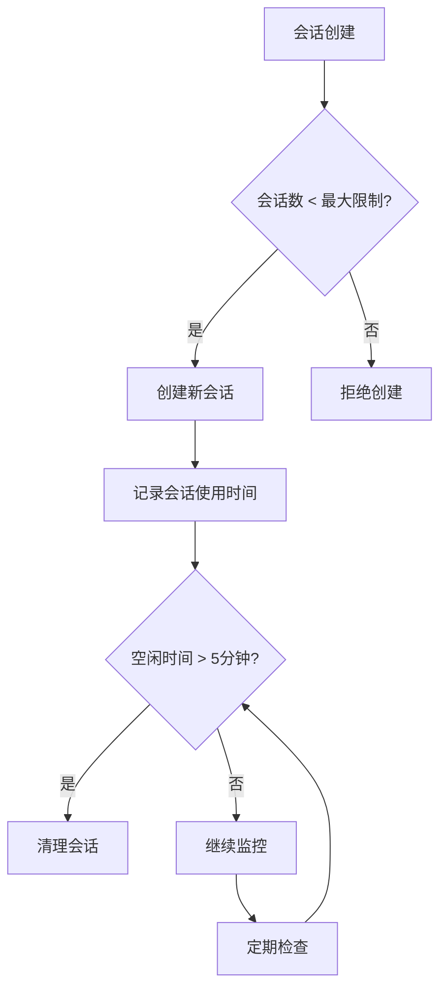
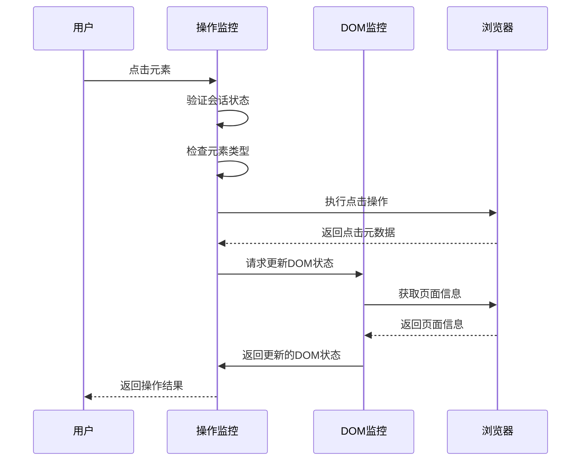
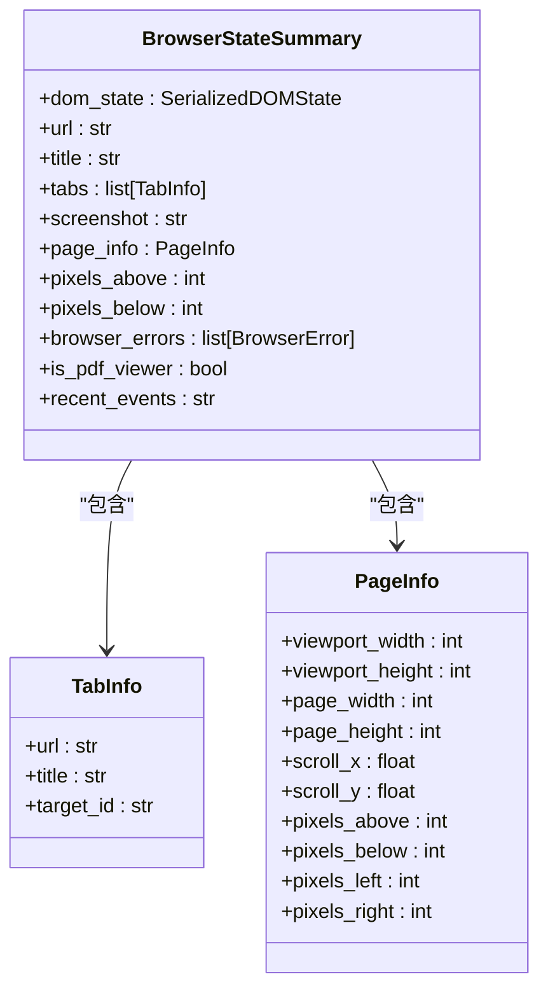
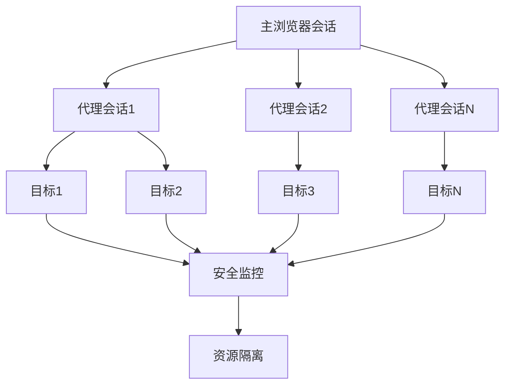
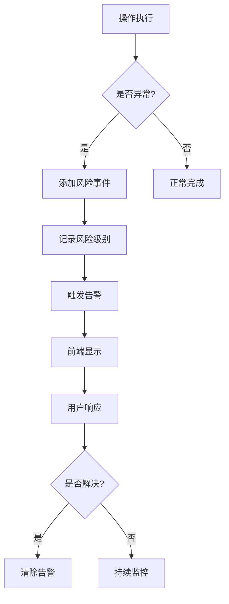

# 资源监控

<cite>
**本文档引用的文件**   
- [browser_manager.py](file://vibe_surf/browser/browser_manager.py)
- [agent_browser_session.py](file://vibe_surf/browser/agent_browser_session.py)
- [action_watchdog.py](file://vibe_surf/browser/watchdogs/action_watchdog.py)
- [dom_watchdog.py](file://vibe_surf/browser/watchdogs/dom_watchdog.py)
- [service.py](file://vibe_surf/telemetry/service.py)
- [base.py](file://vibe_surf/langflow/services/settings/base.py)
</cite>

## 目录
1. [引言](#引言)
2. [资源监控机制](#资源监控机制)
3. [资源限制策略](#资源限制策略)
4. [性能监控功能](#性能监控功能)
5. [资源使用报告](#资源使用报告)
6. [资源优化建议](#资源优化建议)
7. [资源隔离机制](#资源隔离机制)
8. [告警机制](#告警机制)
9. [结论](#结论)

## 引言
VibeSurf的浏览器资源监控系统旨在为多代理环境提供全面的资源管理和监控能力。该系统通过`browser_manager.py`中的`BrowserManager`类实现，为每个代理提供隔离的浏览器会话，并实施严格的安全和资源管理策略。系统监控关键指标如内存使用、CPU占用、网络带宽等，确保单个会话的资源消耗不会影响整体系统稳定性。通过集成的性能监控和告警机制，系统能够实时跟踪用户体验指标，并在资源使用超过预设阈值时触发通知。

## 资源监控机制
VibeSurf的浏览器资源监控系统通过`BrowserManager`类实现，该类管理多个代理的隔离浏览器会话。系统通过CDP（Chrome DevTools Protocol）客户端与浏览器进行通信，监控和管理各个会话的资源使用情况。`BrowserManager`维护一个代理会话字典`_agent_sessions`，每个代理都有一个唯一的`AgentBrowserSession`实例。系统通过`_root_cdp_client`获取共享的根CDP客户端，用于与浏览器进行底层通信。

资源监控的核心在于对浏览器目标（target）的管理和监控。系统通过`get_all_tabs`方法获取所有标签页信息，包括URL、标题和目标ID。`get_activate_tab`方法用于获取当前活动标签页的信息，通过检查页面的焦点状态、可见性和隐藏状态来确定活动目标。系统还实现了`check_browser_connected`方法，通过定期检查浏览器目标来验证浏览器连接状态。

**Section sources**
- [browser_manager.py](file://vibe_surf/browser/browser_manager.py#L24-L269)

## 资源限制策略
VibeSurf系统实施了严格的资源限制策略，以防止资源耗尽和确保系统稳定性。系统通过`MCPSessionManager`类管理MCP会话，设置了每台服务器的最大会话数限制（默认10个），防止资源过度消耗。会话具有5分钟的空闲超时设置，超过此时间的空闲会话将被自动清理。系统还设置了120秒的清理间隔，定期检查并清理空闲会话。

**Diagram sources **
- [util.py](file://vibe_surf/langflow/base/mcp/util.py#L491-L930)
- [base.py](file://vibe_surf/langflow/services/settings/base.py#L97-L118)

**Section sources**
- [util.py](file://vibe_surf/langflow/base/mcp/util.py#L47-L538)
- [base.py](file://vibe_surf/langflow/services/settings/base.py#L97-L118)

## 性能监控功能
VibeSurf系统提供了全面的性能监控功能，包括页面加载时间、响应延迟等用户体验指标。系统通过`CustomDOMWatchdog`类实现DOM树的构建和监控，该类在`get_browser_state_no_event_bus`方法中协调DOM构建和截图捕获。系统会等待页面网络稳定后才进行DOM构建，确保获取到完整的页面状态。

性能监控还包括对页面交互元素的检测和高亮。`CustomActionWatchdog`类处理各种用户操作事件，如点击、滚动、输入文本等，并记录操作的元数据。系统通过`observe_debug`装饰器监控关键操作的执行情况，提供详细的调试信息。对于文件输入元素，系统会特别处理，提示用户使用专门的文件上传功能。

**Diagram sources **
- [action_watchdog.py](file://vibe_surf/browser/watchdogs/action_watchdog.py#L1-L109)
- [dom_watchdog.py](file://vibe_surf/browser/watchdogs/dom_watchdog.py#L1-L223)

**Section sources**
- [action_watchdog.py](file://vibe_surf/browser/watchdogs/action_watchdog.py#L1-L109)
- [dom_watchdog.py](file://vibe_surf/browser/watchdogs/dom_watchdog.py#L1-L223)

## 资源使用报告
VibeSurf系统提供资源使用报告功能，支持实时监控和历史数据分析。系统通过`ProductTelemetry`类收集和发送匿名化遥测数据，使用PostHog作为分析平台。遥测数据包括用户ID、事件名称和属性，用于分析系统使用情况和性能指标。系统在用户首次使用时生成唯一的用户ID并存储在本地，确保数据的连续性。

资源使用报告还包括浏览器状态的全面捕获。`get_browser_state_no_event_bus`方法生成`BrowserStateSummary`对象，包含DOM状态、URL、标题、标签页信息、截图、页面信息等。系统还支持获取所有标签页和活动标签页的API端点，为前端提供实时的浏览器状态信息。

**Diagram sources **
- [dom_watchdog.py](file://vibe_surf/browser/watchdogs/dom_watchdog.py#L202-L220)
- [browser.py](file://vibe_surf/backend/api/browser.py#L1-L71)

**Section sources**
- [service.py](file://vibe_surf/telemetry/service.py#L1-L114)
- [browser.py](file://vibe_surf/backend/api/browser.py#L1-L71)

## 资源优化建议
VibeSurf系统实施了多项资源优化策略，包括垃圾回收和缓存管理。系统通过`MCPSessionManager`的周期性清理任务，自动清理空闲会话，防止内存泄漏。会话管理器使用引用计数机制，确保会话在不再被引用时被正确清理。系统还实现了会话重用策略，基于服务器身份而非上下文ID重用会话，避免为每个唯一上下文创建新的子进程。

缓存管理方面，系统通过`_cached_browser_state_summary`缓存最近的浏览器状态，避免重复的DOM构建和截图操作。`CustomDOMWatchdog`在构建DOM树时会检查之前的DOM状态，仅更新变化的部分，提高性能。系统还通过`get_or_create_cdp_session`方法复用CDP会话，减少连接开销。

**Section sources**
- [util.py](file://vibe_surf/langflow/base/mcp/util.py#L519-L538)
- [dom_watchdog.py](file://vibe_surf/browser/watchdogs/dom_watchdog.py#L216-L217)

## 资源隔离机制
VibeSurf系统通过严格的资源隔离机制，确保单个会话的资源消耗不会影响整体系统稳定性。`BrowserManager`为每个代理创建独立的`AgentBrowserSession`，这些会话在逻辑上是隔离的。系统通过`assign_target_to_agent`方法将目标分配给特定代理，确保代理只能访问分配给它的目标。

资源隔离还包括安全上下文的隔离。`SecurityWatchdog`监控和限制代理的导航行为，实施允许的域名限制。`PopupsWatchdog`处理JavaScript对话框、警告、确认等弹出窗口，防止代理被意外的弹窗阻塞。`LocalBrowserWatchdog`监控本地浏览器状态，确保会话的完整性。

**Diagram sources **
- [browser_manager.py](file://vibe_surf/browser/browser_manager.py#L30-L31)
- [agent_browser_session.py](file://vibe_surf/browser/agent_browser_session.py#L797-L865)

**Section sources**
- [browser_manager.py](file://vibe_surf/browser/browser_manager.py#L74-L106)
- [agent_browser_session.py](file://vibe_surf/browser/agent_browser_session.py#L797-L865)

## 告警机制
VibeSurf系统实现了全面的告警机制，当资源使用超过预设阈值时触发通知。系统通过前端的`useAlertStore`状态管理器处理各种类型的告警，包括错误、通知和成功消息。告警分为临时列表和历史列表，临时告警在一定时间后自动消失，历史告警保留在通知中心供用户查看。

告警机制还包括异常检测和风险评估。系统通过`_anomaly_detection_strategy`方法检测异常频率和高失败率，当检测到异常时，通过`_add_risk_event`添加风险事件。风险事件分为不同级别（低、中、高、严重），并根据风险类型进行分类。系统还实现了恢复策略，当检测到风险时执行相应的恢复操作。

**Diagram sources **
- [anti_detection.py](file://vibe_surf/workflows/Recruitment/boss_zhipin/anti_detection.py#L273-L307)
- [alertStore.ts](file://vibe_surf/frontend/src/stores/alertStore.ts#L1-L107)

**Section sources**
- [anti_detection.py](file://vibe_surf/workflows/Recruitment/boss_zhipin/anti_detection.py#L201-L653)
- [alertStore.ts](file://vibe_surf/frontend/src/stores/alertStore.ts#L1-L107)

## 结论
VibeSurf的浏览器资源监控系统通过`BrowserManager`和相关组件实现了全面的资源管理和监控能力。系统通过隔离的代理会话、严格的资源限制、全面的性能监控和告警机制，确保了多代理环境下的系统稳定性和性能。资源优化策略如会话重用、缓存管理和周期性清理，有效防止了资源泄漏和过度消耗。告警机制和异常检测为系统提供了及时的问题响应能力。整体架构设计合理，为复杂的浏览器自动化任务提供了可靠的基础设施支持。