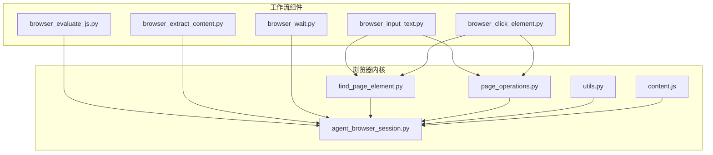
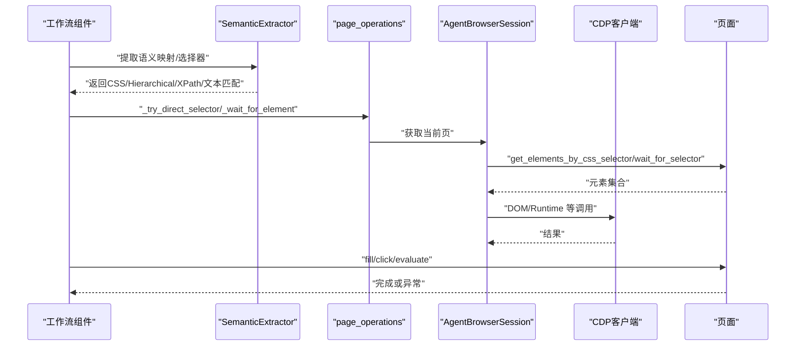
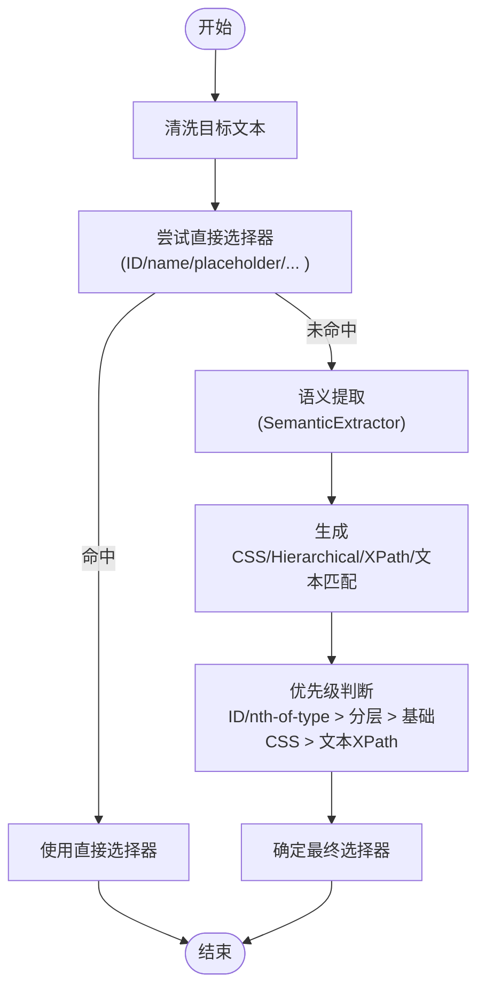
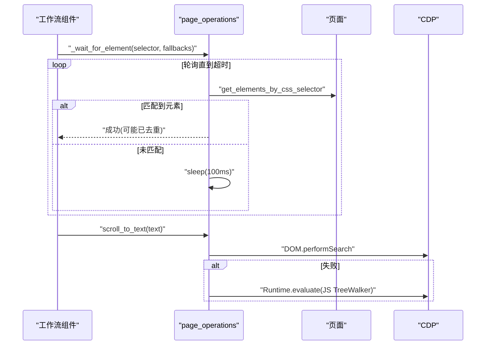
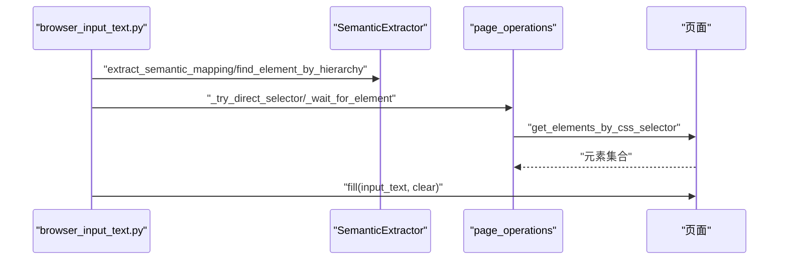
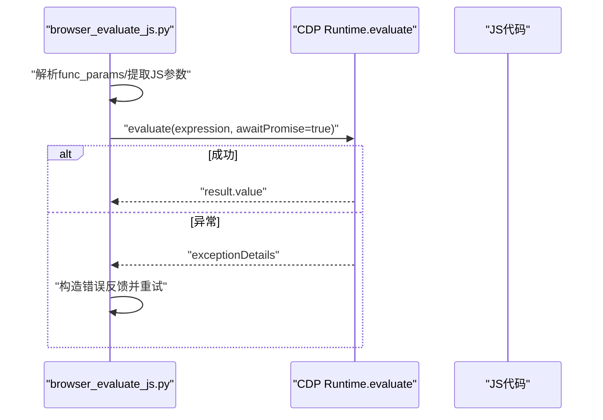
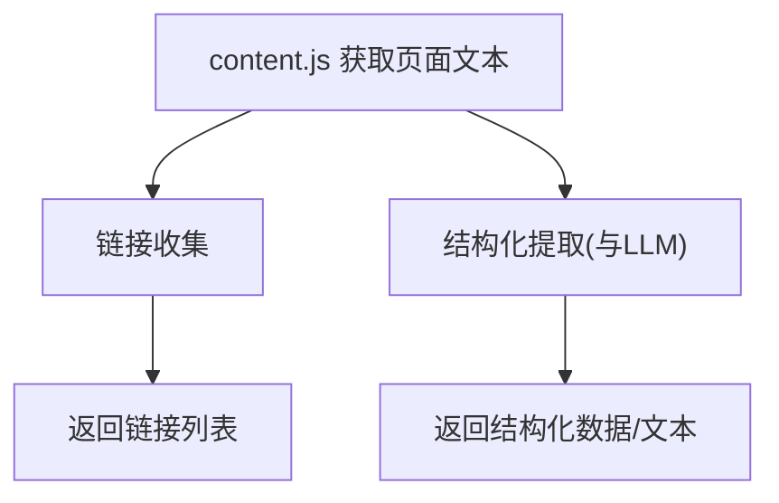
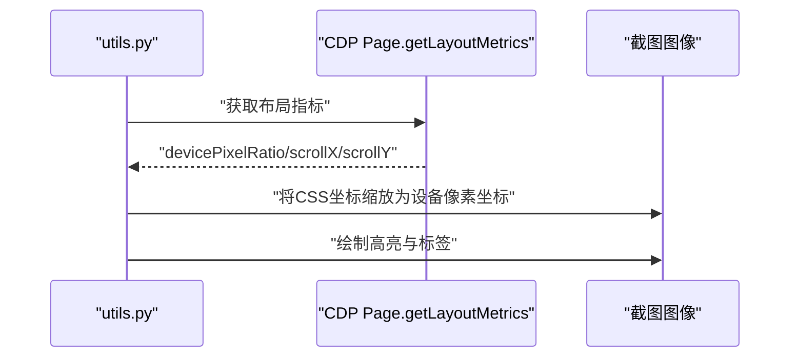
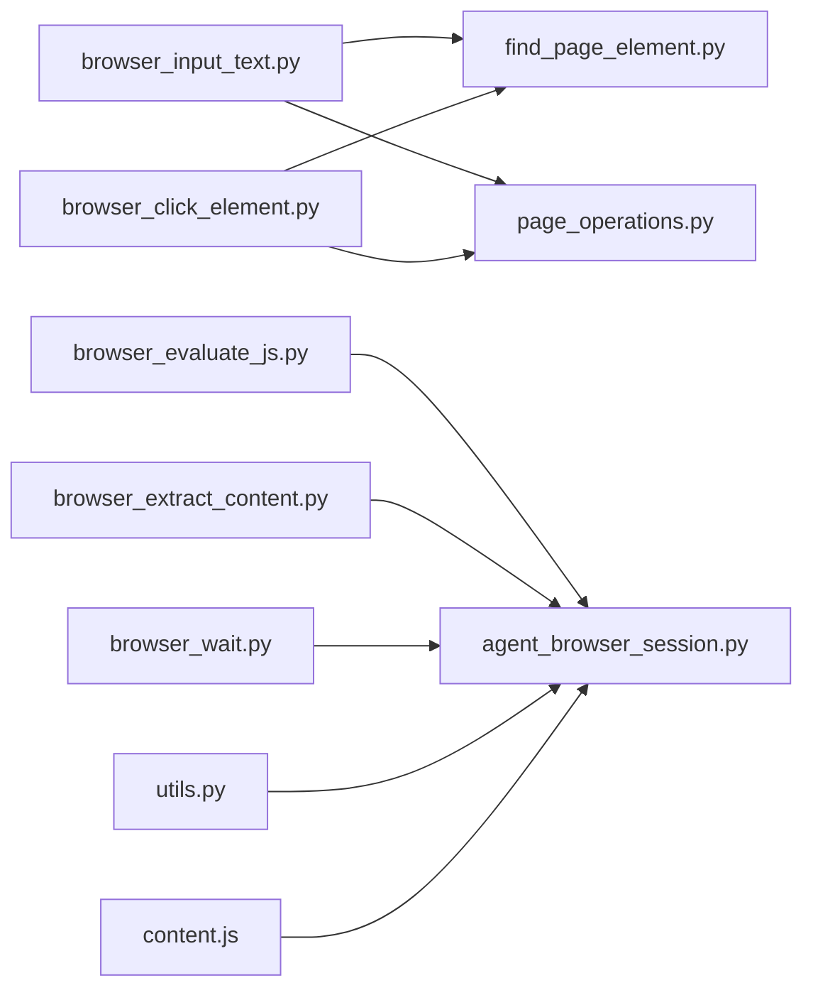

# DOM操作

<cite>
**本文引用的文件**
- [find_page_element.py](file://vibe_surf/browser/find_page_element.py)
- [page_operations.py](file://vibe_surf/browser/page_operations.py)
- [utils.py](file://vibe_surf/browser/utils.py)
- [browser_input_text.py](file://vibe_surf/workflows/Browser/browser_input_text.py)
- [browser_click_element.py](file://vibe_surf/workflows/Browser/browser_click_element.py)
- [browser_evaluate_js.py](file://vibe_surf/workflows/Browser/browser_evaluate_js.py)
- [browser_extract_content.py](file://vibe_surf/workflows/Browser/browser_extract_content.py)
- [browser_wait.py](file://vibe_surf/workflows/Browser/browser_wait.py)
- [content.js](file://vibe_surf/chrome_extension/content.js)
- [agent_browser_session.py](file://vibe_surf/browser/agent_browser_session.py)
- [tools/utils.py](file://vibe_surf/tools/utils.py)
</cite>

## 目录
1. [简介](#简介)
2. [项目结构](#项目结构)
3. [核心组件](#核心组件)
4. [架构总览](#架构总览)
5. [详细组件分析](#详细组件分析)
6. [依赖关系分析](#依赖关系分析)
7. [性能考量](#性能考量)
8. [故障排查指南](#故障排查指南)
9. [结论](#结论)

## 简介
本章节系统性地文档化 VibeSurf 的 DOM 元素操作能力，覆盖以下方面：
- DOM 元素定位与选择器策略（CSS、XPath、文本匹配）
- 等待机制（显式等待、隐式等待、条件等待）
- 表单交互（文本输入、复选框、单选按钮、下拉选择）
- JavaScript 执行（同步/异步脚本执行、函数注入）
- 页面内容提取（文本、图片、链接）
- 性能优化建议（减少 DOM 查询、缓存）

## 项目结构
围绕 DOM 操作的关键模块分布如下：
- 浏览器会话与底层通信：AgentBrowserSession、CDP 客户端
- DOM 元素语义映射与选择器生成：SemanticExtractor
- 页面操作与等待：page_operations
- 截图高亮与坐标转换：utils
- 工作流组件：浏览器输入、点击、JS 评估、内容提取、等待
- Chrome 扩展辅助：content.js（页面侧 DOM 文本/链接采集）

图表来源
- [browser_input_text.py](file://vibe_surf/workflows/Browser/browser_input_text.py#L85-L170)
- [browser_click_element.py](file://vibe_surf/workflows/Browser/browser_click_element.py#L90-L196)
- [browser_evaluate_js.py](file://vibe_surf/workflows/Browser/browser_evaluate_js.py#L100-L179)
- [browser_extract_content.py](file://vibe_surf/workflows/Browser/browser_extract_content.py#L160-L198)
- [browser_wait.py](file://vibe_surf/workflows/Browser/browser_wait.py#L1-L46)
- [agent_browser_session.py](file://vibe_surf/browser/agent_browser_session.py#L1-L200)
- [utils.py](file://vibe_surf/browser/utils.py#L731-L786)
- [page_operations.py](file://vibe_surf/browser/page_operations.py#L1-L223)
- [find_page_element.py](file://vibe_surf/browser/find_page_element.py#L1-L200)
- [content.js](file://vibe_surf/chrome_extension/content.js#L151-L203)

章节来源
- [browser_input_text.py](file://vibe_surf/workflows/Browser/browser_input_text.py#L1-L170)
- [browser_click_element.py](file://vibe_surf/workflows/Browser/browser_click_element.py#L1-L196)
- [browser_evaluate_js.py](file://vibe_surf/workflows/Browser/browser_evaluate_js.py#L1-L179)
- [browser_extract_content.py](file://vibe_surf/workflows/Browser/browser_extract_content.py#L1-L198)
- [browser_wait.py](file://vibe_surf/workflows/Browser/browser_wait.py#L1-L46)
- [agent_browser_session.py](file://vibe_surf/browser/agent_browser_session.py#L1-L200)
- [utils.py](file://vibe_surf/browser/utils.py#L731-L786)
- [page_operations.py](file://vibe_surf/browser/page_operations.py#L1-L223)
- [find_page_element.py](file://vibe_surf/browser/find_page_element.py#L1-L200)
- [content.js](file://vibe_surf/chrome_extension/content.js#L151-L203)

## 核心组件
- SemanticExtractor：从页面中提取可交互元素，生成 CSS/Hierarchical/XPath/文本匹配等多维选择器，并处理重复与上下文冲突。
- page_operations：提供滚动到文本、直接选择器尝试、元素等待（显式轮询）、CDP DOM 搜索等能力。
- utils：截图高亮、字体缓存、设备像素比与视口信息获取等。
- 工作流组件：浏览器输入、点击、JS 评估、内容提取、等待，均基于上述能力组合实现。
- content.js：扩展侧采集页面文本与链接，为前端展示与调试提供数据。

章节来源
- [find_page_element.py](file://vibe_surf/browser/find_page_element.py#L1-L200)
- [page_operations.py](file://vibe_surf/browser/page_operations.py#L1-L223)
- [utils.py](file://vibe_surf/browser/utils.py#L1-L200)
- [browser_input_text.py](file://vibe_surf/workflows/Browser/browser_input_text.py#L85-L170)
- [browser_click_element.py](file://vibe_surf/workflows/Browser/browser_click_element.py#L90-L196)
- [browser_evaluate_js.py](file://vibe_surf/workflows/Browser/browser_evaluate_js.py#L100-L179)
- [browser_extract_content.py](file://vibe_surf/workflows/Browser/browser_extract_content.py#L160-L198)
- [browser_wait.py](file://vibe_surf/workflows/Browser/browser_wait.py#L1-L46)
- [content.js](file://vibe_surf/chrome_extension/content.js#L151-L203)

## 架构总览
DOM 操作在 VibeSurf 中采用“高层工作流 + 底层工具”的分层设计：
- 工作流组件负责业务意图编排（输入、点击、JS、提取、等待）
- SemanticExtractor 负责语义化选择器生成与去重
- page_operations 提供等待与 DOM 搜索
- utils 提供截图高亮与坐标转换
- AgentBrowserSession 统一管理 CDP 连接与页面状态

图表来源
- [browser_input_text.py](file://vibe_surf/workflows/Browser/browser_input_text.py#L85-L170)
- [browser_click_element.py](file://vibe_surf/workflows/Browser/browser_click_element.py#L90-L196)
- [browser_evaluate_js.py](file://vibe_surf/workflows/Browser/browser_evaluate_js.py#L100-L179)
- [find_page_element.py](file://vibe_surf/browser/find_page_element.py#L1-L200)
- [page_operations.py](file://vibe_surf/browser/page_operations.py#L100-L223)
- [agent_browser_session.py](file://vibe_surf/browser/agent_browser_session.py#L1-L200)

## 详细组件分析

### 1) DOM 元素定位与选择器策略
- 多源选择器生成
  - CSS 选择器：优先使用 ID；否则按标签名 + 类名 + 属性组合；必要时添加 nth-of-type 以去重。
  - 分层选择器（Hierarchical）：自底向上构建路径，遇到首个含 ID 的祖先即停止，避免过长路径。
  - 文本匹配 XPath：当存在可读文本时生成 text() 包含的 XPath，作为最终回退。
  - 直接选择器尝试：将用户提供的目标文本清洗后尝试 ID/name/data-testid/placeholder 等常见属性。
- 去重与上下文增强
  - 针对重复文本，通过父容器、兄弟节点位置、DOM 路径等上下文信息生成带后缀的唯一描述。
  - 对复杂控件（日历、下拉、预订）附加专用上下文与交互提示，提升定位稳定性。
- 选择器优先级
  - 直接选择器 > 语义映射中的分层选择器（若含 ID 或 nth-of-type）> 基础 CSS > 文本 XPath。

图表来源
- [find_page_element.py](file://vibe_surf/browser/find_page_element.py#L489-L517)
- [find_page_element.py](file://vibe_surf/browser/find_page_element.py#L646-L779)
- [page_operations.py](file://vibe_surf/browser/page_operations.py#L100-L173)

章节来源
- [find_page_element.py](file://vibe_surf/browser/find_page_element.py#L1-L200)
- [find_page_element.py](file://vibe_surf/browser/find_page_element.py#L489-L517)
- [find_page_element.py](file://vibe_surf/browser/find_page_element.py#L646-L779)
- [page_operations.py](file://vibe_surf/browser/page_operations.py#L100-L173)

### 2) 等待机制（显式等待、隐式等待、条件等待）
- 显式等待
  - 基于轮询策略，定时检查选择器是否匹配到元素；支持超时时间与回退选择器列表。
  - 当匹配到多个元素时，优先保留分层选择器（含 nth-of-type）以保证唯一性。
- 隐式等待
  - 通过页面对象的等待接口（可见性/存在）进行短时等待，配合更具体的子选择器进一步收敛。
- 条件等待
  - 在滚动到文本场景中，先尝试 DOM.performSearch，失败则回退到 JS TreeWalker 遍历，确保在动态内容中也能定位。

图表来源
- [page_operations.py](file://vibe_surf/browser/page_operations.py#L175-L223)
- [page_operations.py](file://vibe_surf/browser/page_operations.py#L1-L98)

章节来源
- [page_operations.py](file://vibe_surf/browser/page_operations.py#L1-L98)
- [page_operations.py](file://vibe_surf/browser/page_operations.py#L175-L223)

### 3) 表单填写与交互
- 文本输入
  - 通过语义映射与直接选择器定位输入框，支持清空后再输入。
  - 支持 CSS 选择器、后端节点 ID、LLM 提示三种兜底定位方式。
- 点击交互
  - 支持左/右键、点击次数与修饰键（如 Ctrl）。
  - 自动检测新打开的标签页并切换焦点。
- 复选框/单选按钮/下拉选择
  - 通过语义映射识别控件类型（role/type），结合层级选择器与属性值（如 data-value）进行精准定位。
  - 下拉选择通常依赖分层选择器与选项值属性，确保在动态渲染场景中稳定选择。

图表来源
- [browser_input_text.py](file://vibe_surf/workflows/Browser/browser_input_text.py#L85-L170)
- [browser_click_element.py](file://vibe_surf/workflows/Browser/browser_click_element.py#L90-L196)

章节来源
- [browser_input_text.py](file://vibe_surf/workflows/Browser/browser_input_text.py#L85-L170)
- [browser_click_element.py](file://vibe_surf/workflows/Browser/browser_click_element.py#L90-L196)

### 4) JavaScript 执行能力
- 同步/异步脚本执行
  - 使用 CDP Runtime.evaluate，开启 awaitPromise 以支持 async 函数与 Promise。
  - 支持传参：自动解析 JSON 字符串，提取 JS 函数形参名并按顺序匹配实参。
- 错误处理
  - 若抛出异常，捕获 exceptionDetails 并反馈给 LLM 以修复代码。
- 函数注入
  - 将用户提供的 JS 代码包裹为 IIFE，确保语法正确与安全执行。

图表来源
- [browser_evaluate_js.py](file://vibe_surf/workflows/Browser/browser_evaluate_js.py#L100-L179)
- [tools/utils.py](file://vibe_surf/tools/utils.py#L156-L227)

章节来源
- [browser_evaluate_js.py](file://vibe_surf/workflows/Browser/browser_evaluate_js.py#L100-L179)
- [tools/utils.py](file://vibe_surf/tools/utils.py#L156-L227)

### 5) 页面内容提取（文本、图片、链接）
- 文本提取
  - content.js 使用 TreeWalker 排除 script/style/noscript，聚合可见文本。
- 链接收集
  - content.js 遍历 a[href]，解析 href、text、title，形成链接列表。
- 结构化提取
  - browser_extract_content.py 通过页面对象的 extract_content 方法，结合 LLM 输出结构化模型，返回结构化数据或通用文本。

图表来源
- [content.js](file://vibe_surf/chrome_extension/content.js#L151-L203)
- [browser_extract_content.py](file://vibe_surf/workflows/Browser/browser_extract_content.py#L160-L198)

章节来源
- [content.js](file://vibe_surf/chrome_extension/content.js#L151-L203)
- [browser_extract_content.py](file://vibe_surf/workflows/Browser/browser_extract_content.py#L160-L198)

### 6) 截图高亮与坐标转换
- 设备像素比与视口偏移
  - 通过 CDP Page.getLayoutMetrics 获取 devicePixelRatio、scrollX、scrollY，用于将 CSS 坐标转换为设备像素坐标。
- 截图高亮
  - 将元素绝对位置映射到截图坐标，绘制半透明填充与轮廓，并在不重叠前提下放置标签框与文字。

图表来源
- [utils.py](file://vibe_surf/browser/utils.py#L731-L786)
- [utils.py](file://vibe_surf/browser/utils.py#L371-L729)

章节来源
- [utils.py](file://vibe_surf/browser/utils.py#L731-L786)
- [utils.py](file://vibe_surf/browser/utils.py#L371-L729)

## 依赖关系分析
- 工作流组件依赖 SemanticExtractor 与 page_operations 提供的定位与等待能力。
- utils 与 AgentBrowserSession 为底层支撑，前者负责截图与坐标转换，后者负责 CDP 连接与页面状态。
- content.js 为扩展侧工具，补充页面文本与链接采集。

图表来源
- [browser_input_text.py](file://vibe_surf/workflows/Browser/browser_input_text.py#L85-L170)
- [browser_click_element.py](file://vibe_surf/workflows/Browser/browser_click_element.py#L90-L196)
- [browser_evaluate_js.py](file://vibe_surf/workflows/Browser/browser_evaluate_js.py#L100-L179)
- [browser_extract_content.py](file://vibe_surf/workflows/Browser/browser_extract_content.py#L160-L198)
- [browser_wait.py](file://vibe_surf/workflows/Browser/browser_wait.py#L1-L46)
- [find_page_element.py](file://vibe_surf/browser/find_page_element.py#L1-L200)
- [page_operations.py](file://vibe_surf/browser/page_operations.py#L1-L223)
- [agent_browser_session.py](file://vibe_surf/browser/agent_browser_session.py#L1-L200)
- [utils.py](file://vibe_surf/browser/utils.py#L731-L786)
- [content.js](file://vibe_surf/chrome_extension/content.js#L151-L203)

章节来源
- [browser_input_text.py](file://vibe_surf/workflows/Browser/browser_input_text.py#L85-L170)
- [browser_click_element.py](file://vibe_surf/workflows/Browser/browser_click_element.py#L90-L196)
- [browser_evaluate_js.py](file://vibe_surf/workflows/Browser/browser_evaluate_js.py#L100-L179)
- [browser_extract_content.py](file://vibe_surf/workflows/Browser/browser_extract_content.py#L160-L198)
- [browser_wait.py](file://vibe_surf/workflows/Browser/browser_wait.py#L1-L46)
- [find_page_element.py](file://vibe_surf/browser/find_page_element.py#L1-L200)
- [page_operations.py](file://vibe_surf/browser/page_operations.py#L1-L223)
- [agent_browser_session.py](file://vibe_surf/browser/agent_browser_session.py#L1-L200)
- [utils.py](file://vibe_surf/browser/utils.py#L731-L786)
- [content.js](file://vibe_surf/chrome_extension/content.js#L151-L203)

## 性能考量
- 减少 DOM 查询次数
  - 优先使用分层选择器（含 ID 或 nth-of-type）一次性定位，避免多次回溯。
  - 对于高频操作，先尝试直接选择器（ID/name/placeholder），失败再降级到语义映射。
- 缓存与复用
  - SemanticExtractor 内部维护元素计数器与上下文，避免重复计算。
  - utils 中字体与加载字体对象使用两级缓存（路径缓存、对象缓存），降低重复 IO。
- 视口与坐标转换
  - 通过一次 CDP 调用获取 devicePixelRatio 与滚动偏移，批量应用到所有元素坐标，避免重复查询。
- 等待策略
  - 显式等待设置合理超时，避免无限轮询；在匹配到多个元素时，优先使用更精确的选择器（如 nth-of-type）减少后续重试成本。

章节来源
- [find_page_element.py](file://vibe_surf/browser/find_page_element.py#L1-L200)
- [utils.py](file://vibe_surf/browser/utils.py#L106-L152)
- [utils.py](file://vibe_surf/browser/utils.py#L731-L786)
- [page_operations.py](file://vibe_surf/browser/page_operations.py#L175-L223)

## 故障排查指南
- 选择器无效或匹配过多
  - 现象：_wait_for_element 返回成功但匹配多个元素。
  - 处理：优先使用分层选择器（含 ID 或 nth-of-type）；若仍过多，结合 visible/first-of-type 等伪类进一步收敛。
- XPath 不生效
  - 现象：CDP 中不支持 XPath 选择器。
  - 处理：使用语义映射生成的 CSS/Hierarchical/XPath 作为回退，或改用文本匹配 XPath。
- JS 执行报错
  - 现象：Runtime.evaluate 抛出异常。
  - 处理：根据 exceptionDetails 定位问题；使用 tools/utils 的 IIFE 与 try-catch 规范编写 JS；必要时通过 LLM 修复。
- 截图高亮异常
  - 现象：高亮框越界或标签重叠。
  - 处理：确认 devicePixelRatio 与视口偏移正确；调整标签位置算法，避免重叠。

章节来源
- [page_operations.py](file://vibe_surf/browser/page_operations.py#L175-L223)
- [browser_evaluate_js.py](file://vibe_surf/workflows/Browser/browser_evaluate_js.py#L100-L179)
- [tools/utils.py](file://vibe_surf/tools/utils.py#L156-L227)
- [utils.py](file://vibe_surf/browser/utils.py#L371-L729)

## 结论
VibeSurf 的 DOM 操作体系以语义化选择器为核心，结合显式等待与回退策略，实现了在复杂页面中的稳定定位与交互。通过 CDP 的 Runtime.evaluate 与 DOM API，系统同时支持同步/异步脚本执行与结构化内容提取。配合截图高亮与坐标转换，开发者可以直观验证定位效果并优化性能。建议在实际使用中优先采用分层选择器与直接选择器，合理设置等待超时，并利用缓存与坐标转换减少重复开销。