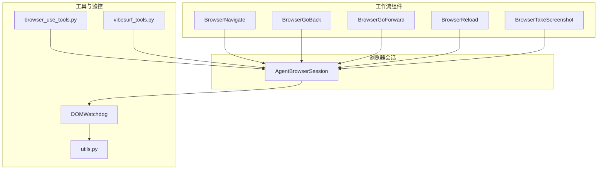
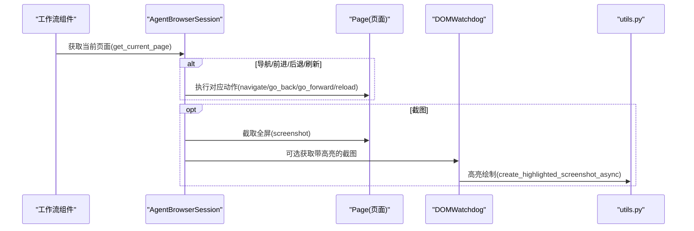
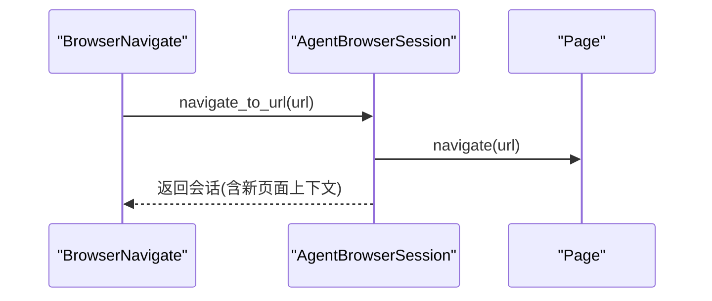
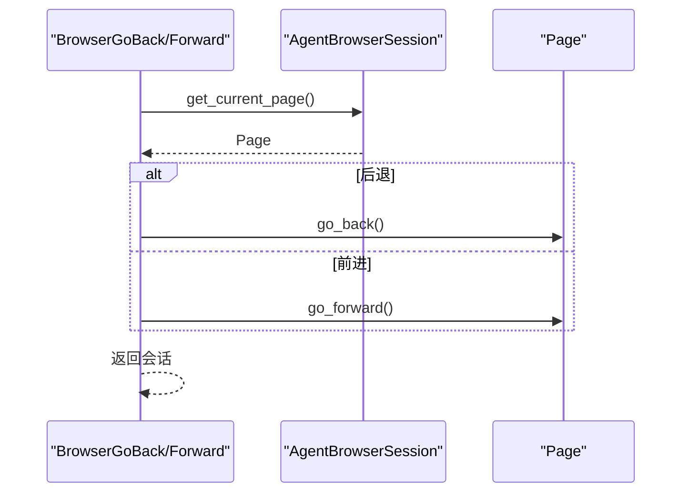
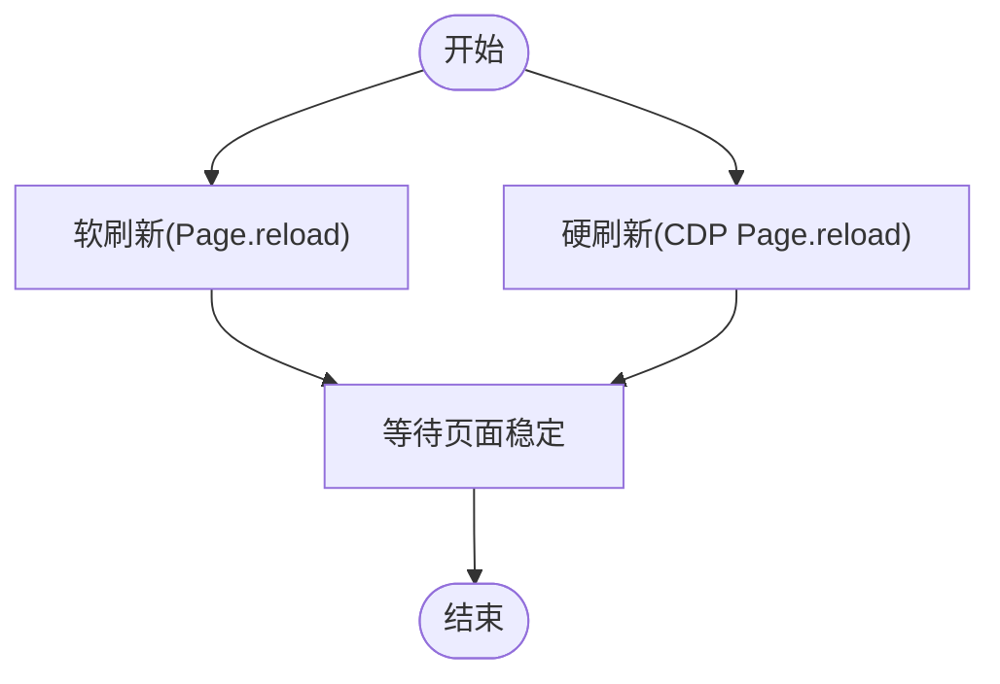
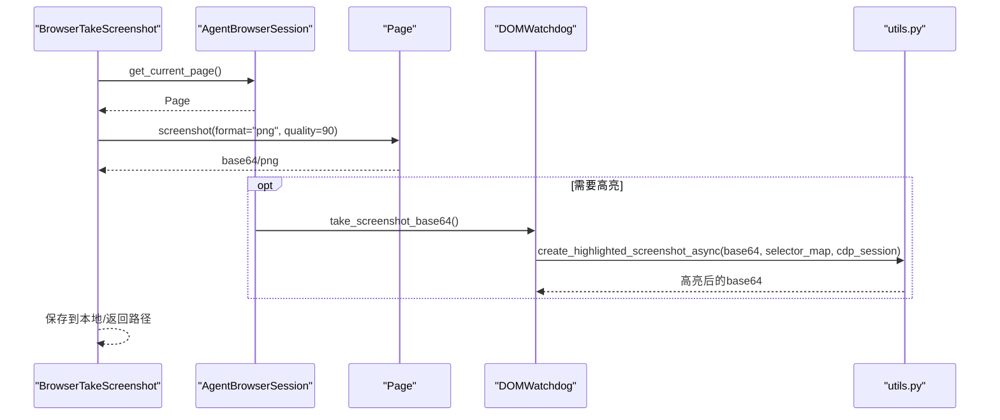
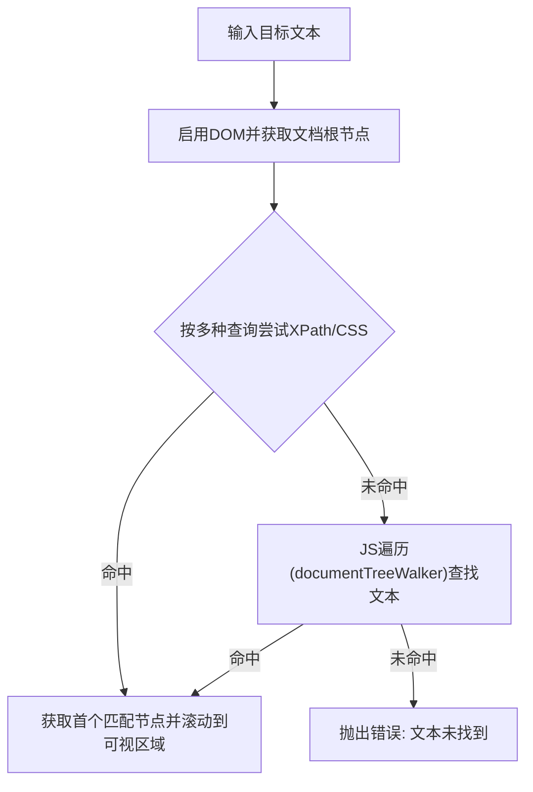
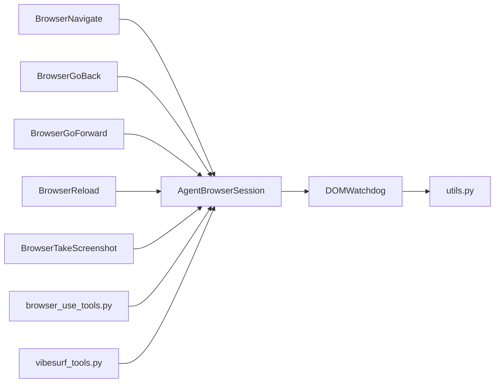

# 基本操作

<cite>
**本文引用的文件**
- [page_operations.py](file://vibe_surf/browser/page_operations.py)
- [agent_browser_session.py](file://vibe_surf/browser/agent_browser_session.py)
- [browser_go_back.py](file://vibe_surf/workflows/Browser/browser_go_back.py)
- [browser_go_forward.py](file://vibe_surf/workflows/Browser/browser_go_forward.py)
- [browser_navigate.py](file://vibe_surf/workflows/Browser/browser_navigate.py)
- [browser_reload.py](file://vibe_surf/workflows/Browser/browser_reload.py)
- [browser_take_screenshot.py](file://vibe_surf/workflows/Browser/browser_take_screenshot.py)
- [browser_use_tools.py](file://vibe_surf/tools/browser_use_tools.py)
- [vibesurf_tools.py](file://vibe_surf/tools/vibesurf_tools.py)
- [dom_watchdog.py](file://vibe_surf/browser/watchdogs/dom_watchdog.py)
- [utils.py](file://vibe_surf/browser/utils.py)
</cite>

## 目录
1. [简介](#简介)
2. [项目结构](#项目结构)
3. [核心组件](#核心组件)
4. [架构总览](#架构总览)
5. [详细组件分析](#详细组件分析)
6. [依赖关系分析](#依赖关系分析)
7. [性能考量](#性能考量)
8. [故障排查指南](#故障排查指南)
9. [结论](#结论)

## 简介
本文档系统化梳理 VibeSurf 的页面基本操作能力，重点围绕浏览器导航（URL 跳转、前进/后退）、页面刷新（软/硬刷新）、截图（全屏、元素、区域）等基础方法进行深入解析。内容涵盖：
- 页面导航机制与实现原理（URL 跳转、前进/后退）
- 刷新策略与适用场景（软刷新 vs 硬刷新）
- 截图功能的实现与配置（全屏、区域裁剪）
- 操作参数说明（超时、等待条件等）
- 错误处理机制（页面加载失败、网络异常等）
- 实际使用示例与最佳实践路径指引

## 项目结构
与“基本操作”直接相关的关键模块分布如下：
- 浏览器会话与页面操作：AgentBrowserSession 提供导航、刷新、截图等底层能力
- 工作流组件：BrowserNavigate、BrowserGoBack、BrowserGoForward、BrowserReload、BrowserTakeScreenshot
- 工具函数：browser_use_tools 与 vibesurf_tools 中的截图保存逻辑
- 截图高亮：dom_watchdog 与 utils 提供截图高亮与坐标换算

图表来源
- [browser_navigate.py](file://vibe_surf/workflows/Browser/browser_navigate.py#L1-L50)
- [browser_go_back.py](file://vibe_surf/workflows/Browser/browser_go_back.py#L1-L45)
- [browser_go_forward.py](file://vibe_surf/workflows/Browser/browser_go_forward.py#L1-L44)
- [browser_reload.py](file://vibe_surf/workflows/Browser/browser_reload.py#L1-L44)
- [browser_take_screenshot.py](file://vibe_surf/workflows/Browser/browser_take_screenshot.py#L15-L127)
- [agent_browser_session.py](file://vibe_surf/browser/agent_browser_session.py#L1100-L1245)
- [dom_watchdog.py](file://vibe_surf/browser/watchdogs/dom_watchdog.py#L67-L249)
- [utils.py](file://vibe_surf/browser/utils.py#L666-L785)
- [browser_use_tools.py](file://vibe_surf/tools/browser_use_tools.py#L348-L409)
- [vibesurf_tools.py](file://vibe_surf/tools/vibesurf_tools.py#L388-L409)

章节来源
- [page_operations.py](file://vibe_surf/browser/page_operations.py#L1-L223)
- [agent_browser_session.py](file://vibe_surf/browser/agent_browser_session.py#L1100-L1245)

## 核心组件
- 导航与前进/后退：由工作流组件调用 AgentBrowserSession 的页面对象方法实现
- 刷新：提供软刷新（基于页面对象 reload）与硬刷新（基于 CDP Page.reload）两种策略
- 截图：支持全屏截图、区域裁剪、高亮标注；并可落盘保存

章节来源
- [browser_navigate.py](file://vibe_surf/workflows/Browser/browser_navigate.py#L1-L50)
- [browser_go_back.py](file://vibe_surf/workflows/Browser/browser_go_back.py#L1-L45)
- [browser_go_forward.py](file://vibe_surf/workflows/Browser/browser_go_forward.py#L1-L44)
- [browser_reload.py](file://vibe_surf/workflows/Browser/browser_reload.py#L1-L44)
- [browser_take_screenshot.py](file://vibe_surf/workflows/Browser/browser_take_screenshot.py#L15-L127)
- [agent_browser_session.py](file://vibe_surf/browser/agent_browser_session.py#L1100-L1245)

## 架构总览
下图展示了“基本操作”的端到端调用链路：工作流组件通过 AgentBrowserSession 访问当前页面，执行导航/刷新/截图等动作，并在需要时结合 DOMWatchdog 与 utils 完成截图高亮与状态汇总。

图表来源
- [browser_navigate.py](file://vibe_surf/workflows/Browser/browser_navigate.py#L41-L50)
- [browser_go_back.py](file://vibe_surf/workflows/Browser/browser_go_back.py#L36-L45)
- [browser_go_forward.py](file://vibe_surf/workflows/Browser/browser_go_forward.py#L35-L44)
- [browser_reload.py](file://vibe_surf/workflows/Browser/browser_reload.py#L35-L44)
- [browser_take_screenshot.py](file://vibe_surf/workflows/Browser/browser_take_screenshot.py#L77-L117)
- [agent_browser_session.py](file://vibe_surf/browser/agent_browser_session.py#L1100-L1245)
- [dom_watchdog.py](file://vibe_surf/browser/watchdogs/dom_watchdog.py#L67-L142)
- [utils.py](file://vibe_surf/browser/utils.py#L666-L785)

## 详细组件分析

### 导航（URL 跳转）
- 组件入口：BrowserNavigateComponent.browser_navigation
- 实现要点：
  - 通过 AgentBrowserSession.navigate_to_url 发起导航
  - 导航后短暂等待以确保页面稳定
- 典型使用场景：从外部输入 URL 进行页面跳转

图表来源
- [browser_navigate.py](file://vibe_surf/workflows/Browser/browser_navigate.py#L41-L50)

章节来源
- [browser_navigate.py](file://vibe_surf/workflows/Browser/browser_navigate.py#L1-L50)

### 前进/后退（历史导航）
- 组件入口：BrowserGoBackComponent.browser_go_back、BrowserGoForwardComponent.browser_go_forward
- 实现要点：
  - 通过 Page 对象的 go_back/go_forward 方法执行历史导航
  - 工作流组件捕获异常并抛出，便于上层处理
- 典型使用场景：在多页签或多步骤流程中回退/前进

图表来源
- [browser_go_back.py](file://vibe_surf/workflows/Browser/browser_go_back.py#L36-L45)
- [browser_go_forward.py](file://vibe_surf/workflows/Browser/browser_go_forward.py#L35-L44)

章节来源
- [browser_go_back.py](file://vibe_surf/workflows/Browser/browser_go_back.py#L1-L45)
- [browser_go_forward.py](file://vibe_surf/workflows/Browser/browser_go_forward.py#L1-L44)

### 刷新（软刷新 vs 硬刷新）
- 软刷新（页面对象 reload）：适用于常规页面刷新，保留浏览器缓存与会话状态
- 硬刷新（CDP Page.reload）：适用于需要强制重新拉取资源的场景
- 会话级刷新接口：AgentBrowserSession.refresh_page 使用 CDP Page.reload

图表来源
- [browser_reload.py](file://vibe_surf/workflows/Browser/browser_reload.py#L35-L44)
- [agent_browser_session.py](file://vibe_surf/browser/agent_browser_session.py#L1233-L1245)

章节来源
- [browser_reload.py](file://vibe_surf/workflows/Browser/browser_reload.py#L1-L44)
- [agent_browser_session.py](file://vibe_surf/browser/agent_browser_session.py#L1233-L1245)

### 截图（全屏、区域裁剪、高亮）
- 全屏截图：
  - 工作流组件：BrowserTakeScreenshotComponent.browser_take_screenshot 通过 Page.screenshot 获取 PNG 数据，支持质量参数与本地落盘
  - 工具函数：vibesurf_tools 与 browser_use_tools 提供将截图字节写入文件系统的逻辑
- 区域截图：
  - 工作流组件支持通过 crop_x1/crop_y1/crop_x2/crop_y2 参数对截图进行区域裁剪
- 截图高亮：
  - DOMWatchdog 在生成浏览器状态时，可并行抓取干净截图，并在有选择器映射时调用 utils.create_highlighted_screenshot_async 对交互元素进行高亮标注
  - utils 内部根据设备像素比与视口偏移，将 CSS 坐标转换为设备像素坐标，再绘制半透明覆盖层与索引标签

图表来源
- [browser_take_screenshot.py](file://vibe_surf/workflows/Browser/browser_take_screenshot.py#L77-L117)
- [dom_watchdog.py](file://vibe_surf/browser/watchdogs/dom_watchdog.py#L67-L142)
- [utils.py](file://vibe_surf/browser/utils.py#L666-L785)
- [vibesurf_tools.py](file://vibe_surf/tools/vibesurf_tools.py#L388-L409)
- [browser_use_tools.py](file://vibe_surf/tools/browser_use_tools.py#L386-L409)

章节来源
- [browser_take_screenshot.py](file://vibe_surf/workflows/Browser/browser_take_screenshot.py#L15-L127)
- [dom_watchdog.py](file://vibe_surf/browser/watchdogs/dom_watchdog.py#L67-L249)
- [utils.py](file://vibe_surf/browser/utils.py#L666-L785)
- [vibesurf_tools.py](file://vibe_surf/tools/vibesurf_tools.py#L388-L409)
- [browser_use_tools.py](file://vibe_surf/tools/browser_use_tools.py#L386-L409)

### 页面滚动与元素定位辅助（补充）
- 文本滚动：scroll_to_text 通过 DOM.performSearch 与 Runtime.evaluate 结合，优先使用 XPath/CSS 匹配，找不到时回退到 JS 遍历滚动到目标文本
- 直接选择器尝试：_try_direct_selector 支持 ID/name/data-testid 等常见属性，自动尝试驼峰/小写变体，并对多匹配进行严格模式提示
- 等待元素：_wait_for_element 支持超时轮询与回退选择器，避免 XPath 在 CDP 下的限制

图表来源
- [page_operations.py](file://vibe_surf/browser/page_operations.py#L9-L98)

章节来源
- [page_operations.py](file://vibe_surf/browser/page_operations.py#L9-L98)
- [page_operations.py](file://vibe_surf/browser/page_operations.py#L100-L173)
- [page_operations.py](file://vibe_surf/browser/page_operations.py#L175-L223)

## 依赖关系分析
- 工作流组件依赖 AgentBrowserSession 提供的页面对象与会话管理
- 截图高亮依赖 DOMWatchdog 与 utils 的坐标换算与绘制逻辑
- 工具函数负责将截图字节写入文件系统，便于长期记忆与归档

图表来源
- [browser_navigate.py](file://vibe_surf/workflows/Browser/browser_navigate.py#L1-L50)
- [browser_go_back.py](file://vibe_surf/workflows/Browser/browser_go_back.py#L1-L45)
- [browser_go_forward.py](file://vibe_surf/workflows/Browser/browser_go_forward.py#L1-L44)
- [browser_reload.py](file://vibe_surf/workflows/Browser/browser_reload.py#L1-L44)
- [browser_take_screenshot.py](file://vibe_surf/workflows/Browser/browser_take_screenshot.py#L15-L127)
- [agent_browser_session.py](file://vibe_surf/browser/agent_browser_session.py#L1100-L1245)
- [dom_watchdog.py](file://vibe_surf/browser/watchdogs/dom_watchdog.py#L67-L249)
- [utils.py](file://vibe_surf/browser/utils.py#L666-L785)
- [browser_use_tools.py](file://vibe_surf/tools/browser_use_tools.py#L348-L409)
- [vibesurf_tools.py](file://vibe_surf/tools/vibesurf_tools.py#L388-L409)

章节来源
- [agent_browser_session.py](file://vibe_surf/browser/agent_browser_session.py#L1100-L1245)
- [dom_watchdog.py](file://vibe_surf/browser/watchdogs/dom_watchdog.py#L67-L249)
- [utils.py](file://vibe_surf/browser/utils.py#L666-L785)

## 性能考量
- 并行任务：DOMWatchdog 在生成浏览器状态时，DOM 构建与干净截图可并行执行，减少整体等待时间
- 截图高亮：utils 的高亮绘制在 CPU 上完成，建议在需要时开启，避免不必要的开销
- 设备像素比换算：高亮前通过 CDP 获取 devicePixelRatio 与视口偏移，保证标注位置准确，避免额外重绘

章节来源
- [dom_watchdog.py](file://vibe_surf/browser/watchdogs/dom_watchdog.py#L67-L142)
- [utils.py](file://vibe_surf/browser/utils.py#L731-L759)

## 故障排查指南
- 导航失败
  - 检查 URL 是否有效、网络是否可用
  - 工作流组件已捕获异常并抛出，可在上层统一处理
- 前进/后退不可用
  - 若历史记录为空，组件会返回提示信息；请确认历史栈是否存在可回退/前进的条目
- 刷新无效
  - 软刷新与硬刷新策略不同，请根据场景选择合适的方式
- 截图失败
  - 检查页面是否已渲染完成、是否处于 PDF 视图
  - 高亮绘制失败时会回退到原始截图；确认 selector_map 是否存在且有效
- 文件保存失败
  - 工具函数会在异常时记录错误并返回 ActionResult，检查文件系统权限与路径

章节来源
- [browser_navigate.py](file://vibe_surf/workflows/Browser/browser_navigate.py#L41-L50)
- [browser_go_back.py](file://vibe_surf/workflows/Browser/browser_go_back.py#L36-L45)
- [browser_go_forward.py](file://vibe_surf/workflows/Browser/browser_go_forward.py#L35-L44)
- [browser_reload.py](file://vibe_surf/workflows/Browser/browser_reload.py#L35-L44)
- [browser_take_screenshot.py](file://vibe_surf/workflows/Browser/browser_take_screenshot.py#L77-L117)
- [vibesurf_tools.py](file://vibe_surf/tools/vibesurf_tools.py#L388-L409)
- [browser_use_tools.py](file://vibe_surf/tools/browser_use_tools.py#L386-L409)
- [dom_watchdog.py](file://vibe_surf/browser/watchdogs/dom_watchdog.py#L189-L249)

## 结论
VibeSurf 的“基本操作”围绕 AgentBrowserSession 提供的页面对象展开，配合工作流组件与工具函数，实现了从导航、前进/后退、刷新到截图的完整闭环。通过并行化与高亮标注，既提升了可观测性，也增强了调试效率。建议在复杂页面中优先采用软刷新与高亮截图，结合超时与等待策略，确保稳定性与性能的平衡。