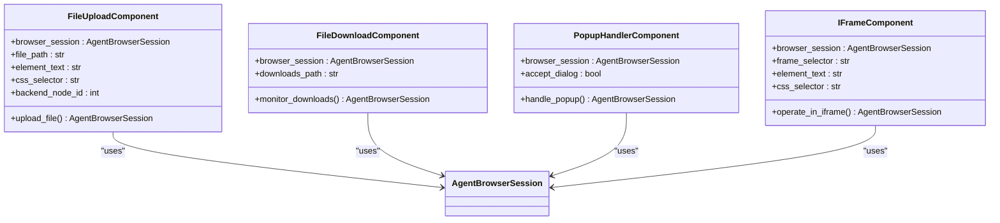

# 页面操作

<cite>
**本文档引用的文件**   
- [page_operations.py](file://vibe_surf/browser/page_operations.py)
- [find_page_element.py](file://vibe_surf/browser/find_page_element.py)
- [utils.py](file://vibe_surf/browser/utils.py)
- [agent_browser_session.py](file://vibe_surf/browser/agent_browser_session.py)
- [browser_use_tools.py](file://vibe_surf/tools/browser_use_tools.py)
- [browser_input_text.py](file://vibe_surf/workflows/Browser/browser_input_text.py)
- [browser_click_element.py](file://vibe_surf/workflows/Browser/browser_click_element.py)
- [browser_navigate.py](file://vibe_surf/workflows/Browser/browser_navigate.py)
- [browser_reload.py](file://vibe_surf/workflows/Browser/browser_reload.py)
- [browser_evaluate_js.py](file://vibe_surf/workflows/Browser/browser_evaluate_js.py)
</cite>

## 目录
1. [引言](#引言)
2. [页面操作功能概述](#页面操作功能概述)
3. [DOM元素定位与交互机制](#dom元素定位与交互机制)
4. [页面内容提取功能](#页面内容提取功能)
5. [JavaScript执行能力](#javascript执行能力)
6. [页面状态监控功能](#页面状态监控功能)
7. [错误处理机制](#错误处理机制)
8. [高级操作功能](#高级操作功能)
9. [操作链与事务管理](#操作链与事务管理)
10. [总结](#总结)

## 引言
VibeSurf的页面操作功能为自动化浏览器交互提供了全面而强大的支持。本文档详细分析了`page_operations.py`中实现的各种页面操作方法，包括导航、刷新、截图、表单填写等核心功能。通过深入研究DOM元素定位和交互机制，我们揭示了系统如何利用选择器支持和等待策略来确保操作的准确性和可靠性。文档还详细描述了页面内容提取功能，如文本、图片、链接的抓取，以及JavaScript执行能力，包括同步和异步脚本执行。此外，我们探讨了页面状态监控功能，如加载状态检测和性能指标收集，并分析了错误处理机制，如元素未找到或超时情况的处理。最后，文档涵盖了高级操作，如文件上传下载、弹窗处理、iFrame操作等，以及操作链和事务管理功能，确保复杂操作的原子性。

## 页面操作功能概述
VibeSurf的页面操作功能提供了一套完整的API，用于执行各种浏览器操作。这些功能主要通过`page_operations.py`文件中的异步函数实现，支持导航、刷新、截图、表单填写等多种操作。核心功能包括：

- **导航操作**：通过`navigate_to_url`方法实现页面跳转，支持等待网络稳定后执行后续操作。
- **刷新操作**：通过`reload`方法重新加载当前页面，确保获取最新内容。
- **截图操作**：通过`take_screenshot`方法捕获当前页面的截图，并支持保存到文件系统。
- **表单填写**：通过`fill`方法向输入框填充文本，支持清除原有内容的选项。

这些操作通过`AgentBrowserSession`类进行管理，确保每个操作都在正确的浏览器会话上下文中执行。系统还提供了详细的日志记录，便于调试和监控操作执行过程。

**Section sources**
- [page_operations.py](file://vibe_surf/browser/page_operations.py#L1-L223)
- [browser_use_tools.py](file://vibe_surf/tools/browser_use_tools.py#L371-L398)

## DOM元素定位与交互机制
VibeSurf的DOM元素定位与交互机制基于`find_page_element.py`文件中的`SemanticExtractor`类实现。该机制通过以下步骤定位和交互元素：

1. **语义提取**：`SemanticExtractor`类通过JavaScript代码在页面上执行，提取所有交互元素的语义信息，包括标签、类型、角色、ID、名称、类名、文本内容、占位符、标题、aria标签、值、标签文本、父级文本、CSS选择器、分层选择器、后备选择器、文本XPath、DOM路径、容器上下文、兄弟上下文、交互提示、小部件数据和位置信息。

2. **选择器生成**：系统优先尝试使用目标文本作为直接选择器（ID或名称），并支持多种选择器类型，包括ID选择器、名称属性选择器、数据测试ID选择器和占位符选择器。对于包含下划线或连字符的文本，系统还会尝试驼峰命名法和小写版本的选择器。

3. **等待策略**：`_wait_for_element`函数实现了分层回退选项的等待策略，支持超时设置和回退选择器。该函数通过轮询检查元素是否存在，并在指定时间内等待元素变为可见状态。

4. **交互提示**：系统为不同类型的UI小部件（如日历、下拉菜单、预订）提供特定的交互提示，帮助确定最佳的交互方式。

**Diagram sources**
- [find_page_element.py](file://vibe_surf/browser/find_page_element.py#L18-L800)
- [agent_browser_session.py](file://vibe_surf/browser/agent_browser_session.py#L51-L200)
- [page_operations.py](file://vibe_surf/browser/page_operations.py#L100-L173)

## 页面内容提取功能
VibeSurf的页面内容提取功能通过`find_page_element.py`文件中的`SemanticExtractor`类实现，能够高效地抓取页面上的文本、图片和链接。系统通过执行JavaScript代码在页面上提取所有交互元素的详细信息，包括：

- **文本内容**：从元素的标签文本、文本内容、占位符、标题、aria标签、值、名称和ID中提取有意义的文本。
- **图片信息**：通过CSS选择器和DOM路径定位图片元素，并提取其位置和尺寸信息。
- **链接提取**：识别所有包含href属性的a标签，提取链接文本和URL。

提取过程采用分层上下文机制，通过父级文本、容器上下文、兄弟上下文和DOM路径等信息处理重复文本，确保每个元素都有唯一的标识。系统还为不同类型的UI小部件（如日历、下拉菜单、预订）提供特定的上下文信息，提高元素识别的准确性。

**Diagram sources**
- [find_page_element.py](file://vibe_surf/browser/find_page_element.py#L211-L800)
- [agent_browser_session.py](file://vibe_surf/browser/agent_browser_session.py#L51-L200)

## JavaScript执行能力
VibeSurf的JavaScript执行能力通过`browser_evaluate_js.py`文件中的`BrowserEvaluateJavaScriptComponent`类实现，支持同步和异步脚本执行。系统通过CDP（Chrome DevTools Protocol）客户端发送Runtime.evaluate请求来执行JavaScript代码，主要功能包括：

- **代码执行**：支持执行任意JavaScript代码，包括函数定义和调用。
- **参数传递**：能够解析JavaScript函数的参数，并将提供的JSON参数匹配到函数参数中。
- **异步支持**：通过设置`awaitPromise`参数为True，支持执行返回Promise的异步函数。
- **结果处理**：能够处理各种返回值类型，包括null、字符串、对象和数组，并将其转换为JSON字符串或字符串表示。

执行过程首先解析提供的函数参数JSON字符串，然后提取JavaScript代码中的参数名，将参数值按顺序匹配并构造执行表达式。系统还支持修复格式错误的JSON字符串，提高参数解析的容错性。

**Diagram sources**
- [browser_evaluate_js.py](file://vibe_surf/workflows/Browser/browser_evaluate_js.py#L1-L179)
- [agent_browser_session.py](file://vibe_surf/browser/agent_browser_session.py#L51-L200)

## 页面状态监控功能
VibeSurf的页面状态监控功能通过`agent_browser_session.py`文件中的`AgentBrowserSession`类实现，能够检测页面加载状态和收集性能指标。主要监控功能包括：

- **网络稳定性检测**：通过`_wait_for_stable_network`方法等待网络活动稳定，确保在执行操作前页面已完全加载。
- **页面加载监控**：监听NavigationStartedEvent和NavigationCompleteEvent事件，跟踪页面导航的开始和完成状态。
- **性能指标收集**：通过CDP的Page.getLayoutMetrics方法获取视口信息和设备像素比，用于准确计算元素位置。
- **标签管理**：通过get_tabs方法获取当前所有标签页信息，监控标签页的创建和关闭。

系统还实现了详细的日志记录，包括连接状态、导航事件、错误信息等，便于调试和问题排查。通过BrowserConnectedEvent、BrowserErrorEvent等事件，系统能够实时响应浏览器状态变化。

**Diagram sources**
- [agent_browser_session.py](file://vibe_surf/browser/agent_browser_session.py#L51-L200)
- [browser_use_tools.py](file://vibe_surf/tools/browser_use_tools.py#L146-L200)

## 错误处理机制
VibeSurf的错误处理机制通过多层次的异常捕获和处理策略确保系统的稳定性和可靠性。主要错误处理机制包括：

- **元素未找到处理**：当无法找到指定元素时，系统会尝试使用分层选择器和回退选择器，并记录警告信息。如果所有选择器都失败，则抛出RuntimeError异常。
- **超时处理**：通过设置合理的超时时间（默认5000ms），防止操作无限期等待。超时后会记录警告并继续尝试其他选择器。
- **异常捕获**：在关键操作周围使用try-catch块捕获异常，避免程序崩溃。捕获的异常会被记录到日志中，并根据情况决定是否继续执行。
- **回退策略**：当首选选择器失败时，系统会自动尝试备用选择器，包括分层选择器、后备选择器和XPath选择器。

系统还实现了详细的日志记录，包括调试信息、警告和错误信息，便于问题排查。通过记录失败的选择器和错误详情，开发者可以快速定位问题原因。

**Diagram sources**
- [page_operations.py](file://vibe_surf/browser/page_operations.py#L175-L223)
- [find_page_element.py](file://vibe_surf/browser/find_page_element.py#L211-L800)

## 高级操作功能
VibeSurf的高级操作功能涵盖了文件上传下载、弹窗处理、iFrame操作等复杂场景。这些功能通过专门的工作流组件实现，确保操作的准确性和可靠性。

- **文件上传**：通过`upload_file`方法支持文件上传，能够处理本地文件路径并将其上传到指定元素。
- **文件下载**：通过监听FileDownloadedEvent事件监控文件下载，支持自动保存下载的文件。
- **弹窗处理**：通过CDP的Page.handleJavaScriptDialog方法处理JavaScript弹窗，支持接受或拒绝确认对话框。
- **iFrame操作**：通过`get_frame`方法获取iFrame上下文，并在其中执行DOM操作，支持跨iFrame的元素定位和交互。

系统还实现了鼠标悬停、焦点设置、选项选择等高级交互操作，通过`hover`、`focus`和`select_option`方法实现。这些操作支持精确的鼠标和键盘事件模拟，确保与复杂UI组件的正确交互。

**Diagram sources**
- [browser_use_tools.py](file://vibe_surf/tools/browser_use_tools.py#L21-L45)
- [agent_browser_session.py](file://vibe_surf/browser/agent_browser_session.py#L51-L200)

## 操作链与事务管理
VibeSurf的操作链与事务管理功能确保复杂操作的原子性和一致性。系统通过以下机制实现操作链和事务管理：

- **操作序列化**：所有操作按顺序执行，前一个操作完成后才开始下一个操作，确保操作的时序正确。
- **状态检查**：在每个操作前后检查浏览器状态，确保操作在正确的上下文中执行。
- **错误回滚**：当操作链中的某个操作失败时，系统会记录错误并根据配置决定是否继续执行后续操作或回滚已执行的操作。
- **事务边界**：通过显式的开始和结束标记定义事务边界，确保一组操作要么全部成功，要么全部失败。

系统还支持条件分支和循环结构，通过if-else语句和for循环实现复杂的操作逻辑。通过`ActionResult`对象传递操作结果和状态信息，实现操作间的参数传递和状态共享。

**Diagram sources**
- [browser_use_tools.py](file://vibe_surf/tools/browser_use_tools.py#L18-L45)
- [agent_browser_session.py](file://vibe_surf/browser/agent_browser_session.py#L51-L200)

## 总结
VibeSurf的页面操作功能提供了一套全面而强大的浏览器自动化解决方案。通过深入分析`page_operations.py`中的实现，我们揭示了系统如何通过语义提取、选择器生成、等待策略和交互提示等机制实现精确的DOM元素定位和交互。系统不仅支持基本的导航、刷新、截图和表单填写操作，还提供了高级的JavaScript执行、页面状态监控、错误处理和复杂操作管理功能。通过CDP协议和异步编程模型，VibeSurf能够高效地与浏览器进行交互，确保操作的准确性和可靠性。这些功能的组合使得VibeSurf成为一个强大的自动化工具，适用于各种复杂的Web自动化场景。