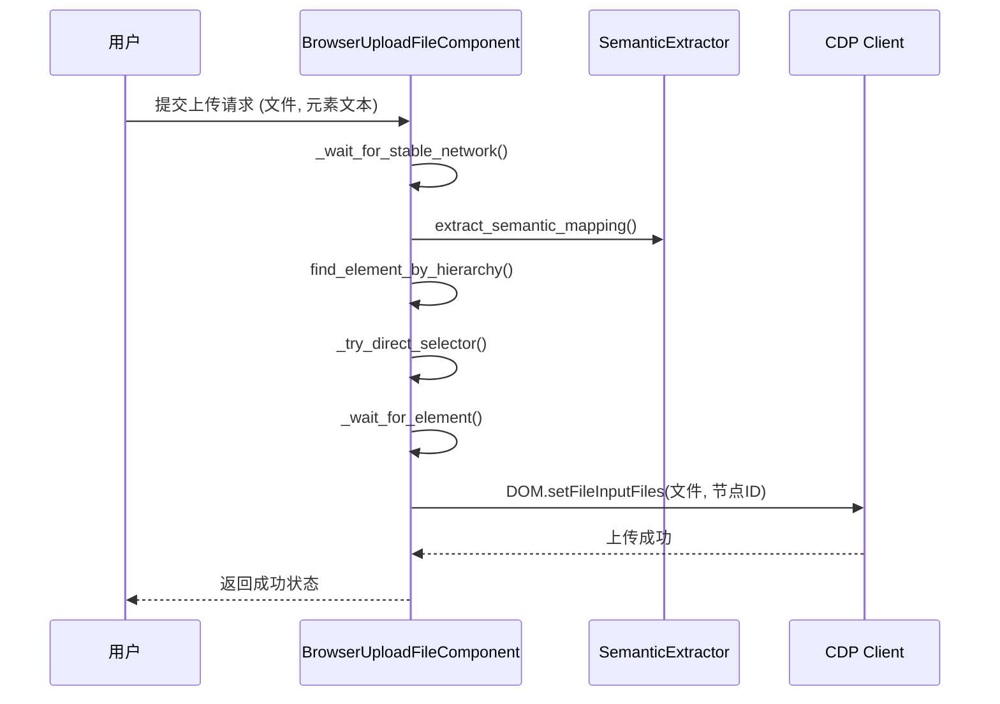
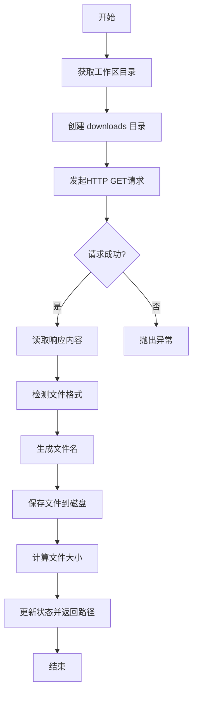
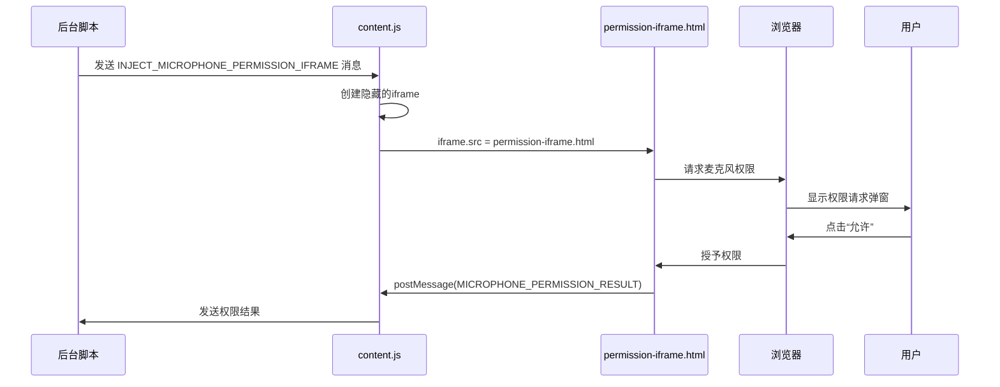
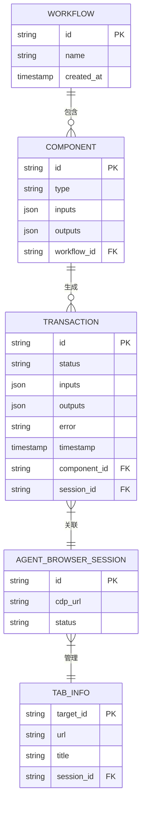

# 高级操作

<cite>
**本文档引用的文件**   
- [page_operations.py](file://vibe_surf/browser/page_operations.py)
- [browser_upload_file.py](file://vibe_surf/workflows/Browser/browser_upload_file.py)
- [browser_download_media.py](file://vibe_surf/workflows/Browser/browser_download_media.py)
- [browser_evaluate_js.py](file://vibe_surf/workflows/Browser/browser_evaluate_js.py)
- [find_page_element.py](file://vibe_surf/browser/find_page_element.py)
- [agent_browser_session.py](file://vibe_surf/browser/agent_browser_session.py)
- [content.js](file://vibe_surf/chrome_extension/content.js)
- [modal-manager.js](file://vibe_surf/chrome_extension/scripts/modal-manager.js)
- [permission-iframe-request.js](file://vibe_surf/chrome_extension/scripts/permission-iframe-request.js)
- [permission-iframe.html](file://vibe_surf/chrome_extension/permission-iframe.html)
- [utils.py](file://vibe_surf/browser/utils.py)
</cite>

## 目录
1. [文件上传下载](#文件上传下载)
2. [弹窗处理](#弹窗处理)
3. [iFrame操作](#iframe操作)
4. [操作链与事务管理](#操作链与事务管理)
5. [实际应用案例](#实际应用案例)

## 文件上传下载

VibeSurf 提供了全面的文件上传和下载功能，支持多种上传方式和下载管理机制。

### 文件上传

文件上传功能通过 `BrowserUploadFileComponent` 类实现，支持多种方式定位上传元素并执行上传操作。

#### 上传方式

1.  **元素文本定位**: 通过 `element_text` 参数指定元素的可见文本，系统会使用语义提取器在页面上查找匹配的元素。
2.  **CSS选择器**: 直接提供精确的CSS选择器，这是最可靠的方式。
3.  **后端节点ID**: 使用浏览器内部的节点ID直接定位元素。
4.  **LLM提示**: 通过自然语言描述元素，利用LLM模型进行智能定位。

#### 实现机制

上传流程的核心是 `browser_upload_file` 方法，其工作流程如下：

1.  **等待网络稳定**: 调用 `_wait_for_stable_network()` 确保页面加载完成。
2.  **元素定位**: 根据输入参数，按优先级顺序尝试定位上传元素。如果使用 `element_text`，会调用 `SemanticExtractor` 进行语义映射查找。
3.  **选择器验证**: 使用 `_try_direct_selector` 和 `_wait_for_element` 等函数验证和获取最终使用的CSS选择器。
4.  **执行上传**: 通过Chrome DevTools Protocol (CDP) 的 `DOM.setFileInputFiles` 命令，将文件路径设置到目标输入框。

**Diagram sources**
- [browser_upload_file.py](file://vibe_surf/workflows/Browser/browser_upload_file.py#L85-L183)
- [find_page_element.py](file://vibe_surf/browser/find_page_element.py#L18-L800)
- [page_operations.py](file://vibe_surf/browser/page_operations.py#L100-L223)

### 文件下载

文件下载功能由 `BrowserDownloadMediaComponent` 类提供，主要用于从指定URL下载媒体文件。

#### 下载管理

1.  **下载路径**: 文件默认保存在工作区的 `workflows/downloads` 目录下。
2.  **文件名处理**: 支持自定义文件名。若未提供，则从URL路径或时间戳生成，并通过 `_detect_file_format` 函数自动检测并添加正确的文件扩展名。
3.  **进度跟踪**: 虽然代码中未直接显示进度条，但通过 `aiohttp` 库的异步下载和 `Content-Length` 头信息，系统可以监控下载状态。下载完成后，会计算文件大小并通过 `_format_file_size` 格式化显示。

#### 实现机制

`download_media` 方法的执行流程：

1.  **创建下载目录**: 使用 `os.makedirs` 确保 `downloads` 目录存在。
2.  **发起HTTP请求**: 使用 `aiohttp.ClientSession` 发起GET请求，支持代理设置。
3.  **读取内容**: 一次性读取响应体内容到内存。
4.  **格式检测**: 根据URL、响应头和文件内容检测文件格式。
5.  **文件保存**: 使用 `Path.write_bytes()` 将内容写入文件。
6.  **状态更新**: 记录下载的文件路径和大小。

**Diagram sources**
- [browser_download_media.py](file://vibe_surf/workflows/Browser/browser_download_media.py#L48-L113)
- [tools/utils.py](file://vibe_surf/tools/utils.py)

**Section sources**
- [browser_download_media.py](file://vibe_surf/workflows/Browser/browser_download_media.py#L1-L113)

## 弹窗处理

VibeSurf 通过其Chrome扩展程序实现了对JavaScript弹窗、系统对话框和自定义模态框的自动化处理。

### JavaScript弹窗

对于 `alert`, `confirm`, `prompt` 等原生JavaScript弹窗，VibeSurf 依赖于Chrome DevTools Protocol (CDP) 的 `Page.javascriptDialogOpening` 事件。当页面尝试打开一个对话框时，CDP会通知后端，后端可以自动调用 `Page.handleJavaScriptDialog` 来接受或拒绝对话框，从而实现无感知的自动化处理。

### 系统对话框

处理系统级权限请求（如麦克风、摄像头）是VibeSurf的一个关键功能。其核心机制是通过注入一个隐藏的iframe来请求权限。

#### 实现机制

1.  **注入iframe**: `content.js` 中的 `injectMicrophonePermissionIframe` 方法会在页面中创建一个隐藏的iframe，并将其 `src` 指向扩展程序内的 `permission-iframe.html`。
2.  **iframe内请求**: `permission-iframe.html` 加载后，其内部的 `permission-iframe-request.js` 脚本会立即调用 `navigator.mediaDevices.getUserMedia()` 来请求麦克风权限。
3.  **权限授予**: 由于iframe是扩展程序的一部分，它拥有更高的权限，因此可以成功请求并获得用户的授权。
4.  **结果通信**: 授权结果通过 `window.postMessage` 发送回 `content.js`，`content.js` 再通过 `chrome.runtime.sendMessage` 将结果传递给扩展程序的后台脚本，从而完成整个流程。

**Diagram sources**
- [content.js](file://vibe_surf/chrome_extension/content.js#L296-L392)
- [permission-iframe-request.js](file://vibe_surf/chrome_extension/scripts/permission-iframe-request.js#L1-L31)
- [permission-iframe.html](file://vibe_surf/chrome_extension/permission-iframe.html)

### 自定义模态框

对于页面上的自定义模态框（Modal），VibeSurf 使用 `modal-manager.js` 进行管理。

#### 处理策略

1.  **模态框创建**: `VibeSurfModalManager` 类提供了 `showWarningModal`, `showConfirmModal` 等方法，用于创建不同类型的模态框。
2.  **事件绑定**: 为模态框的确认、取消和关闭按钮绑定事件监听器。
3.  **异步处理**: 提供 `showConfirmModalAsync` 等Promise-based方法，允许调用者以异步方式等待用户交互结果。
4.  **样式与交互**: 模态框具有现代化的UI设计，支持ESC键关闭、点击背景关闭等交互。

**Section sources**
- [modal-manager.js](file://vibe_surf/chrome_extension/scripts/modal-manager.js#L1-L496)
- [content.js](file://vibe_surf/chrome_extension/content.js#L44-L103)

## iFrame操作

VibeSurf 支持对页面中的iFrame进行上下文切换和交互操作。

### 上下文切换机制

1.  **CDP会话管理**: `AgentBrowserSession` 类通过 `CDPSession` 管理与浏览器的连接。每个标签页或iFrame都有一个独立的CDP会话。
2.  **会话池**: `AgentBrowserSession` 维护一个 `_cdp_session_pool`，用于存储和管理所有已连接的CDP会话。
3.  **会话切换**: 通过 `connect_agent` 方法，可以将当前操作的上下文（`agent_focus`）切换到指定 `target_id` 的会话上，从而实现对不同iFrame的控制。

### 多层嵌套iFrame定位

虽然当前代码中没有直接展示多层嵌套iFrame的遍历逻辑，但其基础架构支持此功能。理论上，可以通过以下步骤实现：
1.  首先定位到最外层的iFrame元素。
2.  切换到该iFrame的CDP会话。
3.  在该会话中，再次查找内部的iFrame元素。
4.  重复步骤2和3，直到到达目标iFrame。

**Section sources**
- [agent_browser_session.py](file://vibe_surf/browser/agent_browser_session.py#L696-L711)
- [content.js](file://vibe_surf/chrome_extension/content.js)

## 操作链和事务管理

VibeSurf 通过工作流（Workflow）组件和事务日志来确保复杂操作序列的原子性和一致性。

### 操作链

1.  **组件化**: 每个操作（如点击、输入、上传）都被封装成一个独立的 `Component`。
2.  **链式执行**: 这些组件可以被连接成一个工作流，前一个组件的输出作为后一个组件的输入，形成一个操作链。
3.  **状态传递**: `AgentBrowserSession` 对象在组件间传递，确保了浏览器状态的连续性。

### 事务管理

1.  **事务日志**: 系统会记录每个操作的执行情况，包括输入、输出、状态和错误信息。
2.  **原子性保证**: 虽然代码中未明确实现数据库事务，但每个组件的执行是原子的。如果某个步骤失败，异常会被抛出，阻止后续操作的执行。
3.  **状态回滚**: 通过 `refresh_page` 等方法，可以在操作失败后重置页面状态，为重试或回滚提供支持。

**Diagram sources**
- [browser_session.py](file://vibe_surf/workflows/Browser/browser_session.py)
- [browser_click_element.py](file://vibe_surf/workflows/Browser/browser_click_element.py)
- [database/models/transactions/model.py](file://vibe_surf/langflow/services/database/models/transactions/model.py)

## 实际应用案例

### 案例一：自动化文件上传表单

**场景**: 用户需要在一个复杂的表单中上传简历文件。

**操作序列**:
1.  导航至表单页面 (`browser_navigate.py`)。
2.  填写文本字段 (`browser_input_text.py`)。
3.  定位“上传简历”按钮，并通过 `browser_upload_file.py` 组件上传文件。
4.  点击提交按钮 (`browser_click_element.py`)。

**关键点**: `browser_upload_file.py` 组件能够通过文本“上传简历”准确找到文件输入框，并处理文件选择对话框。

### 案例二：处理权限请求并下载内容

**场景**: 用户访问一个需要麦克风权限才能播放音频的网站，并希望下载音频。

**操作序列**:
1.  导航至目标网站。
2.  系统自动检测到麦克风权限请求，触发 `INJECT_MICROPHONE_PERMISSION_IFRAME` 流程。
3.  用户在浏览器弹窗中授权麦克风。
4.  网站开始播放音频，`browser_download_media.py` 组件监控网络请求，捕获音频文件的URL并下载。

**关键点**: 通过隐藏的iframe巧妙地解决了自动化脚本无法直接处理系统权限弹窗的难题。

**Section sources**
- [browser_upload_file.py](file://vibe_surf/workflows/Browser/browser_upload_file.py)
- [browser_download_media.py](file://vibe_surf/workflows/Browser/browser_download_media.py)
- [content.js](file://vibe_surf/chrome_extension/content.js)