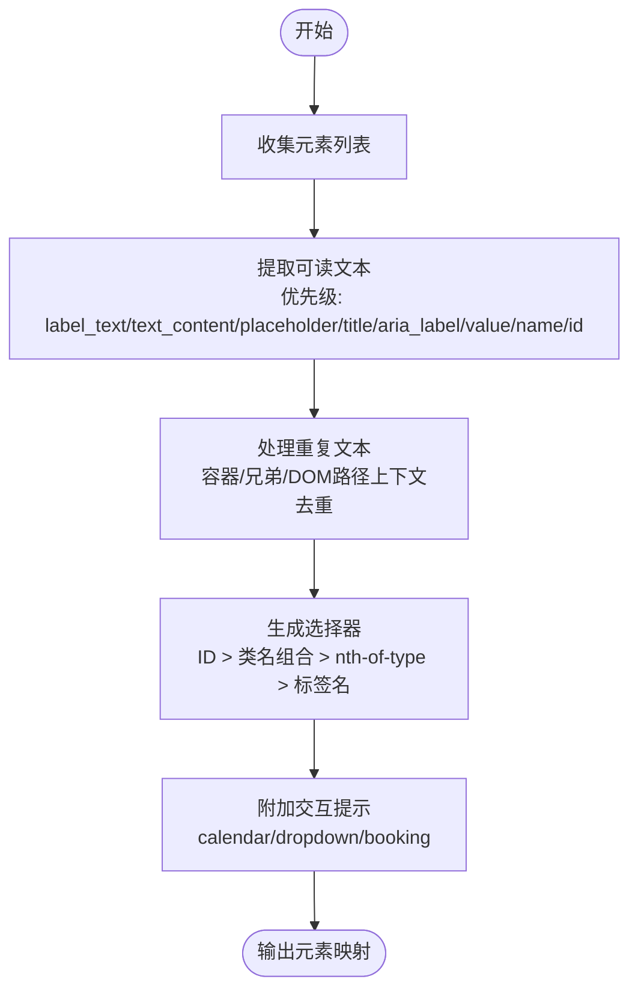

# 浏览器集成

<cite>
**本文引用的文件**
- [manifest.json](file://vibe_surf/chrome_extension/manifest.json)
- [config.js](file://vibe_surf/chrome_extension/config.js)
- [background.js](file://vibe_surf/chrome_extension/background.js)
- [content.js](file://vibe_surf/chrome_extension/content.js)
- [popup.html](file://vibe_surf/chrome_extension/popup.html)
- [permission-iframe.html](file://vibe_surf/chrome_extension/permission-iframe.html)
- [permission-iframe-request.js](file://vibe_surf/chrome_extension/scripts/permission-iframe-request.js)
- [permission-request.html](file://vibe_surf/chrome_extension/permission-request.html)
- [permission-request.js](file://vibe_surf/chrome_extension/scripts/permission-request.js)
- [find_page_element.py](file://vibe_surf/browser/find_page_element.py)
- [page_operations.py](file://vibe_surf/browser/page_operations.py)
- [utils.py](file://vibe_surf/browser/utils.py)
- [browser_manager.py](file://vibe_surf/browser/browser_manager.py)
- [agent_browser_session.py](file://vibe_surf/browser/agent_browser_session.py)
- [agen_browser_profile.py](file://vibe_surf/browser/agen_browser_profile.py)
- [browser_use_agent.py](file://vibe_surf/agents/browser_use_agent.py)
- [vibe_surf_prompt.py](file://vibe_surf/agents/prompts/vibe_surf_prompt.py)
</cite>

## 目录
1. [简介](#简介)
2. [项目结构](#项目结构)
3. [核心组件](#核心组件)
4. [架构总览](#架构总览)
5. [详细组件分析](#详细组件分析)
6. [依赖关系分析](#依赖关系分析)
7. [性能考量](#性能考量)
8. [故障排查指南](#故障排查指南)
9. [结论](#结论)
10. [附录](#附录)

## 简介
本文件系统化文档化 VibeSurf 的浏览器集成功能，覆盖 Chrome 扩展与后端浏览器管理系统的协同工作方式。重点包括：
- Chrome 扩展的架构与实现：content.js、background.js、popup.html 的交互机制
- 浏览器管理系统：标签管理、会话控制、资源监控
- DOM 操作与页面元素定位：find_page_element.py 中的语义提取与选择器生成算法
- 自动化命令执行流程：从用户操作到实际浏览器动作的转换过程
- 兼容性说明与安全考虑：权限管理、沙箱机制与隐私保护

## 项目结构
VibeSurf 将浏览器自动化能力分为三层：
- 前端扩展层（Chrome Extension）：负责与网页内容脚本交互、侧边面板、通知与剪贴板等
- 后端浏览器管理层：通过 CDP 管理会话、目标（标签页）、安全策略与资源监控
- 工具与算法层：DOM 语义提取、截图高亮、滚动与等待策略

图表来源
- [manifest.json](file://vibe_surf/chrome_extension/manifest.json#L1-L70)
- [background.js](file://vibe_surf/chrome_extension/background.js#L1-L120)
- [content.js](file://vibe_surf/chrome_extension/content.js#L1-L120)
- [popup.html](file://vibe_surf/chrome_extension/popup.html#L1-L134)
- [config.js](file://vibe_surf/chrome_extension/config.js#L1-L56)
- [permission-iframe.html](file://vibe_surf/chrome_extension/permission-iframe.html)
- [browser_manager.py](file://vibe_surf/browser/browser_manager.py#L1-L120)
- [agent_browser_session.py](file://vibe_surf/browser/agent_browser_session.py#L831-L849)
- [agen_browser_profile.py](file://vibe_surf/browser/agen_browser_profile.py#L36-L59)
- [find_page_element.py](file://vibe_surf/browser/find_page_element.py#L1-L120)
- [page_operations.py](file://vibe_surf/browser/page_operations.py#L1-L120)
- [utils.py](file://vibe_surf/browser/utils.py#L666-L786)

章节来源
- [manifest.json](file://vibe_surf/chrome_extension/manifest.json#L1-L70)
- [background.js](file://vibe_surf/chrome_extension/background.js#L1-L120)
- [content.js](file://vibe_surf/chrome_extension/content.js#L1-L120)
- [popup.html](file://vibe_surf/chrome_extension/popup.html#L1-L134)
- [config.js](file://vibe_surf/chrome_extension/config.js#L1-L56)
- [browser_manager.py](file://vibe_surf/browser/browser_manager.py#L1-L120)
- [agent_browser_session.py](file://vibe_surf/browser/agent_browser_session.py#L831-L849)
- [find_page_element.py](file://vibe_surf/browser/find_page_element.py#L1-L120)
- [page_operations.py](file://vibe_surf/browser/page_operations.py#L1-L120)
- [utils.py](file://vibe_surf/browser/utils.py#L666-L786)

## 核心组件
- 扩展后台（background.js）：处理安装/启动、动作按钮点击、消息路由、侧边面板打开、通知、剪贴板、文件打开、麦克风权限请求等
- 内容脚本（content.js）：监听页面事件（点击/输入/按键/滚动），注入隐藏 iframe 请求麦克风权限，向背景发送上下文与事件
- 弹出面板（popup.html）：快速打开侧边面板、检查后端状态
- 配置（config.js）：集中管理后端地址、超时重试、通知与 UI 设置
- 权限请求页（permission-iframe.html + permission-iframe-request.js）：在隐藏 iframe 中触发媒体设备权限，回传结果给内容脚本/背景
- 浏览器管理（browser_manager.py）：为代理创建隔离会话、分配/回收目标（标签）、关闭清理
- 代理会话（agent_browser_session.py）：挂载安全看门狗、默认动作看门狗，连接 CDP
- DOM 提取（find_page_element.py）：基于可见文本与 ARIA/数据属性生成确定性选择器，处理重复与层级上下文
- 页面操作（page_operations.py）：滚动到文本、直接选择器尝试、等待元素出现
- 截图高亮（utils.py）：根据设备像素比与视口偏移，将 DOM 位置映射到截图坐标，绘制高亮框与索引标注

章节来源
- [background.js](file://vibe_surf/chrome_extension/background.js#L1-L200)
- [content.js](file://vibe_surf/chrome_extension/content.js#L1-L200)
- [popup.html](file://vibe_surf/chrome_extension/popup.html#L1-L134)
- [config.js](file://vibe_surf/chrome_extension/config.js#L1-L56)
- [permission-iframe.html](file://vibe_surf/chrome_extension/permission-iframe.html)
- [permission-iframe-request.js](file://vibe_surf/chrome_extension/scripts/permission-iframe-request.js#L1-L176)
- [browser_manager.py](file://vibe_surf/browser/browser_manager.py#L1-L120)
- [agent_browser_session.py](file://vibe_surf/browser/agent_browser_session.py#L831-L849)
- [find_page_element.py](file://vibe_surf/browser/find_page_element.py#L1-L220)
- [page_operations.py](file://vibe_surf/browser/page_operations.py#L1-L120)
- [utils.py](file://vibe_surf/browser/utils.py#L666-L786)

## 架构总览
扩展与后端通过消息通道协作，内容脚本负责采集页面上下文与事件，后台统一调度与存储，浏览器管理器负责多代理隔离与目标分配，工具层提供 DOM 语义提取与可视化增强。

图表来源
- [popup.html](file://vibe_surf/chrome_extension/popup.html#L80-L134)
- [background.js](file://vibe_surf/chrome_extension/background.js#L100-L180)
- [content.js](file://vibe_surf/chrome_extension/content.js#L40-L120)
- [permission-iframe.html](file://vibe_surf/chrome_extension/permission-iframe.html)
- [permission-iframe-request.js](file://vibe_surf/chrome_extension/scripts/permission-iframe-request.js#L1-L176)
- [browser_manager.py](file://vibe_surf/browser/browser_manager.py#L47-L120)
- [agent_browser_session.py](file://vibe_surf/browser/agent_browser_session.py#L831-L849)

## 详细组件分析

### 组件A：Chrome 扩展交互机制（content.js ↔ background.js）
- 事件捕获与转发
  - 内容脚本监听点击、输入、按键、滚动事件，仅在录制状态下转发自定义事件到后台
  - 支持滚动去抖、坐标记录、frameUrl 上报
- 页面上下文与文本链接
  - 收集页面元信息、表单/表格/链接/图片/输入数量，提供 GET_PAGE_CONTEXT
  - 提供 GET_PAGE_TEXT、GET_PAGE_LINKS、SCROLL_TO_ELEMENT、HIGHLIGHT_ELEMENT、CLICK_ELEMENT 等便捷方法
- 录制状态同步
  - 初始化时查询后台录制状态，动态切换事件捕获开关
- 麦克风权限请求
  - 注入隐藏 iframe，加载权限页，通过 postMessage 回传结果；后台再广播给所有标签
- 选择器生成
  - 基于元素 ID/类名/nth-child 生成稳定 CSS 选择器，保证唯一性校验

图表来源
- [content.js](file://vibe_surf/chrome_extension/content.js#L28-L120)
- [content.js](file://vibe_surf/chrome_extension/content.js#L416-L550)
- [content.js](file://vibe_surf/chrome_extension/content.js#L571-L708)
- [background.js](file://vibe_surf/chrome_extension/background.js#L160-L298)

章节来源
- [content.js](file://vibe_surf/chrome_extension/content.js#L1-L200)
- [content.js](file://vibe_surf/chrome_extension/content.js#L416-L550)
- [content.js](file://vibe_surf/chrome_extension/content.js#L571-L708)
- [background.js](file://vibe_surf/chrome_extension/background.js#L160-L298)

### 组件B：浏览器管理与会话控制（browser_manager.py）
- 多代理隔离
  - 为每个代理注册独立 AgentBrowserSession，共享根 CDP 客户端
- 目标分配与回收
  - 通过 Target.createTarget 创建新标签，assign/unassign 目标并进行所有权校验
- 清理与关闭
  - 可选关闭标签，断开会话，退出上下文管理器自动清理
- 活跃目标检测
  - 通过 CDP Runtime.evaluate 判断可见性与焦点，优先返回活跃目标

图表来源
- [browser_manager.py](file://vibe_surf/browser/browser_manager.py#L1-L186)
- [agent_browser_session.py](file://vibe_surf/browser/agent_browser_session.py#L831-L849)

章节来源
- [browser_manager.py](file://vibe_surf/browser/browser_manager.py#L1-L186)
- [agent_browser_session.py](file://vibe_surf/browser/agent_browser_session.py#L831-L849)

### 组件C：DOM 语义提取与元素定位（find_page_element.py）
- 语义映射
  - 依据 ARIA 角色、标签类型、占位符、标题、值等生成可读文本
  - 为重复文本添加容器/兄弟/DOM 路径等上下文以去重
- 选择器生成
  - 优先使用 ID；否则按标签+类名组合；必要时使用 nth-of-type；最终回退到标签名
  - 支持数据属性（data-*）、测试标识（data-testid）等增强选择器
- 交互提示
  - 识别日历、下拉、预订等控件并附加交互提示（如 click_date/select_option 等）

图表来源
- [find_page_element.py](file://vibe_surf/browser/find_page_element.py#L1-L220)
- [find_page_element.py](file://vibe_surf/browser/find_page_element.py#L211-L360)
- [find_page_element.py](file://vibe_surf/browser/find_page_element.py#L360-L780)

章节来源
- [find_page_element.py](file://vibe_surf/browser/find_page_element.py#L1-L220)
- [find_page_element.py](file://vibe_surf/browser/find_page_element.py#L211-L360)
- [find_page_element.py](file://vibe_surf/browser/find_page_element.py#L360-L780)

### 组件D：页面操作与等待策略（page_operations.py）
- 滚动到文本
  - 使用 DOM.performSearch + getDocument + scrollIntoViewIfNeeded；失败回退 JS TreeWalker
- 直接选择器尝试
  - 对目标文本进行清洗与变体尝试（ID/name/data-testid/大小写/驼峰），并验证可见性
- 等待元素出现
  - 循环轮询 CSS 选择器，支持超时与多选择器回退

图表来源
- [page_operations.py](file://vibe_surf/browser/page_operations.py#L1-L120)
- [page_operations.py](file://vibe_surf/browser/page_operations.py#L100-L173)
- [page_operations.py](file://vibe_surf/browser/page_operations.py#L175-L223)

章节来源
- [page_operations.py](file://vibe_surf/browser/page_operations.py#L1-L120)
- [page_operations.py](file://vibe_surf/browser/page_operations.py#L100-L173)
- [page_operations.py](file://vibe_surf/browser/page_operations.py#L175-L223)

### 组件E：截图高亮与坐标映射（utils.py）
- 设备像素比与视口偏移
  - 通过 Page.getLayoutMetrics 获取 devicePixelRatio、scrollX、scrollY
- 截图高亮
  - 将 DOM 绝对位置映射到设备像素坐标，绘制半透明填充、轮廓与索引文字，避免标签重叠
- 字体与颜色
  - 优先系统字体，生成互不重叠的高对比度颜色序列

图表来源
- [utils.py](file://vibe_surf/browser/utils.py#L666-L786)
- [utils.py](file://vibe_surf/browser/utils.py#L731-L759)

章节来源
- [utils.py](file://vibe_surf/browser/utils.py#L666-L786)
- [utils.py](file://vibe_surf/browser/utils.py#L731-L759)

### 组件F：弹出面板与后台状态（popup.html + background.js）
- 弹出面板
  - 打开侧边面板；检查后端健康状态并在 UI 上展示连接状态
- 后台
  - 处理 GET_BACKEND_STATUS、SHOW_NOTIFICATION、COPY_TO_CLIPBOARD、OPEN_FILE_URL/FILE_SYSTEM 等消息
  - 通过 chrome.sidePanel.open 打开侧面板，兼容旧版回退到新建标签页

章节来源
- [popup.html](file://vibe_surf/chrome_extension/popup.html#L80-L134)
- [background.js](file://vibe_surf/chrome_extension/background.js#L100-L180)
- [background.js](file://vibe_surf/chrome_extension/background.js#L451-L486)

## 依赖关系分析
- 扩展权限与清单
  - manifest.json 声明 activeTab、storage、notifications、sidePanel、contextMenus、tabs、clipboardWrite、scripting、downloads 等权限
  - host_permissions 包含 localhost/127.0.0.1 与 all_urls，允许跨域访问
- 配置集中化
  - config.js 导出 VIBESURF_CONFIG，供 content/background 使用，便于统一后端地址与超时策略
- 扩展与浏览器管理耦合
  - background.js 通过 WorkflowRecorder 与 content.js 协作；browser_manager.py 与 agent_browser_session.py 通过 CDP 客户端连接
- DOM 提取与页面操作
  - find_page_element.py 输出选择器映射，page_operations.py 基于选择器执行滚动/等待/点击等动作
- 可视化增强
  - utils.py 将 DOM 坐标映射到截图坐标，生成高亮截图

图表来源
- [manifest.json](file://vibe_surf/chrome_extension/manifest.json#L1-L70)
- [config.js](file://vibe_surf/chrome_extension/config.js#L1-L56)
- [background.js](file://vibe_surf/chrome_extension/background.js#L1-L120)
- [content.js](file://vibe_surf/chrome_extension/content.js#L1-L120)
- [browser_manager.py](file://vibe_surf/browser/browser_manager.py#L1-L120)
- [agent_browser_session.py](file://vibe_surf/browser/agent_browser_session.py#L831-L849)
- [find_page_element.py](file://vibe_surf/browser/find_page_element.py#L1-L120)
- [page_operations.py](file://vibe_surf/browser/page_operations.py#L1-L120)
- [utils.py](file://vibe_surf/browser/utils.py#L666-L786)

章节来源
- [manifest.json](file://vibe_surf/chrome_extension/manifest.json#L1-L70)
- [config.js](file://vibe_surf/chrome_extension/config.js#L1-L56)
- [background.js](file://vibe_surf/chrome_extension/background.js#L1-L120)
- [content.js](file://vibe_surf/chrome_extension/content.js#L1-L120)
- [browser_manager.py](file://vibe_surf/browser/browser_manager.py#L1-L120)
- [agent_browser_session.py](file://vibe_surf/browser/agent_browser_session.py#L831-L849)
- [find_page_element.py](file://vibe_surf/browser/find_page_element.py#L1-L120)
- [page_operations.py](file://vibe_surf/browser/page_operations.py#L1-L120)
- [utils.py](file://vibe_surf/browser/utils.py#L666-L786)

## 性能考量
- 事件捕获与去抖
  - 滚动事件采用 500ms 去抖，减少高频事件传输
- 选择器生成复杂度
  - find_page_element.py 通过 ID 优先、类名组合与 nth-of-type 降低歧义，时间复杂度与 DOM 结构深度相关
- 截图高亮
  - 仅对有效元素绘制，避免重叠标签；字体加载缓存减少重复 IO
- CDP 操作
  - page_operations.py 使用 DOM.performSearch + getSearchResults，失败回退 JS TreeWalker，平衡性能与稳定性

[本节为通用指导，无需特定文件引用]

## 故障排查指南
- 无法打开侧边面板
  - 检查 chrome.sidePanel.open 是否可用；若不可用，后台会回退到新建标签页
  - 参考：[background.js](file://vibe_surf/chrome_extension/background.js#L104-L158)
- 事件未被捕获
  - 确认 content.js 的 isRecording 状态；检查后台是否正确转发消息
  - 参考：[content.js](file://vibe_surf/chrome_extension/content.js#L28-L60)
- 麦克风权限失败
  - 检查 permission-iframe.html 是否被注入；确认 postMessage 广播是否到达后台
  - 参考：[content.js](file://vibe_surf/chrome_extension/content.js#L295-L398)、[permission-iframe-request.js](file://vibe_surf/chrome_extension/scripts/permission-iframe-request.js#L1-L176)
- 文本滚动失败
  - 查看 DOM.performSearch 与 JS TreeWalker 回退路径
  - 参考：[page_operations.py](file://vibe_surf/browser/page_operations.py#L1-L98)
- 选择器不稳定
  - 使用 find_page_element.py 的去重策略与上下文增强
  - 参考：[find_page_element.py](file://vibe_surf/browser/find_page_element.py#L166-L210)
- 截图高亮异常
  - 检查 devicePixelRatio 与视口偏移计算
  - 参考：[utils.py](file://vibe_surf/browser/utils.py#L731-L759)

章节来源
- [background.js](file://vibe_surf/chrome_extension/background.js#L104-L158)
- [content.js](file://vibe_surf/chrome_extension/content.js#L28-L60)
- [content.js](file://vibe_surf/chrome_extension/content.js#L295-L398)
- [permission-iframe-request.js](file://vibe_surf/chrome_extension/scripts/permission-iframe-request.js#L1-L176)
- [page_operations.py](file://vibe_surf/browser/page_operations.py#L1-L98)
- [find_page_element.py](file://vibe_surf/browser/find_page_element.py#L166-L210)
- [utils.py](file://vibe_surf/browser/utils.py#L731-L759)

## 结论
VibeSurf 的浏览器集成通过扩展与后端管理的紧密协作，实现了稳定的页面事件捕获、语义化 DOM 提取与可视化高亮、以及多代理隔离的会话管理。内容脚本与后台的消息通道确保了前端与后端的一致性，而工具层的算法与策略则提升了自动化任务的鲁棒性与可解释性。

[本节为总结性内容，无需特定文件引用]

## 附录

### 浏览器兼容性说明
- Manifest 版本与 API
  - manifest_version: 3，使用 service_worker（type: "module"）
  - 依赖 sidePanel API；若不可用，回退到新建标签页
- 主机权限
  - host_permissions 包含 http/https 本地回环与 file:///*，满足开发与本地文件访问需求
- 安全上下文要求
  - 麦克风权限请求需在安全上下文中进行（HTTPS），iframe 注入与 postMessage 用于跨上下文通信

章节来源
- [manifest.json](file://vibe_surf/chrome_extension/manifest.json#L1-L70)
- [background.js](file://vibe_surf/chrome_extension/background.js#L104-L158)
- [permission-iframe-request.js](file://vibe_surf/chrome_extension/scripts/permission-iframe-request.js#L1-L176)

### 浏览器安全考虑
- 权限管理
  - 扩展声明最小权限集合；剪贴板访问通过 content script 注入执行，避免在 service worker 中直接调用
  - 参考：[background.js](file://vibe_surf/chrome_extension/background.js#L697-L775)
- 沙箱机制
  - 代理会话挂载 SecurityWatchdog 与 PopupsWatchdog，限制导航与弹窗行为
  - 参考：[agent_browser_session.py](file://vibe_surf/browser/agent_browser_session.py#L831-L849)
- 隐私保护
  - 仅在录制状态下捕获用户交互；权限请求通过隐藏 iframe 触发，避免暴露敏感信息
  - 参考：[content.js](file://vibe_surf/chrome_extension/content.js#L295-L398)
- 安全提示
  - 当未设置 allowed_domains 时，代理会发出安全警告，建议限制可访问域名
  - 参考：[browser_use_agent.py](file://vibe_surf/agents/browser_use_agent.py#L316-L356)
  - 安全与安全指南在提示词中明确禁止危险操作
  - 参考：[vibe_surf_prompt.py](file://vibe_surf/agents/prompts/vibe_surf_prompt.py#L206-L218)

章节来源
- [background.js](file://vibe_surf/chrome_extension/background.js#L697-L775)
- [agent_browser_session.py](file://vibe_surf/browser/agent_browser_session.py#L831-L849)
- [content.js](file://vibe_surf/chrome_extension/content.js#L295-L398)
- [browser_use_agent.py](file://vibe_surf/agents/browser_use_agent.py#L316-L356)
- [vibe_surf_prompt.py](file://vibe_surf/agents/prompts/vibe_surf_prompt.py#L206-L218)