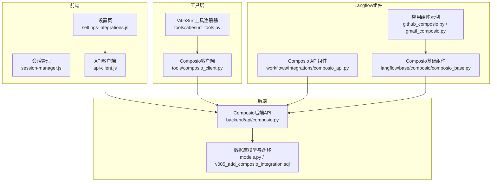
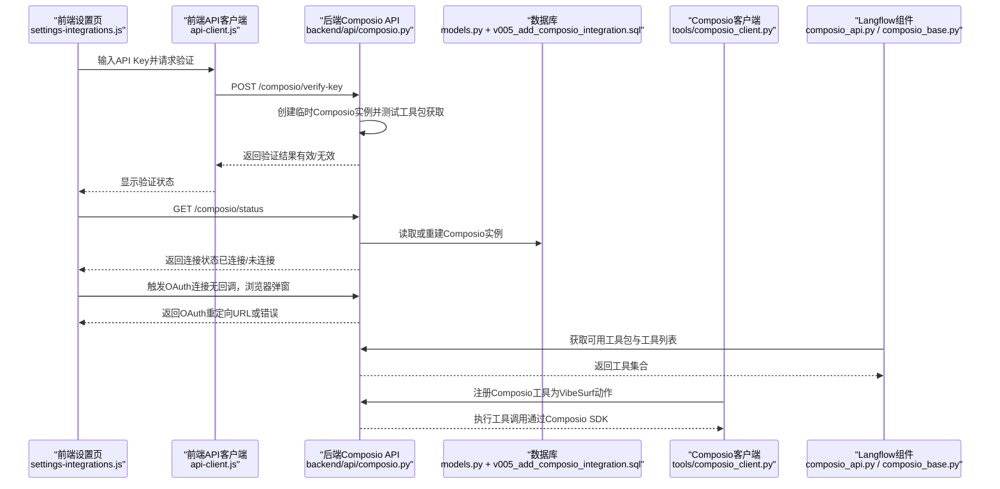
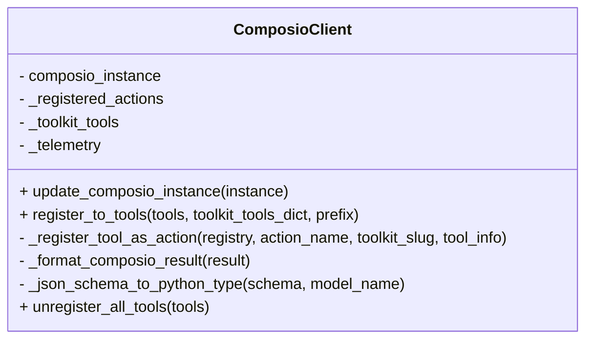
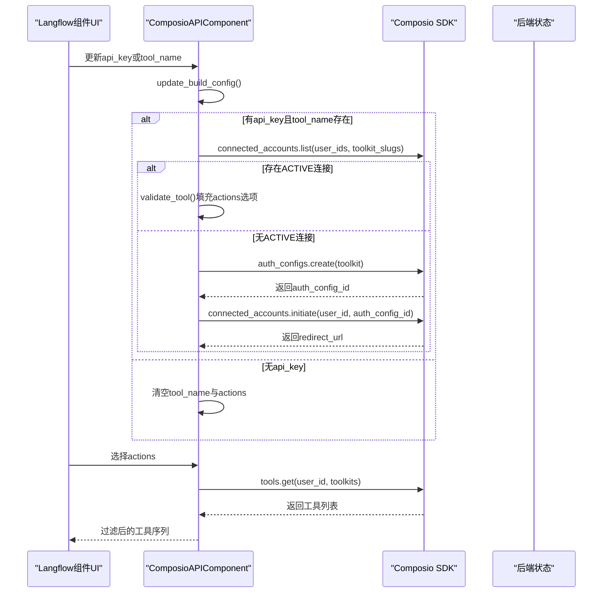
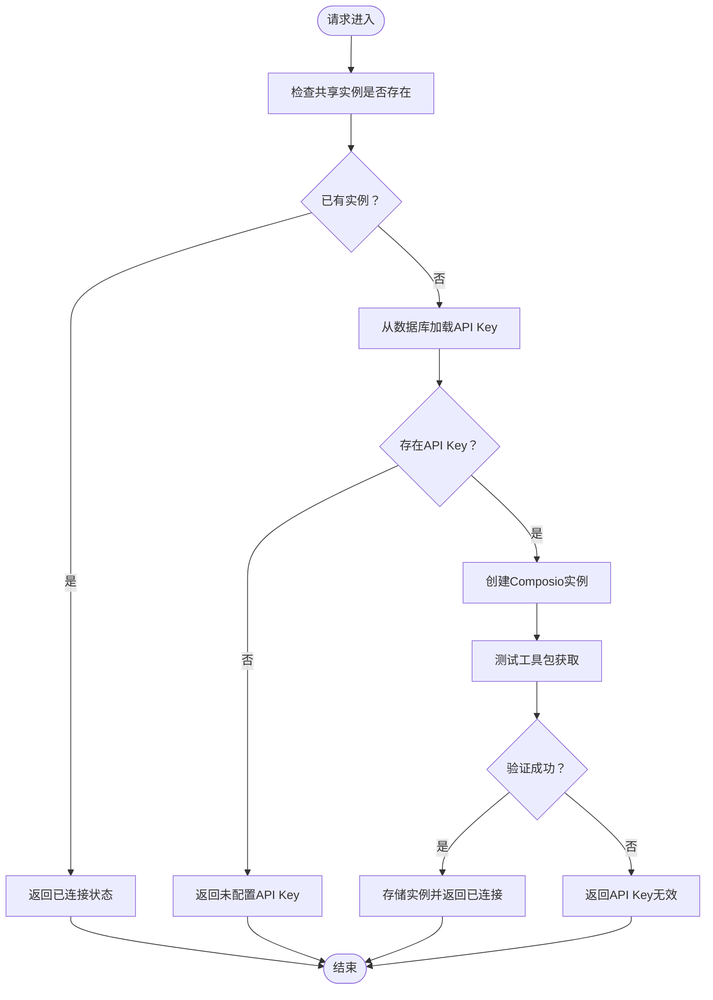
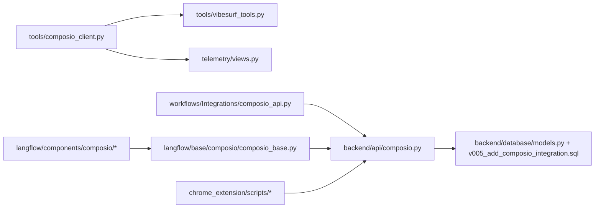

# Composio集成

<cite>
**本文引用的文件**
- [composio_client.py](file://vibe_surf/tools/composio_client.py)
- [composio_api.py](file://vibe_surf/workflows/Integrations/composio_api.py)
- [composio.py（后端API）](file://vibe_surf/backend/api/composio.py)
- [vibesurf_tools.py](file://vibe_surf/tools/vibesurf_tools.py)
- [models.py（数据库模型）](file://vibe_surf/backend/database/models.py)
- [v005_add_composio_integration.sql](file://vibe_surf/backend/database/migrations/v005_add_composio_integration.sql)
- [composio_base.py（Langflow基础组件）](file://vibe_surf/langflow/base/composio/composio_base.py)
- [github_composio.py](file://vibe_surf/langflow/components/composio/github_composio.py)
- [gmail_composio.py](file://vibe_surf/langflow/components/composio/gmail_composio.py)
- [views.py（遥测事件定义）](file://vibe_surf/telemetry/views.py)
- [api-client.js（前端API客户端）](file://vibe_surf/chrome_extension/scripts/api-client.js)
- [settings-integrations.js（前端设置页）](file://vibe_surf/chrome_extension/scripts/settings-integrations.js)
- [session-manager.js（会话管理）](file://vibe_surf/chrome_extension/scripts/session-manager.js)
</cite>

## 目录
1. [简介](#简介)
2. [项目结构](#项目结构)
3. [核心组件](#核心组件)
4. [架构总览](#架构总览)
5. [详细组件分析](#详细组件分析)
6. [依赖关系分析](#依赖关系分析)
7. [性能考虑](#性能考虑)
8. [故障排查指南](#故障排查指南)
9. [结论](#结论)
10. [附录：配置与使用示例](#附录配置与使用示例)

## 简介
本文件系统性文档化VibeSurf通过Composio实现的第三方服务集成机制，重点覆盖以下方面：
- composio_client.py中的客户端实现：认证流程、API调用封装、参数Schema到Pydantic模型的转换、ActionResult结果格式化、错误处理与遥测采集。
- composio_api.py中的集成模式：如何将Composio的服务能力与VibeSurf工作流结合，包括工具选择、OAuth连接、工具构建与过滤。
- 配置与使用示例：如何在VibeSurf中配置和使用Composio连接器；连接管理、会话持久化与性能优化的实现细节。
- 与Composio API的交互协议、速率限制处理与重试机制：当前代码未显式实现速率限制与重试，但提供了健康检查、状态查询与遥测上报，便于后续扩展。

## 项目结构
围绕Composio集成的关键模块分布如下：
- 工具层（tools）：composio_client.py负责将Composio工具动态注册为VibeSurf动作，并进行参数Schema解析、调用封装与结果格式化。
- 后端API（backend/api）：composio.py提供Composio实例创建、状态检查、密钥验证、OAuth连接状态查询等接口。
- Langflow组件层：composio_api.py与composio_base.py及各应用组件（如github_composio.py、gmail_composio.py）共同构成可视化工作流中的Composio工具集。
- 数据库与迁移：models.py与v005_add_composio_integration.sql定义了composio_toolkits表，用于存储工具包配置与启用状态。
- 前端与会话：chrome_extension脚本负责API Key输入、状态检查、OAuth跳转与会话管理。

图表来源
- [composio_client.py](file://vibe_surf/tools/composio_client.py#L1-L120)
- [composio_api.py](file://vibe_surf/workflows/Integrations/composio_api.py#L1-L120)
- [composio.py（后端API）](file://vibe_surf/backend/api/composio.py#L212-L365)
- [vibesurf_tools.py](file://vibe_surf/tools/vibesurf_tools.py#L2165-L2229)
- [models.py（数据库模型）](file://vibe_surf/backend/database/models.py#L192-L216)
- [v005_add_composio_integration.sql](file://vibe_surf/backend/database/migrations/v005_add_composio_integration.sql#L1-L33)
- [composio_base.py（Langflow基础组件）](file://vibe_surf/langflow/base/composio/composio_base.py#L752-L831)
- [github_composio.py](file://vibe_surf/langflow/components/composio/github_composio.py#L1-L12)
- [gmail_composio.py](file://vibe_surf/langflow/components/composio/gmail_composio.py#L1-L39)
- [api-client.js（前端API客户端）](file://vibe_surf/chrome_extension/scripts/api-client.js#L499-L546)
- [settings-integrations.js（前端设置页）](file://vibe_surf/chrome_extension/scripts/settings-integrations.js#L147-L357)
- [session-manager.js（会话管理）](file://vibe_surf/chrome_extension/scripts/session-manager.js#L52-L81)

章节来源
- [composio_client.py](file://vibe_surf/tools/composio_client.py#L1-L120)
- [composio_api.py](file://vibe_surf/workflows/Integrations/composio_api.py#L1-L120)
- [composio.py（后端API）](file://vibe_surf/backend/api/composio.py#L212-L365)
- [vibesurf_tools.py](file://vibe_surf/tools/vibesurf_tools.py#L2165-L2229)
- [models.py（数据库模型）](file://vibe_surf/backend/database/models.py#L192-L216)
- [v005_add_composio_integration.sql](file://vibe_surf/backend/database/migrations/v005_add_composio_integration.sql#L1-L33)
- [composio_base.py（Langflow基础组件）](file://vibe_surf/langflow/base/composio/composio_base.py#L752-L831)
- [github_composio.py](file://vibe_surf/langflow/components/composio/github_composio.py#L1-L12)
- [gmail_composio.py](file://vibe_surf/langflow/components/composio/gmail_composio.py#L1-L39)
- [api-client.js（前端API客户端）](file://vibe_surf/chrome_extension/scripts/api-client.js#L499-L546)
- [settings-integrations.js（前端设置页）](file://vibe_surf/chrome_extension/scripts/settings-integrations.js#L147-L357)
- [session-manager.js（会话管理）](file://vibe_surf/chrome_extension/scripts/session-manager.js#L52-L81)

## 核心组件
- ComposioClient（工具层）
  - 负责将Composio工具注册为VibeSurf动作，动态解析参数Schema并生成Pydantic模型，封装异步调用，捕获执行时长与错误并上报遥测。
- ComposioAPIComponent（Langflow工作流）
  - 提供可视化界面中的Composio工具选择、OAuth连接状态检查与初始化、工具列表构建与过滤。
- 后端Composio API（backend/api/composio.py）
  - 提供Composio实例创建、状态检查、密钥验证、OAuth连接状态查询与健康检查接口。
- 数据库模型与迁移
  - composio_toolkits表用于存储工具包信息与启用状态，支持索引与触发器维护更新时间。
- 前端设置与会话
  - 设置页负责API Key输入与校验、OAuth链接跳转；会话管理负责会话ID生成与持久化。

章节来源
- [composio_client.py](file://vibe_surf/tools/composio_client.py#L39-L120)
- [composio_api.py](file://vibe_surf/workflows/Integrations/composio_api.py#L25-L121)
- [composio.py（后端API）](file://vibe_surf/backend/api/composio.py#L212-L365)
- [models.py（数据库模型）](file://vibe_surf/backend/database/models.py#L192-L216)
- [v005_add_composio_integration.sql](file://vibe_surf/backend/database/migrations/v005_add_composio_integration.sql#L1-L33)
- [settings-integrations.js（前端设置页）](file://vibe_surf/chrome_extension/scripts/settings-integrations.js#L147-L357)
- [session-manager.js（会话管理）](file://vibe_surf/chrome_extension/scripts/session-manager.js#L52-L81)

## 架构总览
下图展示了从前端到后端再到Composio平台的整体交互路径，以及工具注册与OAuth连接的关键节点。

图表来源
- [settings-integrations.js（前端设置页）](file://vibe_surf/chrome_extension/scripts/settings-integrations.js#L147-L357)
- [api-client.js（前端API客户端）](file://vibe_surf/chrome_extension/scripts/api-client.js#L499-L546)
- [composio.py（后端API）](file://vibe_surf/backend/api/composio.py#L212-L365)
- [models.py（数据库模型）](file://vibe_surf/backend/database/models.py#L192-L216)
- [v005_add_composio_integration.sql](file://vibe_surf/backend/database/migrations/v005_add_composio_integration.sql#L1-L33)
- [composio_api.py](file://vibe_surf/workflows/Integrations/composio_api.py#L122-L235)
- [composio_base.py（Langflow基础组件）](file://vibe_surf/langflow/base/composio/composio_base.py#L752-L831)
- [composio_client.py](file://vibe_surf/tools/composio_client.py#L60-L120)

## 详细组件分析

### ComposioClient（工具层）
- 认证与实例管理
  - 支持延迟注入Composio实例，便于在运行时根据配置动态创建或替换实例。
- 动态注册为VibeSurf动作
  - 接收toolkit_tools_dict，逐个解析工具信息，生成带参数校验的Pydantic模型，包装为异步函数注册到VibeSurf动作注册表。
- 参数Schema解析与类型映射
  - 将JSON Schema中的properties、required、default、enum、nullable等字段映射为Python类型与可选性，必要时递归处理嵌套对象与数组。
- 调用封装与结果格式化
  - 使用composio_instance.tools.execute执行工具，将返回结果格式化为字符串（优先JSON），并封装为ActionResult。
- 错误处理与遥测
  - 捕获异常并记录错误消息，计算执行耗时，上报ComposioTelemetryEvent事件，包含toolkit_slug、tool_name、duration_seconds、error_message等。
- 取消注册
  - 提供unregister_all_tools方法，按前缀批量移除已注册动作，清空内部状态并上报事件。

图表来源
- [composio_client.py](file://vibe_surf/tools/composio_client.py#L39-L458)

章节来源
- [composio_client.py](file://vibe_surf/tools/composio_client.py#L39-L120)
- [composio_client.py](file://vibe_surf/tools/composio_client.py#L128-L299)
- [composio_client.py](file://vibe_surf/tools/composio_client.py#L300-L411)
- [composio_client.py](file://vibe_surf/tools/composio_client.py#L412-L458)

### ComposioAPIComponent（Langflow工作流）
- 配置输入
  - entity_id、api_key、tool_name（下拉选择）、actions（排序列表）等输入项，支持实时刷新与帮助文本提示。
- 工具列表与OAuth连接
  - 根据api_key与tool_name，调用Composio SDK列出可用工具并填充actions选项；若无活跃连接，则通过auth_configs.create与connected_accounts.initiate发起OAuth授权，返回重定向URL供前端打开。
- 工具构建
  - 根据所选actions反推toolkit集合，调用SDK获取全部工具并过滤出目标动作，返回LangChain Tool序列。

图表来源
- [composio_api.py](file://vibe_surf/workflows/Integrations/composio_api.py#L122-L235)
- [composio_api.py](file://vibe_surf/workflows/Integrations/composio_api.py#L237-L280)

章节来源
- [composio_api.py](file://vibe_surf/workflows/Integrations/composio_api.py#L25-L121)
- [composio_api.py](file://vibe_surf/workflows/Integrations/composio_api.py#L122-L235)
- [composio_api.py](file://vibe_surf/workflows/Integrations/composio_api.py#L237-L280)

### 后端Composio API（backend/api/composio.py）
- 实例创建与恢复
  - 从数据库读取API Key并创建Composio实例；若实例失效则清理并尝试重建。
- 状态检查
  - 提供/get_composio_status接口，返回是否已连接、API Key是否存在、实例是否可用等信息。
- 密钥验证
  - 提供/verify-key接口，验证API Key有效性并可选择存储至数据库。
- OAuth连接状态
  - 提供/check-connection-status接口，基于toolkit_slug查询ACTIVE连接状态。
- 健康检查
  - 提供/health接口，返回健康状态与时间戳。

图表来源
- [composio.py（后端API）](file://vibe_surf/backend/api/composio.py#L212-L365)

章节来源
- [composio.py（后端API）](file://vibe_surf/backend/api/composio.py#L212-L365)
- [composio.py（后端API）](file://vibe_surf/backend/api/composio.py#L367-L447)
- [composio.py（后端API）](file://vibe_surf/backend/api/composio.py#L448-L520)
- [composio.py（后端API）](file://vibe_surf/backend/api/composio.py#L521-L600)

### Langflow基础组件与应用组件
- composio_base.py
  - 提供OAuth连接发起、连接状态轮询、断开连接等通用逻辑，支持按应用名查找或创建auth_config并返回redirect_url与connection_id。
- 应用组件示例
  - github_composio.py：定义GitHub应用组件。
  - gmail_composio.py：定义Gmail组件并提供发送邮件、获取邮件等响应后处理逻辑。

章节来源
- [composio_base.py（Langflow基础组件）](file://vibe_surf/langflow/base/composio/composio_base.py#L752-L831)
- [github_composio.py](file://vibe_surf/langflow/components/composio/github_composio.py#L1-L12)
- [gmail_composio.py](file://vibe_surf/langflow/components/composio/gmail_composio.py#L1-L39)

### 数据库模型与迁移
- ComposioToolkit模型
  - 字段：id、name、slug（唯一）、description、logo、app_url、enabled、tools（JSON字符串）、created_at、updated_at。
- 迁移脚本
  - 创建表、索引与自动更新时间戳触发器，确保查询效率与数据一致性。

章节来源
- [models.py（数据库模型）](file://vibe_surf/backend/database/models.py#L192-L216)
- [v005_add_composio_integration.sql](file://vibe_surf/backend/database/migrations/v005_add_composio_integration.sql#L1-L33)

### 前端设置与会话
- 设置页（settings-integrations.js）
  - 负责API Key输入、验证、显示连接状态、触发OAuth跳转。
- API客户端（api-client.js）
  - 提供verifyComposioKey、generateSessionId等方法，支持超时与回退策略。
- 会话管理（session-manager.js）
  - 生成会话ID、加载会话、持久化会话数据，支持活动轮询停止与历史清理。

章节来源
- [settings-integrations.js（前端设置页）](file://vibe_surf/chrome_extension/scripts/settings-integrations.js#L147-L357)
- [api-client.js（前端API客户端）](file://vibe_surf/chrome_extension/scripts/api-client.js#L499-L546)
- [session-manager.js（会话管理）](file://vibe_surf/chrome_extension/scripts/session-manager.js#L52-L81)

## 依赖关系分析
- 组件耦合
  - ComposioClient依赖VibeSurf工具注册表与遥测服务；Langflow组件依赖Composio SDK与后端API；后端API依赖数据库与共享状态。
- 外部依赖
  - Composio SDK、Langchain Provider、SQLite（数据库）。
- 潜在循环依赖
  - 当前模块间通过接口与服务工厂解耦，未见直接循环导入。

图表来源
- [composio_client.py](file://vibe_surf/tools/composio_client.py#L1-L120)
- [vibesurf_tools.py](file://vibe_surf/tools/vibesurf_tools.py#L2165-L2229)
- [views.py（遥测事件定义）](file://vibe_surf/telemetry/views.py#L82-L95)
- [composio_api.py](file://vibe_surf/workflows/Integrations/composio_api.py#L1-L120)
- [composio_base.py（Langflow基础组件）](file://vibe_surf/langflow/base/composio/composio_base.py#L752-L831)
- [composio.py（后端API）](file://vibe_surf/backend/api/composio.py#L212-L365)
- [models.py（数据库模型）](file://vibe_surf/backend/database/models.py#L192-L216)
- [v005_add_composio_integration.sql](file://vibe_surf/backend/database/migrations/v005_add_composio_integration.sql#L1-L33)
- [settings-integrations.js（前端设置页）](file://vibe_surf/chrome_extension/scripts/settings-integrations.js#L147-L357)

## 性能考虑
- 异步执行与并发
  - 工具调用采用异步封装，避免阻塞主线程；注册阶段对每个工具生成独立的Pydantic模型，减少运行时类型推断成本。
- 结果缓存与组件缓存
  - Langflow侧提供共享组件缓存服务与类型字典缓存，可在组件构建与类型解析上降低重复开销（适用于非实时通信场景）。
- 日志与遥测
  - 记录执行时长与错误信息，便于定位慢调用与失败原因；遥测事件包含版本号、工具包与工具名称，有助于容量规划与问题追踪。
- 建议的优化方向
  - 对频繁调用的工具增加本地缓存策略（如针对只读工具）。
  - 在工具注册阶段进行批量Schema预处理，减少重复解析。
  - 对OAuth连接状态查询增加指数退避与去抖动，避免频繁轮询。

[本节为通用建议，不直接分析具体文件]

## 故障排查指南
- API Key验证失败
  - 前端通过verifyComposioKey接口验证；后端创建临时实例并调用工具包获取接口进行验证；若失败，检查API Key是否正确、网络连通性与SDK版本。
- 连接状态异常
  - 使用/get_composio_status与/check-connection-status接口确认实例可用性与工具包连接状态；若无ACTIVE连接，检查OAuth流程是否完成。
- 工具注册失败
  - 检查toolkit_tools_dict格式与enabled标志位；确认Composio实例已注入；查看日志中的Schema解析错误与注册警告。
- 遥测与日志
  - 关注ComposioTelemetryEvent事件中的duration_seconds与error_message字段；同时检查工具层日志输出。

章节来源
- [composio.py（后端API）](file://vibe_surf/backend/api/composio.py#L367-L447)
- [composio.py（后端API）](file://vibe_surf/backend/api/composio.py#L448-L520)
- [composio_client.py](file://vibe_surf/tools/composio_client.py#L182-L244)
- [views.py（遥测事件定义）](file://vibe_surf/telemetry/views.py#L82-L95)

## 结论
VibeSurf通过Composio实现了灵活的第三方服务集成：工具层将Composio能力动态注册为VibeSurf动作，Langflow工作流提供可视化配置与OAuth连接，后端API负责实例管理与状态检查。当前实现具备良好的参数Schema解析、结果格式化与遥测上报能力；在速率限制与重试方面尚未显式实现，建议在后续版本中引入指数退避与限流策略，并完善错误重试与熔断机制。

[本节为总结性内容，不直接分析具体文件]

## 附录：配置与使用示例

### 配置与使用步骤
- 前端设置页
  - 在设置页输入Composio API Key并点击验证；验证通过后显示“已连接”状态；若无活跃连接，点击对应应用图标触发OAuth授权，使用浏览器弹窗完成授权。
- 后端API
  - 调用/get_composio_status获取连接状态；调用/verify-key验证并可选择存储API Key；调用/check-connection-status查询指定工具包的连接状态。
- 工具注册
  - 在VibeSurf中调用register_to_tools方法，传入Composio实例与toolkit_tools_dict，即可将工具注册为动作；如需更新，先unregister再重新register。
- Langflow组件
  - 在工作流中添加ComposioAPI组件，选择工具包与具体动作，系统自动列出可用工具并过滤；OAuth连接由组件内部发起并返回重定向URL。

章节来源
- [settings-integrations.js（前端设置页）](file://vibe_surf/chrome_extension/scripts/settings-integrations.js#L147-L357)
- [api-client.js（前端API客户端）](file://vibe_surf/chrome_extension/scripts/api-client.js#L499-L546)
- [composio.py（后端API）](file://vibe_surf/backend/api/composio.py#L212-L365)
- [vibesurf_tools.py](file://vibe_surf/tools/vibesurf_tools.py#L2165-L2229)
- [composio_api.py](file://vibe_surf/workflows/Integrations/composio_api.py#L122-L235)

### 连接管理与会话持久化
- 连接管理
  - 通过connected_accounts.initiate发起OAuth授权，返回redirect_url；通过connected_accounts.list与connected_accounts.get查询连接状态；通过connected_accounts.delete断开特定连接。
- 会话持久化
  - 使用session-manager.js生成会话ID并存储会话数据；前端API客户端提供generateSessionId回退策略，确保在网络异常时仍可生成会话ID。

章节来源
- [composio_base.py（Langflow基础组件）](file://vibe_surf/langflow/base/composio/composio_base.py#L752-L831)
- [session-manager.js（会话管理）](file://vibe_surf/chrome_extension/scripts/session-manager.js#L52-L81)
- [api-client.js（前端API客户端）](file://vibe_surf/chrome_extension/scripts/api-client.js#L516-L546)

### 与Composio API的交互协议、速率限制与重试
- 交互协议
  - 使用Composio SDK与Langchain Provider进行工具包与工具的获取、OAuth授权与连接状态查询；后端API提供REST接口封装这些操作。
- 速率限制与重试
  - 当前代码未显式实现速率限制与重试；建议在SDK调用层引入指数退避与最大重试次数控制，并在后端接口中增加限流策略与熔断保护。

章节来源
- [composio_api.py](file://vibe_surf/workflows/Integrations/composio_api.py#L1-L120)
- [composio_base.py（Langflow基础组件）](file://vibe_surf/langflow/base/composio/composio_base.py#L752-L831)
- [composio.py（后端API）](file://vibe_surf/backend/api/composio.py#L212-L365)