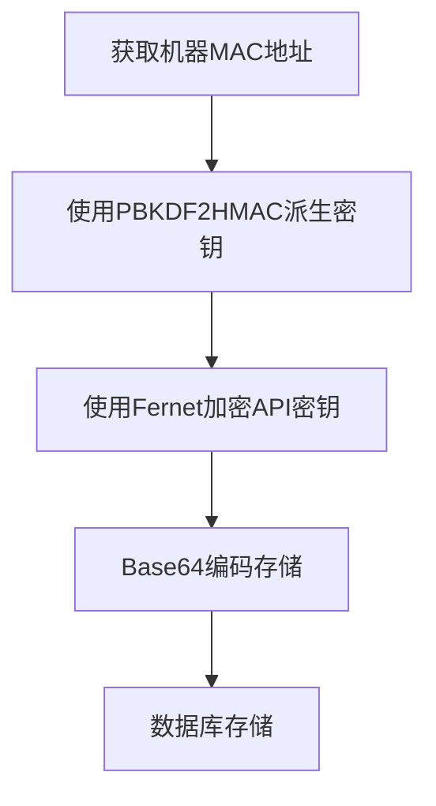
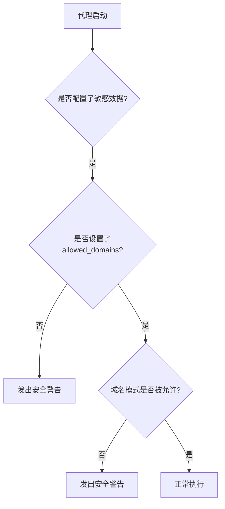
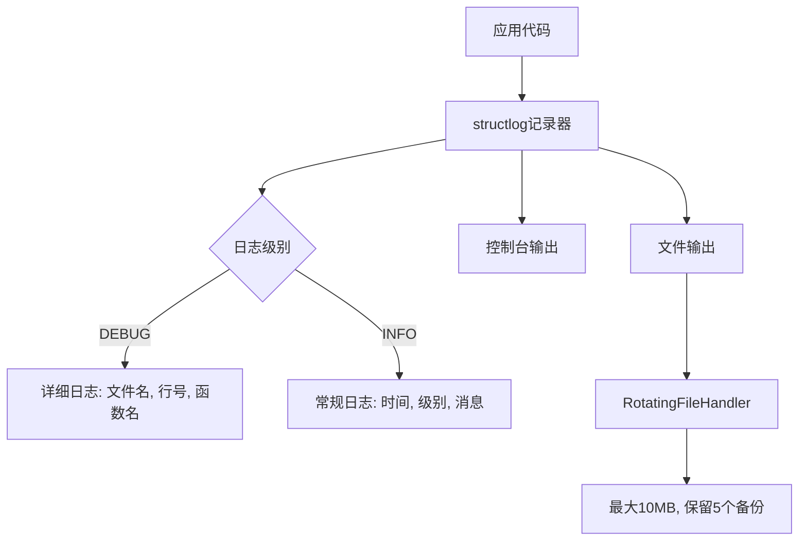
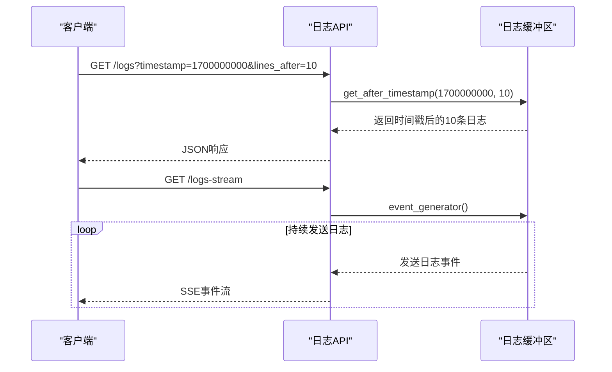
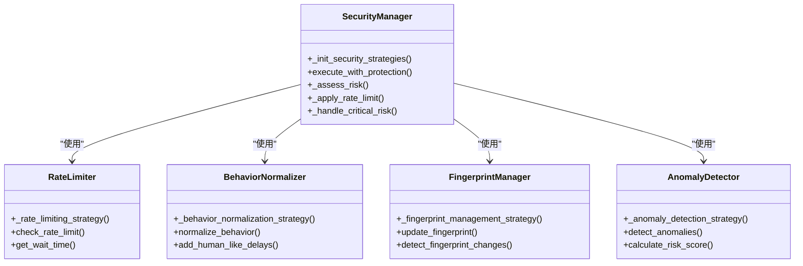
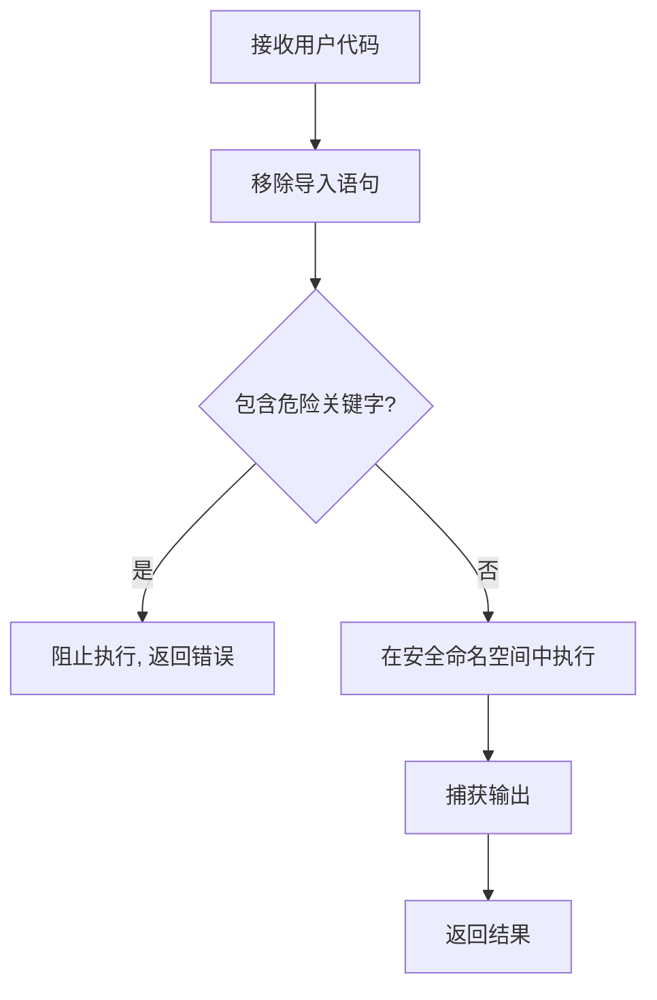
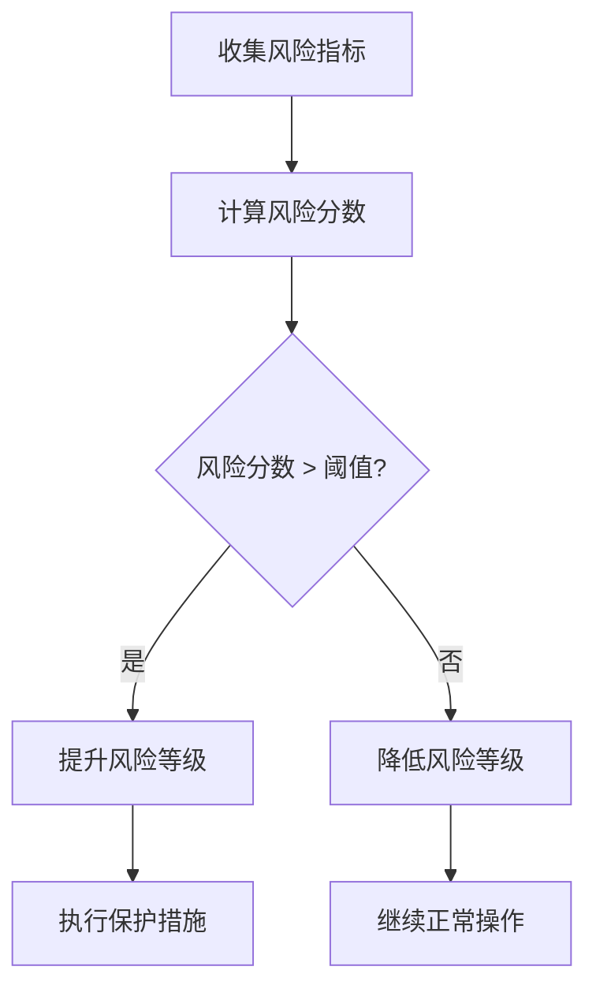

# 合规性

<cite>
**本文档引用的文件**
- [browser_use_agent.py](file://vibe_surf/agents/browser_use_agent.py)
- [encryption.py](file://vibe_surf/backend/utils/encryption.py)
- [models.py](file://vibe_surf/backend/database/models.py)
- [manager.py](file://vibe_surf/backend/database/manager.py)
- [logger.py](file://vibe_surf/logger.py)
- [mcp_encryption.py](file://vibe_surf/langflow/services/auth/mcp_encryption.py)
- [auth_helpers.py](file://vibe_surf/langflow/api/v1/auth_helpers.py)
- [anti_detection.py](file://vibe_surf/workflows/Recruitment/boss_zhipin/anti_detection.py)
- [vibe_surf_prompt.py](file://vibe_surf/agents/prompts/vibe_surf_prompt.py)
- [log_router.py](file://vibe_surf/langflow/api/log_router.py)
- [config.js](file://vibe_surf/chrome_extension/config.js)
- [composio.py](file://vibe_surf/backend/api/composio.py)
- [browser_manager.py](file://vibe_surf/browser/browser_manager.py)
- [vibesurf_tools.py](file://vibe_surf/tools/vibesurf_tools.py)
</cite>

## 目录
1. [引言](#引言)
2. [数据隐私与合规性框架](#数据隐私与合规性框架)
3. [安全审计日志管理](#安全审计日志管理)
4. [漏洞管理与安全更新](#漏洞管理与安全更新)
5. [安全评估与渗透测试](#安全评估与渗透测试)
6. [合规性配置检查清单](#合规性配置检查清单)
7. [第三方审计支持指南](#第三方审计支持指南)
8. [结论](#结论)

## 引言

VibeSurf 是一个开源的AI代理浏览器，旨在革新浏览器自动化和研究。本合规性文档详细说明了系统如何满足常见的安全合规要求，如GDPR、CCPA等数据隐私法规。文档涵盖了安全审计日志的生成和管理、漏洞管理和安全更新流程、安全评估和渗透测试方法，以及合规性配置检查清单和第三方审计支持指南。

VibeSurf 的设计原则是"隐私优先"，支持本地LLM（如Ollama）和自定义LLM API，确保用户浏览数据在使用过程中保持私密和安全。系统通过多层次的安全机制，包括数据加密、访问控制、安全审计和风险检测，为用户提供一个安全可靠的AI代理环境。

**Section sources**
- [README.md](file://README.md#L1-L186)

## 数据隐私与合规性框架

VibeSurf 通过一系列技术措施确保用户数据的隐私和安全，满足GDPR、CCPA等数据隐私法规的要求。

### 数据加密与保护

系统采用基于机器MAC地址的密钥派生机制对敏感数据进行加密。`encryption.py` 文件中的 `derive_key` 函数使用PBKDF2HMAC算法，以机器MAC地址作为密码，结合固定盐值生成加密密钥。这种机制确保了加密密钥与特定设备绑定，即使数据库被泄露，攻击者也无法解密敏感数据。

**Diagram sources**
- [encryption.py](file://vibe_surf/backend/utils/encryption.py#L23-L40)

敏感数据如API密钥、OAuth令牌等在存储前都会被加密。系统定义了 `SENSITIVE_FIELDS` 列表，包括 `oauth_client_secret` 和 `api_key` 等字段，这些字段在存储时会自动加密。`mcp_encryption.py` 文件中的 `encrypt_auth_settings` 函数负责加密认证设置，确保敏感信息不会以明文形式存储。

### 访问控制与认证

VibeSurf 实现了严格的访问控制机制。`browser_use_agent.py` 文件中的安全检查逻辑确保代理只能访问授权的域名。当代理配置了敏感数据但未设置 `allowed_domains` 时，系统会发出安全警告，防止敏感数据在恶意网站上被泄露。

**Diagram sources**
- [browser_use_agent.py](file://vibe_surf/agents/browser_use_agent.py#L316-L383)

系统还实现了OAuth和API密钥等多种认证方式。`authModal/index.tsx` 文件中的前端组件提供了配置MCP服务器认证的界面，支持多种认证类型，包括OAuth和API密钥。

### 数据最小化原则

VibeSurf 遵循数据最小化原则，只收集和处理完成特定任务所必需的数据。系统通过 `allowed_domains` 配置限制代理的访问范围，确保代理不会访问无关的网站。同时，系统提供了详细的日志记录功能，但日志中不会包含敏感数据，所有敏感信息都会被脱敏处理。

**Section sources**
- [encryption.py](file://vibe_surf/backend/utils/encryption.py#L1-L172)
- [browser_use_agent.py](file://vibe_surf/agents/browser_use_agent.py#L316-L383)
- [mcp_encryption.py](file://vibe_surf/langflow/services/auth/mcp_encryption.py#L1-L76)
- [models.py](file://vibe_surf/backend/database/models.py#L1-L289)

## 安全审计日志管理

VibeSurf 提供了全面的安全审计日志功能，记录认证事件、权限变更和敏感操作，确保所有操作都有迹可循。

### 日志记录架构

系统使用 `structlog` 库进行结构化日志记录，支持多种输出格式，包括JSON、CSV和控制台输出。`logger.py` 文件中的 `setup_logger` 函数配置了日志记录器，支持控制台和文件两种输出方式，并使用 `RotatingFileHandler` 管理日志文件大小，防止日志文件无限增长。

**Diagram sources**
- [logger.py](file://vibe_surf/logger.py#L1-L99)
- [logging/logger.py](file://vibe_surf/langflow/logging/logger.py#L1-L408)

### 审计日志内容

安全审计日志记录了以下关键事件：

1. **认证事件**：用户登录、登出、认证失败等
2. **权限变更**：API密钥更新、OAuth令牌刷新、访问权限修改等
3. **敏感操作**：文件上传下载、代码执行、数据导出等
4. **系统事件**：服务启动关闭、配置变更、错误异常等

`log_router.py` 文件中的 `stream_logs` 函数提供了HTTP/2 Server-Sent-Event (SSE) 接口，支持实时流式日志输出，便于监控和分析。

### 日志访问与检索

系统提供了灵活的日志检索API。`log_router.py` 文件中的 `logs` 函数支持按时间范围检索日志，可以获取指定时间点前后的日志记录。API支持以下参数：
- `lines_before`: 获取时间点之前的日志行数
- `lines_after`: 获取时间点之后的日志行数
- `timestamp`: 时间戳，用于定位日志位置

**Diagram sources**
- [log_router.py](file://vibe_surf/langflow/api/log_router.py#L37-L103)

**Section sources**
- [logger.py](file://vibe_surf/logger.py#L1-L99)
- [logging/logger.py](file://vibe_surf/langflow/logging/logger.py#L1-L408)
- [log_router.py](file://vibe_surf/langflow/api/log_router.py#L37-L103)

## 漏洞管理与安全更新

VibeSurf 采用主动的漏洞管理策略和自动化安全更新流程，确保系统始终处于安全状态。

### 安全策略与检测

系统实现了多层次的安全策略，包括速率限制、行为规范化、指纹管理和异常检测。`anti_detection.py` 文件中的安全策略模块通过 `_init_security_strategies` 方法初始化各种安全策略，包括：

- **速率限制策略**：防止操作过于频繁触发反爬虫机制
- **行为规范化策略**：模拟人类操作模式，避免机械化的操作行为
- **指纹管理策略**：管理浏览器指纹，避免被识别为自动化工具
- **异常检测策略**：检测异常操作模式，及时发现潜在安全威胁

**Diagram sources**
- [anti_detection.py](file://vibe_surf/workflows/Recruitment/boss_zhipin/anti_detection.py#L122-L653)

### 代码执行安全

系统对用户提交的代码执行进行了严格的安全检查。`vibesurf_tools.py` 文件中的代码执行工具会检查代码中是否包含危险操作，如 `subprocess`、`sys`、`importlib`、`eval`、`exec` 等。如果检测到危险操作，系统会阻止代码执行并返回安全错误。

**Diagram sources**
- [vibesurf_tools.py](file://vibe_surf/tools/vibesurf_tools.py#L1052-L1106)

### 安全更新流程

VibeSurf 的安全更新流程包括以下步骤：

1. **漏洞发现**：通过代码审计、渗透测试和用户反馈发现潜在漏洞
2. **风险评估**：评估漏洞的严重程度和影响范围
3. **修复开发**：开发安全补丁，进行充分测试
4. **版本发布**：发布新版本，提供详细的更新日志
5. **用户通知**：通过多种渠道通知用户更新
6. **回滚计划**：准备回滚方案，以防更新出现问题

系统使用数据库迁移机制管理配置变更。`manager.py` 文件中的 `DBMigrationManager` 类负责管理数据库迁移，确保配置变更的原子性和一致性。

**Section sources**
- [anti_detection.py](file://vibe_surf/workflows/Recruitment/boss_zhipin/anti_detection.py#L122-L653)
- [vibesurf_tools.py](file://vibe_surf/tools/vibesurf_tools.py#L1052-L1106)
- [manager.py](file://vibe_surf/backend/database/manager.py#L27-L145)

## 安全评估与渗透测试

VibeSurf 定期进行安全评估和渗透测试，确保系统的安全性。

### 内部安全评估

系统内置了安全评估功能，可以实时监控和评估安全风险。`anti_detection.py` 文件中的 `_assess_risk` 方法会根据操作历史、异常检测结果和外部威胁情报评估当前风险等级。

**Diagram sources**
- [anti_detection.py](file://vibe_surf/workflows/Recruitment/boss_zhipin/anti_detection.py#L122-L653)

### 渗透测试方法

VibeSurf 的渗透测试采用以下方法：

1. **黑盒测试**：模拟外部攻击者，从外部对系统进行测试
2. **白盒测试**：基于源代码进行深入的安全分析
3. **灰盒测试**：结合黑盒和白盒测试的优点
4. **自动化扫描**：使用自动化工具进行漏洞扫描
5. **手动测试**：安全专家进行手动测试，发现自动化工具难以发现的漏洞

### 第三方安全审计

VibeSurf 欢迎第三方安全审计，提供了详细的审计指南和支持。系统设计考虑了审计需求，提供了完整的日志记录、配置文档和API文档，便于审计人员进行全面的安全评估。

**Section sources**
- [anti_detection.py](file://vibe_surf/workflows/Recruitment/boss_zhipin/anti_detection.py#L122-L653)

## 合规性配置检查清单

以下是VibeSurf的合规性配置检查清单，帮助用户确保系统配置符合安全合规要求。

### 数据加密配置

- [ ] 确认所有敏感数据字段（如API密钥、OAuth令牌）已配置加密
- [ ] 验证加密密钥派生机制是否基于机器MAC地址
- [ ] 检查数据库中敏感字段是否以加密形式存储
- [ ] 验证加密算法是否为Fernet（基于AES-128-CBC）

### 访问控制配置

- [ ] 为每个代理配置 `allowed_domains` 限制访问范围
- [ ] 验证未设置 `allowed_domains` 时系统是否发出安全警告
- [ ] 检查域名模式验证逻辑是否正确工作
- [ ] 确认敏感操作需要多因素认证

### 日志记录配置

- [ ] 启用结构化日志记录，确保日志格式一致
- [ ] 配置日志轮转策略，防止日志文件过大
- [ ] 验证审计日志是否包含所有关键事件
- [ ] 确认日志中不包含敏感数据
- [ ] 测试日志检索API是否正常工作

### 安全策略配置

- [ ] 配置合理的速率限制策略
- [ ] 启用行为规范化策略
- [ ] 配置指纹管理策略
- [ ] 启用异常检测策略
- [ ] 验证代码执行安全检查是否有效

### 网络安全配置

- [ ] 确认后端服务仅监听本地回环地址（127.0.0.1）
- [ ] 验证前端与后端通信是否使用HTTPS
- [ ] 检查Chrome扩展配置中的 `BACKEND_URL` 是否正确
- [ ] 确认敏感API端点需要身份验证

**Section sources**
- [encryption.py](file://vibe_surf/backend/utils/encryption.py#L1-L172)
- [browser_use_agent.py](file://vibe_surf/agents/browser_use_agent.py#L316-L383)
- [logger.py](file://vibe_surf/logger.py#L1-L99)
- [anti_detection.py](file://vibe_surf/workflows/Recruitment/boss_zhipin/anti_detection.py#L122-L653)
- [config.js](file://vibe_surf/chrome_extension/config.js#L1-L56)

## 第三方审计支持指南

VibeSurf 为第三方审计提供了全面的支持，确保审计过程顺利进行。

### 审计数据访问

系统提供以下审计数据访问方式：

1. **数据库访问**：审计人员可以访问SQLite数据库文件，查看所有数据表和记录
2. **日志访问**：提供完整的日志文件，支持按时间范围检索
3. **API访问**：提供API文档和测试工具，便于测试API安全性
4. **配置访问**：提供所有配置文件的访问权限

### 审计接口

系统提供了专门的审计接口：

- `/api/logs`：获取审计日志
- `/api/logs-stream`：实时流式日志输出
- `/api/health`：系统健康检查
- `/api/composio/health`：Composio集成健康检查

### 审计工具支持

VibeSurf 支持常用的审计工具，包括：

- **Burp Suite**：用于API安全测试
- **OWASP ZAP**：用于Web应用安全扫描
- **Nmap**：用于网络扫描
- **Metasploit**：用于渗透测试
- **Wireshark**：用于网络流量分析

### 审计报告模板

建议审计报告包含以下内容：

1. **执行摘要**：审计发现的概述
2. **审计范围**：审计的系统组件和功能
3. **方法论**：使用的审计方法和工具
4. **发现的问题**：详细描述发现的安全问题
5. **风险评级**：对每个问题的风险进行评级
6. **修复建议**：提供具体的修复建议
7. **附录**：包含详细的测试数据和截图

**Section sources**
- [log_router.py](file://vibe_surf/langflow/api/log_router.py#L37-L103)
- [composio.py](file://vibe_surf/backend/api/composio.py#L1003-L1047)
- [config.js](file://vibe_surf/chrome_extension/config.js#L1-L56)

## 结论

VibeSurf 通过多层次的安全机制和合规性框架，为用户提供了一个安全可靠的AI代理环境。系统在数据隐私、访问控制、安全审计、漏洞管理和安全评估等方面都采取了严格的措施，确保符合GDPR、CCPA等数据隐私法规的要求。

通过基于机器MAC地址的加密机制、严格的访问控制、全面的审计日志、主动的漏洞管理策略和定期的安全评估，VibeSurf 能够有效保护用户数据的安全和隐私。同时，系统提供了详细的合规性配置检查清单和第三方审计支持指南，便于用户和审计人员验证系统的安全性。

VibeSurf 的合规性框架是一个持续改进的过程，随着安全威胁的演变和合规要求的变化，系统将不断更新和完善其安全机制，为用户提供最佳的安全保护。