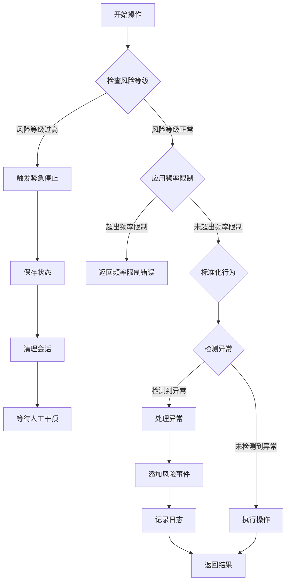
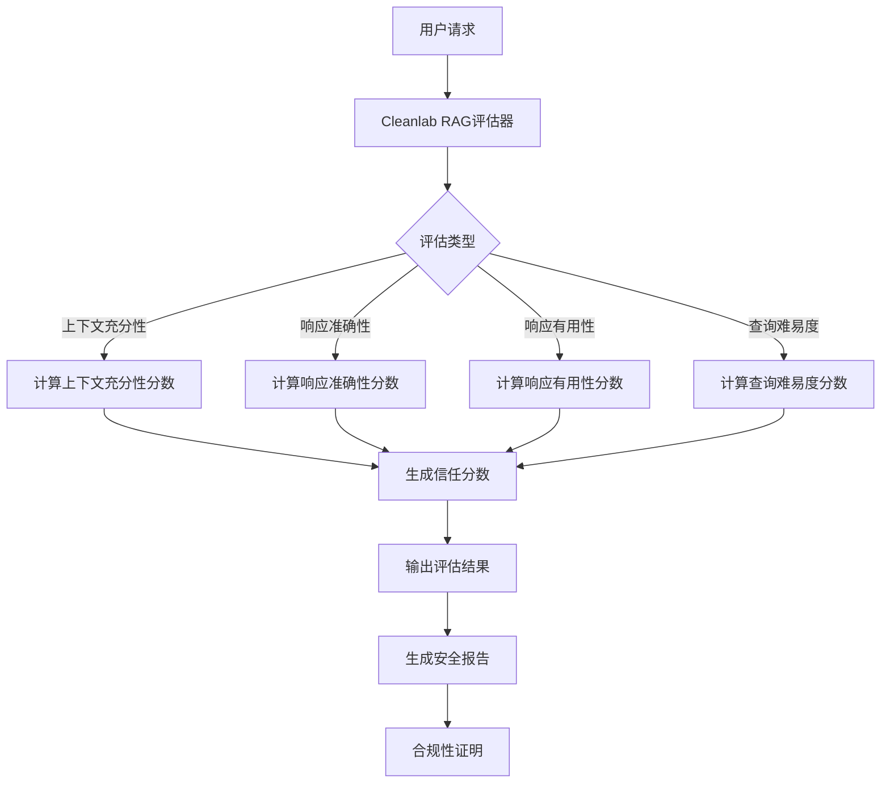

# 安全评估

<cite>
**本文档中引用的文件**   
- [vibe_surf_prompt.py](file://vibe_surf/agents/prompts/vibe_surf_prompt.py)
- [vibesurf_tools.py](file://vibe_surf/tools/vibesurf_tools.py)
- [encryption.py](file://vibe_surf/backend/utils/encryption.py)
- [mcp_encryption.py](file://vibe_surf/langflow/services/auth/mcp_encryption.py)
- [anti_detection.py](file://vibe_surf/workflows/Recruitment/boss_zhipin/anti_detection.py)
- [browser_use_agent.py](file://vibe_surf/agents/browser_use_agent.py)
- [cleanlab_rag_evaluator.py](file://vibe_surf/langflow/components/cleanlab/cleanlab_rag_evaluator.py)
- [cleanlab_remediator.py](file://vibe_surf/langflow/components/cleanlab/cleanlab_remediator.py)
- [README.md](file://README.md)
</cite>

## 目录
1. [安全评估与漏洞管理流程](#安全评估与漏洞管理流程)
2. [安全漏洞报告与跟踪](#安全漏洞报告与跟踪)
3. [安全更新发布与部署](#安全更新发布与部署)
4. [第三方安全评估接口与数据支持](#第三方安全评估接口与数据支持)
5. [威胁建模方法](#威胁建模方法)
6. [安全开发生命周期（SDL）实践](#安全开发生命周期（sdl）实践)
7. [安全报告与合规性证明](#安全报告与合规性证明)

## 安全评估与漏洞管理流程

VibeSurf的安全评估与漏洞管理流程建立在多层次的安全防护机制之上，涵盖了定期的安全扫描、渗透测试和代码审计。系统通过内置的安全策略和外部依赖库来确保用户数据和系统安全。

在代码执行层面，VibeSurf实施了严格的Python代码执行安全措施。所有文件操作被严格限制在工作空间目录内，禁止访问系统文件或目录。同时，系统禁止执行可能危害用户计算机、删除系统文件或损害安全性的代码。对于任何看似恶意的代码，系统有权拒绝执行，并向用户提供清晰的安全风险解释。

系统还集成了Cleanlab等第三方安全评估工具，用于评估RAG（检索增强生成）管道中的上下文、查询和响应，并输出信任度指标。这些评估包括上下文充分性、响应准确性、响应有用性和查询难易度等多个维度，帮助识别潜在的安全风险。

**Section sources**
- [vibe_surf_prompt.py](file://vibe_surf/agents/prompts/vibe_surf_prompt.py#L154-L218)
- [vibesurf_tools.py](file://vibe_surf/tools/vibesurf_tools.py#L1052-L1106)
- [cleanlab_rag_evaluator.py](file://vibe_surf/langflow/components/cleanlab/cleanlab_rag_evaluator.py#L28-L254)

## 安全漏洞报告与跟踪

VibeSurf建立了完善的安全漏洞报告与跟踪机制。当系统检测到潜在的安全威胁时，会立即记录风险事件并采取相应的防护措施。风险事件包括但不限于高频率操作、高失败率、CAPTCHA检测和速率限制触发等。

系统通过`_add_risk_event`方法添加风险事件，并根据风险级别进行分类。风险级别分为低（LOW）、中（MEDIUM）、高（HIGH）和严重（CRITICAL）四个等级。对于严重风险，系统会触发紧急停止机制，保存当前状态并清理会话，等待人工干预。

风险事件的详细信息会被记录在日志中，包括风险类型、级别、消息和详细信息。这些日志信息可用于后续的安全分析和漏洞跟踪。系统还提供了风险评估接口，可以获取最近的风险事件分布、检测类型分布、当前风险级别、24小时内的操作次数、成功率和指纹信息。

**Diagram sources **
- [anti_detection.py](file://vibe_surf/workflows/Recruitment/boss_zhipin/anti_detection.py#L122-L653)

**Section sources**
- [anti_detection.py](file://vibe_surf/workflows/Recruitment/boss_zhipin/anti_detection.py#L362-L371)
- [anti_detection.py](file://vibe_surf/workflows/Recruitment/boss_zhipin/anti_detection.py#L526-L545)

## 安全更新发布与部署

VibeSurf的安全更新发布与部署流程遵循自动化的工作流。当创建新版本时，GitHub Actions会自动执行测试、构建和发布阶段。测试阶段包括在Python 3.11和3.12上运行测试，验证包导入和CLI功能。构建阶段使用`setuptools-scm`从git标签获取版本号，构建wheel和源码分发包，并验证构建的包。发布阶段会自动上传到PyPI，使用配置的API令牌。

在本地构建测试时，可以使用`python -m build`命令构建包，并使用`twine check`检查构建结果。还可以通过`pip install`本地安装测试CLI命令。如果自动化工作流失败，可以手动发布包，使用`twine upload`命令上传到PyPI。

**Section sources**
- [PYPI_SETUP.md](file://docs/PYPI_SETUP.md#L66-L145)

## 第三方安全评估接口与数据支持

VibeSurf提供了与第三方安全评估工具的集成接口，支持生成安全报告和合规性证明。系统集成了Cleanlab等工具，用于评估RAG管道中的信任度。这些工具可以输出信任分数、解释和其他评估指标，帮助用户了解系统的安全状况。

系统还支持通过环境变量存储和管理敏感信息，如API密钥和OAuth令牌。这些敏感信息在存储时会被加密，确保数据安全。用户可以通过设置环境变量来配置这些敏感信息，并在需要时从环境中获取。

**Diagram sources **
- [cleanlab_rag_evaluator.py](file://vibe_surf/langflow/components/cleanlab/cleanlab_rag_evaluator.py#L28-L254)

**Section sources**
- [cleanlab_rag_evaluator.py](file://vibe_surf/langflow/components/cleanlab/cleanlab_rag_evaluator.py#L28-L254)
- [cleanlab_remediator.py](file://vibe_surf/langflow/components/cleanlab/cleanlab_remediator.py#L102-L131)

## 威胁建模方法

VibeSurf采用基于风险的威胁建模方法，通过评估风险等级来指导安全决策。系统定义了四种风险级别：低、中、高和严重。风险等级的评估基于最近一小时内发生的风险事件数量和级别。

对于严重风险，系统会立即停止操作并触发紧急停止机制。对于高风险，系统会采取更严格的防护措施，如暂停操作、清理会话等。对于中等风险，系统会记录日志并通知用户。对于低风险，系统会继续正常操作。

系统还实现了多种安全策略，包括频率限制、行为标准化、指纹管理和异常检测。这些策略共同作用，确保系统在面对各种威胁时能够做出适当的响应。

**Section sources**
- [anti_detection.py](file://vibe_surf/workflows/Recruitment/boss_zhipin/anti_detection.py#L338-L360)
- [anti_detection.py](file://vibe_surf/workflows/Recruitment/boss_zhipin/anti_detection.py#L122-L130)

## 安全开发生命周期（SDL）实践

VibeSurf遵循安全开发生命周期（SDL）实践，确保在软件开发的每个阶段都考虑安全因素。在设计阶段，系统通过威胁建模识别潜在的安全风险，并制定相应的防护措施。在实现阶段，系统实施了严格的代码执行安全措施，防止恶意代码的执行。

在测试阶段，系统通过自动化测试验证安全功能的正确性。在部署阶段，系统通过自动化工作流确保安全更新的及时发布。在运维阶段，系统通过日志记录和监控及时发现和响应安全事件。

系统还支持本地LLM和自定义LLM API，确保用户的浏览数据在进行"vibe surfing"时保持私密和安全。这种隐私优先的设计理念贯穿于整个开发生命周期。

**Section sources**
- [README.md](file://README.md#L22)
- [vibe_surf_prompt.py](file://vibe_surf/agents/prompts/vibe_surf_prompt.py#L154-L218)

## 安全报告与合规性证明

VibeSurf能够生成详细的安全报告和合规性证明，帮助用户了解系统的安全状况。安全报告包括风险事件分布、检测类型分布、当前风险级别、24小时内的操作次数、成功率和指纹信息。这些信息可以帮助用户评估系统的安全性能。

合规性证明则基于第三方安全评估工具的输出，如Cleanlab的信任分数和解释。这些证明可以用于满足各种合规性要求，如GDPR、HIPAA等。系统还支持通过环境变量配置敏感信息，确保数据的安全存储和传输。

**Section sources**
- [anti_detection.py](file://vibe_surf/workflows/Recruitment/boss_zhipin/anti_detection.py#L612-L640)
- [cleanlab_rag_evaluator.py](file://vibe_surf/langflow/components/cleanlab/cleanlab_rag_evaluator.py#L28-L254)