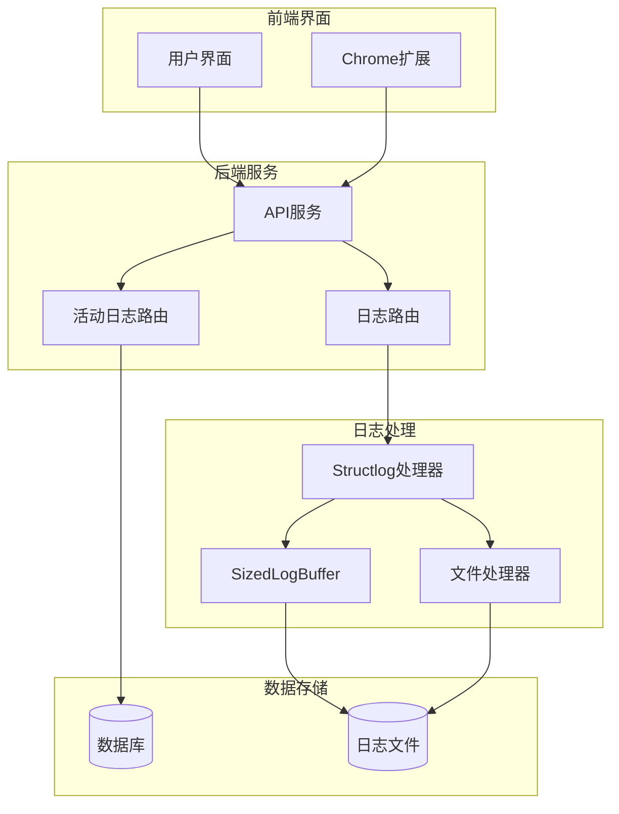
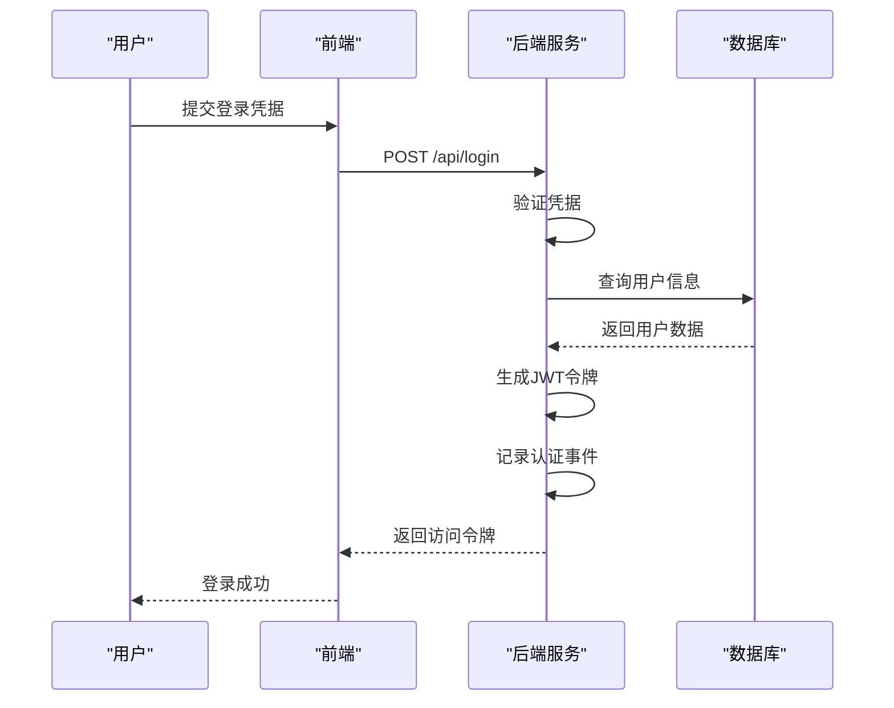
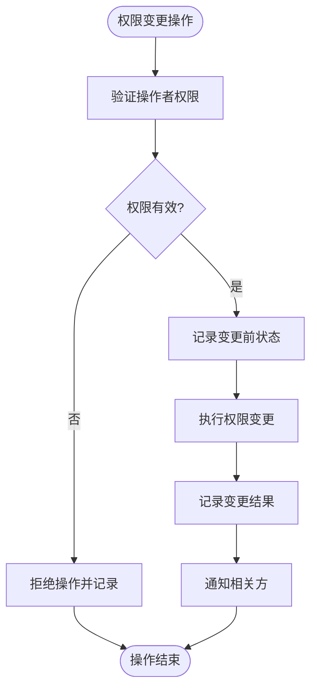
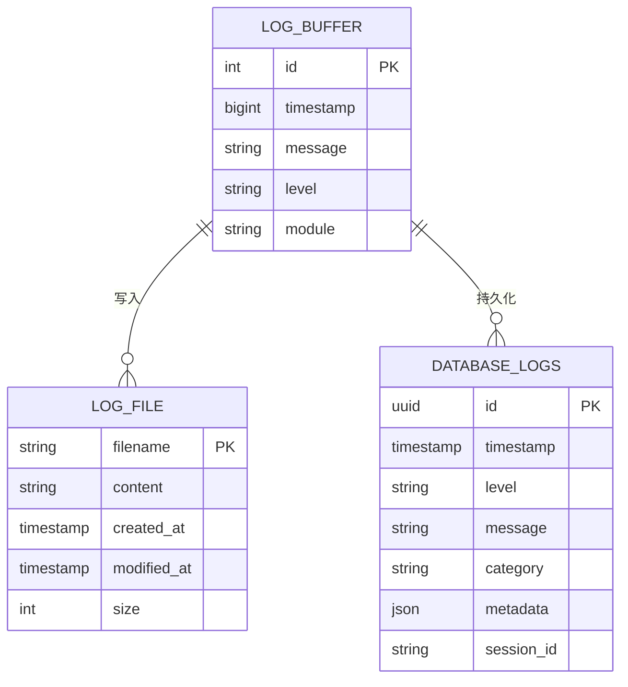
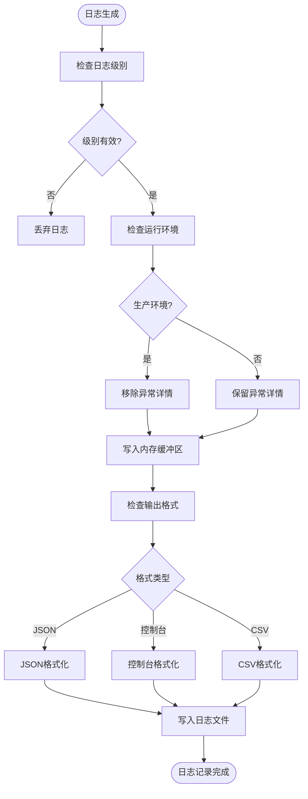
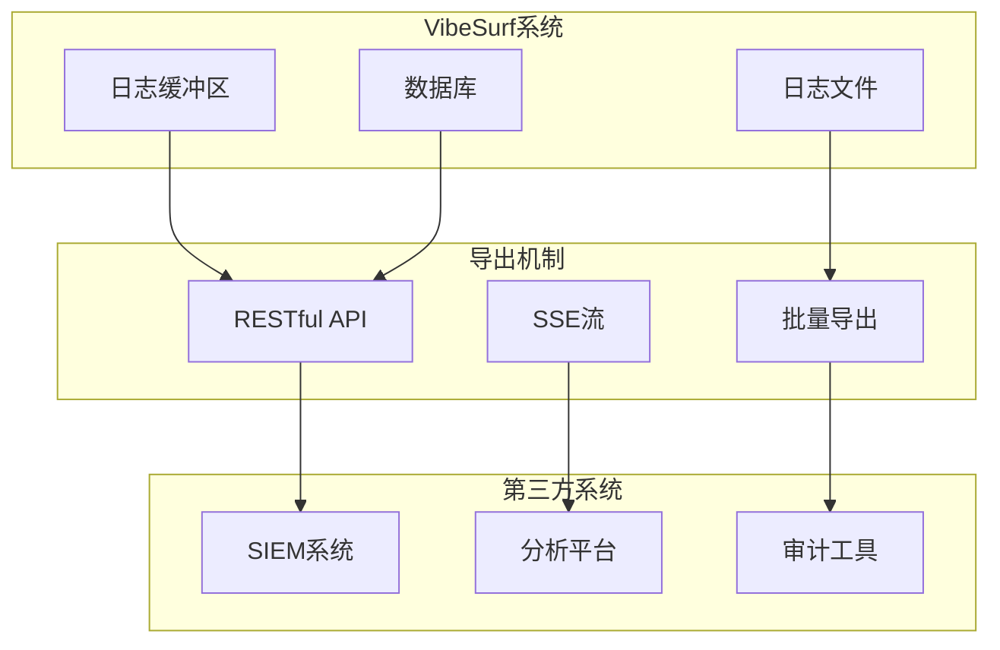

# 审计日志

<cite>
**本文档引用的文件**   
- [logger.py](file://vibe_surf/logger.py)
- [logging/logger.py](file://vibe_surf/langflow/logging/logger.py)
- [logging/setup.py](file://vibe_surf/langflow/logging/setup.py)
- [api/log_router.py](file://vibe_surf/langflow/api/log_router.py)
- [backend/api/activity.py](file://vibe_surf/backend/api/activity.py)
- [backend/database/models.py](file://vibe_surf/backend/database/models.py)
- [backend/database/queries.py](file://vibe_surf/backend/database/queries.py)
- [backend/main.py](file://vibe_surf/backend/main.py)
</cite>

## 目录
1. [引言](#引言)
2. [日志系统架构](#日志系统架构)
3. [认证事件记录](#认证事件记录)
4. [权限变更与敏感操作](#权限变更与敏感操作)
5. [日志格式与存储](#日志格式与存储)
6. [日志级别与过滤配置](#日志级别与过滤配置)
7. [日志导出与第三方审计](#日志导出与第三方审计)
8. [审计查询示例](#审计查询示例)
9. [结论](#结论)

## 引言
VibeSurf的审计日志系统为平台提供了全面的活动追踪和安全监控能力。该系统记录了用户认证、权限变更、敏感操作等关键事件，为安全审计、故障排查和合规性检查提供了必要的数据支持。本文档详细说明了审计日志的记录机制、存储位置、保留策略以及配置和查询方法。

## 日志系统架构

VibeSurf的审计日志系统采用多层架构，结合了实时内存日志缓冲和持久化数据库存储两种机制，确保了日志的完整性和可访问性。



**Diagram sources**
- [backend/main.py](file://vibe_surf/backend/main.py#L583-L590)
- [backend/api/activity.py](file://vibe_surf/backend/api/activity.py#L21)
- [langflow/api/log_router.py](file://vibe_surf/langflow/api/log_router.py#L73)
- [langflow/logging/logger.py](file://vibe_surf/langflow/logging/logger.py#L159)
- [langflow/logging/setup.py](file://vibe_surf/langflow/logging/setup.py#L1)

**Section sources**
- [backend/main.py](file://vibe_surf/backend/main.py#L583-L590)
- [backend/api/activity.py](file://vibe_surf/backend/api/activity.py#L21)
- [langflow/api/log_router.py](file://vibe_surf/langflow/api/log_router.py#L73)
- [langflow/logging/logger.py](file://vibe_surf/langflow/logging/logger.py#L159)
- [langflow/logging/setup.py](file://vibe_surf/langflow/logging/setup.py#L1)

## 认证事件记录

VibeSurf系统详细记录了所有与用户认证相关的事件，包括登录、登出、令牌刷新和认证失败等场景。这些日志对于检测未授权访问尝试和账户安全问题至关重要。

认证事件主要通过后端API的认证路由进行记录。系统使用JWT（JSON Web Token）进行身份验证，并在每次认证操作时生成相应的日志条目。



**Diagram sources**
- [frontend/src/controllers/API/queries/auth/use-post-login-user.ts](file://vibe_surf/frontend/src/controllers/API/queries/auth/use-post-login-user.ts)
- [backend/main.py](file://vibe_surf/backend/main.py#L588)
- [langflow/services/auth/utils.py](file://vibe_surf/langflow/services/auth/utils.py#L370)

**Section sources**
- [frontend/src/controllers/API/queries/auth/use-post-login-user.ts](file://vibe_surf/frontend/src/controllers/API/queries/auth/use-post-login-user.ts)
- [backend/main.py](file://vibe_surf/backend/main.py#L588)
- [langflow/services/auth/utils.py](file://vibe_surf/langflow/services/auth/utils.py#L370)

## 权限变更与敏感操作

系统对权限变更和敏感操作进行了严格的日志记录，确保所有关键配置的修改都有迹可循。这包括LLM配置文件、MCP配置文件的创建、更新和删除操作。



敏感操作的记录机制通过数据库查询类实现，每次对关键配置的修改都会触发日志记录。例如，当更新LLM配置文件时，系统会记录操作类型、操作者、变更内容和时间戳。

**Diagram sources**
- [backend/database/queries.py](file://vibe_surf/backend/database/queries.py#L174)
- [backend/database/models.py](file://vibe_surf/backend/database/models.py#L57)
- [backend/database/models.py](file://vibe_surf/backend/database/models.py#L168)

**Section sources**
- [backend/database/queries.py](file://vibe_surf/backend/database/queries.py#L174)
- [backend/database/models.py](file://vibe_surf/backend/database/models.py#L57)
- [backend/database/models.py](file://vibe_surf/backend/database/models.py#L168)

## 日志格式与存储

VibeSurf的日志系统采用灵活的存储策略，结合了内存缓冲和文件持久化两种方式，确保日志的高效访问和长期保存。

### 日志格式
日志条目采用结构化格式，包含以下关键字段：
- **timestamp**: ISO格式的时间戳
- **level**: 日志级别 (DEBUG, INFO, WARNING, ERROR, CRITICAL)
- **event**: 日志消息内容
- **module**: 源模块名称
- **serialized**: 序列化的日志数据

### 存储位置与保留策略
日志存储在两个主要位置：
1. **内存缓冲区**: 用于实时日志检索，大小由环境变量`LANGFLOW_LOG_RETRIEVER_BUFFER_SIZE`控制
2. **文件系统**: 持久化存储在工作区的`logs`目录下，文件名为`log_YYYY-MM-DD.log`

日志文件采用轮转策略，每个文件最大10MB，保留5个历史文件。系统还支持数据库持久化存储，关键操作记录保存在SQLite数据库中。



**Diagram sources**
- [langflow/logging/logger.py](file://vibe_surf/langflow/logging/logger.py#L311)
- [logger.py](file://vibe_surf/logger.py#L54)
- [backend/main.py](file://vibe_surf/backend/main.py#L76)
- [langflow/logging/logger.py](file://vibe_surf/langflow/logging/logger.py#L135)

**Section sources**
- [langflow/logging/logger.py](file://vibe_surf/langflow/logging/logger.py#L311)
- [logger.py](file://vibe_surf/logger.py#L54)
- [backend/main.py](file://vibe_surf/backend/main.py#L76)
- [langflow/logging/logger.py](file://vibe_surf/langflow/logging/logger.py#L135)

## 日志级别与过滤配置

VibeSurf提供了灵活的日志级别配置和过滤机制，允许管理员根据需要调整日志的详细程度和关注重点。

### 日志级别配置
系统支持以下日志级别，按严重性递增：
- **DEBUG**: 详细的调试信息，用于开发和故障排查
- **INFO**: 一般运行信息，记录正常操作流程
- **WARNING**: 潜在问题警告，不影响系统正常运行
- **ERROR**: 错误事件，功能部分失效
- **CRITICAL**: 严重错误，系统无法继续运行

日志级别可以通过环境变量`LANGFLOW_LOG_LEVEL`或API配置进行设置。在开发模式下，系统会自动包含文件名、函数名和行号等详细信息。

### 日志过滤规则
系统实现了多层过滤机制：
1. **环境过滤**: 根据部署环境（开发、生产、容器）应用不同的过滤规则
2. **生产环境过滤**: 在生产环境中自动移除异常详细信息，防止敏感数据泄露
3. **自定义过滤**: 支持通过配置文件定义特定的过滤规则



**Diagram sources**
- [langflow/logging/logger.py](file://vibe_surf/langflow/logging/logger.py#L243)
- [langflow/logging/logger.py](file://vibe_surf/langflow/logging/logger.py#L177)
- [langflow/logging/logger.py](file://vibe_surf/langflow/logging/logger.py#L270)

**Section sources**
- [langflow/logging/logger.py](file://vibe_surf/langflow/logging/logger.py#L243)
- [langflow/logging/logger.py](file://vibe_surf/langflow/logging/logger.py#L177)
- [langflow/logging/logger.py](file://vibe_surf/langflow/logging/logger.py#L270)

## 日志导出与第三方审计

VibeSurf提供了多种日志导出机制，支持将日志数据用于第三方审计和分析工具。

### 日志导出接口
系统提供了RESTful API端点用于日志检索和导出：
- **GET /api/logs**: 获取指定时间范围内的日志
- **GET /api/logs-stream**: 通过SSE（Server-Sent Events）流式传输实时日志
- **GET /api/activity/tasks**: 获取任务历史记录
- **GET /api/activity/sessions**: 获取会话活动记录

### 导出格式
支持多种导出格式以适应不同的审计需求：
- **JSON**: 用于程序化处理和自动化分析
- **CSV**: 用于电子表格导入和人工审查
- **文本**: 用于快速查看和简单分析

### 第三方审计集成
系统设计考虑了与第三方审计工具的集成，通过标准化的日志格式和API接口，可以轻松将日志数据导入SIEM（安全信息和事件管理）系统、日志分析平台等。



**Diagram sources**
- [langflow/api/log_router.py](file://vibe_surf/langflow/api/log_router.py#L73)
- [backend/api/activity.py](file://vibe_surf/backend/api/activity.py#L25)
- [frontend/src/customization/utils/custom-get-download-folders.ts](file://vibe_surf/frontend/src/customization/utils/custom-get-download-folders.ts)

**Section sources**
- [langflow/api/log_router.py](file://vibe_surf/langflow/api/log_router.py#L73)
- [backend/api/activity.py](file://vibe_surf/backend/api/activity.py#L25)
- [frontend/src/customization/utils/custom-get-download-folders.ts](file://vibe_surf/frontend/src/customization/utils/custom-get-download-folders.ts)

## 审计查询示例

以下是一些常见的审计场景查询示例，展示了如何利用VibeSurf的审计日志系统进行安全监控和问题排查。

### 追踪用户活动
查询特定用户在指定时间范围内的所有活动：

```python
# 获取最近100个任务
GET /api/activity/tasks?limit=100

# 获取特定会话的所有任务
GET /api/activity/sessions/{session_id}/tasks

# 获取会话的实时活动日志
GET /api/activity/sessions/{session_id}/activity?limit=50
```

### 检测异常行为
通过分析日志模式来检测潜在的安全威胁：

```python
# 查找频繁的认证失败
SELECT * FROM logs 
WHERE level = 'ERROR' 
AND message LIKE '%authentication failed%'
AND timestamp > '2024-01-01'
ORDER BY timestamp DESC

# 检测短时间内大量操作
SELECT session_id, COUNT(*) as action_count
FROM activity_logs
WHERE timestamp > DATE_SUB(NOW(), INTERVAL 1 HOUR)
GROUP BY session_id
HAVING action_count > 100
```

### 响应安全事件
在发生安全事件时快速获取相关信息：

```python
# 获取特定时间点前后的日志
GET /api/logs?timestamp=1700000000&lines_before=10&lines_after=10

# 获取最近的错误日志
GET /api/logs?level=ERROR&limit=20

# 获取敏感操作记录
GET /api/activity/sessions/{session_id}/tasks
```

### 性能监控查询
监控系统性能和资源使用情况：

```python
# 获取任务执行时间统计
SELECT 
    AVG(TIMESTAMPDIFF(SECOND, started_at, completed_at)) as avg_duration,
    MIN(TIMESTAMPDIFF(SECOND, started_at, completed_at)) as min_duration,
    MAX(TIMESTAMPDIFF(SECOND, started_at, completed_at)) as max_duration
FROM tasks 
WHERE status = 'completed'

# 监控API调用频率
SELECT 
    endpoint,
    COUNT(*) as call_count,
    AVG(response_time) as avg_response_time
FROM api_logs 
WHERE timestamp > NOW() - INTERVAL 1 DAY
GROUP BY endpoint
```

**Section sources**
- [backend/api/activity.py](file://vibe_surf/backend/api/activity.py#L73)
- [langflow/api/log_router.py](file://vibe_surf/langflow/api/log_router.py#L73)
- [backend/database/queries.py](file://vibe_surf/backend/database/queries.py#L556)

## 结论
VibeSurf的审计日志系统提供了一个全面、灵活且安全的日志记录和审计框架。通过结合内存缓冲和持久化存储，系统确保了日志的实时可用性和长期完整性。详细的认证事件记录、权限变更追踪和敏感操作监控为平台的安全性提供了坚实的基础。灵活的日志级别配置和过滤机制使管理员能够根据具体需求调整日志详细程度，而标准化的导出接口则支持与第三方审计工具的无缝集成。这些功能共同构成了一个强大的审计体系，能够有效支持安全监控、故障排查和合规性要求。