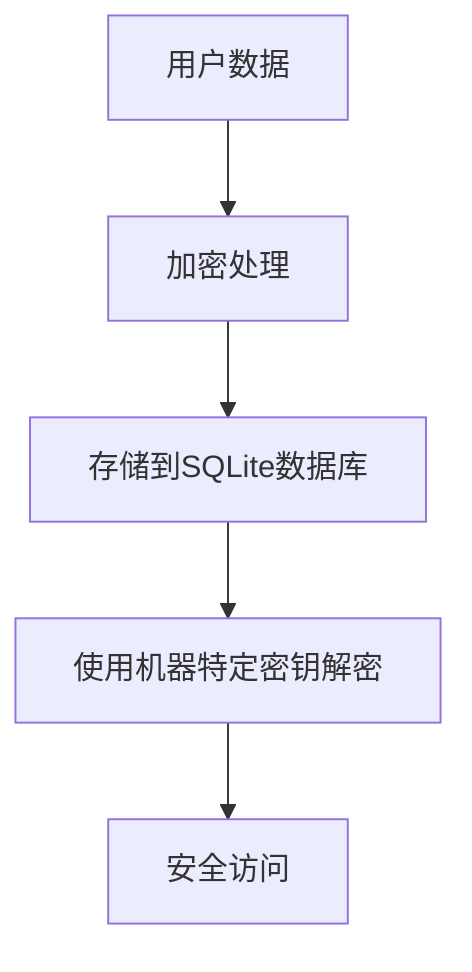
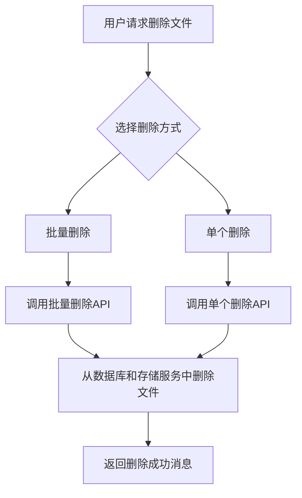
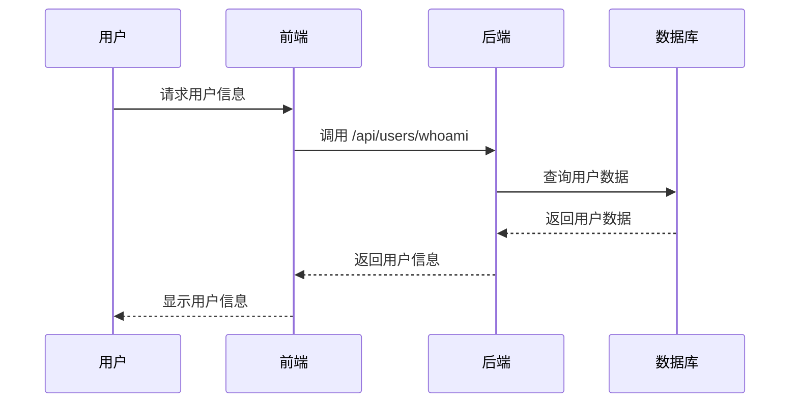

# 法规遵从

<cite>
**本文档引用的文件**   
- [vibe_surf/backend/database/models.py](file://vibe_surf/backend/database/models.py)
- [vibe_surf/backend/database/manager.py](file://vibe_surf/backend/database/manager.py)
- [vibe_surf/backend/main.py](file://vibe_surf/backend/main.py)
- [vibe_surf/backend/api/config.py](file://vibe_surf/backend/api/config.py)
- [vibe_surf/backend/utils/encryption.py](file://vibe_surf/backend/utils/encryption.py)
- [vibe_surf/langflow/services/auth/mcp_encryption.py](file://vibe_surf/langflow/services/auth/mcp_encryption.py)
- [vibe_surf/langflow/services/auth/utils.py](file://vibe_surf/langflow/services/auth/utils.py)
- [vibe_surf/langflow/alembic/versions/0882f9657f22_encrypt_existing_mcp_auth_settings_.py](file://vibe_surf/langflow/alembic/versions/0882f9657f22_encrypt_existing_mcp_auth_settings_.py)
- [vibe_surf/langflow/api/v2/files.py](file://vibe_surf/langflow/api/v2/files.py)
- [vibe_surf/frontend/src/controllers/API/queries/file-management/use-delete-files.ts](file://vibe_surf/frontend/src/controllers/API/queries/file-management/use-delete-files.ts)
- [vibe_surf/frontend/src/controllers/API/queries/file-management/use-delete-file.ts](file://vibe_surf/frontend/src/controllers/API/queries/file-management/use-delete-file.ts)
- [vibe_surf/frontend/src/controllers/API/queries/auth/use-delete-users.ts](file://vibe_surf/frontend/src/controllers/API/queries/auth/use-delete-users.ts)
- [vibe_surf/frontend/src/pages/AdminPage/index.tsx](file://vibe_surf/frontend/src/pages/AdminPage/index.tsx)
- [vibe_surf/agents/prompts/vibe_surf_prompt.py](file://vibe_surf/agents/prompts/vibe_surf_prompt.py)
</cite>

## 目录
1. [引言](#引言)
2. [数据处理与存储机制](#数据处理与存储机制)
3. [个人数据删除机制](#个人数据删除机制)
4. [数据主体权利实现](#数据主体权利实现)
5. [数据最小化原则应用](#数据最小化原则应用)
6. [数据保护影响评估（DPIA）](#数据保护影响评估（dpia）)
7. [合规性配置示例与检查清单](#合规性配置示例与检查清单)
8. [多司法管辖区部署策略](#多司法管辖区部署策略)
9. [结论](#结论)

## 引言
VibeSurf 是一个开源的AI代理浏览器，旨在革新浏览器自动化和研究。该项目特别注重数据隐私和安全，通过多种机制确保符合GDPR、CCPA等数据隐私法规要求。本文档详细说明了VibeSurf如何满足这些法规要求，包括个人数据的处理、存储和删除机制，以及数据主体权利的实现方式。此外，文档还解释了数据最小化原则的应用，以及如何实施数据保护影响评估（DPIA），并提供了合规性配置示例和检查清单，帮助用户在不同司法管辖区部署系统以满足当地法规要求。

**Section sources**
- [README.md](file://README.md)

## 数据处理与存储机制
VibeSurf 通过多种机制确保个人数据的安全处理和存储。首先，系统使用机器特定的加密密钥对敏感数据进行加密，如API密钥和认证信息。这些密钥基于MAC地址或本地用户ID生成，确保数据在存储时的安全性。其次，VibeSurf 使用SQLite数据库来存储用户数据，包括任务、文件上传记录、LLM配置文件等。数据库中的敏感字段（如API密钥）在存储前会被加密，确保即使数据库被非法访问，敏感信息也不会泄露。

此外，VibeSurf 支持本地LLM（如Ollama）和自定义LLM API，确保用户的浏览数据在本地处理，避免数据外泄。系统还通过配置文件和环境变量管理敏感信息，如HTTP代理设置，进一步增强了数据安全性。



**Diagram sources**
- [vibe_surf/backend/database/models.py](file://vibe_surf/backend/database/models.py)
- [vibe_surf/backend/utils/encryption.py](file://vibe_surf/backend/utils/encryption.py)

**Section sources**
- [vibe_surf/backend/database/models.py](file://vibe_surf/backend/database/models.py)
- [vibe_surf/backend/utils/encryption.py](file://vibe_surf/backend/utils/encryption.py)

## 个人数据删除机制
VibeSurf 提供了多种机制来删除个人数据，确保用户能够行使数据删除权。系统通过API端点支持批量删除和单个删除文件，用户可以通过前端界面或直接调用API来删除文件。删除操作不仅从数据库中移除记录，还会从存储服务中删除实际文件，确保数据彻底清除。



**Diagram sources**
- [vibe_surf/langflow/api/v2/files.py](file://vibe_surf/langflow/api/v2/files.py)
- [vibe_surf/frontend/src/controllers/API/queries/file-management/use-delete-files.ts](file://vibe_surf/frontend/src/controllers/API/queries/file-management/use-delete-files.ts)
- [vibe_surf/frontend/src/controllers/API/queries/file-management/use-delete-file.ts](file://vibe_surf/frontend/src/controllers/API/queries/file-management/use-delete-file.ts)

**Section sources**
- [vibe_surf/langflow/api/v2/files.py](file://vibe_surf/langflow/api/v2/files.py)
- [vibe_surf/frontend/src/controllers/API/queries/file-management/use-delete-files.ts](file://vibe_surf/frontend/src/controllers/API/queries/file-management/use-delete-files.ts)
- [vibe_surf/frontend/src/controllers/API/queries/file-management/use-delete-file.ts](file://vibe_surf/frontend/src/controllers/API/queries/file-management/use-delete-file.ts)

## 数据主体权利实现
VibeSurf 通过多种方式实现数据主体权利，包括访问、更正和删除个人数据。系统提供了API端点和前端界面，允许用户查询和管理自己的数据。例如，用户可以通过`/api/users/whoami`端点获取自己的用户信息，通过`/api/config/llm-profiles`端点管理LLM配置文件。此外，系统还支持用户删除自己的账户和相关数据，确保用户能够完全控制自己的数据。



**Diagram sources**
- [vibe_surf/frontend/src/controllers/API/queries/auth/use-get-user.ts](file://vibe_surf/frontend/src/controllers/API/queries/auth/use-get-user.ts)
- [vibe_surf/backend/main.py](file://vibe_surf/backend/main.py)

**Section sources**
- [vibe_surf/frontend/src/controllers/API/queries/auth/use-get-user.ts](file://vibe_surf/frontend/src/controllers/API/queries/auth/use-get-user.ts)
- [vibe_surf/backend/main.py](file://vibe_surf/backend/main.py)

## 数据最小化原则应用
VibeSurf 严格遵循数据最小化原则，只收集和处理完成特定任务所必需的最少数据。系统通过配置文件和环境变量管理敏感信息，避免不必要的数据收集。例如，LLM配置文件中只包含必要的API密钥和模型参数，不包含用户个人身份信息。此外，系统通过权限控制和访问日志，确保数据访问的最小化，防止数据滥用。

**Section sources**
- [vibe_surf/backend/api/config.py](file://vibe_surf/backend/api/config.py)

## 数据保护影响评估（DPIA）
VibeSurf 通过定期进行数据保护影响评估（DPIA）来确保数据处理活动的合规性。系统通过日志记录和监控工具，跟踪数据处理活动，识别潜在风险。例如，系统会记录每次API调用的详细信息，包括请求者、请求时间和请求内容，以便进行审计和风险评估。此外，系统还通过自动化测试和代码审查，确保数据处理逻辑的正确性和安全性。

**Section sources**
- [vibe_surf/backend/main.py](file://vibe_surf/backend/main.py)

## 合规性配置示例与检查清单
为了帮助用户在不同司法管辖区部署系统以满足当地法规要求，VibeSurf 提供了合规性配置示例和检查清单。以下是一个示例配置：

```yaml
# 示例配置文件
database:
  url: sqlite:///vibe_surf.db
  encryption_key: ${MAC_ADDRESS}
  backup_enabled: true

llm:
  providers:
    - name: openai
      api_key: ${OPENAI_API_KEY}
      base_url: https://api.openai.com/v1
  default_provider: openai

security:
  enable_proxy: false
  allowed_domains:
    - "*.example.com"
    - "localhost"
  rate_limiting:
    enabled: true
    requests_per_minute: 60

logging:
  level: info
  audit_trail: true
```

**合规性检查清单：**
- [x] 确保所有敏感数据在存储前加密
- [x] 配置数据库备份和恢复机制
- [x] 限制API密钥的使用范围
- [x] 启用访问日志和审计跟踪
- [x] 定期进行数据保护影响评估（DPIA）
- [x] 提供用户数据删除功能
- [x] 确保系统支持本地LLM和自定义LLM API

**Section sources**
- [vibe_surf/backend/api/config.py](file://vibe_surf/backend/api/config.py)

## 多司法管辖区部署策略
VibeSurf 支持在不同司法管辖区部署，以满足当地法规要求。系统通过配置文件和环境变量管理不同地区的特定设置，如数据存储位置、访问控制和日志记录策略。例如，用户可以在欧盟地区部署系统时，配置数据存储在本地服务器上，并启用GDPR合规性功能。此外，系统还支持多语言界面，方便不同地区的用户使用。

**Section sources**
- [vibe_surf/backend/main.py](file://vibe_surf/backend/main.py)

## 结论
VibeSurf 通过多种机制确保个人数据的安全处理和存储，符合GDPR、CCPA等数据隐私法规要求。系统提供了强大的数据删除功能，支持数据主体权利的实现，并严格遵循数据最小化原则。通过定期进行数据保护影响评估（DPIA）和提供合规性配置示例，VibeSurf 帮助用户在不同司法管辖区部署系统，确保数据处理活动的合规性。未来，VibeSurf 将继续优化数据隐私和安全功能，为用户提供更加安全可靠的AI代理浏览器体验。

**Section sources**
- [README.md](file://README.md)