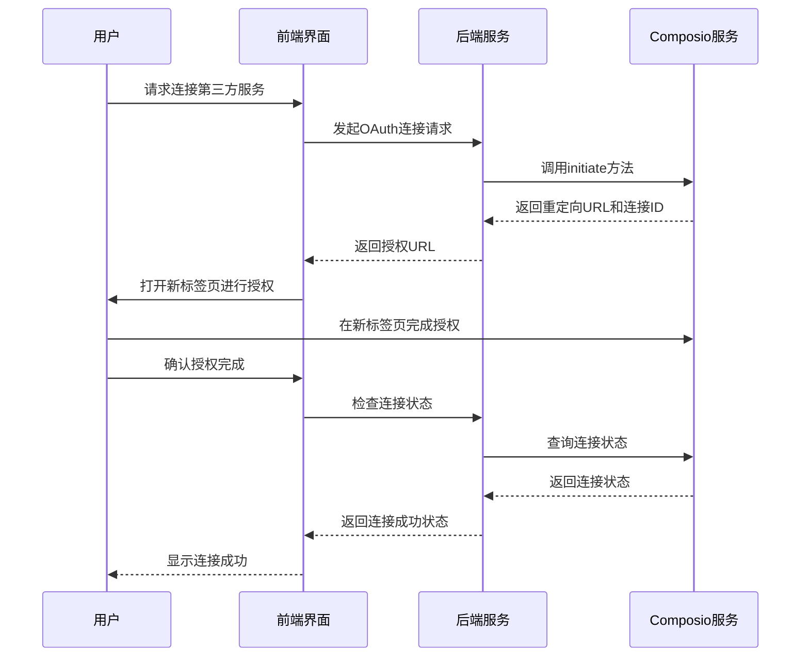
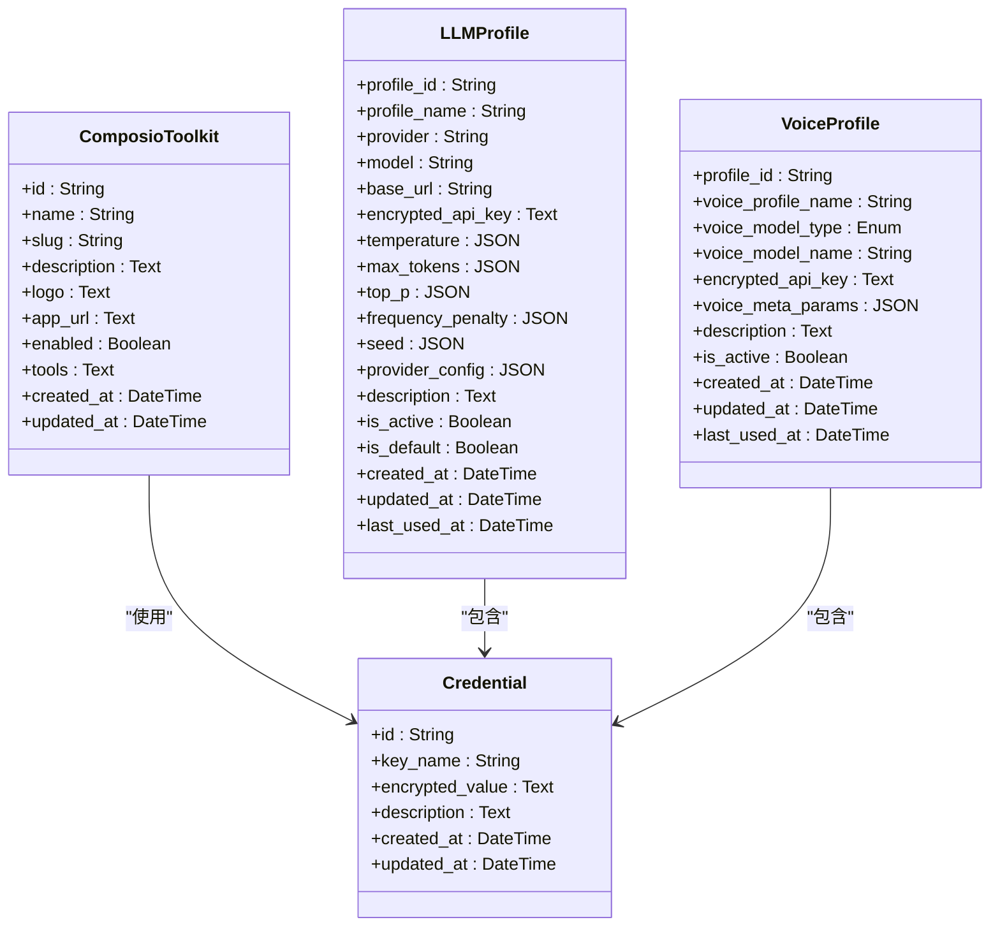
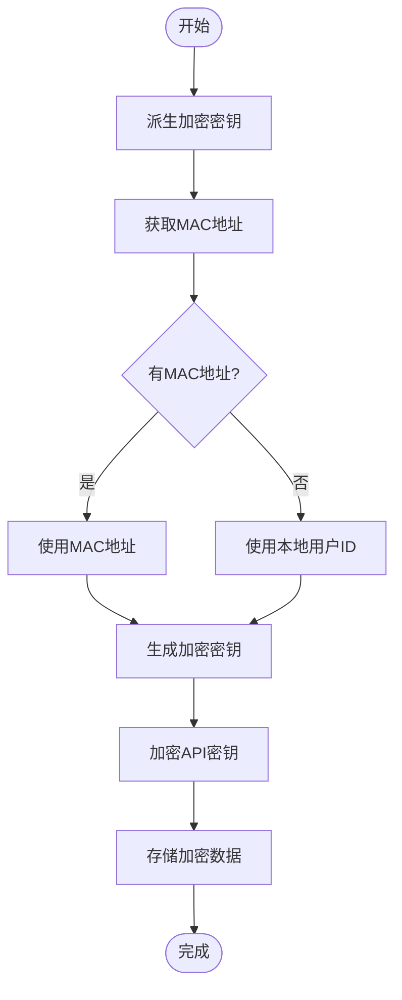
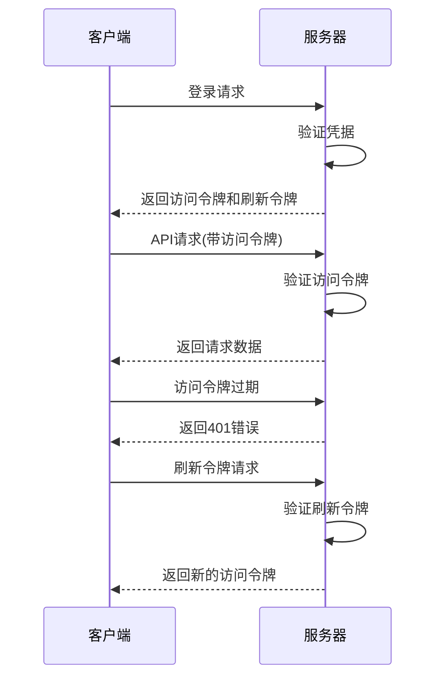
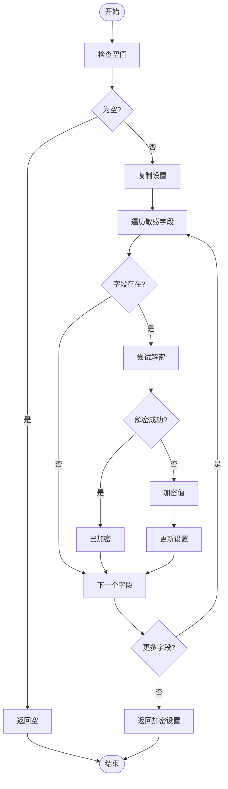
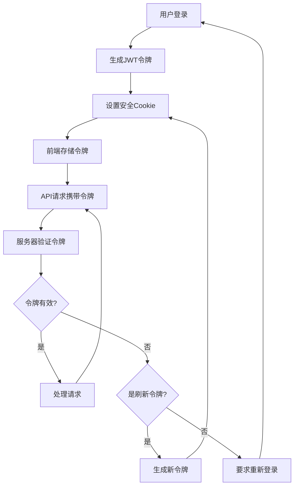

# 安全机制

<cite>
**本文档引用的文件**   
- [encryption.py](file://vibe_surf/backend/utils/encryption.py)
- [mcp_encryption.py](file://vibe_surf/langflow/services/auth/mcp_encryption.py)
- [auth.py](file://vibe_surf/backend/api/composio.py)
- [composio_base.py](file://vibe_surf/langflow/base/composio/composio_base.py)
- [models.py](file://vibe_surf/backend/database/models.py)
- [authContext.tsx](file://vibe_surf/frontend/src/contexts/authContext.tsx)
- [custom-get-access-token.ts](file://vibe_surf/frontend/src/customization/utils/custom-get-access-token.ts)
- [utils.ts](file://vibe_surf/frontend/src/utils/utils.ts)
- [middleware.py](file://vibe_surf/langflow/middleware.py)
- [main.py](file://vibe_surf/langflow/main.py)
</cite>

## 目录
1. [OAuth流程实现](#oauth流程实现)
2. [权限管理模型](#权限管理模型)
3. [数据隐私保护](#数据隐私保护)
4. [认证凭据安全存储](#认证凭据安全存储)
5. [会话管理](#会话管理)
6. [安全配置建议](#安全配置建议)

## OAuth流程实现

VibeSurf平台通过Composio集成实现了OAuth 2.0授权流程，用于安全地连接第三方服务。OAuth流程的实现包括令牌获取、存储和刷新策略。

OAuth连接的初始化通过`_initiate_connection`方法完成，该方法调用Composio API生成重定向URL和连接ID。当用户完成授权后，系统会检查连接状态以确认授权是否成功。对于OAuth2工具包，系统会创建认证连接并生成授权URL，状态会标记为"pending_auth"等待用户完成授权。

令牌的获取和验证通过后端API实现。系统会测试Composio实例并获取支持OAuth2的工具包列表，然后与数据库同步。当用户尝试连接OAuth服务时，系统会生成一个重定向URL，引导用户完成授权过程。

**图源**
- [composio_base.py](file://vibe_surf/langflow/base/composio/composio_base.py#L752-L802)
- [auth.py](file://vibe_surf/backend/api/composio.py#L270-L638)

**节源**
- [composio_base.py](file://vibe_surf/langflow/base/composio/composio_base.py#L752-L802)
- [auth.py](file://vibe_surf/backend/api/composio.py#L270-L638)

## 权限管理模型

VibeSurf平台实现了基于角色的权限管理模型，通过最小化权限范围和权限审计来确保系统安全。

权限管理的核心是OAuth提供者范围（oauth_provider_scope）和MCP范围（oauth_mcp_scope）的配置。系统允许为不同的集成设置特定的权限范围，确保只授予必要的权限。在授权界面中，用户可以查看并确认将授予应用的具体权限。

系统通过数据库中的`credentials`表存储加密的认证凭据，每个凭据都有唯一的`key_name`标识。对于LLM配置文件和语音配置文件，系统使用`encrypted_api_key`字段存储加密的API密钥。这些敏感数据在存储时都经过加密处理，确保即使数据库被泄露，敏感信息也不会暴露。

权限审计通过系统日志和操作记录实现。所有与权限相关的操作，如创建、更新和删除凭据，都会被记录下来。系统还实现了用户管理功能，允许管理员查看和管理用户账户，包括设置用户是否为超级用户。

**图源**
- [models.py](file://vibe_surf/backend/database/models.py#L192-L234)

**节源**
- [models.py](file://vibe_surf/backend/database/models.py#L192-L234)

## 数据隐私保护

VibeSurf平台实施了多层次的数据隐私保护措施，包括敏感数据加密、传输安全和访问控制。

### 敏感数据加密

系统使用`encryption.py`模块实现敏感数据的加密。加密密钥基于机器的MAC地址派生，确保每个安装实例都有唯一的加密密钥。对于无法获取MAC地址的情况，系统会回退到使用本地用户ID作为加密基础。

加密过程使用PBKDF2-HMAC-SHA256算法，通过100,000次迭代生成32字节的密钥。Fernet对称加密算法用于实际的数据加密，确保数据在静态存储时的安全性。

**图源**
- [encryption.py](file://vibe_surf/backend/utils/encryption.py#L23-L40)

### 传输安全

系统通过HTTPS协议确保所有数据传输的安全性。前端与后端之间的通信使用安全的Cookie，设置了`secure: true`和`samesite: strict`属性，防止跨站请求伪造（CSRF）攻击。

在Chrome扩展中，系统使用安全的通信机制与主应用交互。扩展的manifest.json配置了适当的权限和内容安全策略，限制了可能的安全风险。

### 访问控制

访问控制通过JWT（JSON Web Token）实现。系统生成访问令牌和刷新令牌，分别设置不同的过期时间。访问令牌用于常规API调用，而刷新令牌用于获取新的访问令牌。

当用户登录时，系统会创建用户令牌，包括访问令牌和刷新令牌。刷新令牌的验证过程会检查用户是否存在以及账户是否处于活动状态，确保只有有效的用户才能刷新会话。

**图源**
- [authContext.tsx](file://vibe_surf/frontend/src/contexts/authContext.tsx#L81-L97)
- [utils.py](file://vibe_surf/langflow/services/auth/utils.py#L370-L393)

**节源**
- [encryption.py](file://vibe_surf/backend/utils/encryption.py#L23-L40)
- [authContext.tsx](file://vibe_surf/frontend/src/contexts/authContext.tsx#L81-L97)
- [utils.py](file://vibe_surf/langflow/services/auth/utils.py#L370-L393)

## 认证凭据安全存储

VibeSurf平台采用多层安全机制来保护认证凭据的存储安全。

### 加密存储机制

系统使用两种加密机制来保护敏感数据：基于机器MAC地址的加密和基于设置服务的加密。`encryption.py`模块实现了基于MAC地址的加密，而`mcp_encryption.py`模块则使用设置服务提供的密钥进行加密。

在`mcp_encryption.py`中，定义了需要加密的敏感字段列表，包括`oauth_client_secret`和`api_key`。`encrypt_auth_settings`函数会检查这些字段，如果值未加密则进行加密。系统通过尝试解密来判断值是否已加密，如果解密失败则认为是明文并进行加密。

**图源**
- [mcp_encryption.py](file://vibe_surf/langflow/services/auth/mcp_encryption.py#L18-L55)

### 数据库存储

敏感数据存储在数据库的专用字段中，如`Credential`表的`encrypted_value`字段和`LLMProfile`表的`encrypted_api_key`字段。这些字段使用Text类型存储加密后的数据，确保足够的存储空间。

系统通过Alembic迁移脚本确保现有数据的安全性。`encrypt_existing_mcp_auth_settings_.py`迁移脚本会遍历所有包含认证设置的文件夹，对其中的敏感字段进行加密，确保历史数据也符合安全标准。

**节源**
- [mcp_encryption.py](file://vibe_surf/langflow/services/auth/mcp_encryption.py#L18-L55)
- [models.py](file://vibe_surf/backend/database/models.py#L217-L234)
- [encrypt_existing_mcp_auth_settings_.py](file://vibe_surf/langflow/alembic/versions/0882f9657f22_encrypt_existing_mcp_auth_settings_.py#L25-L69)

## 会话管理

VibeSurf平台实现了安全的会话管理机制，防止常见的安全漏洞如CSRF和XSS攻击。

### 会话令牌管理

系统使用JWT进行会话管理，生成访问令牌和刷新令牌。访问令牌的过期时间由`ACCESS_TOKEN_EXPIRE_SECONDS`设置控制，而刷新令牌的过期时间由`REFRESH_TOKEN_EXPIRE_SECONDS`设置控制。

前端通过安全的Cookie存储令牌，使用`react-cookie`库管理Cookie。`customGetAccessToken`函数从Cookie中获取访问令牌，而`setAuthCookie`函数设置Cookie时指定了`secure: true`和`samesite: strict`属性，确保Cookie只能通过HTTPS传输且不能被跨站请求访问。

**图源**
- [custom-get-access-token.ts](file://vibe_surf/frontend/src/customization/utils/custom-get-access-token.ts#L4-L7)
- [utils.ts](file://vibe_surf/frontend/src/utils/utils.ts#L1011-L1025)
- [utils.py](file://vibe_surf/langflow/services/auth/utils.py#L370-L393)

### 安全中间件

后端实现了多个安全中间件来保护API端点。`JavaScriptMIMETypeMiddleware`确保JavaScript内容的正确MIME类型，防止MIME类型混淆攻击。

`ContentSizeLimitMiddleware`限制上传文件的大小，防止拒绝服务攻击。该中间件检查请求体的大小，如果超过`max_file_size_upload`设置的限制，则返回413错误。

CORS（跨域资源共享）配置通过环境变量控制，允许配置允许的来源、方法和头部。系统会警告用户关于未来版本中更严格的CORS默认设置，鼓励用户配置安全的CORS策略。

**节源**
- [custom-get-access-token.ts](file://vibe_surf/frontend/src/customization/utils/custom-get-access-token.ts#L4-L7)
- [utils.ts](file://vibe_surf/frontend/src/utils/utils.ts#L1011-L1025)
- [middleware.py](file://vibe_surf/langflow/middleware.py#L12-L60)
- [main.py](file://vibe_surf/langflow/main.py#L120-L394)

## 安全配置建议

为了确保VibeSurf平台的安全运行，建议遵循以下安全配置指南：

### 生产环境配置

1. **CORS配置**：不要使用通配符(*)作为允许的来源，特别是在启用凭据的情况下。指定确切的来源URL以安全地使用凭据。
2. **数据库安全**：在生产环境中使用PostgreSQL等生产级数据库，而不是SQLite。配置适当的连接池大小和超时设置。
3. **HTTPS强制**：确保所有生产环境都通过HTTPS提供服务，强制使用安全连接。

### 认证安全

1. **令牌过期时间**：根据安全需求调整访问令牌和刷新令牌的过期时间。较短的访问令牌过期时间可以减少令牌泄露的风险。
2. **多因素认证**：考虑实现多因素认证机制，为敏感操作提供额外的安全层。
3. **凭据轮换**：定期轮换API密钥和其他长期凭据，减少凭据泄露的影响。

### 合规性指南

1. **数据最小化**：只收集和存储必要的数据，遵循数据最小化原则。
2. **审计日志**：保持详细的审计日志，记录所有敏感操作，便于安全审查和故障排查。
3. **定期安全评估**：定期进行安全评估和渗透测试，识别和修复潜在的安全漏洞。

4. **依赖更新**：保持所有依赖库的最新状态，及时应用安全补丁。