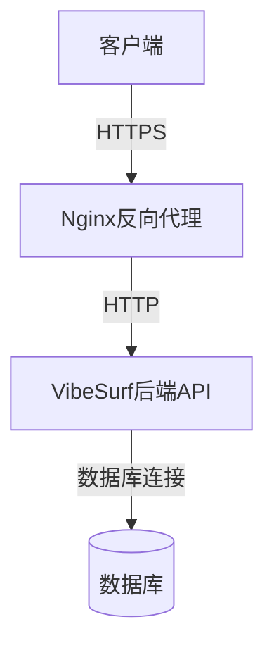
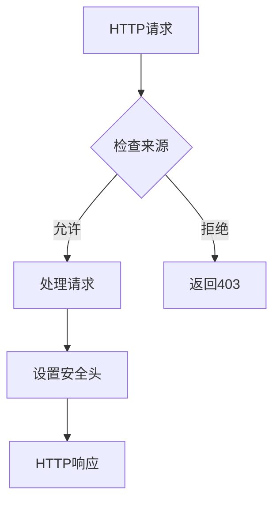
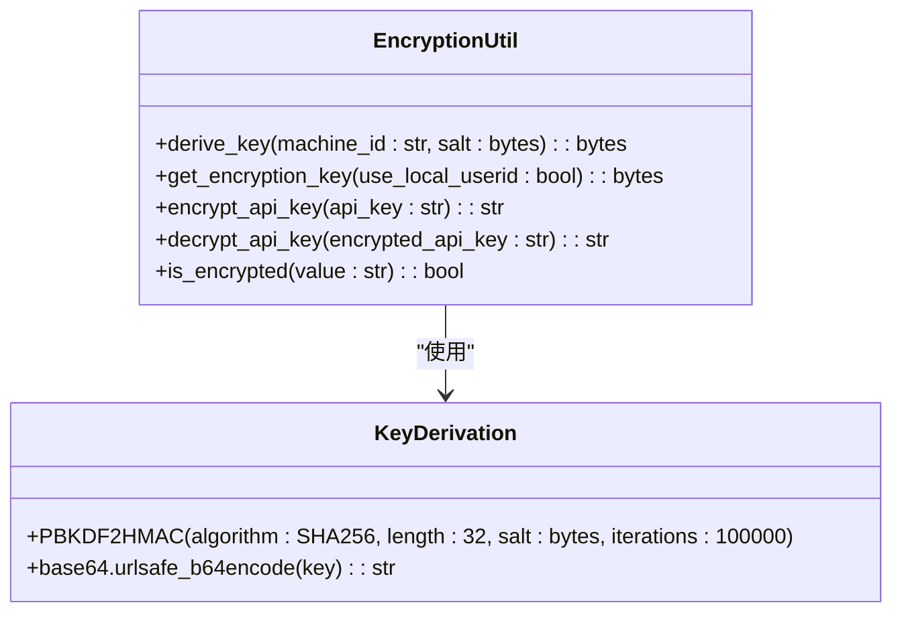
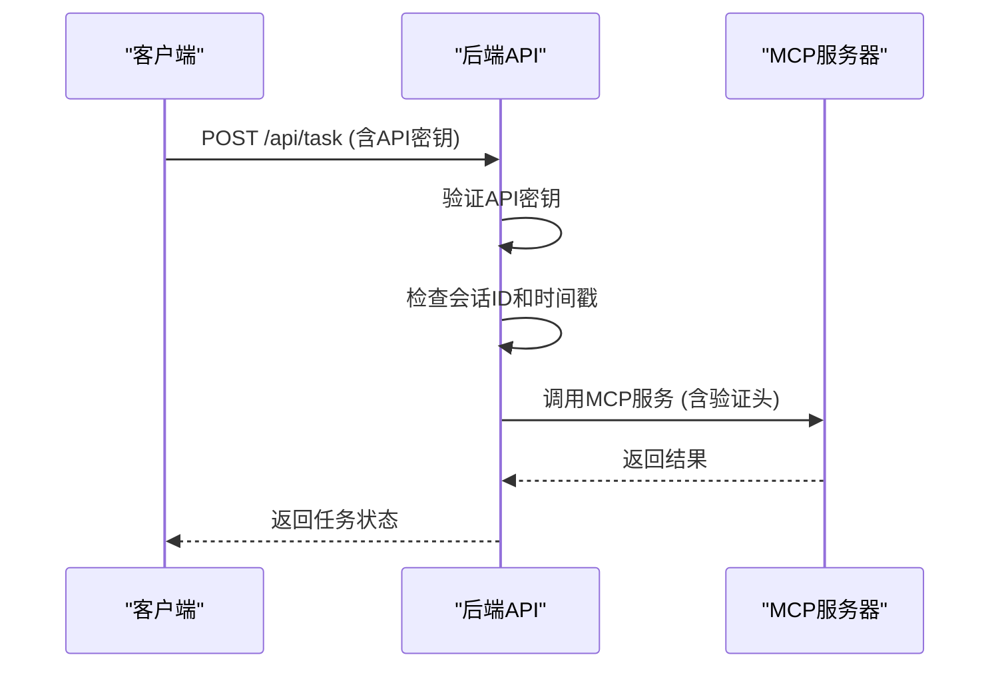

# 传输安全

<cite>
**本文档中引用的文件**   
- [main.py](file://vibe_surf/backend/main.py)
- [encryption.py](file://vibe_surf/backend/utils/encryption.py)
- [config.js](file://vibe_surf/chrome_extension/config.js)
- [nginx.conf](file://vibe_surf/frontend/nginx.conf)
- [start-nginx.sh](file://vibe_surf/frontend/start-nginx.sh)
- [util.py](file://vibe_surf/langflow/base/mcp/util.py)
- [models.py](file://vibe_surf/backend/api/models.py)
- [shared_state.py](file://vibe_surf/backend/shared_state.py)
- [.env.example](file://.env.example)
</cite>

## 目录
1. [引言](#引言)
2. [HTTPS/TLS配置](#httpstls配置)
3. [证书管理](#证书管理)
4. [安全头设置](#安全头设置)
5. [传输加密策略](#传输加密策略)
6. [API通信安全保障](#api通信安全保障)
7. [最佳实践指南](#最佳实践指南)

## 引言
VibeSurf是一个集成了Langflow的简化单任务执行模型，通过Chrome扩展与后端API进行通信。本项目采用多种安全机制来保护数据传输和用户隐私，包括HTTPS/TLS配置、证书管理、安全头设置和传输加密策略。API通信通过认证、授权和防重放攻击机制得到保障。本文档详细说明了这些安全措施，并提供了配置安全API端点和防止中间人攻击的最佳实践指南。

**Section sources**
- [main.py](file://vibe_surf/backend/main.py#L1-L794)

## HTTPS/TLS配置
VibeSurf后端API使用FastAPI框架，通过uvicorn服务器运行。默认情况下，它在本地主机的9335端口上监听HTTP请求。为了启用HTTPS，需要在部署时配置反向代理服务器（如Nginx）来处理SSL/TLS终止。前端使用Nginx作为反向代理，将来自80端口的请求转发到后端服务。这种配置允许在生产环境中轻松地添加SSL证书，而无需修改应用程序代码。

**Diagram sources**
- [nginx.conf](file://vibe_surf/frontend/nginx.conf#L1-L21)
- [main.py](file://vibe_surf/backend/main.py#L775-L794)

## 证书管理
VibeSurf项目本身不直接管理SSL/TLS证书，而是依赖于外部反向代理（如Nginx）来处理证书管理。开发人员可以使用Let's Encrypt等服务获取免费的SSL证书，并将其配置在Nginx中。对于Chrome扩展，通信安全性通过确保后端URL的正确配置来维护。扩展的`config.js`文件中定义了`BACKEND_URL`，该URL应指向使用有效SSL证书保护的HTTPS端点。

**Section sources**
- [config.js](file://vibe_surf/chrome_extension/config.js#L1-L56)
- [nginx.conf](file://vibe_surf/frontend/nginx.conf#L1-L21)

## 安全头设置
VibeSurf后端API通过FastAPI的中间件机制设置了多种安全相关的HTTP头。CORS（跨域资源共享）中间件被配置为允许所有来源的请求，这在开发环境中是必要的，但在生产环境中应该限制为特定的可信来源。此外，JavaScript MIME类型中间件确保JavaScript文件以正确的`text/javascript`内容类型提供服务，防止MIME类型混淆攻击。

**Diagram sources**
- [main.py](file://vibe_surf/backend/main.py#L566-L575)

## 传输加密策略
VibeSurf采用多层加密策略来保护敏感数据。API密钥等敏感信息使用基于机器MAC地址的密钥派生函数（PBKDF2）进行加密。加密密钥通过`derive_key`函数从机器ID生成，使用固定的盐值和100,000次迭代的SHA256哈希算法。加密后的API密钥以Base64编码存储，确保即使数据库被泄露，攻击者也无法轻易解密敏感信息。

**Diagram sources**
- [encryption.py](file://vibe_surf/backend/utils/encryption.py#L1-L172)

## API通信安全保障
VibeSurf的API通信通过多种机制得到安全保障。首先，所有API端点都要求有效的API密钥进行身份验证。其次，系统实现了防重放攻击机制，通过会话ID和时间戳来确保每个请求的唯一性。此外，MCP（Model Control Protocol）服务器的通信经过严格验证，只允许预定义的HTTP头，防止潜在的头注入攻击。WebSocket连接也受到保护，要求通过JWT或API密钥进行身份验证。

**Diagram sources**
- [main.py](file://vibe_surf/backend/main.py#L580-L590)
- [util.py](file://vibe_surf/langflow/base/mcp/util.py#L62-L82)
- [models.py](file://vibe_surf/backend/api/models.py#L101-L134)

## 最佳实践指南
为了确保VibeSurf的安全性，建议遵循以下最佳实践：在生产环境中，始终使用HTTPS并配置有效的SSL证书；限制CORS策略，只允许可信的来源；定期轮换API密钥，并使用强密码策略；监控系统日志以检测异常活动；保持所有依赖项更新，以防止已知漏洞被利用。此外，应定期审计代码和配置，确保没有硬编码的敏感信息，并使用环境变量来管理配置。

**Section sources**
- [.env.example](file://.env.example#L1-L55)
- [shared_state.py](file://vibe_surf/backend/shared_state.py#L453-L454)