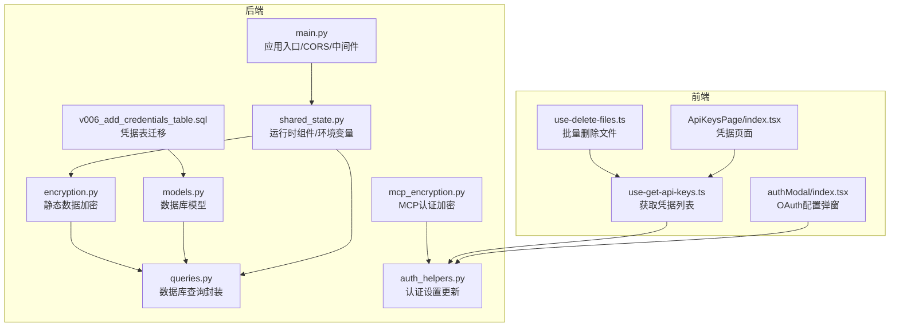
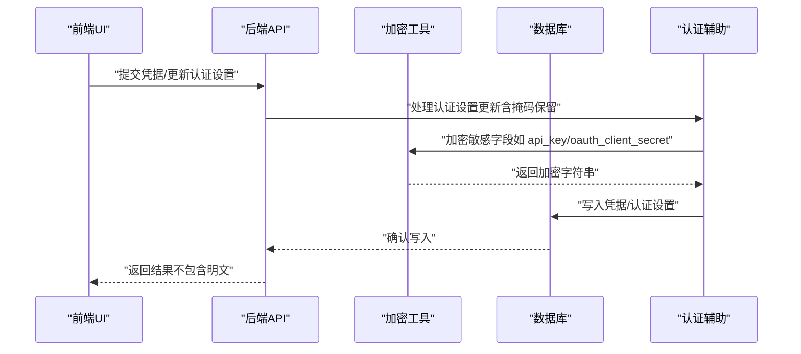
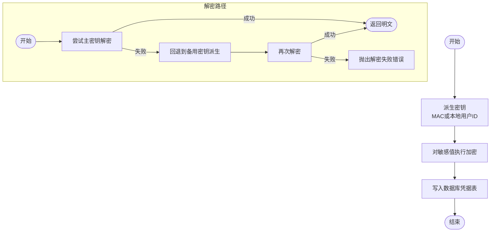
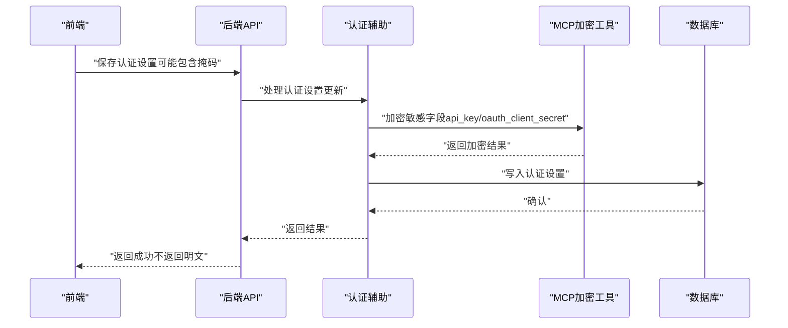
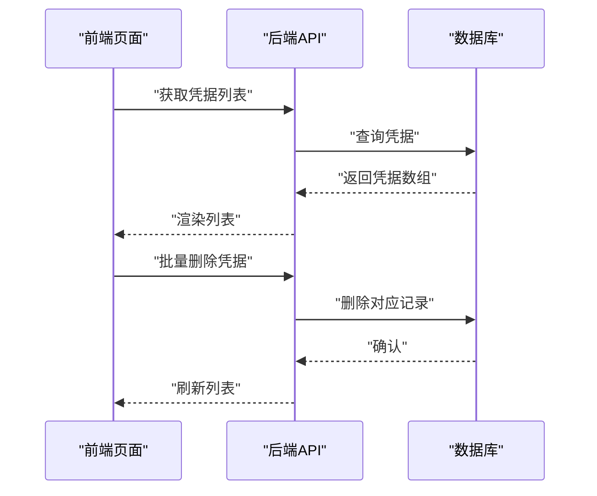
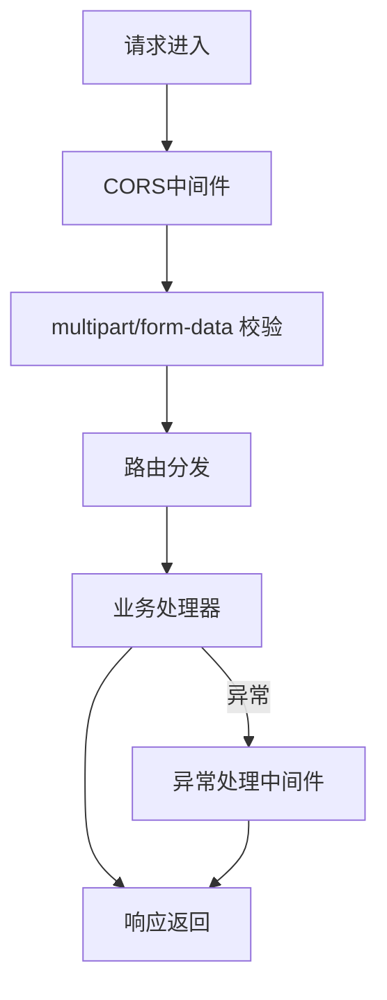
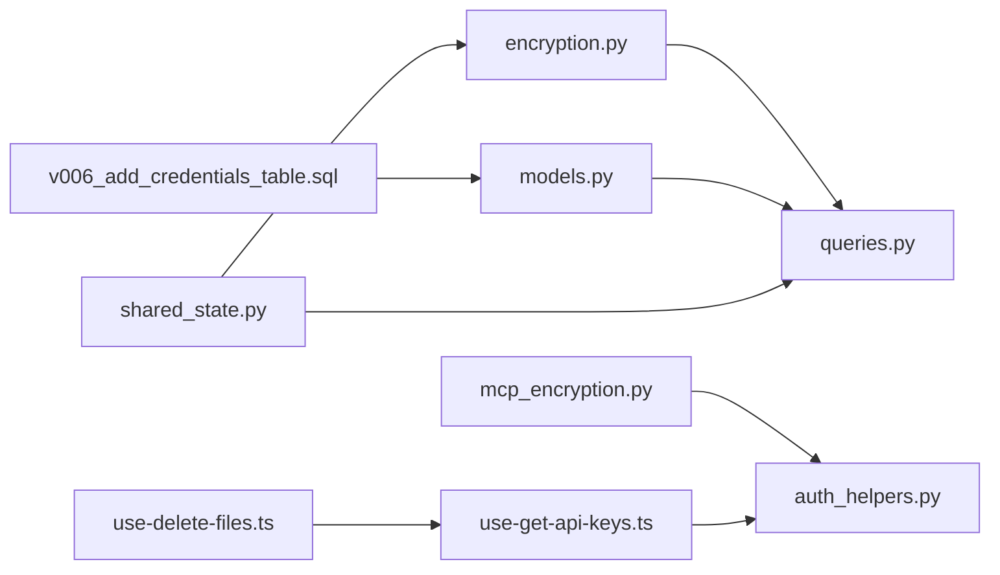

# 数据保护

<cite>
**本文引用的文件**
- [encryption.py](file://vibe_surf/backend/utils/encryption.py)
- [queries.py](file://vibe_surf/backend/database/queries.py)
- [models.py](file://vibe_surf/backend/database/models.py)
- [v006_add_credentials_table.sql](file://vibe_surf/backend/database/migrations/v006_add_credentials_table.sql)
- [mcp_encryption.py](file://vibe_surf/langflow/services/auth/mcp_encryption.py)
- [auth_helpers.py](file://vibe_surf/langflow/api/v1/auth_helpers.py)
- [main.py](file://vibe_surf/backend/main.py)
- [.env.example](file://.env.example)
- [shared_state.py](file://vibe_surf/backend/shared_state.py)
- [files.py](file://vibe_surf/langflow/api/v2/files.py)
- [temp_flow_cleanup.py](file://vibe_surf/langflow/services/task/temp_flow_cleanup.py)
- [use-delete-files.ts](file://vibe_surf/frontend/src/controllers/API/queries/file-management/use-delete-files.ts)
- [use-get-api-keys.ts](file://vibe_surf/frontend/src/controllers/API/queries/api-keys/use-get-api-keys.ts)
- [index.tsx](file://vibe_surf/frontend/src/pages/SettingsPage/pages/ApiKeysPage/index.tsx)
- [index.tsx](file://vibe_surf/frontend/src/modals/authModal/index.tsx)
- [vibe_surf_prompt.py](file://vibe_surf/agents/prompts/vibe_surf_prompt.py)
</cite>

## 目录
1. [简介](#简介)
2. [项目结构与数据保护相关模块](#项目结构与数据保护相关模块)
3. [核心组件与职责](#核心组件与职责)
4. [架构总览](#架构总览)
5. [详细组件分析](#详细组件分析)
6. [依赖关系分析](#依赖关系分析)
7. [性能与安全特性](#性能与安全特性)
8. [故障排查与错误处理](#故障排查与错误处理)
9. [结论](#结论)
10. [附录：配置指南与合规建议](#附录配置指南与合规建议)

## 简介
本文件系统化梳理 VibeSurf 的数据保护措施，重点覆盖：
- 静态数据加密（基于设备标识派生密钥的对称加密）
- 传输层安全（应用内使用本地回环地址与受控前端集成，结合中间件与网关实践）
- 数据隐私策略（数据最小化、访问控制、敏感字段处理）
- 凭据与密钥的安全存储与生命周期管理（创建、更新、删除）
- 数据生命周期策略（保留、归档、安全删除）
- 安全配置与合规建议

## 项目结构与数据保护相关模块
- 后端工具与数据库层：加密工具、数据库模型、迁移脚本、查询封装
- 认证与授权：Langflow 层的认证辅助与 MCP 加密工具
- 前端与 API：凭据列表、删除操作、OAuth 配置弹窗
- 运行时与代理：共享状态中环境变量与浏览器会话管理

图表来源
- [encryption.py](file://vibe_surf/backend/utils/encryption.py#L1-L172)
- [models.py](file://vibe_surf/backend/database/models.py#L1-L289)
- [queries.py](file://vibe_surf/backend/database/queries.py#L1367-L1405)
- [v006_add_credentials_table.sql](file://vibe_surf/backend/database/migrations/v006_add_credentials_table.sql#L1-L26)
- [mcp_encryption.py](file://vibe_surf/langflow/services/auth/mcp_encryption.py#L1-L76)
- [auth_helpers.py](file://vibe_surf/langflow/api/v1/auth_helpers.py#L1-L75)
- [main.py](file://vibe_surf/backend/main.py#L543-L750)
- [shared_state.py](file://vibe_surf/backend/shared_state.py#L453-L598)
- [use-get-api-keys.ts](file://vibe_surf/frontend/src/controllers/API/queries/api-keys/use-get-api-keys.ts#L1-L42)
- [use-delete-files.ts](file://vibe_surf/frontend/src/controllers/API/queries/file-management/use-delete-files.ts#L1-L43)
- [index.tsx](file://vibe_surf/frontend/src/pages/SettingsPage/pages/ApiKeysPage/index.tsx#L29-L109)
- [index.tsx](file://vibe_surf/frontend/src/modals/authModal/index.tsx#L1-L384)

章节来源
- [encryption.py](file://vibe_surf/backend/utils/encryption.py#L1-L172)
- [models.py](file://vibe_surf/backend/database/models.py#L1-L289)
- [queries.py](file://vibe_surf/backend/database/queries.py#L1367-L1405)
- [v006_add_credentials_table.sql](file://vibe_surf/backend/database/migrations/v006_add_credentials_table.sql#L1-L26)
- [mcp_encryption.py](file://vibe_surf/langflow/services/auth/mcp_encryption.py#L1-L76)
- [auth_helpers.py](file://vibe_surf/langflow/api/v1/auth_helpers.py#L1-L75)
- [main.py](file://vibe_surf/backend/main.py#L543-L750)
- [shared_state.py](file://vibe_surf/backend/shared_state.py#L453-L598)
- [use-get-api-keys.ts](file://vibe_surf/frontend/src/controllers/API/queries/api-keys/use-get-api-keys.ts#L1-L42)
- [use-delete-files.ts](file://vibe_surf/frontend/src/controllers/API/queries/file-management/use-delete-files.ts#L1-L43)
- [index.tsx](file://vibe_surf/frontend/src/pages/SettingsPage/pages/ApiKeysPage/index.tsx#L29-L109)
- [index.tsx](file://vibe_surf/frontend/src/modals/authModal/index.tsx#L1-L384)

## 核心组件与职责
- 静态数据加密（后端）：以设备 MAC 或本地用户 ID 派生密钥，使用对称加密算法存储敏感值（如 API 密钥），并提供加解密与检测函数。
- 数据库模型与迁移：凭据表用于存储加密后的键值；索引与触发器保障查询效率与时间戳一致性。
- 查询封装：统一的凭据存取接口，负责加密入库与解密读取。
- 认证与授权：Langflow 层对 OAuth/ApiKey 字段进行加密存储，并在更新时保留前端掩码字段的已有值。
- 应用入口与中间件：CORS、内容类型校验、异常处理等，确保请求边界与响应安全。
- 运行时组件：共享状态维护工作区目录、浏览器会话、数据库连接与环境变量，影响凭据加载与使用。
- 前端交互：凭据列表展示、删除操作、OAuth 配置弹窗，避免明文泄露。

章节来源
- [encryption.py](file://vibe_surf/backend/utils/encryption.py#L23-L127)
- [models.py](file://vibe_surf/backend/database/models.py#L217-L235)
- [v006_add_credentials_table.sql](file://vibe_surf/backend/database/migrations/v006_add_credentials_table.sql#L1-L26)
- [queries.py](file://vibe_surf/backend/database/queries.py#L1367-L1405)
- [mcp_encryption.py](file://vibe_surf/langflow/services/auth/mcp_encryption.py#L1-L76)
- [auth_helpers.py](file://vibe_surf/langflow/api/v1/auth_helpers.py#L1-L75)
- [main.py](file://vibe_surf/backend/main.py#L566-L626)
- [shared_state.py](file://vibe_surf/backend/shared_state.py#L453-L598)
- [use-get-api-keys.ts](file://vibe_surf/frontend/src/controllers/API/queries/api-keys/use-get-api-keys.ts#L1-L42)
- [index.tsx](file://vibe_surf/frontend/src/pages/SettingsPage/pages/ApiKeysPage/index.tsx#L29-L109)
- [index.tsx](file://vibe_surf/frontend/src/modals/authModal/index.tsx#L1-L384)

## 架构总览
下图展示从“凭据输入/更新”到“数据库持久化”的关键路径，以及前端调用与后端加密流程的关系。

图表来源
- [auth_helpers.py](file://vibe_surf/langflow/api/v1/auth_helpers.py#L1-L75)
- [mcp_encryption.py](file://vibe_surf/langflow/services/auth/mcp_encryption.py#L1-L76)
- [encryption.py](file://vibe_surf/backend/utils/encryption.py#L76-L127)
- [queries.py](file://vibe_surf/backend/database/queries.py#L1367-L1405)

## 详细组件分析

### 组件A：静态数据加密与凭据存储
- 设备标识派生密钥：优先使用 MAC 地址，若不可用则回退到本地用户 ID；固定盐值提升一致性。
- 对称加密：使用对称加密算法对敏感值进行加密，返回可安全存储的字符串。
- 解密与回退：解密失败时尝试回退密钥派生方式，保证兼容性。
- 存储模型：凭据表包含唯一键名、加密值与元数据；迁移脚本创建索引与自动更新时间戳触发器。
- 查询封装：统一的凭据存储接口，负责加密入库与错误日志记录。

图表来源
- [encryption.py](file://vibe_surf/backend/utils/encryption.py#L23-L127)
- [v006_add_credentials_table.sql](file://vibe_surf/backend/database/migrations/v006_add_credentials_table.sql#L1-L26)
- [models.py](file://vibe_surf/backend/database/models.py#L217-L235)
- [queries.py](file://vibe_surf/backend/database/queries.py#L1367-L1405)

章节来源
- [encryption.py](file://vibe_surf/backend/utils/encryption.py#L23-L127)
- [models.py](file://vibe_surf/backend/database/models.py#L217-L235)
- [v006_add_credentials_table.sql](file://vibe_surf/backend/database/migrations/v006_add_credentials_table.sql#L1-L26)
- [queries.py](file://vibe_surf/backend/database/queries.py#L1367-L1405)

### 组件B：认证设置更新与敏感字段处理
- 掩码保留：当前端返回掩码占位符时，保留数据库中已存在的敏感值，避免覆盖。
- 加密/解密：根据当前认证类型决定是否需要解密现有值以保留敏感字段，再对新值进行加密。
- MCP Composer 行为：根据认证类型变化启动或停止 Composer。

图表来源
- [auth_helpers.py](file://vibe_surf/langflow/api/v1/auth_helpers.py#L1-L75)
- [mcp_encryption.py](file://vibe_surf/langflow/services/auth/mcp_encryption.py#L1-L76)

章节来源
- [auth_helpers.py](file://vibe_surf/langflow/api/v1/auth_helpers.py#L1-L75)
- [mcp_encryption.py](file://vibe_surf/langflow/services/auth/mcp_encryption.py#L1-L76)

### 组件C：前端凭据管理与删除
- 获取凭据列表：通过查询接口拉取用户凭据数组，包含名称、使用次数、创建时间等元信息。
- 删除凭据：支持批量删除，删除后刷新列表。
- 文件清理：提供按用户维度的文件删除接口，配合后端清理逻辑实现数据最小化。

图表来源
- [use-get-api-keys.ts](file://vibe_surf/frontend/src/controllers/API/queries/api-keys/use-get-api-keys.ts#L1-L42)
- [index.tsx](file://vibe_surf/frontend/src/pages/SettingsPage/pages/ApiKeysPage/index.tsx#L29-L109)

章节来源
- [use-get-api-keys.ts](file://vibe_surf/frontend/src/controllers/API/queries/api-keys/use-get-api-keys.ts#L1-L42)
- [index.tsx](file://vibe_surf/frontend/src/pages/SettingsPage/pages/ApiKeysPage/index.tsx#L29-L109)

### 组件D：传输层安全与中间件
- CORS：默认允许所有源、凭证、方法与头，便于前端与后端联调。
- 内容类型校验：对特定上传接口进行 multipart 边界格式校验，防止畸形请求。
- 异常处理：统一捕获未处理异常与序列化异常，返回结构化错误信息。
- 中间件：JS MIME 类型修正中间件，确保前端资源正确解析。

图表来源
- [main.py](file://vibe_surf/backend/main.py#L566-L626)
- [main.py](file://vibe_surf/backend/main.py#L627-L724)

章节来源
- [main.py](file://vibe_surf/backend/main.py#L566-L626)
- [main.py](file://vibe_surf/backend/main.py#L627-L724)

## 依赖关系分析
- 加密工具依赖设备标识与固定盐值，确保同一设备上一致的密钥派生。
- 数据库模型与迁移脚本定义凭据表结构与索引，查询封装统一存取流程。
- 认证辅助依赖加密工具与数据库模型，处理敏感字段的加密与掩码保留。
- 前端通过查询接口与后端交互，避免直接暴露明文凭据。
- 运行时组件负责初始化数据库、浏览器与 LLM，间接影响凭据加载与使用。

图表来源
- [encryption.py](file://vibe_surf/backend/utils/encryption.py#L23-L127)
- [models.py](file://vibe_surf/backend/database/models.py#L217-L235)
- [v006_add_credentials_table.sql](file://vibe_surf/backend/database/migrations/v006_add_credentials_table.sql#L1-L26)
- [queries.py](file://vibe_surf/backend/database/queries.py#L1367-L1405)
- [mcp_encryption.py](file://vibe_surf/langflow/services/auth/mcp_encryption.py#L1-L76)
- [auth_helpers.py](file://vibe_surf/langflow/api/v1/auth_helpers.py#L1-L75)
- [shared_state.py](file://vibe_surf/backend/shared_state.py#L453-L598)
- [use-get-api-keys.ts](file://vibe_surf/frontend/src/controllers/API/queries/api-keys/use-get-api-keys.ts#L1-L42)
- [use-delete-files.ts](file://vibe_surf/frontend/src/controllers/API/queries/file-management/use-delete-files.ts#L1-L43)

章节来源
- [encryption.py](file://vibe_surf/backend/utils/encryption.py#L23-L127)
- [models.py](file://vibe_surf/backend/database/models.py#L217-L235)
- [v006_add_credentials_table.sql](file://vibe_surf/backend/database/migrations/v006_add_credentials_table.sql#L1-L26)
- [queries.py](file://vibe_surf/backend/database/queries.py#L1367-L1405)
- [mcp_encryption.py](file://vibe_surf/langflow/services/auth/mcp_encryption.py#L1-L76)
- [auth_helpers.py](file://vibe_surf/langflow/api/v1/auth_helpers.py#L1-L75)
- [shared_state.py](file://vibe_surf/backend/shared_state.py#L453-L598)
- [use-get-api-keys.ts](file://vibe_surf/frontend/src/controllers/API/queries/api-keys/use-get-api-keys.ts#L1-L42)
- [use-delete-files.ts](file://vibe_surf/frontend/src/controllers/API/queries/file-management/use-delete-files.ts#L1-L43)

## 性能与安全特性
- 加密性能：PBKDF2 使用固定迭代次数与固定盐值，保证派生一致性；对称加密用于小体量敏感字段，开销可控。
- 数据库性能：凭据表建立唯一键名索引与自动更新时间戳触发器，减少重复写入与提升查询效率。
- 请求边界：CORS 允许跨域但严格限制方法与头；multipart 校验防止畸形请求。
- 异常处理：统一捕获与序列化异常，避免内部细节泄露。

章节来源
- [encryption.py](file://vibe_surf/backend/utils/encryption.py#L23-L127)
- [v006_add_credentials_table.sql](file://vibe_surf/backend/database/migrations/v006_add_credentials_table.sql#L1-L26)
- [main.py](file://vibe_surf/backend/main.py#L566-L626)
- [main.py](file://vibe_surf/backend/main.py#L627-L724)

## 故障排查与错误处理
- 加密失败：检查设备标识可用性与本地用户 ID 生成逻辑；确认密钥派生与对称加密流程。
- 解密失败：确认是否启用回退密钥派生；核对加密值格式与长度判断逻辑。
- 数据库写入失败：检查凭据表结构、唯一键约束与触发器；查看查询封装的日志。
- 前端删除异常：确认批量删除接口参数与权限；检查后端异常处理返回。
- OAuth 配置问题：核对前端弹窗填写项与后端认证设置更新逻辑。

章节来源
- [encryption.py](file://vibe_surf/backend/utils/encryption.py#L76-L127)
- [queries.py](file://vibe_surf/backend/database/queries.py#L1367-L1405)
- [use-delete-files.ts](file://vibe_surf/frontend/src/controllers/API/queries/file-management/use-delete-files.ts#L1-L43)
- [index.tsx](file://vibe_surf/frontend/src/modals/authModal/index.tsx#L1-L384)

## 结论
VibeSurf 在数据保护方面采用“静态加密 + 受控传输 + 最小化原则”的组合策略：
- 静态数据加密：以设备标识派生密钥，对敏感字段进行对称加密，确保离线存储安全。
- 传输层安全：通过 CORS、内容类型校验与异常处理中间件，降低请求面风险。
- 数据隐私：前端仅展示非敏感元信息，后端在认证设置更新时保留掩码字段，避免明文泄露。
- 生命周期管理：提供凭据与文件的删除能力，结合清理任务实现数据最小化与安全删除。

## 附录：配置指南与合规建议

### 配置指南
- 环境变量
  - 建议将敏感 API 密钥置于后端环境变量或凭据表中，避免硬编码于前端或配置文件。
  - 示例参考：[.env.example](file://.env.example#L1-L55)
- 数据库与凭据
  - 凭据表结构与索引由迁移脚本定义，确保唯一键名与自动更新时间戳。
  - 参考：[v006_add_credentials_table.sql](file://vibe_surf/backend/database/migrations/v006_add_credentials_table.sql#L1-L26)
- 应用入口
  - CORS 默认允许所有源，生产部署建议收紧允许源与头。
  - 参考：[main.py](file://vibe_surf/backend/main.py#L566-L575)

章节来源
- [.env.example](file://.env.example#L1-L55)
- [v006_add_credentials_table.sql](file://vibe_surf/backend/database/migrations/v006_add_credentials_table.sql#L1-L26)
- [main.py](file://vibe_surf/backend/main.py#L566-L575)

### 数据隐私与访问控制
- 数据最小化：仅存储必要的元信息，敏感值必须加密；前端不显示明文。
- 访问控制：认证设置更新时保留掩码字段，避免覆盖已有值；OAuth 配置通过弹窗输入并加密存储。
- 安全提示：系统内置安全指南，拒绝执行可能危害系统的代码与访问用户隐私数据的请求。
  - 参考：[vibe_surf_prompt.py](file://vibe_surf/agents/prompts/vibe_surf_prompt.py#L154-L171)

章节来源
- [auth_helpers.py](file://vibe_surf/langflow/api/v1/auth_helpers.py#L1-L75)
- [index.tsx](file://vibe_surf/frontend/src/modals/authModal/index.tsx#L1-L384)
- [vibe_surf_prompt.py](file://vibe_surf/agents/prompts/vibe_surf_prompt.py#L154-L171)

### 数据生命周期管理
- 保留策略：凭据与文件均记录创建/更新时间戳，便于审计与合规追溯。
- 归档策略：建议在业务侧增加归档标记与定期清理流程（例如按月/季度导出审计日志）。
- 安全删除：
  - 凭据删除：通过前端凭据页面批量删除，后端写入数据库并返回刷新列表。
    - 参考：[use-get-api-keys.ts](file://vibe_surf/frontend/src/controllers/API/queries/api-keys/use-get-api-keys.ts#L1-L42)，[index.tsx](file://vibe_surf/frontend/src/pages/SettingsPage/pages/ApiKeysPage/index.tsx#L29-L109)
  - 文件删除：按用户维度删除文件与记录，配合后端清理任务。
    - 参考：[files.py](file://vibe_surf/langflow/api/v2/files.py#L506-L532)，[temp_flow_cleanup.py](file://vibe_surf/langflow/services/task/temp_flow_cleanup.py#L49-L71)，[use-delete-files.ts](file://vibe_surf/frontend/src/controllers/API/queries/file-management/use-delete-files.ts#L1-L43)

章节来源
- [use-get-api-keys.ts](file://vibe_surf/frontend/src/controllers/API/queries/api-keys/use-get-api-keys.ts#L1-L42)
- [index.tsx](file://vibe_surf/frontend/src/pages/SettingsPage/pages/ApiKeysPage/index.tsx#L29-L109)
- [files.py](file://vibe_surf/langflow/api/v2/files.py#L506-L532)
- [temp_flow_cleanup.py](file://vibe_surf/langflow/services/task/temp_flow_cleanup.py#L49-L71)
- [use-delete-files.ts](file://vibe_surf/frontend/src/controllers/API/queries/file-management/use-delete-files.ts#L1-L43)

### 合规建议
- 加密强度：PBKDF2 迭代次数较高，满足一般场景；如需更强合规要求，可考虑引入硬件安全模块或 KMS。
- 日志与审计：开启审计日志记录凭据变更与删除事件，保留至少合规要求的最短期限。
- 访问最小化：仅授予必要人员访问凭据的能力；对凭据表与认证设置的修改进行双因子或多因素审批。
- 数据最小化：定期审查与清理不再使用的凭据与文件，遵循“按需收集、按期删除”的原则。

[本节为通用指导，不直接分析具体文件]