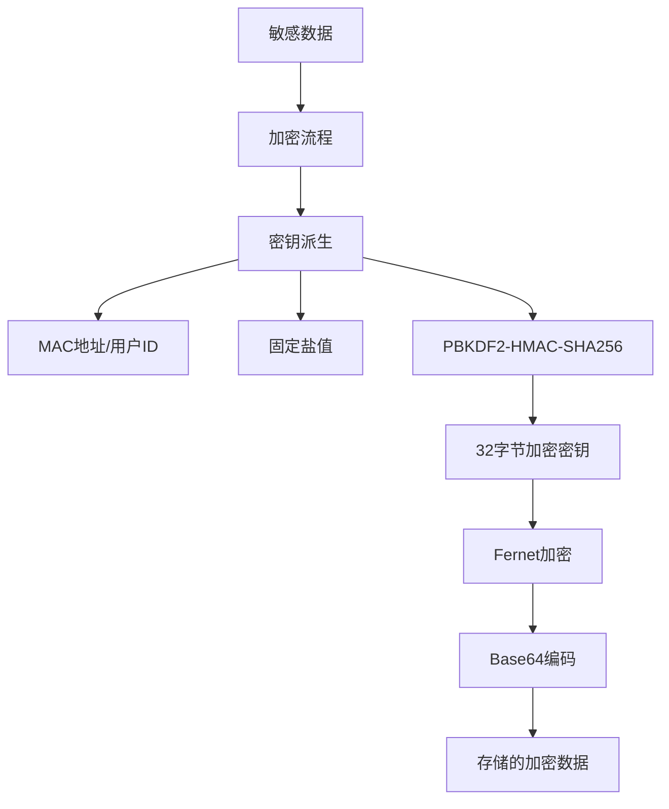
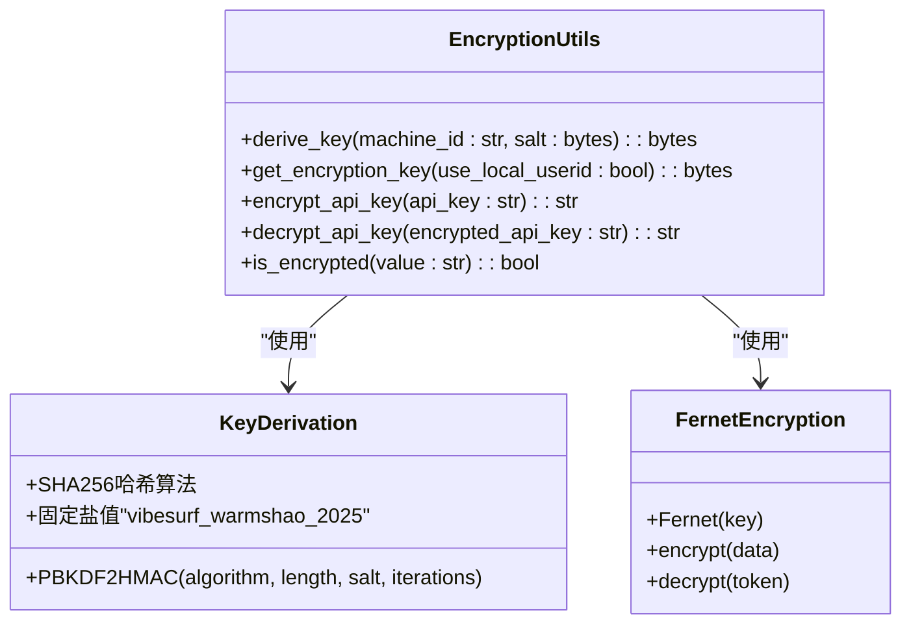
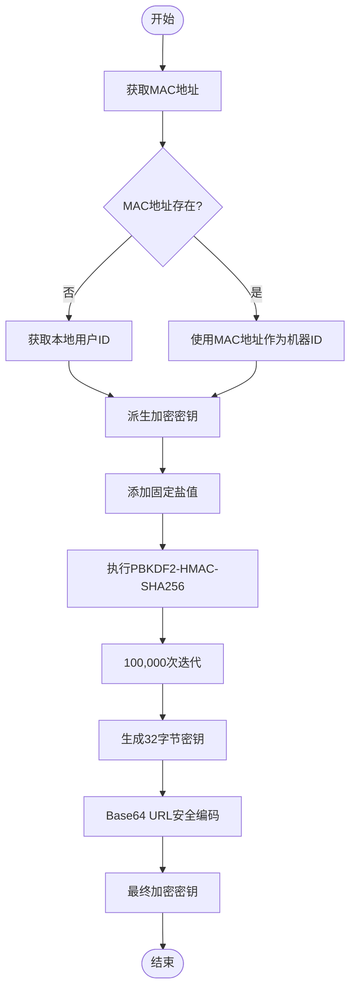
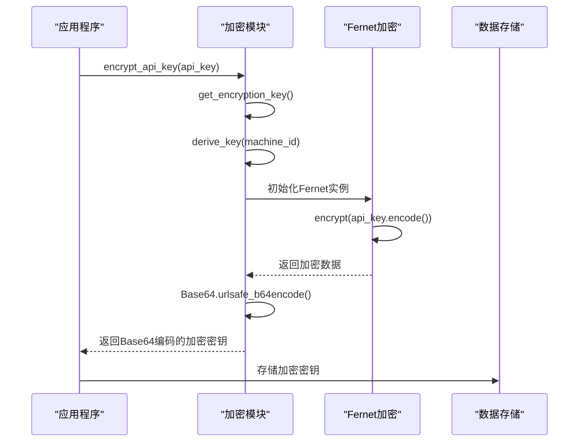
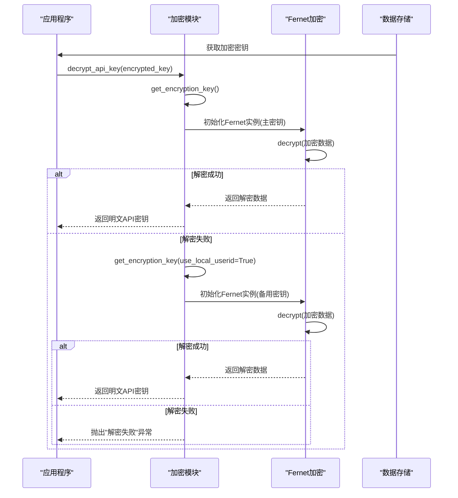
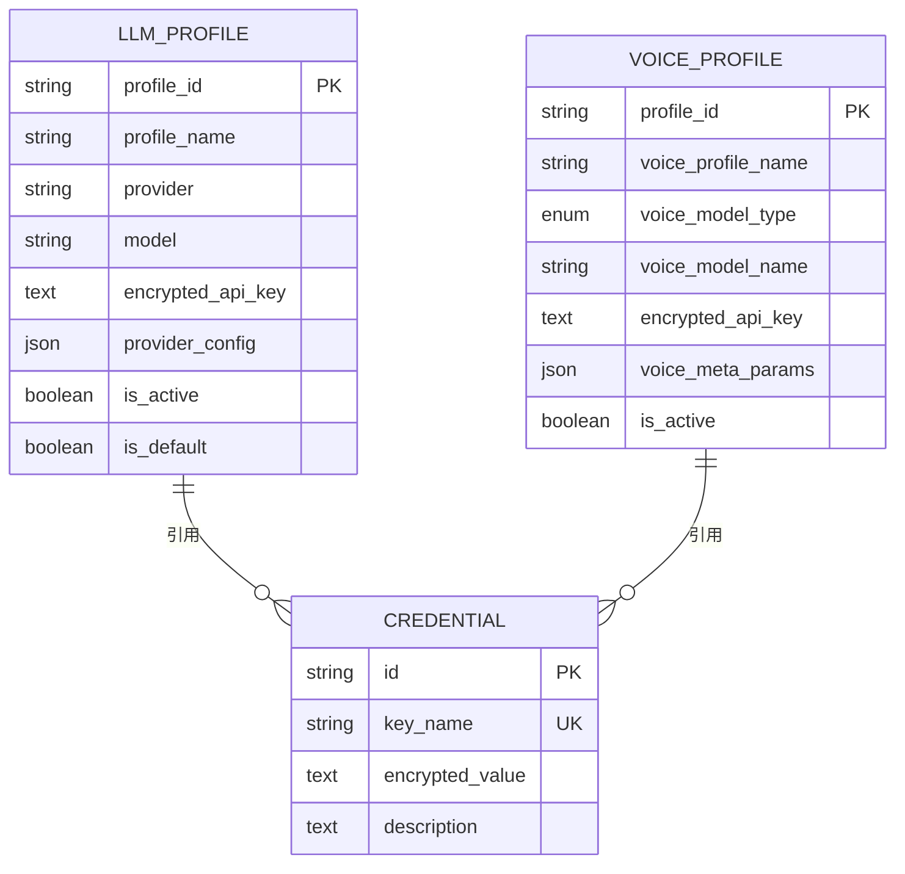
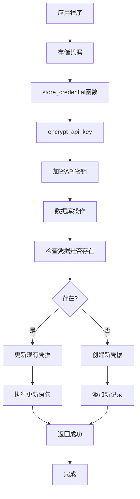
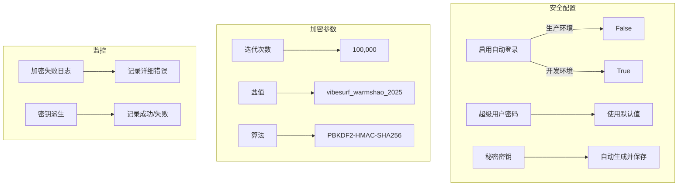

# 数据加密

<cite>
**本文档引用的文件**   
- [encryption.py](file://vibe_surf/backend/utils/encryption.py)
- [models.py](file://vibe_surf/backend/database/models.py)
- [queries.py](file://vibe_surf/backend/database/queries.py)
- [mcp_encryption.py](file://vibe_surf/langflow/services/auth/mcp_encryption.py)
- [auth.py](file://vibe_surf/langflow/services/settings/auth.py)
- [utils.py](file://vibe_surf/langflow/services/auth/utils.py)
</cite>

## 目录
1. [引言](#引言)
2. [加密架构概述](#加密架构概述)
3. [核心加密实现](#核心加密实现)
4. [密钥管理机制](#密钥管理机制)
5. [加密流程分析](#加密流程分析)
6. [数据保护策略](#数据保护策略)
7. [系统集成分析](#系统集成分析)
8. [性能与安全权衡](#性能与安全权衡)
9. [最佳实践与配置示例](#最佳实践与配置示例)
10. [结论](#结论)

## 引言

VibeSurf平台实施了全面的数据加密策略，以保护敏感信息的安全。本文档详细分析了系统的加密实现，重点关注`encryption.py`文件中的加密算法、密钥管理和加密流程。系统采用基于机器特定标识的加密方法，确保静态数据的安全性，同时在性能和安全性之间取得平衡。加密机制主要应用于保护API密钥、认证凭据和其他敏感配置数据。

## 加密架构概述

VibeSurf的加密架构采用分层设计，结合了对称加密和基于机器标识的密钥派生机制。系统主要使用Fernet对称加密算法，该算法基于AES-128-CBC模式，提供强大的数据保护。加密架构的核心是使用机器MAC地址或本地用户ID作为基础来派生加密密钥，确保加密数据与特定机器绑定。

**图表来源**
- [encryption.py](file://vibe_surf/backend/utils/encryption.py#L23-L40)

## 核心加密实现

### 加密算法分析

VibeSurf系统采用Fernet对称加密方案，这是一种高级加密标准(AES)的实现，提供认证加密功能。Fernet确保数据的机密性、完整性和真实性。系统使用PBKDF2-HMAC-SHA256密钥派生函数，通过100,000次迭代增强密钥的安全性，有效抵御暴力破解攻击。

加密实现的关键特征包括：
- **算法**: PBKDF2-HMAC-SHA256
- **迭代次数**: 100,000次
- **密钥长度**: 32字节(256位)
- **盐值**: 固定盐值"vibesurf_warmshao_2025"
- **加密方案**: Fernet(基于AES-128-CBC)

**图表来源**
- [encryption.py](file://vibe_surf/backend/utils/encryption.py#L23-L147)

**本节来源**
- [encryption.py](file://vibe_surf/backend/utils/encryption.py#L7-L172)

### 对称加密应用

系统主要采用对称加密方案，因为其在性能和安全性之间提供了良好的平衡。对称加密适用于以下场景：
- **API密钥保护**: 所有API密钥在存储前都经过加密
- **认证凭据存储**: 用户认证信息的安全存储
- **敏感配置数据**: 包含敏感信息的配置项

对称加密的优势在于其高效的加密和解密速度，特别适合频繁访问的数据。系统通过机器特定的密钥派生机制弥补了传统对称加密的密钥管理弱点。

## 密钥管理机制

### 密钥派生策略

VibeSurf采用基于机器标识的密钥派生策略，确保加密数据与特定设备绑定。密钥派生流程如下：

1. **主标识获取**: 首选获取设备的MAC地址作为机器标识
2. **备用标识**: 如果无法获取MAC地址，则使用本地生成的用户ID
3. **密钥派生**: 使用PBKDF2算法将标识转换为加密密钥
4. **密钥编码**: 将派生的密钥进行URL安全的Base64编码

**图表来源**
- [encryption.py](file://vibe_surf/backend/utils/encryption.py#L65-L74)

### 密钥轮换与备份

系统实现了密钥使用的故障转移机制，增强了系统的可靠性。当主密钥（基于MAC地址）无法使用时，系统会自动切换到基于本地用户ID的备用密钥。这种设计确保了在不同环境下的兼容性，同时保持了安全性。

密钥轮换策略包括：
- **固定盐值**: 使用固定的盐值确保密钥派生的一致性
- **双密钥机制**: 主密钥（MAC地址）和备用密钥（用户ID）
- **自动故障转移**: 解密时尝试主密钥，失败后尝试备用密钥

## 加密流程分析

### 加密流程

API密钥的加密流程遵循严格的安全标准：

**图表来源**
- [encryption.py](file://vibe_surf/backend/utils/encryption.py#L76-L96)

### 解密流程

解密流程包含故障转移机制，确保系统的健壮性：

**图表来源**
- [encryption.py](file://vibe_surf/backend/utils/encryption.py#L98-L126)

## 数据保护策略

### 静态数据保护

VibeSurf系统通过多种机制保护静态数据的安全：

1. **数据库加密**: 敏感字段在存储到数据库前已加密
2. **字段级加密**: 特定敏感字段（如API密钥）单独加密
3. **透明加密**: 应用层处理加密/解密，数据库仅存储密文

**图表来源**
- [models.py](file://vibe_surf/backend/database/models.py#L57-L234)

### 敏感字段识别

系统通过多种方式识别需要加密的敏感字段：

- **字段命名约定**: 包含"api_key"、"secret"等关键词的字段
- **模型定义**: 数据库模型中明确标记为加密的字段
- **配置规则**: 预定义的敏感字段列表

## 系统集成分析

### 与数据库系统的集成

加密模块与数据库系统紧密集成，确保敏感数据在持久化前已加密：

**图表来源**
- [queries.py](file://vibe_surf/backend/database/queries.py#L1367-L1405)

### 与其他组件的集成

加密功能被多个系统组件调用，形成统一的安全框架：

- **LLM配置管理**: 保护LLM提供商的API密钥
- **语音配置管理**: 保护语音服务的认证凭据
- **MCP服务器配置**: 保护MCP服务器的认证设置
- **用户凭据管理**: 保护用户存储的各类密钥

## 性能与安全权衡

### 性能影响分析

加密机制对系统性能的影响经过精心设计和优化：

- **密钥派生**: PBKDF2的100,000次迭代提供安全但可控的计算开销
- **内存使用**: 加密密钥在内存中缓存，避免重复计算
- **I/O影响**: 加密在应用层完成，数据库I/O仅涉及密文

### 安全性增强措施

系统采用多种措施增强整体安全性：

- **机器绑定**: 加密数据与特定机器绑定，防止跨设备访问
- **多层防御**: 结合MAC地址和用户ID的双重密钥机制
- **错误处理**: 详细的错误日志帮助诊断加密相关问题
- **测试验证**: 内置加密测试功能确保加密解密的正确性

## 最佳实践与配置示例

### 加密配置最佳实践

1. **环境一致性**: 确保生产环境和开发环境使用相同的加密配置
2. **密钥保护**: 避免在代码或配置文件中硬编码加密密钥
3. **定期审计**: 定期审查加密实现和密钥管理策略
4. **备份策略**: 确保有适当的备份和恢复机制

### 配置示例

**图表来源**
- [auth.py](file://vibe_surf/langflow/services/settings/auth.py#L18-L134)

## 结论

VibeSurf的加密实现提供了一个安全、可靠且易于维护的数据保护框架。通过基于机器标识的密钥派生机制和Fernet对称加密方案，系统有效保护了敏感数据的安全。加密架构在性能和安全性之间取得了良好平衡，同时通过故障转移机制确保了系统的可靠性。建议定期审查和更新加密策略，以应对不断变化的安全威胁。