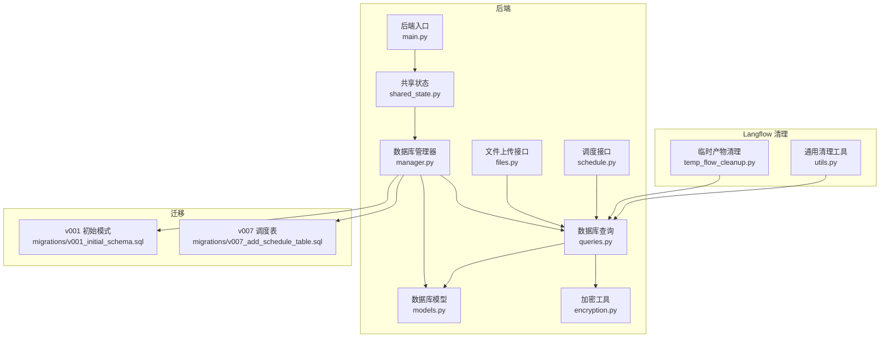
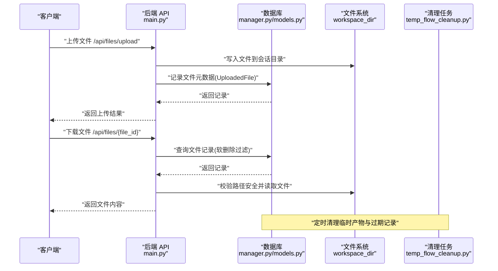
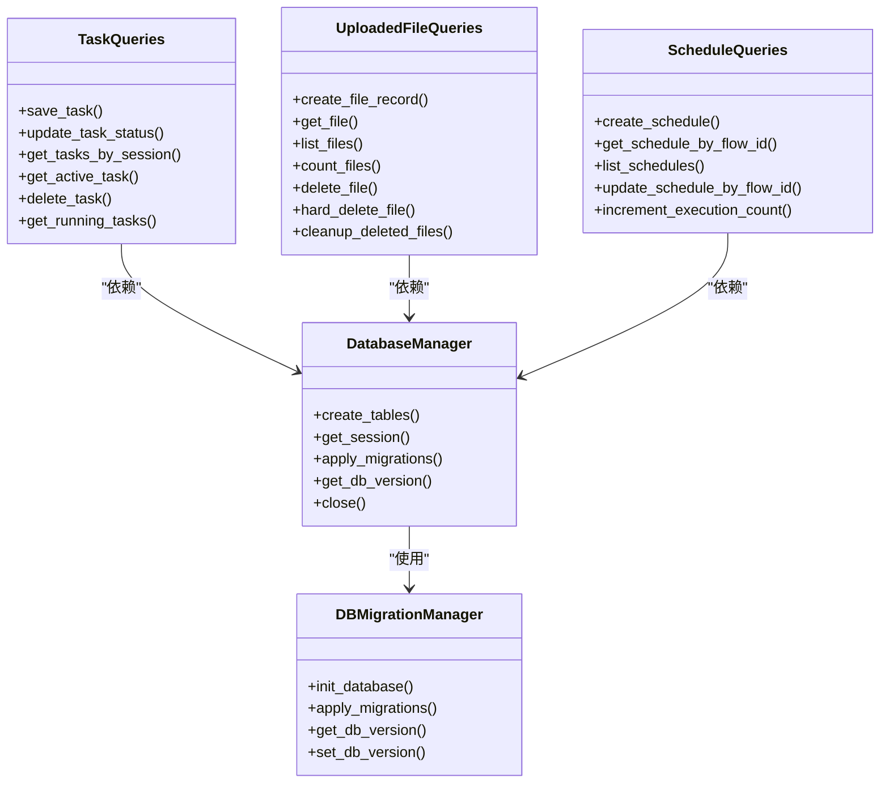
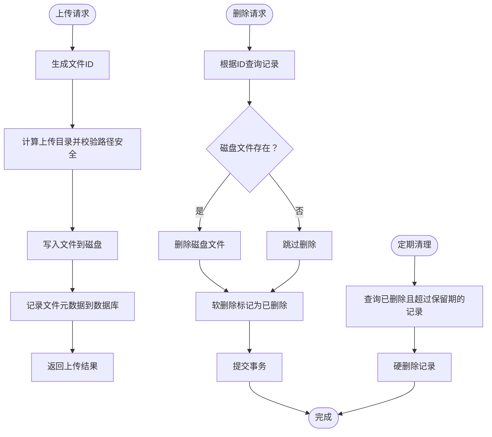
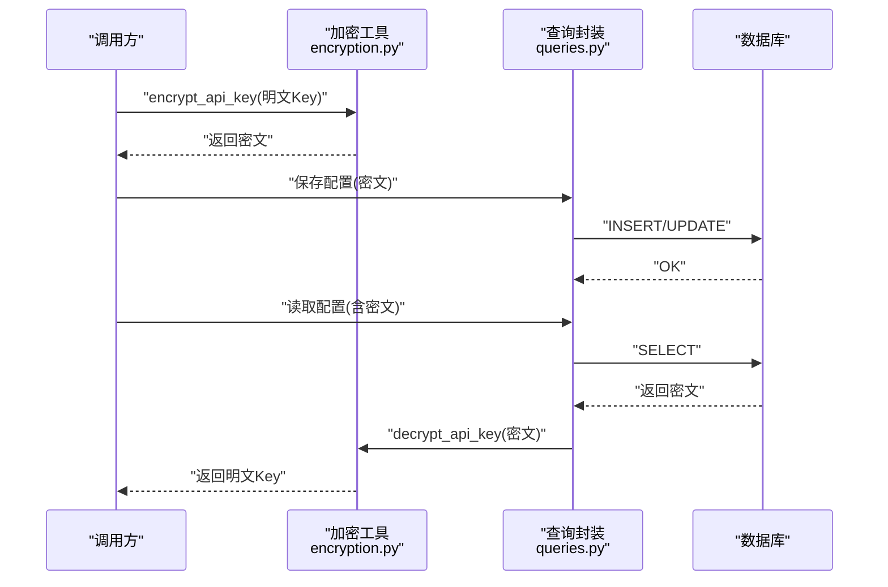
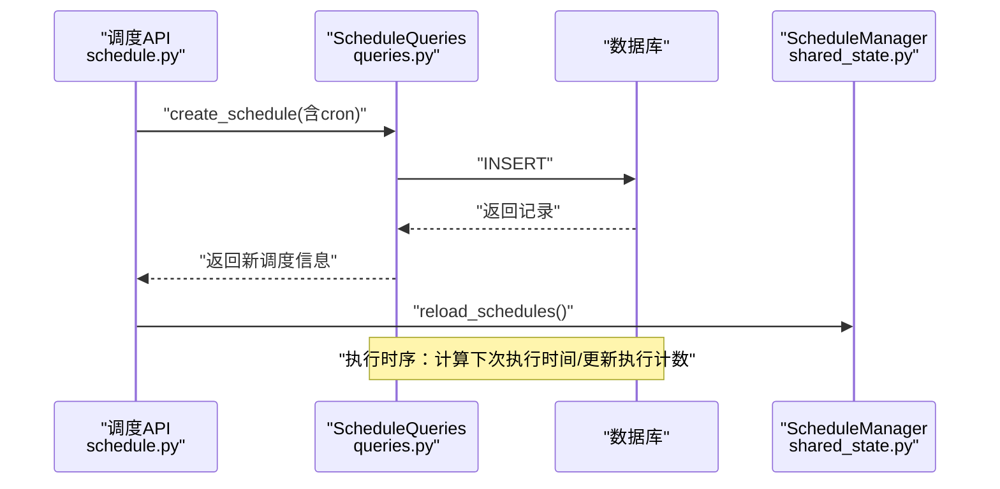
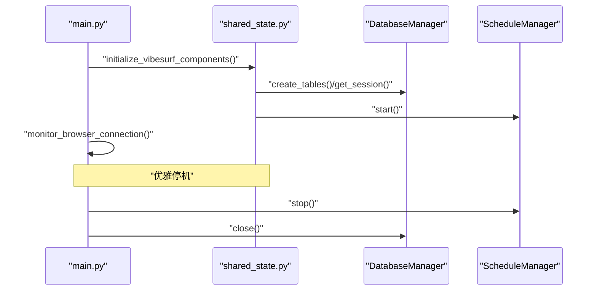
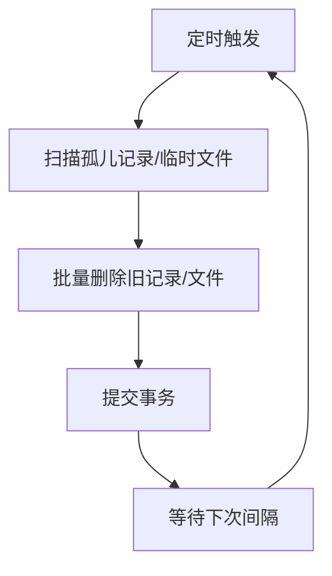
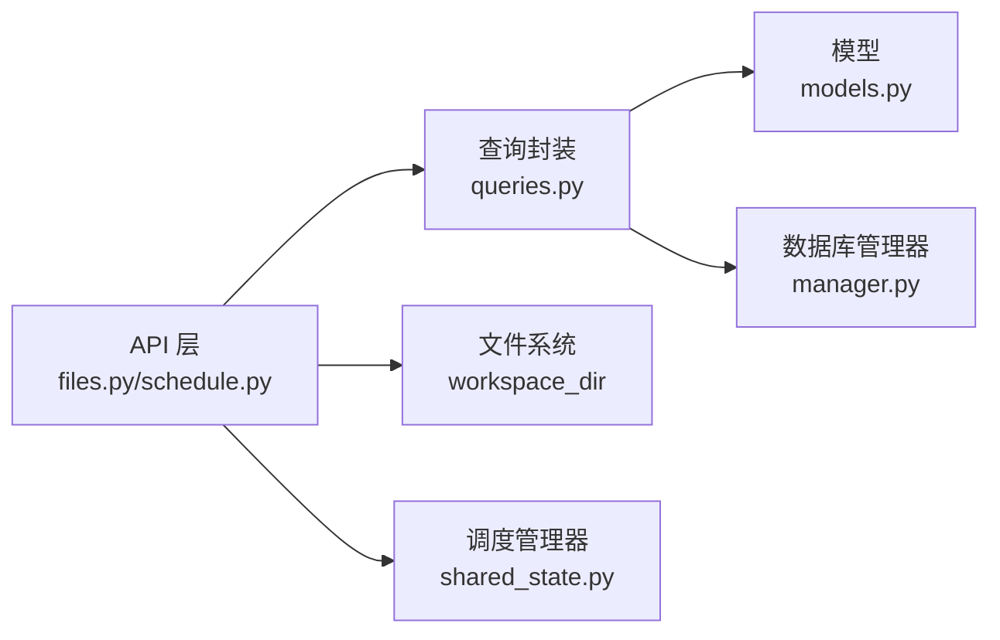

# 数据生命周期管理

<cite>
**本文引用的文件**
- [数据库管理器 manager.py](file://vibe_surf/backend/database/manager.py)
- [数据库模型 models.py](file://vibe_surf/backend/database/models.py)
- [数据库查询 queries.py](file://vibe_surf/backend/database/queries.py)
- [加密工具 encryption.py](file://vibe_surf/backend/utils/encryption.py)
- [文件上传接口 files.py](file://vibe_surf/backend/api/files.py)
- [调度接口 schedule.py](file://vibe_surf/backend/api/schedule.py)
- [共享状态 shared_state.py](file://vibe_surf/backend/shared_state.py)
- [后端入口 main.py](file://vibe_surf/backend/main.py)
- [迁移 v001 初始模式](file://vibe_surf/backend/database/migrations/v001_initial_schema.sql)
- [迁移 v007 调度表](file://vibe_surf/backend/database/migrations/v007_add_schedule_table.sql)
- [Langflow 清理任务 temp_flow_cleanup.py](file://vibe_surf/langflow/services/task/temp_flow_cleanup.py)
- [Langflow 清理工具 utils.py](file://vibe_surf/langflow/services/utils.py)
</cite>

## 目录
1. [简介](#简介)
2. [项目结构与数据生命周期相关模块](#项目结构与数据生命周期相关模块)
3. [核心组件](#核心组件)
4. [架构总览](#架构总览)
5. [详细组件分析](#详细组件分析)
6. [依赖关系分析](#依赖关系分析)
7. [性能与可扩展性考量](#性能与可扩展性考量)
8. [故障排查与安全注意事项](#故障排查与安全注意事项)
9. [结论](#结论)
10. [附录：配置指南与合规检查清单](#附录配置指南与合规检查清单)

## 简介
本文件系统化梳理 VibeSurf 的数据生命周期管理策略，覆盖数据从创建、存储、访问、归档到删除的全链路。重点包括：
- 数据创建与入库（任务、文件、凭证、配置等）
- 存储与索引设计（SQLite/异步连接池、索引与触发器）
- 访问控制与权限边界（软删除、路径安全校验、API 层过滤）
- 自动清理与归档（基于时间的软删除、硬删除、计划任务）
- 安全删除与密钥管理（API 密钥加密、解密与生命周期）
- 生命周期事件触发器（任务状态变更、文件删除、调度更新）
- 配置指南与合规检查清单

## 项目结构与数据生命周期相关模块
- 后端数据库层：数据库管理器、模型定义、查询封装、迁移脚本
- 文件管理：上传、下载、列表、软删除、硬删除
- 凭证与密钥：API Key 加密/解密、存储与检索
- 调度：周期性执行与生命周期事件
- 共享状态与启动/关闭生命周期：初始化、监控、优雅停机
- Langflow 清理：临时工作流产物的自动清理

图表来源
- [数据库管理器 manager.py](file://vibe_surf/backend/database/manager.py#L1-L319)
- [数据库模型 models.py](file://vibe_surf/backend/database/models.py#L1-L289)
- [数据库查询 queries.py](file://vibe_surf/backend/database/queries.py#L1-L1683)
- [文件上传接口 files.py](file://vibe_surf/backend/api/files.py#L1-L332)
- [调度接口 schedule.py](file://vibe_surf/backend/api/schedule.py#L1-L331)
- [加密工具 encryption.py](file://vibe_surf/backend/utils/encryption.py#L1-L172)
- [共享状态 shared_state.py](file://vibe_surf/backend/shared_state.py#L1-L1111)
- [后端入口 main.py](file://vibe_surf/backend/main.py#L1-L794)
- [迁移 v001 初始模式](file://vibe_surf/backend/database/migrations/v001_initial_schema.sql#L1-L118)
- [迁移 v007 调度表](file://vibe_surf/backend/database/migrations/v007_add_schedule_table.sql#L1-L29)
- [Langflow 清理任务 temp_flow_cleanup.py](file://vibe_surf/langflow/services/task/temp_flow_cleanup.py#L49-L136)
- [Langflow 清理工具 utils.py](file://vibe_surf/langflow/services/utils.py#L174-L201)

章节来源
- [数据库管理器 manager.py](file://vibe_surf/backend/database/manager.py#L1-L319)
- [数据库模型 models.py](file://vibe_surf/backend/database/models.py#L1-L289)
- [数据库查询 queries.py](file://vibe_surf/backend/database/queries.py#L1-L1683)
- [文件上传接口 files.py](file://vibe_surf/backend/api/files.py#L1-L332)
- [调度接口 schedule.py](file://vibe_surf/backend/api/schedule.py#L1-L331)
- [加密工具 encryption.py](file://vibe_surf/backend/utils/encryption.py#L1-L172)
- [共享状态 shared_state.py](file://vibe_surf/backend/shared_state.py#L1-L1111)
- [后端入口 main.py](file://vibe_surf/backend/main.py#L1-L794)
- [迁移 v001 初始模式](file://vibe_surf/backend/database/migrations/v001_initial_schema.sql#L1-L118)
- [迁移 v007 调度表](file://vibe_surf/backend/database/migrations/v007_add_schedule_table.sql#L1-L29)
- [Langflow 清理任务 temp_flow_cleanup.py](file://vibe_surf/langflow/services/task/temp_flow_cleanup.py#L49-L136)
- [Langflow 清理工具 utils.py](file://vibe_surf/langflow/services/utils.py#L174-L201)

## 核心组件
- 数据库管理器：负责引擎配置、会话管理、迁移应用、版本读取与关闭
- 数据库模型：定义任务、文件、凭证、配置、调度等实体及索引
- 查询封装：统一 CRUD 操作、软删除、计数、清理、调度管理
- 文件管理 API：上传、下载、列表、软删除、目录浏览
- 调度 API：创建、查询、更新、删除周期任务
- 加密工具：基于机器 MAC 或本地用户 ID 的密钥派生与 API Key 加解密
- 共享状态与生命周期：组件初始化、任务执行、浏览器监控、优雅停机
- Langflow 清理：定期清理临时工作流产物与过期记录

章节来源
- [数据库管理器 manager.py](file://vibe_surf/backend/database/manager.py#L148-L319)
- [数据库模型 models.py](file://vibe_surf/backend/database/models.py#L1-L289)
- [数据库查询 queries.py](file://vibe_surf/backend/database/queries.py#L1-L1683)
- [文件上传接口 files.py](file://vibe_surf/backend/api/files.py#L1-L332)
- [调度接口 schedule.py](file://vibe_surf/backend/api/schedule.py#L1-L331)
- [加密工具 encryption.py](file://vibe_surf/backend/utils/encryption.py#L1-L172)
- [共享状态 shared_state.py](file://vibe_surf/backend/shared_state.py#L340-L820)
- [Langflow 清理任务 temp_flow_cleanup.py](file://vibe_surf/langflow/services/task/temp_flow_cleanup.py#L49-L136)
- [Langflow 清理工具 utils.py](file://vibe_surf/langflow/services/utils.py#L174-L201)

## 架构总览
VibeSurf 的数据生命周期由“后端 API + 数据库 + 文件系统 + 清理任务”共同构成。后端通过 FastAPI 提供 REST 接口，数据库采用 SQLAlchemy 异步 ORM，文件存储在工作区目录中，清理任务通过 Langflow 的后台服务与数据库查询实现。

图表来源
- [后端入口 main.py](file://vibe_surf/backend/main.py#L543-L750)
- [文件上传接口 files.py](file://vibe_surf/backend/api/files.py#L57-L150)
- [数据库模型 models.py](file://vibe_surf/backend/database/models.py#L138-L156)
- [Langflow 清理任务 temp_flow_cleanup.py](file://vibe_surf/langflow/services/task/temp_flow_cleanup.py#L49-L136)

## 详细组件分析

### 数据库层：创建、存储、访问、清理
- 创建与迁移
  - 初始化数据库目录与版本，支持 SQLite 迁移与回退
  - 迁移脚本包含初始表结构与索引、触发器
- 存储与索引
  - 任务、文件、凭证、MCP 配置、语音配置、调度等模型
  - 多处索引优化查询性能（按状态、会话、时间、启用状态等）
  - 触发器自动维护更新时间戳
- 访问与查询
  - 统一的查询封装，支持软删除、计数、分页、按会话过滤
  - 任务状态变更自动记录开始/完成时间
- 清理
  - 文件软删除标记与过期硬删除清理
  - 调度生命周期事件（执行次数、最近执行时间）

图表来源
- [数据库管理器 manager.py](file://vibe_surf/backend/database/manager.py#L148-L319)
- [数据库查询 queries.py](file://vibe_surf/backend/database/queries.py#L441-L1683)
- [迁移 v001 初始模式](file://vibe_surf/backend/database/migrations/v001_initial_schema.sql#L1-L118)
- [迁移 v007 调度表](file://vibe_surf/backend/database/migrations/v007_add_schedule_table.sql#L1-L29)

章节来源
- [数据库管理器 manager.py](file://vibe_surf/backend/database/manager.py#L148-L319)
- [数据库模型 models.py](file://vibe_surf/backend/database/models.py#L1-L289)
- [数据库查询 queries.py](file://vibe_surf/backend/database/queries.py#L1-L1683)
- [迁移 v001 初始模式](file://vibe_surf/backend/database/migrations/v001_initial_schema.sql#L1-L118)
- [迁移 v007 调度表](file://vibe_surf/backend/database/migrations/v007_add_schedule_table.sql#L1-L29)

### 文件管理：上传、访问、删除
- 上传
  - 生成唯一文件 ID，避免重名，安全路径校验，记录元数据
- 下载
  - 通过文件 ID 获取记录并校验磁盘存在性与路径安全
- 列表
  - 支持按会话过滤、分页、计数
- 删除
  - 软删除：标记 is_deleted 并记录删除时间
  - 硬删除：永久删除记录（用于清理过期软删除文件）
- 目录浏览
  - 支持列出会话目录下的文件与子目录

图表来源
- [文件上传接口 files.py](file://vibe_surf/backend/api/files.py#L57-L150)
- [数据库查询 queries.py](file://vibe_surf/backend/database/queries.py#L755-L932)
- [数据库模型 models.py](file://vibe_surf/backend/database/models.py#L138-L156)

章节来源
- [文件上传接口 files.py](file://vibe_surf/backend/api/files.py#L1-L332)
- [数据库查询 queries.py](file://vibe_surf/backend/database/queries.py#L755-L932)
- [数据库模型 models.py](file://vibe_surf/backend/database/models.py#L138-L156)

### 凭证与密钥：安全存储与生命周期
- 加密策略
  - 基于机器 MAC 地址或本地用户 ID 派生密钥，使用 Fernet 对称加密
  - API Key 在入库前加密，使用时解密
- 使用场景
  - LLM 配置、语音配置、Composio 工具包、通用凭据表
- 安全建议
  - 不在日志中输出明文密钥
  - 仅在必要时解密并立即使用

图表来源
- [加密工具 encryption.py](file://vibe_surf/backend/utils/encryption.py#L1-L172)
- [数据库查询 queries.py](file://vibe_surf/backend/database/queries.py#L1-L200)
- [数据库模型 models.py](file://vibe_surf/backend/database/models.py#L170-L235)

章节来源
- [加密工具 encryption.py](file://vibe_surf/backend/utils/encryption.py#L1-L172)
- [数据库查询 queries.py](file://vibe_surf/backend/database/queries.py#L1-L200)
- [数据库模型 models.py](file://vibe_surf/backend/database/models.py#L170-L235)

### 调度与生命周期事件
- 调度模型
  - 流程 ID 唯一、支持 cron 表达式、启用状态、执行计数、下次执行时间
- 生命周期事件
  - 更新 cron 表达式时自动计算下一次执行时间
  - 执行成功后递增执行计数并记录最近执行时间
- 触发器
  - 通过数据库触发器维护更新时间戳

图表来源
- [调度接口 schedule.py](file://vibe_surf/backend/api/schedule.py#L1-L331)
- [数据库查询 queries.py](file://vibe_surf/backend/database/queries.py#L1432-L1683)
- [共享状态 shared_state.py](file://vibe_surf/backend/shared_state.py#L740-L820)
- [迁移 v007 调度表](file://vibe_surf/backend/database/migrations/v007_add_schedule_table.sql#L1-L29)

章节来源
- [调度接口 schedule.py](file://vibe_surf/backend/api/schedule.py#L1-L331)
- [数据库查询 queries.py](file://vibe_surf/backend/database/queries.py#L1432-L1683)
- [共享状态 shared_state.py](file://vibe_surf/backend/shared_state.py#L740-L820)
- [迁移 v007 调度表](file://vibe_surf/backend/database/migrations/v007_add_schedule_table.sql#L1-L29)

### 启动/关闭与生命周期事件
- 启动
  - 初始化 Langflow 服务、数据库、浏览器会话、调度管理器
  - 启动浏览器连接监控任务
- 关闭
  - 优雅停止调度管理器、取消后台任务、关闭数据库连接
  - 记录 Telemetry 启停事件

图表来源
- [后端入口 main.py](file://vibe_surf/backend/main.py#L327-L482)
- [共享状态 shared_state.py](file://vibe_surf/backend/shared_state.py#L453-L602)
- [数据库管理器 manager.py](file://vibe_surf/backend/database/manager.py#L203-L273)

章节来源
- [后端入口 main.py](file://vibe_surf/backend/main.py#L327-L482)
- [共享状态 shared_state.py](file://vibe_surf/backend/shared_state.py#L453-L602)
- [数据库管理器 manager.py](file://vibe_surf/backend/database/manager.py#L203-L273)

### Langflow 清理：自动清理机制
- 清理策略
  - 定期清理孤儿记录与临时文件，释放存储空间
  - 可按设置限制最大事务条目数量，超出部分按时间顺序删除
- 触发方式
  - 后台 Worker 定时运行，支持停止事件优雅退出

图表来源
- [Langflow 清理任务 temp_flow_cleanup.py](file://vibe_surf/langflow/services/task/temp_flow_cleanup.py#L49-L136)
- [Langflow 清理工具 utils.py](file://vibe_surf/langflow/services/utils.py#L174-L201)

章节来源
- [Langflow 清理任务 temp_flow_cleanup.py](file://vibe_surf/langflow/services/task/temp_flow_cleanup.py#L49-L136)
- [Langflow 清理工具 utils.py](file://vibe_surf/langflow/services/utils.py#L174-L201)

## 依赖关系分析
- 组件耦合
  - API 层依赖查询封装；查询封装依赖模型与数据库管理器
  - 文件 API 依赖工作区目录与数据库记录
  - 调度 API 依赖查询封装与共享状态中的调度管理器
- 外部依赖
  - SQLite/异步引擎、aiosqlite、SQLAlchemy、Fernet、croniter
- 循环依赖
  - 通过延迟导入与模块化组织避免循环依赖

图表来源
- [文件上传接口 files.py](file://vibe_surf/backend/api/files.py#L1-L332)
- [调度接口 schedule.py](file://vibe_surf/backend/api/schedule.py#L1-L331)
- [数据库查询 queries.py](file://vibe_surf/backend/database/queries.py#L1-L1683)
- [数据库管理器 manager.py](file://vibe_surf/backend/database/manager.py#L148-L319)
- [共享状态 shared_state.py](file://vibe_surf/backend/shared_state.py#L740-L820)

章节来源
- [文件上传接口 files.py](file://vibe_surf/backend/api/files.py#L1-L332)
- [调度接口 schedule.py](file://vibe_surf/backend/api/schedule.py#L1-L331)
- [数据库查询 queries.py](file://vibe_surf/backend/database/queries.py#L1-L1683)
- [数据库管理器 manager.py](file://vibe_surf/backend/database/manager.py#L148-L319)
- [共享状态 shared_state.py](file://vibe_surf/backend/shared_state.py#L740-L820)

## 性能与可扩展性考量
- 连接与池化
  - SQLite 使用 StaticPool 适配单线程环境；生产环境可切换为 PostgreSQL/MySQL 并启用连接池参数
- 索引与触发器
  - 模型定义了多处索引以提升查询效率；触发器自动维护更新时间戳
- 异步 I/O
  - 使用 aiosqlite 与 SQLAlchemy 异步会话，减少阻塞
- 清理策略
  - 文件软删除 + 定期硬删除，避免频繁大范围删除操作
  - Langflow 清理任务按间隔运行，避免高峰时段压力

[本节为通用指导，不直接分析具体文件]

## 故障排查与安全注意事项
- 常见问题
  - 文件上传失败：检查磁盘写入权限、路径安全校验、数据库记录回滚
  - 文件下载 404：确认记录存在且磁盘文件仍存在，路径安全校验通过
  - 调度未生效：检查 cron 表达式格式、下次执行时间是否正确计算
  - 密钥解密失败：确认加密密钥来源一致（MAC 或本地用户 ID），必要时启用备用解密路径
- 安全建议
  - 严格路径安全校验，防止路径穿越
  - 不在日志中输出敏感信息
  - 定期轮换密钥派生来源，确保密钥不可逆推
  - 对外暴露的 API 应限制文件上传大小与类型

章节来源
- [文件上传接口 files.py](file://vibe_surf/backend/api/files.py#L1-L332)
- [调度接口 schedule.py](file://vibe_surf/backend/api/schedule.py#L1-L331)
- [加密工具 encryption.py](file://vibe_surf/backend/utils/encryption.py#L1-L172)

## 结论
VibeSurf 的数据生命周期管理以“安全、可控、可观测”为核心目标：通过加密存储敏感数据、严格的路径安全校验、完善的索引与触发器、以及可配置的清理与调度机制，实现了从创建到删除的全链路闭环。结合 Langflow 的后台清理能力，系统能够在保证性能的同时维持良好的资源占用与合规性。

[本节为总结性内容，不直接分析具体文件]

## 附录：配置指南与合规检查清单

### 数据生命周期配置指南
- 数据库
  - SQLite 开发：使用默认 SQLite 引擎与 StaticPool
  - 生产环境：配置 PostgreSQL/MySQL 连接池参数（池大小、预检、回收）
  - 迁移：首次部署自动应用迁移；升级时确保迁移脚本顺序正确
- 文件存储
  - 上传目录：按会话隔离，避免跨会话访问
  - 软删除保留期：根据业务需求设置（如 30 天），到期后自动硬删除
- 凭证与密钥
  - 加密密钥来源：优先使用 MAC 地址，若不可用则回退到本地用户 ID
  - 密钥轮换：更换机器或用户 ID 时，重新加密历史密文
- 调度
  - cron 表达式格式校验，确保下次执行时间正确计算
  - 启用/禁用开关与描述字段便于审计
- 清理任务
  - Langflow 清理间隔与阈值：根据流量与存储压力调整
  - 事务清理：限制最大条目数量，按时间降序删除

章节来源
- [数据库管理器 manager.py](file://vibe_surf/backend/database/manager.py#L148-L202)
- [数据库查询 queries.py](file://vibe_surf/backend/database/queries.py#L755-L932)
- [加密工具 encryption.py](file://vibe_surf/backend/utils/encryption.py#L1-L172)
- [调度接口 schedule.py](file://vibe_surf/backend/api/schedule.py#L1-L331)
- [Langflow 清理任务 temp_flow_cleanup.py](file://vibe_surf/langflow/services/task/temp_flow_cleanup.py#L49-L136)
- [Langflow 清理工具 utils.py](file://vibe_surf/langflow/services/utils.py#L174-L201)

### 合规检查清单
- 数据最小化
  - 仅存储必要的元数据与最小化敏感信息
- 访问控制
  - 文件下载路径安全校验，禁止越权访问
  - API 层对会话维度进行过滤
- 数据保留与删除
  - 明确软删除保留期与硬删除策略
  - 删除操作具备审计日志（记录操作人、时间、对象）
- 加密与密钥管理
  - 敏感字段（API Key）必须加密存储
  - 密钥派生算法与来源清晰，支持回退方案
- 调度与审计
  - 调度启停、修改具备审计日志
  - 执行计数与最近执行时间可用于审计追踪
- 运维与监控
  - 启动/关闭事件记录，异常处理与 Telemetry 上报
  - 清理任务运行状态监控与告警

章节来源
- [文件上传接口 files.py](file://vibe_surf/backend/api/files.py#L1-L332)
- [数据库查询 queries.py](file://vibe_surf/backend/database/queries.py#L1-L1683)
- [加密工具 encryption.py](file://vibe_surf/backend/utils/encryption.py#L1-L172)
- [调度接口 schedule.py](file://vibe_surf/backend/api/schedule.py#L1-L331)
- [后端入口 main.py](file://vibe_surf/backend/main.py#L327-L482)