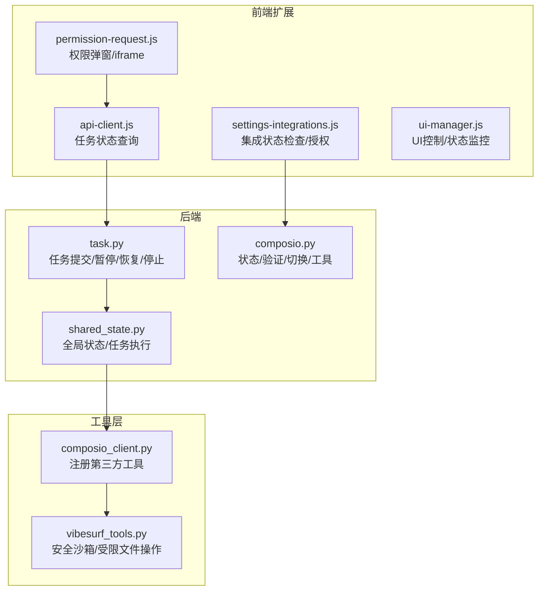
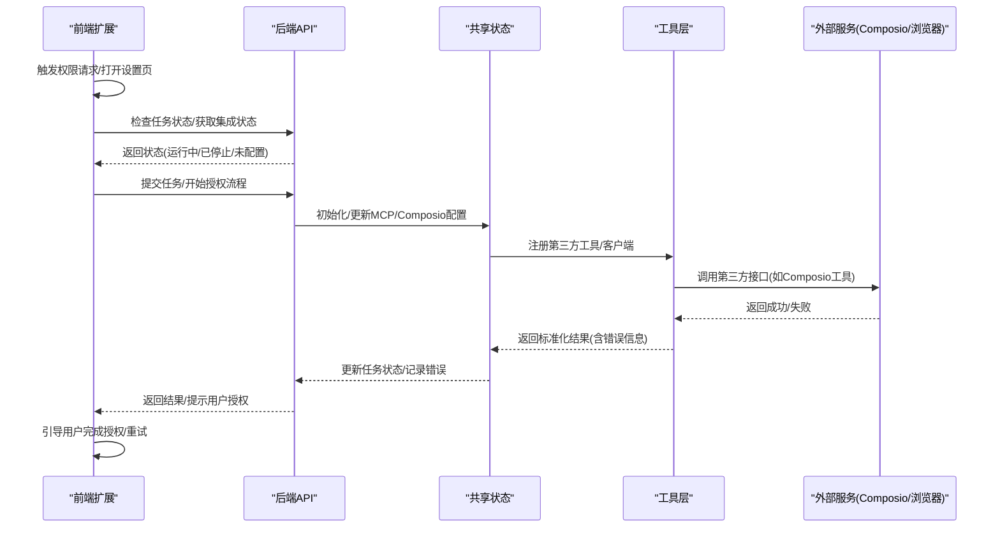
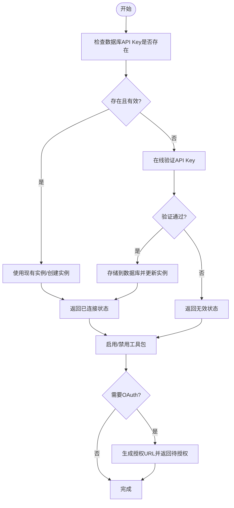
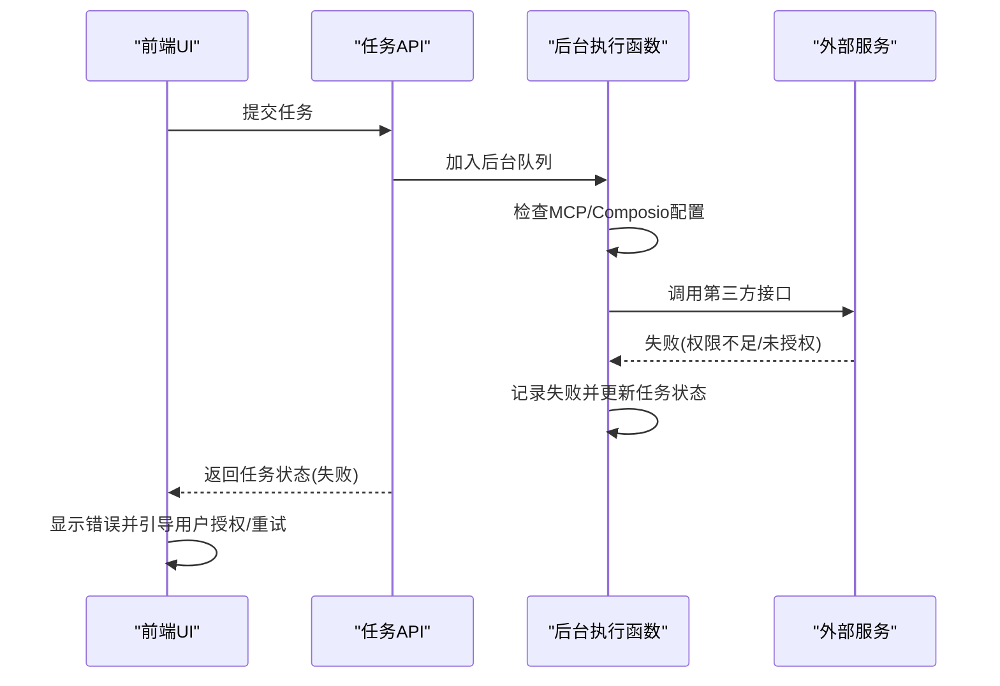
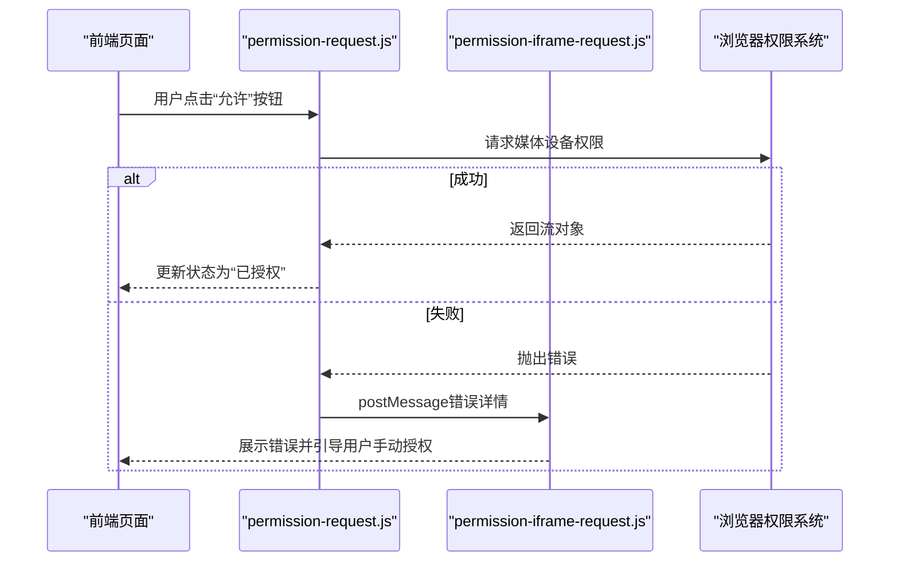
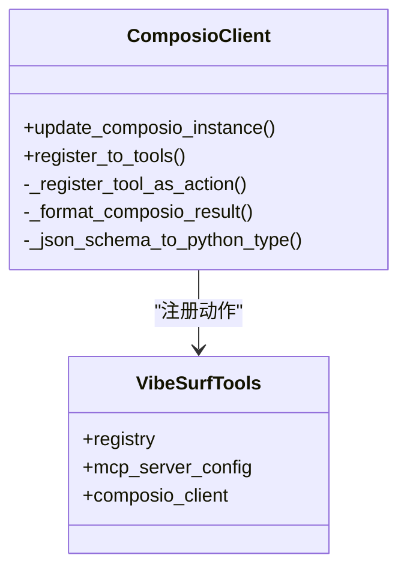
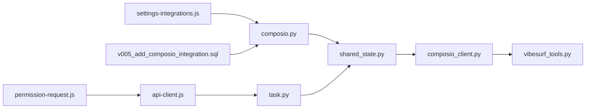

# 动态权限验证

<cite>
**本文引用的文件列表**
- [vibe_surf/backend/api/composio.py](file://vibe_surf/backend/api/composio.py)
- [vibe_surf/backend/api/task.py](file://vibe_surf/backend/api/task.py)
- [vibe_surf/backend/shared_state.py](file://vibe_surf/backend/shared_state.py)
- [vibe_surf/tools/composio_client.py](file://vibe_surf/tools/composio_client.py)
- [vibe_surf/tools/vibesurf_tools.py](file://vibe_surf/tools/vibesurf_tools.py)
- [vibe_surf/chrome_extension/scripts/permission-request.js](file://vibe_surf/chrome_extension/scripts/permission-request.js)
- [vibe_surf/chrome_extension/scripts/permission-iframe-request.js](file://vibe_surf/chrome_extension/scripts/permission-iframe-request.js)
- [vibe_surf/chrome_extension/scripts/settings-integrations.js](file://vibe_surf/chrome_extension/scripts/settings-integrations.js)
- [vibe_surf/chrome_extension/scripts/api-client.js](file://vibe_surf/chrome_extension/scripts/api-client.js)
- [vibe_surf/chrome_extension/scripts/ui-manager.js](file://vibe_surf/chrome_extension/scripts/ui-manager.js)
- [vibe_surf/backend/api/vibesurf.py](file://vibe_surf/backend/api/vibesurf.py)
- [vibe_surf/agents/browser_use_agent.py](file://vibe_surf/agents/browser_use_agent.py)
- [vibe_surf/browser/agent_browser_session.py](file://vibe_surf/browser/agent_browser_session.py)
- [vibe_surf/backend/database/migrations/v005_add_composio_integration.sql](file://vibe_surf/backend/database/migrations/v005_add_composio_integration.sql)
- [vibe_surf/langflow/services/auth/utils.py](file://vibe_surf/langflow/services/auth/utils.py)
- [vibe_surf/agents/prompts/vibe_surf_prompt.py](file://vibe_surf/agents/prompts/vibe_surf_prompt.py)
</cite>

## 目录
1. [简介](#简介)
2. [项目结构与定位](#项目结构与定位)
3. [核心组件与职责](#核心组件与职责)
4. [架构总览](#架构总览)
5. [详细组件分析](#详细组件分析)
6. [依赖关系分析](#依赖关系分析)
7. [性能与可靠性考量](#性能与可靠性考量)
8. [故障排查指南](#故障排查指南)
9. [结论](#结论)

## 简介
本文件聚焦于 VibeSurf 在工作流执行过程中对“第三方服务访问权限”的动态验证机制。目标是：
- 在执行需要第三方服务（如 Composio 工具、浏览器麦克风等）的操作前，实时检查当前权限状态；
- 当权限不足或不可用时，提供清晰的用户提示、暂停工作流执行，并允许用户进行授权或重试；
- 在代码层面妥善处理权限验证异常，设计具备容错能力的工作流，以提升系统健壮性与用户体验。

## 项目结构与定位
围绕动态权限验证的关键路径包括：
- 后端 API：负责 Composio 集成状态检查、OAuth 授权流程触发、工具启用/禁用与连接状态管理；
- 工具层：将第三方工具注册为可调用动作，并在调用失败时返回标准化结果；
- 前端扩展：负责浏览器权限请求、第三方密钥校验与授权引导；
- 执行引擎：在任务提交后，按需加载 MCP/Composio 等配置并执行，遇到权限问题时暂停并反馈。

图表来源
- [vibe_surf/chrome_extension/scripts/permission-request.js](file://vibe_surf/chrome_extension/scripts/permission-request.js#L12-L35)
- [vibe_surf/chrome_extension/scripts/settings-integrations.js](file://vibe_surf/chrome_extension/scripts/settings-integrations.js#L147-L357)
- [vibe_surf/chrome_extension/scripts/api-client.js](file://vibe_surf/chrome_extension/scripts/api-client.js#L190-L238)
- [vibe_surf/chrome_extension/scripts/ui-manager.js](file://vibe_surf/chrome_extension/scripts/ui-manager.js#L550-L824)
- [vibe_surf/backend/api/task.py](file://vibe_surf/backend/api/task.py#L43-L145)
- [vibe_surf/backend/api/composio.py](file://vibe_surf/backend/api/composio.py#L225-L420)
- [vibe_surf/backend/shared_state.py](file://vibe_surf/backend/shared_state.py#L118-L233)
- [vibe_surf/tools/vibesurf_tools.py](file://vibe_surf/tools/vibesurf_tools.py#L1030-L1077)
- [vibe_surf/tools/composio_client.py](file://vibe_surf/tools/composio_client.py#L1-L120)

章节来源
- [vibe_surf/backend/api/composio.py](file://vibe_surf/backend/api/composio.py#L225-L420)
- [vibe_surf/backend/api/task.py](file://vibe_surf/backend/api/task.py#L43-L145)
- [vibe_surf/backend/shared_state.py](file://vibe_surf/backend/shared_state.py#L118-L233)
- [vibe_surf/tools/composio_client.py](file://vibe_surf/tools/composio_client.py#L1-L120)
- [vibe_surf/tools/vibesurf_tools.py](file://vibe_surf/tools/vibesurf_tools.py#L1030-L1077)
- [vibe_surf/chrome_extension/scripts/permission-request.js](file://vibe_surf/chrome_extension/scripts/permission-request.js#L12-L35)
- [vibe_surf/chrome_extension/scripts/settings-integrations.js](file://vibe_surf/chrome_extension/scripts/settings-integrations.js#L147-L357)
- [vibe_surf/chrome_extension/scripts/api-client.js](file://vibe_surf/chrome_extension/scripts/api-client.js#L190-L238)
- [vibe_surf/chrome_extension/scripts/ui-manager.js](file://vibe_surf/chrome_extension/scripts/ui-manager.js#L550-L824)

## 核心组件与职责
- Composio 集成 API：提供状态检查、API Key 校验、工具包启用/禁用、OAuth 授权链接生成与连接状态更新。
- 任务执行 API：提交任务、暂停/恢复/停止任务；在后台执行函数中加载 MCP/Composio 配置并运行代理。
- 共享状态模块：维护全局组件（代理、浏览器、工具、Composio 实例）、任务运行状态、环境变量与工作空间目录。
- 工具注册器：将第三方工具动态注册为可调用动作，并在调用失败时返回标准化结果。
- 安全沙箱工具：限制文件操作范围，防止越权写入，保障工作流执行的安全边界。
- 浏览器权限与会话：在浏览器会话初始化阶段挂载权限/弹窗/安全等看门狗，确保受控执行。
- 前端权限请求与设置页：负责麦克风权限弹窗、Composio API Key 校验与授权引导。

章节来源
- [vibe_surf/backend/api/composio.py](file://vibe_surf/backend/api/composio.py#L225-L420)
- [vibe_surf/backend/api/task.py](file://vibe_surf/backend/api/task.py#L43-L145)
- [vibe_surf/backend/shared_state.py](file://vibe_surf/backend/shared_state.py#L118-L233)
- [vibe_surf/tools/composio_client.py](file://vibe_surf/tools/composio_client.py#L1-L120)
- [vibe_surf/tools/vibesurf_tools.py](file://vibe_surf/tools/vibesurf_tools.py#L1030-L1077)
- [vibe_surf/browser/agent_browser_session.py](file://vibe_surf/browser/agent_browser_session.py#L831-L849)
- [vibe_surf/agents/browser_use_agent.py](file://vibe_surf/agents/browser_use_agent.py#L316-L336)

## 架构总览
下图展示从“前端权限请求”到“后端任务执行”的关键交互，以及权限不足时的处理路径。

图表来源
- [vibe_surf/chrome_extension/scripts/api-client.js](file://vibe_surf/chrome_extension/scripts/api-client.js#L190-L238)
- [vibe_surf/chrome_extension/scripts/settings-integrations.js](file://vibe_surf/chrome_extension/scripts/settings-integrations.js#L147-L357)
- [vibe_surf/backend/api/task.py](file://vibe_surf/backend/api/task.py#L43-L145)
- [vibe_surf/backend/shared_state.py](file://vibe_surf/backend/shared_state.py#L118-L233)
- [vibe_surf/tools/composio_client.py](file://vibe_surf/tools/composio_client.py#L180-L240)

## 详细组件分析

### 组件A：Composio 动态权限与授权
- 状态检查：后端提供“连接状态”接口，优先使用已有实例，若无则尝试用数据库中的 API Key 创建实例并校验；若仍不可用，则返回“未配置/无效”状态。
- API Key 校验：支持在线验证并可选择存储至数据库；同时更新共享状态中的 Composio 实例。
- 工具包启用/禁用：当启用某工具包时，若需要 OAuth 连接，生成授权 URL 并返回“待授权”状态；连接成功后拉取工具清单并持久化。
- 错误处理：对连接/验证失败场景返回明确消息；前端据此提示用户完成授权或更换 Key。

图表来源
- [vibe_surf/backend/api/composio.py](file://vibe_surf/backend/api/composio.py#L225-L420)
- [vibe_surf/backend/api/composio.py](file://vibe_surf/backend/api/composio.py#L531-L720)
- [vibe_surf/backend/api/composio.py](file://vibe_surf/backend/api/composio.py#L731-L800)

章节来源
- [vibe_surf/backend/api/composio.py](file://vibe_surf/backend/api/composio.py#L225-L420)
- [vibe_surf/backend/api/composio.py](file://vibe_surf/backend/api/composio.py#L531-L720)
- [vibe_surf/backend/api/composio.py](file://vibe_surf/backend/api/composio.py#L731-L800)

### 组件B：任务执行与权限不足时的暂停/重试
- 任务提交：后端接收任务请求，保存初始记录，然后在后台任务中执行。执行前会检查并更新 MCP/Composio 配置。
- 权限不足处理：当第三方调用失败（如 API Key 未配置、连接未建立、权限被拒绝），后台执行函数捕获异常并更新任务状态为失败，同时记录错误信息；前端通过轮询任务状态发现异常并提示用户。
- 重试策略：前端 UI 提供“停止当前任务再执行新任务”的确认流程；用户可在修复权限后重新提交任务。

图表来源
- [vibe_surf/backend/api/task.py](file://vibe_surf/backend/api/task.py#L43-L145)
- [vibe_surf/backend/shared_state.py](file://vibe_surf/backend/shared_state.py#L118-L233)
- [vibe_surf/chrome_extension/scripts/ui-manager.js](file://vibe_surf/chrome_extension/scripts/ui-manager.js#L550-L824)

章节来源
- [vibe_surf/backend/api/task.py](file://vibe_surf/backend/api/task.py#L43-L145)
- [vibe_surf/backend/shared_state.py](file://vibe_surf/backend/shared_state.py#L118-L233)
- [vibe_surf/chrome_extension/scripts/ui-manager.js](file://vibe_surf/chrome_extension/scripts/ui-manager.js#L550-L824)

### 组件C：浏览器权限与安全边界
- 权限弹窗：前端脚本触发浏览器标准权限弹窗（如麦克风），并在失败时通过 postMessage 将错误信息回传给父窗口或扩展。
- 会话安全：浏览器会话初始化时挂载多项看门狗（导航/弹窗/权限），用于限制风险行为与提升安全性。
- 安全提示：若未配置允许域名，会给出安全警告并建议等待或中止。

图表来源
- [vibe_surf/chrome_extension/scripts/permission-request.js](file://vibe_surf/chrome_extension/scripts/permission-request.js#L12-L35)
- [vibe_surf/chrome_extension/scripts/permission-iframe-request.js](file://vibe_surf/chrome_extension/scripts/permission-iframe-request.js#L115-L145)
- [vibe_surf/browser/agent_browser_session.py](file://vibe_surf/browser/agent_browser_session.py#L831-L849)
- [vibe_surf/agents/browser_use_agent.py](file://vibe_surf/agents/browser_use_agent.py#L316-L336)

章节来源
- [vibe_surf/chrome_extension/scripts/permission-request.js](file://vibe_surf/chrome_extension/scripts/permission-request.js#L12-L35)
- [vibe_surf/chrome_extension/scripts/permission-iframe-request.js](file://vibe_surf/chrome_extension/scripts/permission-iframe-request.js#L115-L145)
- [vibe_surf/browser/agent_browser_session.py](file://vibe_surf/browser/agent_browser_session.py#L831-L849)
- [vibe_surf/agents/browser_use_agent.py](file://vibe_surf/agents/browser_use_agent.py#L316-L336)

### 组件D：第三方工具注册与调用失败的标准化处理
- 工具注册：Composio 客户端将工具包中的工具解析为动作，并注入到工具注册表；调用时统一通过 Composio 实例执行，失败时返回标准化结果。
- 失败上报：调用异常被捕获并记录，同时返回包含错误信息的结果，便于上层感知与提示。

图表来源
- [vibe_surf/tools/composio_client.py](file://vibe_surf/tools/composio_client.py#L1-L120)
- [vibe_surf/tools/composio_client.py](file://vibe_surf/tools/composio_client.py#L180-L240)
- [vibe_surf/tools/composio_client.py](file://vibe_surf/tools/composio_client.py#L290-L320)

章节来源
- [vibe_surf/tools/composio_client.py](file://vibe_surf/tools/composio_client.py#L1-L120)
- [vibe_surf/tools/composio_client.py](file://vibe_surf/tools/composio_client.py#L180-L240)
- [vibe_surf/tools/composio_client.py](file://vibe_surf/tools/composio_client.py#L290-L320)

### 组件E：工作流导入与权限相关错误处理
- 导入流程：后端在导入工作流时进行数据结构校验与服务通信；若通信失败或异常，返回明确错误信息，避免进入不可知状态。
- 与权限的关系：虽然导入本身不直接涉及第三方授权，但导入后的节点可能依赖已配置的第三方工具/连接，因此导入成功不代表后续执行一定可用。

章节来源
- [vibe_surf/backend/api/vibesurf.py](file://vibe_surf/backend/api/vibesurf.py#L257-L367)

## 依赖关系分析
- 后端 API 依赖共享状态模块加载 MCP/Composio 配置，并在后台执行函数中实际调用工具层；
- 工具层依赖 Composio 客户端与第三方 SDK；
- 前端扩展通过 API 客户端与后端交互，同时负责浏览器权限弹窗与第三方密钥校验；
- 数据库迁移文件定义了 Composio 工具包的持久化结构，支撑后端状态管理。

图表来源
- [vibe_surf/backend/api/composio.py](file://vibe_surf/backend/api/composio.py#L225-L420)
- [vibe_surf/backend/shared_state.py](file://vibe_surf/backend/shared_state.py#L291-L338)
- [vibe_surf/tools/composio_client.py](file://vibe_surf/tools/composio_client.py#L1-L120)
- [vibe_surf/tools/vibesurf_tools.py](file://vibe_surf/tools/vibesurf_tools.py#L1030-L1077)
- [vibe_surf/chrome_extension/scripts/settings-integrations.js](file://vibe_surf/chrome_extension/scripts/settings-integrations.js#L147-L357)
- [vibe_surf/chrome_extension/scripts/permission-request.js](file://vibe_surf/chrome_extension/scripts/permission-request.js#L12-L35)
- [vibe_surf/chrome_extension/scripts/api-client.js](file://vibe_surf/chrome_extension/scripts/api-client.js#L190-L238)
- [vibe_surf/backend/database/migrations/v005_add_composio_integration.sql](file://vibe_surf/backend/database/migrations/v005_add_composio_integration.sql#L1-L33)

章节来源
- [vibe_surf/backend/api/composio.py](file://vibe_surf/backend/api/composio.py#L225-L420)
- [vibe_surf/backend/shared_state.py](file://vibe_surf/backend/shared_state.py#L291-L338)
- [vibe_surf/tools/composio_client.py](file://vibe_surf/tools/composio_client.py#L1-L120)
- [vibe_surf/tools/vibesurf_tools.py](file://vibe_surf/tools/vibesurf_tools.py#L1030-L1077)
- [vibe_surf/chrome_extension/scripts/settings-integrations.js](file://vibe_surf/chrome_extension/scripts/settings-integrations.js#L147-L357)
- [vibe_surf/chrome_extension/scripts/permission-request.js](file://vibe_surf/chrome_extension/scripts/permission-request.js#L12-L35)
- [vibe_surf/chrome_extension/scripts/api-client.js](file://vibe_surf/chrome_extension/scripts/api-client.js#L190-L238)
- [vibe_surf/backend/database/migrations/v005_add_composio_integration.sql](file://vibe_surf/backend/database/migrations/v005_add_composio_integration.sql#L1-L33)

## 性能与可靠性考量
- 异步与线程隔离：后端在需要调用第三方 SDK 时使用线程池执行阻塞操作，避免阻塞事件循环；前端轮询任务状态采用固定间隔，避免频繁请求。
- 缓存与幂等：前端对事件缓存采用“不可覆盖更少事件”的策略，确保在异常情况下也能稳定回放；完成后标记为持久缓存，避免后续覆盖。
- 容错与降级：当 Composio 实例不可用或 API Key 无效时，后端返回明确状态；前端引导用户完成授权或更换 Key 后重试。
- 安全边界：工具层对文件操作进行严格限制，防止越权写入；浏览器会话挂载多项看门狗，降低风险。

章节来源
- [vibe_surf/backend/api/composio.py](file://vibe_surf/backend/api/composio.py#L225-L420)
- [vibe_surf/chrome_extension/scripts/settings-integrations.js](file://vibe_surf/chrome_extension/scripts/settings-integrations.js#L1390-L1646)
- [vibe_surf/tools/vibesurf_tools.py](file://vibe_surf/tools/vibesurf_tools.py#L1030-L1077)
- [vibe_surf/browser/agent_browser_session.py](file://vibe_surf/browser/agent_browser_session.py#L831-L849)

## 故障排查指南
- Composio 未配置/无效
  - 现象：后端返回“未配置/无效”，前端显示“请先完成授权/更换 Key”。
  - 处理：在设置页输入有效 API Key 并验证；若需要 OAuth 授权，根据后端返回的授权 URL 完成授权。
  - 参考
    - [vibe_surf/backend/api/composio.py](file://vibe_surf/backend/api/composio.py#L225-L420)
    - [vibe_surf/chrome_extension/scripts/settings-integrations.js](file://vibe_surf/chrome_extension/scripts/settings-integrations.js#L147-L357)

- 任务执行失败（权限不足）
  - 现象：任务状态变为失败，错误信息包含第三方调用失败原因。
  - 处理：根据错误提示完成授权或修复权限；必要时停止当前任务后再提交新任务。
  - 参考
    - [vibe_surf/backend/api/task.py](file://vibe_surf/backend/api/task.py#L43-L145)
    - [vibe_surf/backend/shared_state.py](file://vibe_surf/backend/shared_state.py#L118-L233)
    - [vibe_surf/chrome_extension/scripts/ui-manager.js](file://vibe_surf/chrome_extension/scripts/ui-manager.js#L550-L824)

- 浏览器权限未授予
  - 现象：麦克风/摄像头等权限弹窗失败或被拒绝。
  - 处理：通过权限弹窗脚本重新触发；若失败，通过 postMessage 获取错误详情并引导用户手动开启。
  - 参考
    - [vibe_surf/chrome_extension/scripts/permission-request.js](file://vibe_surf/chrome_extension/scripts/permission-request.js#L12-L35)
    - [vibe_surf/chrome_extension/scripts/permission-iframe-request.js](file://vibe_surf/chrome_extension/scripts/permission-iframe-request.js#L115-L145)

- 文件操作权限被拒
  - 现象：工具层抛出权限错误，提示仅允许工作区目录内相对路径。
  - 处理：修正路径为工作区内的相对路径，避免绝对路径或越界访问。
  - 参考
    - [vibe_surf/tools/vibesurf_tools.py](file://vibe_surf/tools/vibesurf_tools.py#L1030-L1077)

- 认证错误响应协议
  - 现象：认证失败（401/登录过期等）。
  - 处理：立即提示用户完成认证/登录，不强制继续其他操作。
  - 参考
    - [vibe_surf/agents/prompts/vibe_surf_prompt.py](file://vibe_surf/agents/prompts/vibe_surf_prompt.py#L139-L143)

## 结论
VibeSurf 的动态权限验证机制通过“前端授权引导 + 后端状态检查 + 工具层标准化返回 + 执行期异常捕获”的闭环实现，确保在执行第三方服务访问前能够及时发现并处理权限不足问题。系统在权限缺失时暂停执行并提示用户授权，同时提供重试与错误恢复路径，兼顾了健壮性与用户体验。建议在后续版本中进一步完善自动重试与告警通知，以提升自动化场景下的稳定性。