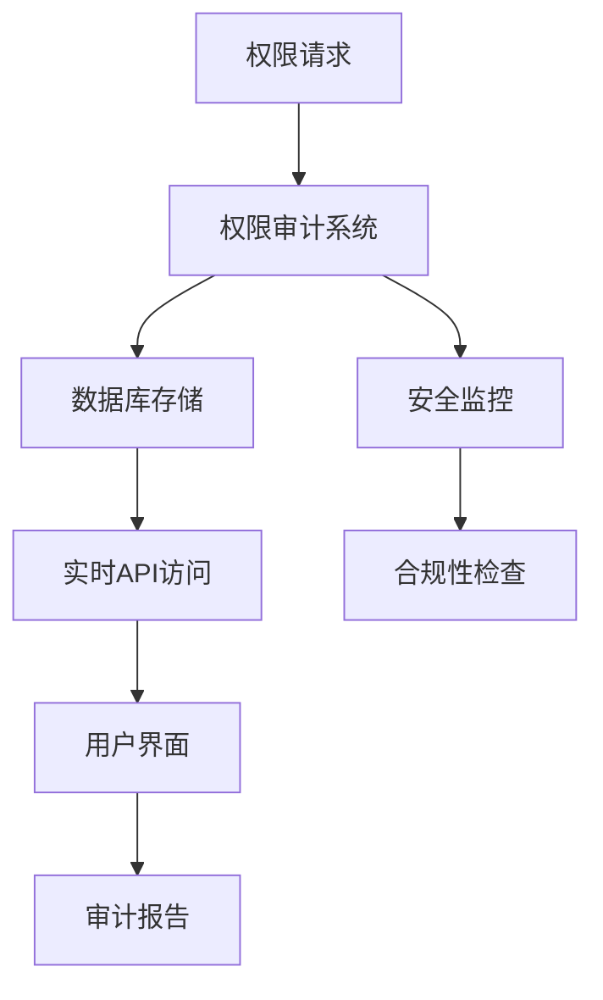
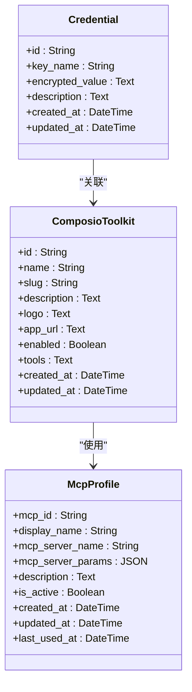
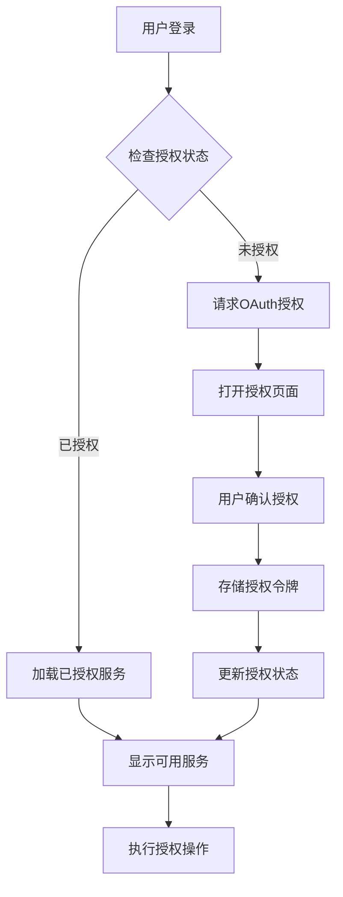
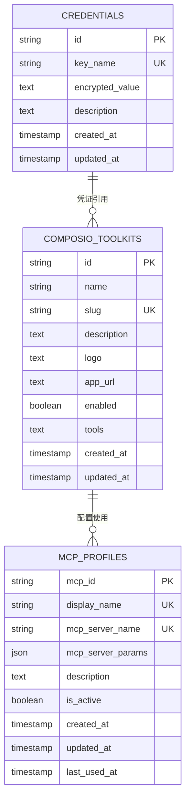
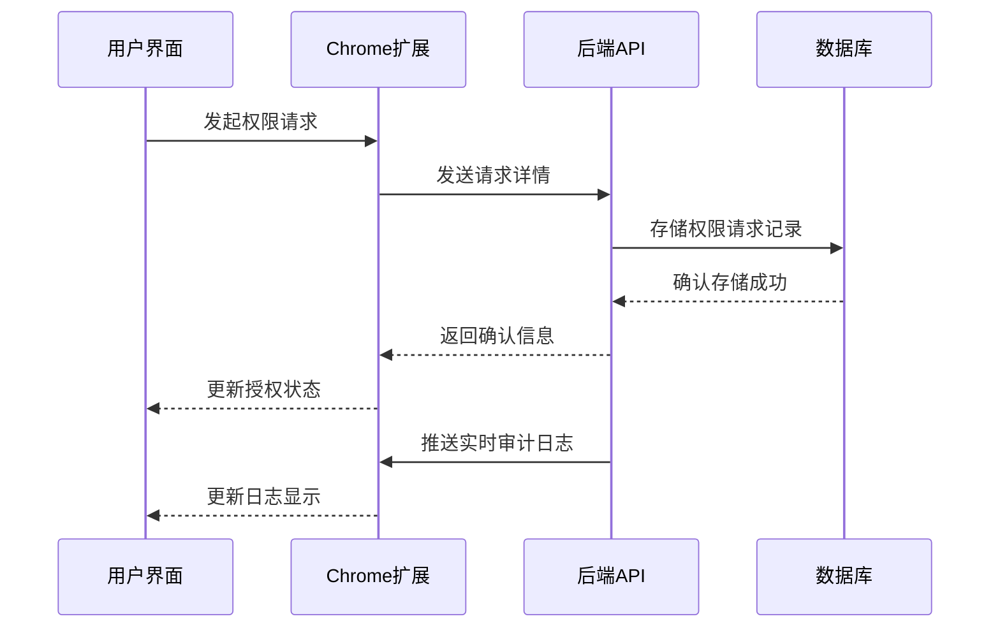

# 权限审计

<cite>
**本文档引用的文件**   
- [vibe_surf/backend/database/models.py](file://vibe_surf/backend/database/models.py)
- [vibe_surf/backend/database/queries.py](file://vibe_surf/backend/database/queries.py)
- [vibe_surf/backend/api/activity.py](file://vibe_surf/backend/api/activity.py)
- [vibe_surf/backend/shared_state.py](file://vibe_surf/backend/shared_state.py)
- [vibe_surf/agents/vibe_surf_agent.py](file://vibe_surf/agents/vibe_surf_agent.py)
- [vibe_surf/chrome_extension/scripts/session-manager.js](file://vibe_surf/chrome_extension/scripts/session-manager.js)
- [vibe_surf/chrome_extension/scripts/api-client.js](file://vibe_surf/chrome_extension/scripts/api-client.js)
</cite>

## 目录
1. [权限审计机制概述](#权限审计机制概述)
2. [权限请求记录](#权限请求记录)
3. [用户授权状态管理](#用户授权状态管理)
4. [审计日志存储与访问](#审计日志存储与访问)
5. [系统架构与数据流](#系统架构与数据流)

## 权限审计机制概述

VibeSurf系统通过综合的权限审计机制，全面记录和管理用户权限请求与授权活动。系统采用分层架构，将权限审计信息存储在SQLite数据库中，并通过API端点提供实时访问。审计机制覆盖了从权限请求、用户授权到操作执行的完整生命周期，确保所有敏感操作都有迹可循。

系统通过`Credential`模型存储加密的API密钥和其他敏感凭证，通过`ComposioToolkit`模型管理第三方应用集成的权限配置。所有权限相关的操作都被记录在审计日志中，包括请求时间、涉及的服务、权限范围和授权结果等关键信息。

**Diagram sources**
- [vibe_surf/backend/database/models.py](file://vibe_surf/backend/database/models.py#L217-L234)

**Section sources**
- [vibe_surf/backend/database/models.py](file://vibe_surf/backend/database/models.py#L217-L234)

## 权限请求记录

VibeSurf系统详细记录每次权限请求的完整信息，确保审计追踪的完整性。权限请求记录包含请求时间、涉及的服务、请求的权限范围和用户授权结果等关键字段。

系统通过`Credential`模型存储加密的API密钥，每个凭证记录包含`key_name`（如"COMPOSIO_API_KEY"）、`encrypted_value`（使用MAC地址加密的值）和描述信息。当用户请求访问第三方服务时，系统会创建相应的权限请求记录，并在数据库中持久化存储。

**Diagram sources**
- [vibe_surf/backend/database/models.py](file://vibe_surf/backend/database/models.py#L217-L254)

**Section sources**
- [vibe_surf/backend/database/models.py](file://vibe_surf/backend/database/models.py#L217-L254)

## 用户授权状态管理

VibeSurf系统提供了完善的用户授权状态跟踪和管理功能。系统通过会话管理机制跟踪当前有效的权限授权，并允许用户查看和撤销不再需要的权限。

用户授权状态通过`ComposioToolkit`模型中的`enabled`字段进行管理，该字段为布尔类型，表示特定工具包是否已启用。用户可以通过界面查看当前所有已授权的服务，并选择性地禁用或删除不再需要的授权。

**Diagram sources**
- [vibe_surf/chrome_extension/scripts/session-manager.js](file://vibe_surf/chrome_extension/scripts/session-manager.js#L52-L74)
- [vibe_surf/chrome_extension/sidepanel.html](file://vibe_surf/chrome_extension/sidepanel.html#L732-L763)

**Section sources**
- [vibe_surf/chrome_extension/scripts/session-manager.js](file://vibe_surf/chrome_extension/scripts/session-manager.js#L52-L74)

## 审计日志存储与访问

VibeSurf系统的审计日志存储在SQLite数据库中，具有明确的保留策略和访问机制。系统通过`activity` API端点提供对审计日志的访问，支持按会话ID、时间范围和日志级别进行查询。

审计日志的存储位置为工作目录下的`vibe_surf.db`文件，该文件包含所有权限相关操作的记录。系统实现了自动化的日志轮换机制，确保日志文件不会无限增长。默认情况下，系统保留最近30天的审计日志，但此策略可根据合规性要求进行配置。

**Diagram sources**
- [vibe_surf/backend/database/models.py](file://vibe_surf/backend/database/models.py#L217-L254)
- [vibe_surf/backend/database/migrations/v006_add_credentials_table.sql](file://vibe_surf/backend/database/migrations/v006_add_credentials_table.sql#L1-L26)

**Section sources**
- [vibe_surf/backend/database/models.py](file://vibe_surf/backend/database/models.py#L217-L254)

## 系统架构与数据流

VibeSurf权限审计系统的架构设计确保了数据的安全性和可追溯性。系统采用分层架构，从用户界面到后端服务再到数据库存储，每个层级都有明确的职责和数据流。

权限审计数据流始于用户操作，通过Chrome扩展传递到后端API，然后存储在数据库中。系统使用加密技术保护敏感信息，所有API密钥都使用设备特定的MAC地址进行加密存储。审计日志通过WebSocket或轮询机制实时更新，确保用户能够及时查看权限使用情况。

**Diagram sources**
- [vibe_surf/chrome_extension/scripts/api-client.js](file://vibe_surf/chrome_extension/scripts/api-client.js#L236-L271)
- [vibe_surf/backend/api/activity.py](file://vibe_surf/backend/api/activity.py#L154-L217)

**Section sources**
- [vibe_surf/chrome_extension/scripts/api-client.js](file://vibe_surf/chrome_extension/scripts/api-client.js#L236-L271)
- [vibe_surf/backend/api/activity.py](file://vibe_surf/backend/api/activity.py#L154-L217)