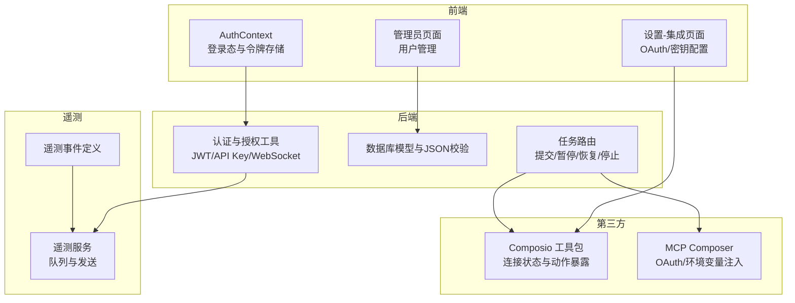
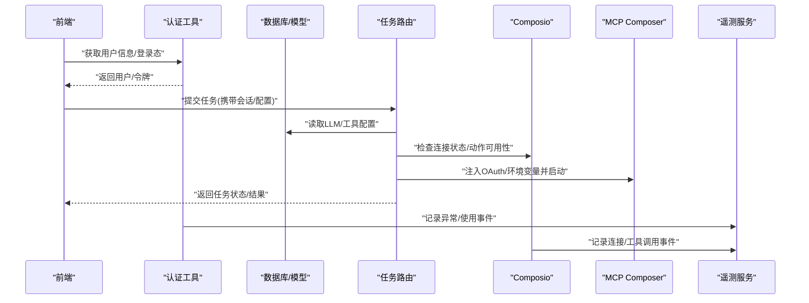
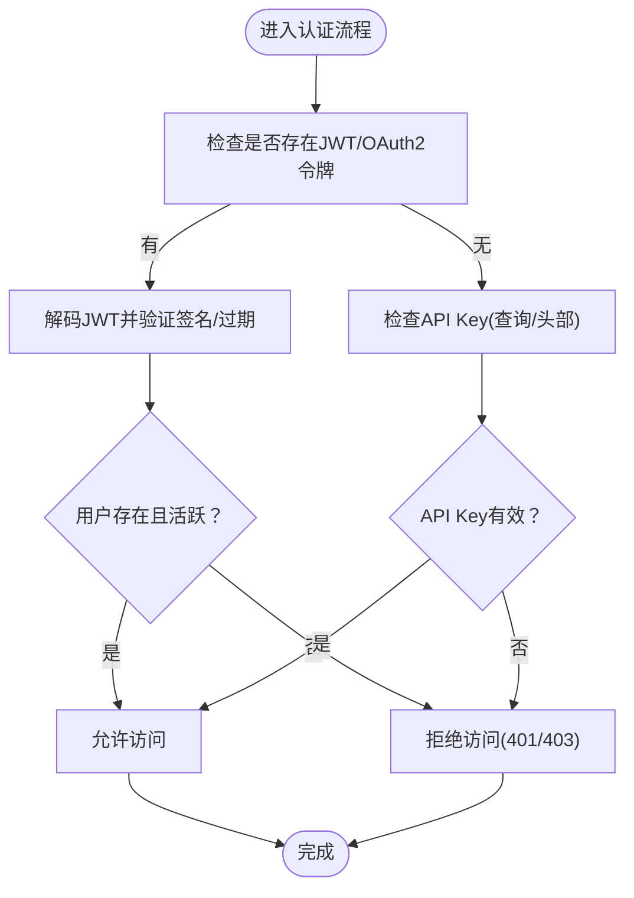
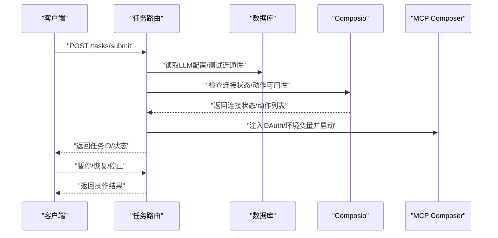
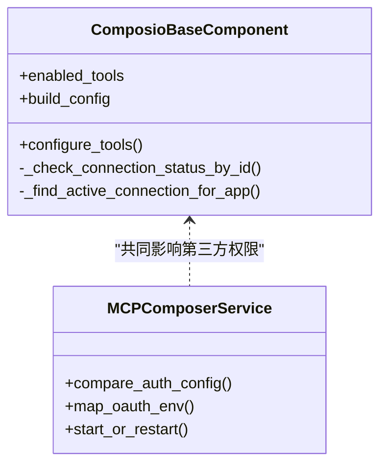
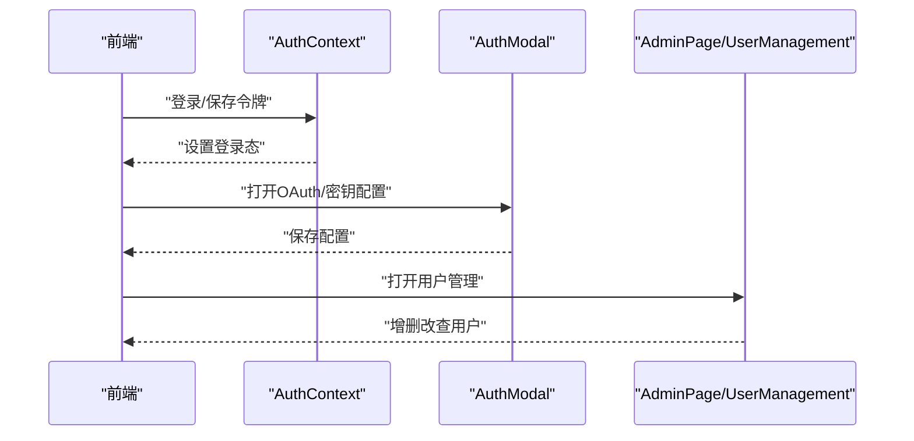
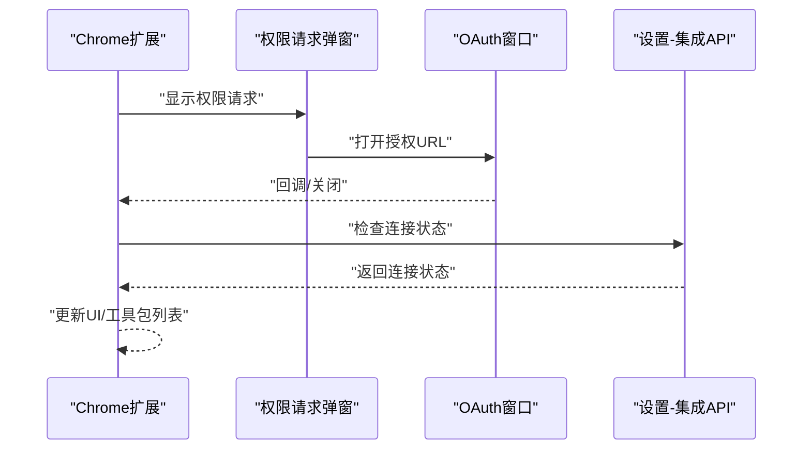
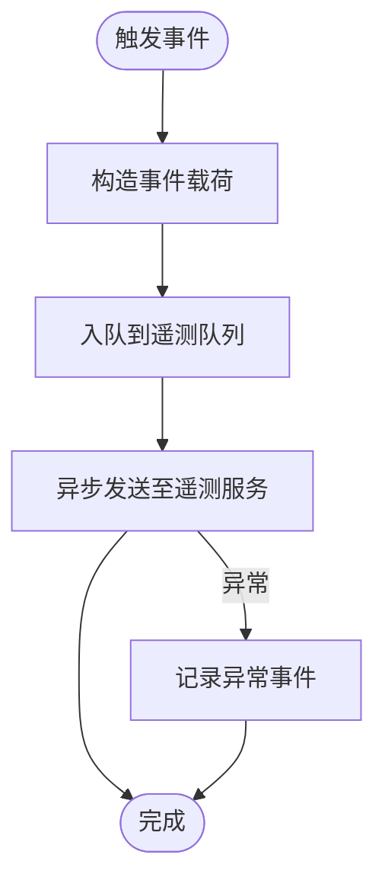
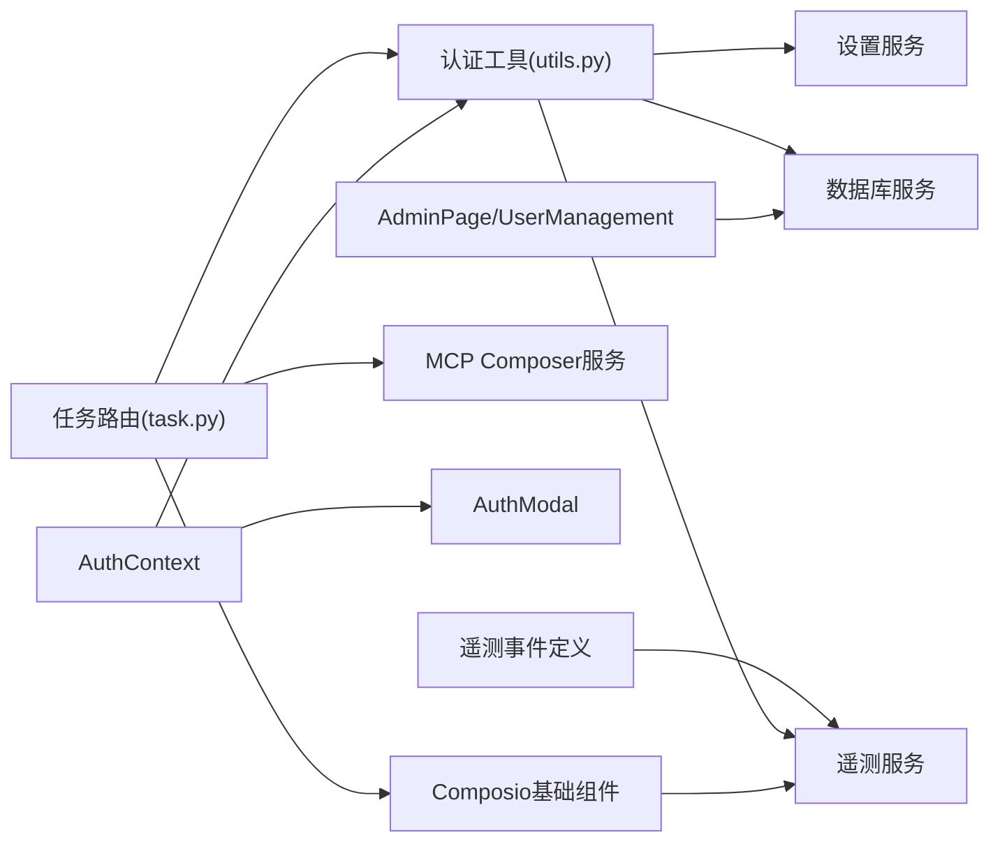

# 权限管理

<cite>
**本文引用的文件**
- [vibe_surf/langflow/services/auth/utils.py](file://vibe_surf/langflow/services/auth/utils.py)
- [vibe_surf/langflow/api/v1/auth_helpers.py](file://vibe_surf/langflow/api/v1/auth_helpers.py)
- [vibe_surf/backend/database/models.py](file://vibe_surf/backend/database/models.py)
- [vibe_surf/backend/database/schemas.py](file://vibe_surf/backend/database/schemas.py)
- [vibe_surf/backend/api/task.py](file://vibe_surf/backend/api/task.py)
- [vibe_surf/telemetry/views.py](file://vibe_surf/telemetry/views.py)
- [vibe_surf/langflow/services/telemetry/service.py](file://vibe_surf/langflow/services/telemetry/service.py)
- [vibe_surf/frontend/src/contexts/authContext.tsx](file://vibe_surf/frontend/src/contexts/authContext.tsx)
- [vibe_surf/frontend/src/modals/authModal/index.tsx](file://vibe_surf/frontend/src/modals/authModal/index.tsx)
- [vibe_surf/frontend/src/modals/userManagementModal/index.tsx](file://vibe_surf/frontend/src/modals/userManagementModal/index.tsx)
- [vibe_surf/frontend/src/pages/AdminPage/index.tsx](file://vibe_surf/frontend/src/pages/AdminPage/index.tsx)
- [vibe_surf/chrome_extension/scripts/settings-integrations.js](file://vibe_surf/chrome_extension/scripts/settings-integrations.js)
- [vibe_surf/chrome_extension/scripts/permission-request.js](file://vibe_surf/chrome_extension/scripts/permission-request.js)
- [vibe_surf/chrome_extension/permission-request.html](file://vibe_surf/chrome_extension/permission-request.html)
- [vibe_surf/langflow/base/composio/composio_base.py](file://vibe_surf/langflow/base/composio/composio_base.py)
- [vibe_surf/langflow/services/mcp_composer/service.py](file://vibe_surf/langflow/services/mcp_composer/service.py)
- [vibe_surf/agents/prompts/vibe_surf_prompt.py](file://vibe_surf/agents/prompts/vibe_surf_prompt.py)
</cite>

## 目录
1. [引言](#引言)
2. [项目结构](#项目结构)
3. [核心组件](#核心组件)
4. [架构总览](#架构总览)
5. [详细组件分析](#详细组件分析)
6. [依赖关系分析](#依赖关系分析)
7. [性能考量](#性能考量)
8. [故障排查指南](#故障排查指南)
9. [结论](#结论)
10. [附录：权限配置示例与最佳实践](#附录权限配置示例与最佳实践)

## 引言
本文件系统性文档化 VibeSurf 的权限管理模型，重点覆盖以下方面：
- 如何通过最小权限原则控制第三方服务（如 Composio、MCP 等）的访问范围，实现细粒度的权限控制；
- 权限审计机制：权限请求日志记录与用户授权状态跟踪；
- 在工作流执行过程中动态验证权限，并处理权限不足的情况；
- 权限配置示例与最佳实践，帮助用户安全地管理集成权限。

## 项目结构
围绕权限管理的关键模块分布如下：
- 后端认证与授权：JWT/OAuth2、API Key、超级用户校验、WebSocket 认证等；
- 数据层：用户、凭证、工具包、计划任务等模型与 JSON 字段校验；
- 工作流执行：任务提交、暂停/恢复/停止、状态查询；
- 第三方集成：Composio 工具包连接、MCP Composer 配置与启动；
- 前端：登录态上下文、权限设置弹窗、用户管理；
- 扩展：Chrome 插件中的权限请求与 OAuth 流程；
- 遥测：异常与使用事件记录，辅助审计与问题定位。

图表来源
- [vibe_surf/frontend/src/contexts/authContext.tsx](file://vibe_surf/frontend/src/contexts/authContext.tsx#L1-L126)
- [vibe_surf/backend/api/task.py](file://vibe_surf/backend/api/task.py#L1-L379)
- [vibe_surf/backend/database/models.py](file://vibe_surf/backend/database/models.py#L1-L289)
- [vibe_surf/langflow/services/auth/utils.py](file://vibe_surf/langflow/services/auth/utils.py#L1-L584)
- [vibe_surf/langflow/base/composio/composio_base.py](file://vibe_surf/langflow/base/composio/composio_base.py#L1000-L1199)
- [vibe_surf/langflow/services/mcp_composer/service.py](file://vibe_surf/langflow/services/mcp_composer/service.py#L216-L447)
- [vibe_surf/telemetry/views.py](file://vibe_surf/telemetry/views.py#L1-L189)
- [vibe_surf/langflow/services/telemetry/service.py](file://vibe_surf/langflow/services/telemetry/service.py#L83-L281)

章节来源
- [vibe_surf/frontend/src/contexts/authContext.tsx](file://vibe_surf/frontend/src/contexts/authContext.tsx#L1-L126)
- [vibe_surf/backend/api/task.py](file://vibe_surf/backend/api/task.py#L1-L379)
- [vibe_surf/backend/database/models.py](file://vibe_surf/backend/database/models.py#L1-L289)
- [vibe_surf/langflow/services/auth/utils.py](file://vibe_surf/langflow/services/auth/utils.py#L1-L584)
- [vibe_surf/langflow/base/composio/composio_base.py](file://vibe_surf/langflow/base/composio/composio_base.py#L1000-L1199)
- [vibe_surf/langflow/services/mcp_composer/service.py](file://vibe_surf/langflow/services/mcp_composer/service.py#L216-L447)
- [vibe_surf/telemetry/views.py](file://vibe_surf/telemetry/views.py#L1-L189)
- [vibe_surf/langflow/services/telemetry/service.py](file://vibe_surf/langflow/services/telemetry/service.py#L83-L281)

## 核心组件
- 认证与授权工具：支持 JWT/OAuth2 密码流、API Key 查询/头部校验、WebSocket 认证、超级用户校验、刷新令牌、长时令牌生成、密码哈希与校验、加密解密等。
- 数据模型与 JSON 校验：用户、凭证、工具包、计划任务等；对 JSON 字段进行模式校验，避免敏感信息落盘。
- 任务执行与权限验证：任务提交前检查 LLM 连通性与配置有效性；在执行中通过连接状态与动作选项控制第三方调用范围。
- 第三方集成：Composio 工具包连接状态检测与动作暴露；MCP Composer OAuth 参数映射与命令行注入。
- 前端权限设置：登录态上下文、OAuth/密钥配置弹窗、用户管理界面。
- 遥测与审计：异常事件与使用事件记录，便于审计与问题追踪。

章节来源
- [vibe_surf/langflow/services/auth/utils.py](file://vibe_surf/langflow/services/auth/utils.py#L1-L584)
- [vibe_surf/backend/database/schemas.py](file://vibe_surf/backend/database/schemas.py#L1-L100)
- [vibe_surf/backend/api/task.py](file://vibe_surf/backend/api/task.py#L1-L379)
- [vibe_surf/langflow/base/composio/composio_base.py](file://vibe_surf/langflow/base/composio/composio_base.py#L1000-L1199)
- [vibe_surf/langflow/services/mcp_composer/service.py](file://vibe_surf/langflow/services/mcp_composer/service.py#L216-L447)
- [vibe_surf/frontend/src/contexts/authContext.tsx](file://vibe_surf/frontend/src/contexts/authContext.tsx#L1-L126)
- [vibe_surf/telemetry/views.py](file://vibe_surf/telemetry/views.py#L1-L189)

## 架构总览
下图展示权限管理在系统中的关键交互路径：前端登录态与第三方配置，后端认证与任务执行，第三方集成（Composio/MCP），以及遥测审计。

图表来源
- [vibe_surf/frontend/src/contexts/authContext.tsx](file://vibe_surf/frontend/src/contexts/authContext.tsx#L1-L126)
- [vibe_surf/langflow/services/auth/utils.py](file://vibe_surf/langflow/services/auth/utils.py#L143-L259)
- [vibe_surf/backend/api/task.py](file://vibe_surf/backend/api/task.py#L43-L146)
- [vibe_surf/langflow/base/composio/composio_base.py](file://vibe_surf/langflow/base/composio/composio_base.py#L1000-L1199)
- [vibe_surf/langflow/services/mcp_composer/service.py](file://vibe_surf/langflow/services/mcp_composer/service.py#L216-L447)
- [vibe_surf/langflow/services/telemetry/service.py](file://vibe_surf/langflow/services/telemetry/service.py#L83-L281)

## 详细组件分析

### 组件A：认证与授权（JWT/API Key/WebSocket）
- 支持多入口认证：JWT/OAuth2 密码流、API Key 查询/头部、WebSocket Cookie/Query/Headers；
- 用户状态校验：活跃用户、超级用户权限；
- 令牌生命周期：访问令牌与刷新令牌，过期时间可配置；
- 加密与安全：Fernet 对称加密用于凭证存储，JWT 解码与签名验证，自动登录兼容策略。

图表来源
- [vibe_surf/langflow/services/auth/utils.py](file://vibe_surf/langflow/services/auth/utils.py#L143-L259)

章节来源
- [vibe_surf/langflow/services/auth/utils.py](file://vibe_surf/langflow/services/auth/utils.py#L1-L584)

### 组件B：任务执行与动态权限验证
- 提交任务前：加载并测试 LLM 连接，确保配置有效；
- 执行期间：根据 Composio 连接状态与动作选项动态决定是否允许调用第三方工具；
- 控制操作：暂停/恢复/停止，更新状态并清理活动任务。

图表来源
- [vibe_surf/backend/api/task.py](file://vibe_surf/backend/api/task.py#L43-L146)
- [vibe_surf/langflow/base/composio/composio_base.py](file://vibe_surf/langflow/base/composio/composio_base.py#L1000-L1199)
- [vibe_surf/langflow/services/mcp_composer/service.py](file://vibe_surf/langflow/services/mcp_composer/service.py#L216-L447)

章节来源
- [vibe_surf/backend/api/task.py](file://vibe_surf/backend/api/task.py#L1-L379)
- [vibe_surf/langflow/base/composio/composio_base.py](file://vibe_surf/langflow/base/composio/composio_base.py#L1000-L1199)
- [vibe_surf/langflow/services/mcp_composer/service.py](file://vibe_surf/langflow/services/mcp_composer/service.py#L216-L447)

### 组件C：第三方集成权限（Composio/MCP）
- Composio：连接状态检测、动作选项构建、只读工具暴露、工具模式开关；
- MCP：OAuth 配置映射为环境变量，命令行注入，差异检测与重启逻辑。

图表来源
- [vibe_surf/langflow/base/composio/composio_base.py](file://vibe_surf/langflow/base/composio/composio_base.py#L1000-L1199)
- [vibe_surf/langflow/services/mcp_composer/service.py](file://vibe_surf/langflow/services/mcp_composer/service.py#L216-L447)

章节来源
- [vibe_surf/langflow/base/composio/composio_base.py](file://vibe_surf/langflow/base/composio/composio_base.py#L1000-L1199)
- [vibe_surf/langflow/services/mcp_composer/service.py](file://vibe_surf/langflow/services/mcp_composer/service.py#L216-L447)

### 组件D：前端权限设置与用户管理
- 登录态上下文：Cookie/LocalStorage 存储访问令牌与刷新令牌，拉取用户信息；
- OAuth/密钥配置弹窗：支持 OAuth Host/Port/ServerUrl/CallbackPath/ClientId/ClientSecret/AuthUrl/TokenUrl/MCP/Provider Scope 等字段；
- 用户管理：管理员页面支持新增/编辑/删除用户，切换激活状态与超级用户权限。

图表来源
- [vibe_surf/frontend/src/contexts/authContext.tsx](file://vibe_surf/frontend/src/contexts/authContext.tsx#L1-L126)
- [vibe_surf/frontend/src/modals/authModal/index.tsx](file://vibe_surf/frontend/src/modals/authModal/index.tsx#L1-L346)
- [vibe_surf/frontend/src/modals/userManagementModal/index.tsx](file://vibe_surf/frontend/src/modals/userManagementModal/index.tsx#L1-L37)
- [vibe_surf/frontend/src/pages/AdminPage/index.tsx](file://vibe_surf/frontend/src/pages/AdminPage/index.tsx#L1-L44)

章节来源
- [vibe_surf/frontend/src/contexts/authContext.tsx](file://vibe_surf/frontend/src/contexts/authContext.tsx#L1-L126)
- [vibe_surf/frontend/src/modals/authModal/index.tsx](file://vibe_surf/frontend/src/modals/authModal/index.tsx#L1-L346)
- [vibe_surf/frontend/src/modals/userManagementModal/index.tsx](file://vibe_surf/frontend/src/modals/userManagementModal/index.tsx#L1-L37)
- [vibe_surf/frontend/src/pages/AdminPage/index.tsx](file://vibe_surf/frontend/src/pages/AdminPage/index.tsx#L1-L44)

### 组件E：Chrome 扩展权限请求与 OAuth 流程
- OAuth 流程：打开授权 URL、显示确认模态、检查连接状态、更新工具包列表；
- 权限请求：扩展侧弹出权限请求页面，引导用户授权。

图表来源
- [vibe_surf/chrome_extension/scripts/settings-integrations.js](file://vibe_surf/chrome_extension/scripts/settings-integrations.js#L657-L743)
- [vibe_surf/chrome_extension/scripts/permission-request.js](file://vibe_surf/chrome_extension/scripts/permission-request.js#L1-L200)
- [vibe_surf/chrome_extension/permission-iframe-request.js](file://vibe_surf/chrome_extension/permission-iframe-request.js#L1-L200)

章节来源
- [vibe_surf/chrome_extension/scripts/settings-integrations.js](file://vibe_surf/chrome_extension/scripts/settings-integrations.js#L657-L743)
- [vibe_surf/chrome_extension/scripts/permission-request.js](file://vibe_surf/chrome_extension/scripts/permission-request.js#L1-L200)
- [vibe_surf/chrome_extension/permission-iframe-request.js](file://vibe_surf/chrome_extension/permission-iframe-request.js#L1-L200)

### 组件F：权限审计与遥测
- 遥测事件：定义了多种事件类型（Agent/MCP/Composio/CLI/后端等），包含版本、动作、耗时、错误信息等；
- 遥测服务：异步队列发送、异常捕获与日志、优雅停止与刷新；
- 安全与合规：提示严格的安全措施与最小权限原则，防止越权与恶意代码执行。

图表来源
- [vibe_surf/telemetry/views.py](file://vibe_surf/telemetry/views.py#L1-L189)
- [vibe_surf/langflow/services/telemetry/service.py](file://vibe_surf/langflow/services/telemetry/service.py#L83-L281)
- [vibe_surf/agents/prompts/vibe_surf_prompt.py](file://vibe_surf/agents/prompts/vibe_surf_prompt.py#L154-L171)

章节来源
- [vibe_surf/telemetry/views.py](file://vibe_surf/telemetry/views.py#L1-L189)
- [vibe_surf/langflow/services/telemetry/service.py](file://vibe_surf/langflow/services/telemetry/service.py#L83-L281)
- [vibe_surf/agents/prompts/vibe_surf_prompt.py](file://vibe_surf/agents/prompts/vibe_surf_prompt.py#L154-L171)

## 依赖关系分析
- 认证工具依赖设置服务与数据库服务，提供 JWT/OAuth2、API Key、WebSocket 认证；
- 任务路由依赖数据库查询与共享状态，结合 Composio/MCP 进行权限控制；
- Composio 组件依赖连接状态与动作映射，动态暴露工具；
- MCP Composer 服务负责 OAuth 配置比较与环境变量映射；
- 前端上下文与弹窗负责用户输入与配置持久化；
- 遥测服务贯穿认证与第三方调用，提供审计能力。

图表来源
- [vibe_surf/langflow/services/auth/utils.py](file://vibe_surf/langflow/services/auth/utils.py#L1-L584)
- [vibe_surf/backend/api/task.py](file://vibe_surf/backend/api/task.py#L1-L379)
- [vibe_surf/langflow/base/composio/composio_base.py](file://vibe_surf/langflow/base/composio/composio_base.py#L1000-L1199)
- [vibe_surf/langflow/services/mcp_composer/service.py](file://vibe_surf/langflow/services/mcp_composer/service.py#L216-L447)
- [vibe_surf/frontend/src/contexts/authContext.tsx](file://vibe_surf/frontend/src/contexts/authContext.tsx#L1-L126)
- [vibe_surf/telemetry/views.py](file://vibe_surf/telemetry/views.py#L1-L189)
- [vibe_surf/langflow/services/telemetry/service.py](file://vibe_surf/langflow/services/telemetry/service.py#L83-L281)

章节来源
- [vibe_surf/langflow/services/auth/utils.py](file://vibe_surf/langflow/services/auth/utils.py#L1-L584)
- [vibe_surf/backend/api/task.py](file://vibe_surf/backend/api/task.py#L1-L379)
- [vibe_surf/langflow/base/composio/composio_base.py](file://vibe_surf/langflow/base/composio/composio_base.py#L1000-L1199)
- [vibe_surf/langflow/services/mcp_composer/service.py](file://vibe_surf/langflow/services/mcp_composer/service.py#L216-L447)
- [vibe_surf/frontend/src/contexts/authContext.tsx](file://vibe_surf/frontend/src/contexts/authContext.tsx#L1-L126)
- [vibe_surf/telemetry/views.py](file://vibe_surf/telemetry/views.py#L1-L189)
- [vibe_surf/langflow/services/telemetry/service.py](file://vibe_surf/langflow/services/telemetry/service.py#L83-L281)

## 性能考量
- 认证路径：JWT 解码与数据库查询应尽量缓存用户信息与令牌过期时间，减少重复校验；
- 任务执行：LLM 连通性测试仅在配置变更或首次使用时触发，避免频繁测试；
- Composio：动作选项与连接状态检查采用懒加载与缓存，避免每次渲染都发起网络请求；
- 遥测：异步队列发送，批量刷新，降低对主业务的影响。

[本节为通用指导，不直接分析具体文件]

## 故障排查指南
- 认证失败（401/403）：检查令牌是否过期、API Key 是否正确、用户是否激活、是否具备超级用户权限；
- 任务提交失败：确认 LLM 配置有效、连接可达；检查 MCP 配置与 Composer 启动状态；
- Composio 连接未生效：检查 API Key、OAuth 回调、连接状态；确认工具包启用与动作选项已加载；
- 遥测异常：查看遥测服务队列与异常事件，定位发送失败原因。

章节来源
- [vibe_surf/langflow/services/auth/utils.py](file://vibe_surf/langflow/services/auth/utils.py#L143-L259)
- [vibe_surf/backend/api/task.py](file://vibe_surf/backend/api/task.py#L43-L146)
- [vibe_surf/langflow/base/composio/composio_base.py](file://vibe_surf/langflow/base/composio/composio_base.py#L1000-L1199)
- [vibe_surf/langflow/services/telemetry/service.py](file://vibe_surf/langflow/services/telemetry/service.py#L83-L281)

## 结论
VibeSurf 的权限管理以“最小权限”为核心，通过多入口认证、动态连接状态与动作选项控制、严格的 JSON 校验与遥测审计，实现了对第三方服务的细粒度权限控制与可追溯审计。前端与后端协同，确保用户在受控范围内使用集成能力，同时提供完善的故障排查与安全提示。

[本节为总结性内容，不直接分析具体文件]

## 附录：权限配置示例与最佳实践

- 最小权限原则
  - 仅授予必要的第三方工具动作权限，优先使用只读工具与受限范围；
  - 使用 Composio 工具模式（只暴露工具名称）以避免参数级越权；
  - 通过 MCP Composer 的 OAuth 映射，将最小范围的 OAuth Scope 注入环境变量。

- 权限配置示例
  - OAuth 配置字段：Host/Port/ServerUrl/CallbackPath/ClientId/ClientSecret/AuthUrl/TokenUrl/MCP Scope/Provider Scope；
  - API Key 配置：Composio API Key 验证与连接状态检查；
  - 用户权限：管理员创建用户并授予必要角色，避免默认超级用户权限滥用。

- 动态权限验证与处理
  - 任务提交前：校验 LLM 连通性与配置有效性；
  - 执行期间：若连接非 ACTIVE 或动作不可用，阻断调用并提示用户进行授权；
  - 权限不足：返回明确错误信息，引导用户在前端设置页面完善配置。

- 审计与日志
  - 启用遥测服务，记录异常与使用事件；
  - 对敏感操作（如 OAuth 授权、工具调用）进行事件标记，便于回溯。

章节来源
- [vibe_surf/frontend/src/modals/authModal/index.tsx](file://vibe_surf/frontend/src/modals/authModal/index.tsx#L1-L346)
- [vibe_surf/chrome_extension/scripts/settings-integrations.js](file://vibe_surf/chrome_extension/scripts/settings-integrations.js#L147-L357)
- [vibe_surf/langflow/base/composio/composio_base.py](file://vibe_surf/langflow/base/composio/composio_base.py#L1000-L1199)
- [vibe_surf/langflow/services/mcp_composer/service.py](file://vibe_surf/langflow/services/mcp_composer/service.py#L216-L447)
- [vibe_surf/telemetry/views.py](file://vibe_surf/telemetry/views.py#L1-L189)
- [vibe_surf/langflow/services/telemetry/service.py](file://vibe_surf/langflow/services/telemetry/service.py#L83-L281)
- [vibe_surf/agents/prompts/vibe_surf_prompt.py](file://vibe_surf/agents/prompts/vibe_surf_prompt.py#L154-L171)