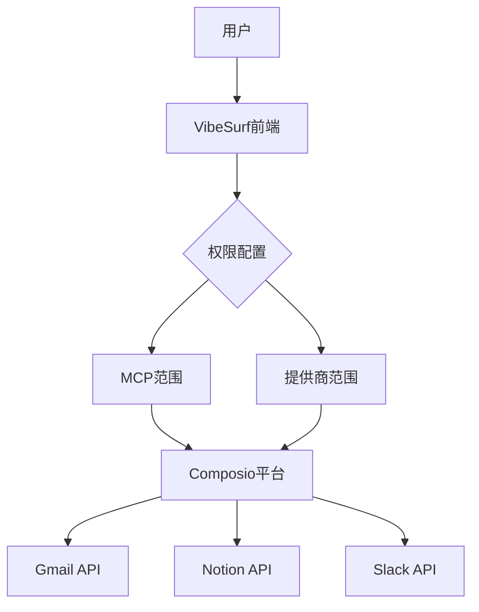
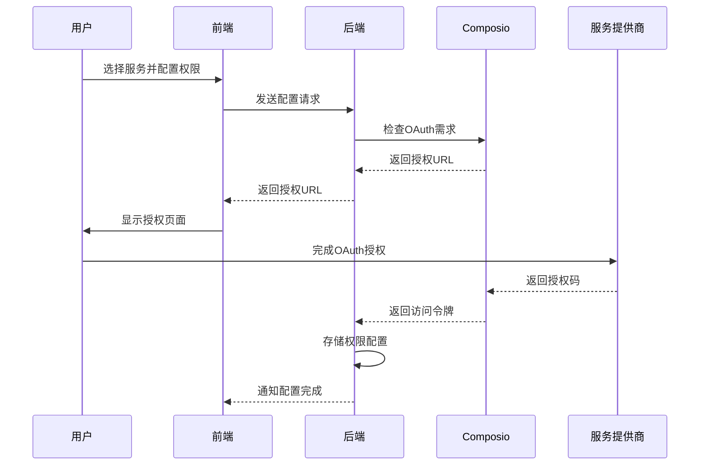
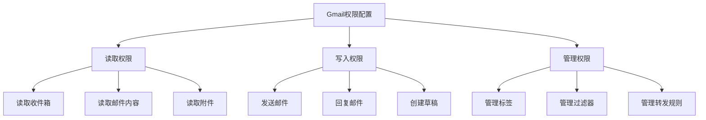
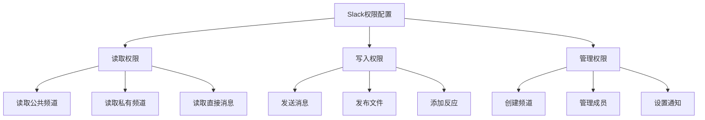

# 权限范围

<cite>
**本文档引用的文件**   
- [authModal/index.tsx](file://vibe_surf/frontend/src/modals/authModal/index.tsx)
- [composio.py](file://vibe_surf/backend/api/composio.py)
- [composio_base.py](file://vibe_surf/langflow/base/composio/composio_base.py)
- [gmail_composio.py](file://vibe_surf/workflows/Integrations/gmail_composio.py)
- [slack_composio.py](file://vibe_surf/workflows/Integrations/slack_composio.py)
- [schemas.py](file://vibe_surf/langflow/api/v1/schemas.py)
- [settings-integrations.js](file://vibe_surf/chrome_extension/scripts/settings-integrations.js)
- [mcp_composer/service.py](file://vibe_surf/langflow/services/mcp_composer/service.py)
</cite>

## 目录
1. [引言](#引言)
2. [权限范围配置机制](#权限范围配置机制)
3. [权限声明与工作流配置](#权限声明与工作流配置)
4. [常见服务权限配置示例](#常见服务权限配置示例)
5. [安全性最佳实践](#安全性最佳实践)

## 引言
VibeSurf通过Composio平台集成第三方服务，采用OAuth 2.0协议实现安全的权限管理。系统遵循最小权限原则，允许为每个集成精确配置访问权限，包括读取、写入和管理权限的粒度控制。本文档详细说明了权限范围的配置方式、声明方法以及与具体操作的映射关系。

## 权限范围配置机制

VibeSurf的权限范围配置主要通过OAuth 2.0协议实现，系统在前端和后端协同工作以管理第三方服务的访问权限。权限配置的核心机制包括MCP范围（MCP Scope）和提供商范围（Provider Scope）两个层面。

MCP范围定义了VibeSurf内部系统对集成服务的访问权限级别，而提供商范围则对应第三方服务API的具体权限范围。系统通过Composio平台作为中间层，将MCP范围映射到各个服务商的具体权限范围。

**图示来源**
- [authModal/index.tsx](file://vibe_surf/frontend/src/modals/authModal/index.tsx#L334-L370)
- [composio.py](file://vibe_surf/backend/api/composio.py#L587-L632)

**本节来源**
- [authModal/index.tsx](file://vibe_surf/frontend/src/modals/authModal/index.tsx#L22-L384)
- [schemas.py](file://vibe_surf/langflow/api/v1/schemas.py#L457-L459)

## 权限声明与工作流配置

权限范围在工作流配置中通过特定的字段进行声明。当用户启用某个第三方服务集成时，系统会检查该服务是否需要OAuth连接，并相应地生成授权URL。

权限范围的配置流程如下：
1. 用户在前端界面选择要集成的服务
2. 系统检查该服务是否需要OAuth认证
3. 如果需要，系统生成包含权限范围的OAuth授权URL
4. 用户完成授权后，系统存储访问令牌和权限信息
5. 在工作流执行时，系统根据配置的权限范围调用相应的API

**图示来源**
- [composio.py](file://vibe_surf/backend/api/composio.py#L537-L718)
- [settings-integrations.js](file://vibe_surf/chrome_extension/scripts/settings-integrations.js#L657-L743)

**本节来源**
- [composio.py](file://vibe_surf/backend/api/composio.py#L531-L718)
- [mcp_composer/service.py](file://vibe_surf/langflow/services/mcp_composer/service.py#L425-L447)

## 常见服务权限配置示例

### Gmail权限配置
Gmail集成通过Composio平台实现，权限配置包括读取邮件、发送邮件等操作。系统通过`ComposioGmailAPIComponent`类管理Gmail相关的权限和操作。

**图示来源**
- [gmail_composio.py](file://vibe_surf/workflows/Integrations/gmail_composio.py#L1-L39)
- [composio_base.py](file://vibe_surf/langflow/base/composio/composio_base.py#L752-L784)

### Slack权限配置
Slack集成允许用户配置不同的权限级别，包括读取频道消息、发送消息和管理频道等。`ComposioSlackAPIComponent`类负责处理Slack相关的权限和操作。

**图示来源**
- [slack_composio.py](file://vibe_surf/workflows/Integrations/slack_composio.py#L1-L12)
- [composio.py](file://vibe_surf/backend/api/composio.py#L277-L283)

### Notion权限配置
虽然项目中未找到Notion的具体实现文件，但基于Composio平台的集成模式，Notion权限配置应包括页面读写、数据库操作等权限。系统通过类似的组件模式管理Notion集成的权限。

**本节来源**
- [composio.py](file://vibe_surf/backend/api/composio.py#L280-L283)
- [composio_base.py](file://vibe_surf/langflow/base/composio/composio_base.py#L804-L824)

## 安全性最佳实践

### 最小权限原则
VibeSurf严格遵循最小权限原则，建议用户只为工作流所需的功能配置必要的权限。例如：
- 如果工作流只需要读取邮件，不应授予发送邮件的权限
- 如果只需要读取Slack消息，不应授予发送消息的权限
- 避免授予管理权限，除非工作流确实需要创建或修改资源

### 权限级别选择
根据使用场景选择适当的权限级别：
- **只读模式**：适用于监控、数据分析等场景
- **读写模式**：适用于自动化响应、内容生成等场景
- **管理模式**：仅在需要创建或修改资源结构时使用

### 安全配置建议
1. 定期审查已授权的集成和权限
2. 使用独立的测试账户进行开发和测试
3. 避免在生产环境中使用管理员权限
4. 及时撤销不再使用的集成授权
5. 监控异常的API调用行为

**本节来源**
- [composio.py](file://vibe_surf/backend/api/composio.py#L537-L718)
- [composio_base.py](file://vibe_surf/langflow/base/composio/composio_base.py#L752-L784)