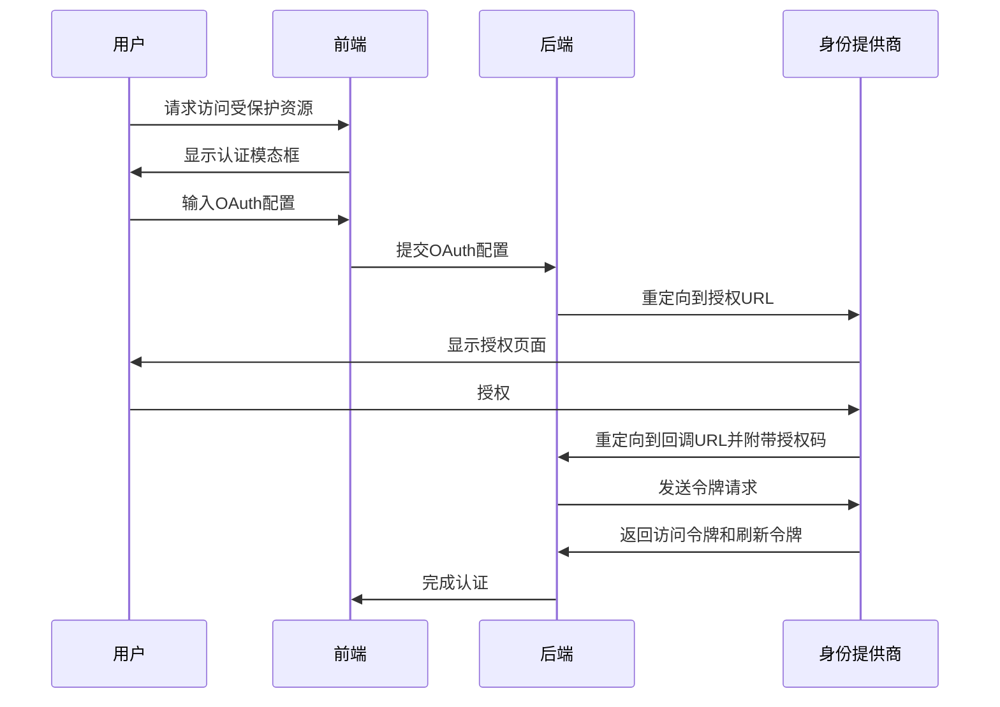
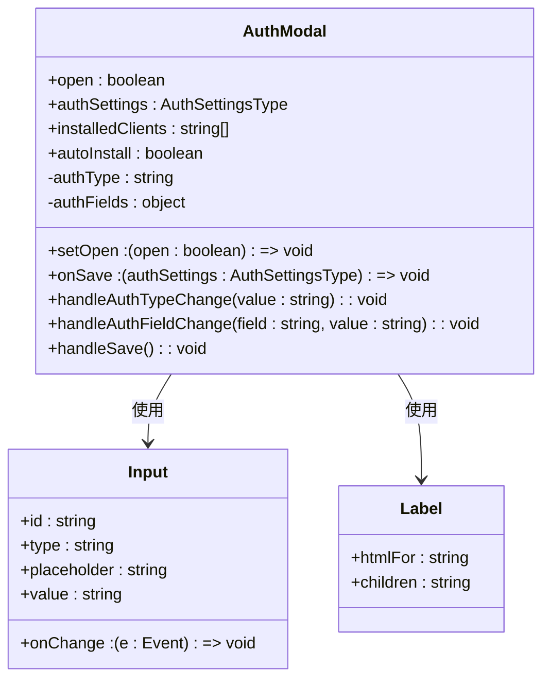
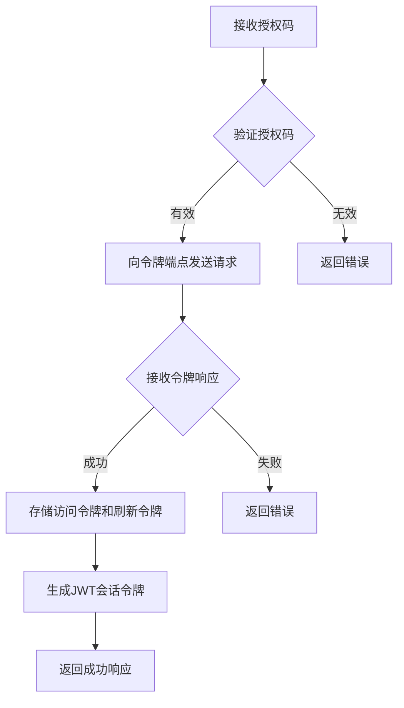
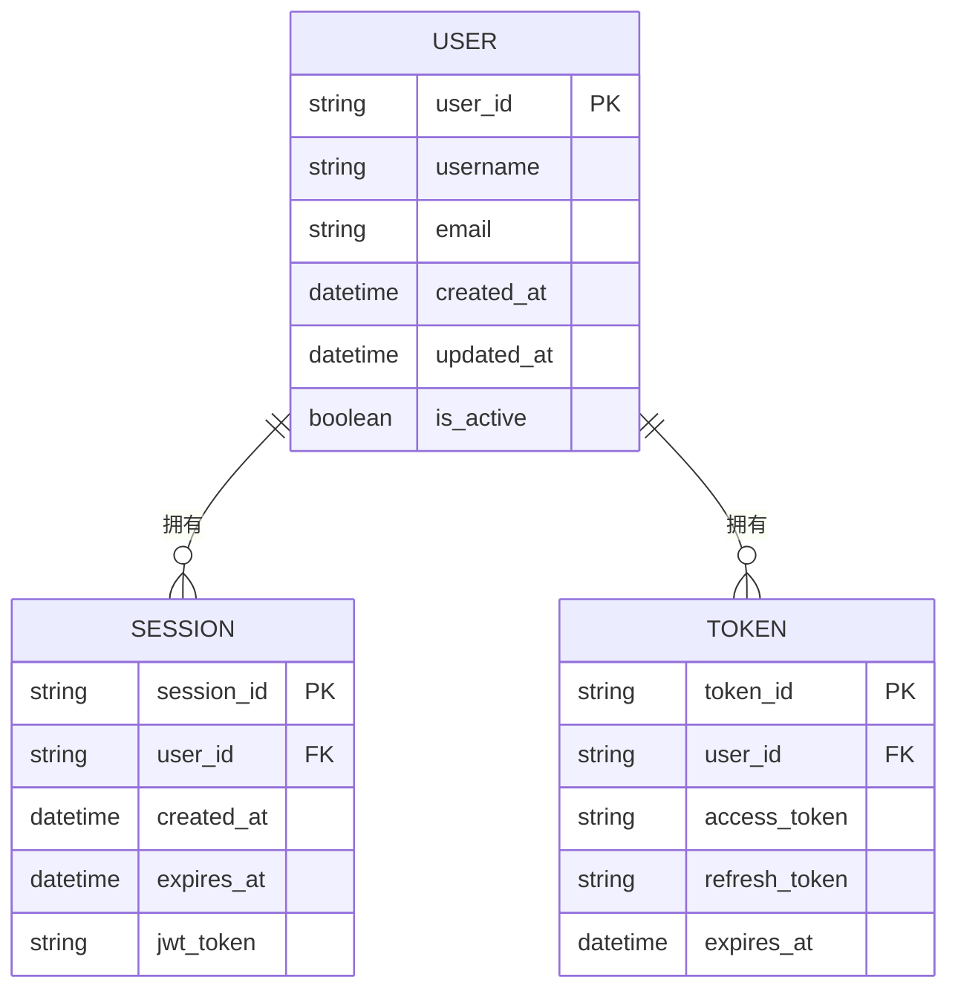

# OAuth 2.0 实现

<cite>
**本文档引用的文件**   
- [authModal/index.tsx](file://vibe_surf/frontend/src/modals/authModal/index.tsx)
- [service.py](file://vibe_surf/langflow/services/mcp_composer/service.py)
- [sidepanel.html](file://vibe_surf/chrome_extension/sidepanel.html)
- [utils.ts](file://vibe_surf/frontend/src/utils/utils.ts)
- [auth.py](file://vibe_surf/langflow/services/auth/utils.py)
- [composio_base.py](file://vibe_surf/langflow/base/composio/composio_base.py)
</cite>

## 目录
1. [引言](#引言)
2. [OAuth 2.0 授权码流程](#oauth-20-授权码流程)
3. [前端认证模态框实现](#前端认证模态框实现)
4. [后端OAuth令牌处理](#后端oauth令牌处理)
5. [安全会话管理](#安全会话管理)
6. [最佳实践](#最佳实践)
7. [结论](#结论)

## 引言
VibeSurf 实现了 OAuth 2.0 协议，以安全地集成外部服务和工具。该实现支持授权码流程，允许用户通过第三方身份提供商进行身份验证。系统通过前端模态框收集 OAuth 配置，后端服务处理令牌交换和会话管理。本文档详细说明了 VibeSurf 中 OAuth 2.0 的具体实现机制，包括授权码流程的完整生命周期、前端认证模态框的实现细节、后端如何验证和处理 OAuth 令牌，以及安全的会话管理。

## OAuth 2.0 授权码流程
VibeSurf 的 OAuth 2.0 实现遵循标准的授权码流程。当用户尝试访问需要 OAuth 认证的资源时，系统会启动授权流程。首先，前端通过认证模态框收集必要的 OAuth 配置，包括客户端 ID、客户端密钥、授权 URL 和令牌 URL 等。然后，后端服务使用这些配置生成授权 URL，并重定向用户到身份提供商的授权页面。

用户在身份提供商页面上进行身份验证并授权后，身份提供商会将用户重定向回 VibeSurf 的回调路径，并附带一个授权码。VibeSurf 的后端服务接收到授权码后，会向身份提供商的令牌端点发送请求，交换访问令牌和刷新令牌。这个过程确保了用户的凭据不会直接暴露给 VibeSurf，提高了安全性。

**Diagram sources**
- [authModal/index.tsx](file://vibe_surf/frontend/src/modals/authModal/index.tsx)
- [service.py](file://vibe_surf/langflow/services/mcp_composer/service.py)

**Section sources**
- [authModal/index.tsx](file://vibe_surf/frontend/src/modals/authModal/index.tsx)
- [service.py](file://vibe_surf/langflow/services/mcp_composer/service.py)

## 前端认证模态框实现
VibeSurf 的前端认证模态框是用户配置 OAuth 设置的主要界面。该模态框通过 React 组件实现，允许用户输入各种 OAuth 相关字段，如 `oauth_host`、`oauth_port`、`oauth_client_id` 等。模态框的设计考虑了用户体验，提供了清晰的标签和占位符，帮助用户正确填写配置。

模态框的实现使用了状态管理来跟踪用户输入。当用户更改认证类型时，模态框会相应地更新显示的字段。例如，当选择 OAuth 认证时，会显示与 OAuth 相关的输入字段，如客户端 ID 和客户端密钥。这种动态更新确保了用户界面的简洁性和相关性。

**Diagram sources**
- [authModal/index.tsx](file://vibe_surf/frontend/src/modals/authModal/index.tsx)

**Section sources**
- [authModal/index.tsx](file://vibe_surf/frontend/src/modals/authModal/index.tsx)

## 后端OAuth令牌处理
VibeSurf 的后端服务负责处理 OAuth 令牌的验证和交换。当接收到授权码时，后端服务会使用配置的客户端 ID 和客户端密钥向身份提供商的令牌端点发送请求。这个请求通常包含授权码、重定向 URI 和客户端凭据。

后端服务在接收到访问令牌和刷新令牌后，会对其进行验证和存储。访问令牌用于后续的 API 请求，而刷新令牌用于在访问令牌过期时获取新的访问令牌。VibeSurf 使用 JWT（JSON Web Token）来管理用户会话，确保令牌的安全性和有效性。

**Diagram sources**
- [service.py](file://vibe_surf/langflow/services/mcp_composer/service.py)
- [auth.py](file://vibe_surf/langflow/services/auth/utils.py)

**Section sources**
- [service.py](file://vibe_surf/langflow/services/mcp_composer/service.py)
- [auth.py](file://vibe_surf/langflow/services/auth/utils.py)

## 安全会话管理
VibeSurf 实现了安全的会话管理机制，以保护用户的身份和数据。系统使用 JWT 进行会话管理，每个 JWT 都包含用户的身份信息和过期时间。后端服务在每次请求时都会验证 JWT 的有效性，确保用户会话的安全。

为了防止会话劫持和重放攻击，VibeSurf 实施了多种安全措施。首先，所有敏感数据都通过 HTTPS 传输，确保数据在传输过程中的安全性。其次，系统使用安全的 Cookie 属性（如 `Secure` 和 `HttpOnly`）来存储会话令牌，防止 XSS 攻击。此外，VibeSurf 还实现了 CSRF 保护，通过在表单中包含 CSRF 令牌来防止跨站请求伪造攻击。

**Diagram sources**
- [auth.py](file://vibe_surf/langflow/services/auth/utils.py)
- [utils.ts](file://vibe_surf/frontend/src/utils/utils.ts)

**Section sources**
- [auth.py](file://vibe_surf/langflow/services/auth/utils.py)
- [utils.ts](file://vibe_surf/frontend/src/utils/utils.ts)

## 最佳实践
为了确保 VibeSurf 的 OAuth 2.0 实现的安全性和可靠性，建议遵循以下最佳实践：

1. **防止重定向攻击**：始终验证重定向 URI，确保它与注册的回调 URI 完全匹配。避免使用通配符或不具体的 URI 模式。
2. **防止 CSRF 攻击**：在 OAuth 流程中使用 state 参数。state 参数应在客户端生成并存储在会话中，然后在授权请求中发送。当用户被重定向回应用时，应验证返回的 state 参数是否与存储的值匹配。
3. **安全存储凭据**：客户端密钥等敏感凭据应安全存储，避免硬编码在源代码中。建议使用环境变量或密钥管理服务。
4. **定期轮换密钥**：定期轮换客户端密钥和签名密钥，以减少密钥泄露的风险。
5. **监控和日志记录**：实施全面的监控和日志记录，以便及时发现和响应潜在的安全事件。

## 结论
VibeSurf 的 OAuth 2.0 实现提供了一个安全、可靠的机制，用于集成外部服务和工具。通过详细的前端认证模态框、稳健的后端令牌处理和安全的会话管理，VibeSurf 确保了用户身份的安全性和数据的完整性。遵循最佳实践，如防止重定向攻击和 CSRF 攻击，可以进一步增强系统的安全性。未来的工作可以包括支持更多的 OAuth 提供商和实现更高级的安全功能，如多因素认证。