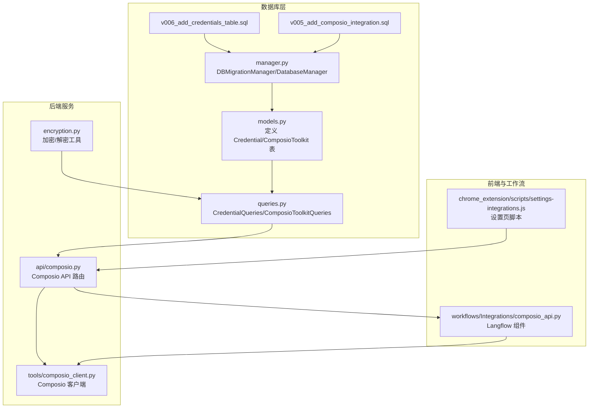
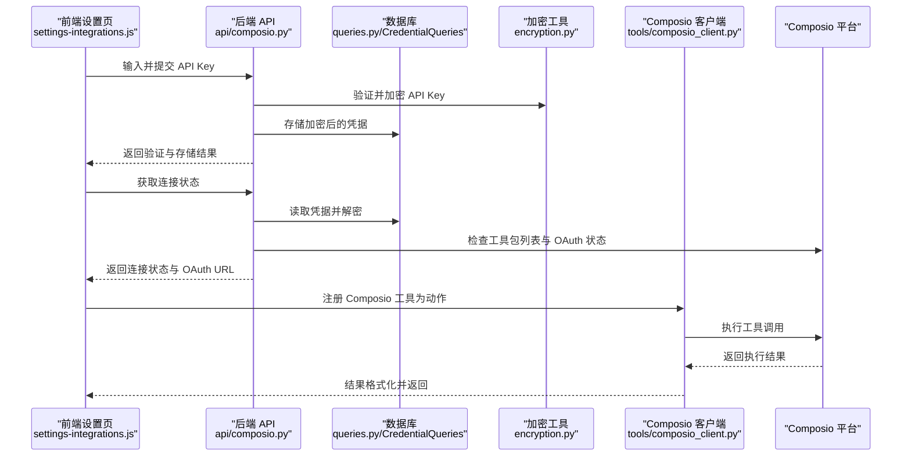
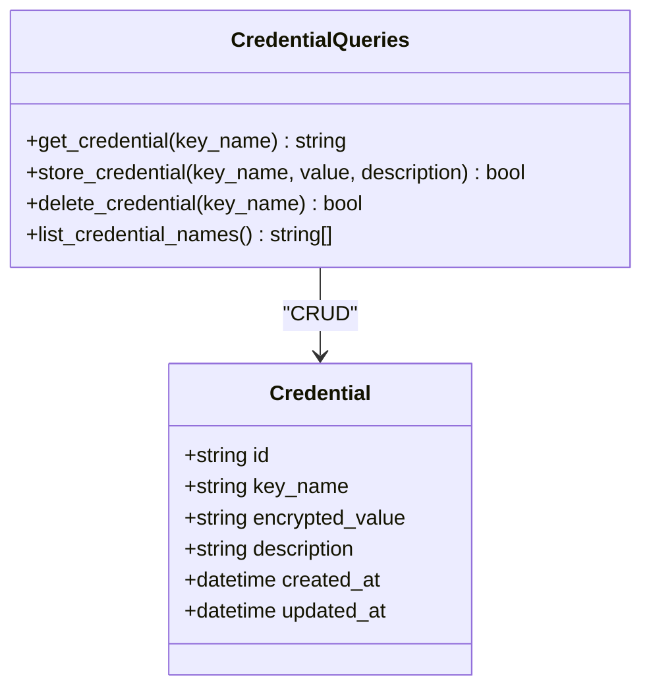
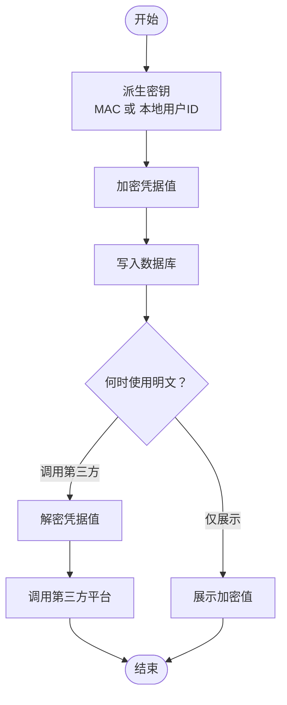
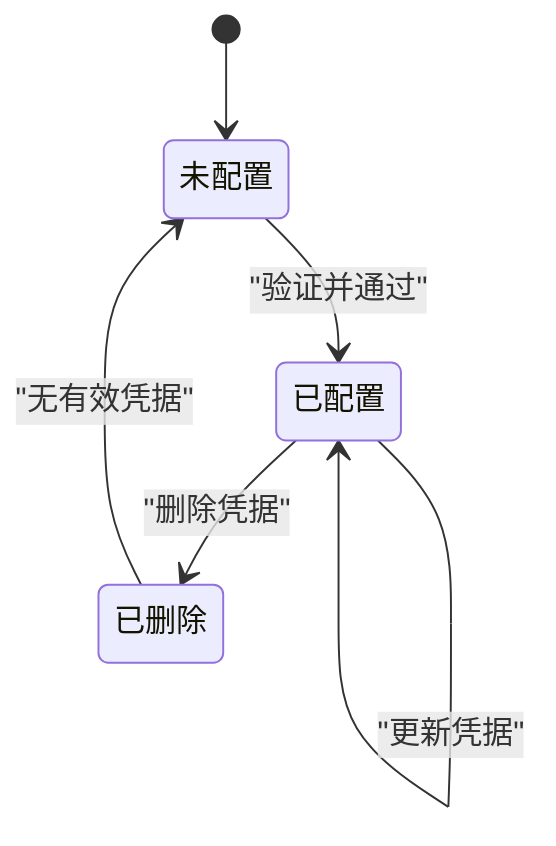
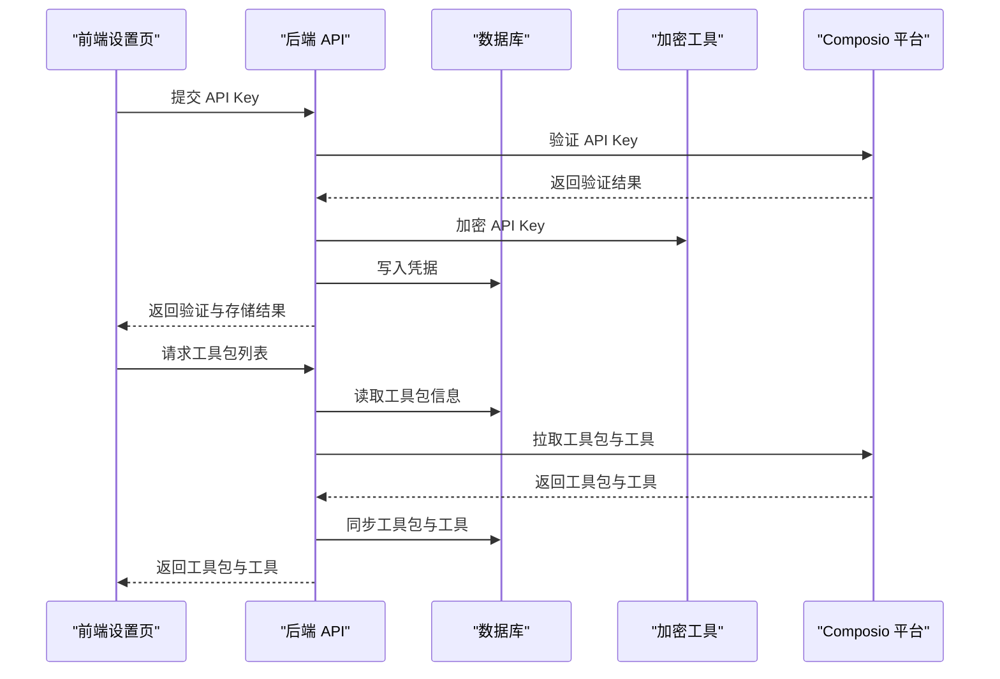
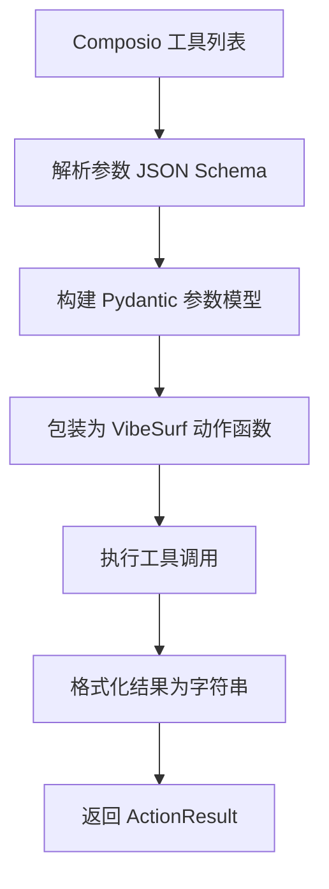
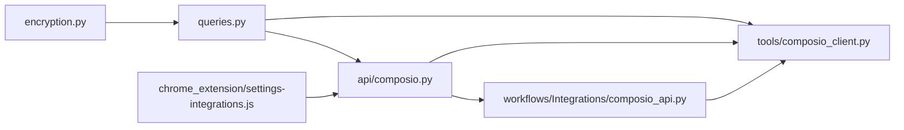

# 凭据管理

<cite>
**本文引用的文件**
- [models.py](file://vibe_surf/backend/database/models.py)
- [queries.py](file://vibe_surf/backend/database/queries.py)
- [encryption.py](file://vibe_surf/backend/utils/encryption.py)
- [manager.py](file://vibe_surf/backend/database/manager.py)
- [v006_add_credentials_table.sql](file://vibe_surf/backend/database/migrations/v006_add_credentials_table.sql)
- [v005_add_composio_integration.sql](file://vibe_surf/backend/database/migrations/v005_add_composio_integration.sql)
- [composio.py](file://vibe_surf/backend/api/composio.py)
- [composio_client.py](file://vibe_surf/tools/composio_client.py)
- [composio_api.py](file://vibe_surf/workflows/Integrations/composio_api.py)
- [settings-integrations.js](file://vibe_surf/chrome_extension/scripts/settings-integrations.js)
</cite>

## 目录
1. [简介](#简介)
2. [项目结构](#项目结构)
3. [核心组件](#核心组件)
4. [架构总览](#架构总览)
5. [详细组件分析](#详细组件分析)
6. [依赖关系分析](#依赖关系分析)
7. [性能考量](#性能考量)
8. [故障排查指南](#故障排查指南)
9. [结论](#结论)
10. [附录](#附录)

## 简介
本文件系统性文档化 VibeSurf 的“凭据管理系统”，重点覆盖与 Composio 集成的凭据处理机制。内容包括：
- 第三方服务（如 Gmail、Notion、Slack 等）API 密钥与令牌的安全存储、加密策略与访问控制。
- 凭据生命周期管理：创建、更新、删除与失效处理。
- 凭据在不同工作流与代理间的共享与隔离策略。
- 实际代码路径示例，展示凭据的存储与检索流程。
- 安全配置最佳实践：密钥轮换与最小权限原则。

## 项目结构
围绕凭据管理的关键模块分布如下：
- 数据库模型与迁移：定义凭据表、工具包表及索引触发器。
- 查询层：封装凭据的增删改查与工具包同步逻辑。
- 加密工具：基于机器特征派生对称密钥，实现凭据加密/解密。
- API 层：对外提供 Composio 凭据验证、状态检查与工具包启用/禁用接口。
- 工具层：将 Composio 工具注册为 VibeSurf 动作，支持参数校验与结果格式化。
- 前端扩展：提供 API Key 输入、校验与连接状态展示。

图表来源
- [models.py](file://vibe_surf/backend/database/models.py#L217-L235)
- [queries.py](file://vibe_surf/backend/database/queries.py#L1345-L1430)
- [manager.py](file://vibe_surf/backend/database/manager.py#L148-L201)
- [v006_add_credentials_table.sql](file://vibe_surf/backend/database/migrations/v006_add_credentials_table.sql#L1-L26)
- [v005_add_composio_integration.sql](file://vibe_surf/backend/database/migrations/v005_add_composio_integration.sql#L1-L33)
- [encryption.py](file://vibe_surf/backend/utils/encryption.py#L65-L127)
- [composio.py](file://vibe_surf/backend/api/composio.py#L148-L223)
- [composio_client.py](file://vibe_surf/tools/composio_client.py#L1-L120)
- [composio_api.py](file://vibe_surf/workflows/Integrations/composio_api.py#L1-L120)
- [settings-integrations.js](file://vibe_surf/chrome_extension/scripts/settings-integrations.js#L147-L357)

章节来源
- [models.py](file://vibe_surf/backend/database/models.py#L217-L235)
- [queries.py](file://vibe_surf/backend/database/queries.py#L1345-L1430)
- [manager.py](file://vibe_surf/backend/database/manager.py#L148-L201)

## 核心组件
- 凭据模型与查询
  - 模型：Credential（键名唯一、值加密存储、带时间戳）
  - 查询：CredentialQueries 提供 get/store/delete/list 等操作
- 加密工具
  - 基于机器 MAC 地址或本地用户 ID 派生对称密钥，使用 Fernet 进行加解密
  - 支持回退到本地用户 ID 以增强跨环境可用性
- 数据库迁移
  - credentials 表与索引、触发器；composio_toolkits 表与索引、触发器
- API 与工具
  - 后端 API：验证、存储、状态检查、工具包启用/禁用、OAuth 流程
  - 工具客户端：动态注册 Composio 工具为动作，参数类型转换与结果格式化
  - 前端设置页：输入 API Key、校验、显示连接状态

章节来源
- [models.py](file://vibe_surf/backend/database/models.py#L217-L235)
- [queries.py](file://vibe_surf/backend/database/queries.py#L1345-L1430)
- [encryption.py](file://vibe_surf/backend/utils/encryption.py#L65-L127)
- [v006_add_credentials_table.sql](file://vibe_surf/backend/database/migrations/v006_add_credentials_table.sql#L1-L26)
- [v005_add_composio_integration.sql](file://vibe_surf/backend/database/migrations/v005_add_composio_integration.sql#L1-L33)
- [composio.py](file://vibe_surf/backend/api/composio.py#L148-L223)
- [composio_client.py](file://vibe_surf/tools/composio_client.py#L1-L120)
- [composio_api.py](file://vibe_surf/workflows/Integrations/composio_api.py#L1-L120)
- [settings-integrations.js](file://vibe_surf/chrome_extension/scripts/settings-integrations.js#L147-L357)

## 架构总览
下图展示了从前端到后端、再到 Composio 平台的凭据流转与调用链路。

图表来源
- [composio.py](file://vibe_surf/backend/api/composio.py#L367-L421)
- [queries.py](file://vibe_surf/backend/database/queries.py#L1367-L1405)
- [encryption.py](file://vibe_surf/backend/utils/encryption.py#L76-L127)
- [composio_client.py](file://vibe_surf/tools/composio_client.py#L180-L299)
- [settings-integrations.js](file://vibe_surf/chrome_extension/scripts/settings-integrations.js#L314-L357)

## 详细组件分析

### 凭据模型与查询
- 模型设计
  - Credential 表包含唯一键名、加密值、描述与时间戳字段
  - 对应索引与自动更新触发器确保查询效率与一致性
- 查询操作
  - get_credential：按键名查询并解密返回明文
  - store_credential：若存在则更新，否则新增；统一加密后再入库
  - delete_credential：按键名删除
  - list_credential_names：列出所有键名（用于管理）

图表来源
- [models.py](file://vibe_surf/backend/database/models.py#L217-L235)
- [queries.py](file://vibe_surf/backend/database/queries.py#L1345-L1430)

章节来源
- [models.py](file://vibe_surf/backend/database/models.py#L217-L235)
- [queries.py](file://vibe_surf/backend/database/queries.py#L1345-L1430)
- [v006_add_credentials_table.sql](file://vibe_surf/backend/database/migrations/v006_add_credentials_table.sql#L1-L26)

### 加密策略与访问控制
- 加密策略
  - 通过机器 MAC 地址或本地用户 ID 派生对称密钥，使用 Fernet 实现对称加密
  - 支持 is_encrypted 判断与双路径解密（优先当前设备，失败则回退到本地用户 ID）
- 访问控制
  - 仅在需要时解密（例如 API 调用前），避免明文长期驻留内存
  - 数据库存储均为加密值，前端不直接接触明文
  - API 层负责凭据的验证、存储与状态检查

图表来源
- [encryption.py](file://vibe_surf/backend/utils/encryption.py#L65-L127)
- [queries.py](file://vibe_surf/backend/database/queries.py#L1367-L1405)

章节来源
- [encryption.py](file://vibe_surf/backend/utils/encryption.py#L65-L127)
- [queries.py](file://vibe_surf/backend/database/queries.py#L1367-L1405)

### 凭据生命周期管理
- 创建
  - 前端提交 API Key → 后端验证 → 加密存储 → 返回成功
- 更新
  - 重新提交新的 API Key → 后端替换加密值 → 保持键名不变
- 删除
  - 显式删除指定键名的凭据记录
- 失效处理
  - 若数据库中无有效凭据，后端返回未连接状态
  - 前端根据状态引导用户重新输入与验证

图表来源
- [composio.py](file://vibe_surf/backend/api/composio.py#L367-L421)
- [queries.py](file://vibe_surf/backend/database/queries.py#L1367-L1405)

章节来源
- [composio.py](file://vibe_surf/backend/api/composio.py#L367-L421)
- [queries.py](file://vibe_surf/backend/database/queries.py#L1367-L1405)

### 凭据共享与隔离策略
- 共享
  - Composio 工具通过统一实体 ID（默认 "default"）进行调用，便于在多工作流间复用已授权连接
- 隔离
  - 凭据按键名隔离存储，不同键名对应不同凭据
  - 工具包启用/禁用与工具列表在数据库中独立维护，避免相互影响

章节来源
- [composio.py](file://vibe_surf/backend/api/composio.py#L560-L719)
- [composio_client.py](file://vibe_surf/tools/composio_client.py#L180-L299)

### Composio 集成与凭据处理
- API Key 验证与存储
  - 验证 API Key 可用性 → 成功后加密存储至数据库 → 更新共享实例
- 工具包启用/禁用与 OAuth
  - 启用时检查是否存在有效连接；若无或强制重连，则生成 OAuth URL 引导用户完成授权
  - 授权完成后拉取工具列表并持久化
- 前端设置页
  - 输入 API Key 并校验 → 显示连接状态 → 引导加载工具包

图表来源
- [composio.py](file://vibe_surf/backend/api/composio.py#L367-L421)
- [composio.py](file://vibe_surf/backend/api/composio.py#L423-L529)
- [composio.py](file://vibe_surf/backend/api/composio.py#L531-L729)
- [queries.py](file://vibe_surf/backend/database/queries.py#L1367-L1405)
- [encryption.py](file://vibe_surf/backend/utils/encryption.py#L76-L127)
- [settings-integrations.js](file://vibe_surf/chrome_extension/scripts/settings-integrations.js#L314-L357)

章节来源
- [composio.py](file://vibe_surf/backend/api/composio.py#L367-L421)
- [composio.py](file://vibe_surf/backend/api/composio.py#L423-L529)
- [composio.py](file://vibe_surf/backend/api/composio.py#L531-L729)
- [settings-integrations.js](file://vibe_surf/chrome_extension/scripts/settings-integrations.js#L147-L357)

### 工具注册与调用
- 将 Composio 工具动态注册为 VibeSurf 动作，自动解析参数 JSON Schema，构建 Pydantic 参数模型
- 包装异步调用，捕获异常并记录遥测事件
- 结果格式化为统一字符串，便于后续处理

图表来源
- [composio_client.py](file://vibe_surf/tools/composio_client.py#L128-L299)

章节来源
- [composio_client.py](file://vibe_surf/tools/composio_client.py#L128-L299)

## 依赖关系分析
- 模块耦合
  - queries.py 依赖 models.py 中的 Credential/ComposioToolkit 定义与 encryption.py 的加解密函数
  - api/composio.py 依赖 queries.py 与 shared_state（全局状态）中的 composio_instance
  - tools/composio_client.py 依赖 composio SDK 与 telemetry
- 外部依赖
  - Composio SDK 与 Langchain Provider
  - Fernet 对称加密库
  - SQLite/异步 SQLAlchemy

图表来源
- [queries.py](file://vibe_surf/backend/database/queries.py#L1-L40)
- [composio.py](file://vibe_surf/backend/api/composio.py#L1-L40)
- [composio_client.py](file://vibe_surf/tools/composio_client.py#L1-L40)
- [composio_api.py](file://vibe_surf/workflows/Integrations/composio_api.py#L1-L40)
- [settings-integrations.js](file://vibe_surf/chrome_extension/scripts/settings-integrations.js#L147-L193)

章节来源
- [queries.py](file://vibe_surf/backend/database/queries.py#L1-L40)
- [composio.py](file://vibe_surf/backend/api/composio.py#L1-L40)
- [composio_client.py](file://vibe_surf/tools/composio_client.py#L1-L40)
- [composio_api.py](file://vibe_surf/workflows/Integrations/composio_api.py#L1-L40)
- [settings-integrations.js](file://vibe_surf/chrome_extension/scripts/settings-integrations.js#L147-L193)

## 性能考量
- 数据库层面
  - 使用索引加速凭据键名查询与工具包筛选
  - 触发器自动维护 updated_at，减少应用层重复逻辑
- 加密开销
  - 加解密为 CPU 密集型操作，建议在必要时才解密（如调用第三方前）
- 异步与并发
  - 使用异步数据库会话与线程池适配第三方 SDK 的阻塞调用
- 缓存与复用
  - 在共享状态中缓存 Composio 实例，避免频繁重建

[本节为通用指导，无需特定文件引用]

## 故障排查指南
- API Key 无效
  - 检查后端验证接口返回，确认是否抛出异常
  - 查看数据库凭据是否成功写入
- 连接状态异常
  - 前端设置页检查连接状态与 OAuth URL 是否返回
  - 后端日志查看实例重建与工具包同步过程
- 解密失败
  - 确认加密密钥来源（MAC 或本地用户 ID）是否一致
  - 检查 is_encrypted 判定逻辑与回退路径

章节来源
- [composio.py](file://vibe_surf/backend/api/composio.py#L367-L421)
- [composio.py](file://vibe_surf/backend/api/composio.py#L225-L365)
- [encryption.py](file://vibe_surf/backend/utils/encryption.py#L118-L127)
- [settings-integrations.js](file://vibe_surf/chrome_extension/scripts/settings-integrations.js#L147-L193)

## 结论
VibeSurf 的凭据管理体系以“加密存储 + 最小暴露”为核心原则，结合 Composio 的 OAuth 流程与工具包同步能力，实现了第三方服务密钥的安全管理与高效复用。通过数据库迁移、查询封装与 API 控制，系统在安全性与可维护性之间取得平衡。建议在生产环境中配合密钥轮换与最小权限策略，持续优化访问控制与审计能力。

[本节为总结性内容，无需特定文件引用]

## 附录
- 关键实现路径示例（以路径代替代码片段）
  - 凭据存储与检索
    - [凭据存储](file://vibe_surf/backend/database/queries.py#L1367-L1405)
    - [凭据读取与解密](file://vibe_surf/backend/database/queries.py#L1345-L1366)
  - 加密工具
    - [派生密钥与加解密](file://vibe_surf/backend/utils/encryption.py#L65-L127)
  - API 集成
    - [验证与存储 API Key](file://vibe_surf/backend/api/composio.py#L367-L421)
    - [状态检查与实例重建](file://vibe_surf/backend/api/composio.py#L225-L365)
    - [工具包启用/禁用与 OAuth](file://vibe_surf/backend/api/composio.py#L531-L729)
  - 工具注册
    - [动态注册与参数模型构建](file://vibe_surf/tools/composio_client.py#L128-L299)
  - 前端设置
    - [API Key 校验与状态展示](file://vibe_surf/chrome_extension/scripts/settings-integrations.js#L314-L357)

[本节为参考清单，无需特定文件引用]