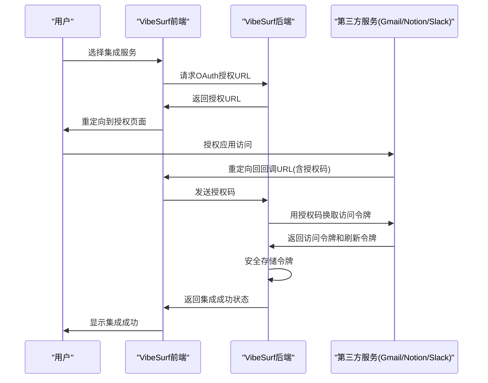
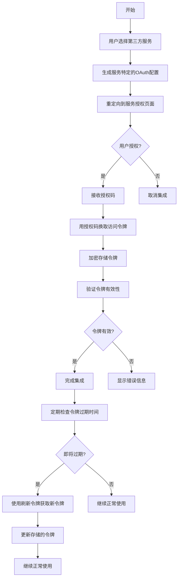
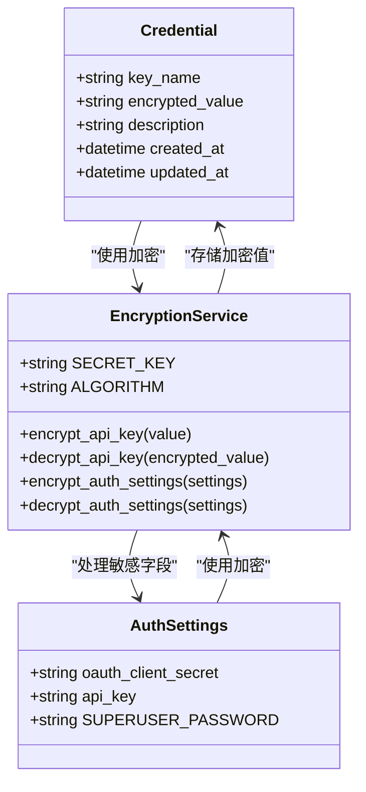
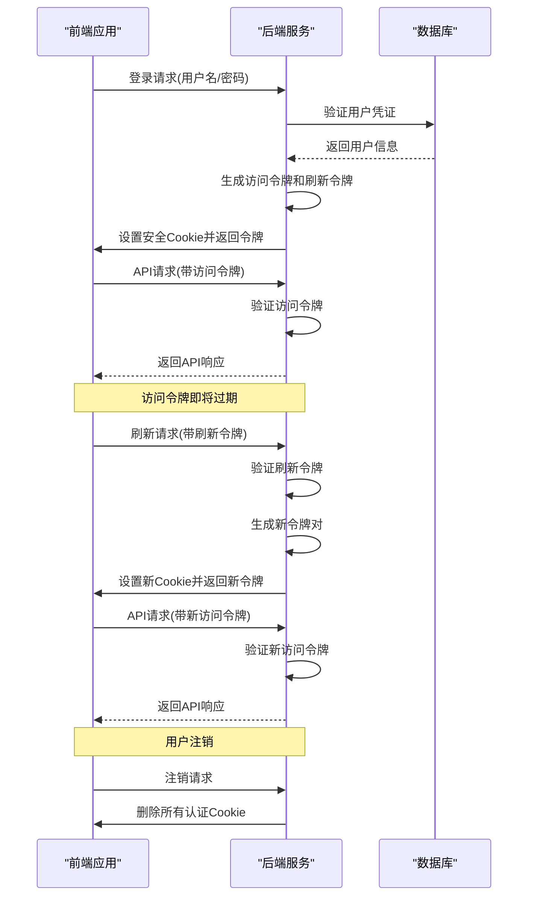
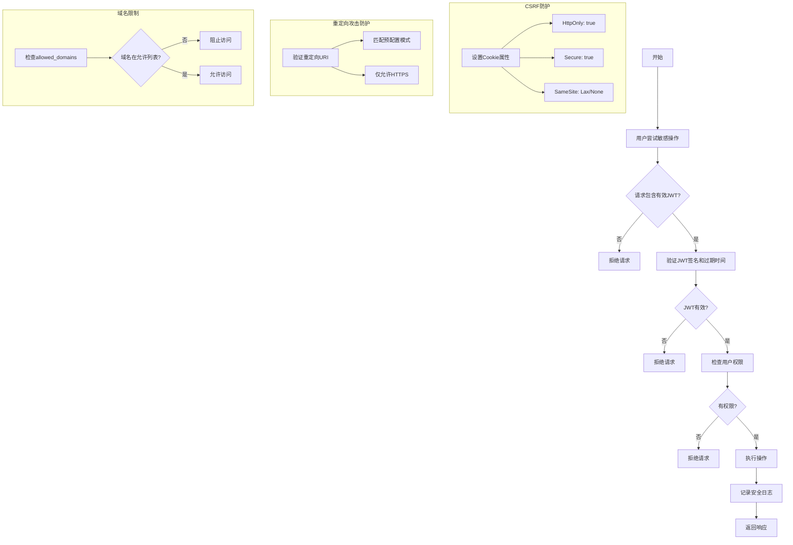
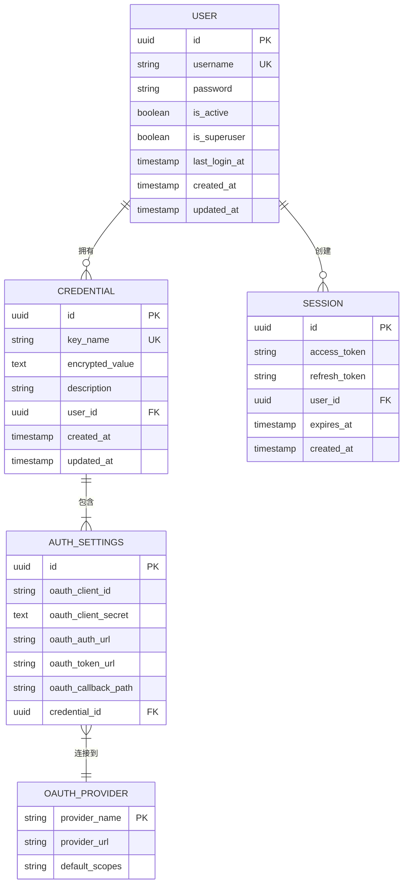

# 认证机制

<cite>
**本文档引用的文件**   
- [authContext.tsx](file://vibe_surf/frontend/src/contexts/authContext.tsx)
- [utils.py](file://vibe_surf/langflow/services/auth/utils.py)
- [login.py](file://vibe_surf/langflow/api/v1/login.py)
- [mcp_encryption.py](file://vibe_surf/langflow/services/auth/mcp_encryption.py)
- [queries.py](file://vibe_surf/backend/database/queries.py)
- [auth.py](file://vibe_surf/langflow/services/settings/auth.py)
- [google_oauth_token.py](file://vibe_surf/langflow/components/google/google_oauth_token.py)
- [authGuard.tsx](file://vibe_surf/frontend/src/components/authorization/authGuard/index.tsx)
- [constants.ts](file://vibe_surf/frontend/src/constants/constants.ts)
</cite>

## 目录
1. [简介](#简介)
2. [OAuth 2.0认证流程](#oauth-20认证流程)
3. [第三方服务令牌管理](#第三方服务令牌管理)
4. [认证凭据的安全存储](#认证凭据的安全存储)
5. [会话管理与令牌刷新](#会话管理与令牌刷新)
6. [安全措施与漏洞防护](#安全措施与漏洞防护)
7. [安全配置最佳实践](#安全配置最佳实践)
8. [结论](#结论)

## 简介

VibeSurf的认证机制基于OAuth 2.0协议实现，为用户提供安全的第三方服务集成能力。系统通过JWT（JSON Web Token）实现用户身份验证，支持自动登录、API密钥和传统用户名/密码认证等多种方式。认证系统设计注重安全性，采用加密存储、安全的Cookie配置和严格的访问控制来保护用户凭据。

系统的核心认证功能由后端的FastAPI服务和前端的React应用协同完成。后端负责处理认证逻辑、令牌生成和数据库交互，而前端负责用户界面展示、令牌存储和API请求的认证头管理。这种分离架构确保了认证流程的安全性和可扩展性。

**Section sources**
- [authContext.tsx](file://vibe_surf/frontend/src/contexts/authContext.tsx#L1-L126)
- [utils.py](file://vibe_surf/langflow/services/auth/utils.py#L1-L584)

## OAuth 2.0认证流程

VibeSurf的OAuth 2.0认证流程遵循标准的授权码模式，为用户提供安全的第三方服务集成。当用户尝试连接Gmail、Notion或Slack等服务时，系统会启动OAuth流程，引导用户到服务提供商的授权页面完成认证。

认证流程从用户在前端界面选择集成服务开始。系统会生成一个包含客户端ID、重定向URI和作用域的授权请求URL。用户被重定向到第三方服务的授权页面，在那里他们可以查看应用请求的权限并决定是否授权。授权成功后，服务提供商会将用户重定向回VibeSurf的回调端点，并附带一个临时的授权码。

后端服务接收到授权码后，会使用客户端密钥和授权码向第三方服务的令牌端点发起请求，交换访问令牌和刷新令牌。这些令牌随后被安全地存储在数据库中，供后续API调用使用。整个流程通过HTTPS加密传输，确保认证信息的安全性。

**Diagram sources **
- [google_oauth_token.py](file://vibe_surf/langflow/components/google/google_oauth_token.py#L1-L90)
- [authGuard.tsx](file://vibe_surf/frontend/src/components/authorization/authGuard/index.tsx#L1-L59)

**Section sources**
- [google_oauth_token.py](file://vibe_surf/langflow/components/google/google_oauth_token.py#L1-L90)
- [authGuard.tsx](file://vibe_surf/frontend/src/components/authorization/authGuard/index.tsx#L1-L59)

## 第三方服务令牌管理

VibeSurf对第三方服务令牌的管理采用分层策略，确保令牌的安全获取、存储和刷新。系统支持多种服务的集成，包括Gmail、Notion、Slack等，每种服务都有特定的认证配置和API调用方式。

令牌获取过程通过专门的组件实现，如GoogleOAuthToken组件。这些组件负责处理服务特定的OAuth流程，包括作用域验证、凭证文件处理和令牌交换。当用户首次连接服务时，系统会引导他们完成授权流程，并将获得的令牌安全地存储在数据库中。令牌存储采用加密方式，确保即使数据库被泄露，攻击者也无法直接获取有效的认证凭据。

令牌刷新机制是系统的重要组成部分，确保长期集成的可用性。系统会监控令牌的过期时间，并在必要时自动使用刷新令牌获取新的访问令牌。这种机制减少了用户需要重新授权的频率，同时保持了高安全性。对于不支持刷新令牌的服务，系统会提示用户重新完成授权流程。

**Diagram sources **
- [queries.py](file://vibe_surf/backend/database/queries.py#L1367-L1405)
- [mcp_encryption.py](file://vibe_surf/langflow/services/auth/mcp_encryption.py#L1-L121)

**Section sources**
- [queries.py](file://vibe_surf/backend/database/queries.py#L1367-L1405)
- [mcp_encryption.py](file://vibe_surf/langflow/services/auth/mcp_encryption.py#L1-L121)

## 认证凭据的安全存储

VibeSurf采用多层次的安全措施来保护用户的认证凭据，确保敏感信息不会以明文形式存储。系统使用Fernet对称加密算法对所有敏感数据进行加密，包括API密钥、OAuth客户端密钥和访问令牌。

凭据存储的核心是加密API密钥功能，该功能使用从环境配置中获取的密钥进行加密操作。当用户存储新的凭据时，系统会先使用`encrypt_api_key`函数对值进行加密，然后将加密后的数据存储在数据库的`encrypted_value`字段中。读取凭据时，系统会调用`decrypt_api_key`函数进行解密，确保只有授权代码才能访问原始数据。

系统还实现了敏感字段的自动加密机制，特别针对OAuth配置中的`oauth_client_secret`和`api_key`字段。`encrypt_auth_settings`和`decrypt_auth_settings`函数负责在存储和检索时自动处理这些字段的加密和解密，为开发者提供了透明的安全层。这种设计确保了即使在配置迁移或数据导出时，敏感信息也能保持加密状态。

**Diagram sources **
- [utils.py](file://vibe_surf/langflow/services/auth/utils.py#L472-L505)
- [mcp_encryption.py](file://vibe_surf/langflow/services/auth/mcp_encryption.py#L18-L55)

**Section sources**
- [utils.py](file://vibe_surf/langflow/services/auth/utils.py#L472-L505)
- [mcp_encryption.py](file://vibe_surf/langflow/services/auth/mcp_encryption.py#L18-L55)

## 会话管理与令牌刷新

VibeSurf的会话管理机制基于JWT和安全的Cookie配置实现，确保用户会话的安全性和持久性。系统使用访问令牌和刷新令牌的双令牌模式，平衡了安全性与用户体验。

当用户成功登录后，系统会生成一对JWT令牌：短期有效的访问令牌（默认1小时）和长期有效的刷新令牌（默认7天）。访问令牌存储在HttpOnly、Secure的Cookie中，防止XSS攻击读取。刷新令牌同样存储在安全的Cookie中，但具有更严格的SameSite和HttpOnly属性。前端应用使用访问令牌进行API调用，而后端通过`get_current_user_by_jwt`函数验证令牌的有效性。

令牌刷新机制通过专门的`/refresh`端点实现。当访问令牌即将过期时，前端会自动向刷新端点发送请求。后端验证刷新令牌的有效性后，会生成新的访问令牌和刷新令牌对，并通过安全的Cookie返回给客户端。这种机制确保了用户无需频繁重新登录，同时保持了高安全性。系统还实现了令牌失效处理，当用户注销时，所有相关Cookie都会被删除。

**Diagram sources **
- [login.py](file://vibe_surf/langflow/api/v1/login.py#L123-L158)
- [authContext.tsx](file://vibe_surf/frontend/src/contexts/authContext.tsx#L80-L97)

**Section sources**
- [login.py](file://vibe_surf/langflow/api/v1/login.py#L123-L158)
- [authContext.tsx](file://vibe_surf/frontend/src/contexts/authContext.tsx#L80-L97)

## 安全措施与漏洞防护

VibeSurf实施了全面的安全措施来防止常见的安全漏洞，包括CSRF攻击、重定向攻击和认证绕过。系统通过安全的Cookie配置、严格的输入验证和多层认证检查来保护用户数据。

针对CSRF攻击，系统采用了多种防御策略。所有敏感操作都要求使用JWT令牌进行认证，而不是依赖Cookie的自动发送。关键的API端点如`/refresh`和`/logout`都要求特定的认证头或Cookie，防止跨站请求伪造。此外，系统使用了严格的SameSite Cookie策略，将访问令牌Cookie设置为"Lax"模式，刷新令牌Cookie设置为"None"模式，有效防止了跨站请求。

对于重定向攻击的防护，系统在OAuth流程中实施了严格的重定向URI验证。所有重定向都必须匹配预配置的URI模式，防止攻击者将用户重定向到恶意网站。系统还实现了安全的会话管理，通过`allowed_domains`配置限制浏览器会话可以访问的域名，防止敏感数据在不受信任的网站上泄露。

**Diagram sources **
- [auth.py](file://vibe_surf/langflow/services/settings/auth.py#L58-L69)
- [browser_use_agent.py](file://vibe_surf/agents/browser_use_agent.py#L316-L356)

**Section sources**
- [auth.py](file://vibe_surf/langflow/services/settings/auth.py#L58-L69)
- [browser_use_agent.py](file://vibe_surf/agents/browser_use_agent.py#L316-L356)

## 安全配置最佳实践

为了确保VibeSurf部署的安全性，建议遵循以下最佳实践配置。这些配置涵盖了从环境变量设置到生产环境部署的各个方面，帮助管理员建立安全的运行环境。

首先，必须正确配置认证相关的环境变量。`LANGFLOW_AUTO_LOGIN`应设置为`false`以禁用自动登录功能，强制所有用户进行身份验证。`LANGFLOW_SECRET_KEY`应设置为一个强随机密钥，用于JWT签名和数据加密。对于生产环境，建议使用外部密钥管理系统来管理这个密钥。

Cookie安全配置至关重要。应确保`REFRESH_SECURE`和`ACCESS_SECURE`设置为`true`，强制Cookie仅通过HTTPS传输。`REFRESH_HTTPONLY`应设置为`true`，防止JavaScript访问刷新令牌。`REFRESH_SAME_SITE`建议设置为`"none"`，但必须与`SECURE`一起使用。这些配置共同构成了防止XSS和CSRF攻击的基础。

对于第三方集成，建议实施最小权限原则。为每个集成配置最必要的作用域，避免请求过多权限。定期审查和轮换OAuth客户端密钥，减少密钥泄露的风险。对于长期运行的集成，应监控令牌使用情况，及时发现异常活动。

**Diagram sources **
- [auth.py](file://vibe_surf/langflow/services/settings/auth.py#L1-L134)
- [constants.ts](file://vibe_surf/frontend/src/constants/constants.ts#L1-L200)

**Section sources**
- [auth.py](file://vibe_surf/langflow/services/settings/auth.py#L1-L134)
- [constants.ts](file://vibe_surf/frontend/src/constants/constants.ts#L1-L200)

## 结论

VibeSurf的认证机制通过OAuth 2.0协议和JWT技术实现了安全、灵活的第三方服务集成。系统采用分层安全策略，从令牌管理到凭据存储，再到会话控制，每个环节都经过精心设计以保护用户数据。

核心优势在于其平衡了安全性和用户体验。双令牌模式确保了用户无需频繁重新登录，而加密存储和安全的Cookie配置则提供了强大的数据保护。系统还提供了丰富的配置选项，允许管理员根据具体需求调整安全策略。

未来可以进一步增强的方面包括引入多因素认证、实现更精细的权限控制和增强审计日志功能。这些改进将进一步提升系统的安全性，满足更严格的安全合规要求。