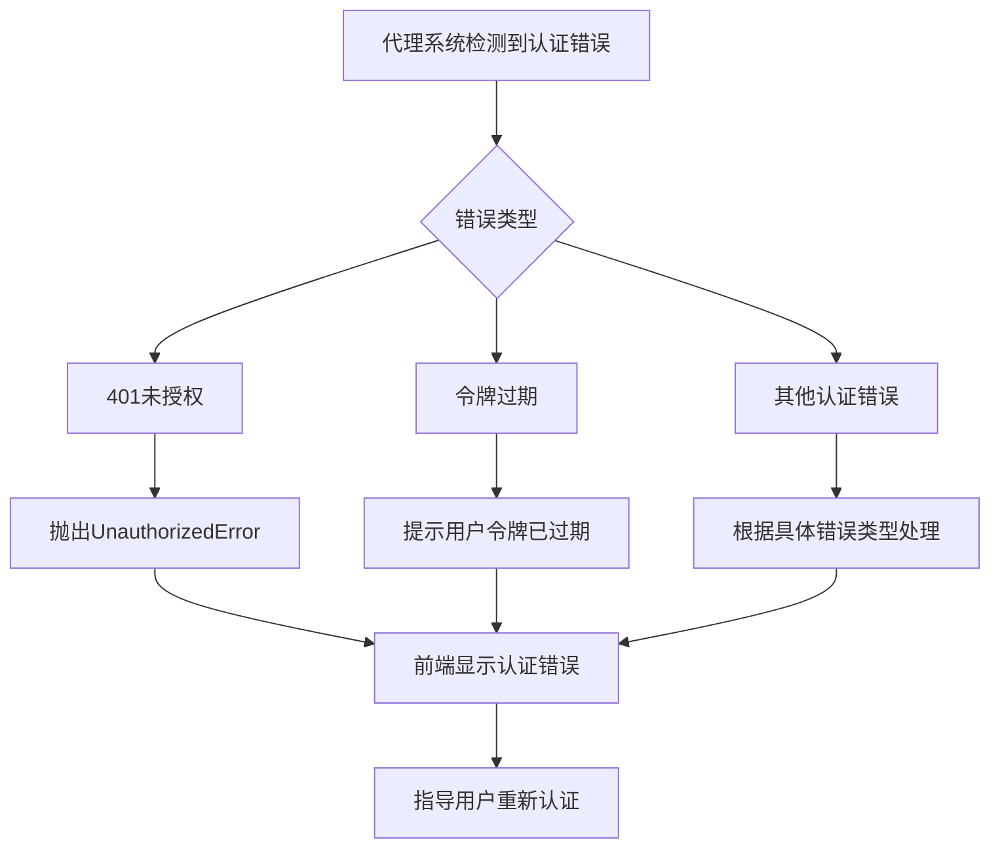
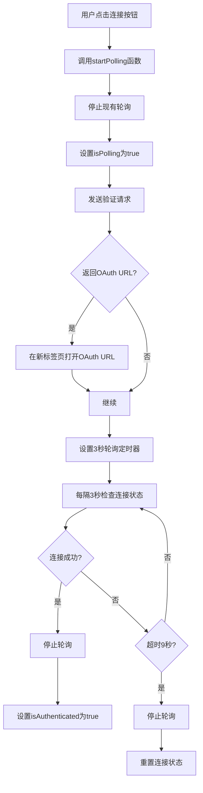
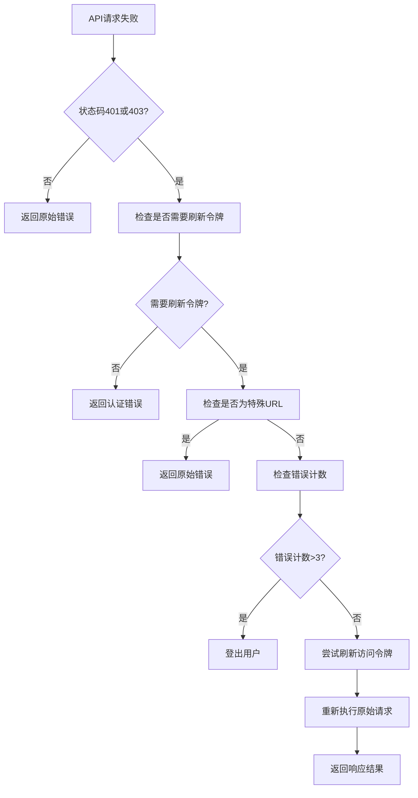
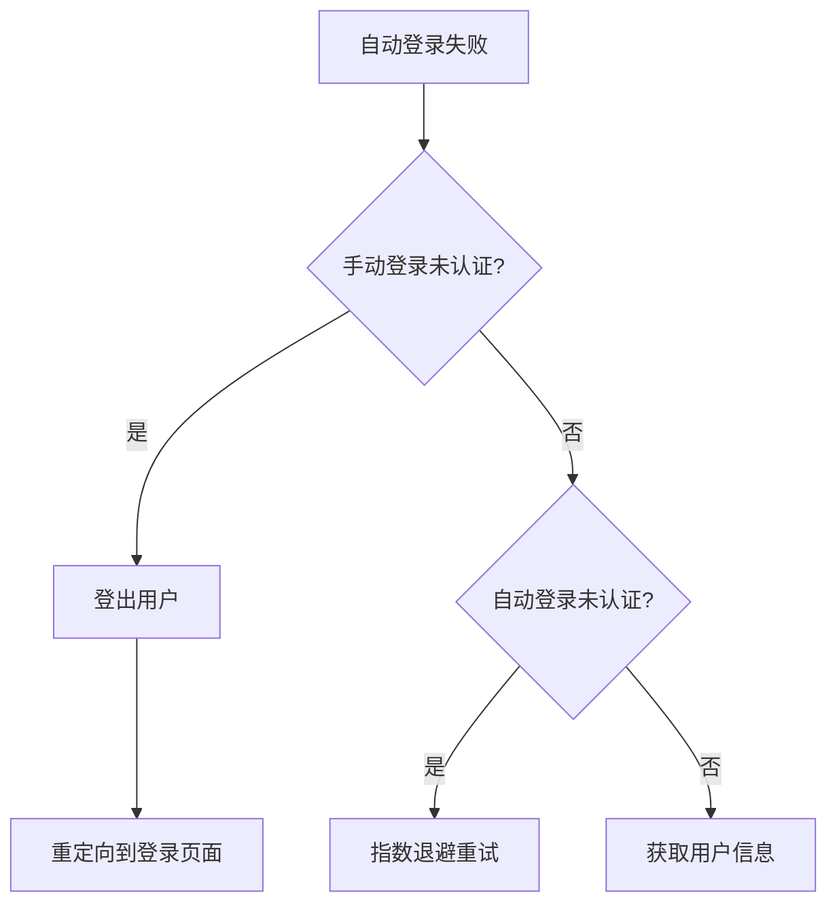

# 认证错误处理

<cite>
**本文档引用的文件**
- [authContext.tsx](file://vibe_surf/frontend/src/contexts/authContext.tsx)
- [connectionComponent/index.tsx](file://vibe_surf/frontend/src/components/core/parameterRenderComponent/components/connectionComponent/index.tsx)
- [NodeStatus/index.tsx](file://vibe_surf/frontend/src/CustomNodes/GenericNode/components/NodeStatus/index.tsx)
- [use-get-autologin.ts](file://vibe_surf/frontend/src/controllers/API/queries/auth/use-get-autologin.ts)
- [api.tsx](file://vibe_surf/frontend/src/controllers/API/api.tsx)
- [use-post-template-value.ts](file://vibe_surf/frontend/src/controllers/API/queries/nodes/use-post-template-value.ts)
- [vibe_surf_prompt.py](file://vibe_surf/agents/prompts/vibe_surf_prompt.py)
- [exceptions.py](file://vibe_surf/langflow/services/store/exceptions.py)
- [utils.py](file://vibe_surf/langflow/services/auth/utils.py)
- [authStore.ts](file://vibe_surf/frontend/src/stores/authStore.ts)
- [alertStore.ts](file://vibe_surf/frontend/src/stores/alertStore.ts)
</cite>

## 目录
1. [简介](#简介)
2. [前端连接组件认证状态处理](#前端连接组件认证状态处理)
3. [代理系统认证错误响应协议](#代理系统认证错误响应协议)
4. [轮询机制与实时反馈](#轮询机制与实时反馈)
5. [错误处理流程代码示例](#错误处理流程代码示例)
6. [用户体验最佳实践](#用户体验最佳实践)
7. [结论](#结论)

## 简介
VibeSurf系统实现了一套完整的认证错误处理机制，涵盖前端连接组件的状态检测、代理系统的错误响应协议以及轮询机制的实时反馈。本系统通过前端组件与后端服务的协同工作，确保用户能够清晰地了解认证状态变化，并获得明确的指导信息来解决认证问题。

系统主要包含三个核心部分：前端连接组件负责检测和显示'validated'、'error'和'loading'状态；代理系统在遇到401未授权、令牌过期等认证错误时遵循特定的响应协议；轮询机制用于检查连接状态并提供实时反馈。这些组件共同构成了一个健壮的认证错误处理体系，提升了用户体验和系统的可靠性。

**Section sources**
- [authContext.tsx](file://vibe_surf/frontend/src/contexts/authContext.tsx#L1-L126)
- [connectionComponent/index.tsx](file://vibe_surf/frontend/src/components/core/parameterRenderComponent/components/connectionComponent/index.tsx#L1-L248)

## 前端连接组件认证状态处理

VibeSurf的前端连接组件实现了对认证状态的全面检测和响应机制。组件通过`isAuthenticated`状态变量来跟踪当前的认证状态，并根据不同的状态值显示相应的UI元素。

当用户选择一个连接选项时，组件会初始化`isAuthenticated`状态。如果`connectionLink`的值为"validated"，则将`isAuthenticated`设置为true，表示连接已验证；如果`connectionLink`的值为"error"，则将链接状态设置为"error"，表示连接出现错误。

```mermaid
flowchart TD
A[用户选择连接选项] --> B{是否有选中选项?}
B --> |否| C[设置isAuthenticated为false]
B --> |是| D[检查connectionLink值]
D --> E{connectionLink == "validated"?}
E --> |是| F[设置isAuthenticated为true]
E --> |否| G{connectionLink == "error"?}
G --> |是| H[设置link为"error"]
G --> |否| I[保持当前状态]
```

**Diagram sources**
- [connectionComponent/index.tsx](file://vibe_surf/frontend/src/components/core/parameterRenderComponent/components/connectionComponent/index.tsx#L77-L94)

组件还实现了连接按钮的点击处理逻辑。当用户点击连接按钮时，系统会打开一个新的标签页进行认证，并启动轮询机制来检查连接状态。

**Section sources**
- [connectionComponent/index.tsx](file://vibe_surf/frontend/src/components/core/parameterRenderComponent/components/connectionComponent/index.tsx#L97-L115)

## 代理系统认证错误响应协议

VibeSurf的代理系统在遇到认证错误时遵循严格的响应协议。当系统检测到401未授权、令牌过期等认证错误时，会立即通知用户需要完成认证或登录。

根据`vibe_surf_prompt.py`文件中的定义，代理系统的认证错误响应协议包括以下要点：
- **直接用户通知**：当遇到认证错误时，立即通知用户需要完成认证或登录
- **清晰指导**：提供明确的指示，告诉用户需要做什么来解决认证问题
- **不强制继续**：在需要认证时，不尝试强制执行其他操作或变通方法
- **简单语言**：使用直白的语言，如"Please complete authentication/login for [platform name] first"或"需要先完成[平台名称]的登录验证"

后端服务通过`exceptions.py`文件定义了各种自定义异常，包括`UnauthorizedError`（401未授权）、`ForbiddenError`（403禁止访问）和`APIKeyError`（API密钥错误）。这些异常在认证失败时被抛出，确保错误信息能够正确传递到前端。



**Diagram sources**
- [vibe_surf_prompt.py](file://vibe_surf/agents/prompts/vibe_surf_prompt.py#L139-L143)
- [exceptions.py](file://vibe_surf/langflow/services/store/exceptions.py#L1-L25)

## 轮询机制与实时反馈

VibeSurf系统实现了轮询机制来检查连接状态并提供实时反馈。当用户启动连接过程时，系统会启动一个定时器，定期检查连接状态。

轮询机制的核心实现位于`NodeStatus/index.tsx`文件中。当用户点击连接按钮时，`startPolling`函数会被调用，该函数会：

1. 停止任何现有的轮询
2. 设置`isPolling`状态为true
3. 调用`mutateTemplate`函数发送验证请求
4. 如果返回的OAuth URL有效，则在新标签页中打开
5. 设置一个定时器，每隔3秒检查一次连接状态
6. 设置一个超时定时器，在9秒后停止轮询，防止无限轮询



**Diagram sources**
- [NodeStatus/index.tsx](file://vibe_surf/frontend/src/CustomNodes/GenericNode/components/NodeStatus/index.tsx#L106-L155)

轮询机制还包括错误处理和超时保护。如果在9秒内没有完成连接，系统会自动停止轮询，防止用户陷入无限等待。这种设计确保了用户体验的流畅性，即使认证过程出现问题，用户也能得到及时的反馈。

**Section sources**
- [NodeStatus/index.tsx](file://vibe_surf/frontend/src/CustomNodes/GenericNode/components/NodeStatus/index.tsx#L106-L155)
- [connectionComponent/index.tsx](file://vibe_surf/frontend/src/components/core/parameterRenderComponent/components/connectionComponent/index.tsx#L106-L137)

## 错误处理流程代码示例

VibeSurf系统的错误处理流程通过多个组件协同工作实现。前端API拦截器在`api.tsx`文件中定义了全局的错误处理逻辑。

当系统检测到401或403认证错误时，会执行以下流程：



**Diagram sources**
- [api.tsx](file://vibe_surf/frontend/src/controllers/API/api.tsx#L71-L105)

具体实现中，系统会检查认证错误计数。如果错误计数超过3次，系统会自动登出用户，防止无限重试循环。这种机制保护了系统资源，同时也为用户提供了一个清晰的错误恢复路径。

自动登录功能在`use-get-autologin.ts`文件中实现。当自动登录失败时，系统会根据当前状态决定是重定向到登录页面还是进行重试。



**Diagram sources**
- [use-get-autologin.ts](file://vibe_surf/frontend/src/controllers/API/queries/auth/use-get-autologin.ts#L70-L106)

**Section sources**
- [api.tsx](file://vibe_surf/frontend/src/controllers/API/api.tsx#L71-L105)
- [use-get-autologin.ts](file://vibe_surf/frontend/src/controllers/API/queries/auth/use-get-autologin.ts#L70-L106)

## 用户体验最佳实践

VibeSurf系统在认证错误处理方面采用了多项用户体验最佳实践，确保用户能够轻松理解和解决认证问题。

### 友好的错误提示
系统通过`alertStore.ts`管理各种通知和错误消息。当发生认证错误时，系统会显示临时通知，5秒后自动消失，避免干扰用户操作。通知系统还支持错误、通知和成功三种类型，使用不同的视觉样式区分消息的重要性。

### 便捷的重新认证流程
系统设计了便捷的重新认证流程。当连接失败时，用户只需点击连接按钮即可重新启动认证过程，无需手动导航到其他页面。OAuth认证在新标签页中打开，用户完成认证后返回原页面，连接状态会自动更新。

### 状态可视化
系统通过直观的视觉元素显示连接状态：
- **已验证**：显示连接图标，背景为绿色
- **未连接**：显示警告三角图标，背景为黄色
- **错误**：显示错误图标，背景为红色
- **加载中**：显示旋转的加载图标

### 错误恢复机制
系统实现了智能的错误恢复机制：
- 临时性错误会自动重试，使用指数退避策略
- 持久性错误会引导用户手动重新认证
- 多次失败后会自动登出，防止无限循环

这些最佳实践共同创造了一个用户友好的认证体验，即使在出现问题时，用户也能清楚地了解状况并采取正确的行动。

**Section sources**
- [alertStore.ts](file://vibe_surf/frontend/src/stores/alertStore.ts#L1-L107)
- [NodeStatus/index.tsx](file://vibe_surf/frontend/src/CustomNodes/GenericNode/components/NodeStatus/index.tsx#L332-L330)
- [connectionComponent/index.tsx](file://vibe_surf/frontend/src/components/core/parameterRenderComponent/components/connectionComponent/index.tsx#L199-L223)

## 结论
VibeSurf的认证错误处理机制通过前端连接组件、代理系统响应协议和轮询机制的协同工作，实现了健壮且用户友好的认证体验。系统能够有效检测和响应'validated'、'error'和'loading'状态的变化，为用户提供清晰的认证指导。

代理系统在遇到401未授权、令牌过期等认证错误时，遵循明确的响应协议，立即通知用户并提供解决指导。轮询机制确保了连接状态的实时反馈，同时通过超时保护防止无限等待。

通过友好的错误提示和便捷的重新认证流程，系统大大提升了用户体验。这些设计实践不仅解决了技术层面的认证问题，更重要的是为用户提供了清晰、直观的操作指引，使认证过程更加顺畅和可靠。