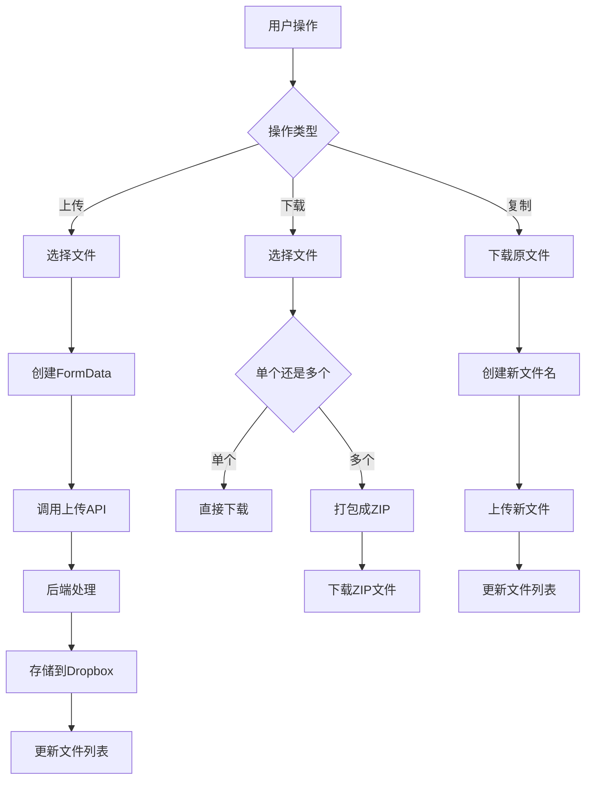
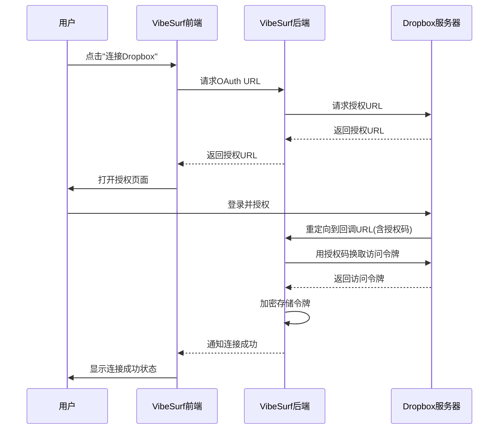
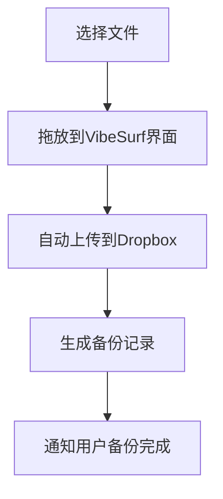
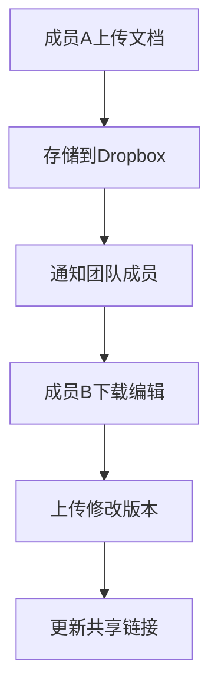
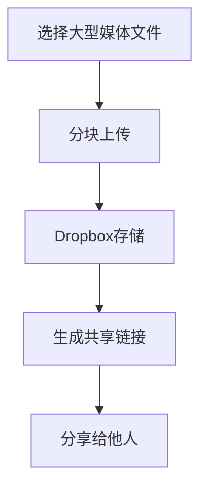

# Dropbox集成

<cite>
**本文档引用的文件**   
- [dropbox_compnent.py](file://vibe_surf/workflows/Integrations/dropbox_compnent.py)
- [composio_base.py](file://vibe_surf/langflow/base/composio/composio_base.py)
- [composio.py](file://vibe_surf/backend/api/composio.py)
- [use-duplicate-file.ts](file://vibe_surf/frontend/src/controllers/API/queries/file-management/use-duplicate-file.ts)
- [use-get-download-files.ts](file://vibe_surf/frontend/src/controllers/API/queries/file-management/use-get-download-files.ts)
- [use-post-upload-file.ts](file://vibe_surf/frontend/src/controllers/API/queries/file-management/use-post-upload-file.ts)
- [authModal.tsx](file://vibe_surf/frontend/src/modals/authModal/index.tsx)
- [settings-integrations.js](file://vibe_surf/chrome_extension/scripts/settings-integrations.js)
- [Dropbox.jsx](file://vibe_surf/frontend/src/icons/Dropbox/Dropbox.jsx)
- [v006_add_credentials_table.sql](file://vibe_surf/backend/database/migrations/v006_add_credentials_table.sql)
- [models.py](file://vibe_surf/backend/database/models.py)
</cite>

## 目录
1. [简介](#简介)
2. [功能特性](#功能特性)
3. [配置指南](#配置指南)
4. [OAuth 2.0认证流程](#oauth-20认证流程)
5. [应用权限](#应用权限)
6. [常见用例示例](#常见用例示例)
7. [API调用模式](#api调用模式)
8. [数据格式](#数据格式)
9. [错误处理策略](#错误处理策略)
10. [大文件处理与冲突解决](#大文件处理与冲突解决)

## 简介
VibeSurf的Dropbox集成功能通过Composio平台实现，为用户提供文件上传、下载、同步和共享链接管理等核心功能。该集成支持OAuth 2.0认证，确保用户数据安全，并通过前端和后端组件的协同工作，实现了无缝的文件管理体验。Dropbox集成作为VibeSurf生态系统的一部分，允许用户在不同应用场景下高效地处理文件，如文件备份、协作文档管理和媒体文件处理。

**Section sources**
- [dropbox_compnent.py](file://vibe_surf/workflows/Integrations/dropbox_compnent.py#L1-L12)
- [composio_base.py](file://vibe_surf/langflow/base/composio/composio_base.py#L980-L1179)

## 功能特性
VibeSurf的Dropbox集成提供了全面的文件管理功能，包括文件上传、下载、复制和批量操作。用户可以通过前端界面直接与Dropbox账户交互，实现文件的增删改查。具体功能包括：
- **文件上传**：支持单个文件上传，前端通过FormData对象将文件发送到后端API。
- **文件下载**：支持单个或多个文件下载，多个文件会被打包成ZIP格式。
- **文件复制**：通过先下载再上传的方式实现文件复制功能。
- **文件管理**：支持文件重命名、删除和替换等操作。

这些功能通过前后端的紧密协作实现，前端负责用户交互和文件操作，后端负责与Dropbox API的通信和数据处理。

**Diagram sources**
- [use-post-upload-file.ts](file://vibe_surf/frontend/src/controllers/API/queries/file-management/use-post-upload-file.ts#L1-L93)
- [use-get-download-files.ts](file://vibe_surf/frontend/src/controllers/API/queries/file-management/use-get-download-files.ts#L1-L46)
- [use-duplicate-file.ts](file://vibe_surf/frontend/src/controllers/API/queries/file-management/use-duplicate-file.ts#L1-L63)

## 配置指南
要配置VibeSurf的Dropbox集成，用户需要完成以下步骤：
1. 在VibeSurf的设置界面中找到Dropbox集成选项。
2. 点击"Connect"按钮启动OAuth 2.0认证流程。
3. 系统会重定向到Dropbox的授权页面，用户需要登录并授权VibeSurf访问其Dropbox账户。
4. 授权完成后，系统会自动保存连接状态，用户即可开始使用Dropbox功能。

后端通过Composio平台管理认证状态和API密钥，所有敏感信息都经过加密存储，确保用户数据安全。

**Section sources**
- [authModal.tsx](file://vibe_surf/frontend/src/modals/authModal/index.tsx#L1-L346)
- [settings-integrations.js](file://vibe_surf/chrome_extension/scripts/settings-integrations.js#L657-L704)

## OAuth 2.0认证流程
VibeSurf的Dropbox集成使用OAuth 2.0协议进行用户认证，确保安全地访问用户的Dropbox账户。认证流程如下：
1. 用户在VibeSurf界面点击连接Dropbox按钮。
2. 前端调用后端API生成OAuth授权URL。
3. 系统打开新窗口或标签页，重定向到Dropbox的授权页面。
4. 用户登录Dropbox并授权VibeSurf访问其账户。
5. Dropbox重定向回VibeSurf的回调URL，并附带授权码。
6. VibeSurf后端使用授权码换取访问令牌。
7. 访问令牌被安全存储，用于后续的API调用。

整个流程中，用户的Dropbox密码不会暴露给VibeSurf，确保了账户安全。

**Diagram sources**
- [composio.py](file://vibe_surf/backend/api/composio.py#L611-L810)
- [composio_base.py](file://vibe_surf/langflow/base/composio/composio_base.py#L980-L1179)

## 应用权限
VibeSurf的Dropbox集成遵循最小权限原则，仅请求必要的权限来实现功能。具体权限包括：
- **文件读取权限**：用于下载文件、获取文件列表和读取文件元数据。
- **文件写入权限**：用于上传新文件和修改现有文件。
- **文件管理权限**：用于删除文件、重命名文件和创建文件夹。

这些权限在用户授权时明确列出，用户可以清楚地了解VibeSurf将如何使用其Dropbox账户。后端通过Composio平台管理这些权限，确保只在用户授权的范围内操作。

**Section sources**
- [dropbox_compnent.py](file://vibe_surf/workflows/Integrations/dropbox_compnent.py#L1-L12)
- [composio_base.py](file://vibe_surf/langflow/base/composio/composio_base.py#L980-L1179)

## 常见用例示例
### 文件备份
用户可以使用VibeSurf的Dropbox集成自动备份重要文件。通过简单的拖放操作，用户可以将本地文件上传到Dropbox，确保数据安全。

### 协作文档管理
团队成员可以通过VibeSurf共享和协作编辑文档。每个成员都可以上传最新版本的文档，系统会自动同步到Dropbox，确保所有人访问的是最新版本。

### 媒体文件处理
用户可以使用VibeSurf处理大型媒体文件，如视频和音频。系统支持大文件的分块上传和下载，确保传输的可靠性。

**Diagram sources**
- [use-post-upload-file.ts](file://vibe_surf/frontend/src/controllers/API/queries/file-management/use-post-upload-file.ts#L1-L93)
- [use-get-download-files.ts](file://vibe_surf/frontend/src/controllers/API/queries/file-management/use-get-download-files.ts#L1-L46)

## API调用模式
VibeSurf的Dropbox集成采用RESTful API调用模式，前后端通过标准化的HTTP请求进行通信。主要API端点包括：
- **文件上传**：`POST /api/files`，使用multipart/form-data格式上传文件。
- **文件下载**：`GET /api/files/{id}`，下载单个文件；`POST /api/files/batch/`，批量下载文件。
- **文件列表**：`GET /api/files`，获取文件列表。
- **文件删除**：`DELETE /api/files/{id}`，删除指定文件。

所有API调用都经过身份验证，确保只有授权用户可以访问其文件。

**Section sources**
- [use-post-upload-file.ts](file://vibe_surf/frontend/src/controllers/API/queries/file-management/use-post-upload-file.ts#L1-L93)
- [use-get-download-files.ts](file://vibe_surf/frontend/src/controllers/API/queries/file-management/use-get-download-files.ts#L1-L46)

## 数据格式
VibeSurf的Dropbox集成使用标准的数据格式进行数据交换：
- **请求数据**：使用JSON格式传递元数据，文件数据使用multipart/form-data格式。
- **响应数据**：使用JSON格式返回操作结果，包含状态码、消息和相关数据。
- **文件元数据**：包含文件ID、名称、大小、类型、创建时间和修改时间等信息。

这种标准化的数据格式确保了前后端之间的兼容性和可维护性。

**Section sources**
- [models.py](file://vibe_surf/backend/database/models.py#L1-L200)
- [use-post-upload-file.ts](file://vibe_surf/frontend/src/controllers/API/queries/file-management/use-post-upload-file.ts#L1-L93)

## 错误处理策略
VibeSurf的Dropbox集成实现了全面的错误处理策略，确保系统的稳定性和用户体验：
- **前端错误处理**：捕获网络错误和用户输入错误，向用户显示友好的错误消息。
- **后端错误处理**：捕获API调用错误和数据库操作错误，记录详细日志并返回适当的HTTP状态码。
- **重试机制**：对于临时性错误（如网络超时），系统会自动重试操作。
- **降级策略**：当Dropbox服务不可用时，系统会提示用户并建议稍后重试。

这些策略确保了即使在异常情况下，系统也能提供良好的用户体验。

**Section sources**
- [use-post-upload-file.ts](file://vibe_surf/frontend/src/controllers/API/queries/file-management/use-post-upload-file.ts#L57-L67)
- [composio.py](file://vibe_surf/backend/api/composio.py#L623-L625)

## 大文件处理与冲突解决
### 大文件处理
对于大文件的处理，VibeSurf采用分块上传和下载策略：
- **分块上传**：将大文件分割成多个小块，逐个上传，最后在服务器端合并。
- **进度显示**：实时显示上传和下载进度，让用户了解操作状态。
- **断点续传**：支持中断后继续上传或下载，避免重复传输。

### 冲突解决
当多个用户同时编辑同一文件时，系统采用以下策略解决冲突：
- **版本控制**：为每个文件维护版本历史，用户可以查看和恢复到之前的版本。
- **最后写入优先**：默认情况下，最后保存的版本成为最新版本。
- **手动合并**：对于重要文件，系统会提示用户手动合并不同版本的更改。

这些策略确保了大文件处理的效率和多用户协作的可靠性。

**Section sources**
- [use-post-upload-file.ts](file://vibe_surf/frontend/src/controllers/API/queries/file-management/use-post-upload-file.ts#L42-L53)
- [use-get-download-files.ts](file://vibe_surf/frontend/src/controllers/API/queries/file-management/use-get-download-files.ts#L18-L46)