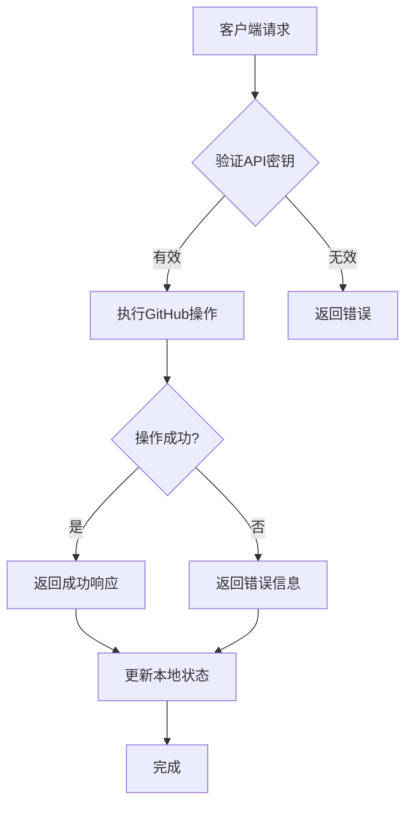
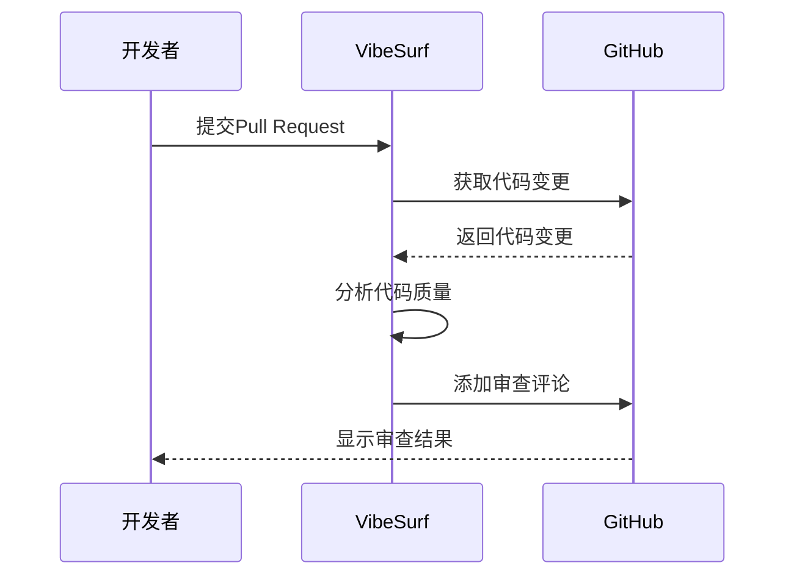
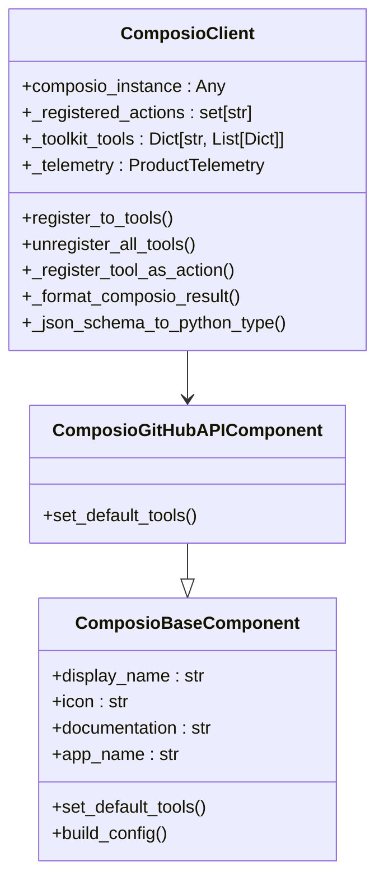

# GitHub集成

<cite>
**本文档引用的文件**   
- [github_composio.py](file://vibe_surf/langflow/components/composio/github_composio.py)
- [composio_base.py](file://vibe_surf/langflow/base/composio/composio_base.py)
- [composio.py](file://vibe_surf/backend/api/composio.py)
- [composio_client.py](file://vibe_surf/tools/composio_client.py)
- [gitextractor.py](file://vibe_surf/langflow/components/git/gitextractor.py)
- [api.tsx](file://vibe_surf/frontend/src/controllers/API/api.tsx)
- [models.py](file://vibe_surf/backend/database/models.py)
- [queries.py](file://vibe_surf/backend/database/queries.py)
</cite>

## 目录
1. [简介](#简介)
2. [功能特性](#功能特性)
3. [配置指南](#配置指南)
4. [API调用模式与数据格式](#api调用模式与数据格式)
5. [错误处理策略](#错误处理策略)
6. [常见用例](#常见用例)
7. [架构与实现](#架构与实现)
8. [总结](#总结)

## 简介
VibeSurf通过Composio平台实现了强大的GitHub集成，为用户提供了一套完整的仓库管理、Pull Request操作、问题跟踪和CI/CD集成解决方案。该集成允许用户通过API密钥或OAuth应用权限安全地连接到GitHub账户，从而在VibeSurf工作流中自动化各种开发任务。集成支持代码审查自动化、项目管理和开发工作流等常见用例，极大地提升了开发效率。

## 功能特性
VibeSurf的GitHub集成提供了全面的功能集，涵盖了软件开发的各个方面：

### 仓库管理
- **仓库信息获取**：通过`get_repository_info`方法获取仓库的基本信息，包括名称、URL、默认分支、远程URL、最后提交信息和分支列表。
- **统计信息**：通过`get_statistics`方法获取仓库的文件数量、总大小、代码行数、二进制文件数量和目录数量等统计信息。
- **目录结构**：通过`get_directory_structure`方法获取仓库的完整目录结构，便于了解项目布局。
- **文件内容**：通过`get_files_content`和`get_text_based_file_contents`方法获取仓库中所有文件的内容，支持文本文件和二进制文件的处理。

### Pull Request操作
- **Pull Request创建与管理**：通过Composio工具集，用户可以创建、更新和管理Pull Request，包括添加评论、请求审查和合并操作。
- **代码审查自动化**：集成支持自动化的代码审查流程，可以在Pull Request中自动添加评论和建议。

### 问题跟踪
- **问题创建与管理**：用户可以通过集成创建、更新和关闭GitHub问题，支持添加标签、分配负责人和设置里程碑。
- **问题查询**：支持根据各种条件查询问题，如状态、标签、负责人等。

### CI/CD集成
- **工作流触发**：可以触发GitHub Actions工作流，实现持续集成和持续部署。
- **状态监控**：监控CI/CD流水线的状态，获取构建结果和测试报告。

## 配置指南
为了使用VibeSurf的GitHub集成，需要进行以下配置步骤：

### 个人访问令牌设置
1. **生成个人访问令牌**：
   - 登录GitHub账户，进入设置页面。
   - 选择"Developer settings"，然后选择"Personal access tokens"。
   - 点击"Generate new token"，选择适当的权限范围（如repo、workflow等）。
   - 生成令牌并妥善保存。

2. **在VibeSurf中配置**：
   - 在VibeSurf的设置页面，找到GitHub集成配置。
   - 输入生成的个人访问令牌。
   - 保存配置。

### OAuth应用权限设置
1. **创建OAuth应用**：
   - 在GitHub开发者设置中创建一个新的OAuth应用。
   - 配置应用的名称、主页URL和回调URL。
   - 记下生成的客户端ID和客户端密钥。

2. **在VibeSurf中配置**：
   - 在VibeSurf的设置页面，选择OAuth连接方式。
   - 输入OAuth应用的客户端ID和客户端密钥。
   - 点击"Connect"按钮，按照提示完成OAuth授权流程。

## API调用模式与数据格式
VibeSurf的GitHub集成通过Composio平台与GitHub API进行交互，遵循以下调用模式和数据格式：

### API调用模式
- **异步调用**：所有API调用都是异步的，使用`async`和`await`关键字。
- **错误处理**：每个API调用都包含完整的错误处理机制，捕获并处理各种异常情况。
- **重试机制**：对于网络错误和临时性故障，集成实现了重试机制，确保操作的可靠性。

### 数据格式
- **请求数据**：使用JSON格式传递请求参数，包括操作类型、目标仓库、分支名称等。
- **响应数据**：API响应也是JSON格式，包含操作结果、状态码和相关信息。
- **数据模型**：定义了清晰的数据模型，如`ComposioToolkitResponse`、`ComposioToolsResponse`等，确保数据的一致性和可预测性。

**图源**
- [composio.py](file://vibe_surf/backend/api/composio.py#L367-L421)

## 错误处理策略
VibeSurf的GitHub集成实现了全面的错误处理策略，确保系统的稳定性和用户体验：

### 速率限制处理
- **检测速率限制**：通过检查API响应的状态码和头部信息，识别速率限制情况。
- **自动重试**：在检测到速率限制时，系统会自动等待指定时间后重试请求。
- **退避算法**：使用指数退避算法，逐步增加重试间隔，避免对GitHub API造成过大压力。

### 权限管理
- **权限检查**：在执行敏感操作前，系统会检查用户的权限，确保操作的合法性。
- **错误提示**：当权限不足时，系统会返回清晰的错误信息，指导用户如何解决问题。
- **日志记录**：所有权限相关的操作和错误都会被记录到日志中，便于审计和故障排查。

### 通用错误处理
- **异常捕获**：使用try-catch块捕获所有可能的异常，防止程序崩溃。
- **错误分类**：将错误分为网络错误、认证错误、权限错误等类别，便于针对性处理。
- **用户反馈**：向用户提供清晰、友好的错误信息，帮助他们理解问题并采取相应措施。

## 常见用例
VibeSurf的GitHub集成支持多种常见的开发场景，以下是一些典型的用例：

### 代码审查自动化

**图源**
- [github_composio.py](file://vibe_surf/langflow/components/composio/github_composio.py#L4-L12)

### 项目管理
- **自动化任务创建**：当新的问题被创建时，自动创建相应的开发任务。
- **进度同步**：将开发任务的进度同步到GitHub问题中，保持信息的一致性。
- **报告生成**：定期生成项目进度报告，包括已完成的任务、正在进行的任务和待办事项。

### 开发工作流
- **分支管理**：自动化创建和管理开发分支，确保分支命名的一致性。
- **合并策略**：实施严格的合并策略，确保代码质量。
- **版本发布**：自动化版本发布流程，包括创建标签、发布说明和通知团队成员。

## 架构与实现
VibeSurf的GitHub集成基于Composio平台构建，采用了模块化的设计，确保了系统的可扩展性和可维护性。

### 核心组件
- **ComposioBaseComponent**：作为所有Composio集成的基础类，提供了通用的功能和方法。
- **ComposioGitHubAPIComponent**：GitHub集成的具体实现，继承自`ComposioBaseComponent`，实现了GitHub特有的功能。
- **ComposioClient**：负责与Composio平台通信，管理工具注册和API调用。

### 数据流
1. **用户请求**：用户通过VibeSurf界面发起GitHub操作请求。
2. **请求验证**：系统验证用户的认证信息和权限。
3. **API调用**：通过Composio平台调用GitHub API执行具体操作。
4. **结果处理**：处理API响应，更新本地状态，并向用户反馈结果。

**图源**
- [github_composio.py](file://vibe_surf/langflow/components/composio/github_composio.py#L4-L12)
- [composio_client.py](file://vibe_surf/tools/composio_client.py#L39-L458)

## 总结
VibeSurf的GitHub集成通过Composio平台提供了强大而灵活的功能，涵盖了仓库管理、Pull Request操作、问题跟踪和CI/CD集成等多个方面。通过详细的配置指南和全面的错误处理策略，用户可以轻松地将GitHub集成到自己的开发工作流中，提高开发效率和代码质量。无论是个人开发者还是团队，都能从这一集成中受益，实现更加高效和自动化的开发流程。