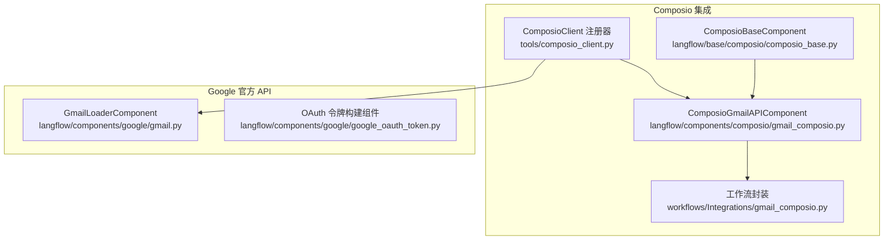
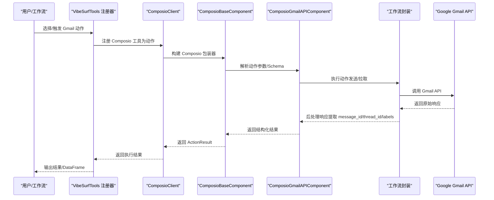
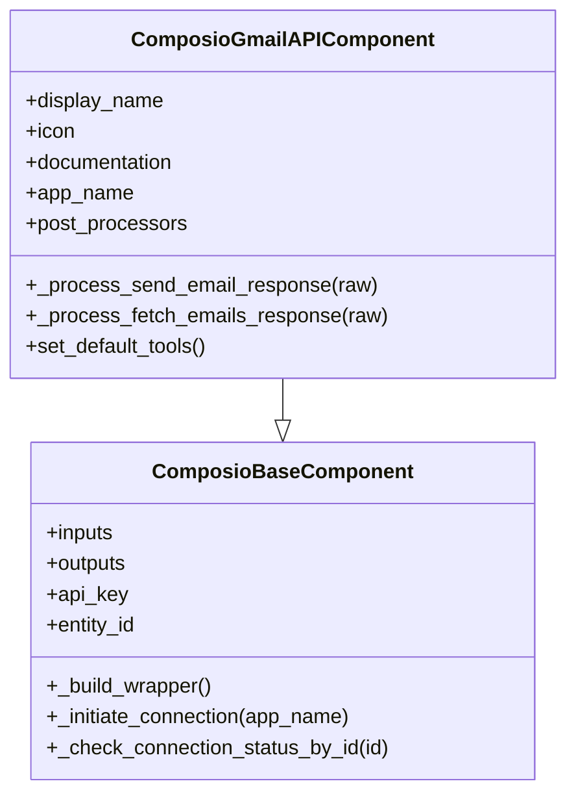
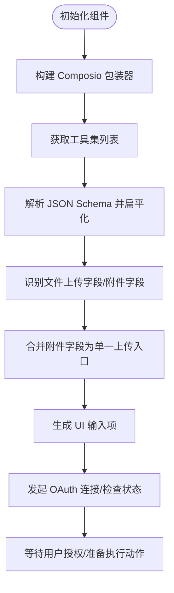
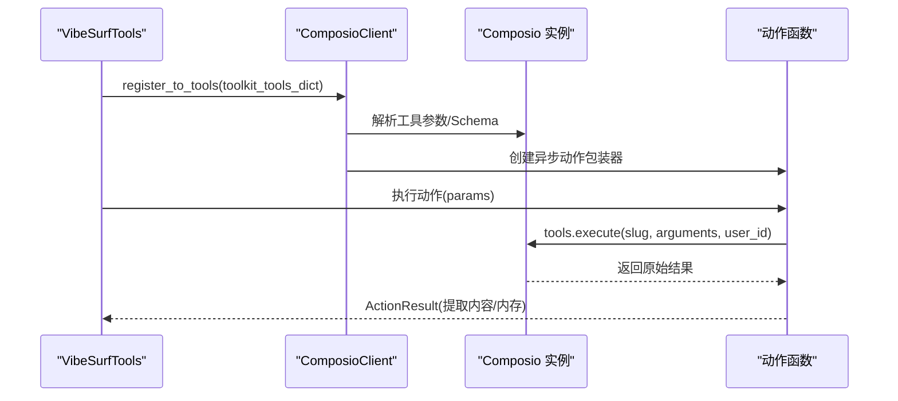
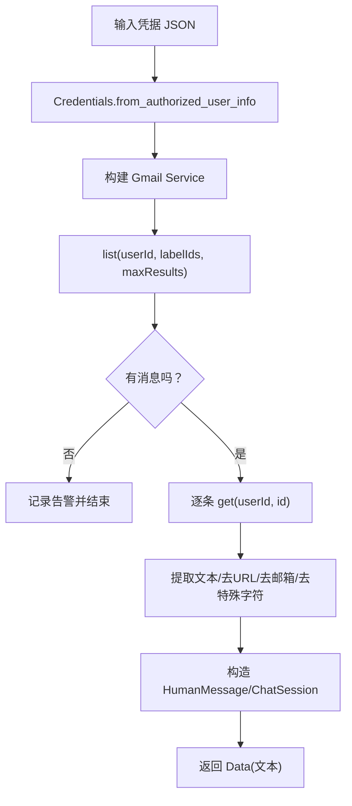
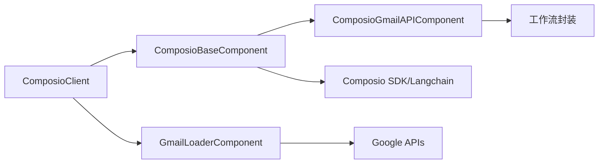

# Gmail集成

<cite>
**本文引用的文件**
- [vibe_surf/langflow/components/composio/gmail_composio.py](file://vibe_surf/langflow/components/composio/gmail_composio.py)
- [vibe_surf/langflow/base/composio/composio_base.py](file://vibe_surf/langflow/base/composio/composio_base.py)
- [vibe_surf/tools/composio_client.py](file://vibe_surf/tools/composio_client.py)
- [vibe_surf/langflow/components/google/gmail.py](file://vibe_surf/langflow/components/google/gmail.py)
- [vibe_surf/langflow/components/google/google_oauth_token.py](file://vibe_surf/langflow/components/google/google_oauth_token.py)
- [vibe_surf/workflows/Integrations/gmail_composio.py](file://vibe_surf/workflows/Integrations/gmail_composio.py)
- [.env.example](file://.env.example)
</cite>

## 目录
1. [简介](#简介)
2. [项目结构](#项目结构)
3. [核心组件](#核心组件)
4. [架构总览](#架构总览)
5. [详细组件分析](#详细组件分析)
6. [依赖关系分析](#依赖关系分析)
7. [性能与配额限制](#性能与配额限制)
8. [故障排查指南](#故障排查指南)
9. [结论](#结论)
10. [附录：常见用例与示例路径](#附录常见用例与示例路径)

## 简介
本文件系统性梳理 VibeSurf 的 Gmail 集成实现，覆盖以下方面：
- 功能特性：邮件发送、接收、标签管理、附件处理
- 配置指南：OAuth 2.0 认证流程与权限范围
- 常见用例：自动化邮件响应、邮件摘要生成、日程安排
- API 调用模式、数据格式与错误处理机制
- 配额限制与重试策略建议

说明：当前仓库同时提供了两种 Gmail 集成路径：
- 基于 Composio 工具集的 Gmail 组件（推荐用于自动化动作）
- 基于 Google 官方 Gmail API 的加载器组件（兼容旧版）

## 项目结构
围绕 Gmail 的关键文件组织如下：
- Composio 集成
  - 组件基类：langflow/base/composio/composio_base.py
  - Gmail 组件：langflow/components/composio/gmail_composio.py
  - 工作流封装：workflows/Integrations/gmail_composio.py
  - 注册与调用：tools/composio_client.py
- Google 官方 API 加载器
  - 组件：langflow/components/google/gmail.py
  - OAuth 令牌构建：langflow/components/google/google_oauth_token.py
- 环境变量：.env.example

图表来源
- [vibe_surf/langflow/base/composio/composio_base.py](file://vibe_surf/langflow/base/composio/composio_base.py#L63-L120)
- [vibe_surf/langflow/components/composio/gmail_composio.py](file://vibe_surf/langflow/components/composio/gmail_composio.py#L1-L39)
- [vibe_surf/workflows/Integrations/gmail_composio.py](file://vibe_surf/workflows/Integrations/gmail_composio.py#L1-L39)
- [vibe_surf/tools/composio_client.py](file://vibe_surf/tools/composio_client.py#L1-L120)
- [vibe_surf/langflow/components/google/gmail.py](file://vibe_surf/langflow/components/google/gmail.py#L1-L70)
- [vibe_surf/langflow/components/google/google_oauth_token.py](file://vibe_surf/langflow/components/google/google_oauth_token.py#L37-L89)

章节来源
- [vibe_surf/langflow/base/composio/composio_base.py](file://vibe_surf/langflow/base/composio/composio_base.py#L63-L120)
- [vibe_surf/langflow/components/composio/gmail_composio.py](file://vibe_surf/langflow/components/composio/gmail_composio.py#L1-L39)
- [vibe_surf/workflows/Integrations/gmail_composio.py](file://vibe_surf/workflows/Integrations/gmail_composio.py#L1-L39)
- [vibe_surf/tools/composio_client.py](file://vibe_surf/tools/composio_client.py#L1-L120)
- [vibe_surf/langflow/components/google/gmail.py](file://vibe_surf/langflow/components/google/gmail.py#L1-L70)
- [vibe_surf/langflow/components/google/google_oauth_token.py](file://vibe_surf/langflow/components/google/google_oauth_token.py#L37-L89)

## 核心组件
- ComposioGmailAPIComponent：封装 Gmail 工具集，提供发送邮件、拉取邮件等动作，并内置响应后处理逻辑
- ComposioBaseComponent：通用 Composio 组件基类，负责动作发现、参数输入生成、OAuth 连接发起与状态检查、附件字段合并等
- ComposioClient：将 Composio 工具动态注册为 VibeSurf 动作，支持参数类型推断、结果格式化与遥测上报
- GmailLoaderComponent（Google 官方）：基于官方 Gmail API 的加载器，支持读取邮件并清洗内容
- OAuth 令牌构建组件：生成或刷新 Google OAuth 令牌，校验作用域

章节来源
- [vibe_surf/langflow/components/composio/gmail_composio.py](file://vibe_surf/langflow/components/composio/gmail_composio.py#L1-L39)
- [vibe_surf/langflow/base/composio/composio_base.py](file://vibe_surf/langflow/base/composio/composio_base.py#L63-L120)
- [vibe_surf/tools/composio_client.py](file://vibe_surf/tools/composio_client.py#L1-L120)
- [vibe_surf/langflow/components/google/gmail.py](file://vibe_surf/langflow/components/google/gmail.py#L1-L70)
- [vibe_surf/langflow/components/google/google_oauth_token.py](file://vibe_surf/langflow/components/google/google_oauth_token.py#L37-L89)

## 架构总览
下图展示 Gmail 集成在系统中的交互关系与调用链路。

图表来源
- [vibe_surf/tools/composio_client.py](file://vibe_surf/tools/composio_client.py#L120-L299)
- [vibe_surf/langflow/base/composio/composio_base.py](file://vibe_surf/langflow/base/composio/composio_base.py#L179-L209)
- [vibe_surf/langflow/components/composio/gmail_composio.py](file://vibe_surf/langflow/components/composio/gmail_composio.py#L1-L39)
- [vibe_surf/workflows/Integrations/gmail_composio.py](file://vibe_surf/workflows/Integrations/gmail_composio.py#L1-L39)

## 详细组件分析

### ComposioGmailAPIComponent
- 角色：封装 Gmail 工具集，定义动作名称映射与后处理
- 关键点：
  - post_processors：对“发送邮件”“拉取邮件”两类动作进行响应后处理，统一输出字段
  - app_name：指定 Composio 工具集为 gmail
- 数据格式：
  - 发送邮件后处理返回包含 message_id、thread_id、label_ids 的字典
  - 拉取邮件后处理返回 messages 列表或原样返回

图表来源
- [vibe_surf/langflow/base/composio/composio_base.py](file://vibe_surf/langflow/base/composio/composio_base.py#L63-L120)
- [vibe_surf/langflow/components/composio/gmail_composio.py](file://vibe_surf/langflow/components/composio/gmail_composio.py#L1-L39)

章节来源
- [vibe_surf/langflow/components/composio/gmail_composio.py](file://vibe_surf/langflow/components/composio/gmail_composio.py#L1-L39)

### ComposioBaseComponent（动作发现与参数输入）
- 动作发现：通过 Composio SDK 获取工具集，解析 JSON Schema，生成 UI 输入项
- 参数处理：扁平化 Schema，识别布尔字段、文件上传字段，合并附件字段
- OAuth 连接：创建/查询 Composio 认证配置，发起 OAuth 重定向链接与连接 ID
- 结果输出：支持 DataFrame/Message/Data 三种输出形态

图表来源
- [vibe_surf/langflow/base/composio/composio_base.py](file://vibe_surf/langflow/base/composio/composio_base.py#L221-L439)
- [vibe_surf/langflow/base/composio/composio_base.py](file://vibe_surf/langflow/base/composio/composio_base.py#L442-L670)
- [vibe_surf/langflow/base/composio/composio_base.py](file://vibe_surf/langflow/base/composio/composio_base.py#L671-L800)

章节来源
- [vibe_surf/langflow/base/composio/composio_base.py](file://vibe_surf/langflow/base/composio/composio_base.py#L221-L439)
- [vibe_surf/langflow/base/composio/composio_base.py](file://vibe_surf/langflow/base/composio/composio_base.py#L442-L670)
- [vibe_surf/langflow/base/composio/composio_base.py](file://vibe_surf/langflow/base/composio/composio_base.py#L671-L800)

### ComposioClient（注册与调用）
- 将 Composio 工具动态注册为 VibeSurf 动作，自动推断参数类型、生成 Pydantic 模型
- 包装 Composio 工具调用，捕获异常并格式化结果
- 支持遥测事件上报（注册/调用/卸载）

图表来源
- [vibe_surf/tools/composio_client.py](file://vibe_surf/tools/composio_client.py#L60-L117)
- [vibe_surf/tools/composio_client.py](file://vibe_surf/tools/composio_client.py#L128-L299)
- [vibe_surf/tools/composio_client.py](file://vibe_surf/tools/composio_client.py#L299-L458)

章节来源
- [vibe_surf/tools/composio_client.py](file://vibe_surf/tools/composio_client.py#L60-L117)
- [vibe_surf/tools/composio_client.py](file://vibe_surf/tools/composio_client.py#L128-L299)
- [vibe_surf/tools/composio_client.py](file://vibe_surf/tools/composio_client.py#L299-L458)

### GmailLoaderComponent（Google 官方 API）
- 用途：基于官方 Gmail API 加载邮件，清洗内容，构造对话会话
- 关键点：
  - 输入：OAuth 2.0 凭据 JSON 字符串、标签过滤、最大结果数
  - 处理：解码 base64 文本、去除回复前缀、提取发件人、按线程聚合
  - 错误处理：刷新失败抛出认证错误；其他异常统一包装

图表来源
- [vibe_surf/langflow/components/google/gmail.py](file://vibe_surf/langflow/components/google/gmail.py#L70-L194)

章节来源
- [vibe_surf/langflow/components/google/gmail.py](file://vibe_surf/langflow/components/google/gmail.py#L1-L70)
- [vibe_surf/langflow/components/google/gmail.py](file://vibe_surf/langflow/components/google/gmail.py#L70-L194)

### OAuth 2.0 认证与权限范围
- OAuth 令牌构建组件：校验作用域格式，从本地 token.json 或客户端密钥文件运行本地服务器完成授权，输出 JSON 凭据
- Gmail 权限范围：可通过作用域字符串传入，例如只读权限等
- Composio OAuth：通过 ComposioBaseComponent 创建/查询认证配置，发起 OAuth 重定向链接，等待用户授权

章节来源
- [vibe_surf/langflow/components/google/google_oauth_token.py](file://vibe_surf/langflow/components/google/google_oauth_token.py#L37-L89)
- [vibe_surf/langflow/base/composio/composio_base.py](file://vibe_surf/langflow/base/composio/composio_base.py#L746-L790)

## 依赖关系分析
- 组件耦合
  - ComposioGmailAPIComponent 依赖 ComposioBaseComponent 提供的动作发现、参数输入与 OAuth 能力
  - ComposioClient 作为注册器，将 Composio 工具注入 VibeSurf 动作体系
  - GmailLoaderComponent 独立使用 Google 官方库，不依赖 Composio
- 外部依赖
  - Composio SDK、Langchain Provider
  - Google APIs（Gmail v1）、OAuth2 库
- 可能的循环依赖
  - 当前结构以 ComposioClient 为桥接，避免了直接循环依赖

图表来源
- [vibe_surf/tools/composio_client.py](file://vibe_surf/tools/composio_client.py#L1-L120)
- [vibe_surf/langflow/base/composio/composio_base.py](file://vibe_surf/langflow/base/composio/composio_base.py#L63-L120)
- [vibe_surf/langflow/components/composio/gmail_composio.py](file://vibe_surf/langflow/components/composio/gmail_composio.py#L1-L39)
- [vibe_surf/workflows/Integrations/gmail_composio.py](file://vibe_surf/workflows/Integrations/gmail_composio.py#L1-L39)
- [vibe_surf/langflow/components/google/gmail.py](file://vibe_surf/langflow/components/google/gmail.py#L1-L70)

章节来源
- [vibe_surf/tools/composio_client.py](file://vibe_surf/tools/composio_client.py#L1-L120)
- [vibe_surf/langflow/base/composio/composio_base.py](file://vibe_surf/langflow/base/composio/composio_base.py#L63-L120)
- [vibe_surf/langflow/components/composio/gmail_composio.py](file://vibe_surf/langflow/components/composio/gmail_composio.py#L1-L39)
- [vibe_surf/workflows/Integrations/gmail_composio.py](file://vibe_surf/workflows/Integrations/gmail_composio.py#L1-L39)
- [vibe_surf/langflow/components/google/gmail.py](file://vibe_surf/langflow/components/google/gmail.py#L1-L70)

## 性能与配额限制
- Composio 工具调用
  - 采用异步包装器，捕获执行时长并上报遥测
  - 对参数模型进行类型推断与默认值处理，减少无效调用
- Google 官方 API
  - Gmail API 有速率限制与配额约束，建议：
    - 合理设置请求频率，避免短时间大量请求
    - 使用分页与批量操作（如批量拉取邮件列表）
    - 缓存常用元数据（如标签、线程信息），减少重复查询
- 重试策略建议
  - 对瞬时网络错误与 5xx 类错误进行指数退避重试
  - 对 401/403（未授权/禁止访问）不再重试，提示重新授权
  - 对 429（速率限制）等待配额恢复后再重试

[本节为通用指导，不直接分析具体文件]

## 故障排查指南
- Composio 相关
  - 缺少 Composio API Key：组件初始化时报错，需在组件设置中填写有效密钥
  - OAuth 重定向链接无效或无连接 ID：检查认证配置与网络环境
  - 工具注册失败：确认 Composio 实例可用、工具集存在且可被访问
- Google 官方 API
  - 刷新令牌失败：抛出认证错误，需重新登录授权
  - 无消息匹配：检查标签过滤条件与 max_results 设置
  - 内容解析异常：当邮件不含纯文本部分时抛出错误，需调整解析逻辑或选择其他邮件
- 通用
  - 日志级别：通过环境变量设置日志等级，便于定位问题
  - 遥测：启用遥测可观察工具调用耗时与错误分布

章节来源
- [vibe_surf/langflow/base/composio/composio_base.py](file://vibe_surf/langflow/base/composio/composio_base.py#L179-L209)
- [vibe_surf/langflow/components/google/gmail.py](file://vibe_surf/langflow/components/google/gmail.py#L166-L194)
- [.env.example](file://.env.example#L36-L55)

## 结论
- 推荐使用 ComposioGmailAPIComponent 与 ComposioClient 进行 Gmail 自动化动作集成，具备完善的动作发现、参数输入、OAuth 管理与结果后处理能力
- 若仅需读取邮件内容，可使用 GmailLoaderComponent（Google 官方 API），但需自行处理权限与配额
- 在生产环境中应结合重试与配额策略，确保稳定性与合规性

[本节为总结性内容，不直接分析具体文件]

## 附录：常见用例与示例路径
- 自动化邮件响应
  - 步骤：监听新邮件 -> 解析主题/正文 -> 生成模板化回复 -> 调用“发送邮件”动作
  - 示例路径参考：
    - 发送邮件动作注册与调用：[vibe_surf/tools/composio_client.py](file://vibe_surf/tools/composio_client.py#L128-L299)
    - 发送邮件后处理：[vibe_surf/langflow/components/composio/gmail_composio.py](file://vibe_surf/langflow/components/composio/gmail_composio.py#L17-L27)
- 邮件摘要生成
  - 步骤：拉取邮件列表 -> 清洗内容 -> 调用 LLM 生成摘要 -> 输出结构化结果
  - 示例路径参考：
    - 拉取邮件动作与后处理：[vibe_surf/langflow/components/composio/gmail_composio.py](file://vibe_surf/langflow/components/composio/gmail_composio.py#L29-L35)
    - Google 官方加载器（清洗与对话会话）：[vibe_surf/langflow/components/google/gmail.py](file://vibe_surf/langflow/components/google/gmail.py#L70-L194)
- 日程安排
  - 步骤：解析邮件中的日程信息 -> 调用日历集成（如 Google Calendar）创建事件
  - 示例路径参考：
    - OAuth 流程（令牌构建与刷新）：[vibe_surf/langflow/components/google/google_oauth_token.py](file://vibe_surf/langflow/components/google/google_oauth_token.py#L37-L89)
    - Composio OAuth 连接发起：[vibe_surf/langflow/base/composio/composio_base.py](file://vibe_surf/langflow/base/composio/composio_base.py#L746-L790)