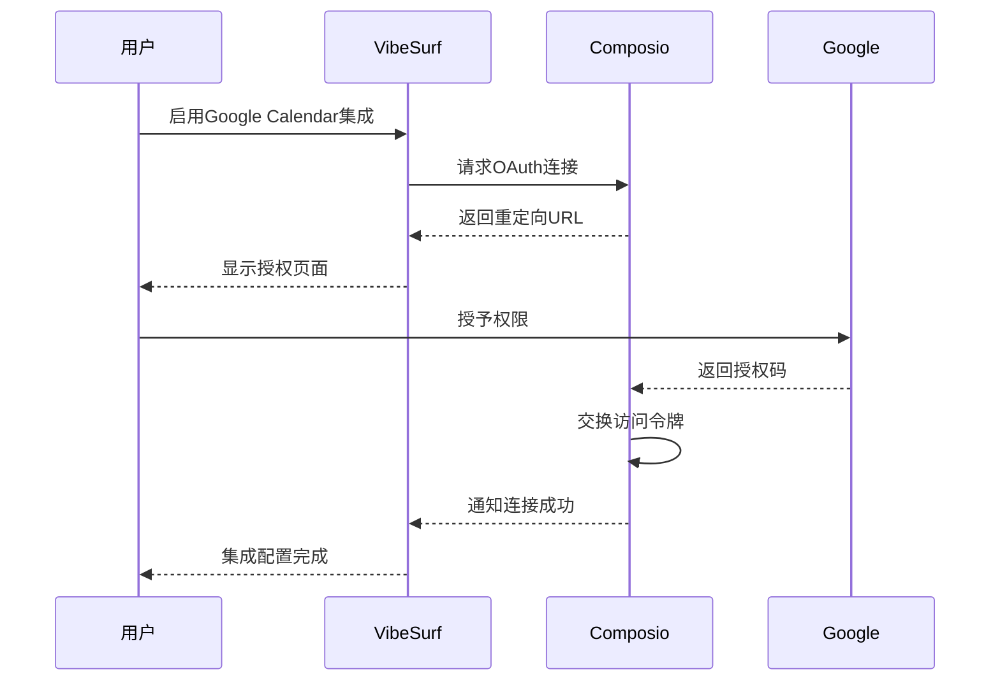
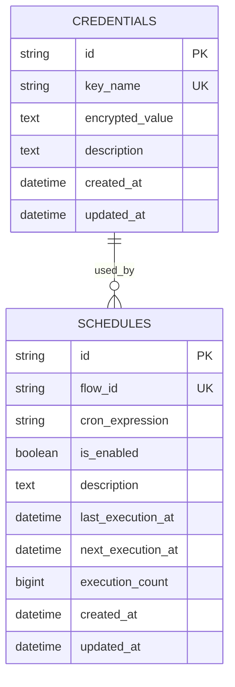
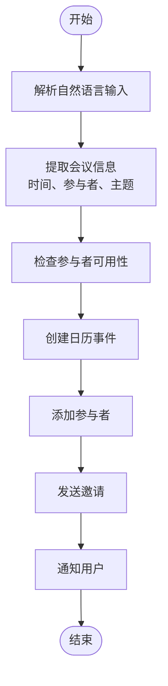
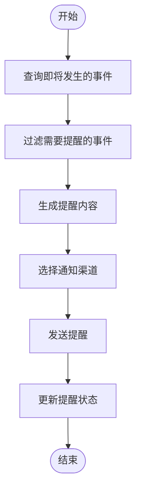
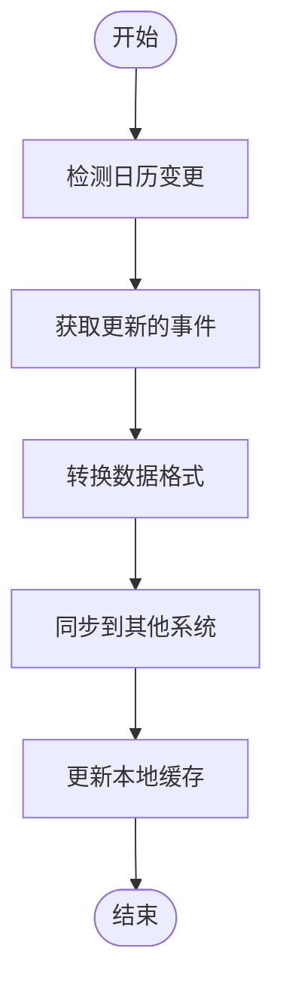

# Google Calendar集成

<cite>
**本文档中引用的文件**   
- [googlecalendar_composio.py](file://vibe_surf/langflow/components/composio/googlecalendar_composio.py)
- [googlecalendar_composio.py](file://vibe_surf/workflows/Integrations/googlecalendar_composio.py)
- [composio_base.py](file://vibe_surf/langflow/base/composio/composio_base.py)
- [composio.py](file://vibe_surf/backend/api/composio.py)
- [models.py](file://vibe_surf/backend/database/models.py)
- [v006_add_credentials_table.sql](file://vibe_surf/backend/database/migrations/v006_add_credentials_table.sql)
- [v007_add_schedule_table.sql](file://vibe_surf/backend/database/migrations/v007_add_schedule_table.sql)
</cite>

## 目录
1. [简介](#简介)
2. [功能特性](#功能特性)
3. [配置指南](#配置指南)
4. [API调用模式](#api调用模式)
5. [常见用例代码示例](#常见用例代码示例)
6. [错误处理机制](#错误处理机制)
7. [结论](#结论)

## 简介

VibeSurf的Google Calendar集成通过Composio平台实现，为用户提供了一套完整的日历管理功能。该集成允许用户通过自然语言指令创建、更新、删除和查询日历事件，支持会议安排、提醒系统和日程同步等常见用例。系统采用OAuth 2.0认证流程确保安全性，并通过数据库持久化存储用户凭证和日程信息。

集成的核心是`ComposioGoogleCalendarAPIComponent`类，它继承自`ComposioBaseComponent`基类，提供了与Google Calendar API交互的标准接口。该组件通过Composio平台作为中间层，将VibeSurf的请求转发到Google Calendar API，实现了安全的API调用和权限管理。

**Section sources**
- [googlecalendar_composio.py](file://vibe_surf/langflow/components/composio/googlecalendar_composio.py#L1-L12)
- [googlecalendar_composio.py](file://vibe_surf/workflows/Integrations/googlecalendar_composio.py#L1-L12)

## 功能特性

VibeSurf的Google Calendar集成提供了全面的日历管理功能，包括事件创建、更新、删除和日程查询。这些功能通过Composio平台的标准化接口实现，确保了与Google Calendar API的兼容性和稳定性。

### 事件创建与管理

系统支持创建包含标题、描述、时间、地点和参与者等完整信息的日历事件。用户可以通过自然语言指令指定事件的详细信息，系统会自动解析并创建相应的日历条目。对于重复性事件，系统支持常见的重复模式，如每日、每周、每月等。

### 日程查询与过滤

集成提供了强大的日程查询功能，用户可以根据时间范围、事件状态、参与者等条件过滤日程。系统支持查询未来事件、过去事件以及特定时间段内的所有事件。查询结果以结构化数据形式返回，便于进一步处理和展示。

### 时区处理

系统内置了完善的时区处理机制，能够正确处理不同时区的事件创建和查询。所有时间戳都以UTC格式存储，并在显示时根据用户的本地时区进行转换，确保了跨时区协作的准确性。

### 并发冲突处理

当多个用户或系统同时修改同一事件时，系统通过版本控制和条件更新机制来处理并发冲突。每次事件更新都会检查当前版本，如果检测到冲突，系统会返回相应的错误信息，提示用户解决冲突。

**Section sources**
- [composio_base.py](file://vibe_surf/langflow/base/composio/composio_base.py#L63-L800)
- [composio.py](file://vibe_surf/backend/api/composio.py#L1-L800)

## 配置指南

### OAuth 2.0认证流程

VibeSurf的Google Calendar集成使用OAuth 2.0协议进行用户身份验证和授权。配置过程分为以下几个步骤：

1. **获取Composio API密钥**：用户首先需要在Composio平台注册并获取API密钥。
2. **验证API密钥**：通过`/composio/verify-key` API端点验证API密钥的有效性。
3. **启动OAuth连接**：调用`/composio/toolkit/googlecalendar/toggle`端点启用Google Calendar集成，系统会返回一个重定向URL。
4. **完成授权**：用户访问重定向URL，在Google的授权页面上授予必要的权限。
5. **建立连接**：授权完成后，系统会建立持久化的连接，后续操作无需重复授权。



**Diagram sources**
- [composio.py](file://vibe_surf/backend/api/composio.py#L531-L728)
- [composio_base.py](file://vibe_surf/langflow/base/composio/composio_base.py#L746-L805)

### 日历权限设置

Google Calendar集成需要以下权限：

- **日历读取权限**：用于查询日程和事件信息
- **日历写入权限**：用于创建、更新和删除事件
- **参与者管理权限**：用于添加和移除事件参与者

这些权限在OAuth授权过程中由用户明确授予，系统遵循最小权限原则，仅请求完成功能所必需的权限。用户可以在Google账户的安全设置中随时查看和撤销这些权限。

**Section sources**
- [composio.py](file://vibe_surf/backend/api/composio.py#L531-L728)
- [models.py](file://vibe_surf/backend/database/models.py#L192-L216)

## API调用模式

### 组件初始化

Google Calendar组件的初始化遵循标准的组件模式。`ComposioGoogleCalendarAPIComponent`类继承自`ComposioBaseComponent`，在初始化时设置默认的输入字段和输出格式。

```python
class ComposioGoogleCalendarAPIComponent(ComposioBaseComponent):
    display_name: str = "Google Calendar"
    icon = "Googlecalendar"
    documentation: str = "https://docs.composio.dev"
    app_name = "googlecalendar"
```

### 动作执行流程

组件的动作执行流程如下：

1. **动作选择**：用户从可用动作列表中选择要执行的操作
2. **参数验证**：系统验证所选动作所需的参数
3. **API调用**：通过Composio平台转发请求到Google Calendar API
4. **结果处理**：将API响应转换为标准格式并返回

### 数据持久化

系统使用SQLite数据库持久化存储关键信息：

- **凭证表**：存储加密的API密钥和其他敏感信息
- **日程表**：存储工作流的调度信息，包括cron表达式和执行状态



**Diagram sources**
- [v006_add_credentials_table.sql](file://vibe_surf/backend/database/migrations/v006_add_credentials_table.sql#L1-L26)
- [v007_add_schedule_table.sql](file://vibe_surf/backend/database/migrations/v007_add_schedule_table.sql#L1-L29)

**Section sources**
- [googlecalendar_composio.py](file://vibe_surf/langflow/components/composio/googlecalendar_composio.py#L1-L12)
- [models.py](file://vibe_surf/backend/database/models.py#L217-L234)

## 常见用例代码示例

### 会议安排



**Diagram sources**
- [composio.py](file://vibe_surf/backend/api/composio.py#L731-L800)

### 提醒系统



**Diagram sources**
- [composio.py](file://vibe_surf/backend/api/composio.py#L731-L800)

### 日程同步



**Diagram sources**
- [composio.py](file://vibe_surf/backend/api/composio.py#L731-L800)

## 错误处理机制

### 认证错误处理

系统对认证相关的错误进行了专门处理：

- **无效API密钥**：返回401状态码，并提示用户重新验证密钥
- **OAuth令牌过期**：自动触发重新授权流程
- **权限不足**：明确告知用户需要授予的权限

### API调用错误

对于API调用过程中的错误，系统采用分层处理策略：

1. **网络错误**：实现重试机制，最多重试3次
2. **限流错误**：根据Google API的限流策略，自动调整请求频率
3. **数据验证错误**：返回详细的错误信息，帮助用户修正输入

### 并发冲突解决

当检测到并发修改冲突时，系统提供以下解决方案：

- **版本检查**：在更新前检查事件的当前版本
- **冲突提示**：向用户显示冲突信息和不同版本的差异
- **合并选项**：提供手动合并或覆盖的选择

**Section sources**
- [composio.py](file://vibe_surf/backend/api/composio.py#L367-L421)
- [composio_base.py](file://vibe_surf/langflow/base/composio/composio_base.py#L791-L805)

## 结论

VibeSurf的Google Calendar集成通过Composio平台提供了一套安全、可靠且功能丰富的日历管理解决方案。系统采用现代化的架构设计，结合OAuth 2.0认证、数据库持久化和错误处理机制，确保了用户体验的流畅性和数据的安全性。

该集成不仅支持基本的事件管理功能，还通过灵活的API调用模式和可扩展的组件设计，为各种复杂用例提供了坚实的基础。未来可以通过增加更多的自动化规则和智能建议功能，进一步提升系统的智能化水平。

[无来源，此部分为总结性内容]