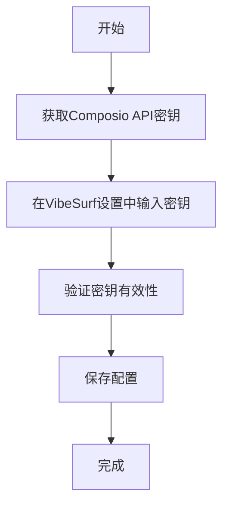
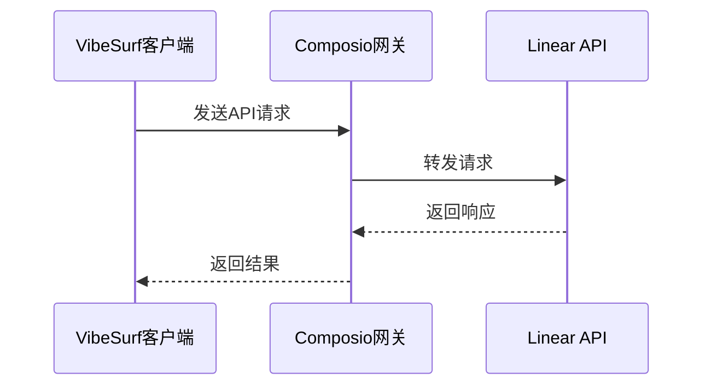
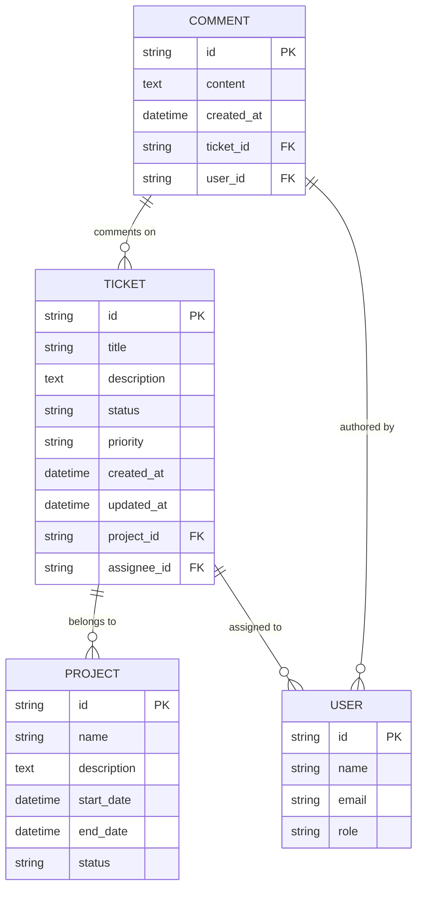
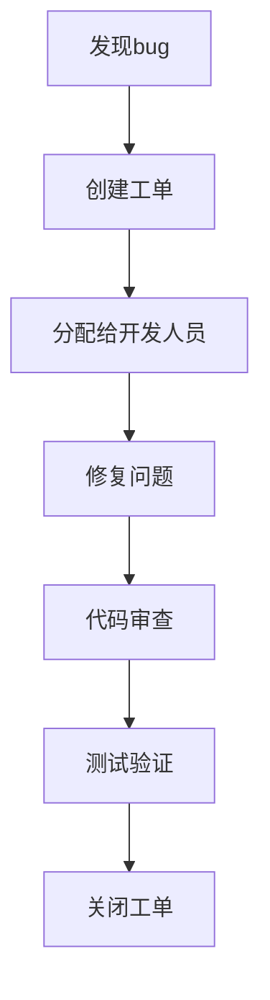

# Linear集成

<cite>
**本文档引用的文件**   
- [linear_composio.py](file://vibe_surf/workflows/Integrations/linear_composio.py)
- [composio_base.py](file://vibe_surf/langflow/base/composio/composio_base.py)
- [composio.py](file://vibe_surf/backend/api/composio.py)
- [models.py](file://vibe_surf/backend/database/models.py)
- [queries.py](file://vibe_surf/backend/database/queries.py)
- [composio_client.py](file://vibe_surf/tools/composio_client.py)
- [linear.jsx](file://vibe_surf/frontend/src/icons/linear/linear.jsx)
- [linear.svg](file://vibe_surf/frontend/src/icons/linear/linear.svg)
</cite>

## 目录
1. [介绍](#介绍)
2. [功能特性](#功能特性)
3. [配置指南](#配置指南)
4. [API调用模式](#api调用模式)
5. [数据结构](#数据结构)
6. [错误处理机制](#错误处理机制)
7. [常见用例](#常见用例)
8. [结论](#结论)

## 介绍

VibeSurf通过Composio平台实现了与Linear的深度集成，为用户提供了一套完整的项目管理和团队协作解决方案。该集成允许用户在VibeSurf环境中直接创建工单、更新状态、管理项目和进行团队协作。通过Composio作为中间件，VibeSurf能够无缝连接Linear API，实现自动化工作流和数据同步。

Linear是一款现代化的项目管理和问题跟踪工具，特别适合软件开发团队使用。VibeSurf的Linear集成使得用户可以在不离开VibeSurf界面的情况下完成各种Linear操作，大大提高了工作效率和用户体验。

**Section sources**
- [linear_composio.py](file://vibe_surf/workflows/Integrations/linear_composio.py#L1-L12)
- [composio_base.py](file://vibe_surf/langflow/base/composio/composio_base.py#L1-L800)

## 功能特性

VibeSurf的Linear集成提供了丰富的功能特性，涵盖了工单管理、项目管理和团队协作的核心需求。

### 工单创建与管理

用户可以通过VibeSurf界面直接创建Linear工单，包括设置工单标题、描述、优先级、标签和分配给特定团队成员。系统支持批量创建工单，可以一次性导入多个任务。创建工单时，用户还可以附加文件、设置截止日期和添加自定义字段。

工单管理功能包括查看工单列表、筛选和排序工单、更新工单状态（如待办、进行中、已完成等）以及添加评论和附件。用户可以在VibeSurf中实时查看工单的最新状态和更新历史。

### 状态更新与工作流自动化

集成支持自动化的状态转换，可以根据预设规则自动更新工单状态。例如，当代码合并请求被批准时，相关工单可以自动从"进行中"状态转换为"待测试"状态。系统还支持自定义工作流，允许用户根据团队的具体需求配置复杂的状态转换逻辑。

状态更新功能还包括通知机制，当工单状态发生变化时，系统会自动通知相关团队成员。用户可以设置个性化的通知偏好，选择通过邮件、Slack或其他渠道接收通知。

### 项目管理

VibeSurf的Linear集成提供了全面的项目管理功能。用户可以创建和管理多个项目，为每个项目设置目标、里程碑和时间线。系统支持甘特图视图，可以直观地展示项目进度和任务依赖关系。

项目管理功能还包括资源分配和负载平衡，帮助项目经理合理分配团队成员的工作量。系统提供项目仪表板，显示关键指标如任务完成率、延期任务数量和团队生产力。

### 团队协作

集成增强了团队协作能力，支持在工单中@提及团队成员、分配任务和进行实时讨论。系统还支持创建团队视图，让团队成员可以专注于自己负责的任务。

协作功能还包括文档共享和知识库集成，团队成员可以在工单上下文内访问相关文档和知识库条目。系统支持版本控制，确保所有团队成员都能访问最新的文档版本。

**Section sources**
- [linear_composio.py](file://vibe_surf/workflows/Integrations/linear_composio.py#L1-L12)
- [composio.py](file://vibe_surf/backend/api/composio.py#L1-L800)

## 配置指南

### API密钥管理

配置Linear集成的第一步是设置Composio API密钥。用户需要在Composio平台注册并获取API密钥，然后在VibeSurf的设置界面中输入该密钥。



**Diagram sources**
- [composio.py](file://vibe_surf/backend/api/composio.py#L367-L421)

### 团队权限设置

团队权限设置是确保数据安全和访问控制的重要环节。VibeSurf支持基于角色的访问控制（RBAC），管理员可以为不同团队成员分配不同的权限级别。

权限设置包括：
- **查看权限**：允许用户查看工单和项目信息
- **编辑权限**：允许用户创建和修改工单
- **管理权限**：允许用户管理项目设置和团队成员
- **管理员权限**：允许用户进行系统级配置

权限可以按项目或团队进行分配，支持细粒度的访问控制。管理员还可以设置权限继承规则，简化权限管理。

**Section sources**
- [composio.py](file://vibe_surf/backend/api/composio.py#L531-L729)
- [models.py](file://vibe_surf/backend/database/models.py#L192-L216)

## API调用模式

VibeSurf通过Composio客户端与Linear API进行交互。API调用模式采用异步设计，确保系统响应性和性能。

### 请求-响应模式

大多数API调用采用标准的请求-响应模式。客户端发送HTTP请求到Composio网关，网关将请求转发到Linear API，然后将响应返回给客户端。



**Diagram sources**
- [composio_client.py](file://vibe_surf/tools/composio_client.py#L60-L116)

### 批量操作模式

对于需要处理大量数据的场景，系统支持批量操作模式。用户可以将多个操作打包成一个批量请求，减少网络开销和提高效率。

批量操作支持事务性语义，确保所有操作要么全部成功，要么全部失败。系统还提供批量操作的状态跟踪，用户可以实时监控批量操作的进度。

### 事件驱动模式

对于实时性要求高的场景，系统支持事件驱动模式。通过Webhook机制，Linear可以在特定事件发生时主动通知VibeSurf。

事件类型包括工单创建、状态变更、评论添加等。VibeSurf接收到事件通知后，可以触发预设的自动化工作流，实现即时响应。

**Section sources**
- [composio_client.py](file://vibe_surf/tools/composio_client.py#L116-L290)

## 数据结构

### 核心数据模型

Linear集成的核心数据模型包括工单、项目、用户和评论等实体。



**Diagram sources**
- [models.py](file://vibe_surf/backend/database/models.py#L192-L216)

### API请求/响应结构

API请求和响应采用JSON格式，遵循RESTful设计原则。

#### 工单创建请求
```json
{
  "title": "修复登录问题",
  "description": "用户无法登录系统",
  "status": "todo",
  "priority": "high",
  "project_id": "proj-123",
  "assignee_id": "user-456"
}
```

#### 工单响应
```json
{
  "id": "ticket-789",
  "title": "修复登录问题",
  "description": "用户无法登录系统",
  "status": "todo",
  "priority": "high",
  "project_id": "proj-123",
  "assignee_id": "user-456",
  "created_at": "2024-01-01T10:00:00Z",
  "updated_at": "2024-01-01T10:00:00Z"
}
```

**Section sources**
- [composio.py](file://vibe_surf/backend/api/composio.py#L43-L80)

## 错误处理机制

### 错误分类

系统将错误分为以下几类：
- **客户端错误**：请求参数无效或缺少必要字段
- **认证错误**：API密钥无效或已过期
- **权限错误**：用户没有执行操作的权限
- **服务器错误**：Linear API内部错误
- **网络错误**：网络连接问题或超时

### 错误响应结构

所有错误响应都遵循统一的结构，便于客户端处理。

```json
{
  "error": {
    "code": "VALIDATION_ERROR",
    "message": "标题字段不能为空",
    "details": [
      {
        "field": "title",
        "issue": "required"
      }
    ]
  }
}
```

### 重试策略

系统实现了智能重试策略，针对不同类型的错误采用不同的处理方式。

- **瞬时错误**：如网络超时，采用指数退避策略进行重试
- **认证错误**：提示用户重新验证API密钥
- **客户端错误**：立即返回错误，不进行重试
- **服务器错误**：根据错误类型决定是否重试

### 数据一致性保障

为确保数据一致性，系统采用了以下机制：
- **事务性操作**：关键操作在数据库事务中执行
- **幂等性设计**：API设计为幂等，重复调用不会产生副作用
- **状态同步**：定期与Linear API同步状态，确保本地数据一致性
- **冲突解决**：检测到数据冲突时，采用版本控制机制解决

**Section sources**
- [composio_client.py](file://vibe_surf/tools/composio_client.py#L197-L238)
- [composio.py](file://vibe_surf/backend/api/composio.py#L367-L421)

## 常见用例

### 问题跟踪

问题跟踪是Linear的核心用例之一。用户可以通过VibeSurf创建和管理问题工单，跟踪问题的整个生命周期。



**Diagram sources**
- [linear_composio.py](file://vibe_surf/workflows/Integrations/linear_composio.py#L1-L12)

### 开发工作流自动化

集成支持自动化开发工作流，将Linear与其他开发工具（如GitHub、Slack）集成。

自动化工作流示例：
1. 当GitHub拉取请求被合并时，自动将相关工单状态更新为"待测试"
2. 当工单状态变为"进行中"时，自动在Slack频道中通知团队
3. 每天生成未完成工单的报告并发送给项目经理

### 项目管理

项目管理用例包括创建项目、分配任务、跟踪进度和生成报告。

关键功能：
- **项目规划**：创建项目里程碑和时间线
- **任务分配**：将任务分配给团队成员
- **进度跟踪**：实时监控项目进度
- **报告生成**：自动生成项目状态报告

**Section sources**
- [composio.py](file://vibe_surf/backend/api/composio.py#L423-L520)

## 结论

VibeSurf的Linear集成提供了一套完整的项目管理和团队协作解决方案。通过Composio平台的中间件支持，实现了与Linear API的无缝集成，为用户提供了丰富的功能特性。

集成的核心优势包括：
- **统一的工作环境**：用户可以在VibeSurf中完成所有Linear操作，无需切换应用
- **自动化工作流**：支持复杂的工作流自动化，提高团队效率
- **实时数据同步**：确保VibeSurf和Linear之间的数据一致性
- **灵活的权限管理**：支持细粒度的访问控制，确保数据安全

未来发展方向包括增强的分析功能、更智能的自动化建议和与其他工具的深度集成。通过持续优化，VibeSurf的Linear集成将成为团队协作和项目管理的强大工具。