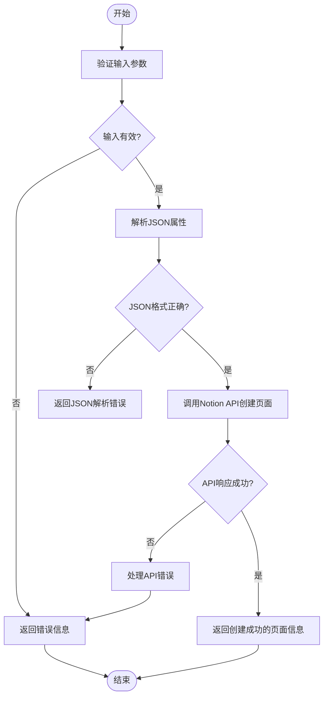
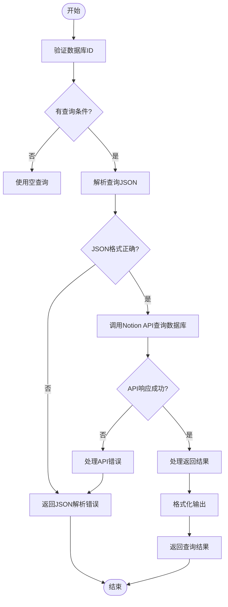
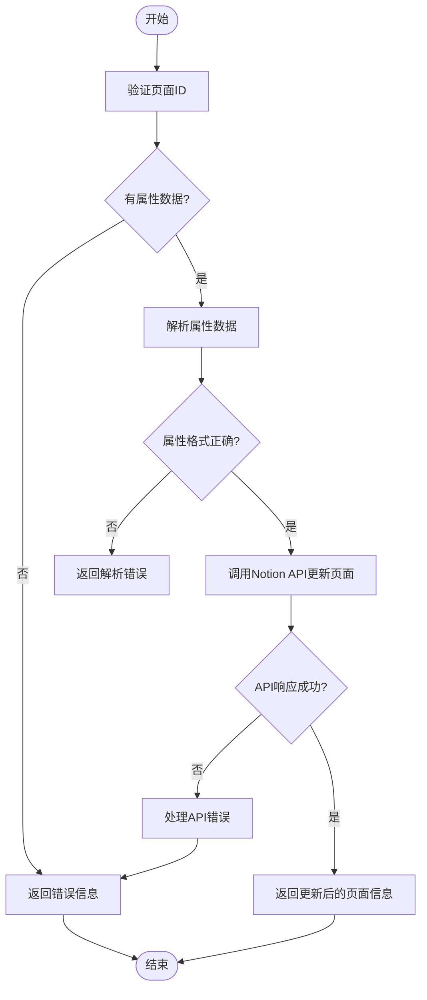
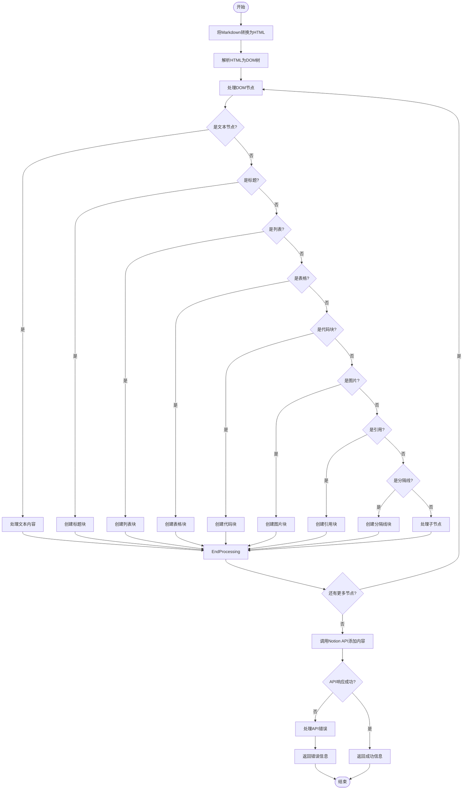
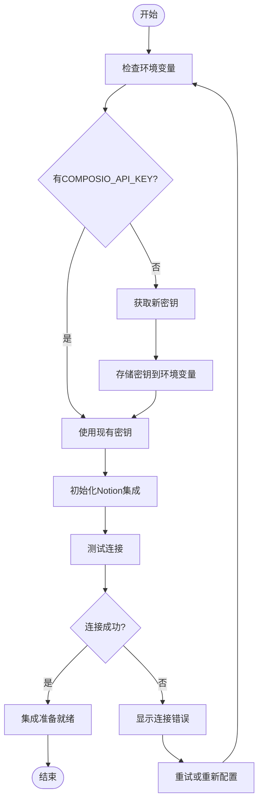
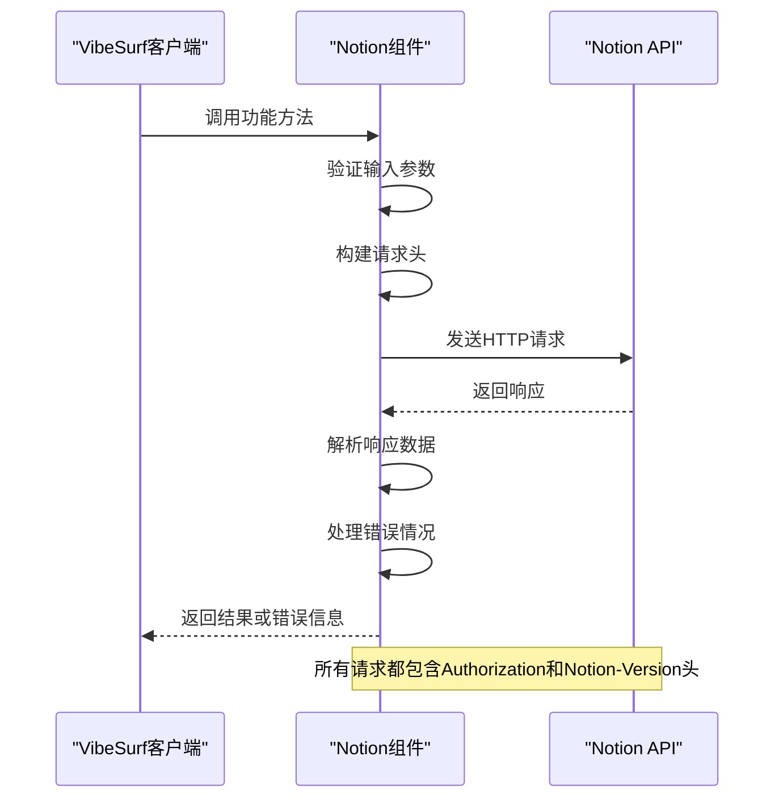
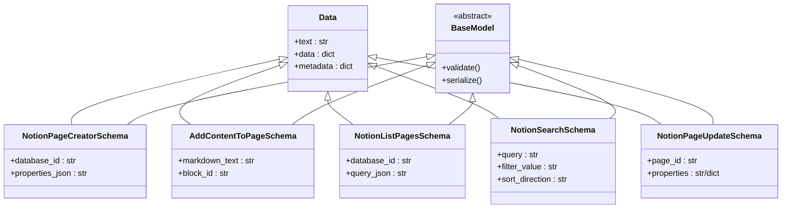
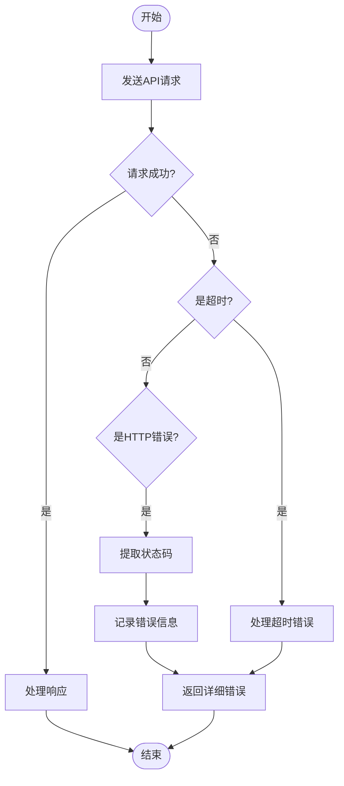
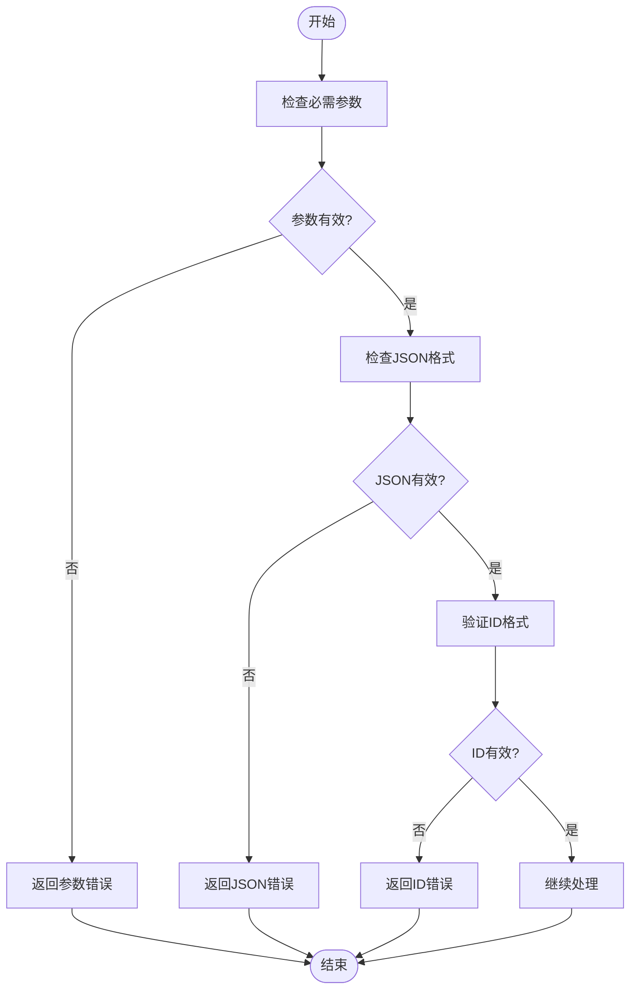

# Notion集成

<cite>
**本文档中引用的文件**  
- [create_page.py](file://vibe_surf/langflow/components/Notion/create_page.py)
- [add_content_to_page.py](file://vibe_surf/langflow/components/Notion/add_content_to_page.py)
- [list_pages.py](file://vibe_surf/langflow/components/Notion/list_pages.py)
- [search.py](file://vibe_surf/langflow/components/Notion/search.py)
- [update_page_property.py](file://vibe_surf/langflow/components/Notion/update_page_property.py)
- [list_database_properties.py](file://vibe_surf/langflow/components/Notion/list_database_properties.py)
- [list_users.py](file://vibe_surf/langflow/components/Notion/list_users.py)
- [page_content_viewer.py](file://vibe_surf/langflow/components/Notion/page_content_viewer.py)
- [README.md](file://README.md)
- [.env.example](file://.env.example)
</cite>

## 目录
1. [简介](#简介)
2. [功能特性](#功能特性)
3. [配置指南](#配置指南)
4. [API调用模式与数据结构](#api调用模式与数据结构)
5. [错误处理机制](#错误处理机制)
6. [常见用例](#常见用例)
7. [总结](#总结)

## 简介

VibeSurf通过Composio集成了Notion，实现了与Notion的深度集成。该集成允许用户在浏览器中直接创建页面、查询数据库、更新内容和操作块级元素。通过这种集成，用户可以将浏览与强大的自动化功能相结合，提高工作效率。

**Section sources**
- [README.md](file://README.md#L143-L144)

## 功能特性

### 页面创建

`NotionPageCreator`组件允许用户在指定的Notion数据库中创建新页面。用户需要提供数据库ID、Notion密钥和页面属性的JSON字符串。该组件会验证输入并发送POST请求到Notion API以创建页面。



**Diagram sources**
- [create_page.py](file://vibe_surf/langflow/components/Notion/create_page.py#L63-L91)

### 数据库查询

`NotionListPages`组件支持对Notion数据库进行查询，包括过滤和排序功能。用户可以提供JSON格式的查询条件来筛选特定的页面。该组件会将查询条件转换为Notion API所需的格式，并返回匹配的页面列表。



**Diagram sources**
- [list_pages.py](file://vibe_surf/langflow/components/Notion/list_pages.py#L96-L117)

### 内容更新

`NotionPageUpdate`组件允许用户更新Notion页面的属性。用户需要提供页面ID、要更新的属性（可以是JSON字符串或字典）以及Notion密钥。该组件会将属性更新请求发送到Notion API。



**Diagram sources**
- [update_page_property.py](file://vibe_surf/langflow/components/Notion/update_page_property.py#L66-L109)

### 块级操作

`AddContentToPage`组件支持将Markdown文本转换为Notion块并添加到指定页面。该组件能够处理多种Markdown元素，包括标题、段落、列表、代码块、表格、引用、分隔线、图片和书签链接。



**Diagram sources**
- [add_content_to_page.py](file://vibe_surf/langflow/components/Notion/add_content_to_page.py#L60-L269)

### 其他功能

除了上述核心功能外，VibeSurf还提供了其他Notion相关功能：

- `NotionSearch`：在所有共享给集成的页面和数据库中搜索
- `NotionDatabaseProperties`：检索Notion数据库的属性
- `NotionUserList`：从Notion检索用户信息
- `NotionPageContent`：以纯文本形式检索Notion页面的内容

**Section sources**
- [create_page.py](file://vibe_surf/langflow/components/Notion/create_page.py#L1-L95)
- [add_content_to_page.py](file://vibe_surf/langflow/components/Notion/add_content_to_page.py#L1-L270)
- [list_pages.py](file://vibe_surf/langflow/components/Notion/list_pages.py#L1-L123)
- [search.py](file://vibe_surf/langflow/components/Notion/search.py#L1-L112)
- [update_page_property.py](file://vibe_surf/langflow/components/Notion/update_page_property.py#L1-L115)
- [list_database_properties.py](file://vibe_surf/langflow/components/Notion/list_database_properties.py#L1-L69)
- [list_users.py](file://vibe_surf/langflow/components/Notion/list_users.py#L1-L78)
- [page_content_viewer.py](file://vibe_surf/langflow/components/Notion/page_content_viewer.py#L1-L94)

## 配置指南

### API密钥管理

要使用Notion集成，用户需要在环境变量中配置Notion API密钥。密钥可以通过`.env`文件或直接在运行时设置。



**Diagram sources**
- [.env.example](file://.env.example#L55)

### 权限设置

Notion集成使用OAuth 2.0进行身份验证。用户需要在Notion开发者门户中创建集成，并授予相应的权限。主要权限包括：

- `pages:write`：创建和更新页面
- `databases:read`：读取数据库内容
- `databases:write`：修改数据库结构
- `users:read`：读取用户信息

**Section sources**
- [README.md](file://README.md#L143-L144)

## API调用模式与数据结构

### API调用模式

所有Notion API调用都遵循相同的模式：

1. 构建带有授权头的HTTP请求
2. 设置正确的Notion版本头
3. 发送请求并处理响应
4. 处理可能的异常情况



**Diagram sources**
- [create_page.py](file://vibe_surf/langflow/components/Notion/create_page.py#L72-L86)
- [list_pages.py](file://vibe_surf/langflow/components/Notion/list_pages.py#L98-L114)

### 数据结构

Notion集成使用标准化的数据结构来处理信息：



**Diagram sources**
- [create_page.py](file://vibe_surf/langflow/components/Notion/create_page.py#L39-L42)
- [add_content_to_page.py](file://vibe_surf/langflow/components/Notion/add_content_to_page.py#L44-L47)
- [list_pages.py](file://vibe_surf/langflow/components/Notion/list_pages.py#L47-L53)
- [search.py](file://vibe_surf/langflow/components/Notion/search.py#L47-L51)
- [update_page_property.py](file://vibe_surf/langflow/components/Notion/update_page_property.py#L40-L44)

## 错误处理机制

### 速率限制

Notion API有速率限制，VibeSurf通过以下方式处理：

- 使用10秒的请求超时
- 捕获HTTP异常并提供详细的错误信息
- 在错误消息中包含状态码和响应体



**Diagram sources**
- [create_page.py](file://vibe_surf/langflow/components/Notion/create_page.py#L87-L91)
- [list_pages.py](file://vibe_surf/langflow/components/Notion/list_pages.py#L116-L117)

### 数据验证

VibeSurf在调用API之前进行严格的数据验证：

- 验证必需的输入参数
- 验证JSON格式的正确性
- 验证数据库和页面ID的有效性



**Diagram sources**
- [create_page.py](file://vibe_surf/langflow/components/Notion/create_page.py#L64-L70)
- [update_page_property.py](file://vibe_surf/langflow/components/Notion/update_page_property.py#L75-L81)

## 常见用例

### 知识库同步

通过Notion集成，可以实现知识库的自动同步。例如，将研究结果自动保存到Notion数据库中。

```python
# 伪代码示例
notion_creator = NotionPageCreator()
result = notion_creator.create_notion_page(
    database_id="your-database-id",
    properties_json='{"Name": {"title": [{"text": {"content": "New Research"}}]}}'
)
```

### 任务管理

可以将任务从其他系统同步到Notion，实现统一的任务管理。

```python
# 伪代码示例
notion_updater = NotionPageUpdate()
result = notion_updater.update_notion_page(
    page_id="your-page-id",
    properties={"Status": {"select": {"name": "Done"}}}
)
```

### 内容发布

可以将Markdown格式的内容批量发布到Notion页面。

```python
# 伪代码示例
content_adder = AddContentToPage()
result = content_adder.add_content_to_notion_page(
    markdown_text="# 标题\n\n这是内容",
    block_id="your-page-id"
)
```

**Section sources**
- [create_page.py](file://vibe_surf/langflow/components/Notion/create_page.py)
- [update_page_property.py](file://vibe_surf/langflow/components/Notion/update_page_property.py)
- [add_content_to_page.py](file://vibe_surf/langflow/components/Notion/add_content_to_page.py)

## 总结

VibeSurf的Notion集成提供了全面的功能，包括页面创建、数据库查询、内容更新和块级操作。通过合理的配置和使用，用户可以实现各种自动化工作流，提高工作效率。集成遵循标准的API调用模式，具有完善的错误处理机制，确保了系统的稳定性和可靠性。