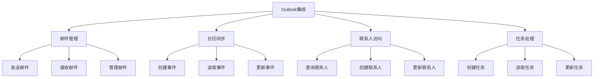
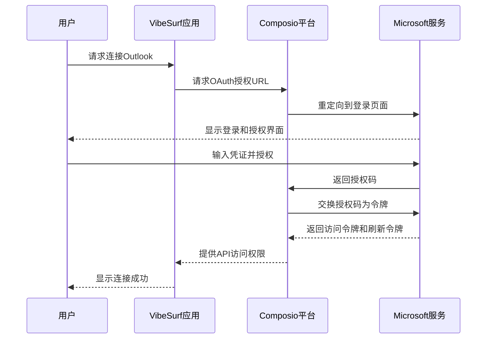
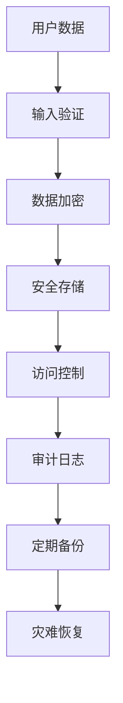

# Outlook集成

<cite>
**本文档引用的文件**
- [outlook_composio.py](file://vibe_surf/workflows/Integrations/outlook_composio.py)
- [outlook_composio.py](file://vibe_surf/langflow/components/composio/outlook_composio.py)
- [composio_base.py](file://vibe_surf/langflow/base/composio/composio_base.py)
- [composio_client.py](file://vibe_surf/tools/composio_client.py)
- [outlook.jsx](file://vibe_surf/frontend/src/icons/outlook/outlook.jsx)
- [index.tsx](file://vibe_surf/frontend/src/icons/outlook/index.tsx)
- [v006_add_credentials_table.sql](file://vibe_surf/backend/database/migrations/v006_add_credentials_table.sql)
</cite>

## 目录
1. [简介](#简介)
2. [功能特性](#功能特性)
3. [认证与权限](#认证与权限)
4. [API调用模式](#api调用模式)
5. [数据格式](#数据格式)
6. [错误处理策略](#错误处理策略)
7. [配置指南](#配置指南)
8. [代码示例](#代码示例)
9. [混合环境兼容性](#混合环境兼容性)
10. [数据隐私](#数据隐私)

## 简介
VibeSurf的Outlook集成功能通过Composio平台实现了与Microsoft Outlook的深度集成，为用户提供了一套完整的邮件管理、日历同步、联系人访问和任务处理解决方案。该集成基于Composio API，通过OAuth 2.0认证机制安全地连接用户的Outlook账户，允许应用程序执行各种操作而无需直接处理用户的敏感凭证。

Outlook集成作为VibeSurf平台的一部分，与其他集成（如Gmail、Google Calendar等）采用统一的架构设计，确保了开发和使用的一致性。该集成不仅提供了基本的邮件和日历功能，还支持高级的企业级应用场景，如企业邮件自动化、日程安排和客户关系管理。

**Section sources**
- [outlook_composio.py](file://vibe_surf/workflows/Integrations/outlook_composio.py#L1-L11)
- [outlook_composio.py](file://vibe_surf/langflow/components/composio/outlook_composio.py#L1-L11)

## 功能特性
VibeSurf的Outlook集成提供了全面的功能集，涵盖了邮件管理、日历同步、联系人访问和任务处理等核心业务需求。

### 邮件管理
Outlook集成支持完整的邮件操作功能，包括发送、接收、读取和管理电子邮件。用户可以通过集成接口发送带有附件的邮件，查询收件箱中的邮件，以及管理邮件标签和状态。邮件管理功能特别适用于企业邮件自动化场景，如自动回复客户咨询、发送定期报告和处理批量邮件。

### 日历同步
日历同步功能允许用户创建、读取、更新和删除日历事件，实现跨平台的日程管理。该功能支持设置会议邀请、添加会议议程和管理会议参与者，适用于日程安排和会议管理等场景。通过与VibeSurf的其他功能结合，可以实现智能日程规划和自动会议安排。

### 联系人访问
联系人访问功能提供了对Outlook联系人列表的读写权限，允许应用程序查询、创建和更新联系人信息。这对于客户关系管理（CRM）系统集成特别有用，可以实现客户信息的自动同步和更新，确保销售团队始终拥有最新的客户资料。

### 任务处理
任务处理功能支持创建、读取、更新和删除Outlook任务，帮助用户管理待办事项和项目进度。该功能可以与项目管理工具集成，实现任务的自动创建和状态更新，提高团队协作效率。



**Diagram sources**
- [outlook_composio.py](file://vibe_surf/workflows/Integrations/outlook_composio.py#L1-L11)
- [outlook_composio.py](file://vibe_surf/langflow/components/composio/outlook_composio.py#L1-L11)

## 认证与权限
Outlook集成采用OAuth 2.0认证机制，确保用户数据的安全性和隐私保护。认证流程通过Composio平台管理，用户无需直接提供其Microsoft账户凭证。

### 认证流程
认证流程始于用户在VibeSurf界面中选择连接Outlook账户。系统会生成一个OAuth授权URL，引导用户到Microsoft的登录页面进行身份验证。用户成功登录并授权后，Microsoft会返回一个授权码，该码被交换为访问令牌和刷新令牌。这些令牌由Composio平台安全存储，并用于后续的API调用。



**Diagram sources**
- [composio_base.py](file://vibe_surf/langflow/base/composio/composio_base.py#L752-L888)
- [composio_client.py](file://vibe_surf/tools/composio_client.py#L1-L458)

### 权限范围
Outlook集成的权限范围由Composio平台定义，并在用户授权时明确告知。权限包括邮件读写、日历管理、联系人访问和任务处理等。用户可以查看并控制授予应用程序的具体权限，确保最小权限原则得到遵守。

**Section sources**
- [composio_base.py](file://vibe_surf/langflow/base/composio/composio_base.py#L752-L888)
- [composio_client.py](file://vibe_surf/tools/composio_client.py#L1-L458)

## API调用模式
Outlook集成的API调用模式基于Composio SDK，采用异步执行的方式，确保高效和响应性。

### 调用架构
API调用通过VibeSurf的工具注册机制实现，每个Outlook功能都被注册为一个可调用的动作。当用户或应用程序请求执行某个操作时，VibeSurf会通过Composio客户端调用相应的API端点。调用过程中，参数被验证和格式化，然后通过安全的HTTPS连接发送到Microsoft Graph API。

### 异步处理
所有API调用都是异步的，允许应用程序在等待响应的同时继续执行其他任务。这提高了整体性能和用户体验，特别是在处理大量数据或长时间运行的操作时。

**Section sources**
- [composio_client.py](file://vibe_surf/tools/composio_client.py#L60-L300)
- [composio_base.py](file://vibe_surf/langflow/base/composio/composio_base.py#L1204-L1289)

## 数据格式
Outlook集成使用JSON作为主要的数据交换格式，确保与各种系统和平台的兼容性。

### 请求格式
API请求采用标准的JSON格式，包含必要的参数和元数据。参数根据具体操作而变化，但通常包括目标ID、操作类型和数据负载。请求头包含认证令牌和内容类型信息。

### 响应格式
API响应也采用JSON格式，包含操作结果、状态码和可能的错误信息。成功响应通常包含操作生成的数据或确认信息，而错误响应则提供详细的错误描述和建议的解决方案。

**Section sources**
- [composio_client.py](file://vibe_surf/tools/composio_client.py#L300-L319)
- [composio_base.py](file://vibe_surf/langflow/base/composio/composio_base.py#L1273-L1284)

## 错误处理策略
Outlook集成实现了全面的错误处理策略，确保系统的稳定性和可靠性。

### 错误分类
错误被分类为客户端错误、服务器错误和网络错误。客户端错误通常由于无效的请求参数或权限不足引起，服务器错误表示Microsoft服务端的问题，而网络错误则与连接问题相关。

### 重试机制
对于临时性错误，如网络超时或服务暂时不可用，系统实现了智能重试机制。重试策略包括指数退避和最大重试次数限制，以避免对服务造成过大压力。

### 日志记录
所有错误都被详细记录，包括错误类型、时间戳、相关操作和上下文信息。这些日志可用于故障排除、性能分析和安全审计。

**Section sources**
- [composio_client.py](file://vibe_surf/tools/composio_client.py#L217-L221)
- [composio_base.py](file://vibe_surf/langflow/base/composio/composio_base.py#L1286-L1288)

## 配置指南
配置Outlook集成需要完成几个关键步骤，包括API密钥设置、连接授权和功能启用。

### API密钥配置
首先，需要在VibeSurf设置中输入有效的Composio API密钥。该密钥用于身份验证和授权，确保应用程序有权访问Composio平台和其集成的服务。

### 连接授权
在API密钥配置完成后，用户可以通过点击"连接"按钮启动OAuth授权流程。系统会引导用户完成Microsoft账户的登录和授权过程，完成后Outlook集成即被激活。

### 功能启用
连接成功后，用户可以在VibeSurf界面中选择和配置具体的Outlook功能，如邮件模板、日历同步频率和联系人同步规则。

**Section sources**
- [outlook_composio.py](file://vibe_surf/workflows/Integrations/outlook_composio.py#L1-L11)
- [composio_base.py](file://vibe_surf/langflow/base/composio/composio_base.py#L838-L1160)

## 代码示例
以下代码示例展示了如何在VibeSurf中使用Outlook集成实现常见用例。

### 企业邮件自动化
```python
# 示例：发送批量客户通知邮件
async def send_bulk_notifications():
    # 获取客户列表
    contacts = await get_outlook_contacts()
    
    # 为每个客户发送个性化邮件
    for contact in contacts:
        await send_outlook_email(
            to=contact.email,
            subject="重要通知：服务更新",
            body=f"亲爱的{contact.name}，我们很高兴通知您...",
            attachments=["service_update.pdf"]
        )
```

### 日程安排
```python
# 示例：创建团队会议
async def schedule_team_meeting():
    await create_outlook_calendar_event(
        title="季度业务回顾",
        start_time="2024-01-15T10:00:00",
        end_time="2024-01-15T11:30:00",
        attendees=[
            "manager@company.com",
            "team1@company.com",
            "team2@company.com"
        ],
        location="在线会议",
        body="本次会议将回顾上季度业绩并规划下季度目标。"
    )
```

### 客户关系管理
```python
# 示例：同步CRM客户数据到Outlook
async def sync_crm_contacts():
    # 从CRM系统获取最新客户数据
    crm_contacts = await get_crm_contacts()
    
    # 同步到Outlook联系人
    for contact in crm_contacts:
        await upsert_outlook_contact(
            name=contact.name,
            email=contact.email,
            phone=contact.phone,
            company=contact.company,
            job_title=contact.job_title
        )
```

**Section sources**
- [composio_client.py](file://vibe_surf/tools/composio_client.py#L185-L299)
- [composio_base.py](file://vibe_surf/langflow/base/composio/composio_base.py#L1204-L1289)

## 混合环境兼容性
Outlook集成设计时考虑了混合环境的兼容性，确保在不同部署场景下都能正常工作。

### 云与本地部署
集成支持云部署和本地部署两种模式。在云部署中，所有组件都运行在云端服务器上；在本地部署中，关键组件可以运行在本地服务器上，确保数据不出内网。

### 跨平台支持
Outlook集成通过标准的API接口实现，支持Windows、macOS和Linux等不同操作系统。前端界面采用响应式设计，适配桌面和移动设备。

**Section sources**
- [composio_base.py](file://vibe_surf/langflow/base/composio/composio_base.py#L1-L1305)
- [composio_client.py](file://vibe_surf/tools/composio_client.py#L1-L458)

## 数据隐私
数据隐私是Outlook集成设计的核心原则之一，采取了多项措施保护用户数据。

### 数据加密
所有敏感数据，包括API密钥和用户凭证，都使用强加密算法进行加密存储。传输过程中的数据也通过TLS加密，防止中间人攻击。

### 最小权限原则
集成遵循最小权限原则，只请求执行特定功能所需的最低权限。用户可以查看和管理授予的权限，确保对数据访问的完全控制。

### 数据存储
用户数据存储在安全的数据库中，访问受到严格控制。数据库采用定期备份和灾难恢复机制，确保数据的完整性和可用性。



**Diagram sources**
- [v006_add_credentials_table.sql](file://vibe_surf/backend/database/migrations/v006_add_credentials_table.sql#L1-L26)
- [composio_base.py](file://vibe_surf/langflow/base/composio/composio_base.py#L1-L1305)