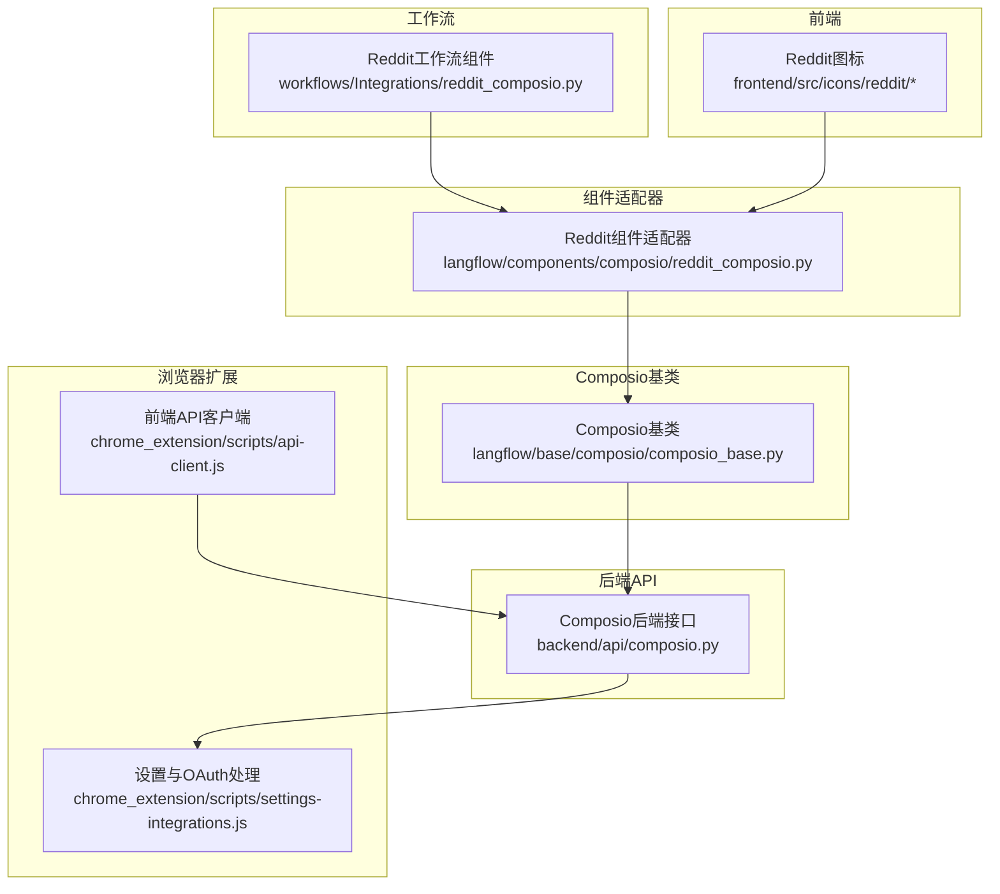
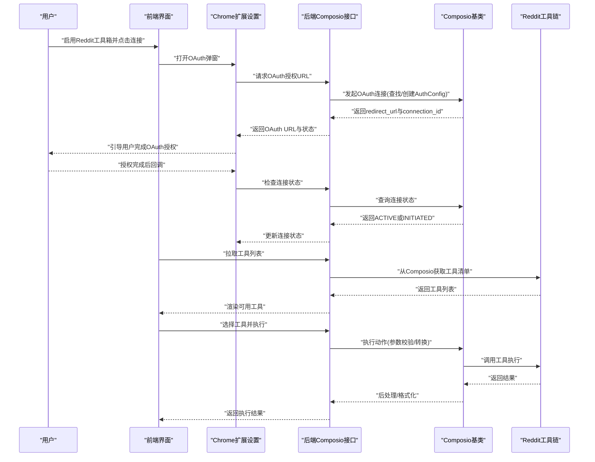
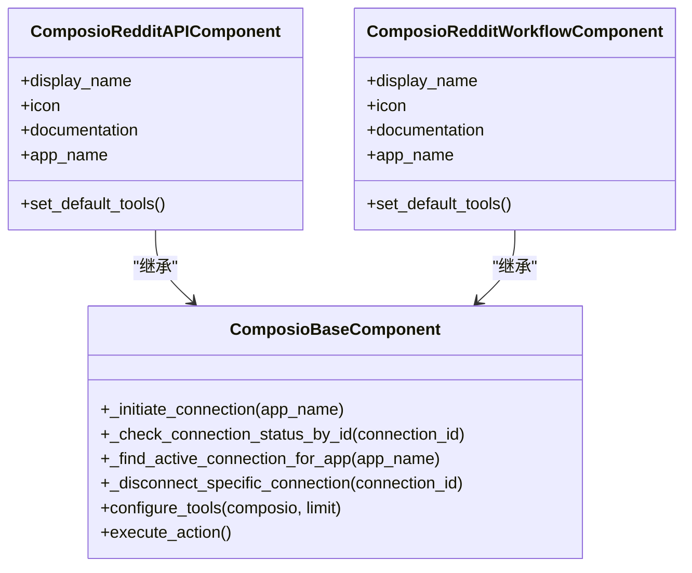

# Reddit集成

<cite>
**本文引用的文件**
- [reddit_composio.py](file://vibe_surf/workflows/Integrations/reddit_composio.py)
- [reddit_composio.py](file://vibe_surf/langflow/components/composio/reddit_composio.py)
- [composio_base.py](file://vibe_surf/langflow/base/composio/composio_base.py)
- [composio.py](file://vibe_surf/backend/api/composio.py)
- [settings-integrations.js](file://vibe_surf/chrome_extension/scripts/settings-integrations.js)
- [api-client.js](file://vibe_surf/chrome_extension/scripts/api-client.js)
- [errors.py](file://vibe_surf/langflow/base/agents/errors.py)
- [client.py](file://vibe_surf/tools/website_api/weibo/client.py)
- [index.tsx](file://vibe_surf/frontend/src/icons/reddit/index.tsx)
- [reddit.jsx](file://vibe_surf/frontend/src/icons/reddit/reddit.jsx)
</cite>

## 目录
1. [简介](#简介)
2. [项目结构](#项目结构)
3. [核心组件](#核心组件)
4. [架构总览](#架构总览)
5. [详细组件分析](#详细组件分析)
6. [依赖关系分析](#依赖关系分析)
7. [性能与限流](#性能与限流)
8. [故障排查指南](#故障排查指南)
9. [结论](#结论)
10. [附录：配置与使用示例](#附录配置与使用示例)

## 简介
本文件系统性记录VibeSurf中的Reddit集成实现，基于Composio工具链完成Reddit能力接入。文档覆盖以下方面：
- 功能特性：通过Reddit工具链实现“帖子抓取、评论监控、社区管理、内容发布”等能力的抽象与扩展路径
- 配置指南：OAuth认证流程、应用权限设置、前端与后端关键配置点
- 常见用例：市场调研、舆情监控、社区互动的典型工作流
- API调用模式、数据结构与错误处理：连接状态、工具列表、执行参数、异常类型
- 速率限制与内容审核：平台限流策略与项目内通用错误处理实践

## 项目结构
Reddit集成在本仓库中以“工作流组件 + 组件适配器 + Composio基类 + 后端API + 前端图标”的分层方式组织，核心文件如下：
- 工作流层：定义Reddit组件类，继承自Composio基础组件
- 组件适配器层：Langflow组件注册与Reddit适配
- Composio基类层：OAuth连接发起、状态检查、工具加载与执行
- 后端API层：工具箱启用/禁用、OAuth授权URL生成、工具列表同步
- 前端层：Reddit图标资源
- 扩展支持：Chrome扩展脚本负责OAuth弹窗与确认交互

图表来源
- [reddit_composio.py](file://vibe_surf/workflows/Integrations/reddit_composio.py#L1-L12)
- [reddit_composio.py](file://vibe_surf/langflow/components/composio/reddit_composio.py#L1-L12)
- [composio_base.py](file://vibe_surf/langflow/base/composio/composio_base.py#L750-L1139)
- [composio.py](file://vibe_surf/backend/api/composio.py#L580-L779)
- [settings-integrations.js](file://vibe_surf/chrome_extension/scripts/settings-integrations.js#L657-L704)
- [api-client.js](file://vibe_surf/chrome_extension/scripts/api-client.js#L43-L136)
- [index.tsx](file://vibe_surf/frontend/src/icons/reddit/index.tsx#L1-L9)
- [reddit.jsx](file://vibe_surf/frontend/src/icons/reddit/reddit.jsx#L1-L13)

章节来源
- [reddit_composio.py](file://vibe_surf/workflows/Integrations/reddit_composio.py#L1-L12)
- [reddit_composio.py](file://vibe_surf/langflow/components/composio/reddit_composio.py#L1-L12)
- [composio_base.py](file://vibe_surf/langflow/base/composio/composio_base.py#L750-L1139)
- [composio.py](file://vibe_surf/backend/api/composio.py#L580-L779)
- [settings-integrations.js](file://vibe_surf/chrome_extension/scripts/settings-integrations.js#L657-L704)
- [api-client.js](file://vibe_surf/chrome_extension/scripts/api-client.js#L43-L136)
- [index.tsx](file://vibe_surf/frontend/src/icons/reddit/index.tsx#L1-L9)
- [reddit.jsx](file://vibe_surf/frontend/src/icons/reddit/reddit.jsx#L1-L13)

## 核心组件
- Reddit工作流组件
  - 定义Reddit组件类，设置显示名、图标、文档链接与应用名
  - 作为工作流入口，承载Reddit相关动作的默认配置
  - 参考路径：[Reddit工作流组件](file://vibe_surf/workflows/Integrations/reddit_composio.py#L1-L12)

- Reddit组件适配器
  - 在Langflow组件注册表中暴露Reddit组件，便于在可视化流程中使用
  - 参考路径：[Reddit组件适配器](file://vibe_surf/langflow/components/composio/reddit_composio.py#L1-L12)

- Composio基类
  - 提供OAuth连接发起、状态查询、活动连接查找、断开连接等通用能力
  - 负责工具列表加载、动作映射、参数校验与执行
  - 参考路径：[OAuth连接发起与状态检查](file://vibe_surf/langflow/base/composio/composio_base.py#L752-L802)、[连接状态轮询与复用](file://vibe_surf/langflow/base/composio/composio_base.py#L940-L1139)、[工具执行与参数处理](file://vibe_surf/langflow/base/composio/composio_base.py#L1204-L1289)

- 后端Composio API
  - 提供工具箱启用/禁用、OAuth授权URL生成、工具列表同步、健康检查等接口
  - 参考路径：[启用/禁用工具箱与OAuth生成](file://vibe_surf/backend/api/composio.py#L580-L779)、[状态查询与实例重建](file://vibe_surf/backend/api/composio.py#L225-L354)

- 前端Reddit图标
  - 提供Reddit品牌色与SVG图标资源，用于界面展示
  - 参考路径：[Reddit图标组件](file://vibe_surf/frontend/src/icons/reddit/index.tsx#L1-L9)、[SVG路径](file://vibe_surf/frontend/src/icons/reddit/reddit.jsx#L1-L13)

章节来源
- [reddit_composio.py](file://vibe_surf/workflows/Integrations/reddit_composio.py#L1-L12)
- [reddit_composio.py](file://vibe_surf/langflow/components/composio/reddit_composio.py#L1-L12)
- [composio_base.py](file://vibe_surf/langflow/base/composio/composio_base.py#L752-L1289)
- [composio.py](file://vibe_surf/backend/api/composio.py#L225-L354)
- [index.tsx](file://vibe_surf/frontend/src/icons/reddit/index.tsx#L1-L9)
- [reddit.jsx](file://vibe_surf/frontend/src/icons/reddit/reddit.jsx#L1-L13)

## 架构总览
下图展示了从用户触发到Reddit工具执行的整体流程，以及与Composio后端的交互：

图表来源
- [composio.py](file://vibe_surf/backend/api/composio.py#L580-L779)
- [composio_base.py](file://vibe_surf/langflow/base/composio/composio_base.py#L752-L1139)
- [settings-integrations.js](file://vibe_surf/chrome_extension/scripts/settings-integrations.js#L657-L704)

## 详细组件分析

### Reddit工作流组件
- 角色定位：作为工作流层的Reddit组件入口，负责设置组件元信息与默认工具集合
- 关键字段
  - 显示名：Reddit
  - 图标：Reddit
  - 文档链接：Composio官方文档
  - 应用名：reddit
- 默认工具：预留扩展点，可在子类中补充具体动作

参考路径
- [Reddit工作流组件](file://vibe_surf/workflows/Integrations/reddit_composio.py#L1-L12)

章节来源
- [reddit_composio.py](file://vibe_surf/workflows/Integrations/reddit_composio.py#L1-L12)

### Reddit组件适配器
- 角色定位：在Langflow组件注册表中暴露Reddit组件，便于在可视化流程中直接使用
- 注册映射：包含Reddit在内的多个平台组件统一注册

参考路径
- [Reddit组件适配器](file://vibe_surf/langflow/components/composio/reddit_composio.py#L1-L12)

章节来源
- [reddit_composio.py](file://vibe_surf/langflow/components/composio/reddit_composio.py#L1-L12)

### Composio基类：OAuth与工具执行
- OAuth连接发起
  - 列举/创建OAuth2认证配置
  - 发起连接并返回重定向URL与连接ID
  - 校验重定向URL与连接ID有效性
- 连接状态管理
  - 查找已存在的ACTIVE连接
  - 通过连接ID查询状态(INITIATED/ACTIVE/UNKNOWN)
  - 断开指定连接
- 工具加载与执行
  - 从Composio获取工具清单并构建动作映射
  - 参数校验与类型转换(数组、布尔、字符串等)
  - 执行动作并应用后处理器

参考路径
- [OAuth连接发起与校验](file://vibe_surf/langflow/base/composio/composio_base.py#L752-L802)
- [连接状态轮询与复用](file://vibe_surf/langflow/base/composio/composio_base.py#L940-L1139)
- [工具执行与参数处理](file://vibe_surf/langflow/base/composio/composio_base.py#L1204-L1289)

章节来源
- [composio_base.py](file://vibe_surf/langflow/base/composio/composio_base.py#L752-L1289)

### 后端Composio API：工具箱与OAuth
- 工具箱启用/禁用
  - 生成OAuth授权URL(若需要)
  - 若已连接则拉取工具清单并持久化
  - 返回连接状态与提示信息
- 工具列表同步
  - 先查数据库缓存，再回源Composio API拉取并保存
- 健康检查
  - 检查API Key状态与实例可用性

参考路径
- [启用/禁用工具箱与OAuth生成](file://vibe_surf/backend/api/composio.py#L580-L779)
- [状态查询与实例重建](file://vibe_surf/backend/api/composio.py#L225-L354)

章节来源
- [composio.py](file://vibe_surf/backend/api/composio.py#L225-L354)
- [composio.py](file://vibe_surf/backend/api/composio.py#L580-L779)

### 前端OAuth与设置交互
- OAuth弹窗与确认
  - 打开OAuth URL并在新标签页中进行授权
  - 弹出OAuth确认模态框，等待用户完成授权
- API客户端
  - 统一的请求封装，含重试、超时、错误分类与抛出

参考路径
- [OAuth弹窗与确认](file://vibe_surf/chrome_extension/scripts/settings-integrations.js#L657-L704)
- [前端API客户端](file://vibe_surf/chrome_extension/scripts/api-client.js#L43-L136)

章节来源
- [settings-integrations.js](file://vibe_surf/chrome_extension/scripts/settings-integrations.js#L657-L704)
- [api-client.js](file://vibe_surf/chrome_extension/scripts/api-client.js#L43-L136)

### 数据模型与响应结构
- 工具箱响应模型
  - 字段：id、name、slug、description、logo、app_url、enabled、tools、connection_status、created_at、updated_at
- 工具箱切换响应模型
  - 字段：success、message、enabled、requires_oauth、oauth_url、connected、connection_status
- 工具列表响应模型
  - 字段：toolkit_slug、tools、total_tools
- 连接状态响应模型
  - 字段：toolkit_slug、connected、connection_id、status、last_checked

参考路径
- [Composio后端接口模型定义](file://vibe_surf/backend/api/composio.py#L31-L101)

章节来源
- [composio.py](file://vibe_surf/backend/api/composio.py#L31-L101)

## 依赖关系分析
- 组件耦合
  - Reddit工作流组件依赖Reddit组件适配器
  - 组件适配器依赖Composio基类
  - 后端API依赖Composio基类与数据库查询
  - 前端设置脚本与API客户端共同驱动OAuth流程
- 外部依赖
  - Composio SDK与工具链
  - 浏览器扩展API(打开新标签页、模态框)
- 潜在循环依赖
  - 当前结构采用单向依赖，未发现循环

图表来源
- [composio_base.py](file://vibe_surf/langflow/base/composio/composio_base.py#L752-L1289)
- [reddit_composio.py](file://vibe_surf/langflow/components/composio/reddit_composio.py#L1-L12)
- [reddit_composio.py](file://vibe_surf/workflows/Integrations/reddit_composio.py#L1-L12)

## 性能与限流
- 平台限流
  - Reddit平台可能对API访问施加速率限制；建议在调用频率上增加退避与节流策略
- 项目内通用实践
  - 错误分类与重试：前端API客户端对4xx不重试，5xx与特定错误进行指数退避重试
  - 速率检测：部分模块内置速率限制检测逻辑，可借鉴到Reddit工具执行中
- 建议
  - 对Reddit工具执行增加请求计数与时间窗口统计
  - 在工具执行前加入退避与队列控制，避免触发平台限流

参考路径
- [前端API客户端重试与错误分类](file://vibe_surf/chrome_extension/scripts/api-client.js#L43-L136)
- [速率限制检测示例](file://vibe_surf/workflows/Recruitment/boss_zhipin/anti_detection.py#L201-L238)

章节来源
- [api-client.js](file://vibe_surf/chrome_extension/scripts/api-client.js#L43-L136)
- [anti_detection.py](file://vibe_surf/workflows/Recruitment/boss_zhipin/anti_detection.py#L201-L238)

## 故障排查指南
- OAuth失败
  - 现象：无法获取OAuth URL或连接状态异常
  - 排查要点：检查Composio API Key是否有效、AuthConfig是否存在、连接ID是否正确
  - 参考路径：[OAuth连接发起与状态检查](file://vibe_surf/langflow/base/composio/composio_base.py#L752-L802)、[工具箱切换与OAuth生成](file://vibe_surf/backend/api/composio.py#L580-L779)
- 工具列表为空
  - 现象：工具箱已连接但无可用工具
  - 排查要点：确认已拉取并缓存工具清单；检查Composio工具链是否返回工具
  - 参考路径：[工具列表同步](file://vibe_surf/backend/api/composio.py#L731-L779)
- 执行失败
  - 现象：动作执行报错或返回失败
  - 排查要点：核对参数类型与必填项；查看后处理器输出；检查平台返回错误
  - 参考路径：[工具执行与参数处理](file://vibe_surf/langflow/base/composio/composio_base.py#L1204-L1289)
- 错误类型
  - 自定义错误类型：聚合多种SDK的错误类型，便于统一处理
  - 参考路径：[自定义错误类型](file://vibe_surf/langflow/base/agents/errors.py#L1-L15)

章节来源
- [composio_base.py](file://vibe_surf/langflow/base/composio/composio_base.py#L752-L1289)
- [composio.py](file://vibe_surf/backend/api/composio.py#L580-L779)
- [errors.py](file://vibe_surf/langflow/base/agents/errors.py#L1-L15)

## 结论
VibeSurf通过Composio工具链实现了Reddit能力的可插拔接入，具备完善的OAuth连接管理、工具清单同步与动作执行能力。当前仓库中Reddit组件以“工作流组件 + 组件适配器”的形式存在，结合后端API与前端设置脚本，形成从授权到执行的完整闭环。后续可在工具默认集合、参数校验与限流策略等方面进一步完善，以满足市场调研、舆情监控与社区互动等场景需求。

## 附录：配置与使用示例

### OAuth认证流程与应用权限设置
- 步骤概览
  - 在后端验证并存储Composio API Key
  - 启用Reddit工具箱，后端生成OAuth授权URL
  - 前端打开OAuth弹窗，用户完成授权
  - 后端轮询连接状态，待ACTIVE后拉取工具清单
- 关键接口
  - 工具箱启用/禁用与OAuth生成：[启用/禁用工具箱与OAuth生成](file://vibe_surf/backend/api/composio.py#L580-L779)
  - 连接状态检查：[连接状态轮询与复用](file://vibe_surf/langflow/base/composio/composio_base.py#L940-L1139)
  - OAuth弹窗与确认：[OAuth弹窗与确认](file://vibe_surf/chrome_extension/scripts/settings-integrations.js#L657-L704)

章节来源
- [composio.py](file://vibe_surf/backend/api/composio.py#L580-L779)
- [composio_base.py](file://vibe_surf/langflow/base/composio/composio_base.py#L940-L1139)
- [settings-integrations.js](file://vibe_surf/chrome_extension/scripts/settings-integrations.js#L657-L704)

### 常见用例与工作流示意
- 市场调研
  - 使用Reddit工具抓取目标话题下的帖子与评论，进行情感与主题分析
  - 参考路径：[工具执行与参数处理](file://vibe_surf/langflow/base/composio/composio_base.py#L1204-L1289)
- 舆情监控
  - 定期拉取关键词相关帖子，识别负面趋势并触发告警
  - 参考路径：[工具列表同步](file://vibe_surf/backend/api/composio.py#L731-L779)
- 社区互动
  - 基于模板化内容自动回复或私信，需注意平台审核与限流
  - 参考路径：[OAuth与连接状态管理](file://vibe_surf/langflow/base/composio/composio_base.py#L752-L1139)

章节来源
- [composio_base.py](file://vibe_surf/langflow/base/composio/composio_base.py#L752-L1289)
- [composio.py](file://vibe_surf/backend/api/composio.py#L731-L779)

### API调用模式与数据结构
- 工具箱启用/禁用
  - 请求体：enabled、force_reauth
  - 响应体：success、message、enabled、requires_oauth、oauth_url、connected、connection_status
  - 参考路径：[工具箱切换响应模型](file://vibe_surf/backend/api/composio.py#L65-L80)
- 工具列表
  - 请求：/toolkit/{slug}/tools
  - 响应：toolkit_slug、tools、total_tools
  - 参考路径：[工具列表响应模型](file://vibe_surf/backend/api/composio.py#L82-L87)
- 连接状态
  - 响应体：toolkit_slug、connected、connection_id、status、last_checked
  - 参考路径：[连接状态响应模型](file://vibe_surf/backend/api/composio.py#L94-L101)

章节来源
- [composio.py](file://vibe_surf/backend/api/composio.py#L65-L101)

### 错误处理机制
- 自定义错误类型
  - 聚合多种SDK的错误类型，便于统一捕获与上报
  - 参考路径：[自定义错误类型](file://vibe_surf/langflow/base/agents/errors.py#L1-L15)
- 前端API客户端
  - 对4xx不重试，5xx与特定错误进行重试；超时与网络异常统一处理
  - 参考路径：[前端API客户端](file://vibe_surf/chrome_extension/scripts/api-client.js#L43-L136)
- 平台限流与内容审核
  - 建议在工具执行前加入限流与审核策略，必要时引入退避与队列
  - 参考路径：[速率限制检测示例](file://vibe_surf/workflows/Recruitment/boss_zhipin/anti_detection.py#L201-L238)

章节来源
- [errors.py](file://vibe_surf/langflow/base/agents/errors.py#L1-L15)
- [api-client.js](file://vibe_surf/chrome_extension/scripts/api-client.js#L43-L136)
- [anti_detection.py](file://vibe_surf/workflows/Recruitment/boss_zhipin/anti_detection.py#L201-L238)