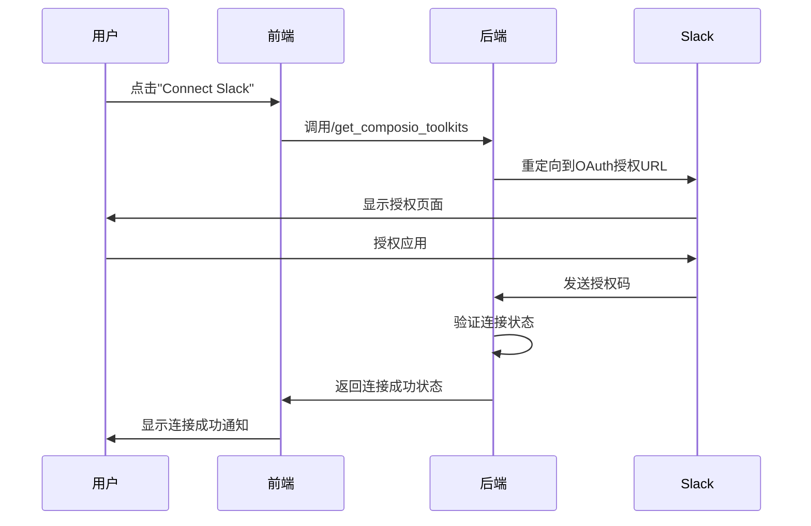
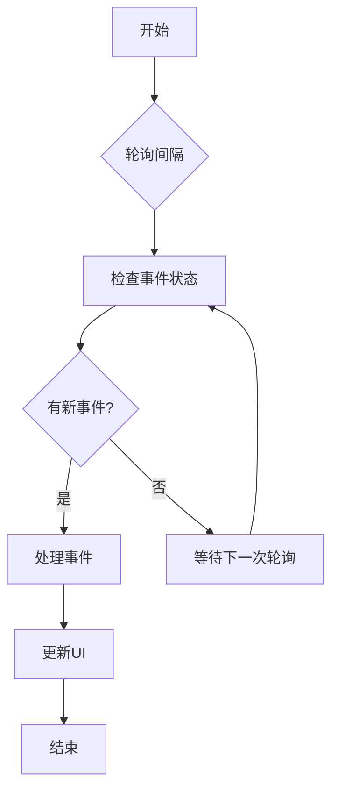
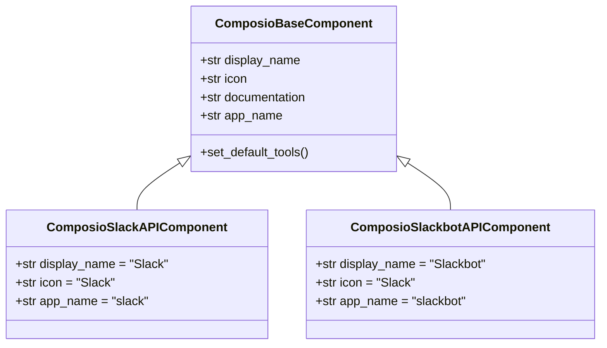
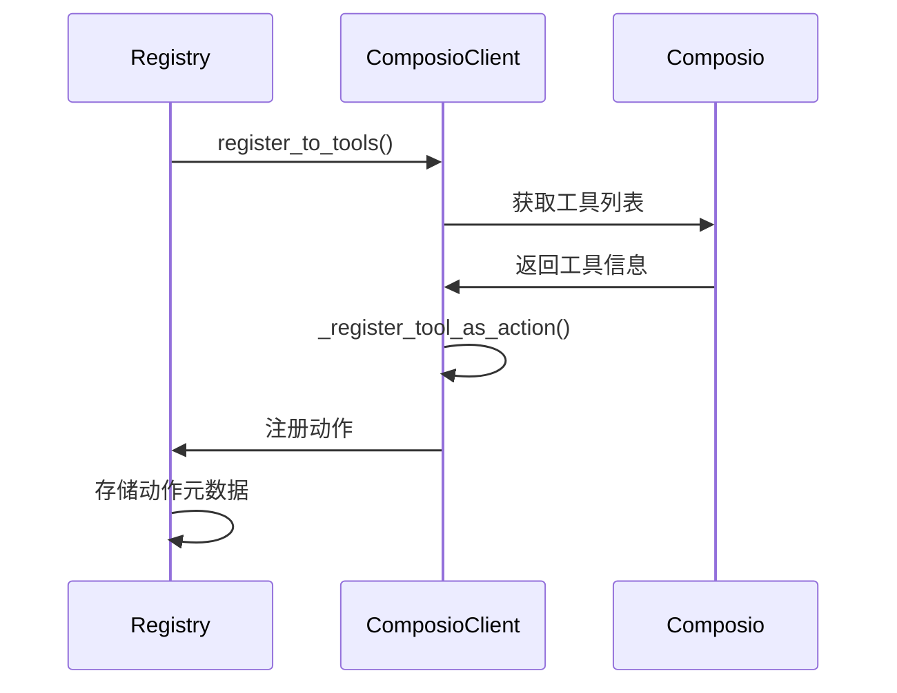
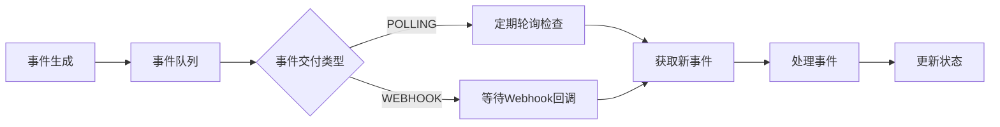
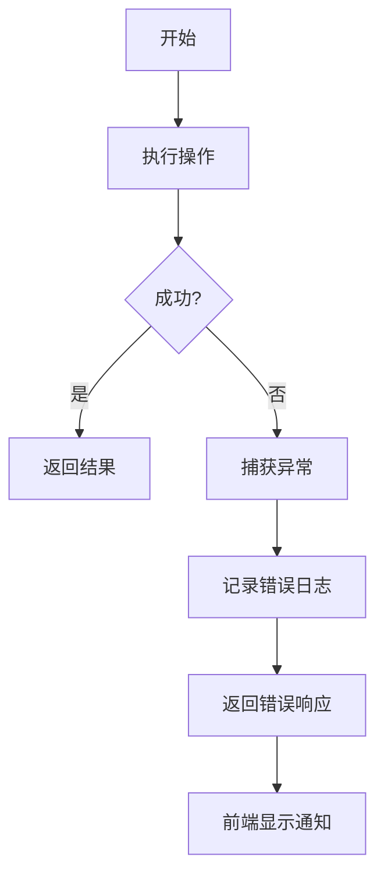
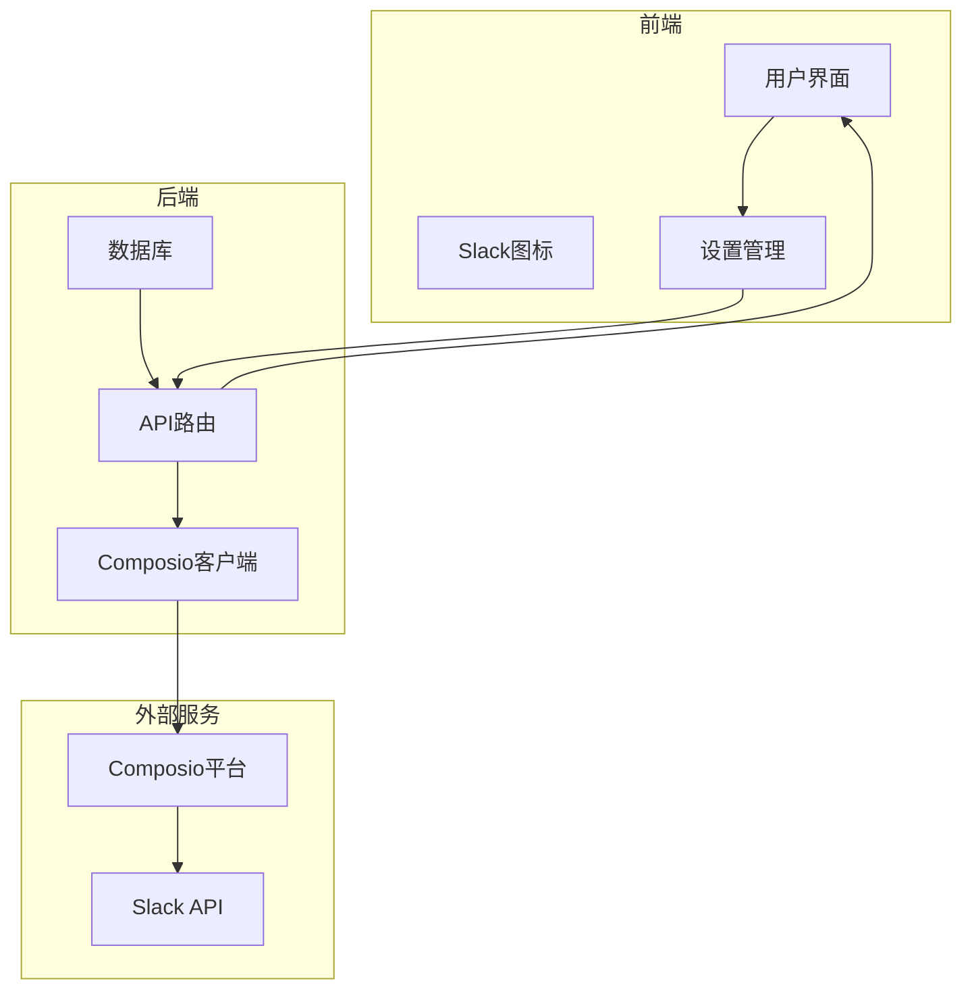
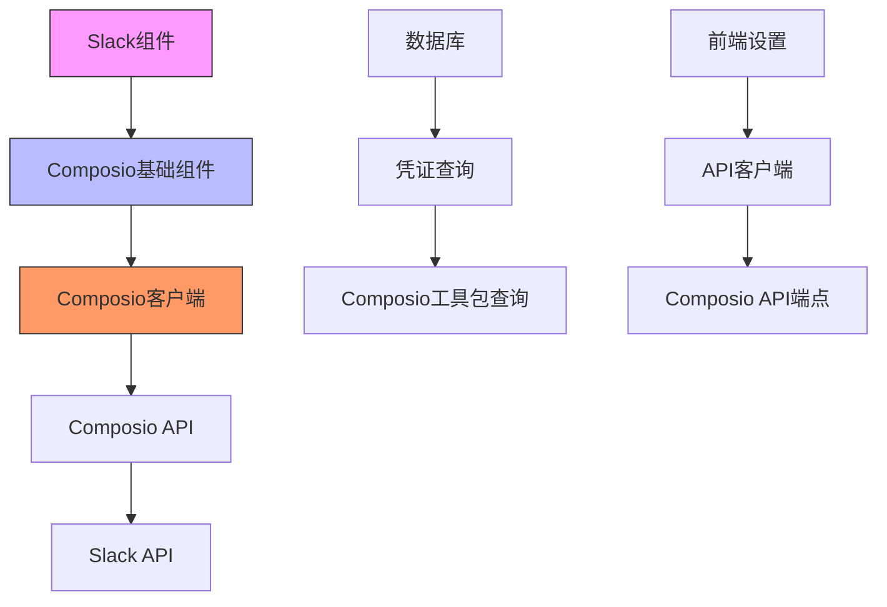

# Slack集成

<cite>
**本文档引用文件**   
- [slack_composio.py](file://vibe_surf/langflow/components/composio/slack_composio.py)
- [slackbot_composio.py](file://vibe_surf/langflow/components/composio/slackbot_composio.py)
- [composio_base.py](file://vibe_surf/langflow/base/composio/composio_base.py)
- [composio_client.py](file://vibe_surf/tools/composio_client.py)
- [composio.py](file://vibe_surf/backend/api/composio.py)
- [models.py](file://vibe_surf/backend/database/models.py)
- [queries.py](file://vibe_surf/backend/database/queries.py)
- [settings-integrations.js](file://vibe_surf/chrome_extension/scripts/settings-integrations.js)
- [api-client.js](file://vibe_surf/chrome_extension/scripts/api-client.js)
- [SlackIcon.jsx](file://vibe_surf/frontend/src/icons/Slack/SlackIcon.jsx)
</cite>

## 目录
1. [简介](#简介)
2. [功能特性](#功能特性)
3. [配置指南](#配置指南)
4. [API调用模式](#api调用模式)
5. [事件订阅机制](#事件订阅机制)
6. [错误处理策略](#错误处理策略)
7. [常见用例示例](#常见用例示例)
8. [架构概述](#架构概述)
9. [依赖关系分析](#依赖关系分析)

## 简介
VibeSurf的Slack集成通过Composio平台实现，提供了全面的Slack API功能访问。该集成允许用户通过OAuth 2.0认证连接Slack工作区，并使用Slack API执行各种操作，包括消息发送、频道管理、文件共享和互动式消息。集成分为两个主要组件：Slack组件用于直接API调用，Slackbot组件用于模拟用户操作。

**本文档引用文件**   
- [slack_composio.py](file://vibe_surf/langflow/components/composio/slack_composio.py)
- [slackbot_composio.py](file://vibe_surf/langflow/components/composio/slackbot_composio.py)
- [composio_base.py](file://vibe_surf/langflow/base/composio/composio_base.py)

## 功能特性
VibeSurf的Slack集成提供了以下核心功能：

### 消息发送
支持通过Slack API发送消息到指定频道或用户。用户可以使用`chat.postMessage`等工具发送文本消息，支持Markdown格式和消息块（message blocks）。

### 频道管理
提供对Slack频道的全面管理功能，包括创建、加入、离开和归档频道。支持公共频道和私有频道（群组）的操作。

### 文件共享
允许上传文件到Slack并与团队成员共享。支持多种文件格式，并可指定文件上传的目标频道或用户。

### 互动式消息
支持创建包含按钮、下拉菜单等交互元素的消息，实现与用户的动态交互。可以通过消息操作处理用户响应。

### 工具选择
系统优先推荐使用Composio工具而非浏览器自动化来执行API-based任务，因为直接API调用效率更高。

**本文档引用文件**   
- [slack_composio.py](file://vibe_surf/langflow/components/composio/slack_composio.py)
- [slackbot_composio.py](file://vibe_surf/langflow/components/composio/slackbot_composio.py)
- [composio_base.py](file://vibe_surf/langflow/base/composio/composio_base.py)

## 配置指南
### Slack应用权限
Slack集成使用Composio平台管理权限，需要以下权限配置：

- **API密钥管理**：系统通过`COMPOSIO_API_KEY`环境变量或数据库存储的加密凭证管理API访问。
- **OAuth流程**：通过Composio的OAuth 2.0流程连接Slack工作区，用户需要授权应用访问其Slack工作区。

### OAuth流程
1. 用户在设置界面点击"Connect"按钮
2. 系统通过`handleOAuthFlow`方法打开OAuth授权页面
3. 用户完成Slack授权后，系统通过`handleOAuthCompleted`方法验证连接状态
4. 连接成功后，相关工具将变为可用状态

**Diagram sources**
- [settings-integrations.js](file://vibe_surf/chrome_extension/scripts/settings-integrations.js#L658-L742)
- [composio.py](file://vibe_surf/backend/api/composio.py#L531-L719)

### Webhook设置
系统使用轮询机制检查事件交付状态，可通过`utilityStore`中的`webhookPollingInterval`配置轮询间隔，默认为5000毫秒。

**Diagram sources**
- [utilityStore.ts](file://vibe_surf/frontend/src/stores/utilityStore.ts#L42-L44)
- [settings-workflow.js](file://vibe_surf/chrome_extension/scripts/settings-workflow.js#L1456-L1497)

**本文档引用文件**   
- [settings-integrations.js](file://vibe_surf/chrome_extension/scripts/settings-integrations.js)
- [api-client.js](file://vibe_surf/chrome_extension/scripts/api-client.js)
- [composio.py](file://vibe_surf/backend/api/composio.py)
- [utilityStore.ts](file://vibe_surf/frontend/src/stores/utilityStore.ts)

## API调用模式
### 组件结构
Slack集成基于`ComposioBaseComponent`构建，采用面向对象的设计模式：

**Diagram sources**
- [composio_base.py](file://vibe_surf/langflow/base/composio/composio_base.py#L63-L800)
- [slack_composio.py](file://vibe_surf/langflow/components/composio/slack_composio.py#L3-L12)
- [slackbot_composio.py](file://vibe_surf/langflow/components/composio/slackbot_composio.py#L3-L12)

### 工具注册
通过`ComposioClient`类将Composio工具注册为VibeSurf动作：

**Diagram sources**
- [composio_client.py](file://vibe_surf/tools/composio_client.py#L60-L296)
- [composio_base.py](file://vibe_surf/langflow/base/composio/composio_base.py#L116-L733)

**本文档引用文件**   
- [composio_client.py](file://vibe_surf/tools/composio_client.py)
- [composio_base.py](file://vibe_surf/langflow/base/composio/composio_base.py)

## 事件订阅机制
系统采用轮询模式检查事件状态，通过`eventDelivery`配置事件交付方式：

**Diagram sources**
- [utilityStore.ts](file://vibe_surf/frontend/src/stores/utilityStore.ts#L48-L50)
- [settings-workflow.js](file://vibe_surf/chrome_extension/scripts/settings-workflow.js#L1456-L1497)

**本文档引用文件**   
- [utilityStore.ts](file://vibe_surf/frontend/src/stores/utilityStore.ts)
- [settings-workflow.js](file://vibe_surf/chrome_extension/scripts/settings-workflow.js)

## 错误处理策略
系统实现了多层次的错误处理机制：

### 前端错误处理
- OAuth流程错误：显示错误通知
- API调用错误：捕获异常并显示警告
- 连接状态检查：验证OAuth连接是否被检测到

### 后端错误处理
- API密钥验证：检查密钥有效性
- 数据库操作：捕获并记录数据库异常
- 外部API调用：处理Composio API调用异常

**Diagram sources**
- [settings-integrations.js](file://vibe_surf/chrome_extension/scripts/settings-integrations.js#L673-L739)
- [composio.py](file://vibe_surf/backend/api/composio.py#L367-L413)

**本文档引用文件**   
- [settings-integrations.js](file://vibe_surf/chrome_extension/scripts/settings-integrations.js)
- [composio.py](file://vibe_surf/backend/api/composio.py)

## 常见用例示例
### 团队通知
自动向指定Slack频道发送团队通知，如任务完成、系统状态更新等。

### 自动化报告
定期生成报告并通过Slack分享给团队成员，支持文件附件和格式化消息。

### 聊天机器人
创建交互式聊天机器人，响应用户查询并执行相应操作。

**本文档引用文件**   
- [slack_composio.py](file://vibe_surf/langflow/components/composio/slack_composio.py)
- [slackbot_composio.py](file://vibe_surf/langflow/components/composio/slackbot_composio.py)

## 架构概述

**Diagram sources**
- [SlackIcon.jsx](file://vibe_surf/frontend/src/icons/Slack/SlackIcon.jsx#L1-L29)
- [composio.py](file://vibe_surf/backend/api/composio.py#L21-L1048)
- [models.py](file://vibe_surf/backend/database/models.py#L192-L215)

## 依赖关系分析
系统各组件之间的依赖关系如下：

**Diagram sources**
- [models.py](file://vibe_surf/backend/database/models.py#L192-L215)
- [queries.py](file://vibe_surf/backend/database/queries.py)
- [composio.py](file://vibe_surf/backend/api/composio.py)

**本文档引用文件**   
- [models.py](file://vibe_surf/backend/database/models.py)
- [queries.py](file://vibe_surf/backend/database/queries.py)
- [composio.py](file://vibe_surf/backend/api/composio.py)